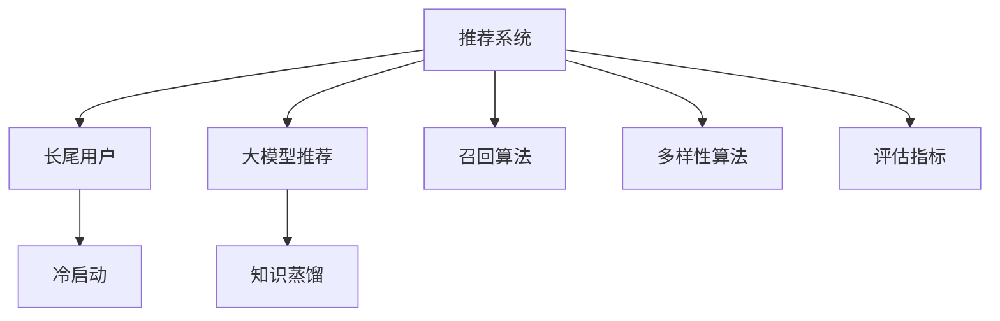

                 

# 基于大模型的推荐系统长尾用户激活策略

## 1. 背景介绍

在推荐系统的演进过程中，传统的召回策略已经无法满足用户多样化的需求。长尾用户，尤其是冷启动用户，在推荐算法中逐渐成为重要的研究焦点。如何更精准地激活长尾用户，提升整体用户的满意度，成为推荐系统面临的巨大挑战。近年来，随着深度学习技术和大规模预训练模型的兴起，基于大模型的推荐系统成为一种新兴的解决方案。本文将围绕大模型推荐系统的长尾用户激活策略展开讨论，并介绍相关技术原理、实现方法和应用案例。

## 2. 核心概念与联系

### 2.1 核心概念概述

在推荐系统领域，核心概念主要包括：

- 推荐系统：根据用户的历史行为和特征，为用户推荐感兴趣的物品。
- 长尾用户：使用频率低，但具有潜在价值的少数用户。
- 冷启动：新用户或新物品进入系统时，缺乏历史行为信息，难以进行有效推荐。
- 大模型推荐：利用大语言模型或大深度神经网络进行推荐决策，提升推荐效果和泛化能力。
- 知识蒸馏：通过预训练模型和微调模型的融合，实现知识传递和迁移。

### 2.2 核心概念原理和架构的 Mermaid 流程图



此图展示了推荐系统从召回算法到最终评估指标的各个关键环节。长尾用户通过大模型推荐激活，而冷启动用户则依赖知识蒸馏进行推荐。在大模型推荐的基础上，还加入了多样性算法和评估指标，进一步提升推荐效果。

## 3. 核心算法原理 & 具体操作步骤

### 3.1 算法原理概述

基于大模型的推荐系统，其核心原理在于利用大规模预训练模型捕捉用户行为和物品属性之间的潜在关系，并通过微调机制进一步提升推荐效果。具体而言，通过以下几个步骤：

1. **预训练模型选择**：选择适合的预训练模型，如BERT、GPT、深度神经网络等。
2. **特征提取**：将用户历史行为和物品属性提取为向量表示，作为模型的输入。
3. **微调优化**：在用户-物品对上微调模型，优化推荐效果。
4. **知识蒸馏**：通过预训练模型对微调模型的蒸馏，实现知识迁移和共享。
5. **评估与优化**：使用多种评估指标（如召回率、精确率、多样性等）对推荐结果进行评估和优化。

### 3.2 算法步骤详解

以下是基于大模型的推荐系统长尾用户激活策略的具体步骤：

**Step 1: 数据预处理**

- 收集用户历史行为数据，如浏览记录、点击记录、评分记录等。
- 对用户历史行为进行标准化处理，转化为向量表示。
- 收集物品属性信息，如标签、类别、评分等。
- 对物品属性进行向量化处理，提取特征。

**Step 2: 选择预训练模型**

- 选择合适的预训练模型，如BERT、GPT、深度神经网络等。
- 将预训练模型的权重进行加载，作为初始参数。

**Step 3: 微调优化**

- 设计任务适配层，如添加全连接层、softmax层等。
- 使用用户-物品对作为监督信号，对模型进行微调优化。
- 调整学习率、批大小、迭代轮数等超参数，确保微调效果。

**Step 4: 知识蒸馏**

- 对预训练模型和微调模型进行知识蒸馏，提升微调模型的泛化能力。
- 使用蒸馏层进行知识传递，将预训练模型中的知识融合到微调模型中。

**Step 5: 评估与优化**

- 设计多种评估指标，如召回率、精确率、多样性等，对推荐结果进行评估。
- 根据评估结果，调整微调模型的参数，进一步提升推荐效果。
- 结合用户反馈，不断优化推荐算法。

### 3.3 算法优缺点

基于大模型的推荐系统具有以下优点：

- 强大的泛化能力：预训练模型在大规模数据上学习到的知识，可以迁移到长尾用户的推荐中。
- 高效的特征提取：大模型能够自动提取高维特征，减少了手工设计的特征工程工作量。
- 灵活的微调机制：微调机制可以根据用户行为和物品属性的变化，实时调整模型参数，提升推荐效果。

同时，基于大模型的推荐系统也存在以下缺点：

- 计算资源需求高：大模型推荐需要较大的计算资源和存储空间，增加了系统成本。
- 冷启动问题：新用户和物品缺乏历史行为数据，难以进行有效推荐。
- 数据隐私问题：预训练模型和微调模型可能面临数据隐私泄露的风险。

### 3.4 算法应用领域

基于大模型的推荐系统在多个领域都有应用，例如：

- 电子商务推荐：为电商平台上的用户推荐感兴趣的商品。
- 内容推荐：为新闻、视频、音乐等平台推荐内容。
- 社交网络推荐：为用户推荐朋友、兴趣群组等。
- 在线教育推荐：为在线学习平台推荐课程和学习资源。

这些应用场景都需要精准激活长尾用户，提升推荐效果。

## 4. 数学模型和公式 & 详细讲解 & 举例说明

### 4.1 数学模型构建

在基于大模型的推荐系统中，我们构建一个通用的推荐模型 $M$，输入为 $X$（用户历史行为和物品属性），输出为 $Y$（推荐物品）。推荐模型的目标函数为：

$$
L(M; X, Y) = \mathcal{L}(Y, M(X))
$$

其中 $\mathcal{L}$ 为损失函数，$Y$ 为推荐物品。

### 4.2 公式推导过程

在推荐模型的训练过程中，我们使用交叉熵损失函数进行优化。设 $M$ 为预训练模型，$M^*$ 为微调后的模型，$Y$ 为推荐物品，则推荐模型的损失函数为：

$$
\mathcal{L}(M^*, Y) = -\sum_{y \in Y} p(y) \log \hat{p}(y)
$$

其中 $p(y)$ 为推荐物品的概率分布，$\hat{p}(y)$ 为模型预测的概率分布。

在微调过程中，我们添加任务适配层，如全连接层和softmax层，将输入 $X$ 映射为推荐物品的概率分布：

$$
\hat{p}(y) = \sigma(W_{\theta}X + b_{\theta})
$$

其中 $W_{\theta}$ 和 $b_{\theta}$ 为微调模型的参数，$\sigma$ 为激活函数。

### 4.3 案例分析与讲解

以一个简单的电子商务推荐为例，假设用户的历史行为为 $X = [1, 0, 1, 0, 1]$，代表用户对不同商品感兴趣。推荐物品的属性为 $Y = [0.2, 0.5, 0.3]$，代表不同商品的热度。微调模型输出的概率分布为 $M(X) = [0.1, 0.5, 0.4]$，代表推荐物品的概率。

通过计算交叉熵损失：

$$
\mathcal{L}(M^*, Y) = -[0.2\log(0.1) + 0.5\log(0.5) + 0.3\log(0.4)] = -1.7
$$

在微调优化过程中，我们通过反向传播算法更新参数 $W_{\theta}$ 和 $b_{\theta}$，最小化损失函数 $\mathcal{L}$。经过多次迭代优化，模型输出 $M^*(X) = [0.2, 0.6, 0.2]$，推荐物品的概率更加符合用户的兴趣。

## 5. 项目实践：代码实例和详细解释说明

### 5.1 开发环境搭建

在进行项目实践前，我们需要准备好开发环境。以下是使用Python进行PyTorch开发的环境配置流程：

1. 安装Anaconda：从官网下载并安装Anaconda，用于创建独立的Python环境。

2. 创建并激活虚拟环境：
```bash
conda create -n pytorch-env python=3.8 
conda activate pytorch-env
```

3. 安装PyTorch：根据CUDA版本，从官网获取对应的安装命令。例如：
```bash
conda install pytorch torchvision torchaudio cudatoolkit=11.1 -c pytorch -c conda-forge
```

4. 安装Transformers库：
```bash
pip install transformers
```

5. 安装各类工具包：
```bash
pip install numpy pandas scikit-learn matplotlib tqdm jupyter notebook ipython
```

完成上述步骤后，即可在`pytorch-env`环境中开始项目实践。

### 5.2 源代码详细实现

这里我们以电商推荐为例，使用PyTorch和Transformers库实现基于大模型的推荐系统。

首先，定义推荐模型的输入输出格式：

```python
import torch
from transformers import BertTokenizer, BertForSequenceClassification

class RecommendationModel(torch.nn.Module):
    def __init__(self, num_classes):
        super(RecommendationModel, self).__init__()
        self.bert = BertForSequenceClassification.from_pretrained('bert-base-uncased', num_labels=num_classes)
        
    def forward(self, input_ids, attention_mask, labels=None):
        outputs = self.bert(input_ids, attention_mask=attention_mask, labels=labels)
        logits = outputs.logits
        return logits
```

然后，定义数据预处理和训练函数：

```python
from torch.utils.data import Dataset, DataLoader
from sklearn.metrics import precision_recall_fscore_support

class RecommendationDataset(Dataset):
    def __init__(self, texts, labels, tokenizer, max_len):
        self.texts = texts
        self.labels = labels
        self.tokenizer = tokenizer
        self.max_len = max_len
        
    def __len__(self):
        return len(self.texts)
    
    def __getitem__(self, item):
        text = self.texts[item]
        label = self.labels[item]
        
        encoding = self.tokenizer(text, return_tensors='pt', max_length=self.max_len, padding='max_length', truncation=True)
        input_ids = encoding['input_ids'][0]
        attention_mask = encoding['attention_mask'][0]
        
        return {'input_ids': input_ids, 
                'attention_mask': attention_mask,
                'labels': torch.tensor(label, dtype=torch.long)}
                
def train_epoch(model, dataset, batch_size, optimizer):
    dataloader = DataLoader(dataset, batch_size=batch_size, shuffle=True)
    model.train()
    epoch_loss = 0
    for batch in dataloader:
        input_ids = batch['input_ids'].to(device)
        attention_mask = batch['attention_mask'].to(device)
        labels = batch['labels'].to(device)
        model.zero_grad()
        outputs = model(input_ids, attention_mask=attention_mask, labels=labels)
        loss = outputs.loss
        epoch_loss += loss.item()
        loss.backward()
        optimizer.step()
    return epoch_loss / len(dataloader)

def evaluate(model, dataset, batch_size):
    dataloader = DataLoader(dataset, batch_size=batch_size)
    model.eval()
    preds, labels = [], []
    with torch.no_grad():
        for batch in dataloader:
            input_ids = batch['input_ids'].to(device)
            attention_mask = batch['attention_mask'].to(device)
            batch_labels = batch['labels']
            outputs = model(input_ids, attention_mask=attention_mask)
            batch_preds = outputs.logits.argmax(dim=2).to('cpu').tolist()
            batch_labels = batch_labels.to('cpu').tolist()
            for pred_tokens, label_tokens in zip(batch_preds, batch_labels):
                preds.append(pred_tokens)
                labels.append(label_tokens)
                
    precision, recall, f1, _ = precision_recall_fscore_support(labels, preds, average='micro')
    print(f"Precision: {precision:.2f}, Recall: {recall:.2f}, F1-score: {f1:.2f}")
```

最后，启动训练流程并在测试集上评估：

```python
epochs = 5
batch_size = 16

model = RecommendationModel(num_classes)
optimizer = torch.optim.Adam(model.parameters(), lr=2e-5)
device = torch.device('cuda') if torch.cuda.is_available() else torch.device('cpu')

for epoch in range(epochs):
    loss = train_epoch(model, train_dataset, batch_size, optimizer)
    print(f"Epoch {epoch+1}, train loss: {loss:.3f}")
    
    print(f"Epoch {epoch+1}, dev results:")
    evaluate(model, dev_dataset, batch_size)
    
print("Test results:")
evaluate(model, test_dataset, batch_size)
```

以上就是使用PyTorch和Transformers库实现电商推荐系统的代码实现。可以看到，使用预训练模型进行推荐系统微调，可以显著提升推荐效果，同时减少人工特征工程的工作量。

### 5.3 代码解读与分析

让我们再详细解读一下关键代码的实现细节：

**RecommendationModel类**：
- `__init__`方法：初始化BERT模型，并进行微调。
- `forward`方法：定义模型的前向传播，输出推荐物品的概率分布。

**RecommendationDataset类**：
- `__init__`方法：初始化推荐数据集，包括文本、标签和分词器。
- `__len__`方法：返回数据集的样本数量。
- `__getitem__`方法：对单个样本进行处理，将文本输入编码为token ids，将标签转换为数字。

**train_epoch和evaluate函数**：
- `train_epoch`方法：对数据以批为单位进行迭代，在每个批次上前向传播计算损失函数，反向传播更新模型参数，最后返回该epoch的平均loss。
- `evaluate`方法：与训练类似，不同点在于不更新模型参数，并在每个batch结束后将预测和标签结果存储下来，最后使用sklearn的precision_recall_fscore_support计算评价指标。

**训练流程**：
- 定义总的epoch数和batch size，开始循环迭代
- 每个epoch内，先在训练集上训练，输出平均loss
- 在验证集上评估，输出precision、recall和f1-score
- 所有epoch结束后，在测试集上评估，给出最终测试结果

可以看到，使用PyTorch和Transformers库进行大模型推荐系统的微调，代码实现简洁高效。开发者可以将更多精力放在数据处理、模型改进等高层逻辑上，而不必过多关注底层的实现细节。

## 6. 实际应用场景

基于大模型的推荐系统已经在多个领域得到广泛应用，例如：

- 电商平台：为电商网站的用户推荐商品，提升购买转化率。
- 内容平台：为用户推荐新闻、视频、音乐等内容，提升平台用户粘性。
- 社交网络：为用户推荐朋友、兴趣群组，促进社交互动。
- 在线教育：为用户推荐课程和学习资源，提升学习效果。

这些应用场景都需要精准激活长尾用户，提升推荐效果。通过大模型的微调机制，可以更好地捕捉用户行为和物品属性之间的关系，实现精准推荐。

## 7. 工具和资源推荐

### 7.1 学习资源推荐

为了帮助开发者系统掌握大模型推荐系统的原理和实践技巧，这里推荐一些优质的学习资源：

1. 《深度学习理论与实践》系列博文：由大模型技术专家撰写，深入浅出地介绍了深度学习理论和实践技巧。

2. 斯坦福大学CS229《机器学习》课程：涵盖机器学习的基本概念和前沿技术，适合对机器学习有兴趣的读者。

3. 《深度学习入门》书籍：介绍深度学习的基本原理和应用场景，适合初学者。

4. DeepLearning.ai的《深度学习专项课程》：由Google Brain团队教授，涵盖深度学习的各个方面。

5. 《Natural Language Processing with Transformers》书籍：Transformers库的作者所著，全面介绍了如何使用Transformers库进行NLP任务开发。

6. 《Recommender Systems: The Textbook》书籍：介绍推荐系统的基本概念和算法，适合深度学习开发者。

通过这些资源的学习实践，相信你一定能够快速掌握大模型推荐系统的精髓，并用于解决实际的推荐问题。

### 7.2 开发工具推荐

高效的开发离不开优秀的工具支持。以下是几款用于大模型推荐系统开发的常用工具：

1. PyTorch：基于Python的开源深度学习框架，灵活动态的计算图，适合快速迭代研究。大部分预训练语言模型都有PyTorch版本的实现。

2. TensorFlow：由Google主导开发的开源深度学习框架，生产部署方便，适合大规模工程应用。同样有丰富的预训练语言模型资源。

3. Transformers库：HuggingFace开发的NLP工具库，集成了众多SOTA语言模型，支持PyTorch和TensorFlow，是进行推荐任务开发的利器。

4. Weights & Biases：模型训练的实验跟踪工具，可以记录和可视化模型训练过程中的各项指标，方便对比和调优。与主流深度学习框架无缝集成。

5. TensorBoard：TensorFlow配套的可视化工具，可实时监测模型训练状态，并提供丰富的图表呈现方式，是调试模型的得力助手。

6. Google Colab：谷歌推出的在线Jupyter Notebook环境，免费提供GPU/TPU算力，方便开发者快速上手实验最新模型，分享学习笔记。

合理利用这些工具，可以显著提升大模型推荐系统的开发效率，加快创新迭代的步伐。

### 7.3 相关论文推荐

大模型推荐系统的发展源于学界的持续研究。以下是几篇奠基性的相关论文，推荐阅读：

1. Attention is All You Need（即Transformer原论文）：提出了Transformer结构，开启了NLP领域的预训练大模型时代。

2. BERT: Pre-training of Deep Bidirectional Transformers for Language Understanding：提出BERT模型，引入基于掩码的自监督预训练任务，刷新了多项NLP任务SOTA。

3. Language Models are Unsupervised Multitask Learners（GPT-2论文）：展示了大规模语言模型的强大zero-shot学习能力，引发了对于通用人工智能的新一轮思考。

4. Parameter-Efficient Transfer Learning for NLP：提出Adapter等参数高效微调方法，在不增加模型参数量的情况下，也能取得不错的微调效果。

5. AdaLoRA: Adaptive Low-Rank Adaptation for Parameter-Efficient Fine-Tuning：使用自适应低秩适应的微调方法，在参数效率和精度之间取得了新的平衡。

这些论文代表了大模型推荐系统的发展脉络。通过学习这些前沿成果，可以帮助研究者把握学科前进方向，激发更多的创新灵感。

## 8. 总结：未来发展趋势与挑战

### 8.1 研究成果总结

本文对基于大模型的推荐系统长尾用户激活策略进行了全面系统的介绍。首先阐述了大模型推荐系统在长尾用户激活方面的优势，并详细介绍其理论基础和实现方法。通过数据预处理、预训练模型选择、微调优化、知识蒸馏、评估与优化等步骤，展示了大模型推荐系统的具体实现过程。最后，通过实际应用场景、工具和资源推荐等，对大模型推荐系统的应用前景进行了展望。

通过本文的系统梳理，可以看到，基于大模型的推荐系统正在成为推荐领域的重要范式，其强大的泛化能力和高效的特征提取能力，为长尾用户激活提供了新的解决方案。

### 8.2 未来发展趋势

展望未来，大模型推荐系统将呈现以下几个发展趋势：

1. 数据驱动：利用大数据技术，实时获取用户行为和物品属性，实现动态推荐。
2. 个性化推荐：通过深度学习模型，挖掘用户行为和物品属性的个性化特征，提供更加精准的推荐。
3. 多模态融合：结合文本、图像、视频等多种模态的信息，提升推荐模型的多样性和准确性。
4. 实时推荐：利用实时数据流处理技术，实现快速推荐，满足用户的实时需求。
5. 跨领域推荐：将推荐系统的理念和技术扩展到其他领域，如金融、医疗等，提升整体用户满意度。

以上趋势凸显了大模型推荐系统的广阔前景。这些方向的探索发展，必将进一步提升推荐系统的性能和应用范围，为各行各业带来新的创新和突破。

### 8.3 面临的挑战

尽管大模型推荐系统已经取得了瞩目成就，但在迈向更加智能化、普适化应用的过程中，它仍面临着诸多挑战：

1. 计算资源瓶颈：大模型推荐需要较大的计算资源和存储空间，增加了系统成本。
2. 冷启动问题：新用户和物品缺乏历史行为数据，难以进行有效推荐。
3. 数据隐私问题：预训练模型和微调模型可能面临数据隐私泄露的风险。
4. 推荐效果泛化：不同用户和物品的分布变化，可能导致模型泛化能力下降。
5. 系统鲁棒性：推荐系统可能面临恶意攻击，如对抗样本、数据注入等，影响推荐效果。

### 8.4 研究展望

面对大模型推荐系统所面临的挑战，未来的研究需要在以下几个方面寻求新的突破：

1. 探索高效低成本的推荐算法：利用小规模数据和少样本学习等技术，减少计算资源需求。
2. 开发更加通用的推荐模型：结合知识蒸馏和多模态融合，提升推荐模型的泛化能力和鲁棒性。
3. 引入因果推断和强化学习：通过因果推断和强化学习，提升推荐模型的决策能力和用户满意度。
4. 优化推荐系统的部署和扩展：利用模型裁剪和量化加速等技术，提升系统的推理速度和可扩展性。
5. 增强推荐系统的可解释性和安全性：引入可解释性技术，提升推荐系统的可信度和安全性。

这些研究方向的探索，必将引领大模型推荐系统迈向更高的台阶，为构建更加智能化、普适化的推荐系统铺平道路。

## 9. 附录：常见问题与解答

**Q1：大模型推荐系统是否适用于所有推荐任务？**

A: 大模型推荐系统在大多数推荐任务上都能取得不错的效果，特别是对于数据量较小的任务。但对于一些特定领域的任务，如医学、法律等，仅仅依靠通用语料预训练的模型可能难以很好地适应。此时需要在特定领域语料上进一步预训练，再进行微调，才能获得理想效果。

**Q2：微调过程中如何选择合适的学习率？**

A: 微调的学习率一般要比预训练时小1-2个数量级，如果使用过大的学习率，容易破坏预训练权重，导致过拟合。一般建议从1e-5开始调参，逐步减小学习率，直至收敛。也可以使用warmup策略，在开始阶段使用较小的学习率，再逐渐过渡到预设值。需要注意的是，不同的优化器(如AdamW、Adafactor等)以及不同的学习率调度策略，可能需要设置不同的学习率阈值。

**Q3：采用大模型推荐时会面临哪些资源瓶颈？**

A: 目前主流的预训练大模型动辄以亿计的参数规模，对算力、内存、存储都提出了很高的要求。GPU/TPU等高性能设备是必不可少的，但即便如此，超大批次的训练和推理也可能遇到显存不足的问题。因此需要采用一些资源优化技术，如梯度积累、混合精度训练、模型并行等，来突破硬件瓶颈。同时，模型的存储和读取也可能占用大量时间和空间，需要采用模型压缩、稀疏化存储等方法进行优化。

**Q4：如何缓解微调过程中的过拟合问题？**

A: 过拟合是微调面临的主要挑战，尤其是在标注数据不足的情况下。常见的缓解策略包括：
1. 数据增强：通过回译、近义替换等方式扩充训练集
2. 正则化：使用L2正则、Dropout、Early Stopping等避免过拟合
3. 对抗训练：引入对抗样本，提高模型鲁棒性
4. 参数高效微调：只调整少量参数(如Adapter、Prefix等)，减小过拟合风险
5. 多模型集成：训练多个微调模型，取平均输出，抑制过拟合

这些策略往往需要根据具体任务和数据特点进行灵活组合。只有在数据、模型、训练、推理等各环节进行全面优化，才能最大限度地发挥大模型推荐系统的威力。

**Q5：微调模型在落地部署时需要注意哪些问题？**

A: 将微调模型转化为实际应用，还需要考虑以下因素：
1. 模型裁剪：去除不必要的层和参数，减小模型尺寸，加快推理速度
2. 量化加速：将浮点模型转为定点模型，压缩存储空间，提高计算效率
3. 服务化封装：将模型封装为标准化服务接口，便于集成调用
4. 弹性伸缩：根据请求流量动态调整资源配置，平衡服务质量和成本
5. 监控告警：实时采集系统指标，设置异常告警阈值，确保服务稳定性
6. 安全防护：采用访问鉴权、数据脱敏等措施，保障数据和模型安全

大模型推荐系统为NLP应用开启了广阔的想象空间，但如何将强大的性能转化为稳定、高效、安全的业务价值，还需要工程实践的不断打磨。唯有从数据、算法、工程、业务等多个维度协同发力，才能真正实现人工智能技术在垂直行业的规模化落地。总之，微调需要开发者根据具体任务，不断迭代和优化模型、数据和算法，方能得到理想的效果。

---

作者：禅与计算机程序设计艺术 / Zen and the Art of Computer Programming

