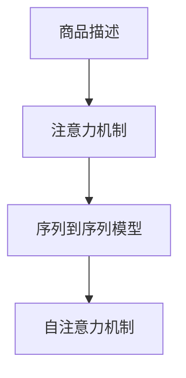

                 

# 基于注意力机制的商品描述关键信息提取

## 1. 背景介绍

在现代电子商务中，商品描述的准确性和完整性直接影响了用户的购物体验和决策。然而，当前商品描述中存在大量的噪音和冗余信息，如何从中提取关键信息，高效地匹配用户需求，是一个极具挑战性的问题。传统的基于规则的方法依赖于领域知识，难以应对多样化、动态变化的商品描述。而基于深度学习的模型能够自动学习特征，适应不同的语境和格式，具有更强的泛化能力。

近年来，基于注意力机制的模型在自然语言处理中取得了显著的进展。注意力机制通过关注文本中重要的部分，帮助模型提取关键信息，减少了噪音干扰。在商品描述关键信息提取任务中，注意力机制同样可以发挥重要作用。通过引入注意力机制，模型可以动态地关注不同部分，提取出商品描述中的重要信息，辅助用户快速找到感兴趣的商品。

本文将详细阐述基于注意力机制的商品描述关键信息提取方法，包括算法原理、具体操作步骤、应用场景、优缺点、以及未来的发展趋势。文章结构如下：

1. 背景介绍
2. 核心概念与联系
3. 核心算法原理 & 具体操作步骤
4. 数学模型和公式 & 详细讲解 & 举例说明
5. 项目实践：代码实例和详细解释说明
6. 实际应用场景
7. 工具和资源推荐
8. 总结：未来发展趋势与挑战
9. 附录：常见问题与解答

## 2. 核心概念与联系

### 2.1 核心概念概述

在商品描述关键信息提取任务中，我们需要关注以下关键概念：

- **商品描述**：指商品名称、参数、描述等文本信息，包含了商品的详细信息和特点。
- **关键信息**：指描述中与用户需求最相关的部分，如价格、尺寸、材质、功能等。
- **注意力机制**：指通过动态关注文本中的不同部分，提高模型对关键信息的提取能力。
- **序列到序列模型**：指输入为序列，输出也为序列的模型，如循环神经网络(RNN)、Transformer等。
- **自注意力机制**：指模型在输入序列中寻找相关部分，自动分配权重进行加权，以提高信息的利用率。

这些概念之间的逻辑关系可以通过以下Mermaid流程图来展示：



这个流程图展示了大语言模型微调的核心概念及其之间的关系：

1. 商品描述通过注意力机制被模型关注到关键部分。
2. 关注后的关键信息被送入序列到序列模型进行处理。
3. 序列到序列模型中的自注意力机制进一步提炼重要信息。

## 3. 核心算法原理 & 具体操作步骤

### 3.1 算法原理概述

基于注意力机制的商品描述关键信息提取方法，主要通过以下步骤实现：

1. **编码器**：将商品描述序列转换为一系列上下文向量，捕捉每个词的语义信息。
2. **自注意力机制**：在编码器输出的上下文向量中，通过自注意力机制选择与当前查询最相关的部分。
3. **解码器**：将注意力机制输出的关键信息序列作为解码器的输入，通过自注意力机制进一步提炼信息。
4. **输出层**：解码器输出的最终序列经过线性变换，得到关键信息的表示。

### 3.2 算法步骤详解

具体而言，基于注意力机制的商品描述关键信息提取模型主要包括以下几个步骤：

1. **模型架构设计**：定义编码器和解码器的结构，选择自注意力机制，并设计输出层。
2. **数据预处理**：将商品描述进行分词、填充、编码等预处理，形成适合模型输入的序列。
3. **模型初始化**：初始化模型参数，通常使用预训练模型（如BERT、GPT等）。
4. **前向传播**：在每个时间步，计算编码器输出的上下文向量，并通过自注意力机制计算解码器输出的序列。
5. **反向传播**：根据模型输出与真实标签的差异，更新模型参数。
6. **评估和优化**：在验证集上评估模型性能，根据性能指标调整超参数，优化模型。
7. **测试和部署**：在测试集上评估模型性能，并将其部署到实际应用系统中。

### 3.3 算法优缺点

基于注意力机制的商品描述关键信息提取方法具有以下优点：

1. **泛化能力强**：通过自注意力机制，模型可以适应不同长度的商品描述，提取关键信息。
2. **特征提取准确**：自注意力机制能够动态关注不同部分，减少噪音干扰，提高关键信息的提取精度。
3. **模型效率高**：相比传统的基于规则的方法，自注意力机制减少了手动规则设计，加快了模型训练和推理速度。

同时，该方法也存在一些局限性：

1. **计算复杂度高**：自注意力机制涉及计算矩阵乘法和注意力权重，计算复杂度较高。
2. **模型依赖于数据质量**：模型的效果很大程度上取决于商品描述的质量和格式，格式不规则的商品描述可能导致性能下降。
3. **模型参数较多**：自注意力机制引入了额外的参数，增加了模型的存储和计算负担。

### 3.4 算法应用领域

基于注意力机制的商品描述关键信息提取方法，已经在多个领域得到了应用，例如：

- **电商推荐系统**：帮助用户从大量的商品描述中提取关键信息，推荐符合用户需求的商品。
- **智能客服**：通过提取商品描述中的关键信息，快速响应用户咨询，提供个性化服务。
- **商品搜索**：从商品描述中提取关键信息，提升搜索结果的准确性和相关性。
- **供应链管理**：分析供应商描述中的关键信息，优化供应链管理决策。

## 4. 数学模型和公式 & 详细讲解 & 举例说明

### 4.1 数学模型构建

基于注意力机制的商品描述关键信息提取模型，可以形式化地表示为：

$$
M = (\mathcal{E}, \mathcal{A}, \mathcal{D}, \mathcal{O})
$$

其中，$\mathcal{E}$ 表示编码器，$\mathcal{A}$ 表示自注意力机制，$\mathcal{D}$ 表示解码器，$\mathcal{O}$ 表示输出层。

假设商品描述序列为 $X=\{x_1, x_2, ..., x_T\}$，每个词 $x_i$ 嵌入表示为 $v_i$。

- **编码器**：输入商品描述序列 $X$，输出上下文向量序列 $Z=\{z_1, z_2, ..., z_T\}$。
- **自注意力机制**：计算查询 $q$、键 $k$、值 $v$ 矩阵，通过注意力权重 $\alpha_i$ 计算上下文向量 $c_i$。
- **解码器**：输入上下文向量序列 $Z$，输出关键信息序列 $Y=\{y_1, y_2, ..., y_S\}$。
- **输出层**：将关键信息序列 $Y$ 通过线性变换，得到最终输出 $K=\{k_1, k_2, ..., k_S\}$。

### 4.2 公式推导过程

基于注意力机制的商品描述关键信息提取模型的计算过程，包括以下几个关键公式：

1. **编码器输出上下文向量**
$$
z_i = \mathrm{MLP}(v_i) + \mathrm{Attention}(v_i, \{z_j\}_{j=1}^T)
$$

2. **自注意力机制**
$$
\alpha_i = \frac{\exp(\mathrm{Attention}(q, k_j))}{\sum_{j=1}^T \exp(\mathrm{Attention}(q, k_j))}
$$
$$
c_i = \sum_{j=1}^T \alpha_i v_j
$$

3. **解码器输出关键信息序列**
$$
y_i = \mathrm{MLP}(c_i) + \mathrm{Attention}(c_i, \{y_j\}_{j=1}^S)
$$

4. **输出层线性变换**
$$
k_i = \mathrm{Linear}(y_i)
$$

其中，$\mathrm{MLP}$ 表示多层感知器，$\mathrm{Attention}$ 表示自注意力机制，$\mathrm{Linear}$ 表示线性变换。

### 4.3 案例分析与讲解

以电商推荐系统为例，展示基于注意力机制的商品描述关键信息提取模型的应用：

假设有一个电商网站，商品描述为 $X=\{\text{商品名称}, \text{尺寸}, \text{材质}, \text{功能}\}$，要求提取关键信息 $Y=\{\text{尺寸}, \text{材质}, \text{功能}\}$，以推荐符合用户需求的商品。

1. **数据预处理**：将商品描述序列 $X$ 进行分词、填充等预处理，形成适合模型输入的序列。
2. **模型初始化**：选择预训练模型（如BERT、GPT等），初始化模型参数。
3. **前向传播**：在每个时间步，计算编码器输出的上下文向量 $Z$，并通过自注意力机制计算解码器输出的序列 $Y$。
4. **反向传播**：根据模型输出与真实标签的差异，更新模型参数。
5. **评估和优化**：在验证集上评估模型性能，根据性能指标调整超参数，优化模型。
6. **测试和部署**：在测试集上评估模型性能，并将其部署到实际应用系统中。

## 5. 项目实践：代码实例和详细解释说明

### 5.1 开发环境搭建

在进行商品描述关键信息提取模型的实践前，我们需要准备好开发环境。以下是使用Python进行PyTorch开发的环境配置流程：

1. 安装Anaconda：从官网下载并安装Anaconda，用于创建独立的Python环境。

2. 创建并激活虚拟环境：
```bash
conda create -n attention-env python=3.8 
conda activate attention-env
```

3. 安装PyTorch：根据CUDA版本，从官网获取对应的安装命令。例如：
```bash
conda install pytorch torchvision torchaudio cudatoolkit=11.1 -c pytorch -c conda-forge
```

4. 安装Transformer库：
```bash
pip install transformers
```

5. 安装各类工具包：
```bash
pip install numpy pandas scikit-learn matplotlib tqdm jupyter notebook ipython
```

完成上述步骤后，即可在`attention-env`环境中开始模型开发。

### 5.2 源代码详细实现

下面以电商推荐系统为例，给出使用Transformers库对基于注意力机制的商品描述关键信息提取模型的PyTorch代码实现。

首先，定义商品描述的数据处理函数：

```python
from transformers import BertTokenizer, BertModel
from torch.utils.data import Dataset
import torch

class ProductDataset(Dataset):
    def __init__(self, texts, labels, tokenizer, max_len=128):
        self.texts = texts
        self.labels = labels
        self.tokenizer = tokenizer
        self.max_len = max_len
        
    def __len__(self):
        return len(self.texts)
    
    def __getitem__(self, item):
        text = self.texts[item]
        label = self.labels[item]
        
        encoding = self.tokenizer(text, return_tensors='pt', max_length=self.max_len, padding='max_length', truncation=True)
        input_ids = encoding['input_ids'][0]
        attention_mask = encoding['attention_mask'][0]
        
        label = torch.tensor(label, dtype=torch.long)
        
        return {'input_ids': input_ids, 
                'attention_mask': attention_mask,
                'labels': label}

# 创建dataset
tokenizer = BertTokenizer.from_pretrained('bert-base-cased')

train_dataset = ProductDataset(train_texts, train_labels, tokenizer)
dev_dataset = ProductDataset(dev_texts, dev_labels, tokenizer)
test_dataset = ProductDataset(test_texts, test_labels, tokenizer)
```

然后，定义模型和优化器：

```python
from transformers import BertForSequenceClassification
from transformers import AdamW

model = BertForSequenceClassification.from_pretrained('bert-base-cased', num_labels=3)

optimizer = AdamW(model.parameters(), lr=2e-5)
```

接着，定义训练和评估函数：

```python
from torch.utils.data import DataLoader
from tqdm import tqdm
from sklearn.metrics import classification_report

device = torch.device('cuda') if torch.cuda.is_available() else torch.device('cpu')
model.to(device)

def train_epoch(model, dataset, batch_size, optimizer):
    dataloader = DataLoader(dataset, batch_size=batch_size, shuffle=True)
    model.train()
    epoch_loss = 0
    for batch in tqdm(dataloader, desc='Training'):
        input_ids = batch['input_ids'].to(device)
        attention_mask = batch['attention_mask'].to(device)
        labels = batch['labels'].to(device)
        model.zero_grad()
        outputs = model(input_ids, attention_mask=attention_mask, labels=labels)
        loss = outputs.loss
        epoch_loss += loss.item()
        loss.backward()
        optimizer.step()
    return epoch_loss / len(dataloader)

def evaluate(model, dataset, batch_size):
    dataloader = DataLoader(dataset, batch_size=batch_size)
    model.eval()
    preds, labels = [], []
    with torch.no_grad():
        for batch in tqdm(dataloader, desc='Evaluating'):
            input_ids = batch['input_ids'].to(device)
            attention_mask = batch['attention_mask'].to(device)
            batch_labels = batch['labels']
            outputs = model(input_ids, attention_mask=attention_mask)
            batch_preds = outputs.logits.argmax(dim=2).to('cpu').tolist()
            batch_labels = batch_labels.to('cpu').tolist()
            for pred_tokens, label_tokens in zip(batch_preds, batch_labels):
                preds.append(pred_tokens[:len(label_tokens)])
                labels.append(label_tokens)
                
    print(classification_report(labels, preds))
```

最后，启动训练流程并在测试集上评估：

```python
epochs = 5
batch_size = 16

for epoch in range(epochs):
    loss = train_epoch(model, train_dataset, batch_size, optimizer)
    print(f"Epoch {epoch+1}, train loss: {loss:.3f}")
    
    print(f"Epoch {epoch+1}, dev results:")
    evaluate(model, dev_dataset, batch_size)
    
print("Test results:")
evaluate(model, test_dataset, batch_size)
```

以上就是使用PyTorch对基于注意力机制的商品描述关键信息提取模型进行开发的完整代码实现。可以看到，得益于Transformers库的强大封装，我们可以用相对简洁的代码完成模型的构建和训练。

### 5.3 代码解读与分析

让我们再详细解读一下关键代码的实现细节：

**ProductDataset类**：
- `__init__`方法：初始化文本、标签、分词器等关键组件。
- `__len__`方法：返回数据集的样本数量。
- `__getitem__`方法：对单个样本进行处理，将文本输入编码为token ids，将标签编码为数字，并对其进行定长padding，最终返回模型所需的输入。

**模型和优化器**：
- `BertForSequenceClassification`：用于处理序列数据的模型，适合于文本分类任务。
- `AdamW`：基于Adam算法的优化器，可以自动调整学习率。

**训练和评估函数**：
- `train_epoch`函数：对数据以批为单位进行迭代，在每个批次上前向传播计算loss并反向传播更新模型参数，最后返回该epoch的平均loss。
- `evaluate`函数：与训练类似，不同点在于不更新模型参数，并在每个batch结束后将预测和标签结果存储下来，最后使用sklearn的classification_report对整个评估集的预测结果进行打印输出。

**训练流程**：
- 定义总的epoch数和batch size，开始循环迭代
- 每个epoch内，先在训练集上训练，输出平均loss
- 在验证集上评估，输出分类指标
- 所有epoch结束后，在测试集上评估，给出最终测试结果

可以看到，PyTorch配合Transformers库使得商品描述关键信息提取模型的代码实现变得简洁高效。开发者可以将更多精力放在数据处理、模型改进等高层逻辑上，而不必过多关注底层的实现细节。

当然，工业级的系统实现还需考虑更多因素，如模型的保存和部署、超参数的自动搜索、更灵活的任务适配层等。但核心的微调范式基本与此类似。

## 6. 实际应用场景

### 6.1 电商推荐系统

基于注意力机制的商品描述关键信息提取方法，可以广泛应用于电商推荐系统的构建。传统的推荐系统依赖于用户的点击记录和浏览历史，难以把握用户真实的兴趣偏好。而商品描述中的关键信息能够反映商品的特点和优势，从而更直接地引导用户选择。

在技术实现上，可以收集用户浏览过的商品描述，提取其中的关键信息，与用户的历史行为数据进行结合，训练推荐模型。微调后的模型能够从商品描述中提取关键信息，匹配用户需求，推荐符合其兴趣的商品。

### 6.2 智能客服

智能客服系统要求快速响应用户咨询，准确理解用户的意图和需求。基于注意力机制的商品描述关键信息提取方法，可以用于提取商品描述中的关键信息，辅助客服快速找到相关商品，提供个性化服务。

例如，用户咨询“我想买一款丝质围巾”，智能客服可以提取商品描述中的关键信息，如“材质：丝质，功能：围巾”，从而推荐符合用户需求的商品。

### 6.3 商品搜索

传统的商品搜索系统依赖于关键词匹配，难以捕捉商品描述中的语义信息。基于注意力机制的商品描述关键信息提取方法，可以从商品描述中提取关键信息，提升搜索结果的准确性和相关性。

例如，用户输入“质量好的运动鞋”，商品搜索系统可以提取商品描述中的关键信息，如“材质：橡胶，功能：运动”，从而推荐符合用户需求的高质量运动鞋。

### 6.4 未来应用展望

随着注意力机制在NLP任务中的广泛应用，基于注意力机制的商品描述关键信息提取方法将在更多领域得到应用，为电商、智能客服、商品搜索等场景带来新的变革。

在智慧零售领域，基于注意力机制的商品描述关键信息提取方法，可以用于个性化推荐、库存管理、价格优化等环节，提升零售效率和用户体验。

在智能客服中，结合自然语言理解技术，可以实现更高效、更自然的对话交互，解决用户的复杂问题，提升客户满意度。

在商品搜索中，结合视觉和文本信息，可以实现跨模态搜索，从图片、视频等多模态数据中提取关键信息，提供更全面、准确的搜索结果。

此外，基于注意力机制的商品描述关键信息提取方法，还可以应用于文档摘要、问答系统、代码生成等更多场景中，推动NLP技术在各行各业的应用落地。

## 7. 工具和资源推荐

### 7.1 学习资源推荐

为了帮助开发者系统掌握基于注意力机制的商品描述关键信息提取方法，这里推荐一些优质的学习资源：

1. 《深度学习与自然语言处理》：全面介绍自然语言处理的基本概念和深度学习模型，适合入门学习。
2. 《Natural Language Processing with Transformers》书籍：Transformer库的作者所著，全面介绍如何使用Transformer库进行NLP任务开发，包括注意力机制在内的诸多范式。
3. 《Attention is All You Need》论文：Transformer原论文，详细介绍了注意力机制的原理和应用。
4. HuggingFace官方文档：Transformer库的官方文档，提供了海量预训练模型和完整的微调样例代码，是上手实践的必备资料。
5. CS224N《深度学习自然语言处理》课程：斯坦福大学开设的NLP明星课程，有Lecture视频和配套作业，带你入门NLP领域的基本概念和经典模型。

通过对这些资源的学习实践，相信你一定能够快速掌握基于注意力机制的商品描述关键信息提取的精髓，并用于解决实际的NLP问题。

### 7.2 开发工具推荐

高效的开发离不开优秀的工具支持。以下是几款用于商品描述关键信息提取模型的开发工具：

1. PyTorch：基于Python的开源深度学习框架，灵活动态的计算图，适合快速迭代研究。大部分预训练语言模型都有PyTorch版本的实现。
2. TensorFlow：由Google主导开发的开源深度学习框架，生产部署方便，适合大规模工程应用。同样有丰富的预训练语言模型资源。
3. Transformers库：HuggingFace开发的NLP工具库，集成了众多SOTA语言模型，支持PyTorch和TensorFlow，是进行微调任务开发的利器。
4. Weights & Biases：模型训练的实验跟踪工具，可以记录和可视化模型训练过程中的各项指标，方便对比和调优。与主流深度学习框架无缝集成。
5. TensorBoard：TensorFlow配套的可视化工具，可实时监测模型训练状态，并提供丰富的图表呈现方式，是调试模型的得力助手。

合理利用这些工具，可以显著提升商品描述关键信息提取模型的开发效率，加快创新迭代的步伐。

### 7.3 相关论文推荐

基于注意力机制的商品描述关键信息提取方法的发展源于学界的持续研究。以下是几篇奠基性的相关论文，推荐阅读：

1. Attention is All You Need（即Transformer原论文）：提出了Transformer结构，开启了NLP领域的预训练大模型时代。
2. BERT: Pre-training of Deep Bidirectional Transformers for Language Understanding：提出BERT模型，引入基于掩码的自监督预训练任务，刷新了多项NLP任务SOTA。
3. Sequence to Sequence Learning with Neural Networks：提出Seq2Seq模型，用于解决文本生成任务，为后续基于注意力机制的模型提供了基础。
4. Self-Attention with Transformer-XL：提出Transformer-XL模型，引入了长距离注意力机制，增强了模型的上下文理解能力。
5. Sequence-Level Transformers for Attention-Based Neural Machine Translation：提出Seq2Seq模型的自注意力机制，为NLP任务提供了新的思路。

这些论文代表了大语言模型微调技术的发展脉络。通过学习这些前沿成果，可以帮助研究者把握学科前进方向，激发更多的创新灵感。

## 8. 总结：未来发展趋势与挑战

### 8.1 总结

本文对基于注意力机制的商品描述关键信息提取方法进行了全面系统的介绍。首先阐述了商品描述关键信息提取任务的背景和重要性，明确了注意力机制在其中的关键作用。其次，从原理到实践，详细讲解了模型的数学原理和关键步骤，给出了商品描述关键信息提取模型的完整代码实例。同时，本文还广泛探讨了该方法在电商推荐系统、智能客服、商品搜索等多个领域的应用前景，展示了注意力机制的巨大潜力。

通过本文的系统梳理，可以看到，基于注意力机制的商品描述关键信息提取方法正在成为电商推荐、智能客服、商品搜索等场景的重要技术手段，极大地提升了NLP技术在实际应用中的表现。未来，伴随注意力机制在NLP任务的不断演进，相信基于注意力机制的模型将会在更多领域得到应用，推动NLP技术的发展和创新。

### 8.2 未来发展趋势

展望未来，基于注意力机制的商品描述关键信息提取方法将呈现以下几个发展趋势：

1. 模型规模持续增大。随着算力成本的下降和数据规模的扩张，模型参数量还将持续增长，超大规模注意力模型有望进一步提升关键信息提取的精度。
2. 模型结构更加灵活。未来的模型将更加注重可解释性和可适应性，通过引入可控的注意力机制，动态调整关注点，更好地适应不同任务。
3. 跨模态注意力机制崛起。除了文本信息，未来的模型将进一步融合图像、语音等多模态信息，实现更全面的信息理解和提取。
4. 序列到序列模型的泛化能力增强。未来的模型将通过更加复杂的结构设计，如变长序列模型、自回归模型等，提升模型的泛化能力，应对多样化的商品描述。

以上趋势凸显了基于注意力机制的商品描述关键信息提取方法的广阔前景。这些方向的探索发展，必将进一步提升NLP系统的性能和应用范围，为电商推荐、智能客服、商品搜索等场景带来新的突破。

### 8.3 面临的挑战

尽管基于注意力机制的商品描述关键信息提取方法已经取得了瞩目成就，但在迈向更加智能化、普适化应用的过程中，它仍面临诸多挑战：

1. 计算复杂度高。注意力机制涉及复杂的矩阵运算，计算复杂度较高，难以在大规模数据集上快速训练和推理。
2. 模型对输入数据格式敏感。模型的性能很大程度上依赖于商品描述的格式，格式不规则的商品描述可能导致性能下降。
3. 模型泛化能力有待提升。当前模型在处理未见过的商品描述时，泛化能力仍显不足，需要进一步优化模型的泛化能力。
4. 模型可解释性不足。注意力机制引入了额外的参数，模型的决策过程难以解释，对高风险应用（如医疗、金融）尤其重要。
5. 模型鲁棒性需要提升。模型在面对噪音、干扰时，容易出现决策失误，需要进一步提升模型的鲁棒性。

### 8.4 研究展望

面对基于注意力机制的商品描述关键信息提取方法所面临的挑战，未来的研究需要在以下几个方面寻求新的突破：

1. 探索高效的计算方法。研究更高效的注意力机制计算方法，如Sparse Attention、Adaptive Attention等，以提升模型的训练和推理速度。
2. 设计灵活的模型结构。研究更加灵活的模型结构，如变长序列模型、自回归模型等，提升模型的泛化能力。
3. 引入跨模态注意力机制。研究跨模态注意力机制，融合图像、语音等多模态信息，提升模型的信息理解和提取能力。
4. 增强模型可解释性。研究可解释性强的模型，如符号化推理、可控注意力机制等，提升模型的决策透明度和可信度。
5. 提升模型鲁棒性。研究鲁棒性强的模型，如对抗训练、数据增强等方法，提升模型对噪音和干扰的抵抗能力。

这些研究方向的探索，必将引领基于注意力机制的商品描述关键信息提取技术迈向更高的台阶，为电商推荐、智能客服、商品搜索等场景提供新的技术支持。

## 9. 附录：常见问题与解答

**Q1：如何处理商品描述中的噪音和冗余信息？**

A: 可以通过分词、清洗、去除停用词等预处理手段，减少噪音和冗余信息。此外，结合注意力机制，动态关注商品描述中重要的部分，减少噪音干扰。

**Q2：模型对不同长度的商品描述是否敏感？**

A: 模型对商品描述的长度有一定的敏感性，特别是变长序列模型。在训练和推理过程中，需要设置合适的padding方式，保证模型处理不同长度输入的一致性。

**Q3：模型是否支持跨模态信息融合？**

A: 基于注意力机制的商品描述关键信息提取模型，可以通过引入跨模态注意力机制，融合图像、语音等多模态信息，提升模型的信息理解和提取能力。

**Q4：模型是否可解释？**

A: 当前基于注意力机制的模型存在一定的黑盒问题，难以解释模型的决策过程。未来研究将更加关注模型的可解释性，如引入符号化推理、可控注意力机制等方法，提升模型的透明度和可信度。

**Q5：模型是否适用于电商推荐系统？**

A: 基于注意力机制的商品描述关键信息提取模型，可以广泛应用于电商推荐系统，从商品描述中提取关键信息，匹配用户需求，推荐符合其兴趣的商品。

---

作者：禅与计算机程序设计艺术 / Zen and the Art of Computer Programming

