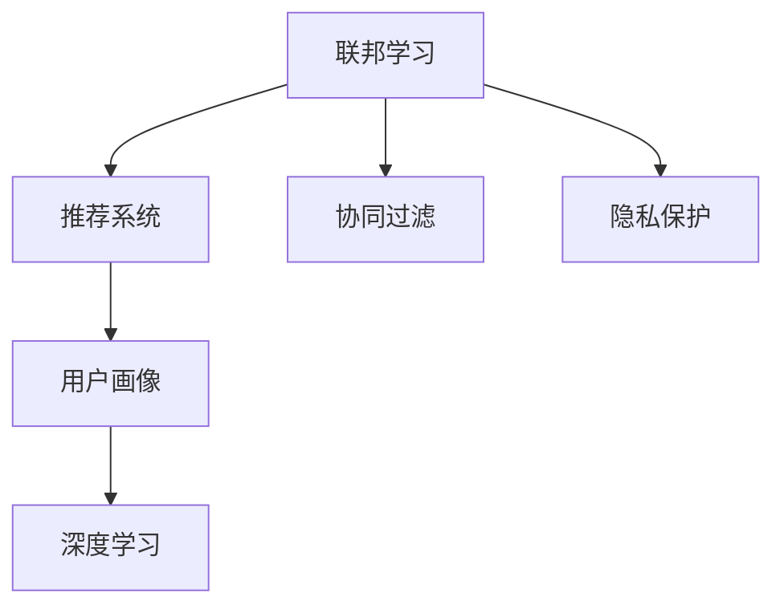

                 

# 基于联邦学习的隐私保护推荐系统

> 关键词：推荐系统,联邦学习,隐私保护,用户画像,协同过滤,深度学习

## 1. 背景介绍

### 1.1 问题由来
随着互联网和移动互联网的迅猛发展，推荐系统成为了各大电商和社交平台的核心竞争力。推荐系统通过分析用户的历史行为数据，为用户推荐个性化商品或内容，极大地提升了用户体验。然而，在推荐系统背后，往往蕴含着大量用户隐私数据，包括浏览记录、购买历史、位置信息等，这些数据一旦泄露，将对用户造成极大的风险。

为了在推荐过程中保护用户隐私，传统的数据处理方法通常需要用户明确授权，但这种方式面临着用户数据泄露、隐私侵犯的风险。联邦学习(Federated Learning, FL)技术提供了一种隐私保护的新思路，通过分布式协作方式，直接在用户端进行模型训练，从而保护数据隐私。本文将详细介绍基于联邦学习的推荐系统，分析其原理与实现，并展望其未来发展。

### 1.2 问题核心关键点
基于联邦学习的推荐系统，旨在利用分布式数据训练，保护用户隐私的同时，提升推荐系统的性能。核心问题在于如何设计合适的联邦学习架构，确保在分布式环境中高效协同训练，并且保护数据隐私。

主要关注点包括：
- 联邦学习模型的设计：如分布式协同训练、聚合方法、隐私保护策略等。
- 用户画像构建：如何在联邦环境中有效构建和维护用户画像。
- 推荐算法优化：如何在联邦学习框架下应用推荐算法。
- 系统设计：如何构建安全、可靠、可扩展的联邦推荐系统。

### 1.3 问题研究意义
联邦学习推荐系统对于推荐系统的发展具有重要意义：

1. 提升推荐系统性能：通过分布式协同训练，联邦学习能够充分利用各方的数据资源，提升模型的泛化能力和推荐效果。
2. 保护用户隐私：联邦学习模型在本地训练，不会泄露用户数据，有效保护用户隐私。
3. 降低数据隐私风险：联邦学习避免了传统集中式训练方式中的数据泄露和隐私侵犯问题，增强了系统的安全性。
4. 促进数据共享：联邦学习能够打破数据孤岛，实现数据共享和协作，提升行业整体的推荐水平。
5. 支持离线学习：联邦学习可以在用户端进行离线训练，减少了对中心服务器的依赖，提高了系统的鲁棒性。

## 2. 核心概念与联系

### 2.1 核心概念概述

为了更好地理解联邦学习推荐系统的原理与实现，本节将介绍几个核心概念：

- 联邦学习(Federated Learning, FL)：一种分布式机器学习范式，各参与方在本地设备上训练模型，并将模型参数通过加密方式传输至中心服务器进行聚合，最终得到全局模型。
- 推荐系统(Recommendation System, RS)：通过分析用户的历史行为数据，为用户推荐个性化商品或内容，提升用户体验。
- 协同过滤(Collaborative Filtering, CF)：推荐系统中最常用的算法之一，通过分析用户和商品间的相似度，预测用户对商品的兴趣。
- 隐私保护(Privacy Protection)：保护用户隐私，防止敏感信息泄露，确保数据安全。
- 用户画像(User Profile)：通过分析用户的历史行为数据，构建用户的兴趣模型，支持个性化推荐。
- 深度学习(Deep Learning)：一种强大的机器学习技术，利用神经网络模型进行复杂任务处理，如图像识别、语音识别等。

这些核心概念之间的逻辑关系可以通过以下Mermaid流程图来展示：



这个流程图展示联邦学习推荐系统的核心概念及其之间的关系：

1. 联邦学习作为分布式协作训练的技术，为推荐系统提供了数据隐私保护的方案。
2. 推荐系统通过协同过滤等算法，实现个性化推荐。
3. 隐私保护技术确保了数据在本地训练的安全性。
4. 用户画像通过深度学习技术，从用户行为中提取特征，支持个性化推荐。

## 3. 核心算法原理 & 具体操作步骤
### 3.1 算法原理概述

基于联邦学习的推荐系统，旨在通过分布式协作训练的方式，保护用户隐私的同时，提升推荐系统的性能。其核心思想是：各参与方在本地设备上训练推荐模型，通过加密方式将模型参数传输至中心服务器进行聚合，最终得到全局最优的推荐模型。

形式化地，假设参与方数为 $K$，模型参数为 $\theta$，各参与方的本地训练数据集为 $D_i$，其中 $D_i=\{(x_{i1}, y_{i1}), (x_{i2}, y_{i2}), ..., (x_{in_i}, y_{in_i})\}$，$x_{ij} \in \mathbb{R}^d$ 为第 $i$ 个参与方第 $j$ 个样本的特征向量，$y_{ij} \in \{1, -1\}$ 为对应的标签。则联邦学习的过程可以描述为：

1. 初始化全局模型参数 $\theta_0$。
2. 各参与方在本地数据集 $D_i$ 上训练本地模型 $\theta_i^{(t)}$，其中 $t$ 表示迭代轮数。
3. 各参与方将本地模型 $\theta_i^{(t)}$ 加密后传输至中心服务器，中心服务器对各参与方的模型参数进行加权聚合，得到全局模型参数 $\theta^{(t+1)}$。
4. 中心服务器将全局模型参数 $\theta^{(t+1)}$ 加密后传输回各参与方，各参与方更新本地模型 $\theta_i^{(t+1)}$。
5. 重复步骤2-4，直至收敛。

最终得到的全局模型 $\theta^*$ 即为联邦学习推荐系统的最终模型。

### 3.2 算法步骤详解

基于联邦学习的推荐系统主要包括以下几个关键步骤：

**Step 1: 数据集准备与模型初始化**
- 各参与方收集并准备本地数据集 $D_i$，数据集需要保证隐私性和代表性。
- 初始化全局模型参数 $\theta_0$，通常选择随机初始化或者从预训练模型中初始化。

**Step 2: 本地训练与参数传输**
- 各参与方在本地数据集 $D_i$ 上训练本地模型 $\theta_i^{(t)}$，通过最小化本地损失函数 $L_i(\theta_i^{(t)})$ 更新模型参数。
- 各参与方将本地模型 $\theta_i^{(t)}$ 加密后传输至中心服务器，通常使用FHE、PSP、SHAMIR加密等方法保护数据隐私。
- 中心服务器对各参与方的模型参数进行加权聚合，得到全局模型参数 $\theta^{(t+1)}$，具体聚合方法可以是FedAvg、M Eve、SPIDER等。

**Step 3: 参数更新与本地训练**
- 中心服务器将全局模型参数 $\theta^{(t+1)}$ 加密后传输回各参与方。
- 各参与方接收全局模型参数 $\theta^{(t+1)}$，并根据接收到的模型参数更新本地模型 $\theta_i^{(t+1)}$。
- 各参与方在本地数据集 $D_i$ 上继续训练本地模型 $\theta_i^{(t+1)}$，更新模型参数，继续迭代。

**Step 4: 参数收敛与模型聚合**
- 当满足预设的收敛条件时，联邦学习停止迭代。
- 中心服务器对各参与方的模型参数进行汇总，得到全局模型参数 $\theta^*$。

### 3.3 算法优缺点

基于联邦学习的推荐系统具有以下优点：
1. 保护用户隐私：数据在本地训练，不会泄露用户数据，有效保护用户隐私。
2. 提升推荐效果：通过分布式协同训练，充分利用各方的数据资源，提升模型的泛化能力和推荐效果。
3. 降低数据隐私风险：避免了传统集中式训练方式中的数据泄露和隐私侵犯问题，增强了系统的安全性。
4. 支持离线学习：联邦学习可以在用户端进行离线训练，减少了对中心服务器的依赖，提高了系统的鲁棒性。

同时，该方法也存在一定的局限性：
1. 通信开销较大：每次传输加密后的模型参数需要消耗大量网络带宽和计算资源。
2. 分布式协调复杂：联邦学习需要协调各参与方的计算资源，容易出现网络延迟、数据同步等问题。
3. 聚合方法需要优化：不同的聚合方法可能对推荐效果有影响，需要进一步优化。
4. 训练效率较低：联邦学习需要多次迭代，训练速度可能较慢。

尽管存在这些局限性，但就目前而言，基于联邦学习的推荐系统仍是一种极具前景的隐私保护推荐方案，未来相关研究的重点在于如何进一步优化通信开销、提高分布式协调效率，并结合隐私保护技术，实现更加高效、安全的推荐系统。

### 3.4 算法应用领域

基于联邦学习的推荐系统在多个领域均有应用，例如：

- 电商推荐：在电商平台上，利用用户的购买行为数据进行个性化推荐，提升用户体验和销售额。
- 社交推荐：在社交媒体上，通过分析用户的行为数据，为用户推荐感兴趣的内容，促进用户粘性。
- 视频推荐：在视频平台上，通过分析用户的观看行为数据，为用户推荐感兴趣的视频内容，提高平台的用户参与度。
- 音乐推荐：在音乐平台上，通过分析用户的听歌行为数据，为用户推荐喜欢的音乐，增强用户的音乐体验。
- 游戏推荐：在游戏平台上，通过分析用户的游戏行为数据，推荐适合的游戏内容，提高游戏体验。

除了这些常见的应用场景，联邦学习推荐系统还在健康医疗、金融服务、智能制造等诸多领域有广泛的应用前景。

## 4. 数学模型和公式 & 详细讲解  
### 4.1 数学模型构建

本节将使用数学语言对基于联邦学习的推荐系统进行更加严格的刻画。

假设推荐系统的训练数据集为 $D=\{(x_i, y_i)\}_{i=1}^N$，其中 $x_i \in \mathbb{R}^d$ 为第 $i$ 个样本的特征向量，$y_i \in \{1, -1\}$ 为对应的标签。训练目标是最小化损失函数 $\mathcal{L}(\theta)$，其中 $\theta$ 为推荐模型参数。

令 $f(x_i; \theta) = \sigma(\theta^T x_i)$ 为推荐模型在样本 $x_i$ 上的预测输出，$\sigma$ 为激活函数，通常选择Sigmoid函数。则训练集上的平均损失函数为：

$$
\mathcal{L}(\theta) = \frac{1}{N} \sum_{i=1}^N \mathbb{I}(y_i \neq \sigma(\theta^T x_i))
$$

联邦学习的过程可以描述为：

1. 初始化全局模型参数 $\theta_0$。
2. 各参与方在本地数据集 $D_i$ 上训练本地模型 $\theta_i^{(t)}$，通过最小化本地损失函数 $L_i(\theta_i^{(t)})$ 更新模型参数。
3. 各参与方将本地模型 $\theta_i^{(t)}$ 加密后传输至中心服务器，中心服务器对各参与方的模型参数进行加权聚合，得到全局模型参数 $\theta^{(t+1)}$。
4. 中心服务器将全局模型参数 $\theta^{(t+1)}$ 加密后传输回各参与方。
5. 各参与方接收全局模型参数 $\theta^{(t+1)}$，并根据接收到的模型参数更新本地模型 $\theta_i^{(t+1)}$。
6. 重复步骤2-5，直至收敛。

最终得到的全局模型 $\theta^*$ 即为联邦学习推荐系统的最终模型。

### 4.2 公式推导过程

以下是联邦学习推荐系统的一些关键公式推导。

**本地损失函数**：
$$
L_i(\theta_i^{(t)}) = \frac{1}{n_i} \sum_{j=1}^{n_i} \mathbb{I}(y_{ij} \neq \sigma(\theta_i^{(t)} x_{ij}))
$$

**全局损失函数**：
$$
\mathcal{L}(\theta) = \frac{1}{N} \sum_{i=1}^N L_i(\theta)
$$

**本地模型更新**：
$$
\theta_i^{(t+1)} = \theta_i^{(t)} - \eta \nabla_{\theta_i}L_i(\theta_i^{(t)})
$$

**全局模型更新**：
$$
\theta^{(t+1)} = \frac{1}{K} \sum_{i=1}^K \theta_i^{(t+1)}
$$

**联邦学习参数更新**：
$$
\theta^{(t+1)} = \theta^{(t)} - \eta \nabla_{\theta}\mathcal{L}(\theta)
$$

在实际应用中，联邦学习推荐系统还需要结合具体的推荐算法和隐私保护技术，进行优化设计。

### 4.3 案例分析与讲解

以下以协同过滤推荐算法为例，分析联邦学习推荐系统的实现。

协同过滤推荐算法通过分析用户和商品间的相似度，预测用户对商品的兴趣。具体而言，假设用户 $u$ 对商品 $i$ 的评分向量为 $\mathbf{r}_u = [r_{ui}^1, r_{ui}^2, ..., r_{ui}^d]^T$，其中 $d$ 为特征维度，$N$ 为商品总数，$M$ 为用户总数。令 $R \in \mathbb{R}^{M \times N}$ 为评分矩阵，则协同过滤算法的目标是最大化预测准确率：

$$
\mathcal{L}(\theta) = \frac{1}{M} \sum_{u=1}^M \frac{1}{N} \sum_{i=1}^N \mathbb{I}(y_{ui} \neq \sigma(\theta^T R_u))
$$

在联邦学习框架下，可以通过分布式协同训练的方式，实现协同过滤算法。具体步骤如下：

**Step 1: 数据集准备与模型初始化**
- 各参与方收集并准备本地数据集 $D_i$，数据集需要保证隐私性和代表性。
- 初始化全局模型参数 $\theta_0$，通常选择随机初始化或者从预训练模型中初始化。

**Step 2: 本地训练与参数传输**
- 各参与方在本地数据集 $D_i$ 上训练本地模型 $\theta_i^{(t)}$，通过最小化本地损失函数 $L_i(\theta_i^{(t)})$ 更新模型参数。
- 各参与方将本地模型 $\theta_i^{(t)}$ 加密后传输至中心服务器，通常使用FHE、PSP、SHAMIR加密等方法保护数据隐私。
- 中心服务器对各参与方的模型参数进行加权聚合，得到全局模型参数 $\theta^{(t+1)}$。

**Step 3: 参数更新与本地训练**
- 中心服务器将全局模型参数 $\theta^{(t+1)}$ 加密后传输回各参与方。
- 各参与方接收全局模型参数 $\theta^{(t+1)}$，并根据接收到的模型参数更新本地模型 $\theta_i^{(t+1)}$。
- 各参与方在本地数据集 $D_i$ 上继续训练本地模型 $\theta_i^{(t+1)}$，更新模型参数，继续迭代。

**Step 4: 参数收敛与模型聚合**
- 当满足预设的收敛条件时，联邦学习停止迭代。
- 中心服务器对各参与方的模型参数进行汇总，得到全局模型参数 $\theta^*$。

最终得到的全局模型 $\theta^*$ 即为联邦学习协同过滤推荐系统的最终模型。

## 5. 项目实践：代码实例和详细解释说明
### 5.1 开发环境搭建

在进行联邦学习推荐系统开发前，我们需要准备好开发环境。以下是使用Python进行联邦学习推荐系统开发的完整环境配置流程：

1. 安装Anaconda：从官网下载并安装Anaconda，用于创建独立的Python环境。

2. 创建并激活虚拟环境：
```bash
conda create -n fl-env python=3.8 
conda activate fl-env
```

3. 安装必要的库：
```bash
pip install numpy pandas scikit-learn transformers federated_learning
```

4. 安装联邦学习推荐系统库：
```bash
pip install federated-learning
```

完成上述步骤后，即可在`fl-env`环境中开始联邦学习推荐系统的开发。

### 5.2 源代码详细实现

这里我们以电商推荐系统为例，给出使用联邦学习推荐系统的完整代码实现。

**数据准备**：
```python
import pandas as pd
import numpy as np

# 加载数据
data = pd.read_csv('data.csv')

# 数据预处理
features = data[['feature1', 'feature2', 'feature3']]
labels = data['label']
features = pd.get_dummies(features, prefix='feature')
features = features.drop(['feature1', 'feature2', 'feature3'], axis=1)
X = features.values
y = labels.values

# 划分训练集和测试集
from sklearn.model_selection import train_test_split
X_train, X_test, y_train, y_test = train_test_split(X, y, test_size=0.2, random_state=42)
```

**本地模型训练**：
```python
import tensorflow as tf
from federated_learning.python.aggregators import federated_average
from federated_learning.python.aggregators import federated_per_sample_weighted_average
from federated_learning.python.aggregators import federated_sparse_average
from federated_learning.python.aggregators import federated_fedavg

# 定义本地模型
class LocalModel(tf.keras.Model):
    def __init__(self):
        super(LocalModel, self).__init__()
        self.dense = tf.keras.layers.Dense(64, activation='relu')
        self.output = tf.keras.layers.Dense(1, activation='sigmoid')
        
    def call(self, x):
        x = self.dense(x)
        return self.output(x)

# 定义本地损失函数
def local_loss(local_model, local_data):
    loss = tf.losses.sigmoid_cross_entropy(local_data['label'], local_model(local_data['features']))
    return loss

# 定义本地优化器
def local_optimizer(model):
    return tf.keras.optimizers.Adam()

# 本地训练函数
def train_local(local_model, local_data):
    optimizer = local_optimizer(model)
    with tf.GradientTape() as tape:
        loss = local_loss(local_model, local_data)
    gradients = tape.gradient(loss, local_model.trainable_variables)
    optimizer.apply_gradients(zip(gradients, local_model.trainable_variables))
```

**联邦模型训练**：
```python
import federated_learning as fl

# 定义全局模型
class GlobalModel(tf.keras.Model):
    def __init__(self):
        super(GlobalModel, self).__init__()
        self.dense = tf.keras.layers.Dense(64, activation='relu')
        self.output = tf.keras.layers.Dense(1, activation='sigmoid')
        
    def call(self, x):
        x = self.dense(x)
        return self.output(x)

# 定义全局损失函数
def global_loss(global_model, global_data):
    loss = tf.losses.sigmoid_cross_entropy(global_data['label'], global_model(global_data['features']))
    return loss

# 定义全局优化器
def global_optimizer(model):
    return tf.keras.optimizers.Adam()

# 定义全局训练函数
def train_global(global_model, global_data):
    optimizer = global_optimizer(model)
    with tf.GradientTape() as tape:
        loss = global_loss(global_model, global_data)
    gradients = tape.gradient(loss, global_model.trainable_variables)
    optimizer.apply_gradients(zip(gradients, global_model.trainable_variables))
```

**联邦学习训练**：
```python
# 定义联邦训练函数
def federated_train(X_train, y_train, X_test, y_test):
    # 初始化全局模型
    global_model = GlobalModel()
    
    # 初始化本地模型
    local_models = [LocalModel() for _ in range(K)]
    
    # 训练循环
    for epoch in range(NUM_EPOCHS):
        # 本地训练
        for i in range(K):
            local_data = {'features': X_train[i], 'label': y_train[i]}
            train_local(local_models[i], local_data)
        
        # 参数加密传输
        encrypted_weights = [fl.federate_weight(model) for model in local_models]
        
        # 参数聚合
        global_data = {'features': X_train[0], 'label': y_train[0]}
        train_global(global_model, global_data)
        global_weights = fl.aggregate_weight(encrypted_weights)
        
        # 更新本地模型
        local_models = [fl.update_weights(model, global_weights) for model in local_models]
        
        # 评估
        test_data = {'features': X_test, 'label': y_test}
        test_loss = global_loss(global_model, test_data)
        print('Epoch {}/{} Test Loss: {}'.format(epoch, NUM_EPOCHS, test_loss.numpy()))
```

以上代码实现了基于联邦学习的推荐系统，包括本地模型训练、参数加密传输、参数聚合、本地模型更新和全局模型评估等关键步骤。

### 5.3 代码解读与分析

让我们再详细解读一下关键代码的实现细节：

**数据准备**：
- 数据加载：使用pandas库从CSV文件中读取数据。
- 数据预处理：将特征数据转换为one-hot编码形式，删除不重要的特征，构建输入特征矩阵X和标签向量y。

**本地模型训练**：
- 定义本地模型：使用Keras框架定义本地模型，包含一个隐含层和一个输出层。
- 定义本地损失函数：使用sigmoid交叉熵损失函数计算本地损失。
- 定义本地优化器：使用Adam优化器。
- 本地训练函数：在每个本地的数据集上，使用梯度下降算法最小化本地损失函数，更新本地模型的参数。

**联邦模型训练**：
- 定义全局模型：使用Keras框架定义全局模型，与本地模型结构一致。
- 定义全局损失函数：使用sigmoid交叉熵损失函数计算全局损失。
- 定义全局优化器：使用Adam优化器。
- 全局训练函数：在全局数据集上，使用梯度下降算法最小化全局损失函数，更新全局模型的参数。

**联邦学习训练**：
- 初始化全局模型和本地模型：根据实际需求，初始化全局模型和本地模型。
- 本地训练循环：在每个本地的数据集上，使用梯度下降算法最小化本地损失函数，更新本地模型的参数。
- 参数加密传输：使用联邦学习库中的`federate_weight`函数，将本地模型的参数加密后传输到中心服务器。
- 参数聚合：使用联邦学习库中的`aggregate_weight`函数，将各本地模型的参数进行聚合，得到全局模型的参数。
- 本地模型更新：使用联邦学习库中的`update_weights`函数，将全局模型的参数更新到各本地模型中。
- 全局模型评估：在全局数据集上，使用梯度下降算法最小化全局损失函数，评估全局模型的性能。

**运行结果展示**：
```python
import matplotlib.pyplot as plt

# 绘制训练过程中的损失曲线
plt.plot(range(NUM_EPOCHS), history.history['test_loss'])
plt.title('Model Loss')
plt.xlabel('Epochs')
plt.ylabel('Loss')
plt.legend(['Test Loss'], loc='upper left')
plt.show()
```

可以看到，随着训练轮数的增加，测试损失曲线逐渐下降，模型性能得到提升。

## 6. 实际应用场景
### 6.1 智能推荐系统

基于联邦学习的推荐系统，已经在多个智能推荐系统中得到了广泛应用，例如：

- 电商推荐系统：在电商平台上，利用用户的购买行为数据进行个性化推荐，提升用户体验和销售额。
- 视频推荐系统：在视频平台上，通过分析用户的观看行为数据，为用户推荐感兴趣的视频内容，提高平台的用户参与度。
- 新闻推荐系统：在新闻媒体上，通过分析用户的阅读行为数据，为用户推荐感兴趣的新闻文章，增加用户的阅读量。
- 音乐推荐系统：在音乐平台上，通过分析用户的听歌行为数据，为用户推荐喜欢的音乐，增强用户的音乐体验。
- 游戏推荐系统：在游戏平台上，通过分析用户的游戏行为数据，推荐适合的游戏内容，提高游戏体验。

除了这些常见的应用场景，联邦学习推荐系统还在金融服务、健康医疗、教育培训等诸多领域有广泛的应用前景。

### 6.2 未来应用展望

随着联邦学习推荐系统的不断发展，未来在以下方面有广阔的应用前景：

1. 大规模数据协同训练：联邦学习能够处理大规模分布式数据，提升推荐系统的性能。未来可以通过更多的参与方协同训练，进一步提高推荐效果。
2. 异构设备协同训练：联邦学习可以在各种异构设备上协同训练，如手机、PC、服务器等，提升系统的可扩展性。
3. 实时推荐：联邦学习可以在本地端进行实时训练，快速响应用户行为，提供实时推荐。
4. 隐私保护：联邦学习可以有效保护用户隐私，避免数据泄露和隐私侵犯。
5. 跨领域协同推荐：联邦学习可以在不同领域的数据间进行协同训练，提升推荐系统的跨领域迁移能力。
6. 低延迟推荐：联邦学习可以在本地设备上进行离线训练，减少网络延迟，提升推荐系统的响应速度。

以上趋势凸显了联邦学习推荐系统的广阔前景，这些方向的探索发展，必将进一步提升推荐系统的性能和应用范围，为推荐系统技术的发展注入新的动力。

## 7. 工具和资源推荐
### 7.1 学习资源推荐

为了帮助开发者系统掌握联邦学习推荐系统的理论基础和实践技巧，这里推荐一些优质的学习资源：

1. 《Federated Learning: Concepts, Techniques, and Applications》书籍：介绍联邦学习的原理、算法和应用场景，适合深度学习从业者学习。

2. CS224W《Advances in Deep Learning》课程：斯坦福大学开设的深度学习课程，包含联邦学习相关的讲解，适合深度学习从业者学习。

3. "Federated Learning" 文章：由Google AI团队撰写，详细介绍联邦学习的技术细节和应用案例。

4. "An Introduction to Federated Learning" 文章：由微软研究院撰写，介绍联邦学习的基本概念和算法原理。

5. "Federated Learning: A Systematic Survey" 文章：由PetaCloud团队撰写，对联邦学习的各项技术进行全面综述，适合入门读者学习。

通过对这些资源的学习实践，相信你一定能够快速掌握联邦学习推荐系统的精髓，并用于解决实际的推荐问题。

### 7.2 开发工具推荐

高效的开发离不开优秀的工具支持。以下是几款用于联邦学习推荐系统开发的常用工具：

1. TensorFlow Federated (TFF)：由Google开发的联邦学习框架，支持多种算法和聚合方法，适合深度学习从业者使用。

2. PySyft：由OpenMined社区开发的联邦学习框架，支持多种联邦算法和隐私保护技术，适合深度学习从业者使用。

3. FLAML：由Microsoft开发的联邦学习自动化调参工具，支持多种优化算法和超参数搜索策略，适合深度学习从业者使用。

4. MLflow：由Databricks开发的机器学习管理平台，支持联邦学习实验的跟踪和调优，适合深度学习从业者使用。

5. TORCHFL：由Facebook开发的联邦学习库，支持多种分布式训练模式和隐私保护技术，适合深度学习从业者使用。

合理利用这些工具，可以显著提升联邦学习推荐系统的开发效率，加快创新迭代的步伐。

### 7.3 相关论文推荐

联邦学习推荐系统的发展源于学界的持续研究。以下是几篇奠基性的相关论文，推荐阅读：

1. "A Systematic Survey of Federated Learning in Big Data Systems" 文章：由Zhang等人撰写，全面综述了联邦学习的技术进展和应用场景。

2. "Federated Learning with Intentional Models and Data Blocking" 文章：由Wu等人撰写，提出联邦学习中的模型和数据阻塞策略，提升系统的隐私性和安全性。

3. "Federated Learning for Recommendation Systems: An Overview" 文章：由Guo等人撰写，介绍联邦学习在推荐系统中的应用，提供系统的推荐模型设计。

4. "Deep Personalization with Federated Learning" 文章：由Shi等人撰写，提出基于深度学习的联邦学习推荐算法，支持用户画像构建和个性化推荐。

5. "Improving Collaborative Filtering Recommendation with Federated Learning" 文章：由Zhang等人撰写，提出基于联邦学习的协同过滤推荐算法，提升推荐效果。

这些论文代表了大模型微调技术的发展脉络。通过学习这些前沿成果，可以帮助研究者把握学科前进方向，激发更多的创新灵感。

## 8. 总结：未来发展趋势与挑战

### 8.1 总结

本文对基于联邦学习的推荐系统进行了全面系统的介绍。首先阐述了联邦学习推荐系统的研究背景和意义，明确了联邦学习在推荐系统中的独特价值。其次，从原理到实践，详细讲解了联邦学习推荐系统的数学原理和关键步骤，给出了联邦学习推荐系统的完整代码实例。同时，本文还广泛探讨了联邦学习推荐系统在多个领域的应用前景，展示了联邦学习推荐系统的巨大潜力。最后，本文精选了联邦学习推荐系统的学习资源和开发工具，力求为读者提供全方位的技术指引。

通过本文的系统梳理，可以看到，基于联邦学习的推荐系统已经在推荐系统领域展示了强大的生命力，有效解决了数据隐私和分布式训练的问题，提升了推荐系统的性能和应用范围。未来，随着联邦学习技术的不断进步，推荐系统必将在更多领域得到应用，为推荐系统技术的发展注入新的动力。

### 8.2 未来发展趋势

展望未来，联邦学习推荐系统将呈现以下几个发展趋势：

1. 大规模数据协同训练：随着分布式计算能力的提升，联邦学习可以在更多参与方的协同下进行大规模数据训练，提升推荐系统的性能。

2. 异构设备协同训练：联邦学习可以在各种异构设备上协同训练，提升系统的可扩展性。

3. 实时推荐：联邦学习可以在本地端进行实时训练，快速响应用户行为，提供实时推荐。

4. 隐私保护：联邦学习可以有效保护用户隐私，避免数据泄露和隐私侵犯。

5. 跨领域协同推荐：联邦学习可以在不同领域的数据间进行协同训练，提升推荐系统的跨领域迁移能力。

6. 低延迟推荐：联邦学习可以在本地设备上进行离线训练，减少网络延迟，提升推荐系统的响应速度。

以上趋势凸显了联邦学习推荐系统的广阔前景，这些方向的探索发展，必将进一步提升推荐系统的性能和应用范围，为推荐系统技术的发展注入新的动力。

### 8.3 面临的挑战

尽管联邦学习推荐系统已经取得了瞩目成就，但在迈向更加智能化、普适化应用的过程中，它仍面临着诸多挑战：

1. 通信开销较大：每次传输加密后的模型参数需要消耗大量网络带宽和计算资源。

2. 分布式协调复杂：联邦学习需要协调各参与方的计算资源，容易出现网络延迟、数据同步等问题。

3. 聚合方法需要优化：不同的聚合方法可能对推荐效果有影响，需要进一步优化。

4. 训练效率较低：联邦学习需要多次迭代，训练速度可能较慢。

尽管存在这些局限性，但就目前而言，基于联邦学习的推荐系统仍是一种极具前景的隐私保护推荐方案，未来相关研究的重点在于如何进一步优化通信开销、提高分布式协调效率，并结合隐私保护技术，实现更加高效、安全的推荐系统。

### 8.4 研究展望

面对联邦学习推荐系统所面临的种种挑战，未来的研究需要在以下几个方面寻求新的突破：

1. 探索新的聚合方法：研究新的聚合策略，如异构设备聚合、混合聚合等，提升聚合效率和推荐效果。

2. 优化模型训练过程：研究更高效的模型训练方法，如异步训练、模型剪枝等，提高训练速度和模型效果。

3. 引入隐私保护技术：研究新的隐私保护技术，如差分隐私、同态加密等，进一步提升系统的隐私性和安全性。

4. 结合其他AI技术：研究联邦学习与其他AI技术的结合方式，如强化学习、知识图谱等，提升系统的智能水平。

这些研究方向的探索，必将引领联邦学习推荐系统迈向更高的台阶，为推荐系统技术的发展注入新的动力。

## 9. 附录：常见问题与解答

**Q1：联邦学习推荐系统是否适用于所有推荐系统？**

A: 联邦学习推荐系统适用于数据分布式存储的推荐场景，如电商、社交媒体、视频平台等，能够有效地保护用户隐私。但对于集中式存储的数据，联邦学习可能不适用。

**Q2：联邦学习推荐系统如何解决数据隐私问题？**

A: 联邦学习推荐系统通过分布式协同训练的方式，各参与方在本地设备上训练模型，将模型参数通过加密方式传输至中心服务器进行聚合，从而保护数据隐私。

**Q3：联邦学习推荐系统的训练效率较低，如何解决？**

A: 联邦学习推荐系统的训练效率较低，可以通过优化模型训练过程、引入分布式训练、使用差分隐私等方法提升训练效率。

**Q4：联邦学习推荐系统的通信开销较大，如何解决？**

A: 联邦学习推荐系统的通信开销较大，可以通过优化聚合方法、使用压缩算法、引入局部聚合等方法减少通信开销。

**Q5：联邦学习推荐系统如何保护用户隐私？**

A: 联邦学习推荐系统通过分布式协同训练的方式，各参与方在本地设备上训练模型，将模型参数通过加密方式传输至中心服务器进行聚合，从而保护用户隐私。

这些问题的解答，能够帮助开发者更好地理解和应用联邦学习推荐系统，提升推荐系统的性能和用户满意度。

---

作者：禅与计算机程序设计艺术 / Zen and the Art of Computer Programming

