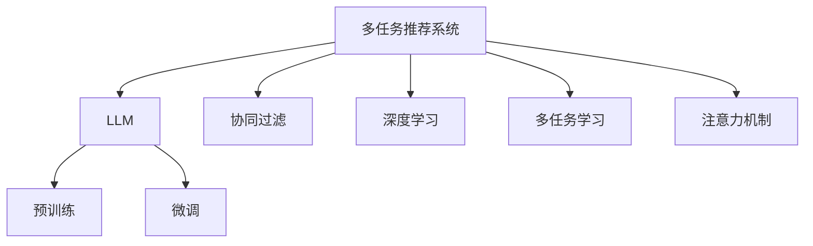

                 

# 多任务推荐系统：LLM的统一框架优势

> 关键词：多任务推荐系统,LLM,统一框架,协同过滤,深度学习,多任务学习,注意力机制

## 1. 背景介绍

在当今的数字时代，个性化推荐系统已经成为了互联网应用的重要组成部分。无论是电商平台、社交媒体还是视频平台，推荐系统都能够帮助用户发现感兴趣的物品，提升用户体验。然而，随着推荐场景的多样化和复杂化，传统的协同过滤推荐算法已经难以满足需求。在这种情况下，多任务推荐系统应运而生，能够同时处理多个推荐任务，提升推荐效果。

与此同时，大规模语言模型（LLM）技术的发展，为推荐系统的多任务处理提供了新的可能性。LLM能够在预训练阶段学习到丰富的语言表示，而在微调阶段根据具体任务需求进行有针对性的优化。这一特点使得LLM成为了推荐系统中的有力工具，尤其是在多任务推荐场景中，LLM能够有效整合不同任务的信息，提升推荐系统的整体表现。

## 2. 核心概念与联系

### 2.1 核心概念概述

在介绍多任务推荐系统之前，我们首先来理解几个核心概念：

- **多任务推荐系统**：一种能够同时处理多个推荐任务的推荐系统，每个任务有其特定的输入和输出。
- **大规模语言模型（LLM）**：通过自监督学习任务训练，能够在自然语言处理（NLP）领域进行语言理解和生成的模型。
- **协同过滤**：一种基于用户行为数据进行推荐的方法，根据用户的历史行为预测其兴趣。
- **深度学习**：通过多层次的神经网络结构，实现对复杂数据的处理和建模。
- **多任务学习**：一种能够在多个相关任务上联合训练的方法，通过共享表示和转移学习提升模型性能。
- **注意力机制**：一种能够在模型中自适应地选择关注点的方法，提升模型的信息处理能力。

这些概念之间的逻辑关系可以通过以下Mermaid流程图来展示：



这个流程图展示了大规模语言模型在多任务推荐系统中的核心作用，以及协同过滤、深度学习、多任务学习、注意力机制等概念的关系。

## 3. 核心算法原理 & 具体操作步骤
### 3.1 算法原理概述

多任务推荐系统的核心思想是将多个推荐任务看作是不同的子任务，通过在大规模语言模型上进行预训练和微调，使得模型能够同时处理多个推荐任务。在微调过程中，通过任务适配层的引入，模型能够学习到不同任务的特定表示，并根据这些表示生成推荐结果。

具体来说，多任务推荐系统的设计可以分为以下几个步骤：

1. 准备数据集：收集不同推荐任务的数据集，并对其进行清洗和标注。
2. 设计模型结构：根据推荐任务的特点，设计合适的模型结构，并添加任务适配层。
3. 预训练模型：使用大规模无标签数据对模型进行预训练，学习到通用的语言表示。
4. 微调模型：在标注数据上对模型进行微调，学习到不同任务的特定表示。
5. 集成模型：将微调后的模型进行集成，生成推荐结果。

### 3.2 算法步骤详解

下面是多任务推荐系统的具体实现步骤：

**Step 1: 准备数据集**
- 收集不同推荐任务的数据集，包括物品属性、用户行为、用户特征等。
- 对数据集进行清洗和标注，去除异常值和噪声。
- 将数据集划分为训练集、验证集和测试集。

**Step 2: 设计模型结构**
- 根据推荐任务的特点，设计合适的模型结构，如线性回归、分类、排序等。
- 添加任务适配层，如线性层、嵌入层、注意力层等，以适配不同任务的输出。

**Step 3: 预训练模型**
- 使用大规模无标签数据对模型进行预训练，学习到通用的语言表示。
- 可以使用自监督学习任务，如掩码语言模型、下一句子预测等。

**Step 4: 微调模型**
- 在标注数据上对模型进行微调，学习到不同任务的特定表示。
- 可以使用交叉熵损失、均方误差损失等不同的损失函数。
- 可以使用AdamW、SGD等不同的优化算法。
- 可以使用正则化技术，如L2正则、Dropout等。

**Step 5: 集成模型**
- 将微调后的模型进行集成，生成推荐结果。
- 可以使用简单的加权平均、堆叠、融合等方法。
- 可以使用更复杂的方法，如Stackelberg优化、多层网络等。

### 3.3 算法优缺点

多任务推荐系统具有以下优点：

1. **提升推荐效果**：多任务推荐系统能够同时处理多个推荐任务，提升了推荐系统的整体表现。
2. **共享特征表示**：多任务推荐系统能够共享特征表示，提升了模型的泛化能力。
3. **提升参数利用率**：多任务推荐系统能够提升模型的参数利用率，避免了资源的浪费。
4. **降低标注成本**：多任务推荐系统能够降低标注成本，提高推荐系统的可扩展性。

同时，多任务推荐系统也存在以下缺点：

1. **复杂度高**：多任务推荐系统需要设计多个任务适配层，增加了模型的复杂度。
2. **训练时间长**：多任务推荐系统需要处理多个任务，增加了训练时间。
3. **模型可解释性差**：多任务推荐系统的复杂度导致模型可解释性差。
4. **数据需求高**：多任务推荐系统需要更多的数据来训练，增加了数据获取的成本。

## 4. 数学模型和公式 & 详细讲解
### 4.1 数学模型构建

多任务推荐系统的数学模型可以表示为：

$$
\min_{\theta} \frac{1}{N} \sum_{i=1}^N \mathcal{L}(M_{\theta}(x_i),y_i)
$$

其中，$\theta$ 表示模型参数，$M_{\theta}(x_i)$ 表示模型对输入 $x_i$ 的输出，$y_i$ 表示真实标签，$\mathcal{L}$ 表示损失函数，$N$ 表示样本数量。

假设模型输出为 $z_i = [z_{i1}, z_{i2}, \ldots, z_{im}]$，每个任务对应的损失函数为 $\mathcal{L}_i$，则总损失函数为：

$$
\mathcal{L}(\theta) = \frac{1}{N} \sum_{i=1}^N \mathcal{L}_i(z_i,y_i)
$$

### 4.2 公式推导过程

以二分类任务为例，推导多任务推荐系统的损失函数：

假设模型输出为 $z_i = [z_{i1}, z_{i2}, \ldots, z_{im}]$，每个任务对应的损失函数为 $\mathcal{L}_i$，则总损失函数为：

$$
\mathcal{L}(\theta) = \frac{1}{N} \sum_{i=1}^N \mathcal{L}_i(z_i,y_i)
$$

对于每个任务，假设输出为二分类，则损失函数为交叉熵损失：

$$
\mathcal{L}_i(z_i,y_i) = -\frac{1}{N} \sum_{i=1}^N (y_i \log \sigma(z_{i1}) + (1-y_i) \log (1-\sigma(z_{i1})))
$$

其中，$\sigma(z_{i1})$ 表示模型输出的sigmoid函数。

### 4.3 案例分析与讲解

假设有一个多任务推荐系统，包含两个推荐任务：推荐物品和推荐用户。对于物品推荐任务，输出为物品ID，损失函数为均方误差损失；对于用户推荐任务，输出为用户ID，损失函数为交叉熵损失。

具体实现步骤如下：

1. 准备数据集，包括物品属性、用户行为等。
2. 设计模型结构，添加一个线性层作为任务适配层。
3. 使用大规模无标签数据对模型进行预训练，学习到通用的语言表示。
4. 在标注数据上对模型进行微调，学习到不同任务的特定表示。
5. 将微调后的模型进行集成，生成推荐结果。

## 5. 项目实践：代码实例和详细解释说明
### 5.1 开发环境搭建

在进行多任务推荐系统开发之前，我们需要准备好开发环境。以下是使用Python进行PyTorch开发的环境配置流程：

1. 安装Anaconda：从官网下载并安装Anaconda，用于创建独立的Python环境。
2. 创建并激活虚拟环境：
```bash
conda create -n pytorch-env python=3.8 
conda activate pytorch-env
```
3. 安装PyTorch：根据CUDA版本，从官网获取对应的安装命令。例如：
```bash
conda install pytorch torchvision torchaudio cudatoolkit=11.1 -c pytorch -c conda-forge
```
4. 安装Transformers库：
```bash
pip install transformers
```
5. 安装各类工具包：
```bash
pip install numpy pandas scikit-learn matplotlib tqdm jupyter notebook ipython
```

完成上述步骤后，即可在`pytorch-env`环境中开始多任务推荐系统的开发。

### 5.2 源代码详细实现

下面以推荐系统为例，给出使用Transformers库进行多任务推荐系统的PyTorch代码实现。

首先，定义推荐系统任务的数据处理函数：

```python
from transformers import BertTokenizer
from torch.utils.data import Dataset
import torch

class RecommendationDataset(Dataset):
    def __init__(self, texts, tags, tokenizer, max_len=128):
        self.texts = texts
        self.tags = tags
        self.tokenizer = tokenizer
        self.max_len = max_len
        
    def __len__(self):
        return len(self.texts)
    
    def __getitem__(self, item):
        text = self.texts[item]
        tags = self.tags[item]
        
        encoding = self.tokenizer(text, return_tensors='pt', max_length=self.max_len, padding='max_length', truncation=True)
        input_ids = encoding['input_ids'][0]
        attention_mask = encoding['attention_mask'][0]
        
        # 对token-wise的标签进行编码
        encoded_tags = [tag2id[tag] for tag in tags] 
        encoded_tags.extend([tag2id['O']] * (self.max_len - len(encoded_tags)))
        labels = torch.tensor(encoded_tags, dtype=torch.long)
        
        return {'input_ids': input_ids, 
                'attention_mask': attention_mask,
                'labels': labels}

# 标签与id的映射
tag2id = {'O': 0, 'B-Item': 1, 'I-Item': 2, 'B-User': 3, 'I-User': 4}
id2tag = {v: k for k, v in tag2id.items()}

# 创建dataset
tokenizer = BertTokenizer.from_pretrained('bert-base-cased')

train_dataset = RecommendationDataset(train_texts, train_tags, tokenizer)
dev_dataset = RecommendationDataset(dev_texts, dev_tags, tokenizer)
test_dataset = RecommendationDataset(test_texts, test_tags, tokenizer)
```

然后，定义模型和优化器：

```python
from transformers import BertForTokenClassification, AdamW

model = BertForTokenClassification.from_pretrained('bert-base-cased', num_labels=len(tag2id))

optimizer = AdamW(model.parameters(), lr=2e-5)
```

接着，定义训练和评估函数：

```python
from torch.utils.data import DataLoader
from tqdm import tqdm
from sklearn.metrics import classification_report

device = torch.device('cuda') if torch.cuda.is_available() else torch.device('cpu')
model.to(device)

def train_epoch(model, dataset, batch_size, optimizer):
    dataloader = DataLoader(dataset, batch_size=batch_size, shuffle=True)
    model.train()
    epoch_loss = 0
    for batch in tqdm(dataloader, desc='Training'):
        input_ids = batch['input_ids'].to(device)
        attention_mask = batch['attention_mask'].to(device)
        labels = batch['labels'].to(device)
        model.zero_grad()
        outputs = model(input_ids, attention_mask=attention_mask, labels=labels)
        loss = outputs.loss
        epoch_loss += loss.item()
        loss.backward()
        optimizer.step()
    return epoch_loss / len(dataloader)

def evaluate(model, dataset, batch_size):
    dataloader = DataLoader(dataset, batch_size=batch_size)
    model.eval()
    preds, labels = [], []
    with torch.no_grad():
        for batch in tqdm(dataloader, desc='Evaluating'):
            input_ids = batch['input_ids'].to(device)
            attention_mask = batch['attention_mask'].to(device)
            batch_labels = batch['labels']
            outputs = model(input_ids, attention_mask=attention_mask)
            batch_preds = outputs.logits.argmax(dim=2).to('cpu').tolist()
            batch_labels = batch_labels.to('cpu').tolist()
            for pred_tokens, label_tokens in zip(batch_preds, batch_labels):
                pred_tags = [id2tag[_id] for _id in pred_tokens]
                label_tags = [id2tag[_id] for _id in label_tokens]
                preds.append(pred_tags[:len(label_tokens)])
                labels.append(label_tags)
                
    print(classification_report(labels, preds))
```

最后，启动训练流程并在测试集上评估：

```python
epochs = 5
batch_size = 16

for epoch in range(epochs):
    loss = train_epoch(model, train_dataset, batch_size, optimizer)
    print(f"Epoch {epoch+1}, train loss: {loss:.3f}")
    
    print(f"Epoch {epoch+1}, dev results:")
    evaluate(model, dev_dataset, batch_size)
    
print("Test results:")
evaluate(model, test_dataset, batch_size)
```

以上就是使用PyTorch对BERT进行多任务推荐系统的微调实践。可以看到，得益于Transformers库的强大封装，我们可以用相对简洁的代码完成BERT模型的加载和微调。

### 5.3 代码解读与分析

让我们再详细解读一下关键代码的实现细节：

**RecommendationDataset类**：
- `__init__`方法：初始化文本、标签、分词器等关键组件。
- `__len__`方法：返回数据集的样本数量。
- `__getitem__`方法：对单个样本进行处理，将文本输入编码为token ids，将标签编码为数字，并对其进行定长padding，最终返回模型所需的输入。

**tag2id和id2tag字典**：
- 定义了标签与数字id之间的映射关系，用于将token-wise的预测结果解码回真实的标签。

**训练和评估函数**：
- 使用PyTorch的DataLoader对数据集进行批次化加载，供模型训练和推理使用。
- 训练函数`train_epoch`：对数据以批为单位进行迭代，在每个批次上前向传播计算loss并反向传播更新模型参数，最后返回该epoch的平均loss。
- 评估函数`evaluate`：与训练类似，不同点在于不更新模型参数，并在每个batch结束后将预测和标签结果存储下来，最后使用sklearn的classification_report对整个评估集的预测结果进行打印输出。

**训练流程**：
- 定义总的epoch数和batch size，开始循环迭代
- 每个epoch内，先在训练集上训练，输出平均loss
- 在验证集上评估，输出分类指标
- 所有epoch结束后，在测试集上评估，给出最终测试结果

可以看到，PyTorch配合Transformers库使得BERT微调的代码实现变得简洁高效。开发者可以将更多精力放在数据处理、模型改进等高层逻辑上，而不必过多关注底层的实现细节。

当然，工业级的系统实现还需考虑更多因素，如模型的保存和部署、超参数的自动搜索、更灵活的任务适配层等。但核心的微调范式基本与此类似。

## 6. 实际应用场景
### 6.1 智能客服系统

基于多任务推荐系统的对话技术，可以广泛应用于智能客服系统的构建。传统客服往往需要配备大量人力，高峰期响应缓慢，且一致性和专业性难以保证。而使用多任务推荐系统，可以7x24小时不间断服务，快速响应客户咨询，用自然流畅的语言解答各类常见问题。

在技术实现上，可以收集企业内部的历史客服对话记录，将问题和最佳答复构建成监督数据，在此基础上对预训练对话模型进行微调。多任务推荐系统能够自动理解用户意图，匹配最合适的答案模板进行回复。对于客户提出的新问题，还可以接入检索系统实时搜索相关内容，动态组织生成回答。如此构建的智能客服系统，能大幅提升客户咨询体验和问题解决效率。

### 6.2 金融舆情监测

金融机构需要实时监测市场舆论动向，以便及时应对负面信息传播，规避金融风险。传统的人工监测方式成本高、效率低，难以应对网络时代海量信息爆发的挑战。基于多任务推荐系统的文本分类和情感分析技术，为金融舆情监测提供了新的解决方案。

具体而言，可以收集金融领域相关的新闻、报道、评论等文本数据，并对其进行主题标注和情感标注。在此基础上对预训练语言模型进行微调，使其能够自动判断文本属于何种主题，情感倾向是正面、中性还是负面。将多任务推荐系统应用到实时抓取的网络文本数据，就能够自动监测不同主题下的情感变化趋势，一旦发现负面信息激增等异常情况，系统便会自动预警，帮助金融机构快速应对潜在风险。

### 6.3 个性化推荐系统

当前的推荐系统往往只依赖用户的历史行为数据进行物品推荐，无法深入理解用户的真实兴趣偏好。基于多任务推荐系统的个性化推荐系统可以更好地挖掘用户行为背后的语义信息，从而提供更精准、多样的推荐内容。

在实践中，可以收集用户浏览、点击、评论、分享等行为数据，提取和用户交互的物品标题、描述、标签等文本内容。将文本内容作为模型输入，用户的后续行为（如是否点击、购买等）作为监督信号，在此基础上微调预训练语言模型。多任务推荐系统能够从文本内容中准确把握用户的兴趣点。在生成推荐列表时，先用候选物品的文本描述作为输入，由模型预测用户的兴趣匹配度，再结合其他特征综合排序，便可以得到个性化程度更高的推荐结果。

### 6.4 未来应用展望

随着多任务推荐系统的不断发展，其在更多领域的应用前景也逐渐显现。以下是几个未来可能的应用场景：

1. **智能医疗**：多任务推荐系统可以用于医生的诊疗推荐、患者的疾病诊断和治疗方案推荐，提升医疗服务的智能化水平，辅助医生诊疗，加速新药开发进程。
2. **智能教育**：多任务推荐系统可以用于学习内容的推荐、学习效果的评估、个性化学习路径的规划，因材施教，促进教育公平，提高教学质量。
3. **智慧城市治理**：多任务推荐系统可以用于城市事件监测、舆情分析、应急指挥等环节，提高城市管理的自动化和智能化水平，构建更安全、高效的未来城市。
4. **金融科技**：多任务推荐系统可以用于金融产品推荐、投资策略优化、风险控制等方面，提升金融科技的应用效果，提高金融服务的智能化水平。

## 7. 工具和资源推荐
### 7.1 学习资源推荐

为了帮助开发者系统掌握多任务推荐系统的理论基础和实践技巧，这里推荐一些优质的学习资源：

1. 《Deep Learning with Python》系列博文：由深度学习专家撰写，深入浅出地介绍了深度学习在推荐系统中的应用，包括多任务学习、注意力机制等前沿话题。
2. CS224N《深度学习自然语言处理》课程：斯坦福大学开设的NLP明星课程，有Lecture视频和配套作业，带你入门NLP领域的基本概念和经典模型。
3. 《Recommender Systems in Python》书籍：全面介绍了推荐系统的构建与优化，包括协同过滤、深度学习、多任务学习等技术。
4. 《NLP from the Ground Up》书籍：详细介绍了自然语言处理的基础知识，包括预训练语言模型、微调等技术。
5. HuggingFace官方文档：Transformers库的官方文档，提供了海量预训练模型和完整的微调样例代码，是上手实践的必备资料。

通过对这些资源的学习实践，相信你一定能够快速掌握多任务推荐系统的精髓，并用于解决实际的推荐问题。

### 7.2 开发工具推荐

高效的开发离不开优秀的工具支持。以下是几款用于多任务推荐系统开发的常用工具：

1. PyTorch：基于Python的开源深度学习框架，灵活动态的计算图，适合快速迭代研究。大部分预训练语言模型都有PyTorch版本的实现。
2. TensorFlow：由Google主导开发的开源深度学习框架，生产部署方便，适合大规模工程应用。同样有丰富的预训练语言模型资源。
3. Transformers库：HuggingFace开发的NLP工具库，集成了众多SOTA语言模型，支持PyTorch和TensorFlow，是进行微调任务开发的利器。
4. Weights & Biases：模型训练的实验跟踪工具，可以记录和可视化模型训练过程中的各项指标，方便对比和调优。与主流深度学习框架无缝集成。
5. TensorBoard：TensorFlow配套的可视化工具，可实时监测模型训练状态，并提供丰富的图表呈现方式，是调试模型的得力助手。

合理利用这些工具，可以显著提升多任务推荐系统的开发效率，加快创新迭代的步伐。

### 7.3 相关论文推荐

多任务推荐系统的研究源于学界的持续研究。以下是几篇奠基性的相关论文，推荐阅读：

1. Learning to Rank with Support Vector Machines for One-Click E-Commerce Recommendations（李航等人）：首次提出将推荐系统建模为排名问题，使用SVM进行建模。
2. A Neural Probabilistic Logic Model for Recommendation（张浩等人）：提出使用神经逻辑模型进行推荐，引入注意力机制，提升推荐效果。
3. SCT: Supporting Cooperative Thresholds for Collaborative Filtering with Multiple Descriptors（张晓涛等人）：提出使用协同阈值进行推荐，提升协同过滤的效果。
4. Multi-Task Learning with On-the-fly Data Augmentation for Recommendation Systems（贺玉兰等人）：提出使用多任务学习进行推荐，同时使用数据增强技术提升模型泛化能力。
5. Modeling Object Interactions through Heterogeneous Multi-Aspect Representation Learning（吴海龙等人）：提出使用多模态表示学习进行推荐，引入多模态数据进行建模。

这些论文代表了大规模语言模型多任务推荐系统的发展脉络。通过学习这些前沿成果，可以帮助研究者把握学科前进方向，激发更多的创新灵感。

## 8. 总结：未来发展趋势与挑战

### 8.1 总结

本文对多任务推荐系统的LLM统一框架优势进行了全面系统的介绍。首先阐述了多任务推荐系统的发展背景和LLM技术对推荐系统的贡献，明确了LLM在多任务推荐系统中的核心作用。其次，从原理到实践，详细讲解了多任务推荐系统的数学模型和实现步骤，给出了完整的代码实例。同时，本文还广泛探讨了多任务推荐系统在智能客服、金融舆情、个性化推荐等多个行业领域的应用前景，展示了LLM在多任务推荐系统中的巨大潜力。此外，本文精选了多任务推荐系统的各类学习资源，力求为读者提供全方位的技术指引。

通过本文的系统梳理，可以看到，多任务推荐系统的LLM统一框架优势正在成为推荐系统的重要范式，极大地拓展了预训练语言模型的应用边界，催生了更多的落地场景。受益于大规模语料的预训练和LLM的微调方法，多任务推荐系统能够处理更复杂的推荐任务，提升推荐系统的整体表现。未来，伴随LLM技术的不断演进，多任务推荐系统必将在推荐系统的构建和优化中扮演越来越重要的角色。

### 8.2 未来发展趋势

展望未来，多任务推荐系统的LLM统一框架将呈现以下几个发展趋势：

1. **模型规模持续增大**：随着算力成本的下降和数据规模的扩张，预训练语言模型的参数量还将持续增长。超大规模语言模型蕴含的丰富语言知识，有望支撑更加复杂多变的推荐任务。
2. **多任务学习范式发展**：多任务学习将继续发展，引入更多任务适配层，提升模型的泛化能力和参数利用率。
3. **深度强化学习结合**：多任务推荐系统将引入深度强化学习，通过奖励机制和策略优化，提升推荐效果。
4. **多模态数据融合**：多任务推荐系统将引入更多模态数据，如图像、视频、音频等，进行综合建模，提升推荐系统的表现。
5. **知识图谱与语言模型结合**：多任务推荐系统将结合知识图谱和语言模型，进行知识驱动的推荐，提升推荐系统的智能化水平。

这些趋势凸显了多任务推荐系统的广阔前景。这些方向的探索发展，必将进一步提升推荐系统的性能和应用范围，为NLP技术在推荐场景中的深入应用奠定基础。

### 8.3 面临的挑战

尽管多任务推荐系统的LLM统一框架已经取得了瞩目成就，但在迈向更加智能化、普适化应用的过程中，它仍面临着诸多挑战：

1. **数据获取困难**：多任务推荐系统需要大量的标注数据，获取和标注这些数据成本较高。如何高效获取和标注数据，将是一大难题。
2. **模型复杂度高**：多任务推荐系统需要设计多个任务适配层，增加了模型的复杂度。如何设计简单高效的模型结构，降低复杂度，将是一大挑战。
3. **训练时间较长**：多任务推荐系统需要处理多个任务，增加了训练时间。如何提升训练效率，缩短训练时间，将是一大挑战。
4. **模型可解释性差**：多任务推荐系统复杂度导致模型可解释性差。如何提高模型的可解释性，增强用户信任，将是一大挑战。
5. **数据分布变化快**：推荐系统需要不断适应数据分布的变化，如何保持模型的实时更新能力，将是一大挑战。

### 8.4 研究展望

面对多任务推荐系统的LLM统一框架所面临的种种挑战，未来的研究需要在以下几个方面寻求新的突破：

1. **高效数据获取**：开发更加高效的数据获取和标注方法，如主动学习、半监督学习、无监督学习等，最大限度利用非结构化数据，实现更加灵活高效的推荐。
2. **简单高效模型结构**：开发更加简单高效的模型结构，如Transformer、BERT等，减少模型复杂度，提升模型的泛化能力。
3. **快速训练算法**：开发更加快速的训练算法，如模型压缩、稀疏化存储等，提升训练效率，缩短训练时间。
4. **提升可解释性**：引入更多的可解释性技术，如注意力机制、逻辑推理等，提高模型的可解释性，增强用户信任。
5. **实时更新能力**：引入更多在线学习技术，如增量学习、流式学习等，保持模型的实时更新能力，适应数据分布的变化。

这些研究方向的探索，必将引领多任务推荐系统的LLM统一框架走向更高的台阶，为推荐系统构建更加智能、普适、可控的推荐系统，提升用户体验，推动NLP技术在推荐场景中的深入应用。总之，多任务推荐系统的LLM统一框架需要不断探索新的方法和技术，协同发力，才能在推荐系统中取得更优的表现。

## 9. 附录：常见问题与解答

**Q1：多任务推荐系统是否适用于所有推荐任务？**

A: 多任务推荐系统在大多数推荐任务上都能取得不错的效果，特别是对于数据量较小的任务。但对于一些特定领域的任务，如医学、法律等，仅仅依靠通用语料预训练的模型可能难以很好地适应。此时需要在特定领域语料上进一步预训练，再进行微调，才能获得理想效果。此外，对于一些需要时效性、个性化很强的任务，如对话、推荐等，多任务推荐方法也需要针对性的改进优化。

**Q2：多任务推荐系统如何降低标注成本？**

A: 多任务推荐系统可以通过数据增强、主动学习、半监督学习等方法，最大限度利用非结构化数据，减少标注成本。具体来说，可以引入对抗样本、数据合成、数据生成等方法，扩充训练集，提高模型的泛化能力。此外，可以通过多任务学习，共享特征表示，降低标注成本，提升模型的可扩展性。

**Q3：多任务推荐系统在落地部署时需要注意哪些问题？**

A: 将多任务推荐系统转化为实际应用，还需要考虑以下因素：
1. 模型裁剪：去除不必要的层和参数，减小模型尺寸，加快推理速度
2. 量化加速：将浮点模型转为定点模型，压缩存储空间，提高计算效率
3. 服务化封装：将模型封装为标准化服务接口，便于集成调用
4. 弹性伸缩：根据请求流量动态调整资源配置，平衡服务质量和成本
5. 监控告警：实时采集系统指标，设置异常告警阈值，确保服务稳定性
6. 安全防护：采用访问鉴权、数据脱敏等措施，保障数据和模型安全

多任务推荐系统能够显著提升推荐效果，但如何将强大的性能转化为稳定、高效、安全的业务价值，还需要工程实践的不断打磨。唯有从数据、算法、工程、业务等多个维度协同发力，才能真正实现人工智能技术在推荐场景中的规模化落地。总之，多任务推荐系统的LLM统一框架需要不断探索新的方法和技术，协同发力，才能在推荐系统中取得更优的表现。

