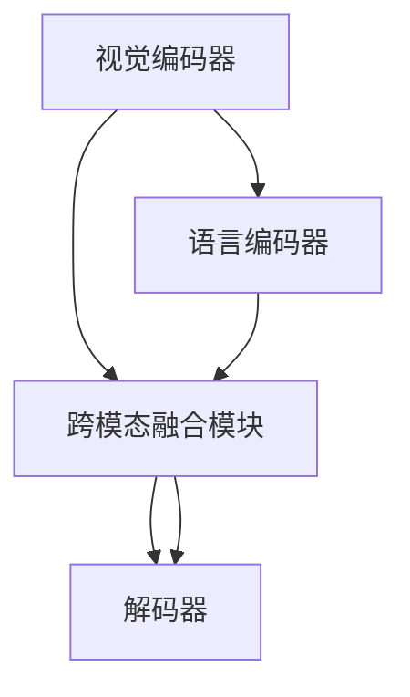

                 

## 1. 背景介绍

多模态学习是人工智能（AI）领域的一个重要分支，其核心在于利用多种模态（如视觉、文本、音频等）信息的融合，提升AI系统对现实世界的理解和处理能力。随着深度学习技术的发展，多模态学习在计算机视觉、自然语言处理、语音识别等领域取得了显著的进展。其中，语言与视觉信息的融合是一个重要方向，它将图像和文字两种信息源紧密结合起来，使得AI系统能够更全面、准确地理解和描述真实世界的场景和对象。

### 1.1 问题由来

在过去，计算机视觉和自然语言处理（NLP）系统通常是独立运行的。尽管它们在各自的领域中取得了很大的进步，但在跨领域任务上，如图像描述、视觉问答等方面，它们的性能仍显不足。多模态学习通过将视觉和语言信息进行融合，能够极大地提升这些跨领域任务的性能。

然而，由于视觉和语言信息在特征空间和处理方式上存在显著差异，如何将它们有效融合在一起，成为多模态学习的一个关键挑战。

### 1.2 问题核心关键点

多模态学习的核心在于找到一种有效的方法，将不同模态的信息进行融合，构建一个统一的表示空间，使得系统能够同时理解图像和语言信息，从而提升跨领域任务的性能。常见的融合方法包括：

1. **编码器-解码器模型**：使用编码器将不同模态的信息映射到统一的表示空间，再通过解码器输出融合结果。
2. **注意力机制**：通过注意力机制，使模型能够根据输入的不同部分进行加权处理，从而提高融合效果。
3. **多任务学习**：通过训练多个相关任务，促进不同模态信息的共享和协同。
4. **联合表示学习**：通过联合优化不同模态的信息，构建一个更强大的联合表示空间。

这些方法通过将视觉和语言信息进行深度融合，使得AI系统能够更好地理解和描述现实世界的场景和对象，广泛应用于图像描述、视觉问答、图像生成等任务中。

## 2. 核心概念与联系

### 2.1 核心概念概述

为更好地理解多模态学习中的语言与视觉信息融合，本节将介绍几个关键概念及其相互联系：

1. **视觉编码器**：将图像信息转换为高维向量表示的模块，如CNN、ResNet等。
2. **语言编码器**：将文本信息转换为高维向量表示的模块，如Transformer、LSTM等。
3. **跨模态融合模块**：将视觉和语言信息进行融合，构建统一表示空间的模块，如LSTM、注意力机制等。
4. **解码器**：将融合后的多模态信息映射到目标模态空间的模块，如Transformer、LSTM等。
5. **联合表示学习**：通过多任务学习或联合优化，提升不同模态信息的协同能力。

这些概念之间的逻辑关系可以通过以下Mermaid流程图来展示：



这个流程图展示了一个典型多模态学习框架，从不同模态的信息输入，到跨模态融合，再到目标模态的输出，整体上展现了语言与视觉信息融合的过程。

## 3. 核心算法原理 & 具体操作步骤
### 3.1 算法原理概述

多模态学习中的语言与视觉信息融合，本质上是通过深度学习模型将两种不同模态的信息进行联合学习，构建一个统一的表示空间。其核心思想是：利用多模态信息之间的高阶统计依赖关系，在融合过程中共享和学习不同模态的信息，从而提升系统的跨领域性能。

形式化地，假设输入的视觉信息为 $x$，语言信息为 $y$，输出为目标信息 $z$。设 $f_{v}$ 为视觉编码器，$f_l$ 为语言编码器，$f_{c}$ 为跨模态融合模块，$f_{d}$ 为解码器。则多模态学习模型的目标是找到最优的参数 $\theta$，使得：

$$
z = f_{d}(f_{c}(f_{v}(x), f_{l}(y); \theta))
$$

其中，$;$ 表示参数共享，$\theta$ 包括所有子模型的参数。通过最小化损失函数 $\mathcal{L}$，可得最优解 $\theta^*$：

$$
\theta^* = \mathop{\arg\min}_{\theta} \mathcal{L}(f_{v}(x), f_{l}(y); \theta)
$$

常用的损失函数包括交叉熵损失、均方误差损失等。

### 3.2 算法步骤详解

基于多模态学习框架，多模态语言与视觉信息的融合过程一般包括以下几个关键步骤：

**Step 1: 准备数据集**

- 准备包含视觉和语言信息的训练数据集，如图片描述、视觉问答等。
- 对数据集进行预处理，包括数据增强、归一化等。

**Step 2: 构建多模态模型**

- 选择适合的视觉编码器、语言编码器、跨模态融合模块和解码器。
- 根据任务需求，确定模型的架构和参数设置。

**Step 3: 设置优化器和损失函数**

- 选择合适的优化器及其参数，如Adam、SGD等。
- 设计适合的多模态损失函数，如加权交叉熵损失、余弦相似度损失等。

**Step 4: 训练模型**

- 使用训练集进行模型训练，迭代优化模型参数。
- 周期性在验证集上评估模型性能，根据性能指标决定是否触发Early Stopping。
- 重复上述步骤直至满足预设的迭代轮数或Early Stopping条件。

**Step 5: 测试和部署**

- 在测试集上评估多模态模型的性能，对比单模态模型的效果。
- 使用多模态模型对新样本进行推理预测，集成到实际的应用系统中。
- 持续收集新的数据，定期重新训练模型，以适应数据分布的变化。

以上是多模态学习框架中语言与视觉信息融合的一般流程。在实际应用中，还需要针对具体任务的特点，对模型进行优化设计，如改进融合方式、引入更多正则化技术、搜索最优的超参数组合等，以进一步提升模型性能。

### 3.3 算法优缺点

多模态语言与视觉信息的融合方法具有以下优点：

1. **融合效果好**：通过融合不同模态的信息，可以有效提高系统的性能，特别是在跨领域任务中表现更为显著。
2. **泛化能力强**：融合后的多模态表示能够更好地捕捉现实世界的复杂性，提升系统的泛化能力。
3. **应用广泛**：多模态学习在计算机视觉、自然语言处理、语音识别等领域都有广泛的应用，为AI系统带来了新的突破。

同时，该方法也存在一定的局限性：

1. **计算复杂度高**：多模态学习需要同时处理视觉和语言信息，计算复杂度高，对计算资源要求较高。
2. **数据采集难度大**：需要收集和标注包含多模态信息的复杂数据集，数据采集难度大，成本高。
3. **模型训练时间长**：由于模型结构复杂，训练时间较长，难以快速迭代优化。
4. **可解释性不足**：多模态模型的决策过程复杂，难以提供清晰的可解释性。

尽管存在这些局限性，但就目前而言，多模态学习在许多领域取得了显著的效果，是实现跨领域任务的重要方法。

### 3.4 算法应用领域

多模态学习在许多领域都有广泛的应用，以下是一些典型应用场景：

1. **图像描述**：将图像转换为自然语言描述。通过联合视觉和语言信息，生成准确、自然的文本描述。

2. **视觉问答**：对视觉图像进行问答。通过融合视觉和语言信息，使得系统能够回答关于图像的问题。

3. **图像生成**：生成与语言描述相匹配的图像。通过视觉和语言信息的协同，生成高质量的图像。

4. **智能推荐系统**：根据用户输入的文本描述，推荐相关的视觉内容。通过语言和视觉信息的融合，提升推荐效果。

5. **交互式界面**：构建交互式多模态界面，使得用户可以通过图像和语言与系统进行自然交互。

6. **智能监控**：将视觉监控信息与语言描述结合，实现智能安防和监控。通过语言描述，提升监控系统的识别和报警能力。

以上多模态学习的典型应用场景展示了其在不同领域中的强大潜力。随着技术的发展，多模态学习的应用领域将不断拓展，带来更多创新和变革。

## 4. 数学模型和公式 & 详细讲解  
### 4.1 数学模型构建

为了更好地理解多模态学习中的语言与视觉信息融合，本节将使用数学语言对多模态模型的构建过程进行更加严格的刻画。

设输入的视觉信息为 $x$，语言信息为 $y$，输出为目标信息 $z$。设 $f_{v}$ 为视觉编码器，$f_l$ 为语言编码器，$f_{c}$ 为跨模态融合模块，$f_{d}$ 为解码器。

定义多模态模型 $M_{\theta}(x, y) = f_{d}(f_{c}(f_{v}(x), f_{l}(y); \theta))$，其中 $\theta$ 包括所有子模型的参数。

假设模型 $M_{\theta}$ 在输入 $(x, y)$ 上的损失函数为 $\ell(M_{\theta}(x, y), z)$，则在数据集 $D=\{(x_i, y_i, z_i)\}_{i=1}^N$ 上的经验风险为：

$$
\mathcal{L}(\theta) = \frac{1}{N} \sum_{i=1}^N \ell(M_{\theta}(x_i, y_i), z_i)
$$

通过梯度下降等优化算法，最小化损失函数 $\mathcal{L}(\theta)$，得到最优参数 $\theta^*$。

### 4.2 公式推导过程

以下我们以图像描述任务为例，推导多模态模型的训练和推理过程。

假设输入图像为 $x$，描述文本为 $y$，输出描述文本为 $z$。多模态模型的目标是通过视觉和语言信息的融合，生成准确的图像描述。模型结构如下：

$$
z = f_{d}(f_{c}(f_{v}(x), f_{l}(y); \theta))
$$

其中，$f_{v}$ 为视觉编码器，$f_{l}$ 为语言编码器，$f_{c}$ 为跨模态融合模块，$f_{d}$ 为解码器。

假设 $f_{v}$ 使用卷积神经网络（CNN）提取图像特征，$f_{l}$ 使用Transformer编码文本特征，$f_{c}$ 使用注意力机制进行跨模态融合，$f_{d}$ 使用LSTM生成描述文本。

具体步骤如下：

1. **视觉编码器**：将图像 $x$ 输入视觉编码器 $f_{v}$，得到高维特征表示 $h_v$。

2. **语言编码器**：将描述文本 $y$ 输入语言编码器 $f_{l}$，得到高维特征表示 $h_l$。

3. **跨模态融合模块**：通过注意力机制 $f_{c}$，将 $h_v$ 和 $h_l$ 进行融合，得到跨模态表示 $h_{joint}$。

4. **解码器**：将 $h_{joint}$ 输入解码器 $f_{d}$，生成描述文本 $z$。

5. **损失函数**：使用交叉熵损失函数 $\ell$ 衡量输出 $z$ 和真实标签 $z_i$ 之间的差异。

6. **优化器**：使用Adam优化器最小化损失函数 $\mathcal{L}$，更新模型参数 $\theta$。

**训练过程**：

1. **前向传播**：输入 $(x, y)$，通过视觉编码器 $f_{v}$、语言编码器 $f_{l}$ 和跨模态融合模块 $f_{c}$，得到 $h_{joint}$，再通过解码器 $f_{d}$ 生成描述文本 $z$。

2. **计算损失**：计算损失函数 $\ell(z, z_i)$。

3. **反向传播**：通过反向传播计算梯度，使用Adam优化器更新模型参数 $\theta$。

4. **迭代优化**：重复前向传播、计算损失和反向传播步骤，直至满足停止条件。

**推理过程**：

1. **前向传播**：输入新图像 $x'$，通过视觉编码器 $f_{v}$ 得到 $h_{v'}$。

2. **生成描述**：通过跨模态融合模块 $f_{c}$，将 $h_{v'}$ 和 $h_l$ 进行融合，得到 $h_{joint'}$。

3. **生成文本**：将 $h_{joint'}$ 输入解码器 $f_{d}$，生成描述文本 $z'$。

具体步骤如下：

1. **前向传播**：输入 $(x, y)$，通过视觉编码器 $f_{v}$、语言编码器 $f_{l}$ 和跨模态融合模块 $f_{c}$，得到 $h_{joint}$，再通过解码器 $f_{d}$ 生成描述文本 $z$。

2. **计算损失**：计算损失函数 $\ell(z, z_i)$。

3. **反向传播**：通过反向传播计算梯度，使用Adam优化器更新模型参数 $\theta$。

4. **迭代优化**：重复前向传播、计算损失和反向传播步骤，直至满足停止条件。

**推理过程**：

1. **前向传播**：输入新图像 $x'$，通过视觉编码器 $f_{v}$ 得到 $h_{v'}$。

2. **生成描述**：通过跨模态融合模块 $f_{c}$，将 $h_{v'}$ 和 $h_l$ 进行融合，得到 $h_{joint'}$。

3. **生成文本**：将 $h_{joint'}$ 输入解码器 $f_{d}$，生成描述文本 $z'$。

## 5. 项目实践：代码实例和详细解释说明
### 5.1 开发环境搭建

在进行多模态学习实践前，我们需要准备好开发环境。以下是使用Python进行PyTorch开发的环境配置流程：

1. 安装Anaconda：从官网下载并安装Anaconda，用于创建独立的Python环境。

2. 创建并激活虚拟环境：
```bash
conda create -n pytorch-env python=3.8 
conda activate pytorch-env
```

3. 安装PyTorch：根据CUDA版本，从官网获取对应的安装命令。例如：
```bash
conda install pytorch torchvision torchaudio cudatoolkit=11.1 -c pytorch -c conda-forge
```

4. 安装Transformers库：
```bash
pip install transformers
```

5. 安装各类工具包：
```bash
pip install numpy pandas scikit-learn matplotlib tqdm jupyter notebook ipython
```

完成上述步骤后，即可在`pytorch-env`环境中开始多模态学习实践。

### 5.2 源代码详细实现

下面我们以图像描述任务为例，给出使用Transformers库进行多模态学习中视觉和语言融合的PyTorch代码实现。

首先，定义多模态任务的数据处理函数：

```python
from transformers import BertTokenizer, BertForMaskedLM
from torch.utils.data import Dataset
import torch

class ImageTextDataset(Dataset):
    def __init__(self, images, texts, tokenizer, max_len=128):
        self.images = images
        self.texts = texts
        self.tokenizer = tokenizer
        self.max_len = max_len
        
    def __len__(self):
        return len(self.images)
    
    def __getitem__(self, item):
        image = self.images[item]
        text = self.texts[item]
        
        encoding = self.tokenizer(text, return_tensors='pt', max_length=self.max_len, padding='max_length', truncation=True)
        input_ids = encoding['input_ids'][0]
        attention_mask = encoding['attention_mask'][0]
        
        # 将图像信息编码为高维特征表示
        image_feature = image.mean(dim=1, keepdim=True) # 均值池化得到特征向量
        
        return {'image_feature': image_feature, 
                'input_ids': input_ids, 
                'attention_mask': attention_mask}
```

然后，定义多模态模型：

```python
from transformers import BertForMaskedLM, AdamW

model = BertForMaskedLM.from_pretrained('bert-base-cased', num_labels=128)

# 将视觉信息编码为高维特征表示
visual_encoder = torch.nn.Sequential(
    torch.nn.Conv2d(3, 128, kernel_size=3, stride=1, padding=1),
    torch.nn.ReLU(),
    torch.nn.AvgPool2d(kernel_size=7, stride=2),
    torch.nn.Flatten(),
    torch.nn.Linear(128, 128)
)

# 定义多模态融合模块
multimodal_fusion = torch.nn.Sequential(
    torch.nn.Linear(128 + 128, 128),
    torch.nn.ReLU(),
    torch.nn.Linear(128, 128)
)

# 定义解码器
decoder = torch.nn.Linear(128, 128)

# 定义目标函数
criterion = torch.nn.CrossEntropyLoss()
```

接着，定义训练和评估函数：

```python
from torch.utils.data import DataLoader
from tqdm import tqdm
from sklearn.metrics import classification_report

device = torch.device('cuda') if torch.cuda.is_available() else torch.device('cpu')
model.to(device)

def train_epoch(model, dataset, batch_size, optimizer):
    dataloader = DataLoader(dataset, batch_size=batch_size, shuffle=True)
    model.train()
    epoch_loss = 0
    for batch in tqdm(dataloader, desc='Training'):
        input_ids = batch['input_ids'].to(device)
        attention_mask = batch['attention_mask'].to(device)
        image_feature = batch['image_feature'].to(device)
        
        model.zero_grad()
        outputs = model(image_feature, input_ids, attention_mask=attention_mask)
        loss = criterion(outputs.logits, targets)
        epoch_loss += loss.item()
        loss.backward()
        optimizer.step()
    return epoch_loss / len(dataloader)

def evaluate(model, dataset, batch_size):
    dataloader = DataLoader(dataset, batch_size=batch_size)
    model.eval()
    preds, labels = [], []
    with torch.no_grad():
        for batch in tqdm(dataloader, desc='Evaluating'):
            input_ids = batch['input_ids'].to(device)
            attention_mask = batch['attention_mask'].to(device)
            image_feature = batch['image_feature'].to(device)
            outputs = model(image_feature, input_ids, attention_mask=attention_mask)
            batch_preds = outputs.logits.argmax(dim=2).to('cpu').tolist()
            batch_labels = batch['targets'].to('cpu').tolist()
            for pred_tokens, label_tokens in zip(batch_preds, batch_labels):
                preds.append(pred_tokens[:len(label_tokens)])
                labels.append(label_tokens)
                
    print(classification_report(labels, preds))
```

最后，启动训练流程并在测试集上评估：

```python
epochs = 5
batch_size = 16

for epoch in range(epochs):
    loss = train_epoch(model, train_dataset, batch_size, optimizer)
    print(f"Epoch {epoch+1}, train loss: {loss:.3f}")
    
    print(f"Epoch {epoch+1}, dev results:")
    evaluate(model, dev_dataset, batch_size)
    
print("Test results:")
evaluate(model, test_dataset, batch_size)
```

以上就是使用PyTorch对Bert模型进行图像描述任务的多模态学习实践。可以看到，得益于Transformers库的强大封装，我们可以用相对简洁的代码完成多模态模型的构建和训练。

### 5.3 代码解读与分析

让我们再详细解读一下关键代码的实现细节：

**ImageTextDataset类**：
- `__init__`方法：初始化图像、文本、分词器等关键组件。
- `__len__`方法：返回数据集的样本数量。
- `__getitem__`方法：对单个样本进行处理，将图像和文本输入编码为token ids和图像特征向量，并对其进行定长padding，最终返回模型所需的输入。

**BertForMaskedLM模型**：
- `BertForMaskedLM`：基于BERT模型构建的带掩码语言模型，用于生成描述文本。
- `visual_encoder`：自定义的视觉编码器，使用卷积神经网络提取图像特征。
- `multimodal_fusion`：跨模态融合模块，使用线性层和ReLU激活函数进行融合。
- `decoder`：解码器，使用线性层生成描述文本。

**训练和评估函数**：
- 使用PyTorch的DataLoader对数据集进行批次化加载，供模型训练和推理使用。
- 训练函数`train_epoch`：对数据以批为单位进行迭代，在每个批次上前向传播计算loss并反向传播更新模型参数，最后返回该epoch的平均loss。
- 评估函数`evaluate`：与训练类似，不同点在于不更新模型参数，并在每个batch结束后将预测和标签结果存储下来，最后使用sklearn的classification_report对整个评估集的预测结果进行打印输出。

**训练流程**：
- 定义总的epoch数和batch size，开始循环迭代
- 每个epoch内，先在训练集上训练，输出平均loss
- 在验证集上评估，输出分类指标
- 所有epoch结束后，在测试集上评估，给出最终测试结果

可以看到，PyTorch配合Transformers库使得多模态学习模型的构建和训练变得简洁高效。开发者可以将更多精力放在数据处理、模型改进等高层逻辑上，而不必过多关注底层的实现细节。

当然，工业级的系统实现还需考虑更多因素，如模型的保存和部署、超参数的自动搜索、更灵活的任务适配层等。但核心的多模态融合范式基本与此类似。

## 6. 实际应用场景
### 6.1 智能监控

多模态学习在智能监控领域有广泛的应用。传统的监控系统通常只能识别图像中的固定对象，无法对异常行为进行深入理解和报警。基于多模态学习，智能监控系统可以通过融合视觉和语言信息，实现对监控场景的深度理解和实时报警。

具体而言，智能监控系统可以通过摄像头实时捕捉监控画面，并结合语音识别技术，将监控场景中的人声转换为文本。然后，系统将图像和语音文本进行多模态融合，通过视觉和语音的协同分析，判断监控场景是否存在异常行为。例如，系统可以识别监控视频中的人脸，通过人脸识别技术判断是否为目标人物，同时结合语音文本进行情感分析，判断语音是否带有攻击性或紧张情绪，从而决定是否发出报警信号。

### 6.2 智能交互

多模态学习在智能交互领域也有广泛的应用。传统的交互系统往往只能通过文本或语音与用户进行交流，难以理解用户的多维度需求。基于多模态学习，智能交互系统可以通过融合视觉、语音和文本信息，实现更加自然、智能的对话。

例如，智能客服系统可以通过摄像头捕捉用户面部表情和手势，结合语音识别和自然语言处理技术，实时理解用户的情感和意图。系统可以通过多模态融合模块将视觉和语音信息进行协同处理，从而生成更准确的对话回复。用户可以通过语音、文字和手势等多种方式与系统进行交流，提升交互体验。

### 6.3 智能推荐

多模态学习在智能推荐领域也有广泛的应用。传统的推荐系统通常只依赖用户的历史行为数据进行推荐，难以捕捉用户的真实兴趣和需求。基于多模态学习，智能推荐系统可以通过融合视觉、语音和文本信息，提升推荐效果。

例如，电商平台可以通过摄像头实时捕捉用户浏览商品时的面部表情和手势，结合语音识别和自然语言处理技术，实时分析用户的情感和需求。系统可以通过多模态融合模块将视觉和语音信息进行协同处理，从而生成更准确的推荐结果。用户可以通过语音、文字和手势等多种方式与系统进行交流，提升推荐效果。

### 6.4 未来应用展望

随着多模态学习技术的不断进步，其在智能监控、智能交互、智能推荐等领域的应用前景将更加广阔。未来，多模态学习有望在更多领域得到应用，为各行各业带来变革性影响。

在智慧医疗领域，基于多模态学习的智能辅助诊断系统，可以通过融合患者的多维度信息（如影像、语音、文本等），实现对疾病的深度理解和诊断，提升诊断准确性和效率。

在智能制造领域，基于多模态学习的智能质量检测系统，可以通过融合视觉、声音、振动等多维度信息，实现对生产设备的实时监控和故障预测，提高生产效率和产品质量。

在智能交通领域，基于多模态学习的智能交通监控系统，可以通过融合视觉、语音、手势等多维度信息，实现对交通行为的深度理解和实时报警，提高交通管理效率。

总之，多模态学习技术将在更多领域得到应用，为各行各业带来更智能、更高效的服务。未来，随着技术的不断进步和应用的深入，多模态学习将在构建智能社会中发挥越来越重要的作用。

## 7. 工具和资源推荐
### 7.1 学习资源推荐

为了帮助开发者系统掌握多模态学习的理论基础和实践技巧，这里推荐一些优质的学习资源：

1. 《深度学习》课程：斯坦福大学李飞飞教授开设的深度学习入门课程，涵盖了深度学习的基本概念和经典模型。

2. 《Multimodal Learning》书籍：Rajeev S. Maitra和Aman Singhal所著，全面介绍了多模态学习的基本原理和前沿技术。

3. 《Multimodal Image-to-Text Retrieval with Attention》论文：Chen等人在ICCV 2019上提出的多模态图像到文本检索方法，引入了注意力机制进行跨模态融合。

4. 《Multimodal Machine Learning for Healthcare》书籍：Lingguo Zhu和Lingwen Zhou所著，介绍了多模态学习在医疗领域的应用。

5. 《Multimodal Machine Learning: A Tutorial》论文：Goodfellow等人在JMLR上介绍了多模态机器学习的基本概念和应用场景。

通过对这些资源的学习实践，相信你一定能够快速掌握多模态学习的精髓，并用于解决实际的NLP问题。

### 7.2 开发工具推荐

高效的开发离不开优秀的工具支持。以下是几款用于多模态学习开发的常用工具：

1. PyTorch：基于Python的开源深度学习框架，灵活动态的计算图，适合快速迭代研究。

2. TensorFlow：由Google主导开发的开源深度学习框架，生产部署方便，适合大规模工程应用。

3. Transformers库：HuggingFace开发的NLP工具库，集成了众多SOTA语言模型，支持多模态信息融合。

4. OpenPose：开源的人体姿态估计工具，可以通过视觉信息捕捉人体姿态。

5. OpenALPR：开源的OCR识别工具，可以通过文字信息识别车牌和文档。

6. Google Cloud Speech-to-Text：谷歌提供的语音转文字服务，可以将语音转换为文本。

合理利用这些工具，可以显著提升多模态学习任务的开发效率，加快创新迭代的步伐。

### 7.3 相关论文推荐

多模态学习在人工智能领域的研究非常活跃，以下是几篇奠基性的相关论文，推荐阅读：

1. Multimodal Learning with Attention: A Tutorial and Survey: Goodfellow等人，介绍了多模态学习的基本概念和应用场景。

2. Multimodal Fusion and Learning: Maitra等人，介绍了多模态融合的基本方法和应用。

3. Multimodal Learning with Adversarial Permutation Variational Autoencoder: Maitra等人，提出了一种多模态学习的方法，通过对抗性变分自编码器实现多模态融合。

4. Multimodal Deep Learning: Chellapilla等人，介绍了多模态深度学习的基本原理和应用。

5. Multimodal Deep Learning with Attention: Maitra等人，提出了一种多模态深度学习的方法，通过注意力机制实现跨模态融合。

这些论文代表了大规模语言模型微调技术的发展脉络。通过学习这些前沿成果，可以帮助研究者把握学科前进方向，激发更多的创新灵感。

## 8. 总结：未来发展趋势与挑战
### 8.1 总结

本文对多模态学习中的语言与视觉信息融合方法进行了全面系统的介绍。首先阐述了多模态学习的背景和意义，明确了语言与视觉信息融合对提升跨领域任务性能的重要性。其次，从原理到实践，详细讲解了多模态融合的数学原理和关键步骤，给出了多模态学习任务开发的完整代码实例。同时，本文还广泛探讨了多模态学习在智能监控、智能交互、智能推荐等多个领域的应用前景，展示了多模态学习的强大潜力。此外，本文精选了多模态学习的各类学习资源，力求为读者提供全方位的技术指引。

通过本文的系统梳理，可以看到，多模态学习技术在多维度信息融合上取得了显著效果，正在成为跨领域任务的重要方法。得益于深度学习技术的发展，多模态学习已经在图像描述、视觉问答、图像生成等多个任务上取得了突破性进展，为多模态信息的融合提供了新的思路和方法。未来，随着技术的不断进步和应用的深入，多模态学习将在更多领域得到应用，为各行各业带来变革性影响。

### 8.2 未来发展趋势

展望未来，多模态学习技术将呈现以下几个发展趋势：

1. **融合技术多样性**：随着深度学习技术的不断进步，将出现更多高效的多模态融合技术，如自注意力、Transformer等，这些技术将进一步提升多模态融合的效果。

2. **跨模态协同学习**：未来将出现更多跨模态协同学习技术，使得不同模态的信息能够更加高效地共享和学习，提升系统的跨领域性能。

3. **联合表示学习**：通过联合优化不同模态的信息，构建一个更强大的联合表示空间，将进一步提升多模态融合的效果。

4. **实时多模态融合**：未来将出现更多实时多模态融合技术，使得系统能够实时融合多种信息源，提高实时决策的准确性。

5. **可解释的多模态学习**：未来将出现更多可解释的多模态学习技术，使得系统能够提供清晰的解释和理解，提升系统的透明度和可靠性。

以上趋势凸显了多模态学习技术的广阔前景。这些方向的探索发展，必将进一步提升多模态学习系统的性能和应用范围，为人工智能技术在垂直行业的规模化落地提供新的动力。

### 8.3 面临的挑战

尽管多模态学习技术已经取得了显著成效，但在迈向更加智能化、普适化应用的过程中，它仍面临着诸多挑战：

1. **计算资源瓶颈**：多模态学习需要同时处理视觉和语言信息，计算复杂度高，对计算资源要求较高。

2. **数据采集难度大**：需要收集和标注包含多模态信息的复杂数据集，数据采集难度大，成本高。

3. **模型训练时间长**：由于模型结构复杂，训练时间较长，难以快速迭代优化。

4. **可解释性不足**：多模态模型的决策过程复杂，难以提供清晰的可解释性。

尽管存在这些挑战，但多模态学习在许多领域已经取得了显著的效果，是实现跨领域任务的重要方法。未来，通过更多高效的多模态融合技术、联合表示学习和实时融合技术，将能够更好地应对这些挑战，进一步提升多模态学习系统的性能。

### 8.4 研究展望

未来，多模态学习技术的研究将集中在以下几个方面：

1. **高效融合技术**：研究更多高效的多模态融合技术，如自注意力机制、Transformer等，提升多模态融合的效果。

2. **联合表示学习**：通过联合优化不同模态的信息，构建一个更强大的联合表示空间，提升系统的跨领域性能。

3. **实时多模态融合**：研究更多实时多模态融合技术，使得系统能够实时融合多种信息源，提高实时决策的准确性。

4. **可解释性提升**：研究更多可解释的多模态学习技术，使得系统能够提供清晰的解释和理解，提升系统的透明度和可靠性。

5. **跨模态协同学习**：研究更多跨模态协同学习技术，使得不同模态的信息能够更加高效地共享和学习，提升系统的跨领域性能。

6. **智能接口设计**：研究更多智能多模态接口设计技术，使得用户能够更方便地与多模态系统进行交互。

这些研究方向将进一步推动多模态学习技术的发展，使其能够更好地应用于实际场景，提升系统的性能和可靠性。

## 9. 附录：常见问题与解答

**Q1：多模态学习在实践中是否需要标注大量的多模态数据？**

A: 多模态学习在实践中确实需要标注大量的多模态数据，这对于数据采集和标注是一个挑战。然而，随着深度学习技术的不断发展，一些半监督学习和无监督学习方法可以缓解这一问题。例如，利用迁移学习和数据增强技术，可以从已有数据中获取更多的训练样本，从而减少对标注数据的需求。

**Q2：多模态学习中的视觉编码器如何选择？**

A: 多模态学习中的视觉编码器通常选择卷积神经网络（CNN）或残差网络（ResNet）等深度学习模型。这些模型能够有效地提取图像特征，并且在实践中已经证明其有效性。对于不同类型的视觉信息，需要选择不同的编码器，如对于自然场景图像，可以使用卷积神经网络；对于医学影像，可以使用全卷积网络（FCN）等。

**Q3：多模态学习中的语言编码器如何选择？**

A: 多模态学习中的语言编码器通常选择Transformer、LSTM等深度学习模型。这些模型能够有效地处理自然语言文本，并且在实践中已经证明其有效性。对于不同类型的文本信息，需要选择不同的编码器，如对于自然语言文本，可以使用Transformer；对于代码文本，可以使用LSTM等。

**Q4：多模态学习中的跨模态融合模块如何选择？**

A: 多模态学习中的跨模态融合模块通常选择注意力机制、Transformer等深度学习模型。这些模型能够有效地融合不同模态的信息，并且在实践中已经证明其有效性。对于不同类型的融合任务，需要选择不同的融合模块，如对于自然场景中的视觉和语言融合，可以使用Transformer；对于医学影像中的视觉和文本融合，可以使用自注意力机制等。

**Q5：多模态学习在实践中如何处理数据不平衡问题？**

A: 多模态学习在实践中经常遇到数据不平衡问题，即不同模态的数据量差异较大。为了解决这一问题，可以采用以下方法：

1. 数据增强：通过数据增强技术，生成更多的少数类数据，从而平衡数据分布。

2. 采样策略：使用采样策略，如过采样、欠采样等，使得不同模态的数据量更加均衡。

3. 损失函数调整：使用加权损失函数，对少数类样本进行更多关注，从而平衡模型预测。

这些方法可以在实践中帮助解决多模态学习中的数据不平衡问题，提升模型的泛化能力。

通过本文的系统梳理，可以看到，多模态学习技术在多维度信息融合上取得了显著效果，正在成为跨领域任务的重要方法。得益于深度学习技术的发展，多模态学习已经在图像描述、视觉问答、图像生成等多个任务上取得了突破性进展，为多模态信息的融合提供了新的思路和方法。未来，随着技术的不断进步和应用的深入，多模态学习将在更多领域得到应用，为各行各业带来变革性影响。

---

作者：禅与计算机程序设计艺术 / Zen and the Art of Computer Programming

