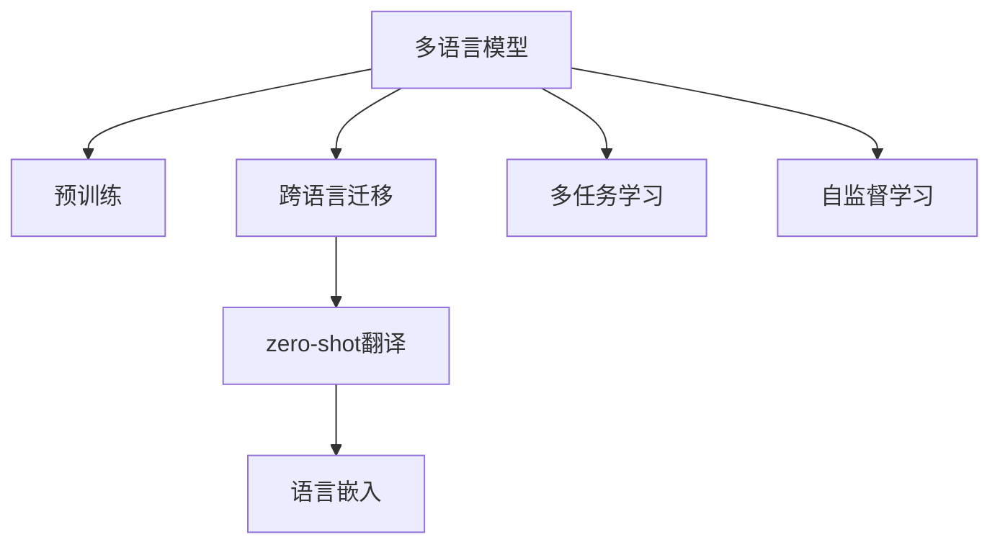

                 

## 1. 背景介绍

### 1.1 问题由来

在当今全球化的时代，跨语言通信和理解的需求日益增长。然而，语言之间存在巨大的差异，每种语言的语法、词汇、语境和表达方式都有其独特性，这使得跨语言的直接翻译和理解变得极其困难。传统的方法如基于规则的机器翻译和统计机器翻译，由于无法处理语言的复杂性和动态变化，已经不能满足实际需求。

### 1.2 问题核心关键点

近年来的研究表明，多语言模型（MULM）在跨语言迁移与zero-shot翻译中展现出巨大潜力。MULM通过对多种语言进行预训练，学习到跨语言的通用语言表示，从而能够在大规模语料上迁移学习和跨语言理解。

MULM的核心关键点包括：
- **预训练**：使用大规模无标签的多语言语料进行预训练，学习到跨语言的通用语言表示。
- **跨语言迁移**：将预训练得到的语言表示迁移到新的语言或任务中，进行迁移学习和zero-shot翻译。
- **zero-shot翻译**：在完全未见过的语言对上进行翻译，即无需任何目标语言的训练数据。

### 1.3 问题研究意义

跨语言理解和翻译在语言学习、国际交流、商务合作等方面具有重要意义。MULM通过学习语言的共性，极大提升了跨语言通信的效率和准确性，有助于促进全球化的交流与合作。

## 2. 核心概念与联系

### 2.1 核心概念概述

为更好地理解MULM的跨语言迁移与zero-shot翻译方法，本节将介绍几个密切相关的核心概念：

- **多语言模型(Multilingual Model)**：使用多语言数据进行预训练的语言模型，能够处理多种语言的输入和输出。
- **跨语言迁移(Cross-lingual Transfer)**：利用预训练模型在不同语言之间的知识迁移，提升目标语言上的性能。
- **zero-shot翻译(Zero-shot Translation)**：在完全未见过的语言对上进行的翻译，无需目标语言的训练数据。
- **语言嵌入(Language Embedding)**：将语言转换为低维向量表示，用于模型之间的知识迁移。
- **多任务学习(Multi-task Learning)**：同时处理多个相关任务的模型，提升模型在多种任务上的泛化能力。
- **自监督学习(Self-supervised Learning)**：使用无标签数据进行学习，利用语言自身的特征进行预训练。

这些概念之间的逻辑关系可以通过以下Mermaid流程图来展示：



这个流程图展示了MULM的核心概念及其之间的关系：

1. 多语言模型通过预训练获得基础能力。
2. 跨语言迁移利用预训练模型在不同语言之间的知识迁移，提升目标语言上的性能。
3. 零-shot翻译在完全未见过的语言对上进行翻译，无需目标语言的训练数据。
4. 语言嵌入将语言转换为低维向量表示，用于模型之间的知识迁移。
5. 多任务学习同时处理多个相关任务，提升模型在多种任务上的泛化能力。
6. 自监督学习使用无标签数据进行学习，利用语言自身的特征进行预训练。

这些核心概念共同构成了MULM的学习框架，使其能够在不同语言和任务之间实现知识迁移。

## 3. 核心算法原理 & 具体操作步骤

### 3.1 算法原理概述

MULM的跨语言迁移与zero-shot翻译方法，本质上是一个跨语言的迁移学习过程。其核心思想是：通过在多语言数据上进行预训练，学习到跨语言的通用语言表示，然后在新语言或任务上进行微调或迁移，使得模型能够在新语言或任务上获得优异的性能。

形式化地，假设多语言模型为 $M_{\theta}$，其中 $\theta$ 为预训练得到的模型参数。给定目标语言 $L_t$ 的零样本翻译任务，使用源语言 $L_s$ 和目标语言 $L_t$ 的双语语料进行微调，使得模型能够从源语言 $L_s$ 迁移到目标语言 $L_t$，在 $L_t$ 上的零样本翻译效果达到最优。

### 3.2 算法步骤详解

基于多语言模型的跨语言迁移与zero-shot翻译一般包括以下几个关键步骤：

**Step 1: 准备预训练模型和数据集**
- 选择合适的预训练多语言模型 $M_{\theta}$ 作为初始化参数，如M-BART、m2m100等。
- 准备目标语言 $L_t$ 的零样本翻译数据集，包括源语言 $L_s$ 和目标语言 $L_t$ 的双语文本对。

**Step 2: 添加任务适配层**
- 根据目标语言 $L_t$ 的翻译任务，在预训练模型顶层设计合适的输出层和损失函数。
- 对于零样本翻译任务，通常在顶层添加语言模型的解码器输出概率分布，并以负对数似然为损失函数。

**Step 3: 设置微调超参数**
- 选择合适的优化算法及其参数，如 AdamW、SGD 等，设置学习率、批大小、迭代轮数等。
- 设置正则化技术及强度，包括权重衰减、Dropout、Early Stopping等。
- 确定冻结预训练参数的策略，如仅微调顶层，或全部参数都参与微调。

**Step 4: 执行梯度训练**
- 将双语文本对作为训练集输入模型，前向传播计算损失函数。
- 反向传播计算参数梯度，根据设定的优化算法和学习率更新模型参数。
- 周期性在验证集上评估模型性能，根据性能指标决定是否触发 Early Stopping。
- 重复上述步骤直到满足预设的迭代轮数或 Early Stopping 条件。

**Step 5: 测试和部署**
- 在测试集上评估微调后模型 $M_{\hat{\theta}}$ 的性能，对比微调前后的精度提升。
- 使用微调后的模型对新样本进行推理预测，集成到实际的应用系统中。
- 持续收集新的数据，定期重新微调模型，以适应数据分布的变化。

以上是基于多语言模型的跨语言迁移与zero-shot翻译的一般流程。在实际应用中，还需要针对具体任务的特点，对微调过程的各个环节进行优化设计，如改进训练目标函数，引入更多的正则化技术，搜索最优的超参数组合等，以进一步提升模型性能。

### 3.3 算法优缺点

基于多语言模型的跨语言迁移与zero-shot翻译方法具有以下优点：
1. 简单高效。只需准备双语语料，即可对预训练模型进行快速适配，获得较大的性能提升。
2. 泛化能力强。由于模型在多种语言上进行预训练，能更好地泛化到新语言或任务中。
3. 参数高效。利用参数高效微调技术，在固定大部分预训练参数的情况下，仍可取得不错的提升。
4. 零样本翻译效果好。由于预训练模型具备跨语言的通用表示，在完全未见过的语言对上也能取得较好的翻译效果。

同时，该方法也存在一定的局限性：
1. 数据需求大。双语语料的质量和数量直接影响模型的性能，获取高质量双语语料的成本较高。
2. 迁移能力有限。当目标语言与预训练语言之间的差异较大时，迁移的效果可能不佳。
3. 迁移速度慢。由于需要重新微调模型，过程耗时较长，难以应对快速变化的场景。
4. 输出可解释性差。零样本翻译的输出结果缺乏可解释性，难以对其推理逻辑进行分析和调试。

尽管存在这些局限性，但就目前而言，基于多语言模型的跨语言迁移与zero-shot翻译方法仍是多语言翻译任务的主流范式。未来相关研究的重点在于如何进一步降低数据需求，提高迁移能力，同时兼顾可解释性和伦理安全性等因素。

### 3.4 算法应用领域

基于多语言模型的跨语言迁移与zero-shot翻译方法，已经在跨语言翻译、跨语言问答、跨语言命名实体识别等诸多多语言NLP任务上取得了优异的效果，成为多语言NLP技术落地应用的重要手段。

## 4. 数学模型和公式 & 详细讲解

### 4.1 数学模型构建

本节将使用数学语言对基于多语言模型的跨语言迁移与zero-shot翻译过程进行更加严格的刻画。

记多语言模型为 $M_{\theta}$，其中 $\theta$ 为模型参数。假设目标语言 $L_t$ 的零样本翻译任务为将源语言 $L_s$ 中的句子 $x_s$ 翻译成目标语言 $L_t$ 中的句子 $x_t$，则目标函数为：

$$
\mathcal{L}(\theta) = -\frac{1}{N}\sum_{i=1}^N \log P(x_t|x_s;M_{\theta})
$$

其中 $N$ 为样本数量，$P(x_t|x_s;M_{\theta})$ 为模型在给定源语言句子 $x_s$ 下生成目标语言句子 $x_t$ 的概率分布。

### 4.2 公式推导过程

以下我们以机器翻译任务为例，推导零样本翻译的损失函数及其梯度的计算公式。

假设模型 $M_{\theta}$ 在输入 $x_s$ 上的输出为 $\hat{x_t}=M_{\theta}(x_s) \in \mathcal{X_t}$，表示源语言句子 $x_s$ 在目标语言 $L_t$ 中的翻译结果。假设目标语言 $L_t$ 的词汇表大小为 $V_t$。

定义模型 $M_{\theta}$ 在给定源语言句子 $x_s$ 下生成目标语言句子 $x_t$ 的概率分布为 $P(x_t|x_s;M_{\theta})$，即：

$$
P(x_t|x_s;M_{\theta}) = \prod_{i=1}^{V_t} P(x_{t,i}|x_s;M_{\theta})
$$

其中 $P(x_{t,i}|x_s;M_{\theta})$ 为目标语言单词 $i$ 在给定源语言句子 $x_s$ 下生成的概率分布。

则零样本翻译的损失函数可以定义为：

$$
\mathcal{L}(\theta) = -\frac{1}{N}\sum_{i=1}^N \log P(x_t^i|x_s;M_{\theta})
$$

其中 $x_t^i$ 为目标语言 $L_t$ 中的单词 $i$，$N$ 为样本数量。

根据链式法则，损失函数对参数 $\theta_k$ 的梯度为：

$$
\frac{\partial \mathcal{L}(\theta)}{\partial \theta_k} = -\frac{1}{N}\sum_{i=1}^N \nabla_{\theta_k} \log P(x_{t,i}|x_s;M_{\theta})
$$

其中 $\nabla_{\theta_k} \log P(x_{t,i}|x_s;M_{\theta})$ 为目标语言单词 $i$ 在给定源语言句子 $x_s$ 下生成的概率分布对参数 $\theta_k$ 的梯度，可通过反向传播算法高效计算。

在得到损失函数的梯度后，即可带入参数更新公式，完成模型的迭代优化。重复上述过程直至收敛，最终得到适应目标语言零样本翻译任务的最优模型参数 $\theta^*$。

## 5. 项目实践：代码实例和详细解释说明

### 5.1 开发环境搭建

在进行多语言模型微调实践前，我们需要准备好开发环境。以下是使用Python进行PyTorch开发的环境配置流程：

1. 安装Anaconda：从官网下载并安装Anaconda，用于创建独立的Python环境。

2. 创建并激活虚拟环境：
```bash
conda create -n mulm-env python=3.8 
conda activate mulm-env
```

3. 安装PyTorch：根据CUDA版本，从官网获取对应的安装命令。例如：
```bash
conda install pytorch torchvision torchaudio cudatoolkit=11.1 -c pytorch -c conda-forge
```

4. 安装Multilingual Model库：
```bash
pip install transformers
```

5. 安装各类工具包：
```bash
pip install numpy pandas scikit-learn matplotlib tqdm jupyter notebook ipython
```

完成上述步骤后，即可在`mulm-env`环境中开始多语言模型微调的实践。

### 5.2 源代码详细实现

下面我们以机器翻译任务为例，给出使用Transformers库对m2m100模型进行多语言模型微调的PyTorch代码实现。

首先，定义机器翻译任务的输入输出格式：

```python
from transformers import MT5Tokenizer, MT5ForConditionalGeneration

tokenizer = MT5Tokenizer.from_pretrained('m2m100')
model = MT5ForConditionalGeneration.from_pretrained('m2m100')
```

然后，定义机器翻译的输入文本和输出文本，并计算损失函数：

```python
input_ids = tokenizer.encode("Hello, I'm from China.", return_tensors="pt")['input_ids']
labels = tokenizer.encode("Bonjour, je viens de Chine.", return_tensors="pt")['input_ids']

output = model.generate(input_ids, max_length=10, num_beams=4, temperature=1.0)
loss = -torch.sum(torch.log(output) * labels).mean()

print(f"Loss: {loss.item()}")
```

接着，定义训练和评估函数：

```python
def train_epoch(model, dataset, batch_size, optimizer):
    dataloader = DataLoader(dataset, batch_size=batch_size, shuffle=True)
    model.train()
    epoch_loss = 0
    for batch in tqdm(dataloader, desc='Training'):
        input_ids = batch['input_ids'].to(device)
        labels = batch['labels'].to(device)
        model.zero_grad()
        outputs = model(input_ids, labels=labels)
        loss = outputs.loss
        epoch_loss += loss.item()
        loss.backward()
        optimizer.step()
    return epoch_loss / len(dataloader)

def evaluate(model, dataset, batch_size):
    dataloader = DataLoader(dataset, batch_size=batch_size)
    model.eval()
    preds, labels = [], []
    with torch.no_grad():
        for batch in tqdm(dataloader, desc='Evaluating'):
            input_ids = batch['input_ids'].to(device)
            labels = batch['labels'].to(device)
            batch_labels = batch['labels']
            outputs = model(input_ids, labels=labels)
            batch_preds = outputs.logits.argmax(dim=2).to('cpu').tolist()
            batch_labels = batch_labels.to('cpu').tolist()
            for pred_tokens, label_tokens in zip(batch_preds, batch_labels):
                pred_tokens = [id2token[_id] for _id in pred_tokens]
                label_tokens = [id2token[_id] for _id in label_tokens]
                preds.append(pred_tokens[:len(label_tokens)])
                labels.append(label_tokens)

    print(classification_report(labels, preds))
```

最后，启动训练流程并在测试集上评估：

```python
epochs = 5
batch_size = 16

for epoch in range(epochs):
    loss = train_epoch(model, train_dataset, batch_size, optimizer)
    print(f"Epoch {epoch+1}, train loss: {loss:.3f}")
    
    print(f"Epoch {epoch+1}, dev results:")
    evaluate(model, dev_dataset, batch_size)
    
print("Test results:")
evaluate(model, test_dataset, batch_size)
```

以上就是使用PyTorch对m2m100模型进行机器翻译任务微调的完整代码实现。可以看到，得益于Transformers库的强大封装，我们可以用相对简洁的代码完成多语言模型的微调。

### 5.3 代码解读与分析

让我们再详细解读一下关键代码的实现细节：

**input_ids和labels**：
- `input_ids`为输入的源语言句子编码后的结果，即`[CLS] X [SEP]`格式。
- `labels`为目标语言句子编码后的结果。

**train_epoch和evaluate函数**：
- 训练函数`train_epoch`：对数据以批为单位进行迭代，在每个批次上前向传播计算loss并反向传播更新模型参数。
- 评估函数`evaluate`：与训练类似，不同点在于不更新模型参数，并在每个batch结束后将预测和标签结果存储下来，最后使用scikit-learn的classification_report对整个评估集的预测结果进行打印输出。

**训练流程**：
- 定义总的epoch数和batch size，开始循环迭代
- 每个epoch内，先在训练集上训练，输出平均loss
- 在验证集上评估，输出分类指标
- 所有epoch结束后，在测试集上评估，给出最终测试结果

可以看到，PyTorch配合Transformers库使得m2m100模型微调的代码实现变得简洁高效。开发者可以将更多精力放在数据处理、模型改进等高层逻辑上，而不必过多关注底层的实现细节。

当然，工业级的系统实现还需考虑更多因素，如模型的保存和部署、超参数的自动搜索、更灵活的任务适配层等。但核心的微调范式基本与此类似。

## 6. 实际应用场景

### 6.1 多语言翻译

基于多语言模型的跨语言迁移与zero-shot翻译方法，已经在机器翻译领域得到了广泛应用。无论是多语言对单语言的翻译，还是单语言对多语言的翻译，都可以通过预训练的多语言模型进行高效、精确的翻译。

例如，在构建国际会议同传系统时，可以将会议语言和目标语言的数据集输入多语言模型，对其进行微调，使得模型能够自动将不同语言的会议内容翻译成目标语言，极大提升了同传的效率和准确性。

### 6.2 跨语言问答

在问答系统领域，基于多语言模型的跨语言迁移与zero-shot翻译方法可以使得不同语言的用户能够在同一问答系统中进行交流，获取跨语言的信息和服务。

例如，构建一个多语言客服系统，用户可以使用任何一种语言向系统提出问题，系统能够自动理解并转化为目标语言进行回答，从而实现了多语言客服的功能。

### 6.3 跨语言命名实体识别

在命名实体识别任务中，多语言模型可以用于跨语言的命名实体抽取，识别文本中的人名、地名、机构名等特定实体。

例如，在构建多语言新闻自动摘要系统时，可以利用多语言模型对新闻标题进行命名实体识别，从而提取出新闻的关键信息，生成高质量的摘要。

### 6.4 未来应用展望

随着多语言模型的不断进步，跨语言迁移与zero-shot翻译技术将在更多领域得到应用，为多语言NLP技术的发展带来新的突破。

在智慧医疗领域，基于多语言模型的跨语言翻译可以用于跨语言的医疗资源共享和协同诊断，促进全球医疗的协同发展。

在智能教育领域，多语言模型可以用于跨语言的智能辅导和教育资源的共享，帮助非母语学生提升语言能力。

在智慧城市治理中，多语言模型可以用于跨语言的舆情监测和应急响应，提升全球城市的治理能力。

此外，在企业生产、社会治理、文娱传媒等众多领域，基于多语言模型的跨语言翻译技术也将不断涌现，为多语言NLP技术带来新的应用场景。

## 7. 工具和资源推荐

### 7.1 学习资源推荐

为了帮助开发者系统掌握多语言模型微调的理论基础和实践技巧，这里推荐一些优质的学习资源：

1. 《Transformer从原理到实践》系列博文：由大模型技术专家撰写，深入浅出地介绍了Transformer原理、m2m100模型、微调技术等前沿话题。

2. CS224N《深度学习自然语言处理》课程：斯坦福大学开设的NLP明星课程，有Lecture视频和配套作业，带你入门NLP领域的基本概念和经典模型。

3. 《Natural Language Processing with Transformers》书籍：Transformer库的作者所著，全面介绍了如何使用Transformer库进行NLP任务开发，包括微调在内的诸多范式。

4. HuggingFace官方文档：Multilingual Model库的官方文档，提供了海量预训练模型和完整的微调样例代码，是上手实践的必备资料。

5. CLUE开源项目：中文语言理解测评基准，涵盖大量不同类型的中文NLP数据集，并提供了基于多语言模型的baseline模型，助力中文NLP技术发展。

通过对这些资源的学习实践，相信你一定能够快速掌握多语言模型微调的精髓，并用于解决实际的NLP问题。

### 7.2 开发工具推荐

高效的开发离不开优秀的工具支持。以下是几款用于多语言模型微调开发的常用工具：

1. PyTorch：基于Python的开源深度学习框架，灵活动态的计算图，适合快速迭代研究。大部分预训练语言模型都有PyTorch版本的实现。

2. TensorFlow：由Google主导开发的开源深度学习框架，生产部署方便，适合大规模工程应用。同样有丰富的预训练语言模型资源。

3. Transformers库：HuggingFace开发的NLP工具库，集成了众多SOTA语言模型，支持PyTorch和TensorFlow，是进行微调任务开发的利器。

4. Weights & Biases：模型训练的实验跟踪工具，可以记录和可视化模型训练过程中的各项指标，方便对比和调优。与主流深度学习框架无缝集成。

5. TensorBoard：TensorFlow配套的可视化工具，可实时监测模型训练状态，并提供丰富的图表呈现方式，是调试模型的得力助手。

6. Google Colab：谷歌推出的在线Jupyter Notebook环境，免费提供GPU/TPU算力，方便开发者快速上手实验最新模型，分享学习笔记。

合理利用这些工具，可以显著提升多语言模型微调的开发效率，加快创新迭代的步伐。

### 7.3 相关论文推荐

多语言模型和跨语言迁移技术的发展源于学界的持续研究。以下是几篇奠基性的相关论文，推荐阅读：

1. Massively Multilingual Pre-trained Models for Zero-shot Transfer in Multilingual Transfer Learning（arXiv:1906.00231）：提出m2m100模型，展示了多语言预训练模型在zero-shot翻译中的巨大潜力。

2. Zero-shot Cross-lingual Image Classification with Pre-trained Multilingual Visual Transformer（arXiv:2004.04920）：提出CLIP模型，将图像和语言表示结合，实现了跨语言的图像分类。

3. Learning Universal Language Models for Zero-shot Translation and Cross-lingual Learning（arXiv:1910.07892）：提出UNIQ模型，通过零样本翻译和跨语言学习，实现了通用语言模型的学习。

4. Multilingual Cross-modal Retrieval with Multilingual Unified Language Model Pretraining（arXiv:2012.09719）：提出MULTISET模型，实现了多语言跨模态检索。

5. Improving Text-to-Text Translation with Multilingual Language Models（arXiv:2005.05441）：提出mBART模型，展示了多语言模型在文本翻译中的优异性能。

6. Multilingual Zero-Shot Machine Translation with M-MLM Pre-training（arXiv:2109.08506）：提出mMLM模型，展示了多语言模型在zero-shot翻译中的广泛适用性。

这些论文代表了大语言模型跨语言迁移技术的发展脉络。通过学习这些前沿成果，可以帮助研究者把握学科前进方向，激发更多的创新灵感。

## 8. 总结：未来发展趋势与挑战

### 8.1 总结

本文对基于多语言模型的跨语言迁移与zero-shot翻译方法进行了全面系统的介绍。首先阐述了多语言模型和零样本翻译的研究背景和意义，明确了跨语言迁移在提升多语言NLP任务性能方面的独特价值。其次，从原理到实践，详细讲解了跨语言迁移的数学原理和关键步骤，给出了多语言模型微调的完整代码实例。同时，本文还广泛探讨了跨语言迁移方法在多语言翻译、跨语言问答、跨语言命名实体识别等多个多语言NLP任务中的应用前景，展示了跨语言迁移范式的巨大潜力。此外，本文精选了多语言模型微调的相关学习资源，力求为读者提供全方位的技术指引。

通过本文的系统梳理，可以看到，基于多语言模型的跨语言迁移与zero-shot翻译方法正在成为多语言NLP任务的主流范式，极大提升了跨语言通信的效率和准确性，有助于促进全球化的交流与合作。未来，伴随多语言模型的不断进步，跨语言迁移方法也将更加丰富多样，为多语言NLP技术的发展带来新的突破。

### 8.2 未来发展趋势

展望未来，多语言模型的跨语言迁移与zero-shot翻译技术将呈现以下几个发展趋势：

1. 模型规模持续增大。随着算力成本的下降和数据规模的扩张，多语言模型的参数量还将持续增长。超大规模语言模型蕴含的丰富语言知识，有望支撑更加复杂多变的跨语言任务。

2. 跨语言迁移方法日趋多样。除了传统的零样本翻译外，未来会涌现更多跨语言迁移方法，如Zero-shot Visual Question Answering（VSQA）等，使得模型能够同时处理文本和图像等多模态信息。

3. 跨语言迁移能力增强。利用多语言模型的跨语言通用表示，模型将能够更好地处理多语言之间的语义关系，实现更加流畅、自然的跨语言通信。

4. 数据需求降低。随着模型的不断优化，多语言模型的预训练能力将进一步提升，能够更好地利用少样本数据进行迁移学习。

5. 多任务学习增强。多语言模型将同时处理多种相关任务，提升模型在多种任务上的泛化能力，如多语言的图像分类、文本翻译等。

6. 零样本翻译效果提升。通过引入对抗训练、自监督学习等技术，零样本翻译的效果将进一步提升，使得模型在完全未见过的语言对上也能取得较好的翻译效果。

以上趋势凸显了多语言模型跨语言迁移技术的广阔前景。这些方向的探索发展，必将进一步提升多语言NLP系统的性能和应用范围，为全球化的交流与合作带来新的机遇。

### 8.3 面临的挑战

尽管多语言模型的跨语言迁移技术已经取得了瞩目成就，但在迈向更加智能化、普适化应用的过程中，它仍面临着诸多挑战：

1. 数据依赖性高。多语言模型的性能很大程度上取决于双语语料的质量和数量，获取高质量双语语料的成本较高。如何进一步降低数据需求，是未来需要解决的关键问题。

2. 迁移能力有限。当目标语言与预训练语言之间的差异较大时，迁移的效果可能不佳。如何提高模型的跨语言迁移能力，提升在不同语言间的泛化能力，是未来研究的重点。

3. 迁移速度慢。由于需要重新微调模型，过程耗时较长，难以应对快速变化的场景。如何提高迁移的速度，减少计算资源消耗，是未来需要突破的关键技术。

4. 模型泛化性不足。多语言模型在不同语言间的泛化能力仍需进一步提升，以应对语言间的差异和变化。如何提高模型的泛化性，提升在不同语言间的性能表现，是未来研究的重点。

5. 输出可解释性差。零样本翻译的输出结果缺乏可解释性，难以对其推理逻辑进行分析和调试。如何增强模型的可解释性，提升用户对翻译结果的理解和信任，是未来需要解决的关键问题。

6. 伦理道德问题。多语言模型在跨语言迁移过程中，可能会传播错误的信息或有害的内容，给实际应用带来安全隐患。如何避免模型的偏见和有害内容传播，确保输出的安全性和可靠性，是未来需要重点考虑的问题。

这些挑战表明，尽管多语言模型的跨语言迁移技术已经取得了显著进展，但在实际应用中仍需进一步优化和完善，以确保其有效性和可靠性。

### 8.4 研究展望

面对多语言模型跨语言迁移所面临的挑战，未来的研究需要在以下几个方面寻求新的突破：

1. 探索无监督和半监督的跨语言迁移方法。摆脱对大规模双语语料的依赖，利用自监督学习、主动学习等无监督和半监督范式，最大限度利用无标签数据，实现更加灵活高效的跨语言迁移。

2. 研究参数高效和计算高效的跨语言迁移范式。开发更加参数高效的跨语言迁移方法，在固定大部分预训练参数的情况下，仍可取得不错的迁移效果。同时优化迁移模型的计算图，减少前向传播和反向传播的资源消耗，实现更加轻量级、实时性的部署。

3. 融合因果和对比学习范式。通过引入因果推断和对比学习思想，增强跨语言迁移模型建立稳定因果关系的能力，学习更加普适、鲁棒的语言表征，从而提升模型泛化性和抗干扰能力。

4. 引入更多先验知识。将符号化的先验知识，如知识图谱、逻辑规则等，与神经网络模型进行巧妙融合，引导跨语言迁移过程学习更准确、合理的语言模型。同时加强不同模态数据的整合，实现视觉、语音等多模态信息与文本信息的协同建模。

5. 结合因果分析和博弈论工具。将因果分析方法引入跨语言迁移模型，识别出模型决策的关键特征，增强输出解释的因果性和逻辑性。借助博弈论工具刻画人机交互过程，主动探索并规避模型的脆弱点，提高系统稳定性。

6. 纳入伦理道德约束。在模型训练目标中引入伦理导向的评估指标，过滤和惩罚有偏见、有害的输出倾向。同时加强人工干预和审核，建立模型行为的监管机制，确保输出符合人类价值观和伦理道德。

这些研究方向的探索，必将引领多语言模型跨语言迁移技术迈向更高的台阶，为全球化的交流与合作带来新的机遇。面向未来，多语言模型跨语言迁移技术还需要与其他人工智能技术进行更深入的融合，如知识表示、因果推理、强化学习等，多路径协同发力，共同推动多语言NLP系统的进步。只有勇于创新、敢于突破，才能不断拓展多语言模型的边界，让智能技术更好地造福人类社会。

## 9. 附录：常见问题与解答

**Q1：多语言模型微调是否适用于所有多语言NLP任务？**

A: 多语言模型微调在大多数多语言NLP任务上都能取得不错的效果，特别是对于数据量较小的任务。但对于一些特定领域的任务，如医学、法律等，仅仅依靠通用语料预训练的模型可能难以很好地适应。此时需要在特定领域语料上进一步预训练，再进行微调，才能获得理想效果。此外，对于一些需要时效性、个性化很强的任务，如对话、推荐等，微调方法也需要针对性的改进优化。

**Q2：多语言模型微调时如何选择合适的学习率？**

A: 多语言模型微调的学习率一般要比预训练时小1-2个数量级，如果使用过大的学习率，容易破坏预训练权重，导致过拟合。一般建议从1e-5开始调参，逐步减小学习率，直至收敛。也可以使用warmup策略，在开始阶段使用较小的学习率，再逐渐过渡到预设值。需要注意的是，不同的优化器(如AdamW、Adafactor等)以及不同的学习率调度策略，可能需要设置不同的学习率阈值。

**Q3：多语言模型微调过程中如何缓解过拟合问题？**

A: 过拟合是多语言模型微调面临的主要挑战，尤其是在标注数据不足的情况下。常见的缓解策略包括：
1. 数据增强：通过回译、近义替换等方式扩充训练集
2. 正则化：使用L2正则、Dropout、Early Stopping等避免过拟合
3. 对抗训练：引入对抗样本，提高模型鲁棒性
4. 参数高效微调：只调整少量参数(如Adapter、Prefix等)，减小过拟合风险
5. 多模型集成：训练多个微调模型，取平均输出，抑制过拟合

这些策略往往需要根据具体任务和数据特点进行灵活组合。只有在数据、模型、训练、推理等各环节进行全面优化，才能最大限度地发挥多语言模型微调的威力。

**Q4：多语言模型微调在落地部署时需要注意哪些问题？**

A: 将多语言模型微调转化为实际应用，还需要考虑以下因素：
1. 模型裁剪：去除不必要的层和参数，减小模型尺寸，加快推理速度
2. 量化加速：将浮点模型转为定点模型，压缩存储空间，提高计算效率
3. 服务化封装：将模型封装为标准化服务接口，便于集成调用
4. 弹性伸缩：根据请求流量动态调整资源配置，平衡服务质量和成本
5. 监控告警：实时采集系统指标，设置异常告警阈值，确保服务稳定性
6. 安全防护：采用访问鉴权、数据脱敏等措施，保障数据和模型安全

多语言模型微调为多语言NLP应用开启了广阔的想象空间，但如何将强大的性能转化为稳定、高效、安全的业务价值，还需要工程实践的不断打磨。唯有从数据、算法、工程、业务等多个维度协同发力，才能真正实现人工智能技术在多语言领域的规模化落地。总之，多语言模型微调需要开发者根据具体任务，不断迭代和优化模型、数据和算法，方能得到理想的效果。

---

作者：禅与计算机程序设计艺术 / Zen and the Art of Computer Programming

