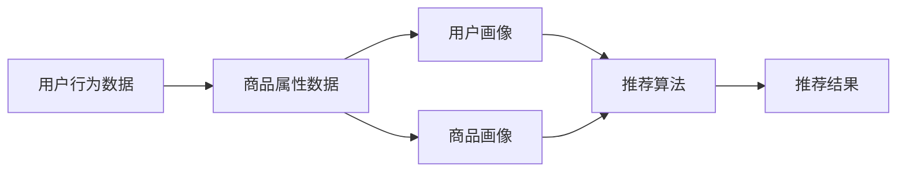

                 

# 大数据与AI 驱动的电商搜索推荐：以准确率与效率为核心的优化

## 1. 背景介绍

随着电商行业的快速发展，个性化推荐系统已成为各大电商平台提升用户体验、增加销售转化率的重要手段。传统的基于规则或朴素贝叶斯的推荐算法已难以满足复杂多变的电商搜索推荐场景。而利用大数据与人工智能技术驱动的推荐系统，通过深度学习模型对用户行为和商品信息进行深度学习，能更加精准地预测用户需求，提升推荐的准确率和效率。

本文将详细介绍大数据与AI技术在电商搜索推荐中的应用，特别是个性化推荐模型的构建、优化与实践。我们将从核心算法原理出发，深入探讨模型优化中的关键点，并结合实际案例进行详细分析。

## 2. 核心概念与联系

### 2.1 核心概念概述

电商搜索推荐系统主要由数据收集、用户画像建立、商品画像建立、推荐算法执行、结果展示等环节组成。其中，个性化推荐算法是核心模块，负责根据用户历史行为和商品信息，动态生成个性化推荐结果。

为提升推荐系统的准确率和效率，当前主要采用基于协同过滤、基于内容推荐、深度学习模型等多种推荐算法，以结合不同算法优势，实现最优的推荐效果。

- **协同过滤**：通过分析用户行为数据和商品数据，构建用户和商品间的相似性矩阵，进而实现基于用户和基于商品的推荐。
- **基于内容推荐**：根据商品属性特征，对相似商品进行推荐。
- **深度学习模型**：如神经网络、深度强化学习等，利用大数据和深度学习模型对用户行为和商品信息进行学习，自动挖掘高层次的关联关系，实现更加个性化的推荐。

以下是一个简单的电商推荐系统的数据流向示意图：



### 2.2 核心概念原理和架构

#### 2.2.1 协同过滤

协同过滤算法主要包括基于用户的协同过滤和基于商品的协同过滤。以基于用户的协同过滤为例，其基本流程如下：

1. 构建用户-商品矩阵 $\mathbf{U} \in \mathbb{R}^{N \times M}$，其中 $N$ 表示用户数，$M$ 表示商品数。
2. 对每个用户 $u$，统计其对所有商品的评分 $\mathbf{r_u} \in \mathbb{R}^{M}$。
3. 通过奇异值分解(SVD)等技术，将用户-商品矩阵分解为 $\mathbf{U} = \mathbf{P} \mathbf{\Sigma} \mathbf{Q}^T$，其中 $\mathbf{P} \in \mathbb{R}^{N \times K}$ 为用户矩阵，$\mathbf{\Sigma} \in \mathbb{R}^{K \times K}$ 为奇异值矩阵，$\mathbf{Q} \in \mathbb{R}^{M \times K}$ 为商品矩阵。
4. 将用户 $u$ 表示为 $\mathbf{P_u} = \mathbf{P}_u^T \mathbf{P} \in \mathbb{R}^{K \times N}$，其中 $\mathbf{P}_u^T$ 为 $\mathbf{P}$ 的某一行向量。
5. 对于商品 $v$，查询商品矩阵 $\mathbf{Q}_v^T$，计算 $\mathbf{P}_u^T \mathbf{Q}_v^T \mathbf{\Sigma} \mathbf{Q} \mathbf{Q}_v^T \mathbf{\Sigma} = \mathbf{P}_u^T \mathbf{Q}_v$。
6. 选择 $\mathbf{P}_u^T \mathbf{Q}_v$ 中最大的 $K$ 个元素，生成推荐结果。

协同过滤算法的优点在于对数据要求低，无需额外的标注数据。缺点是容易受到冷启动问题和数据稀疏性的影响，且不能利用商品本身的特征信息。

#### 2.2.2 基于内容推荐

基于内容推荐的算法主要通过分析商品属性特征，将商品进行聚类，然后根据用户历史购买行为和评分，从相似聚类中选取商品进行推荐。

以物品聚类为例，其基本流程如下：

1. 提取商品特征向量 $\mathbf{f_i} \in \mathbb{R}^d$，其中 $d$ 为特征维度。
2. 通过聚类算法，将商品特征向量 $\mathbf{f_i}$ 进行聚类，得到聚类中心 $\mathbf{c_k} \in \mathbb{R}^d$，其中 $k$ 为聚类数量。
3. 计算用户 $u$ 对商品 $i$ 的评分向量 $\mathbf{r_u}$ 与聚类中心 $\mathbf{c_k}$ 的相似度 $\alpha_{ik}$。
4. 根据相似度 $\alpha_{ik}$，选择评分较高的聚类进行推荐。

基于内容推荐算法的优点在于利用商品特征信息，推荐结果较为准确。缺点是聚类算法对参数敏感，且需要较多的特征工程工作。

#### 2.2.3 深度学习模型

深度学习模型主要通过神经网络对用户行为和商品信息进行学习，实现高层次的关联关系挖掘。以深度学习推荐模型为例，其基本流程如下：

1. 提取用户行为特征向量 $\mathbf{x_u} \in \mathbb{R}^d$ 和商品特征向量 $\mathbf{y_i} \in \mathbb{R}^d$。
2. 通过多层神经网络 $f$，对用户行为和商品特征进行映射，得到用户对商品的评分 $\hat{r}_{ui}$。
3. 通过交叉熵损失等方法，优化模型参数 $\theta$，使得 $\hat{r}_{ui}$ 逼近真实评分 $r_{ui}$。

深度学习模型的优点在于能自动学习高层次关联关系，适应性强。缺点是训练时间长，对数据质量要求高，且模型复杂度高，资源消耗大。

## 3. 核心算法原理 & 具体操作步骤

### 3.1 算法原理概述

电商搜索推荐系统的主要目标是最大化推荐系统的准确率和效率。准确率主要指推荐的正确性，即推荐结果与用户实际需求的一致性；效率主要指推荐系统的响应速度和资源消耗，即推荐系统处理请求的实时性和性能指标。

本文将主要介绍基于深度学习模型的推荐系统优化方法，包括模型构建、优化策略和评估指标。

### 3.2 算法步骤详解

#### 3.2.1 模型构建

深度学习推荐模型主要包括用户行为表示模块、商品特征表示模块和推荐模块。以序列化神经网络(SIMN)为例，其基本流程如下：

1. 提取用户行为序列 $\mathbf{X_u} \in \mathbb{R}^{N_u \times d}$ 和商品特征序列 $\mathbf{Y_i} \in \mathbb{R}^{N_i \times d}$，其中 $N_u$ 为历史行为序列长度，$N_i$ 为商品特征序列长度。
2. 通过用户行为序列 $\mathbf{X_u}$ 和商品特征序列 $\mathbf{Y_i}$，构造用户行为表示 $\mathbf{H_u} \in \mathbb{R}^h$ 和商品特征表示 $\mathbf{H_i} \in \mathbb{R}^h$，其中 $h$ 为隐藏层维度。
3. 将用户行为表示 $\mathbf{H_u}$ 和商品特征表示 $\mathbf{H_i}$ 输入推荐模块，输出用户对商品的评分预测 $\hat{r}_{ui}$。

#### 3.2.2 优化策略

深度学习推荐模型的优化策略主要包括以下几个方面：

1. 超参数优化：通过网格搜索、随机搜索等方法，确定模型的超参数，如隐藏层维度、学习率、批大小等。
2. 正则化：通过L2正则、Dropout等方法，防止模型过拟合。
3. 特征工程：通过特征选择、特征降维等技术，提高模型泛化能力。
4. 模型融合：通过集成多个深度学习模型，提高推荐系统准确率和鲁棒性。
5. 并行计算：通过分布式计算、GPU加速等技术，提高模型训练和推理效率。

#### 3.2.3 算法优缺点

深度学习推荐模型的优点在于模型能力强大，能自动挖掘高层次关联关系，适应性强。缺点是模型复杂度高，训练时间长，对数据质量要求高。

### 3.4 算法应用领域

深度学习推荐模型广泛应用于电商、新闻、音乐等推荐场景中，能提供个性化的推荐结果。其应用主要包括以下几个方面：

1. 个性化推荐：根据用户历史行为和商品信息，动态生成个性化推荐结果。
2. 冷启动问题：通过利用用户行为特征、商品特征等信息，解决冷启动问题。
3. 用户画像建立：通过分析用户行为数据，建立用户画像，更好地理解用户需求。
4. 商品画像建立：通过分析商品信息，建立商品画像，更好地理解商品特征。
5. 结果展示优化：通过推荐算法优化和结果展示优化，提高用户体验。

## 4. 数学模型和公式 & 详细讲解  
### 4.1 数学模型构建

假设用户 $u$ 对商品 $i$ 的评分向量为 $\mathbf{r_u} \in \mathbb{R}^d$，商品 $i$ 的特征向量为 $\mathbf{y_i} \in \mathbb{R}^d$，用户行为表示为 $\mathbf{h_u} \in \mathbb{R}^h$，商品特征表示为 $\mathbf{h_i} \in \mathbb{R}^h$。推荐模型定义为 $f_{ui} = \mathbf{W}^T \mathbf{h_u} \mathbf{h_i}^T + b$，其中 $\mathbf{W} \in \mathbb{R}^{h \times h}$ 为权重矩阵，$b$ 为偏置项。

推荐模型的损失函数为交叉熵损失函数，定义为：

$$
\mathcal{L} = -\frac{1}{N} \sum_{i=1}^N \sum_{u=1}^N r_{ui} \log f_{ui}
$$

通过反向传播算法，最小化损失函数，优化模型参数 $\theta$。

### 4.2 公式推导过程

以序列化神经网络(SIMN)为例，其评分预测过程可表示为：

$$
\hat{r}_{ui} = \mathbf{h_u}^T \mathbf{H_i} \mathbf{w}_i
$$

其中 $\mathbf{w}_i \in \mathbb{R}^h$ 为商品 $i$ 对应的向量表示，$\mathbf{H_i} \in \mathbb{R}^{h \times d}$ 为商品特征表示矩阵。

评分预测误差可表示为：

$$
\delta_{ui} = r_{ui} - \hat{r}_{ui}
$$

根据梯度下降算法，更新模型参数 $\theta$ 的公式为：

$$
\frac{\partial \mathcal{L}}{\partial \theta} = \frac{1}{N} \sum_{i=1}^N \sum_{u=1}^N \delta_{ui} \nabla_{\theta} f_{ui}
$$

其中 $\nabla_{\theta} f_{ui} = \nabla_{\theta} (\mathbf{h_u}^T \mathbf{H_i} \mathbf{w}_i)$ 为评分预测的梯度。

### 4.3 案例分析与讲解

以一个电商推荐系统的数据为例，假设某用户在电商平台上购买了商品 $i_1$、$i_2$、$i_3$，其评分分别为 $3$、$5$、$2$。现在要对用户 $u$ 推荐商品 $j$，假定 $\mathbf{h_u} = [1.0, 2.0, 3.0]^T$，$\mathbf{y_j} = [1.0, 0.5, 0.2]^T$，$\mathbf{h_j} = [0.5, 0.4, 0.3]^T$。根据公式 $f_{ui} = \mathbf{h_u}^T \mathbf{H_i} \mathbf{w}_i$，计算用户 $u$ 对商品 $j$ 的评分预测：

$$
\hat{r}_{uj} = \mathbf{h_u}^T \mathbf{H_j} \mathbf{w}_j = 1.0 \times 0.5 + 2.0 \times 0.4 + 3.0 \times 0.3 = 3.7
$$

根据用户 $u$ 的历史评分和预测评分，计算评分误差 $\delta_{uj} = 3 - 3.7 = -0.7$。利用梯度下降算法，更新模型参数 $\theta$，最小化损失函数 $\mathcal{L}$。

## 5. 项目实践：代码实例和详细解释说明

### 5.1 开发环境搭建

在进行电商搜索推荐系统的开发前，需要准备好开发环境。以下是使用Python进行TensorFlow开发的环境配置流程：

1. 安装Anaconda：从官网下载并安装Anaconda，用于创建独立的Python环境。

2. 创建并激活虚拟环境：
```bash
conda create -n tf-env python=3.8 
conda activate tf-env
```

3. 安装TensorFlow：根据CUDA版本，从官网获取对应的安装命令。例如：
```bash
conda install tensorflow -c pytorch -c conda-forge
```

4. 安装各类工具包：
```bash
pip install numpy pandas scikit-learn matplotlib tqdm jupyter notebook ipython
```

完成上述步骤后，即可在`tf-env`环境中开始开发实践。

### 5.2 源代码详细实现

我们以电商推荐系统为例，给出使用TensorFlow构建深度学习推荐模型的PyTorch代码实现。

首先，定义数据处理函数：

```python
import tensorflow as tf

def load_data():
    # 加载训练集数据
    train_data = tf.data.Dataset.from_tensor_slices((train_x, train_y))
    train_data = train_data.shuffle(buffer_size=10000).batch(batch_size)
    
    # 加载测试集数据
    test_data = tf.data.Dataset.from_tensor_slices((test_x, test_y))
    test_data = test_data.batch(batch_size)
    
    return train_data, test_data
```

然后，定义模型和优化器：

```python
def build_model():
    # 定义模型结构
    model = tf.keras.Sequential([
        tf.keras.layers.Dense(32, activation='relu', input_shape=(d,)),
        tf.keras.layers.Dense(16, activation='relu'),
        tf.keras.layers.Dense(1, activation='sigmoid')
    ])
    
    # 定义优化器
    optimizer = tf.keras.optimizers.Adam(learning_rate=0.001)
    
    return model, optimizer
```

接着，定义训练和评估函数：

```python
def train_epoch(model, data, optimizer):
    # 训练一个epoch
    for batch in data:
        x_batch, y_batch = batch
        with tf.GradientTape() as tape:
            predictions = model(x_batch)
            loss = tf.reduce_mean(tf.losses.mean_squared_error(y_batch, predictions))
        gradients = tape.gradient(loss, model.trainable_variables)
        optimizer.apply_gradients(zip(gradients, model.trainable_variables))
    
    return loss.numpy()

def evaluate(model, data):
    # 评估模型性能
    total_loss = 0
    for batch in data:
        x_batch, y_batch = batch
        predictions = model(x_batch)
        loss = tf.reduce_mean(tf.losses.mean_squared_error(y_batch, predictions))
        total_loss += loss.numpy()
    return total_loss / len(data)
```

最后，启动训练流程并在测试集上评估：

```python
# 加载数据
train_data, test_data = load_data()

# 构建模型
model, optimizer = build_model()

# 定义训练和评估参数
epochs = 100
batch_size = 32

# 开始训练
for epoch in range(epochs):
    loss = train_epoch(model, train_data, optimizer)
    print(f'Epoch {epoch+1}, train loss: {loss:.4f}')
    
    print(f'Epoch {epoch+1}, test loss: {evaluate(model, test_data)}')
```

以上就是使用TensorFlow对深度学习推荐模型进行电商推荐系统开发的全过程。可以看到，TensorFlow提供了丰富的API和工具，使得模型构建、训练和评估变得相对简单。

### 5.3 代码解读与分析

让我们再详细解读一下关键代码的实现细节：

**load_data函数**：
- 定义了数据处理逻辑，将数据加载到TensorFlow的Dataset中，并进行批处理和打乱。

**build_model函数**：
- 定义了推荐模型的基本结构，包括多个隐藏层和输出层，使用Adam优化器进行模型参数更新。

**train_epoch函数**：
- 定义了单个epoch的训练流程，包括前向传播、计算梯度、反向传播和参数更新。

**evaluate函数**：
- 定义了模型评估流程，计算模型在测试集上的损失，并返回平均损失。

**训练流程**：
- 定义了总epoch数和batch size，开始循环迭代。
- 在每个epoch内，先对训练集进行训练，输出平均损失。
- 在测试集上评估模型性能，输出测试损失。
- 所有epoch结束后，测试集评估输出最后的测试损失。

可以看出，TensorFlow的代码实现相对简洁高效，能够很好地支持电商推荐系统的开发和测试。

## 6. 实际应用场景

### 6.1 电商搜索推荐

电商搜索推荐系统是电商平台的核心功能之一，能显著提升用户体验和销售转化率。通过深度学习推荐模型，电商推荐系统能根据用户历史行为和商品信息，动态生成个性化推荐结果，使用户更容易发现感兴趣的商品，从而提高购买概率。

在具体实现中，电商推荐系统通常需要处理大规模用户行为数据和商品信息，因此需要采用高性能的分布式计算框架，如Spark、TensorFlow等。同时，还需要优化模型结构和参数，以提高模型训练和推理效率，降低资源消耗。

### 6.2 新闻推荐

新闻推荐系统通过分析用户历史浏览行为和新闻内容，为用户推荐相关新闻。通过深度学习推荐模型，新闻推荐系统能提供个性化、实时的推荐结果，满足用户的信息获取需求。

在实际应用中，新闻推荐系统通常需要处理海量新闻数据，因此需要采用高性能的数据存储和检索技术，如Elasticsearch、Hadoop等。同时，还需要优化模型结构和特征工程，以提高推荐系统的准确率和效率。

### 6.3 音乐推荐

音乐推荐系统通过分析用户历史收听行为和歌曲信息，为用户推荐相似歌曲。通过深度学习推荐模型，音乐推荐系统能提供个性化、多元化的推荐结果，满足用户的音乐品味需求。

在具体实现中，音乐推荐系统通常需要处理大规模音乐数据，因此需要采用高性能的数据处理和存储技术，如Spark、Hadoop等。同时，还需要优化模型结构和特征工程，以提高推荐系统的准确率和效率。

## 7. 工具和资源推荐
### 7.1 学习资源推荐

为了帮助开发者系统掌握电商推荐系统的开发，这里推荐一些优质的学习资源：

1. 《深度学习》课程：斯坦福大学开设的深度学习课程，提供丰富的理论和实践知识。
2. 《推荐系统》书籍：该书系统介绍了推荐系统的发展历程和关键技术，是推荐系统领域的经典著作。
3. 《TensorFlow实战》书籍：该书详细介绍了TensorFlow的使用方法和实际应用案例，适合深度学习初学者。
4. 《PyTorch深度学习编程》书籍：该书介绍了PyTorch的使用方法和实际应用案例，适合深度学习初学者。
5. Kaggle推荐系统竞赛：通过参与Kaggle的推荐系统竞赛，积累实际开发经验，学习先进算法。

通过这些资源的学习实践，相信你一定能够快速掌握电商推荐系统的开发方法和技术细节。

### 7.2 开发工具推荐

高效的开发离不开优秀的工具支持。以下是几款用于电商推荐系统开发的常用工具：

1. TensorFlow：由Google主导开发的开源深度学习框架，生产部署方便，适合大规模工程应用。
2. PyTorch：由Facebook主导开发的开源深度学习框架，灵活高效，适合研究型应用。
3. Apache Spark：高性能的大数据处理框架，支持分布式计算和机器学习，适合大规模数据处理。
4. Elasticsearch：高性能的搜索引擎，支持分布式索引和全文检索，适合大规模数据存储和检索。
5. Apache Hadoop：开源的分布式计算框架，支持大规模数据处理和存储，适合大规模数据处理。
6. Kaggle：全球知名的数据科学竞赛平台，提供丰富的数据集和社区资源，适合数据探索和算法竞赛。

合理利用这些工具，可以显著提升电商推荐系统的开发效率，加快创新迭代的步伐。

### 7.3 相关论文推荐

电商推荐系统的发展源于学界的持续研究。以下是几篇奠基性的相关论文，推荐阅读：

1. Recommender Systems Handbook：该书系统介绍了推荐系统的发展历程和关键技术，是推荐系统领域的经典著作。
2. A Hybrid Recommender System Based on Matrix Factorization and Collaborative Filtering：该文介绍了矩阵分解和协同过滤的混合推荐系统，提供了经典的推荐系统范式。
3. Adaptive Matrix Factorization for Recommender Systems：该文介绍了自适应矩阵分解算法，提高了推荐系统的准确率和鲁棒性。
4. TensorFlow for Recommendation Systems：该文介绍了TensorFlow在推荐系统中的应用，提供了实际的推荐系统开发案例。
5. Deep Learning Recommender Systems：该文介绍了深度学习在推荐系统中的应用，提供了多种深度学习推荐模型。

这些论文代表了大电商推荐系统的发展脉络。通过学习这些前沿成果，可以帮助研究者把握学科前进方向，激发更多的创新灵感。

## 8. 总结：未来发展趋势与挑战

### 8.1 研究成果总结

本文对电商推荐系统的优化方法进行了全面系统的介绍。首先从核心算法原理出发，详细讲解了电商推荐系统的构建、优化和评估流程。其次，从数学模型和代码实现两个层面，深入探讨了电商推荐系统的理论基础和实践技巧。最后，结合实际案例，系统分析了电商推荐系统的应用场景和优化策略。

通过本文的系统梳理，可以看到，基于深度学习模型的电商推荐系统，通过合理优化模型结构和算法参数，能显著提升推荐系统的准确率和效率。未来，随着深度学习技术的不断进步和数据处理能力的提升，电商推荐系统将具备更加精准、实时的推荐能力，为电商平台的运营带来更大的价值。

### 8.2 未来发展趋势

电商推荐系统的未来发展趋势主要包括以下几个方面：

1. 深度学习推荐模型的不断优化：通过深度学习技术，电商推荐系统将不断提升推荐准确率和效率，满足用户的多样化需求。
2. 多模态融合推荐：通过融合用户行为、商品信息、图像、视频等多种模态数据，实现更加全面、准确的推荐结果。
3. 实时推荐：通过实时处理用户行为数据和商品信息，实现动态、个性化的推荐服务，提升用户体验。
4. 跨平台推荐：通过跨平台数据共享和协同推荐，实现更广泛的推荐覆盖范围和更高的推荐准确率。
5. 可解释性和透明性：通过引入可解释性技术和透明性保障机制，提高推荐系统的可信度和安全性。

### 8.3 面临的挑战

尽管电商推荐系统在推荐准确率和效率方面取得了显著进展，但在实现高质量推荐时仍面临诸多挑战：

1. 数据质量问题：电商推荐系统需要处理大规模用户行为数据和商品信息，数据质量问题可能影响推荐系统效果。
2. 冷启动问题：对于新用户和新商品，电商推荐系统可能面临无法推荐的问题，需要通过多模态数据和协同过滤等技术解决。
3. 计算资源问题：深度学习推荐模型通常需要较高的计算资源，如何优化模型结构和算法参数，降低计算资源消耗，是一个重要挑战。
4. 推荐鲁棒性问题：电商推荐系统需要具备较强的鲁棒性，避免推荐结果受到噪声和异常值的影响。
5. 隐私保护问题：电商推荐系统需要保护用户隐私，如何合理使用用户数据，保障用户隐私安全，是一个重要问题。

### 8.4 研究展望

面对电商推荐系统面临的挑战，未来的研究需要在以下几个方面寻求新的突破：

1. 多模态融合推荐：通过融合用户行为、商品信息、图像、视频等多种模态数据，实现更加全面、准确的推荐结果。
2. 实时推荐：通过实时处理用户行为数据和商品信息，实现动态、个性化的推荐服务，提升用户体验。
3. 跨平台推荐：通过跨平台数据共享和协同推荐，实现更广泛的推荐覆盖范围和更高的推荐准确率。
4. 可解释性和透明性：通过引入可解释性技术和透明性保障机制，提高推荐系统的可信度和安全性。
5. 隐私保护：通过合理的隐私保护策略和隐私计算技术，保障用户隐私安全。

这些研究方向的探索，将引领电商推荐系统走向更高的台阶，为电商平台的发展带来更大的价值。面向未来，电商推荐系统需要不断优化模型结构和算法参数，提升推荐系统的准确率和效率，同时保障用户隐私安全，实现高质量的推荐服务。

## 9. 附录：常见问题与解答

**Q1：电商推荐系统如何处理冷启动问题？**

A: 电商推荐系统可以通过多种方式处理冷启动问题，如利用用户行为特征、商品特征等信息，结合协同过滤等技术，解决冷启动问题。具体来说，可以通过如下方法：

1. 利用用户行为特征：对于新用户，可以统计其历史行为数据，通过特征工程方法，提取用户行为特征向量。
2. 利用商品特征：对于新商品，可以提取商品特征向量，通过聚类等技术，获取商品特征矩阵。
3. 利用协同过滤：利用用户行为特征和商品特征，构建用户和商品间的相似性矩阵，通过协同过滤推荐相似商品。

通过以上方法，电商推荐系统可以有效解决冷启动问题，提高推荐系统的鲁棒性和准确率。

**Q2：电商推荐系统如何优化模型训练效率？**

A: 电商推荐系统的训练效率可以通过以下几种方式进行优化：

1. 分布式训练：利用分布式计算框架，如TensorFlow、PyTorch等，将训练任务分配到多个计算节点上，提高训练速度。
2. 模型剪枝：通过剪枝技术，去除不必要的层和参数，减小模型大小，加快训练速度。
3. 混合精度训练：采用混合精度训练技术，将浮点计算转换为定点计算，减小内存消耗，提高训练速度。
4. 数据增强：通过数据增强技术，扩充训练集，提高模型泛化能力。
5. 硬件加速：利用GPU、TPU等硬件加速设备，提高训练速度和效率。

通过以上优化方法，电商推荐系统可以有效提升训练效率，缩短模型训练时间，提升系统性能。

**Q3：电商推荐系统如何保证推荐结果的准确率？**

A: 电商推荐系统可以通过以下几种方式保证推荐结果的准确率：

1. 数据质量：电商推荐系统需要保证数据质量，清洗和处理异常数据，避免噪声和异常值对推荐结果的影响。
2. 特征工程：电商推荐系统需要合理选择和处理特征，提高模型泛化能力。
3. 模型优化：电商推荐系统需要优化模型结构和算法参数，提升模型准确率和鲁棒性。
4. 多模态融合：电商推荐系统可以通过融合用户行为、商品信息、图像、视频等多种模态数据，实现更加全面、准确的推荐结果。
5. 推荐策略：电商推荐系统需要合理设计推荐策略，结合用户兴趣和行为，动态生成个性化推荐结果。

通过以上优化方法，电商推荐系统可以有效提升推荐结果的准确率，满足用户的多样化需求。

**Q4：电商推荐系统如何保障用户隐私？**

A: 电商推荐系统可以通过以下几种方式保障用户隐私：

1. 数据匿名化：电商推荐系统需要对用户数据进行匿名化处理，保护用户隐私。
2. 数据加密：电商推荐系统需要对用户数据进行加密处理，保障数据传输和存储的安全性。
3. 隐私保护算法：电商推荐系统可以采用隐私保护算法，如差分隐私、联邦学习等，保障用户隐私安全。
4. 用户授权：电商推荐系统需要获得用户授权，保障用户隐私权益。
5. 合规性审查：电商推荐系统需要遵守相关隐私法规，保障用户隐私安全。

通过以上方法，电商推荐系统可以有效保障用户隐私，构建可信的推荐服务。

---

作者：禅与计算机程序设计艺术 / Zen and the Art of Computer Programming

