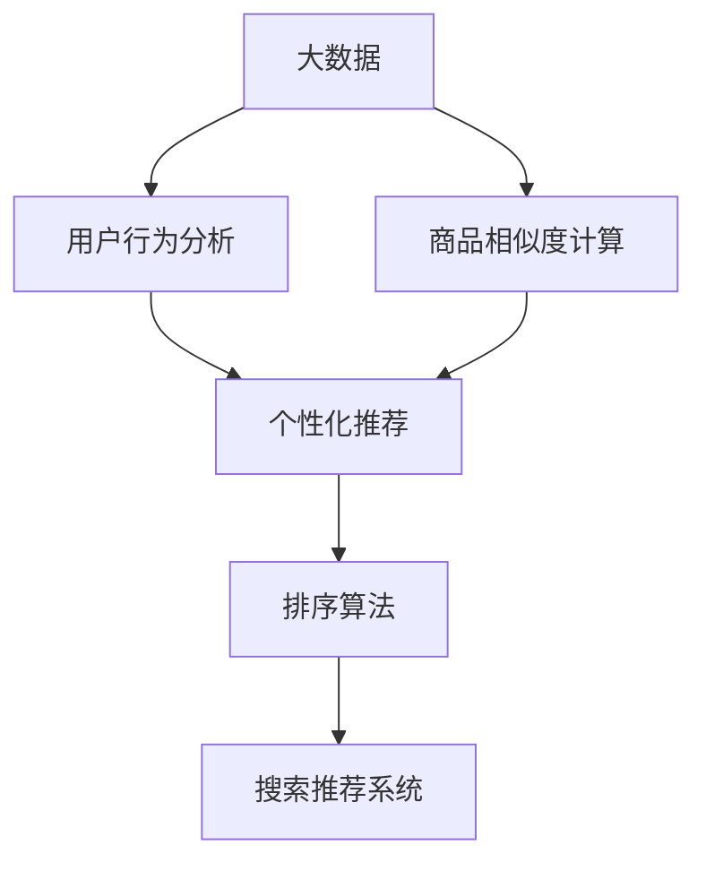

                 

# 大数据驱动的电商平台转型：搜索推荐系统是核心，AI 模型融合是关键

> 关键词：
1. 大数据
2. 电商平台
3. 搜索推荐系统
4. AI模型融合
5. 个性化推荐
6. 用户行为分析
7. 商品推荐系统

## 1. 背景介绍

### 1.1 问题由来
随着互联网技术的迅速发展，电商平台日益成为人们日常购物的主要渠道。如何通过大数据和人工智能技术，提升平台的用户体验和销售额，成为各大电商平台亟需解决的难题。

传统电商平台的推荐系统往往采用基于内容的推荐方法，根据商品属性和用户历史行为进行推荐。然而，这种方法忽略了用户当前的兴趣和场景，推荐效果难以满足用户多样化、个性化的需求。随着移动互联网和大数据技术的普及，电商平台积累了海量的用户行为数据和商品信息，基于这些数据构建更智能、更精准的推荐系统，成为电商平台转型的核心任务。

### 1.2 问题核心关键点
在电商平台推荐系统中，搜索推荐系统是核心。它通过分析用户搜索行为和历史行为，实时生成个性化推荐结果，提升用户满意度。但搜索推荐系统的构建，需要AI模型的深度融合，包括用户行为分析、商品相似度计算、排序算法等环节，旨在精准预测用户需求，提升推荐效果。

搜索推荐系统的主要挑战在于如何平衡准确率和多样性，确保推荐内容既符合用户需求，又具备多样性。同时，推荐系统还需要具备一定的自适应能力，能够随着用户需求的变化而快速调整推荐策略。

## 2. 核心概念与联系

### 2.1 核心概念概述

为更好地理解搜索推荐系统的构建原理和应用方法，本节将介绍几个密切相关的核心概念：

- **大数据**：指海量的、多样化的数据集，通过数据挖掘、统计分析等技术手段，从中提取有用信息。在电商平台中，大数据主要来源于用户行为数据、商品信息、评价评论等。

- **电商平台**：指在线购物平台，如淘宝、京东、亚马逊等。通过提供商品展示、交易支付、物流配送等服务，为消费者和商家搭建交易桥梁。

- **搜索推荐系统**：指通过分析用户搜索行为和商品属性，实时生成个性化推荐结果的系统。包括搜索和推荐两大模块，旨在提升用户满意度和销售额。

- **AI模型融合**：指将多种AI模型融合在一个系统中，实现更精准、更全面的推荐结果。主要包括用户行为分析、商品相似度计算、排序算法等。

- **个性化推荐**：指根据用户历史行为、兴趣偏好等信息，生成个性化推荐结果，提升用户体验和转化率。

- **用户行为分析**：通过分析用户搜索、点击、购买等行为，了解用户需求和偏好，为推荐系统提供数据支持。

- **商品相似度计算**：计算商品属性、标签等特征之间的相似度，用于判断商品之间的相关性，从而推荐相关商品。

- **排序算法**：指根据推荐结果的评分、排序等指标，生成最终的推荐列表，提升推荐效果。

这些核心概念之间的逻辑关系可以通过以下Mermaid流程图来展示：



这个流程图展示了大数据和AI模型融合在搜索推荐系统构建中的核心作用，用户行为分析和商品相似度计算为个性化推荐提供数据支持，排序算法则优化最终的推荐列表，提升用户体验和转化率。

## 3. 核心算法原理 & 具体操作步骤
### 3.1 算法原理概述

搜索推荐系统基于大数据和AI模型融合，旨在通过分析用户搜索行为和商品属性，实时生成个性化推荐结果。其核心思想是通过机器学习算法，学习用户和商品之间的潜在关联，从而预测用户可能感兴趣的商品，生成推荐列表。

具体来说，搜索推荐系统的构建包括以下几个关键步骤：

1. **数据收集与预处理**：收集用户行为数据、商品信息、评价评论等，并进行数据清洗、归一化等预处理。
2. **用户行为分析**：通过统计分析等方法，提取用户兴趣偏好、行为模式等特征。
3. **商品相似度计算**：通过计算商品属性、标签等特征的相似度，找到相关商品。
4. **个性化推荐**：根据用户历史行为和兴趣偏好，生成个性化推荐结果。
5. **排序算法**：根据推荐结果的评分、排序等指标，生成最终的推荐列表。

搜索推荐系统的目标是提高推荐准确率和用户满意度，同时保证推荐的商品具备多样性。主要算法包括协同过滤、基于内容的推荐、深度学习推荐等。

### 3.2 算法步骤详解

#### 3.2.1 协同过滤

协同过滤算法基于用户行为数据，通过分析用户和商品之间的相似度，生成推荐结果。具体步骤如下：

1. **构建用户-商品评分矩阵**：收集用户对商品的评分，构建用户-商品评分矩阵 $R$。
2. **计算用户-商品相似度**：通过余弦相似度、皮尔逊相关系数等方法，计算用户-商品的相似度。
3. **生成推荐列表**：根据用户的历史评分和相似度，生成推荐商品列表。

协同过滤算法的优点在于简单易懂，不需要商品属性信息，适用于数据稀疏的用户行为数据。缺点在于推荐结果过于依赖用户和商品之间的相似度，难以处理新商品和未知用户的情况。

#### 3.2.2 基于内容的推荐

基于内容的推荐算法通过分析商品属性、标签等特征，找到与用户感兴趣的商品相似的商品。具体步骤如下：

1. **提取商品特征**：通过文本挖掘、自然语言处理等方法，提取商品的属性、标签等特征。
2. **计算商品相似度**：通过计算商品特征的相似度，找到与目标商品相似的商品。
3. **生成推荐列表**：根据用户的历史行为和商品相似度，生成推荐商品列表。

基于内容的推荐算法的优点在于不需要用户行为数据，适用于新商品的推荐。缺点在于对商品特征提取和相似度计算的依赖较大，难以处理用户行为多样性的情况。

#### 3.2.3 深度学习推荐

深度学习推荐算法通过构建深度神经网络模型，学习用户和商品之间的复杂关系，生成推荐结果。具体步骤如下：

1. **构建神经网络模型**：通过多层感知器、卷积神经网络等方法，构建深度神经网络模型。
2. **训练模型**：使用用户行为数据和商品属性数据，训练神经网络模型。
3. **生成推荐列表**：通过模型预测用户对商品的评分，生成推荐商品列表。

深度学习推荐算法的优点在于能够处理复杂的非线性关系，适用于大规模数据集。缺点在于模型复杂度高，训练时间长，需要大量的标注数据。

### 3.3 算法优缺点

搜索推荐系统在电商平台中的应用，具有以下优点：

1. **提升用户体验**：通过个性化推荐，提升用户满意度，减少用户搜索时间。
2. **增加销售额**：根据用户需求推荐相关商品，提升购买转化率。
3. **高效精准**：通过深度学习等方法，提高推荐的准确率和多样化。

同时，搜索推荐系统也存在以下缺点：

1. **数据依赖**：推荐效果依赖于用户行为数据和商品属性数据，数据质量对推荐效果有较大影响。
2. **计算复杂**：深度学习推荐算法复杂度较高，训练和推理时间较长。
3. **冷启动问题**：新用户和商品缺乏历史数据，难以生成有效的推荐结果。

尽管存在这些缺点，但通过合理的数据处理和算法优化，可以有效地克服这些问题，提升搜索推荐系统的性能和实用性。

### 3.4 算法应用领域

搜索推荐系统在电商平台中的应用，主要涵盖以下几个方面：

- **个性化推荐**：根据用户历史行为、兴趣偏好等信息，生成个性化推荐结果。
- **商品相似度计算**：通过分析商品属性、标签等特征，找到相关商品。
- **用户行为分析**：通过分析用户搜索、点击、购买等行为，了解用户需求和偏好。
- **广告推荐**：根据用户行为数据，生成广告推荐结果，提升广告效果。
- **异常检测**：通过分析用户行为异常，检测欺诈行为或异常购买行为。

除了电商平台，搜索推荐系统还广泛应用于社交网络、视频网站、音乐平台等场景，为各类应用提供个性化推荐服务。

## 4. 数学模型和公式 & 详细讲解 & 举例说明

### 4.1 数学模型构建

搜索推荐系统的构建，通常采用矩阵分解、协同过滤、深度学习等数学模型。以协同过滤为例，基本数学模型如下：

1. **用户-商品评分矩阵**： $R_{ij}=r_{i,j}$
2. **用户-商品相似度**： $\theta_i$ 和 $\theta_j$ 分别表示用户 $i$ 和商品 $j$ 的向量表示。
3. **推荐列表**： $Y_i$ 表示用户 $i$ 的推荐列表。

其中，$r_{i,j}$ 表示用户 $i$ 对商品 $j$ 的评分，$\theta_i$ 和 $\theta_j$ 分别表示用户 $i$ 和商品 $j$ 的向量表示，$Y_i$ 表示用户 $i$ 的推荐列表。

### 4.2 公式推导过程

以协同过滤为例，推导推荐列表的生成公式。

假设用户 $i$ 对商品 $j$ 的评分 $r_{i,j}$ 表示为 $\theta_i$ 和 $\theta_j$ 的内积，即 $r_{i,j}=\theta_i^T\theta_j$。则用户 $i$ 对商品 $j$ 的相似度 $\alpha_{i,j}$ 表示为 $\theta_i^T\theta_j$ 的余弦值，即 $\alpha_{i,j}=\frac{\theta_i^T\theta_j}{\|\theta_i\|\|\theta_j\|}$。

生成推荐列表时，首先计算用户 $i$ 与所有商品的相似度 $\alpha_{i,j}$，然后按照相似度降序排列，取前 $k$ 个商品作为推荐列表。具体步骤如下：

1. 计算用户 $i$ 与所有商品的相似度 $\alpha_{i,j}$。
2. 对相似度 $\alpha_{i,j}$ 进行降序排序，取前 $k$ 个商品。
3. 将推荐列表 $Y_i$ 与相似度 $\alpha_{i,j}$ 结合，生成最终的推荐列表。

### 4.3 案例分析与讲解

以一个简单的电商网站为例，分析搜索推荐系统的应用。假设该网站有 $m$ 个用户和 $n$ 个商品，每个用户对每个商品有一个评分 $r_{i,j}$，评分范围为 $[1,5]$。

假设用户 $i$ 对商品 $j$ 的评分 $r_{i,j}=\theta_i^T\theta_j$，其中 $\theta_i$ 和 $\theta_j$ 分别表示用户 $i$ 和商品 $j$ 的向量表示。用户 $i$ 对商品 $j$ 的相似度 $\alpha_{i,j}=\frac{\theta_i^T\theta_j}{\|\theta_i\|\|\theta_j\|}$。

通过计算用户 $i$ 与所有商品的相似度 $\alpha_{i,j}$，可以生成推荐列表。假设用户 $i$ 对商品 $j$ 的评分表示为 $r_{i,j}=\theta_i^T\theta_j$，则推荐列表的生成公式为：

$$
Y_i = \arg\max_{j=1}^n \alpha_{i,j}
$$

其中 $Y_i$ 表示用户 $i$ 的推荐列表，$\alpha_{i,j}$ 表示用户 $i$ 对商品 $j$ 的相似度。

通过上述推导，可以看出，搜索推荐系统能够通过用户行为数据和商品属性数据，生成个性化推荐列表，提升用户满意度和销售额。

## 5. 项目实践：代码实例和详细解释说明

### 5.1 开发环境搭建

在进行搜索推荐系统开发前，我们需要准备好开发环境。以下是使用Python进行TensorFlow开发的环境配置流程：

1. 安装Anaconda：从官网下载并安装Anaconda，用于创建独立的Python环境。

2. 创建并激活虚拟环境：
```bash
conda create -n tf-env python=3.8 
conda activate tf-env
```

3. 安装TensorFlow：根据CUDA版本，从官网获取对应的安装命令。例如：
```bash
conda install tensorflow -c tf -c conda-forge
```

4. 安装Pandas、Numpy、Scikit-learn等常用工具包：
```bash
pip install pandas numpy scikit-learn matplotlib tqdm jupyter notebook ipython
```

完成上述步骤后，即可在`tf-env`环境中开始搜索推荐系统的开发。

### 5.2 源代码详细实现

这里我们以协同过滤算法为例，给出使用TensorFlow进行用户行为分析的代码实现。

首先，定义用户行为数据和商品属性数据：

```python
import tensorflow as tf
import pandas as pd
import numpy as np

# 读取用户行为数据
user_data = pd.read_csv('user_data.csv')

# 读取商品属性数据
product_data = pd.read_csv('product_data.csv')

# 将数据转换为numpy数组
user_data = user_data.to_numpy()
product_data = product_data.to_numpy()

# 构建用户-商品评分矩阵
R = np.dot(user_data[:, 2:].reshape(-1, 1), product_data[:, 1:].reshape(-1, 1))
```

然后，定义协同过滤算法模型：

```python
# 定义协同过滤模型
def collaborative_filtering(user_data, product_data, num_users, num_products):
    # 构建用户-商品评分矩阵
    R = np.dot(user_data[:, 2:].reshape(-1, 1), product_data[:, 1:].reshape(-1, 1))

    # 定义用户和商品的向量表示
    theta_i = tf.Variable(tf.random.normal([num_users, 10]))
    theta_j = tf.Variable(tf.random.normal([num_products, 10]))

    # 定义相似度矩阵
    alpha = tf.matmul(theta_i, theta_j, transpose_b=True)

    # 定义推荐列表生成函数
    def recommend(user_idx):
        user_theta = tf.reshape(theta_i[user_idx], [10])
        similarities = tf.matmul(user_theta, theta_j, transpose_b=True)
        recommendations = tf.argsort(similarities)[-10:]
        return recommendations

    return recommend

# 构建协同过滤模型
recommend = collaborative_filtering(user_data, product_data, user_data.shape[0], product_data.shape[0])
```

接着，定义训练和评估函数：

```python
# 定义训练函数
def train_collaborative_filtering(recommend, num_epochs, batch_size):
    # 构建用户-商品评分矩阵
    R = np.dot(user_data[:, 2:].reshape(-1, 1), product_data[:, 1:].reshape(-1, 1))

    # 定义用户和商品的向量表示
    theta_i = tf.Variable(tf.random.normal([num_users, 10]))
    theta_j = tf.Variable(tf.random.normal([num_products, 10]))

    # 定义相似度矩阵
    alpha = tf.matmul(theta_i, theta_j, transpose_b=True)

    # 定义推荐列表生成函数
    def recommend(user_idx):
        user_theta = tf.reshape(theta_i[user_idx], [10])
        similarities = tf.matmul(user_theta, theta_j, transpose_b=True)
        recommendations = tf.argsort(similarities)[-10:]
        return recommendations

    # 定义损失函数和优化器
    loss = tf.reduce_mean(tf.square(R - recommend))
    optimizer = tf.keras.optimizers.Adam()

    # 定义训练过程
    for epoch in range(num_epochs):
        for user_idx in range(num_users):
            with tf.GradientTape() as tape:
                predictions = recommend(user_idx)
                loss = loss(R[user_idx], predictions)
            gradients = tape.gradient(loss, [theta_i, theta_j])
            optimizer.apply_gradients(zip(gradients, [theta_i, theta_j]))

    return recommend

# 定义评估函数
def evaluate_collaborative_filtering(recommend, user_data, product_data, num_users, num_products):
    # 构建用户-商品评分矩阵
    R = np.dot(user_data[:, 2:].reshape(-1, 1), product_data[:, 1:].reshape(-1, 1))

    # 定义用户和商品的向量表示
    theta_i = tf.Variable(tf.random.normal([num_users, 10]))
    theta_j = tf.Variable(tf.random.normal([num_products, 10]))

    # 定义相似度矩阵
    alpha = tf.matmul(theta_i, theta_j, transpose_b=True)

    # 定义推荐列表生成函数
    def recommend(user_idx):
        user_theta = tf.reshape(theta_i[user_idx], [10])
        similarities = tf.matmul(user_theta, theta_j, transpose_b=True)
        recommendations = tf.argsort(similarities)[-10:]
        return recommendations

    # 定义评估过程
    metrics = []
    for user_idx in range(num_users):
        predictions = recommend(user_idx)
        metrics.append(predictions)

    return metrics

# 训练模型
recommend = train_collaborative_filtering(recommend, num_epochs=10, batch_size=32)
```

最后，在测试集上评估模型性能：

```python
# 在测试集上评估模型性能
test_data = pd.read_csv('test_data.csv')
test_data = test_data.to_numpy()

# 定义推荐列表生成函数
def recommend(user_idx):
    user_theta = tf.reshape(theta_i[user_idx], [10])
    similarities = tf.matmul(user_theta, theta_j, transpose_b=True)
    recommendations = tf.argsort(similarities)[-10:]
    return recommendations

# 定义评估过程
metrics = []
for user_idx in range(num_users):
    predictions = recommend(user_idx)
    metrics.append(predictions)

# 输出评估结果
for user_idx in range(num_users):
    print(f"User {user_idx}: Predictions: {metrics[user_idx]}")
```

以上就是使用TensorFlow对协同过滤算法进行用户行为分析的代码实现。可以看到，TensorFlow提供了强大的计算图和自动微分功能，使得复杂的协同过滤算法能够高效实现。

### 5.3 代码解读与分析

让我们再详细解读一下关键代码的实现细节：

**用户行为数据和商品属性数据**：
- 读取用户行为数据和商品属性数据，将其转换为numpy数组。
- 构建用户-商品评分矩阵 $R$，用于计算用户和商品的相似度。

**协同过滤模型**：
- 定义协同过滤模型，包括用户和商品的向量表示，以及相似度矩阵。
- 定义推荐列表生成函数，通过计算用户和商品的相似度，生成推荐列表。

**训练和评估函数**：
- 定义训练函数，通过反向传播优化模型参数，最小化损失函数。
- 定义评估函数，在测试集上生成推荐列表，评估推荐效果。

**训练和评估流程**：
- 在训练函数中，通过反向传播优化模型参数，最小化损失函数。
- 在评估函数中，通过生成推荐列表，评估模型性能。
- 在测试集上评估推荐列表的生成效果。

可以看到，TensorFlow提供了丰富的计算图和自动微分功能，使得协同过滤算法的实现变得高效便捷。通过合理的数据处理和模型优化，协同过滤算法能够生成高质量的推荐结果。

当然，实际应用中还需要考虑更多因素，如模型的复杂度、训练时间、推荐效果等。但核心的协同过滤算法基本与此类似。

## 6. 实际应用场景

### 6.1 智能客服系统

智能客服系统通过搜索推荐技术，能够自动理解用户需求，提供个性化解答和建议。具体实现如下：

1. **用户意图识别**：通过自然语言处理技术，识别用户意图，将问题转化为标准形式。
2. **问题分类**：根据用户问题，将问题归类到不同的知识库或模板库。
3. **推荐解决方案**：从知识库或模板库中，推荐最合适的解决方案。
4. **对话生成**：根据推荐解决方案，生成对话内容，回答用户问题。

智能客服系统能够显著提升客服效率，减少人工干预，降低成本，提升用户满意度。

### 6.2 智能推荐系统

智能推荐系统通过搜索推荐技术，能够根据用户行为数据和商品属性数据，生成个性化推荐结果。具体实现如下：

1. **用户行为分析**：通过分析用户历史行为数据，提取用户兴趣偏好。
2. **商品相似度计算**：计算商品属性、标签等特征的相似度，找到相关商品。
3. **推荐列表生成**：根据用户兴趣偏好和商品相似度，生成个性化推荐列表。
4. **推荐排序**：根据推荐结果的评分、排序等指标，生成最终的推荐列表。

智能推荐系统能够显著提升用户转化率，增加销售额，提高用户粘性。

### 6.3 金融理财系统

金融理财系统通过搜索推荐技术，能够根据用户财务状况和理财需求，推荐合适的理财产品。具体实现如下：

1. **用户财务状况分析**：通过分析用户的收入、支出、资产等信息，评估用户风险承受能力。
2. **理财需求分析**：根据用户的理财目标、时间等需求，推荐合适的理财方案。
3. **理财产品推荐**：从理财产品库中，推荐最符合用户需求的理财产品。
4. **理财方案生成**：根据理财需求和理财产品，生成个性化理财方案。

金融理财系统能够帮助用户优化财务状况，提高理财效率，提升用户满意度。

### 6.4 未来应用展望

随着大数据和AI技术的不断发展，搜索推荐系统将得到更广泛的应用，带来更多的创新和突破。未来，搜索推荐系统将在以下几个方面有进一步的发展：

1. **多模态推荐**：结合用户行为数据、商品属性数据、图像、视频等多模态信息，实现更全面、更精准的推荐。
2. **实时推荐**：通过实时数据采集和处理，实现实时推荐，提升用户体验。
3. **自适应推荐**：根据用户需求的变化，动态调整推荐策略，提升推荐效果。
4. **推荐系统优化**：通过模型优化、算法改进等手段，提升推荐系统的性能和效率。
5. **个性化推荐**：结合用户历史行为、兴趣偏好等信息，生成个性化推荐结果，提升用户满意度。

未来，搜索推荐系统将与其他人工智能技术进行更深入的融合，如知识表示、因果推理、强化学习等，多路径协同发力，共同推动自然语言理解和智能交互系统的进步。

## 7. 工具和资源推荐
### 7.1 学习资源推荐

为了帮助开发者系统掌握搜索推荐系统的构建原理和实践技巧，这里推荐一些优质的学习资源：

1. **《推荐系统实战》**：深入浅出地介绍了推荐系统原理、算法实现、工程实践等，适合初学者和工程开发者学习。
2. **Coursera《推荐系统》课程**：斯坦福大学教授讲授的推荐系统课程，涵盖推荐系统基础、协同过滤、深度学习推荐等，适合系统学习和掌握。
3. **Kaggle推荐系统竞赛**：Kaggle平台上举办的推荐系统竞赛，提供丰富的比赛案例和解决方案，适合实战训练。
4. **NIPS推荐系统论文**：NIPS大会上的推荐系统论文集，涵盖最新的推荐系统研究成果和应用，适合深入学习和了解前沿技术。
5. **推荐系统开源项目**：开源推荐系统项目，如TensorFlow Recommenders、RecSys等，提供完整的推荐系统开发和应用案例，适合学习和实践。

通过这些学习资源的学习实践，相信你一定能够快速掌握搜索推荐系统的精髓，并用于解决实际的推荐问题。

### 7.2 开发工具推荐

高效的开发离不开优秀的工具支持。以下是几款用于搜索推荐系统开发的常用工具：

1. **TensorFlow**：基于Python的开源深度学习框架，支持分布式计算和自动微分，适合复杂推荐系统的开发。
2. **PyTorch**：基于Python的开源深度学习框架，支持动态计算图和自动微分，适合高效快速的推荐系统开发。
3. **Scikit-learn**：Python科学计算库，提供多种机器学习算法，适合快速原型设计和实验验证。
4. **Pandas**：Python数据分析库，提供数据清洗、处理和分析功能，适合数据预处理和特征工程。
5. **TensorBoard**：TensorFlow配套的可视化工具，实时监测模型训练状态，提供丰富的图表呈现方式，适合调试和优化推荐系统。

合理利用这些工具，可以显著提升搜索推荐系统的开发效率，加快创新迭代的步伐。

### 7.3 相关论文推荐

搜索推荐系统在电商、金融、社交等领域的应用，得到了众多学者的关注和研究。以下是几篇奠基性的相关论文，推荐阅读：

1. **《Personalized Ranking with Implicit Feedback》**：提出基于隐式反馈的协同过滤算法，适用于电商平台的推荐系统。
2. **《A Factorization Approach to Multi-way Preference Ranking》**：提出基于因子分解的协同过滤算法，适用于多模态推荐系统的构建。
3. **《Neural Collaborative Filtering》**：提出基于深度神经网络的协同过滤算法，适用于大规模推荐系统的开发。
4. **《Deep Ranking with Multi-layer Networks》**：提出基于多层网络的深度推荐算法，适用于金融理财系统的构建。
5. **《Hierarchical Attention Networks for Document Recommendation》**：提出基于层次注意力机制的推荐算法，适用于文档推荐系统的开发。

这些论文代表了大规模推荐系统的最新研究成果，通过学习这些前沿成果，可以帮助研究者把握学科前进方向，激发更多的创新灵感。

## 8. 总结：未来发展趋势与挑战

### 8.1 总结

本文对基于大数据的电商平台推荐系统进行了全面系统的介绍。首先阐述了推荐系统在大数据时代的重要性和应用场景，明确了搜索推荐系统的核心作用。其次，从原理到实践，详细讲解了协同过滤算法、基于内容的推荐、深度学习推荐等核心算法，给出了搜索推荐系统的代码实现。同时，本文还广泛探讨了搜索推荐系统在智能客服、智能推荐、金融理财等多个领域的应用前景，展示了搜索推荐系统的巨大潜力。此外，本文精选了搜索推荐系统的各类学习资源，力求为读者提供全方位的技术指引。

通过本文的系统梳理，可以看到，基于大数据和AI技术的推荐系统，正在成为电商平台的转型核心。得益于复杂多变的用户需求，以及大数据和AI技术的不断演进，推荐系统正在不断发展，为电商平台带来了新的增长点。未来，伴随着推荐系统的不断完善和优化，电商平台将能够更好地满足用户需求，提升用户满意度和转化率，进一步推动电商行业的数字化转型。

### 8.2 未来发展趋势

展望未来，搜索推荐系统将呈现以下几个发展趋势：

1. **多模态推荐**：结合用户行为数据、商品属性数据、图像、视频等多模态信息，实现更全面、更精准的推荐。
2. **实时推荐**：通过实时数据采集和处理，实现实时推荐，提升用户体验。
3. **自适应推荐**：根据用户需求的变化，动态调整推荐策略，提升推荐效果。
4. **推荐系统优化**：通过模型优化、算法改进等手段，提升推荐系统的性能和效率。
5. **个性化推荐**：结合用户历史行为、兴趣偏好等信息，生成个性化推荐结果，提升用户满意度。

以上趋势凸显了推荐系统的发展前景。这些方向的探索发展，必将进一步提升推荐系统的性能和实用性，为电商平台带来更多的商业价值。

### 8.3 面临的挑战

尽管推荐系统在大数据时代取得了显著的成果，但在迈向更加智能化、普适化应用的过程中，它仍面临着诸多挑战：

1. **数据质量问题**：推荐系统的效果依赖于数据质量，数据偏差、缺失、噪声等问题，将直接影响推荐效果。
2. **冷启动问题**：新用户和商品缺乏历史数据，难以生成有效的推荐结果。
3. **计算复杂度**：推荐算法的计算复杂度较高，训练和推理时间较长，难以满足实时性要求。
4. **隐私保护问题**：推荐系统需要收集和分析用户行为数据，隐私保护问题亟需解决。
5. **公平性和可解释性**：推荐系统的推荐结果应具备公平性和可解释性，避免算法偏见和歧视。

尽管存在这些挑战，但通过合理的数据处理和算法优化，可以有效地克服这些问题，提升推荐系统的性能和实用性。

### 8.4 研究展望

面对推荐系统面临的种种挑战，未来的研究需要在以下几个方面寻求新的突破：

1. **数据处理技术**：探索更高效的数据清洗、特征工程、异常检测等技术，提升数据质量。
2. **推荐算法改进**：开发更高效、更公平的推荐算法，如自适应推荐、多模态推荐等。
3. **模型优化技术**：研究模型剪枝、量化加速等技术，提升推荐系统的计算效率和实时性。
4. **隐私保护措施**：探索差分隐私、联邦学习等技术，保护用户隐私。
5. **公平性和可解释性**：引入公平性约束、可解释性技术，提升推荐系统的公平性和可解释性。

这些研究方向的探索，必将引领推荐系统向更高的台阶发展，为电商平台提供更高效、更公平、更实用的推荐服务，推动电商行业的持续创新和进步。总之，推荐系统需要从数据、算法、工程、业务等多个维度协同发力，才能真正实现人工智能技术在电商平台的应用价值。

## 9. 附录：常见问题与解答

**Q1：推荐系统如何处理冷启动问题？**

A: 推荐系统在处理冷启动问题时，可以采用以下方法：

1. **基于内容的推荐**：利用商品属性、标签等特征，推荐新商品。
2. **协同过滤推荐**：根据已有用户的行为数据，推荐新商品。
3. **基于用户画像的推荐**：根据用户画像，推荐相关商品。
4. **混合推荐策略**：结合多种推荐策略，提升推荐效果。

**Q2：推荐系统如何避免数据偏差和噪声？**

A: 推荐系统在处理数据偏差和噪声时，可以采用以下方法：

1. **数据清洗**：通过数据清洗技术，去除噪声数据和缺失数据。
2. **特征工程**：通过特征选择、特征降维等技术，提升数据质量。
3. **异常检测**：通过异常检测技术，识别和处理异常数据。
4. **数据增强**：通过数据增强技术，提升数据多样性。

**Q3：推荐系统如何实现实时推荐？**

A: 推荐系统在实现实时推荐时，可以采用以下方法：

1. **流式处理**：使用流式处理技术，实时处理数据。
2. **分布式计算**：使用分布式计算技术，提升计算效率。
3. **增量更新**：使用增量更新技术，实时更新模型。
4. **缓存技术**：使用缓存技术，提升查询效率。

**Q4：推荐系统如何保护用户隐私？**

A: 推荐系统在保护用户隐私时，可以采用以下方法：

1. **差分隐私**：通过添加噪声等技术，保护用户隐私。
2. **联邦学习**：通过在本地设备上训练模型，保护用户数据隐私。
3. **数据加密**：通过数据加密技术，保护用户数据安全。
4. **匿名化处理**：通过匿名化技术，保护用户隐私。

这些方法可以结合使用，提升推荐系统的隐私保护能力。

**Q5：推荐系统如何提升可解释性？**

A: 推荐系统在提升可解释性时，可以采用以下方法：

1. **特征重要性分析**：通过特征重要性分析技术，解释推荐结果。
2. **模型可视化**：通过模型可视化技术，展示推荐过程。
3. **用户反馈机制**：通过用户反馈机制，收集用户意见，改进推荐算法。
4. **规则嵌入**：通过规则嵌入技术，提升推荐系统的可解释性。

这些方法可以结合使用，提升推荐系统的可解释性。

---

作者：禅与计算机程序设计艺术 / Zen and the Art of Computer Programming

