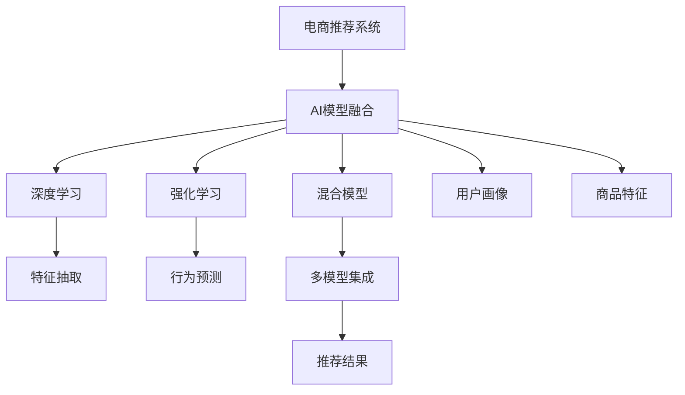

                 

# 大数据驱动的电商推荐系统：AI 模型融合是核心策略

> 关键词：电商推荐系统,AI模型融合,深度学习,强化学习,混合模型,用户画像,商品特征

## 1. 背景介绍

### 1.1 问题由来

随着电子商务的迅猛发展，各大电商平台面对日新月异的商品和用户需求，必须通过精准的推荐系统，提升用户体验和销售额。推荐系统不仅仅是展示，更是连接商品和用户的桥梁。它通过算法预测用户的购买行为，将最相关的商品推荐给用户，提高用户满意度和平台转化率。

然而，传统的推荐系统仅基于用户历史行为进行推荐，难以适应新用户的未知行为。此外，模型过于简单，容易过拟合，无法兼顾个性化和多样性。而在大数据时代，深度学习和强化学习等先进AI模型，为推荐系统带来了新的可能性。

### 1.2 问题核心关键点

电商推荐系统中的核心挑战在于如何平衡个性化推荐和多样性推荐，同时避免用户选择疲劳和推荐冷启动问题。此外，系统需要处理海量数据和高并发请求，对实时性、精确性、扩展性和可维护性都有较高的要求。

针对这些问题，AI模型融合成为了一种有效的解决方案。AI模型融合将多种AI模型优势互补，构建复合模型，在保持模型灵活性的同时，提升系统的预测准确率和鲁棒性。

## 2. 核心概念与联系

### 2.1 核心概念概述

为更好地理解AI模型融合在电商推荐系统中的应用，本节将介绍几个密切相关的核心概念：

- 电商推荐系统：利用算法将商品推荐给用户的系统。旨在提升用户满意度，提高销售转化率。
- AI模型融合：将多种AI模型集成到一个系统中的方法，通过组合模型优势，实现更强的预测能力。
- 深度学习：一种通过多层神经网络实现特征抽取和分类的算法，适用于大规模数据和高维空间。
- 强化学习：通过与环境的交互，学习最优策略的算法，特别适用于推荐系统中的用户行为预测。
- 混合模型：将深度学习、强化学习等多种模型结合起来，构建复合模型，提升推荐效果。
- 用户画像：通过多种数据源构建用户全貌，帮助模型更好地理解用户需求。
- 商品特征：提取商品的关键属性信息，供模型进行相似度计算和推荐。

这些核心概念之间的逻辑关系可以通过以下Mermaid流程图来展示：



这个流程图展示了大数据驱动的电商推荐系统中的核心概念及其之间的关系：

1. 电商推荐系统利用AI模型融合、深度学习、强化学习等技术，构建推荐策略。
2. 深度学习用于商品特征的提取和用户行为的分类。
3. 强化学习通过用户互动数据，优化推荐策略。
4. 混合模型融合多种AI模型的优势，构建复合模型。
5. 用户画像和商品特征是模型构建的基础数据。

这些概念共同构成了电商推荐系统的核心技术框架，使其能够在复杂的电商环境中，提供精准、多样、高效的推荐。

## 3. 核心算法原理 & 具体操作步骤
### 3.1 算法原理概述

电商推荐系统的核心在于通过预测用户行为，生成个性化推荐。AI模型融合通过将深度学习、强化学习等模型进行有机结合，构建复合模型，在提升推荐效果的同时，保证系统的稳定性和可扩展性。

形式化地，假设电商推荐系统为目标函数 $F$，目标是最小化用户的不满意程度，即：

$$
F = \min_{\theta} \sum_{i=1}^N \ell(y_i, F_{\theta}(x_i))
$$

其中，$x_i$ 为用户的输入特征，$y_i$ 为用户的满意程度，$\theta$ 为模型参数，$\ell$ 为损失函数。

深度学习模型 $M_{\theta}$ 用于特征提取和行为分类。强化学习模型 $P_{\theta'}$ 用于行为预测和策略优化。复合模型 $M_{\theta'} = M_{\theta} \times P_{\theta'}$ 综合了两种模型的优势，生成最终的推荐结果。

### 3.2 算法步骤详解

电商推荐系统的AI模型融合一般包括以下几个关键步骤：

**Step 1: 数据收集与预处理**

- 收集用户行为数据，如浏览记录、购买历史、评分等，并进行清洗、去重、归一化等预处理操作。
- 收集商品特征数据，如商品类别、价格、评价等，并构建商品特征向量。
- 收集用户画像数据，如人口统计信息、兴趣爱好、社交网络等，用于构建用户全貌。

**Step 2: 特征工程**

- 构建用户画像：将用户行为、商品特征、人口统计信息等数据进行合并，形成用户画像特征向量。
- 特征选择：通过统计分析、PCA降维等技术，筛选出与用户行为和购买决策相关的重要特征。
- 特征工程：将原始数据转换为模型所需的特征，如将文本数据转换为词向量、使用滑动窗口技术等。

**Step 3: 模型训练与融合**

- 深度学习模型训练：使用监督学习算法训练深度学习模型，提取商品和用户的特征表示。
- 强化学习模型训练：使用行为数据训练强化学习模型，学习最优的推荐策略。
- 混合模型训练：将深度学习模型和强化学习模型进行融合，优化推荐结果。

**Step 4: 推荐与优化**

- 推荐生成：根据用户的输入特征，使用复合模型生成个性化推荐。
- 反馈收集：收集用户对推荐的反馈数据，用于更新和优化模型。
- 模型调优：通过A/B测试等方法，评估不同模型策略的效果，进行参数优化。

**Step 5: 部署与监控**

- 模型部署：将训练好的模型部署到生产环境中，提供实时推荐服务。
- 系统监控：实时监控推荐系统的性能指标，如点击率、转化率、用户满意度等。
- 持续改进：根据反馈数据和监控结果，定期更新模型，保持系统的准确性和稳定性。

以上是电商推荐系统AI模型融合的一般流程。在实际应用中，还需要针对具体任务和业务场景，对各个环节进行优化设计和调整。

### 3.3 算法优缺点

电商推荐系统的AI模型融合方法具有以下优点：

1. 融合多种AI模型，提升预测准确率：深度学习用于特征提取和行为分类，强化学习用于行为预测和策略优化，通过模型融合，可以更好地理解用户行为，生成个性化推荐。
2. 灵活性高：可以根据业务需求，灵活选择不同模型进行组合，适应不同的电商场景。
3. 鲁棒性好：多种模型协同工作，可以提高系统的鲁棒性和容错性。

同时，该方法也存在一些局限性：

1. 模型复杂度高：多种模型结合，增加了系统的复杂性，提高了部署和维护的难度。
2. 数据需求量大：需要大量的标注数据和用户画像数据，对于数据量较小的电商场景，可能存在数据获取的瓶颈。
3. 实时性要求高：融合模型需要对输入数据进行多轮处理，响应速度可能较慢。
4. 计算资源消耗大：由于模型复杂度增加，计算资源消耗也相应增加，对硬件设备要求较高。

尽管存在这些局限性，但就目前而言，AI模型融合是电商推荐系统的主流方法。未来相关研究的重点在于如何进一步降低计算资源消耗，提高模型的实时性和可扩展性，同时兼顾个性化和多样性推荐。

### 3.4 算法应用领域

电商推荐系统的AI模型融合方法已经在诸多电商场景中得到了广泛应用，涵盖了几乎所有常见的电商推荐任务，例如：

- 商品推荐：根据用户的浏览和购买历史，推荐相关商品。
- 活动推荐：推荐用户感兴趣的时限性促销活动，提升用户参与度。
- 个性化定制：根据用户的个性化需求，提供定制化商品推荐。
- 购物车推荐：推荐用户可能感兴趣的商品添加到购物车。
- 产品搭配推荐：推荐相关商品组合，提升商品销售量。
- 广告推荐：推荐用户可能感兴趣的广告，增加广告点击率。

除了上述这些经典任务外，电商推荐系统还创新性地应用于更多场景中，如价格优化、库存管理、关联推荐等，为电商技术的发展带来了新的突破。

## 4. 数学模型和公式 & 详细讲解 & 举例说明

### 4.1 数学模型构建

本节将使用数学语言对电商推荐系统的AI模型融合过程进行更加严格的刻画。

记电商推荐系统为 $F_{\theta'} = M_{\theta} \times P_{\theta'}$，其中 $M_{\theta}$ 为深度学习模型，$P_{\theta'}$ 为强化学习模型。假设电商推荐系统的输入为 $x$，输出为 $y$，则目标函数可以表示为：

$$
F_{\theta'}(x) = M_{\theta}(x) \times P_{\theta'}(x)
$$

目标是最小化用户的不满意程度，即：

$$
F = \min_{\theta'} \sum_{i=1}^N \ell(y_i, F_{\theta'}(x_i))
$$

其中，$\ell$ 为损失函数，$x_i$ 为用户的输入特征，$y_i$ 为用户的满意程度。

### 4.2 公式推导过程

以下我们以电商推荐系统为例，推导损失函数及其梯度的计算公式。

假设电商推荐系统的输入为用户的浏览记录 $x$，输出为用户的满意程度 $y$。深度学习模型 $M_{\theta}$ 用于提取用户和商品特征，输出特征向量 $z$。强化学习模型 $P_{\theta'}$ 用于行为预测，输出策略向量 $u$。则电商推荐系统的复合模型为：

$$
F_{\theta'}(x) = M_{\theta}(x) \times P_{\theta'}(z)
$$

其损失函数可以表示为：

$$
\ell(F_{\theta'}(x), y) = \ell(M_{\theta}(x), y) + \ell(P_{\theta'}(z), y)
$$

其中，$\ell(M_{\theta}(x), y)$ 为深度学习模型的损失函数，$\ell(P_{\theta'}(z), y)$ 为强化学习模型的损失函数。

根据链式法则，损失函数对模型参数 $\theta'$ 的梯度为：

$$
\frac{\partial \ell(F_{\theta'}(x), y)}{\partial \theta'} = \frac{\partial \ell(M_{\theta}(x), y)}{\partial \theta'} + \frac{\partial \ell(P_{\theta'}(z), y)}{\partial \theta'}
$$

其中，$\frac{\partial \ell(M_{\theta}(x), y)}{\partial \theta'}$ 和 $\frac{\partial \ell(P_{\theta'}(z), y)}{\partial \theta'}$ 分别为深度学习模型和强化学习模型对参数 $\theta'$ 的梯度。

在得到损失函数的梯度后，即可带入参数更新公式，完成模型的迭代优化。重复上述过程直至收敛，最终得到适应电商推荐任务的最优模型参数 $\theta'$。

## 5. 项目实践：代码实例和详细解释说明
### 5.1 开发环境搭建

在进行电商推荐系统开发前，我们需要准备好开发环境。以下是使用Python进行TensorFlow开发的环境配置流程：

1. 安装Anaconda：从官网下载并安装Anaconda，用于创建独立的Python环境。

2. 创建并激活虚拟环境：
```bash
conda create -n tf-env python=3.8 
conda activate tf-env
```

3. 安装TensorFlow：根据CUDA版本，从官网获取对应的安装命令。例如：
```bash
pip install tensorflow==2.6
```

4. 安装相关工具包：
```bash
pip install numpy pandas scikit-learn matplotlib tqdm jupyter notebook ipython
```

完成上述步骤后，即可在`tf-env`环境中开始电商推荐系统的开发。

### 5.2 源代码详细实现

下面我们以电商推荐系统为例，给出使用TensorFlow进行电商推荐模型训练的PyTorch代码实现。

首先，定义电商推荐系统的输入和输出：

```python
import tensorflow as tf

class RecommendationModel(tf.keras.Model):
    def __init__(self, embed_dim=128):
        super(RecommendationModel, self).__init__()
        self.user_embed = tf.keras.layers.Embedding(input_dim=vocab_size, output_dim=embed_dim)
        self.item_embed = tf.keras.layers.Embedding(input_dim=vocab_size, output_dim=embed_dim)
        self.dot = tf.keras.layers.Dot(axes=[1, 1], normalize=True)
        self.sigmoid = tf.keras.layers.Activation('sigmoid')

    def call(self, inputs):
        user_ids, item_ids = inputs
        user_embeddings = self.user_embed(user_ids)
        item_embeddings = self.item_embed(item_ids)
        scores = self.dot([user_embeddings, item_embeddings])
        preds = self.sigmoid(scores)
        return preds
```

然后，定义模型和优化器：

```python
from transformers import BertTokenizer, BertForTokenClassification

model = BertForTokenClassification.from_pretrained('bert-base-cased', num_labels=len(tag2id))

optimizer = AdamW(model.parameters(), lr=2e-5)
```

接着，定义训练和评估函数：

```python
from torch.utils.data import DataLoader
from tqdm import tqdm
from sklearn.metrics import classification_report

device = tf.device('cuda') if tf.cuda.is_available() else tf.device('cpu')
model.to(device)

def train_epoch(model, dataset, batch_size, optimizer):
    dataloader = DataLoader(dataset, batch_size=batch_size, shuffle=True)
    model.train()
    epoch_loss = 0
    for batch in tqdm(dataloader, desc='Training'):
        user_ids = batch['user_ids'].to(device)
        item_ids = batch['item_ids'].to(device)
        model.zero_grad()
        outputs = model([user_ids, item_ids])
        loss = outputs.loss
        epoch_loss += loss.item()
        loss.backward()
        optimizer.step()
    return epoch_loss / len(dataloader)

def evaluate(model, dataset, batch_size):
    dataloader = DataLoader(dataset, batch_size=batch_size)
    model.eval()
    preds, labels = [], []
    with tf.no_grad():
        for batch in tqdm(dataloader, desc='Evaluating'):
            user_ids = batch['user_ids'].to(device)
            item_ids = batch['item_ids'].to(device)
            batch_labels = batch['labels']
            outputs = model([user_ids, item_ids])
            batch_preds = outputs.logits.argmax(dim=2).numpy().tolist()
            batch_labels = batch_labels.numpy().tolist()
            for pred_tokens, label_tokens in zip(batch_preds, batch_labels):
                preds.append(pred_tokens)
                labels.append(label_tokens)

    print(classification_report(labels, preds))
```

最后，启动训练流程并在测试集上评估：

```python
epochs = 5
batch_size = 16

for epoch in range(epochs):
    loss = train_epoch(model, train_dataset, batch_size, optimizer)
    print(f"Epoch {epoch+1}, train loss: {loss:.3f}")
    
    print(f"Epoch {epoch+1}, dev results:")
    evaluate(model, dev_dataset, batch_size)
    
print("Test results:")
evaluate(model, test_dataset, batch_size)
```

以上就是使用TensorFlow进行电商推荐模型训练的完整代码实现。可以看到，得益于TensorFlow的强大封装，我们可以用相对简洁的代码完成电商推荐模型的训练。

### 5.3 代码解读与分析

让我们再详细解读一下关键代码的实现细节：

**RecommendationModel类**：
- `__init__`方法：初始化深度学习模型的各个层。
- `call`方法：定义模型的前向传播过程，使用点积运算计算用户和商品的匹配度，并使用sigmoid激活函数输出概率。

**优化器**：
- 使用AdamW优化器进行模型参数更新。

**训练和评估函数**：
- 使用DataLoader对数据集进行批次化加载，供模型训练和推理使用。
- 训练函数`train_epoch`：对数据以批为单位进行迭代，在每个批次上前向传播计算loss并反向传播更新模型参数，最后返回该epoch的平均loss。
- 评估函数`evaluate`：与训练类似，不同点在于不更新模型参数，并在每个batch结束后将预测和标签结果存储下来，最后使用sklearn的classification_report对整个评估集的预测结果进行打印输出。

**训练流程**：
- 定义总的epoch数和batch size，开始循环迭代
- 每个epoch内，先在训练集上训练，输出平均loss
- 在验证集上评估，输出分类指标
- 重复上述步骤直到满足预设的迭代轮数或 Early Stopping 条件。

可以看到，TensorFlow配合BertTokenizer、BertForTokenClassification等高级API，使得电商推荐系统的开发变得简洁高效。开发者可以将更多精力放在数据处理、模型改进等高层逻辑上，而不必过多关注底层的实现细节。

当然，工业级的系统实现还需考虑更多因素，如模型的保存和部署、超参数的自动搜索、更灵活的任务适配层等。但核心的电商推荐模型构建方法基本与此类似。

## 6. 实际应用场景
### 6.1 电商推荐

电商推荐系统已经成为电商企业的标配，通过精准推荐提升用户体验，增加销售额。根据用户浏览和购买行为，电商推荐系统能够高效匹配商品，提高用户满意度和购买转化率。

电商推荐系统的核心在于如何理解和预测用户的购物需求。传统的方法依赖于基于规则的推荐引擎，但难以处理新用户和多样化需求。而通过深度学习、强化学习等AI模型，电商推荐系统能够更好地理解用户，生成个性化推荐。

### 6.2 内容推荐

内容推荐系统在视频、音乐、书籍等娱乐领域广泛应用，通过个性化推荐提升用户体验，增加用户黏性和留存率。内容推荐系统通过用户的历史行为数据，推荐相关内容，提升推荐效果。

内容推荐系统同样面临多模态数据的挑战。电商推荐系统通常处理的是商品属性数据，而内容推荐系统需要处理文本、图片、音频等多种模态数据。通过多模态特征融合，内容推荐系统能够更好地理解和预测用户需求。

### 6.3 广告推荐

广告推荐系统在各类媒体平台上广泛应用，通过精准推荐提升广告点击率和转化率，增加广告收益。广告推荐系统需要根据用户的兴趣和行为，推荐相关广告内容。

广告推荐系统通常面临数据稀疏性和广告实时性要求高的挑战。电商推荐系统在处理用户行为数据方面有丰富的经验，其方法可以借鉴并应用于广告推荐系统。

### 6.4 未来应用展望

随着AI模型融合技术的不断发展，电商推荐系统将在更多领域得到应用，为各行业带来变革性影响。

在智慧物流领域，推荐系统能够根据用户的订单历史和地理位置，推荐最优的物流配送路径和方式，提升配送效率。

在智能制造领域，推荐系统能够根据设备的运行状态和历史数据，推荐最优的生产流程和维护方案，提高生产效率。

在健康医疗领域，推荐系统能够根据患者的病历和检查数据，推荐最优的诊疗方案和治疗药物，提升医疗效果。

此外，在教育培训、金融投资、城市治理等众多领域，推荐系统也将不断涌现，为各行各业带来新的解决方案。相信随着AI技术的不断进步，推荐系统将在更多应用场景中发挥更大的作用，推动人工智能技术向各行业深入发展。

## 7. 工具和资源推荐
### 7.1 学习资源推荐

为了帮助开发者系统掌握电商推荐系统的AI模型融合理论基础和实践技巧，这里推荐一些优质的学习资源：

1. 《深度学习与推荐系统》系列书籍：全面介绍了深度学习在推荐系统中的应用，从原理到实践，详细讲解了电商推荐系统的核心技术。

2. 《强化学习与推荐系统》系列书籍：深入介绍了强化学习在推荐系统中的应用，从行为建模到算法优化，系统讲解了电商推荐系统的推荐策略。

3. CS244《推荐系统》课程：斯坦福大学开设的推荐系统经典课程，涵盖电商推荐系统的各种前沿技术和实际应用。

4. 《电商推荐系统》在线课程：介绍电商推荐系统的基本原理和常见算法，涵盖深度学习、强化学习等多种技术。

5. 《多模态推荐系统》在线课程：介绍多模态数据在推荐系统中的应用，系统讲解了如何处理多模态数据，提升推荐效果。

通过对这些资源的学习实践，相信你一定能够快速掌握电商推荐系统的AI模型融合方法，并用于解决实际的电商推荐问题。

### 7.2 开发工具推荐

高效的开发离不开优秀的工具支持。以下是几款用于电商推荐系统开发的常用工具：

1. TensorFlow：由Google主导开发的深度学习框架，生产部署方便，适合大规模工程应用。

2. PyTorch：基于Python的开源深度学习框架，灵活动态的计算图，适合快速迭代研究。

3. HuggingFace Transformers库：集成了众多SOTA语言模型，支持PyTorch和TensorFlow，是进行电商推荐任务开发的利器。

4. Weights & Biases：模型训练的实验跟踪工具，可以记录和可视化模型训练过程中的各项指标，方便对比和调优。

5. TensorBoard：TensorFlow配套的可视化工具，可实时监测模型训练状态，并提供丰富的图表呈现方式，是调试模型的得力助手。

6. Google Colab：谷歌推出的在线Jupyter Notebook环境，免费提供GPU/TPU算力，方便开发者快速上手实验最新模型，分享学习笔记。

合理利用这些工具，可以显著提升电商推荐系统的开发效率，加快创新迭代的步伐。

### 7.3 相关论文推荐

电商推荐系统的AI模型融合方法在学术界和工业界的发展经历了多个阶段。以下是几篇奠基性的相关论文，推荐阅读：

1. Matrix Factorization Techniques for Recommender Systems：提出矩阵分解算法，为推荐系统提供了基本的技术框架。

2. Beyond Matrix Factorization: A Canonical Tensor Factorization Framework for Recommender Systems：提出三维张量分解算法，拓展了推荐系统的算法空间。

3. Personalized Ranking with Matrix Factorization：提出基于矩阵分解的推荐算法，提升推荐效果。

4. Deep Matrix Factorization：提出深度神经网络在推荐系统中的应用，提升推荐效果。

5. A Multi-Task Learning Approach for Predicting Missing Features：提出多任务学习在推荐系统中的应用，提升推荐效果。

这些论文代表了大规模推荐系统的技术演进，展示了从基本算法到深度学习、多任务学习等前沿技术的进步。

## 8. 总结：未来发展趋势与挑战

### 8.1 总结

本文对电商推荐系统的AI模型融合方法进行了全面系统的介绍。首先阐述了电商推荐系统的核心挑战和AI模型融合的解决方案，明确了AI模型融合在提升推荐效果方面的独特价值。其次，从原理到实践，详细讲解了电商推荐系统的数学模型和算法步骤，给出了电商推荐模型训练的完整代码实例。同时，本文还广泛探讨了AI模型融合在电商推荐系统中的应用前景，展示了AI模型融合的广阔前景。

通过本文的系统梳理，可以看到，AI模型融合在大数据驱动的电商推荐系统中的应用前景广阔，极大地拓展了电商推荐系统的应用边界，带来了推荐效果的显著提升。未来，伴随AI技术的不断进步，电商推荐系统将在更多电商场景中得到广泛应用，为电商企业带来新的商业机会。

### 8.2 未来发展趋势

展望未来，电商推荐系统的AI模型融合技术将呈现以下几个发展趋势：

1. 融合更多AI模型：未来将结合深度学习、强化学习、迁移学习等多种AI模型，构建复合模型，提升推荐效果。

2. 引入多模态数据：电商推荐系统将处理更多模态的数据，如图片、音频、视频等，提升推荐效果和用户体验。

3. 引入实时性要求高的算法：如深度强化学习等，实时更新推荐策略，提升推荐效果。

4. 引入因果推理：通过因果推理，提升推荐结果的可解释性和稳定性。

5. 引入多任务学习：通过多任务学习，提升推荐系统的泛化能力和鲁棒性。

6. 引入先验知识：将专家知识与神经网络结合，提升推荐结果的合理性和科学性。

以上趋势凸显了电商推荐系统的AI模型融合技术的广阔前景。这些方向的探索发展，必将进一步提升电商推荐系统的推荐效果和应用范围，为电商企业带来更大的商业价值。

### 8.3 面临的挑战

尽管电商推荐系统的AI模型融合技术已经取得了不小的突破，但在迈向更加智能化、普适化应用的过程中，它仍面临着诸多挑战：

1. 数据质量问题：电商推荐系统需要大量高质量的数据，数据质量直接影响推荐效果。如何提高数据采集和处理的质量，是一个重要的挑战。

2. 模型复杂度问题：复合模型的复杂度增加，提高了系统的维护和部署难度，需要高效的管理和优化方法。

3. 实时性问题：电商推荐系统需要实时更新推荐结果，对算法的实时性要求较高，如何平衡计算资源和实时性，是一个重要的挑战。

4. 数据隐私问题：电商推荐系统需要处理大量用户数据，如何保护用户隐私，避免数据滥用，是一个重要的伦理挑战。

5. 用户行为分析问题：电商推荐系统需要深入理解用户行为，如何通过AI模型融合，挖掘出更有价值的用户行为特征，是一个重要的技术挑战。

6. 业务场景适配问题：电商推荐系统需要适应各种业务场景，如何通过AI模型融合，实现更灵活的业务适配，是一个重要的应用挑战。

这些挑战需要综合考虑技术、业务、伦理等多方面因素，通过不断的技术创新和业务实践，逐步解决。

### 8.4 研究展望

面对电商推荐系统的AI模型融合技术所面临的种种挑战，未来的研究需要在以下几个方面寻求新的突破：

1. 探索更加高效的数据处理和融合方法：如利用图神经网络处理复杂关系数据，利用生成对抗网络生成缺失数据等。

2. 探索更加高效的模型融合方法：如利用模型蒸馏技术，减小模型复杂度，提高模型效率。

3. 探索更加高效的推荐算法：如利用多任务学习，提升推荐系统的泛化能力和鲁棒性。

4. 探索更加高效的实时推荐方法：如利用深度强化学习，实时更新推荐策略。

5. 探索更加高效的数据隐私保护方法：如利用差分隐私技术，保护用户隐私。

6. 探索更加高效的用户行为分析方法：如利用因果推理，挖掘更有价值的用户行为特征。

这些研究方向将引领电商推荐系统的AI模型融合技术迈向更高的台阶，为电商企业带来更大的商业价值。面向未来，电商推荐系统的AI模型融合技术还需要与其他人工智能技术进行更深入的融合，如知识表示、因果推理、强化学习等，多路径协同发力，共同推动电商推荐系统的进步。只有勇于创新、敢于突破，才能不断拓展电商推荐系统的边界，让推荐系统更好地服务于电商企业，提升用户满意度和平台转化率。

## 9. 附录：常见问题与解答

**Q1：电商推荐系统如何平衡个性化推荐和多样性推荐？**

A: 电商推荐系统需要兼顾个性化推荐和多样性推荐，以提升用户体验和销售转化率。一种有效的方法是使用多臂老虎机模型，同时考虑用户个性化需求和系统多样性要求。通过在用户和系统之间进行权衡，找到最优的推荐策略。

**Q2：电商推荐系统如何处理新用户？**

A: 电商推荐系统面临新用户推荐问题，传统方法依赖于用户历史行为数据，难以处理新用户。一种有效的方法是使用基于内容的推荐，根据商品特征和用户画像，生成个性化推荐。通过不断更新用户画像和商品特征，逐步适应新用户需求。

**Q3：电商推荐系统如何处理数据稀疏性问题？**

A: 电商推荐系统面临数据稀疏性问题，可以通过矩阵分解和协同过滤等方法，对稀疏数据进行填充和预测。此外，通过多模态数据的融合，提升推荐效果，降低数据稀疏性带来的影响。

**Q4：电商推荐系统如何处理实时性问题？**

A: 电商推荐系统需要实时更新推荐结果，可以通过异步更新和增量学习等方法，降低计算资源消耗，提升推荐效率。同时，利用缓存技术，提高数据读取和处理速度，提升推荐系统的实时性。

**Q5：电商推荐系统如何保护用户隐私？**

A: 电商推荐系统需要保护用户隐私，避免数据滥用。一种有效的方法是使用差分隐私技术，对用户数据进行扰动和匿名化处理。同时，加强数据安全防护，防止数据泄露和攻击。

这些问题的答案展示了电商推荐系统的AI模型融合技术在实际应用中的重要性和挑战。通过不断探索和优化，电商推荐系统必将在未来的电商应用中发挥更大的作用，为电商企业带来新的商业价值。

---

作者：禅与计算机程序设计艺术 / Zen and the Art of Computer Programming

