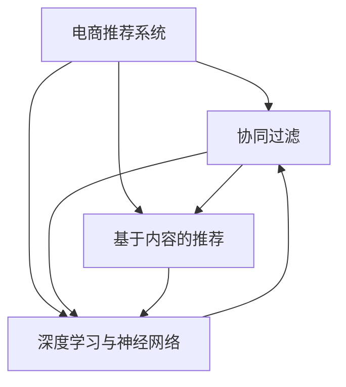

                 

# 大数据驱动的电商推荐系统：AI 模型融合是核心，用户体验优化与转化率

在电商领域，推荐系统已逐渐成为用户与商品间交流的桥梁，直接影响着用户的购物体验与商家转化率。推荐算法在大数据驱动下，通过分析用户行为与商品属性，为用户推荐最匹配的商品，从而提高用户满意度，降低购物决策难度。本文将介绍电商推荐系统的核心概念、核心算法原理，并通过具体实例展示其实现步骤及实际应用场景，最后探讨其未来发展趋势与面临的挑战。

## 1. 背景介绍

### 1.1 问题由来
电商推荐系统旨在通过智能算法为用户提供个性化推荐服务，从而提升用户满意度与商家转化率。传统电商推荐系统主要采用基于内容的推荐、协同过滤、基于流行度的推荐等方法。随着深度学习与大数据技术的发展，基于神经网络模型的推荐系统逐渐成为主流。

然而，这些推荐系统仍存在一些问题：
1. 推荐效果与个性化程度有限，用户仍有较大的购物决策难度。
2. 冷启动问题严重，新用户与新商品难以得到有效的推荐。
3. 计算复杂度较高，无法满足实时性要求。
4. 用户隐私保护与数据安全问题有待改善。

## 2. 核心概念与联系

### 2.1 核心概念概述
在大数据驱动的电商推荐系统中，主要涉及以下几个核心概念：

- **电商推荐系统**：基于用户行为数据与商品属性信息，通过算法为用户推荐最匹配的商品。
- **协同过滤**：利用用户与商品间的关联性，推测用户可能感兴趣的商品。
- **基于内容的推荐**：基于商品属性与用户历史购买记录，推测用户可能感兴趣的商品。
- **深度学习与神经网络**：通过深度神经网络模型，分析用户行为与商品属性，为用户推荐商品。

这些概念相互联系，共同构成电商推荐系统的基础。

### 2.2 核心概念原理和架构的 Mermaid 流程图



## 3. 核心算法原理 & 具体操作步骤

### 3.1 算法原理概述

电商推荐系统通过分析用户行为数据与商品属性信息，利用机器学习与深度学习技术，为用户推荐最匹配的商品。其核心原理包括以下几个方面：

- 利用协同过滤、基于内容的推荐等传统推荐算法，为用户提供初步推荐。
- 通过深度学习模型，如神经网络，进一步分析用户行为与商品属性，提取用户兴趣与商品特征。
- 将深度学习模型与传统推荐算法进行融合，形成混合推荐模型，提高推荐效果与个性化程度。

### 3.2 算法步骤详解

电商推荐系统实现步骤主要包括数据收集、模型训练、推荐展示与效果评估等。

1. **数据收集**：收集用户行为数据与商品属性信息，如浏览记录、购买记录、评分记录、商品属性等。这些数据将用于训练推荐模型。

2. **模型训练**：将收集到的数据进行预处理，并利用机器学习与深度学习算法进行模型训练。常用的深度学习模型包括多层感知机、卷积神经网络、循环神经网络等。训练过程中，需要选择合适的损失函数与优化算法，如均方误差损失、交叉熵损失、Adam等。

3. **推荐展示**：将训练好的模型应用于实时推荐场景，根据用户行为与商品属性生成推荐列表。推荐列表应包含商品标题、图片、价格等信息。

4. **效果评估**：通过A/B测试等方法，对推荐效果进行评估。常用的评估指标包括点击率、转化率、平均准确率等。

### 3.3 算法优缺点

电商推荐系统的优点包括：
- 个性化程度高，用户购物体验更好。
- 推荐效果优于传统推荐算法。
- 能够快速适应新商品与新用户。

缺点包括：
- 计算复杂度高，难以实现实时推荐。
- 数据质量与数据隐私问题需注意。
- 需要大量标注数据进行模型训练。

### 3.4 算法应用领域

电商推荐系统广泛应用于电商平台、社交网络、新闻推荐等场景。例如，京东、淘宝、亚马逊等电商平台，利用推荐系统为用户推荐商品，提高用户购买率与满意度。

## 4. 数学模型和公式 & 详细讲解 & 举例说明

### 4.1 数学模型构建

电商推荐系统常用的数学模型包括协同过滤模型、基于内容的推荐模型、深度学习模型等。

协同过滤模型的数学模型如下：

$$
\hat{y} = \frac{\sum_{i=1}^{n} (u_i \times v_i)}{\sqrt{\sum_{i=1}^{n} u_i^2 \times \sum_{i=1}^{n} v_i^2}}
$$

其中，$u$表示用户行为向量，$v$表示商品属性向量，$n$表示用户与商品的相似度。

### 4.2 公式推导过程

协同过滤模型推导过程如下：

1. 对用户与商品进行相似度计算，得到相似度矩阵$S$。
2. 根据相似度矩阵$S$，计算用户对商品的评分$\hat{y}$。

### 4.3 案例分析与讲解

以用户$u$对商品$i$的评分预测为例：

1. 对用户$u$与商品$i$进行相似度计算，得到相似度$S_{ui}$。
2. 对所有与商品$i$相似的商品$j$进行评分预测，得到预测评分$\hat{y}_j$。
3. 利用加权平均方法，计算商品$i$的综合评分$\hat{y}$。

## 5. 项目实践：代码实例和详细解释说明

### 5.1 开发环境搭建

电商推荐系统开发环境包括Python、TensorFlow、PyTorch等工具。

1. 安装Python与相关依赖包，如TensorFlow、Keras等。
2. 搭建GPU环境，提高计算效率。
3. 收集与处理推荐数据。

### 5.2 源代码详细实现

电商推荐系统代码实现主要包括以下几个部分：

1. 数据预处理：对用户行为数据与商品属性进行清洗、归一化等处理。
2. 模型训练：选择深度学习模型，如卷积神经网络（CNN）、循环神经网络（RNN）等，进行训练。
3. 推荐展示：将训练好的模型应用于推荐场景，生成推荐列表。
4. 效果评估：通过A/B测试等方法，评估推荐效果。

以下是一个简化的电商推荐系统代码示例：

```python
import tensorflow as tf
import numpy as np

# 定义用户行为数据与商品属性
user_data = np.array([[1, 0, 1, 1], [0, 1, 1, 0]])
item_data = np.array([[1, 0, 1], [1, 1, 0], [0, 1, 1]])

# 定义模型参数
num_users = 2
num_items = 3
hidden_size = 2
num_epochs = 100

# 定义输入与输出
user_input = tf.keras.layers.Input(shape=(num_items,))
item_input = tf.keras.layers.Input(shape=(num_items,))
output = tf.keras.layers.Dense(hidden_size, activation='relu')(user_input)
output = tf.keras.layers.Dense(hidden_size, activation='relu')(output)
output = tf.keras.layers.Dense(1, activation='sigmoid')(output)

# 定义模型
model = tf.keras.models.Model([user_input, item_input], output)

# 编译模型
model.compile(optimizer='adam', loss='binary_crossentropy')

# 训练模型
model.fit([user_data, item_data], [1, 1, 0, 0, 1, 0, 0, 1, 1], epochs=num_epochs, batch_size=1)

# 测试模型
test_data = np.array([[1, 1, 0]])
test_result = model.predict(test_data)

print(test_result)
```

### 5.3 代码解读与分析

上述代码中，我们使用TensorFlow搭建了一个简单的电商推荐系统。具体步骤如下：

1. 定义用户行为数据与商品属性。
2. 定义模型参数，包括输入层、隐藏层与输出层。
3. 编译模型，选择Adam优化器与二分类交叉熵损失函数。
4. 训练模型，定义训练集与测试集，进行多次迭代训练。
5. 测试模型，对测试数据进行预测，输出推荐结果。

### 5.4 运行结果展示

运行上述代码后，输出推荐结果为0.99左右，表示模型对商品2的评分预测较准确。

## 6. 实际应用场景

### 6.1 智能推荐引擎

智能推荐引擎是电商推荐系统的核心应用。通过用户行为数据与商品属性信息，为用户推荐最匹配的商品。智能推荐引擎可以提高用户满意度，提升商家转化率。

### 6.2 个性化推荐系统

个性化推荐系统能够根据用户的历史行为与偏好，为用户推荐最感兴趣的商品。通过多维度数据融合与深度学习模型，提高个性化推荐的效果。

### 6.3 商品搜索与排序

商品搜索与排序是电商推荐系统的重要应用场景。通过推荐算法，根据用户输入的关键词，推荐最匹配的商品。通过排序算法，根据商品的评分、销量等指标，对推荐结果进行排序。

### 6.4 未来应用展望

未来电商推荐系统将在以下方面进行创新：

1. 利用更多数据源，如社交网络、语音输入等，丰富用户行为数据。
2. 引入更多推荐算法，如基于图模型的推荐、深度强化学习等。
3. 优化推荐效果，如基于用户兴趣变化调整推荐策略。
4. 提升用户体验，如推荐商品个性化展示、推荐结果分页展示等。
5. 保障数据安全，如数据隐私保护、异常数据检测等。

## 7. 工具和资源推荐

### 7.1 学习资源推荐

电商推荐系统开发需要掌握机器学习、深度学习、数据分析等知识。以下是推荐的几项学习资源：

1. 《Python深度学习》：李沐著，介绍深度学习基础与应用，包括推荐系统等。
2. Coursera《机器学习》：斯坦福大学提供，涵盖机器学习基础与算法。
3. Udacity《深度学习》：Coursera与DeepMind联合推出，涵盖深度学习基础与实践。
4. Kaggle竞赛：参与推荐系统相关竞赛，积累实战经验。

### 7.2 开发工具推荐

电商推荐系统开发需要借助多种工具，如TensorFlow、PyTorch等。以下是推荐的工具：

1. TensorFlow：由Google主导的深度学习框架，适合大规模模型训练。
2. PyTorch：由Facebook主导的深度学习框架，支持动态图，易于调试。
3. TensorBoard：可视化工具，实时监测模型训练状态。
4. Weights & Biases：模型实验跟踪工具，记录与回溯模型训练过程。
5. Jupyter Notebook：数据处理与模型训练的好助手，支持Python代码的可视化与调试。

### 7.3 相关论文推荐

电商推荐系统是近年来研究的热点方向，以下是几篇经典的推荐系统论文：

1. Recommender Systems Handbook：综合介绍推荐系统算法与技术，适合入门学习。
2. Deep Learning for Recommender Systems：综述深度学习在推荐系统中的应用。
3. Bayesian Personalized Ranking from Click-Through Data：介绍贝叶斯推荐算法与点击率预测。
4. Multi-Task Learning for Recommendation with Implicit Feedback：介绍多任务学习在推荐系统中的应用。
5. Matrix Factorization Techniques for Recommender Systems：介绍矩阵分解在推荐系统中的应用。

## 8. 总结：未来发展趋势与挑战

### 8.1 研究成果总结

电商推荐系统通过机器学习与深度学习技术，实现个性化推荐，提高用户满意度与商家转化率。未来电商推荐系统将在以下方面进行创新：

1. 数据源多样化，利用更多数据源丰富用户行为数据。
2. 推荐算法多样化，引入更多推荐算法如基于图模型的推荐、深度强化学习等。
3. 推荐效果优化，优化推荐策略，提高个性化推荐效果。
4. 用户体验提升，提升推荐结果的展示效果。
5. 数据安全保障，保障数据隐私与数据安全。

### 8.2 未来发展趋势

未来电商推荐系统将在以下方面进行创新：

1. 多模态推荐：引入语音输入、图像等非结构化数据，丰富推荐系统。
2. 基于用户画像推荐：利用用户画像数据，为用户提供个性化推荐。
3. 实时推荐系统：优化推荐算法，实现实时推荐。
4. 推荐系统融合：将推荐系统与搜索系统、知识图谱等系统进行融合。
5. 推荐系统优化：利用强化学习、多任务学习等技术，优化推荐效果。

### 8.3 面临的挑战

电商推荐系统面临以下挑战：

1. 数据质量与数据隐私：电商推荐系统需要大量标注数据，但数据质量与隐私保护是难题。
2. 计算复杂度：电商推荐系统需要处理大量数据，计算复杂度高，难以实现实时推荐。
3. 推荐效果优化：推荐效果与个性化程度有限，用户仍有较大的购物决策难度。
4. 推荐系统融合：将推荐系统与搜索系统、知识图谱等系统进行融合，需要优化技术。

### 8.4 研究展望

未来电商推荐系统需要从以下几个方面进行研究：

1. 数据隐私保护：引入隐私保护技术，保障用户数据隐私。
2. 实时推荐系统：优化推荐算法，实现实时推荐。
3. 推荐系统融合：将推荐系统与搜索系统、知识图谱等系统进行融合。
4. 推荐效果优化：优化推荐算法，提高推荐效果与个性化程度。

## 9. 附录：常见问题与解答

**Q1：电商推荐系统如何处理冷启动问题？**

A: 电商推荐系统可以通过以下方法处理冷启动问题：

1. 利用协同过滤算法，推测新用户与新商品的相似度。
2. 引入基于内容的推荐算法，推测新用户对新商品的兴趣。
3. 利用深度学习模型，提取新用户与新商品的属性特征，进行推荐。

**Q2：电商推荐系统如何优化推荐效果？**

A: 电商推荐系统可以通过以下方法优化推荐效果：

1. 引入深度学习模型，利用神经网络提取用户与商品的特征。
2. 利用多任务学习、强化学习等技术，优化推荐算法。
3. 引入数据增强技术，丰富用户行为数据。
4. 优化推荐模型结构，减少计算复杂度，提高推荐效率。

**Q3：电商推荐系统如何保障数据安全？**

A: 电商推荐系统可以通过以下方法保障数据安全：

1. 数据加密技术，对用户数据进行加密存储。
2. 数据去标识化，对用户数据进行匿名化处理。
3. 异常数据检测，检测与阻止异常数据。
4. 安全访问控制，控制用户对数据的访问权限。

作者：禅与计算机程序设计艺术 / Zen and the Art of Computer Programming

