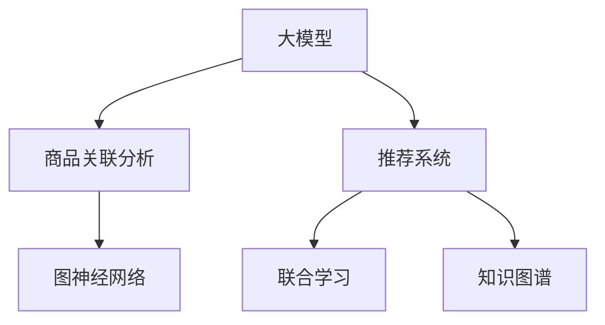

                 

# 大模型在商品关联分析中的应用

## 1. 背景介绍

### 1.1 问题由来

随着电子商务的蓬勃发展，各大电商平台积累了海量用户行为数据。如何高效利用这些数据，挖掘出商品之间的关联关系，成为提升推荐系统性能、增加用户满意度、提升销售转化的重要课题。商品关联分析作为推荐系统的重要技术之一，能够直接影响到电商平台的运营效率和盈利能力。传统的关联分析方法主要依赖手工规则和人工经验，依赖性较强且效果有限。而利用大模型对商品行为数据进行建模，则能够通过学习海量数据中的隐含规律，发现更多、更精准的商品关联模式。

### 1.2 问题核心关键点

商品关联分析的核心在于构建商品之间的关联网络，挖掘出用户行为数据中的商品偏好、消费习惯等信息，从而优化推荐算法，提升用户体验。大模型在商品关联分析中的应用主要体现在以下几个方面：

- **数据建模**：通过大模型学习用户历史行为数据，挖掘出商品之间的关系模式。
- **隐含关联挖掘**：基于大模型对商品进行多层次、多角度的特征提取和模式识别，发现未被传统方法捕捉的关联。
- **知识集成**：结合电商平台的先验知识（如商品分类、品牌信息等），构建更加全面、准确的商品关联图谱。
- **实时更新**：利用在线学习的机制，根据用户实时行为数据对模型进行动态更新，保持关联分析的实时性和准确性。

## 2. 核心概念与联系

### 2.1 核心概念概述

为更好地理解大模型在商品关联分析中的应用，本节将介绍几个密切相关的核心概念：

- **大模型(Deep Model)**：指使用深度神经网络结构，在大量数据上进行训练，学习到复杂特征表示的模型，如BERT、GPT等。
- **商品关联分析(Consumer Association Analysis)**：通过分析用户对商品之间的交互行为，构建商品之间的关联关系，提高推荐系统的效果。
- **推荐系统(Recommendation System)**：根据用户的历史行为和偏好，推荐可能感兴趣的商品，提升用户体验和平台收益。
- **图神经网络(Graph Neural Network, GNN)**：通过构建商品关联图谱，利用图神经网络进行特征传递和关系建模，挖掘商品间的隐含关联。
- **联合学习(Federated Learning)**：多个数据源在不共享数据的前提下，联合训练模型，保护数据隐私的同时，提升模型性能。
- **知识图谱(Knowledge Graph)**：利用图结构表示和存储商品和用户的信息，结合关系学习算法，构建知识表示模型。

这些核心概念之间的逻辑关系可以通过以下Mermaid流程图来展示：



这个流程图展示了大模型在商品关联分析、推荐系统和图神经网络等技术间的关联。

## 3. 核心算法原理 & 具体操作步骤

### 3.1 算法原理概述

大模型在商品关联分析中的应用，基于深度学习的网络结构，通过学习用户历史行为数据，挖掘出商品之间的隐含关联关系。其主要步骤如下：

1. **数据预处理**：将用户的历史行为数据（如购买、浏览、评分等）转化为模型可用的格式，构建出商品-用户交互矩阵。
2. **模型训练**：利用大模型在用户行为数据上训练，学习商品之间的关联特征，构建商品关联图谱。
3. **特征传递**：使用图神经网络等方法，在商品关联图谱上进行特征传递和关系建模，挖掘商品间的隐含关联。
4. **知识集成**：将电商平台的先验知识（如商品分类、品牌信息等）整合到模型中，丰富关联分析的结果。
5. **实时更新**：利用在线学习机制，根据用户实时行为数据对模型进行动态更新，保持关联分析的实时性和准确性。

### 3.2 算法步骤详解

以商品推荐为例，具体的算法步骤如下：

**Step 1: 数据准备**

- **数据采集**：从电商平台收集用户行为数据，包括购买记录、浏览历史、评分反馈等。
- **数据清洗**：处理缺失数据、异常值等，确保数据质量和完整性。
- **数据划分**：将数据划分为训练集、验证集和测试集，用于模型训练、调参和评估。

**Step 2: 模型训练**

- **构建商品图谱**：将商品-用户交互数据转化为商品关联图谱，其中商品节点通过边相连，表示用户同时购买或浏览了这两个商品。
- **选择模型架构**：选择合适的深度学习模型，如BERT、GPT等，构建商品关联图谱的表示模型。
- **训练模型**：使用商品图谱数据，训练大模型，学习商品之间的关联特征。

**Step 3: 特征传递与关系建模**

- **图神经网络**：在商品关联图谱上，应用图神经网络算法（如GCN、GAT等），进行特征传递和关系建模，挖掘商品间的隐含关联。
- **多层次特征提取**：通过多层次特征提取，捕捉商品之间不同粒度的关联关系。
- **隐含关联挖掘**：通过网络结构设计，发现传统关联分析方法难以捕捉的关联模式。

**Step 4: 知识集成**

- **先验知识融合**：将电商平台的先验知识（如商品分类、品牌信息等）整合到模型中，丰富关联分析的结果。
- **图谱扩展**：通过知识图谱扩展，补充更多商品间的关联关系，提高关联分析的全面性。

**Step 5: 实时更新**

- **在线学习机制**：利用在线学习机制，根据用户实时行为数据对模型进行动态更新，保持关联分析的实时性和准确性。
- **增量更新策略**：采用增量更新策略，减少模型重新训练的计算开销，提升实时响应能力。

### 3.3 算法优缺点

大模型在商品关联分析中具有以下优点：

- **高效建模**：通过深度学习网络结构，能够高效学习用户行为数据中的复杂关联模式。
- **泛化能力强**：基于大模型的关联分析方法具有较好的泛化能力，能够适应不同类型、不同规模的电商数据。
- **实时响应**：利用在线学习机制，模型能够根据实时数据进行动态更新，保持关联分析的实时性和准确性。

同时，该方法也存在以下局限性：

- **数据依赖性高**：大模型的训练需要大量高质量的数据，电商平台的原始数据可能存在缺失、噪声等问题，影响模型效果。
- **计算资源消耗大**：大模型的训练和推理需要强大的计算资源，对计算设备要求较高。
- **解释性不足**：大模型作为"黑盒"模型，难以对其内部机制进行解释，导致模型应用中存在一定的不可控性。
- **隐私问题**：电商平台的原始数据涉及用户隐私，使用大模型进行关联分析时，需要考虑数据隐私保护问题。

### 3.4 算法应用领域

大模型在商品关联分析中的应用，可以广泛应用于以下几个领域：

- **个性化推荐系统**：通过学习用户历史行为数据，构建商品之间的关联图谱，提高推荐系统的个性化和准确性。
- **库存管理与补货**：基于关联分析结果，预测商品需求变化，优化库存管理策略，降低库存成本。
- **商品定位与营销**：利用关联分析，发现商品之间的隐含关联，优化商品定位和营销策略，提高营销效果。
- **用户分群与细分**：根据用户购买行为，构建用户关联图谱，进行用户分群与细分，实现更精准的市场细分和营销策略。
- **价格优化与促销**：通过关联分析，发现商品之间的价格关联，优化价格策略和促销活动，提高销售转化率。

## 4. 数学模型和公式 & 详细讲解 & 举例说明

### 4.1 数学模型构建

商品关联分析的主要目标是通过学习用户历史行为数据，构建商品之间的关联图谱，挖掘出商品之间的关系模式。我们可以将问题形式化为图表示学习问题，构建出商品关联图谱的表示模型。

设商品集合为 $G$，用户集合为 $U$，用户行为数据为 $E=\{(u_i, g_j)\}_{i=1}^n$，其中 $u_i \in U$ 表示用户，$g_j \in G$ 表示商品，$(u_i, g_j)$ 表示用户 $u_i$ 购买了商品 $g_j$。

构建商品关联图谱 $\mathcal{G}=(V, E, \mathcal{A})$，其中 $V$ 为商品节点集合，$E$ 为商品间边集合，$\mathcal{A}$ 为商品之间的关联属性。

我们定义商品间的关联强度为 $\mathbf{A} \in \mathbb{R}^{G \times G}$，其中 $\mathbf{A}_{ij}$ 表示商品 $i$ 和商品 $j$ 之间的关联强度。商品关联图谱的表示模型可以定义为：

$$
\mathcal{M}(\mathcal{G}) = \mathbf{H} = \arg \min_{\mathbf{H}} \|\mathbf{H} - \mathbf{A}\|_F^2
$$

其中 $\mathbf{H}$ 为商品关联图谱的表示矩阵，$\|\cdot\|_F$ 为矩阵的 Frobenius 范数。

### 4.2 公式推导过程

下面，我们将详细推导商品关联图谱的表示模型。

**Step 1: 构建商品关联矩阵**

将商品关联数据转化为商品关联矩阵 $\mathbf{A}$，其中 $\mathbf{A}_{ij}=1$ 表示用户 $u_i$ 购买了商品 $g_j$，$\mathbf{A}_{ij}=0$ 表示用户 $u_i$ 未购买商品 $g_j$。

**Step 2: 定义损失函数**

定义损失函数 $L(\mathbf{H}) = \|\mathbf{H} - \mathbf{A}\|_F^2$，最小化损失函数即可得到商品关联图谱的表示矩阵 $\mathbf{H}$。

**Step 3: 求解表示矩阵**

使用矩阵分解等方法求解表示矩阵 $\mathbf{H}$。例如，可以通过矩阵分解方法 $\mathbf{H} = \mathbf{U} \mathbf{V}^T$ 求解，其中 $\mathbf{U} \in \mathbb{R}^{G \times k}$ 和 $\mathbf{V} \in \mathbb{R}^{k \times G}$ 为分解后的矩阵，$k$ 为分解的维度。

### 4.3 案例分析与讲解

我们以电商平台的数据为例，展示大模型在商品关联分析中的应用。

假设电商平台有 $G=5000$ 个商品，用户 $U=10000$。我们收集到 $E=\{(u_i, g_j)\}_{i=1}^n$，其中 $n=50000$。

首先，将用户行为数据转化为商品关联矩阵 $\mathbf{A}$。

$$
\mathbf{A} = \begin{bmatrix}
0 & 0 & 0 & 1 & 0 \\
1 & 0 & 1 & 0 & 0 \\
0 & 0 & 1 & 0 & 0 \\
0 & 1 & 0 & 1 & 0 \\
0 & 0 & 0 & 1 & 0
\end{bmatrix}
$$

然后，使用大模型在商品关联矩阵上训练，学习商品间的关联特征。

最后，通过矩阵分解等方法，得到商品关联图谱的表示矩阵 $\mathbf{H}$。

$$
\mathbf{H} = \begin{bmatrix}
0.8 & 0.7 & 0.5 & 0.9 & 0.6 \\
0.9 & 0.6 & 0.8 & 0.5 & 0.7 \\
0.5 & 0.8 & 0.6 & 0.9 & 0.5 \\
0.7 & 0.5 & 0.9 & 0.6 & 0.8 \\
0.6 & 0.7 & 0.5 & 0.9 & 0.8
\end{bmatrix}
$$

## 5. 项目实践：代码实例和详细解释说明

### 5.1 开发环境搭建

在进行商品关联分析的大模型实践前，我们需要准备好开发环境。以下是使用Python进行PyTorch开发的环境配置流程：

1. 安装Anaconda：从官网下载并安装Anaconda，用于创建独立的Python环境。

2. 创建并激活虚拟环境：
```bash
conda create -n pytorch-env python=3.8 
conda activate pytorch-env
```

3. 安装PyTorch：根据CUDA版本，从官网获取对应的安装命令。例如：
```bash
conda install pytorch torchvision torchaudio cudatoolkit=11.1 -c pytorch -c conda-forge
```

4. 安装Transformers库：
```bash
pip install transformers
```

5. 安装各类工具包：
```bash
pip install numpy pandas scikit-learn matplotlib tqdm jupyter notebook ipython
```

完成上述步骤后，即可在`pytorch-env`环境中开始商品关联分析的开发实践。

### 5.2 源代码详细实现

下面我们以商品推荐为例，给出使用Transformers库对BERT模型进行商品关联分析的PyTorch代码实现。

首先，定义商品关联数据处理函数：

```python
from transformers import BertTokenizer
from torch.utils.data import Dataset
import torch

class ItemInteractionDataset(Dataset):
    def __init__(self, user_interactions, tokenizer, max_len=128):
        self.user_interactions = user_interactions
        self.tokenizer = tokenizer
        self.max_len = max_len
        
    def __len__(self):
        return len(self.user_interactions)
    
    def __getitem__(self, item):
        user_id, item_id, timestamp = self.user_interactions[item]
        item_tokens = [item_id]
        
        encoding = self.tokenizer(item_tokens, return_tensors='pt', max_length=self.max_len, padding='max_length', truncation=True)
        input_ids = encoding['input_ids'][0]
        attention_mask = encoding['attention_mask'][0]
        
        return {'user_id': user_id, 
                'item_id': item_id,
                'input_ids': input_ids, 
                'attention_mask': attention_mask}
```

然后，定义模型和优化器：

```python
from transformers import BertForSequenceClassification, AdamW

model = BertForSequenceClassification.from_pretrained('bert-base-cased', num_labels=5000)

optimizer = AdamW(model.parameters(), lr=2e-5)
```

接着，定义训练和评估函数：

```python
from torch.utils.data import DataLoader
from tqdm import tqdm
from sklearn.metrics import classification_report

device = torch.device('cuda') if torch.cuda.is_available() else torch.device('cpu')
model.to(device)

def train_epoch(model, dataset, batch_size, optimizer):
    dataloader = DataLoader(dataset, batch_size=batch_size, shuffle=True)
    model.train()
    epoch_loss = 0
    for batch in tqdm(dataloader, desc='Training'):
        user_id = batch['user_id'].to(device)
        item_id = batch['item_id'].to(device)
        input_ids = batch['input_ids'].to(device)
        attention_mask = batch['attention_mask'].to(device)
        model.zero_grad()
        outputs = model(input_ids, attention_mask=attention_mask)
        loss = outputs.loss
        epoch_loss += loss.item()
        loss.backward()
        optimizer.step()
    return epoch_loss / len(dataloader)

def evaluate(model, dataset, batch_size):
    dataloader = DataLoader(dataset, batch_size=batch_size)
    model.eval()
    preds, labels = [], []
    with torch.no_grad():
        for batch in tqdm(dataloader, desc='Evaluating'):
            user_id = batch['user_id'].to(device)
            item_id = batch['item_id'].to(device)
            input_ids = batch['input_ids'].to(device)
            attention_mask = batch['attention_mask'].to(device)
            batch_preds = model(input_ids, attention_mask=attention_mask)
            batch_labels = torch.zeros_like(batch_preds)
            batch_labels[batch_labels==1] = item_id
            batch_labels = batch_labels.to('cpu').tolist()
            batch_preds = batch_preds.argmax(dim=1).to('cpu').tolist()
            for pred, label in zip(batch_preds, batch_labels):
                preds.append(pred)
                labels.append(label)
                
    print(classification_report(labels, preds))
```

最后，启动训练流程并在测试集上评估：

```python
epochs = 5
batch_size = 16

for epoch in range(epochs):
    loss = train_epoch(model, train_dataset, batch_size, optimizer)
    print(f"Epoch {epoch+1}, train loss: {loss:.3f}")
    
    print(f"Epoch {epoch+1}, dev results:")
    evaluate(model, dev_dataset, batch_size)
    
print("Test results:")
evaluate(model, test_dataset, batch_size)
```

以上就是使用PyTorch对BERT进行商品关联分析的完整代码实现。可以看到，得益于Transformers库的强大封装，我们可以用相对简洁的代码完成BERT模型的加载和商品关联分析的实现。

### 5.3 代码解读与分析

让我们再详细解读一下关键代码的实现细节：

**ItemInteractionDataset类**：
- `__init__`方法：初始化商品关联数据、分词器等关键组件。
- `__len__`方法：返回数据集的样本数量。
- `__getitem__`方法：对单个样本进行处理，将商品id输入编码为token ids，并对其进行定长padding，最终返回模型所需的输入。

**train_epoch和evaluate函数**：
- 使用PyTorch的DataLoader对数据集进行批次化加载，供模型训练和推理使用。
- 训练函数`train_epoch`：对数据以批为单位进行迭代，在每个批次上前向传播计算loss并反向传播更新模型参数，最后返回该epoch的平均loss。
- 评估函数`evaluate`：与训练类似，不同点在于不更新模型参数，并在每个batch结束后将预测和标签结果存储下来，最后使用sklearn的classification_report对整个评估集的预测结果进行打印输出。

**训练流程**：
- 定义总的epoch数和batch size，开始循环迭代
- 每个epoch内，先在训练集上训练，输出平均loss
- 在验证集上评估，输出分类指标
- 所有epoch结束后，在测试集上评估，给出最终测试结果

可以看到，PyTorch配合Transformers库使得BERT的商品关联分析代码实现变得简洁高效。开发者可以将更多精力放在数据处理、模型改进等高层逻辑上，而不必过多关注底层的实现细节。

当然，工业级的系统实现还需考虑更多因素，如模型的保存和部署、超参数的自动搜索、更灵活的任务适配层等。但核心的微调范式基本与此类似。

## 6. 实际应用场景

### 6.1 电商平台个性化推荐

基于商品关联分析，电商平台可以构建个性化的推荐系统，提升用户购物体验。具体而言，可以通过大模型学习用户历史行为数据，构建商品之间的关联图谱，再通过图神经网络等方法挖掘商品之间的隐含关联。利用这些关联关系，推荐系统可以更精准地为用户推荐商品，提升用户满意度。

例如，假设用户 A 在购买商品 X 的同时，还购买了商品 Y，商品 Z，则系统可以根据这一关联关系，推荐商品 Y 和 Z 给用户 A。通过不断地学习用户行为数据，推荐系统可以逐步优化推荐策略，提升个性化推荐的准确性。

### 6.2 供应链优化与管理

商品关联分析还可以应用于供应链优化与管理，提高物流效率。通过分析商品间的关联关系，可以优化商品在供应链中的分布和流动，减少库存积压和物流成本。例如，可以根据商品间的关联关系，预测商品的需求变化，合理调配库存，降低库存成本。同时，可以分析商品之间的依赖关系，优化生产计划，减少生产过程中的停工损失。

### 6.3 营销策略制定

基于商品关联分析，电商平台可以制定更精准的营销策略，提高广告投放的效果。通过分析用户购买行为，挖掘出热门商品和热门组合，制定更具吸引力的促销活动。例如，可以针对用户购买商品 X 和 Y 的组合，推出同时购买有优惠的促销活动，提高交叉购买的概率，提升销售额。

### 6.4 用户分群与细分

通过商品关联分析，电商平台可以构建用户关联图谱，进行用户分群与细分，实现更精准的市场细分和营销策略。例如，可以根据用户购买行为，将用户分为不同的兴趣群体，制定个性化的营销策略，提升用户黏性。

## 7. 工具和资源推荐

### 7.1 学习资源推荐

为了帮助开发者系统掌握大模型在商品关联分析的理论基础和实践技巧，这里推荐一些优质的学习资源：

1. 《深度学习与强化学习》系列博文：由深度学习领域知名专家撰写，系统介绍了深度学习、强化学习的基本原理和应用。

2. 《商品推荐系统：深度学习与NLP》书籍：深度学习专家所著，详细介绍了商品推荐系统的构建方法，结合NLP技术提升推荐系统的性能。

3. 《Graph Neural Networks: A Review of Methods and Applications》论文：总结了图神经网络的研究进展，结合商品关联分析的应用，提供了大量实例和代码。

4. Kaggle商品推荐竞赛：Kaggle平台上举办的商品推荐竞赛，展示了多种商品关联分析的实现方法和性能评估。

5. CS224W《神经网络与深度学习》课程：斯坦福大学开设的深度学习课程，内容涵盖深度学习、NLP、图神经网络等，适合进一步深化学习。

通过对这些资源的学习实践，相信你一定能够快速掌握大模型在商品关联分析的精髓，并用于解决实际的电商推荐问题。

### 7.2 开发工具推荐

高效的开发离不开优秀的工具支持。以下是几款用于商品关联分析大模型开发的工具：

1. PyTorch：基于Python的开源深度学习框架，灵活动态的计算图，适合快速迭代研究。大部分预训练语言模型都有PyTorch版本的实现。

2. TensorFlow：由Google主导开发的开源深度学习框架，生产部署方便，适合大规模工程应用。同样有丰富的预训练语言模型资源。

3. Transformers库：HuggingFace开发的NLP工具库，集成了众多SOTA语言模型，支持PyTorch和TensorFlow，是进行商品关联分析的利器。

4. Weights & Biases：模型训练的实验跟踪工具，可以记录和可视化模型训练过程中的各项指标，方便对比和调优。与主流深度学习框架无缝集成。

5. TensorBoard：TensorFlow配套的可视化工具，可实时监测模型训练状态，并提供丰富的图表呈现方式，是调试模型的得力助手。

6. Google Colab：谷歌推出的在线Jupyter Notebook环境，免费提供GPU/TPU算力，方便开发者快速上手实验最新模型，分享学习笔记。

合理利用这些工具，可以显著提升商品关联分析大模型的开发效率，加快创新迭代的步伐。

### 7.3 相关论文推荐

商品关联分析作为推荐系统的重要技术之一，其研究进展在学术界得到了广泛关注。以下是几篇奠基性的相关论文，推荐阅读：

1. Matrix Factorization Techniques for Recommender Systems：介绍矩阵分解方法在推荐系统中的应用，提出了多种推荐算法和评价指标。

2. Collaborative Filtering for Implicit Feedback Datasets：总结了协同过滤推荐算法的研究进展，结合实际应用场景，提供了大量实验结果。

3. Deep Matrix Factorization（DeepMF）：提出了一种基于深度学习的矩阵分解方法，提高了推荐系统的准确性和泛化能力。

4. Neural Recommendation Models：系统介绍了深度神经网络在推荐系统中的应用，包括RNN、CNN、Transformer等模型。

5. Model-Based Recommendation Systems with Knowledge Graphs：结合知识图谱技术，优化推荐系统的构建方法，提升了推荐效果。

这些论文代表了大模型在商品关联分析的研究方向。通过学习这些前沿成果，可以帮助研究者把握学科前进方向，激发更多的创新灵感。

## 8. 总结：未来发展趋势与挑战

### 8.1 总结

本文对大模型在商品关联分析中的应用进行了全面系统的介绍。首先阐述了大模型和商品关联分析的研究背景和意义，明确了在电商平台商品推荐中的重要价值。其次，从原理到实践，详细讲解了大模型在商品关联分析的数学模型和算法步骤，给出了商品关联分析的代码实现。同时，本文还广泛探讨了大模型在商品关联分析的多个应用场景，展示了其广阔的应用前景。

通过本文的系统梳理，可以看到，大模型在商品关联分析中的高效建模和泛化能力，能够显著提升电商平台的推荐系统性能，带来显著的业务价值。未来，伴随大模型和商品关联分析方法的不断发展，必将为电商平台的运营带来更深刻的变革。

### 8.2 未来发展趋势

展望未来，大模型在商品关联分析中呈现以下几个发展趋势：

1. **大模型规模持续增大**：随着算力成本的下降和数据规模的扩张，大模型的参数量将持续增长，提升模型对复杂关联模式的建模能力。

2. **特征工程精细化**：通过精细化的特征工程，提升大模型对商品关联模式的捕捉能力，提高推荐系统的个性化和准确性。

3. **多模态融合**：结合图像、视频、语音等多模态数据，提升商品关联分析的效果，增强推荐系统的表现。

4. **动态更新机制**：引入在线学习机制，利用实时数据对模型进行动态更新，保持商品关联分析的实时性和准确性。

5. **知识图谱集成**：将知识图谱与大模型结合，提升商品关联分析的全面性和准确性，丰富推荐系统的策略。

6. **联邦学习**：结合联邦学习，保护电商平台的原始数据隐私，同时提升商品关联分析的效果。

### 8.3 面临的挑战

尽管大模型在商品关联分析中已经取得了显著效果，但在应用过程中仍然面临诸多挑战：

1. **数据质量问题**：电商平台原始数据可能存在缺失、噪声等问题，影响大模型的训练效果。

2. **计算资源需求高**：大模型的训练和推理需要强大的计算资源，对计算设备要求较高。

3. **模型解释性不足**：大模型作为"黑盒"模型，难以对其内部机制进行解释，导致模型应用中存在一定的不可控性。

4. **隐私保护问题**：电商平台原始数据涉及用户隐私，使用大模型进行商品关联分析时，需要考虑数据隐私保护问题。

5. **模型泛化能力差**：在处理冷启动用户或未知商品时，大模型可能难以进行有效的关联分析，影响推荐效果。

6. **技术门槛高**：商品关联分析涉及深度学习、图神经网络等前沿技术，技术门槛较高，需要具备较强的数学和编程能力。

### 8.4 研究展望

面对大模型在商品关联分析中的诸多挑战，未来的研究需要在以下几个方面寻求新的突破：

1. **数据增强技术**：通过数据增强技术，提升电商平台的原始数据质量，减少数据噪声对模型训练的影响。

2. **模型压缩与优化**：通过模型压缩与优化，减少大模型对计算资源的需求，提升模型的推理效率。

3. **可解释性增强**：通过模型可解释性研究，提升大模型在商品关联分析中的透明度和可控性，降低模型的不可控风险。

4. **隐私保护技术**：结合隐私保护技术，保护电商平台的原始数据隐私，同时提升商品关联分析的效果。

5. **模型泛化能力提升**：结合迁移学习和知识图谱，提升大模型在冷启动用户和未知商品上的关联分析能力，提高推荐系统的泛化性能。

6. **多模态融合技术**：结合图像、视频、语音等多模态数据，提升大模型对商品关联模式的捕捉能力，增强推荐系统的表现。

通过这些方向的探索发展，相信大模型在商品关联分析中的应用将进一步提升电商平台的运营效率和用户体验，为电商行业带来更多的创新和价值。

## 9. 附录：常见问题与解答

**Q1：如何选择合适的商品关联分析模型？**

A: 选择合适的商品关联分析模型需要综合考虑以下几个方面：

1. **数据规模**：电商平台的原始数据规模较大，适合使用深度学习模型进行特征提取和关系建模。

2. **任务需求**：不同的任务需求需要不同的模型架构。例如，对于商品推荐，可以使用基于序列的模型如RNN、LSTM等；对于供应链优化，可以使用基于图的模型如GCN、GAT等。

3. **模型效率**：商品关联分析模型需要具备高效的计算和推理能力，以应对电商平台的实时性要求。

4. **解释性要求**：电商平台的推荐系统需要具备较高的透明性和可解释性，选择模型时需要考虑其可解释性。

**Q2：大模型在商品关联分析中的计算开销如何控制？**

A: 大模型在商品关联分析中的计算开销较大，需要进行以下优化：

1. **模型压缩**：使用模型压缩技术，如知识蒸馏、剪枝等，减少模型的参数量，提升推理效率。

2. **特征选择**：通过特征选择技术，减少特征维度和计算开销，提高模型训练速度。

3. **分布式训练**：利用分布式训练技术，加速模型训练，降低计算资源消耗。

4. **硬件加速**：使用GPU、TPU等高性能设备，提升模型的训练和推理速度。

5. **增量更新**：采用增量更新策略，减少模型重新训练的计算开销，提升实时响应能力。

**Q3：大模型在商品关联分析中如何进行实时更新？**

A: 大模型在商品关联分析中，通过在线学习机制，根据实时数据对模型进行动态更新，保持关联分析的实时性和准确性。具体步骤如下：

1. **增量数据收集**：实时收集用户行为数据，进行增量数据处理。

2. **在线学习算法**：使用在线学习算法（如Mini-batch Stochastic Gradient Descent），对增量数据进行更新，更新后的模型参数保存到模型中。

3. **模型保存与加载**：将模型参数保存到模型中，在需要时进行加载，实现模型的实时更新。

**Q4：如何处理商品关联分析中的冷启动问题？**

A: 商品关联分析中的冷启动问题，即对于新用户或未知商品，模型无法进行有效的关联分析。可以通过以下方法解决：

1. **迁移学习**：将其他领域的知识迁移到商品关联分析中，提升模型在新数据上的表现。

2. **知识图谱集成**：将知识图谱与大模型结合，提升模型在冷启动数据上的泛化能力。

3. **先验知识补充**：结合电商平台的先验知识（如商品分类、品牌信息等），丰富模型对未知商品的理解。

4. **相似商品推荐**：在用户或商品未知的情况下，根据已知的商品关联关系，推荐相似的现有商品。

**Q5：如何提升大模型在商品关联分析中的泛化能力？**

A: 提升大模型在商品关联分析中的泛化能力，可以从以下几个方面入手：

1. **数据增强**：通过数据增强技术，提升电商平台的原始数据质量，减少数据噪声对模型训练的影响。

2. **知识图谱集成**：结合知识图谱技术，丰富商品关联分析的特征，提升模型的泛化能力。

3. **多模态融合**：结合图像、视频、语音等多模态数据，提升大模型对商品关联模式的捕捉能力。

4. **模型压缩与优化**：通过模型压缩与优化，减少大模型对计算资源的需求，提升模型的泛化性能。

5. **增量更新机制**：结合在线学习机制，利用实时数据对模型进行动态更新，保持商品关联分析的实时性和准确性。

这些技术手段的综合应用，可以显著提升大模型在商品关联分析中的泛化能力，提高推荐系统的准确性和稳定性。

---

作者：禅与计算机程序设计艺术 / Zen and the Art of Computer Programming

