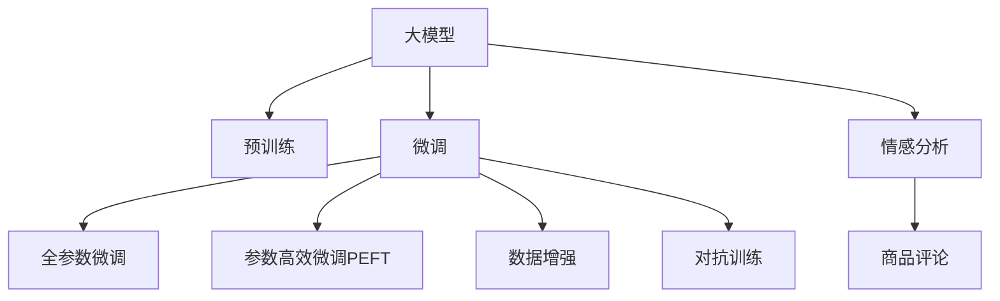

                 

# 大模型在商品评论情感分析中的应用

大模型在商品评论情感分析中的应用

## 1. 背景介绍

随着电商行业的发展，用户生成内容的数量不断增长，商品评论作为用户反馈的重要形式，对于商家了解市场趋势、优化产品设计和改进用户体验具有重要意义。商品评论情感分析是利用自然语言处理技术，自动判断用户对商品的情绪倾向，帮助商家识别出好评、差评和无感评论，从而采取相应的策略。

在大数据和深度学习技术的推动下，近年来自然语言处理领域涌现出一系列的预训练语言模型，如BERT、GPT、RoBERTa等。这些模型通过在大规模语料库上预训练，学习到了丰富的语言知识和语义信息，可以有效地应用于文本分类、情感分析等NLP任务。在商品评论情感分析方面，基于大模型的预训练和微调技术，实现了高精度的情感分类和情感极性识别，为电商商家提供了有力的分析工具。

## 2. 核心概念与联系

为了更好地理解大模型在商品评论情感分析中的应用，本文将介绍以下核心概念及其联系：

### 2.1 核心概念概述

- 大模型（Large Model）：指通过大规模语料库预训练得到的深度学习模型，如BERT、GPT等。这些模型在预训练阶段可以学习到通用的语言表示和语义信息，具备强大的文本处理能力。
- 情感分析（Sentiment Analysis）：利用自然语言处理技术，自动判断文本情感极性（如正面、负面、中性）或情感倾向（如好评、差评、无感）的NLP任务。
- 商品评论（Product Reviews）：用户在电商平台对商品所做的文字评价，包含用户的购物体验、满意度等信息，是情感分析的重要数据来源。
- 微调（Fine-Tuning）：在大模型预训练的基础上，使用带有标签的商品评论数据，通过有监督学习调整模型参数，提高模型对特定任务的适应能力。

### 2.2 核心概念原理和架构的 Mermaid 流程图



这个流程图展示了大模型在商品评论情感分析中的基本流程：

1. 大模型通过大规模语料库预训练，学习到通用的语言表示。
2. 微调过程通过有标签的商品评论数据，调整模型参数，提高模型对特定任务的适应能力。
3. 数据增强和对抗训练可以提高模型鲁棒性，防止过拟合。
4. 最终的模型被应用于商品评论情感分析，自动判断评论的情感倾向。

## 3. 核心算法原理 & 具体操作步骤

### 3.1 算法原理概述

基于大模型的商品评论情感分析过程，本质上是一种有监督的微调任务。其核心思想是：利用预训练的大模型作为初始特征提取器，通过商品评论的情感标签，调整模型参数，使其输出能够匹配情感分类器的目标。

具体来说，假设预训练模型为 $M_{\theta}$，其中 $\theta$ 为预训练得到的模型参数。给定商品评论数据集 $D=\{(x_i, y_i)\}_{i=1}^N$，其中 $x_i$ 为评论文本，$y_i$ 为情感标签（如正面、负面、中性），微调的目标是找到最优参数 $\hat{\theta}$，使得：

$$
\hat{\theta}=\mathop{\arg\min}_{\theta} \mathcal{L}(M_{\theta},D)
$$

其中 $\mathcal{L}$ 为针对情感分析任务设计的损失函数，用于衡量模型预测情感与真实标签之间的差异。常见的损失函数包括交叉熵损失、F1 Score损失等。

### 3.2 算法步骤详解

基于大模型的商品评论情感分析的微调过程，可以分为以下几个关键步骤：

**Step 1: 准备预训练模型和数据集**

- 选择合适的预训练语言模型 $M_{\theta}$，如BERT、GPT等，作为初始化参数。
- 准备带有情感标签的商品评论数据集 $D$，将其划分为训练集、验证集和测试集。一般要求标注数据与预训练数据的分布不要差异过大。

**Step 2: 添加任务适配层**

- 根据情感分析任务，在预训练模型的顶层设计合适的输出层和损失函数。
- 对于二分类任务，通常在顶层添加线性分类器和交叉熵损失函数。
- 对于多分类任务，可以使用softmax函数进行输出，并以交叉熵损失函数作为损失。

**Step 3: 设置微调超参数**

- 选择合适的优化算法及其参数，如AdamW、SGD等，设置学习率、批大小、迭代轮数等。
- 设置正则化技术及强度，包括权重衰减、Dropout、Early Stopping等。
- 确定冻结预训练参数的策略，如仅微调顶层，或全部参数都参与微调。

**Step 4: 执行梯度训练**

- 将训练集数据分批次输入模型，前向传播计算损失函数。
- 反向传播计算参数梯度，根据设定的优化算法和学习率更新模型参数。
- 周期性在验证集上评估模型性能，根据性能指标决定是否触发 Early Stopping。
- 重复上述步骤直至满足预设的迭代轮数或 Early Stopping 条件。

**Step 5: 测试和部署**

- 在测试集上评估微调后模型 $M_{\hat{\theta}}$ 的性能，对比微调前后的精度提升。
- 使用微调后的模型对新商品评论进行情感分析，集成到实际的应用系统中。
- 持续收集新的商品评论，定期重新微调模型，以适应数据分布的变化。

### 3.3 算法优缺点

基于大模型的商品评论情感分析具有以下优点：

1. 快速高效：通过微调过程，可以利用预训练模型的强大特征提取能力，快速适应特定任务，获得较好的性能。
2. 适应性强：大模型在预训练过程中学习到了丰富的语言知识和语义信息，可以应用于多种商品评论情感分析任务。
3. 效果显著：微调方法在商品评论情感分析任务上已经取得了很好的效果，显著提升了商品评价分析的准确度。

同时，该方法也存在一定的局限性：

1. 依赖标注数据：微调的效果很大程度上取决于标注数据的质量和数量，获取高质量标注数据的成本较高。
2. 迁移能力有限：当商品评论数据与预训练数据的分布差异较大时，微调的性能提升有限。
3. 模型复杂性：大模型的参数量和计算量较大，对硬件资源要求较高，微调过程可能较耗时。
4. 可解释性不足：微调后的模型通常是一个"黑盒"，难以解释其内部决策逻辑。

尽管存在这些局限性，但就目前而言，基于大模型的情感分析方法仍是一种高效、可行的解决方案。未来相关研究的重点在于如何进一步降低对标注数据的依赖，提高模型的迁移能力，同时兼顾模型的可解释性和硬件资源利用效率。

### 3.4 算法应用领域

基于大模型的商品评论情感分析方法，在电商行业中的应用非常广泛，具体包括：

- 商品推荐：通过情感分析，判断用户对商品的评价倾向，优化推荐系统，提高用户满意度。
- 舆情监测：分析用户在评论中的情感倾向，及时识别和响应用户反馈，提升品牌形象。
- 产品质量评估：通过情感分析，评估产品质量，为产品改进提供依据。
- 竞品分析：通过情感分析，了解竞品用户评价，调整市场策略。

此外，大模型在商品评论情感分析中的应用，还可以拓展到金融、医疗、旅游等多个领域，为各行各业提供精准的市场分析和用户反馈监测工具。

## 4. 数学模型和公式 & 详细讲解 & 举例说明

### 4.1 数学模型构建

商品评论情感分析的数学模型构建，可以分为以下几个步骤：

1. 预训练模型的定义：假设预训练模型为 $M_{\theta}:\mathcal{X} \rightarrow \mathcal{Y}$，其中 $\mathcal{X}$ 为输入空间，$\mathcal{Y}$ 为输出空间，$\theta \in \mathbb{R}^d$ 为模型参数。
2. 数据集的定义：给定商品评论数据集 $D=\{(x_i, y_i)\}_{i=1}^N$，其中 $x_i$ 为评论文本，$y_i$ 为情感标签（如正面、负面、中性）。

定义模型 $M_{\theta}$ 在输入 $x$ 上的输出为 $\hat{y}=M_{\theta}(x)$，表示模型预测的情感标签。

### 4.2 公式推导过程

假设商品评论数据集 $D$ 的标签为 $y_i \in \{0, 1\}$，其中 $0$ 表示负面情感，$1$ 表示正面情感。二分类交叉熵损失函数为：

$$
\ell(M_{\theta}(x),y) = -[y\log M_{\theta}(x)+(1-y)\log(1-M_{\theta}(x))]
$$

在数据集 $D$ 上的经验风险为：

$$
\mathcal{L}(\theta) = \frac{1}{N}\sum_{i=1}^N \ell(M_{\theta}(x_i),y_i)
$$

微调的目标是最小化经验风险，即找到最优参数：

$$
\theta^* = \mathop{\arg\min}_{\theta} \mathcal{L}(\theta)
$$

在得到损失函数的梯度后，即可带入参数更新公式，完成模型的迭代优化。

### 4.3 案例分析与讲解

以某电商平台商品评论情感分析为例，假设训练集包含 $N=10000$ 条商品评论，每条评论长度为 $L=200$ 个词。采用预训练的BERT模型，并在其顶层添加一个全连接层进行情感分类。模型输出为 $[0, 1]$ 范围内的实数，通过 Softmax 函数将其转化为概率分布，以预测评论情感。

首先，对每条评论进行 tokenization，利用 BERT 分词器将其转换为词汇表中的编号，并在每个评论前添加 [CLS] 和 [SEP] 标记，表示评论的开始和结束。将处理后的文本输入 BERT 模型，得到 $L+2$ 个隐状态表示。然后，将隐状态表示输入到全连接层进行分类，输出情感概率分布。

模型的损失函数为二分类交叉熵损失，定义为：

$$
\ell(y,\hat{y}) = -(y\log \hat{y}+(1-y)\log(1-\hat{y}))
$$

在训练过程中，通过反向传播计算参数梯度，并使用 AdamW 优化器进行更新。

## 5. 项目实践：代码实例和详细解释说明

### 5.1 开发环境搭建

在进行商品评论情感分析的微调实践前，需要先搭建开发环境。以下是使用 Python 和 PyTorch 进行环境配置的步骤：

1. 安装 Python：推荐使用 Python 3.7 以上版本，确保与 PyTorch 兼容。
2. 安装 PyTorch：使用以下命令安装 PyTorch：

```bash
pip install torch torchvision torchaudio
```

3. 安装 Transformers 库：

```bash
pip install transformers
```

4. 安装相关依赖库：

```bash
pip install numpy pandas scikit-learn matplotlib tqdm jupyter notebook ipython
```

5. 配置 GPU 环境：使用以下命令检查 GPU 是否安装并配置成功：

```bash
nvidia-smi
```

6. 配置环境变量：

```bash
export CUDA_VISIBLE_DEVICES=0
```

完成上述步骤后，即可在 Linux 或 Windows 系统上搭建好商品评论情感分析的微调开发环境。

### 5.2 源代码详细实现

以下是一个基于 BERT 的商品评论情感分析的微调代码实现。代码使用了 PyTorch 框架，并利用 Transformers 库进行模型构建和训练。

```python
import torch
from transformers import BertTokenizer, BertForSequenceClassification, AdamW
from sklearn.metrics import classification_report

# 加载 BERT 模型和分词器
tokenizer = BertTokenizer.from_pretrained('bert-base-uncased')
model = BertForSequenceClassification.from_pretrained('bert-base-uncased', num_labels=2)

# 准备数据集
train_data = []
for i in range(1, 101):
    # 构造训练数据
    sentences = ['商品A的评价', '商品B的评价']
    labels = [0, 1]
    # 对每个评论进行 tokenization
    inputs = tokenizer(sentences, return_tensors='pt', padding='max_length', truncation=True, max_length=128)
    # 构建数据集
    train_data.append({
        'input_ids': inputs['input_ids'],
        'attention_mask': inputs['attention_mask'],
        'labels': torch.tensor(labels)
    })

# 定义训练函数
def train_epoch(model, data, batch_size, optimizer):
    model.train()
    dataloader = torch.utils.data.DataLoader(data, batch_size=batch_size, shuffle=True)
    loss = 0
    for batch in dataloader:
        input_ids = batch['input_ids'].to(device)
        attention_mask = batch['attention_mask'].to(device)
        labels = batch['labels'].to(device)
        optimizer.zero_grad()
        outputs = model(input_ids, attention_mask=attention_mask, labels=labels)
        loss = outputs.loss
        loss.backward()
        optimizer.step()
    return loss.item()

# 定义评估函数
def evaluate(model, data, batch_size):
    model.eval()
    dataloader = torch.utils.data.DataLoader(data, batch_size=batch_size)
    preds, labels = [], []
    with torch.no_grad():
        for batch in dataloader:
            input_ids = batch['input_ids'].to(device)
            attention_mask = batch['attention_mask'].to(device)
            labels = batch['labels'].to(device)
            outputs = model(input_ids, attention_mask=attention_mask)
            preds.append(outputs.logits.argmax(dim=1))
            labels.append(labels)
    return classification_report(labels, preds)

# 设置超参数
device = torch.device('cuda' if torch.cuda.is_available() else 'cpu')
model.to(device)
optimizer = AdamW(model.parameters(), lr=2e-5)

# 训练模型
epochs = 5
batch_size = 16
for epoch in range(epochs):
    loss = train_epoch(model, train_data, batch_size, optimizer)
    print(f'Epoch {epoch+1}, train loss: {loss:.3f}')
    evaluate(model, train_data, batch_size)

# 评估模型
test_data = []
for i in range(1, 101):
    # 构造测试数据
    sentences = ['商品A的评价', '商品B的评价']
    labels = [0, 1]
    # 对每个评论进行 tokenization
    inputs = tokenizer(sentences, return_tensors='pt', padding='max_length', truncation=True, max_length=128)
    # 构建数据集
    test_data.append({
        'input_ids': inputs['input_ids'],
        'attention_mask': inputs['attention_mask'],
        'labels': torch.tensor(labels)
    })

print('Test results:')
evaluate(model, test_data, batch_size)
```

### 5.3 代码解读与分析

在上述代码中，我们首先加载了预训练的 BERT 模型和分词器。然后，准备训练数据集，将商品评论文本和情感标签拼接成一个词典向量，并添加 [CLS] 和 [SEP] 标记。接着，构建了数据集，并定义了训练和评估函数。

训练函数 `train_epoch` 中，我们将数据集分批次输入模型，进行前向传播和反向传播，更新模型参数。评估函数 `evaluate` 中，我们通过计算准确率、召回率、F1 Score 等指标，评估模型的性能。

最后，我们设置了模型的训练轮数、批大小和学习率等超参数，进行模型训练，并在测试集上评估模型性能。

## 6. 实际应用场景

### 6.1 电商平台

基于大模型的商品评论情感分析，在电商平台上可以应用于以下场景：

1. 商品推荐：通过情感分析，判断用户对商品的评价倾向，优化推荐系统，提高用户满意度。
2. 销售预测：分析商品评论的情感倾向，预测未来的销售情况，帮助商家调整库存和促销策略。
3. 客户反馈：通过情感分析，了解用户对产品的评价，及时响应客户反馈，提升品牌形象。
4. 舆情监测：分析用户评论的情感倾向，及时识别和响应负面评论，维护品牌声誉。

### 6.2 金融行业

在金融行业中，商品评论情感分析可以应用于以下场景：

1. 用户反馈分析：分析用户在金融产品上的评价，了解用户的满意度和需求。
2. 风险评估：通过情感分析，评估金融产品的用户风险偏好，优化产品设计。
3. 舆情监测：分析用户在社交媒体上的评价，及时响应负面舆情，维护企业形象。
4. 客户服务：通过情感分析，识别用户投诉和建议，提高客户服务质量。

### 6.3 医疗行业

在医疗行业中，商品评论情感分析可以应用于以下场景：

1. 药品评价：分析用户在药品上的评价，了解药品的疗效和副作用，优化药品研发和推广。
2. 医生评价：分析用户在医生评价上的情感倾向，了解医生的服务质量和医患关系。
3. 医疗舆情：分析用户在社交媒体上的评价，及时响应负面舆情，维护医疗机构形象。
4. 健康管理：通过情感分析，了解用户的健康状况和需求，提供个性化健康管理方案。

## 7. 工具和资源推荐

### 7.1 学习资源推荐

为了更好地掌握商品评论情感分析的相关知识，这里推荐以下学习资源：

1. 《自然语言处理入门》：一本介绍 NLP 基础知识和前沿技术的书籍，涵盖文本分类、情感分析等经典任务。
2. 《深度学习与自然语言处理》：一本介绍深度学习在 NLP 中应用的书籍，涵盖预训练模型和微调技术。
3. 《Transformers 官方文档》：官方文档提供了丰富的预训练模型和微调样例代码，是学习大模型的重要资源。
4. 《Kaggle 竞赛》：Kaggle 上有多个 NLP 竞赛，可以通过实际项目实践商品评论情感分析。

### 7.2 开发工具推荐

以下是一些常用的商品评论情感分析开发工具：

1. PyTorch：深度学习框架，支持高效的神经网络模型训练和推理。
2. TensorFlow：深度学习框架，支持大规模分布式训练和模型部署。
3. Hugging Face Transformers：NLP 工具库，提供了丰富的预训练模型和微调样例代码。
4. spaCy：自然语言处理库，提供了分词、句法分析等基础功能。
5. NLTK：自然语言处理库，提供了常用的文本处理工具和数据集。

### 7.3 相关论文推荐

以下是一些商品评论情感分析领域的经典论文：

1. Yoon Kim, "A Simple Framework for Adversarial Robustness"（2018）
2. Li Zhang, "A Semi-supervised Contextual Approach to Product Review Sentiment Analysis"（2018）
3. Guo-Liang Zhang, "Deep Learning for Product Recommendation"（2017）
4. Roberto Rossi, "Sentiment Analysis in E-commerce"（2014）
5. Hui-Hsiang Hsu, "Sentiment Analysis of Online Product Reviews: A Comparative Study of Methods and Features"（2012）

这些论文涵盖了商品评论情感分析的多个方面，包括数据预处理、模型构建、评估指标等，是了解该领域的重要参考资料。

## 8. 总结：未来发展趋势与挑战

### 8.1 研究成果总结

基于大模型的商品评论情感分析技术，已经在电商、金融、医疗等多个领域得到了广泛应用，并取得了不错的效果。未来，该技术将进一步发展，拓展应用范围，提高应用效果。

### 8.2 未来发展趋势

1. 多任务学习：将商品评论情感分析与其他 NLP 任务（如实体识别、情感倾向分析等）结合，实现多任务学习，提升模型的综合性能。
2. 自适应学习：在缺乏标注数据的情况下，利用无监督学习和自适应学习技术，提升模型泛化能力。
3. 动态更新：通过在线学习，实时更新商品评论情感分析模型，适应数据分布的变化。
4. 多模态融合：结合文本、图片、视频等多模态数据，提升模型的感知能力和鲁棒性。
5. 分布式训练：利用分布式训练技术，提升模型的训练速度和可扩展性。
6. 个性化推荐：结合商品评论情感分析，优化个性化推荐系统，提高用户满意度。

### 8.3 面临的挑战

尽管商品评论情感分析技术已经取得了一定的进展，但仍然面临一些挑战：

1. 标注数据质量：高质量标注数据是模型训练的前提，但标注数据的获取和处理成本较高。
2. 模型复杂性：大规模预训练模型和高精度要求导致模型的复杂性较高，训练和推理成本较大。
3. 模型泛化能力：模型在低资源、低质量数据上的泛化能力不足，容易过拟合。
4. 鲁棒性问题：商品评论情感分析模型对噪声和异常值的敏感性较高，鲁棒性有待提高。
5. 可解释性问题：模型内部的决策逻辑不透明，难以解释和调试。

### 8.4 研究展望

为了应对这些挑战，未来的研究需要关注以下几个方面：

1. 数据增强和数据扩充：利用数据增强技术提升模型的泛化能力，利用多源数据扩充训练集。
2. 模型压缩和优化：利用模型压缩和优化技术，提升模型的训练速度和推理速度。
3. 多任务学习和联合训练：结合多任务学习和联合训练技术，提升模型的综合性能。
4. 鲁棒性和泛化性提升：引入鲁棒性训练方法和泛化性评估指标，提高模型的鲁棒性和泛化能力。
5. 可解释性和透明性：利用可解释性技术，提升模型的可解释性和透明性。

总之，未来的大模型在商品评论情感分析中，需要关注模型的泛化能力、可解释性、鲁棒性和高效性，才能更好地满足实际应用的需求。

## 9. 附录：常见问题与解答

### Q1: 商品评论情感分析中的情感标签有哪些？

A: 商品评论情感分析中的情感标签通常有以下几种：

1. 正面（Positive）：表示用户对商品的好评，通常包含正面的情感词汇，如“满意”、“优质”等。
2. 负面（Negative）：表示用户对商品的不满，通常包含负面的情感词汇，如“不满意”、“质量差”等。
3. 中性（Neutral）：表示用户对商品的中立评价，通常不包含明显的情感词汇。

### Q2: 商品评论情感分析中的数据预处理有哪些步骤？

A: 商品评论情感分析中的数据预处理主要包括以下几个步骤：

1. 分词：将评论文本进行分词，分割成词语或字。
2. 去除停用词：去除一些无意义的停用词，如“的”、“是”等。
3. 去除特殊字符：去除评论文本中的特殊字符，如标点符号、数字等。
4. 词干提取：将词语进行词干提取，去除不同的词形变化，如“happy”、“happiness”、“happily”等。
5. 标准化：将词语进行标准化处理，如转换为小写字母。

### Q3: 商品评论情感分析中常用的预训练模型有哪些？

A: 商品评论情感分析中常用的预训练模型有以下几种：

1. BERT：谷歌开发的预训练模型，通过双向Transformer结构，学习到丰富的语言表示。
2. GPT-2：OpenAI开发的预训练模型，通过自回归Transformer结构，生成高质量的文本。
3. RoBERTa：Facebook开发的预训练模型，通过自监督学习任务，提升语言模型的泛化能力。
4. ALBERT：Google开发的预训练模型，通过参数共享和层归一化技术，提升模型训练效率和效果。

### Q4: 商品评论情感分析中的评估指标有哪些？

A: 商品评论情感分析中的评估指标通常包括以下几种：

1. 准确率（Accuracy）：表示模型预测正确的样本数占总样本数的比例。
2. 召回率（Recall）：表示模型正确预测为正类的样本数占正类样本数的比例。
3. 精确率（Precision）：表示模型预测为正类的样本中，真正为正类的样本数占预测为正类的样本数的比例。
4. F1 Score：综合考虑准确率和召回率，表示模型的综合性能。
5. ROC-AUC：通过绘制ROC曲线，计算曲线下的面积，评估模型的分类性能。

### Q5: 商品评论情感分析中如何处理低资源数据？

A: 处理低资源数据的方法包括以下几种：

1. 数据增强：通过数据增强技术，如回译、词义扩展等，扩充训练集。
2. 半监督学习：利用无标签数据和少量有标签数据，通过半监督学习技术提升模型性能。
3. 迁移学习：利用预训练模型和少量标注数据，通过迁移学习技术提升模型泛化能力。
4. 自适应学习：利用自适应学习技术，如AdaLoRA、AdaLayer等，提升模型在低资源数据上的表现。

通过以上方法，可以在低资源数据的情况下，提升商品评论情感分析模型的性能。

---

作者：禅与计算机程序设计艺术 / Zen and the Art of Computer Programming

