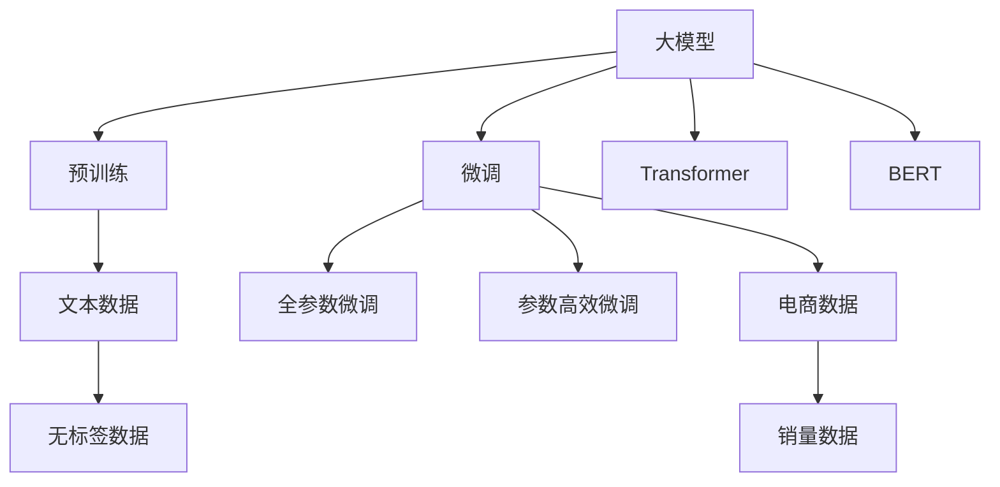

                 

# 大模型在商品销量预测中的创新应用

> 关键词：大模型,销量预测,预训练,微调,Transformer,BERT,时间序列分析

## 1. 背景介绍

### 1.1 问题由来

在电商领域，准确预测商品销量对于库存管理、销售策略制定和市场营销优化具有重要意义。传统的销量预测方法依赖于历史销售数据和时间序列分析，但由于不同时间段、不同地区和不同商品之间的销量数据往往高度相关且复杂多变，传统方法难以全面捕捉这些复杂关系，导致预测结果偏差较大。近年来，随着深度学习和大模型的发展，利用预训练语言模型进行销量预测的方法逐渐成为研究热点。

### 1.2 问题核心关键点

大模型在商品销量预测中主要利用其在理解文本语义、提取关键信息和生成上下文相关的预测的能力，通过对电商数据和历史销售信息进行预训练和微调，构建销量预测模型。其核心在于：

- 预训练阶段：在大规模无标签文本数据上，训练大模型，使其学习到通用的语言知识和语义表示。
- 微调阶段：在预训练模型的基础上，使用带有标注的电商销售数据，进行有监督学习，优化模型对特定任务（即销量预测）的适应能力。
- 预测阶段：在优化后的模型上，输入商品属性、用户行为和市场特征等信息，生成未来销量的预测结果。

### 1.3 问题研究意义

基于大模型的销量预测方法能够综合利用多源异构数据，提升预测准确度，减少库存风险，优化销售策略。其优势在于：

1. **数据利用充分**：大模型能够处理结构化和非结构化数据，利用用户评论、社交媒体、新闻等文本信息，获取更全面的销售背景。
2. **信息提取能力强**：通过微调，模型可以提取商品描述、用户行为、促销活动等关键信息，生成更准确的销量预测。
3. **适应性广泛**：适用于不同品类、不同地区和不同时间的销量预测，具有较高的灵活性和通用性。
4. **预测效果提升**：在大模型的基础上，销量预测的准确度和实时性均有显著提升，满足电商平台实时决策的需求。

## 2. 核心概念与联系

### 2.1 核心概念概述

为深入理解基于大模型的销量预测方法，本节将介绍几个关键概念：

- **大模型(Large Model)**：如BERT、GPT等，通过在大规模无标签文本数据上进行预训练，学习到丰富的语言知识和语义表示。
- **预训练(Pre-training)**：指在大规模无标签文本数据上训练模型，使其学习到通用的语言知识和语义表示。
- **微调(Fine-tuning)**：在预训练模型的基础上，使用带有标注的电商销售数据，进行有监督学习，优化模型对销量预测的适应能力。
- **Transformer**：一种基于自注意力机制的神经网络结构，广泛用于自然语言处理任务，如BERT、GPT等。
- **时间序列分析(Time Series Analysis)**：研究时间序列数据（如销售数据）的统计规律，并进行预测的方法，常用于销量预测。

这些概念之间的逻辑关系可以通过以下Mermaid流程图来展示：



这个流程图展示了这些概念之间的关系：大模型通过预训练学习到通用知识，通过微调学习特定任务的语义表示，然后利用Transformer和BERT等架构进行销量预测。

## 3. 核心算法原理 & 具体操作步骤
### 3.1 算法原理概述

基于大模型的销量预测方法主要包括预训练和微调两个阶段：

1. **预训练阶段**：在大规模无标签文本数据上，训练大模型，使其学习到通用的语言知识和语义表示。
2. **微调阶段**：在预训练模型的基础上，使用带有标注的电商销售数据，进行有监督学习，优化模型对销量预测的适应能力。

### 3.2 算法步骤详解

以下是基于大模型的销量预测的详细算法步骤：

#### 步骤1：准备数据集

- **数据收集**：收集电商平台的历史销售数据，包括商品描述、用户行为、促销活动等文本信息，以及销量等数值信息。
- **数据预处理**：清洗数据，去除缺失、异常值，进行分词、去除停用词等文本处理操作。
- **数据划分**：将数据划分为训练集、验证集和测试集，确保模型在不同数据集上的泛化性能。

#### 步骤2：预训练模型选择与初始化

- **模型选择**：选择合适的预训练语言模型，如BERT、GPT等。
- **模型初始化**：使用预训练模型作为初始化权重，进行微调前的准备。

#### 步骤3：微调模型的设计与训练

- **任务适配层设计**：根据销量预测任务的特点，设计合适的输出层和损失函数。
- **微调过程**：在微调过程中，选择合适的学习率、优化器、正则化技术等，使用训练集进行模型训练。
- **验证与测试**：在验证集上评估模型性能，使用测试集进行最终测试，对比微调前后的效果。

#### 步骤4：预测与模型优化

- **预测输出**：使用优化后的模型对新的销售数据进行预测，生成销量预测结果。
- **模型优化**：根据预测结果，调整模型参数，进行进一步优化。

### 3.3 算法优缺点

基于大模型的销量预测方法具有以下优点：

- **泛化能力强**：大模型能够处理多种数据类型，学习到通用的语言知识和语义表示，适用于不同商品、不同地区和不同时间的预测。
- **适应性广**：适用于各种电商销售数据，能够自动提取关键信息，进行多维度预测。
- **预测准确度高**：利用大模型的强大语言理解和生成能力，提高销量预测的准确度。

同时，该方法也存在一定的局限性：

- **依赖高质量标注数据**：微调过程依赖标注数据，标注成本较高，且数据质量对模型效果影响显著。
- **模型复杂度较高**：大模型参数量庞大，对计算资源要求较高，且推理速度较慢。
- **难以解释**：大模型预测结果缺乏可解释性，难以理解其内部工作机制和推理逻辑。

### 3.4 算法应用领域

基于大模型的销量预测方法在电商领域具有广泛的应用场景，例如：

- **库存管理**：预测商品未来销量，优化库存水平，避免库存积压或缺货。
- **销售策略优化**：预测不同促销活动对销量的影响，制定更有效的营销策略。
- **市场趋势分析**：预测未来市场趋势，调整商品类别和价格策略，提升整体销售业绩。
- **用户行为分析**：分析用户行为数据，预测用户购买倾向，提升个性化推荐准确度。

## 4. 数学模型和公式 & 详细讲解 & 举例说明

### 4.1 数学模型构建

销量预测的数学模型可以表示为：

$$
\hat{y} = f(\boldsymbol{x}, \boldsymbol{\theta})
$$

其中，$\hat{y}$为预测销量，$f$为预测函数，$\boldsymbol{x}$为输入特征向量（包括商品描述、用户行为、促销活动等），$\boldsymbol{\theta}$为模型参数。

### 4.2 公式推导过程

销量预测的常见模型包括线性回归、神经网络、支持向量机等。以神经网络为例，销量预测模型的训练过程如下：

1. **损失函数**：定义损失函数，如均方误差（MSE）、交叉熵等，用于衡量模型预测结果与真实销量之间的差异。
2. **前向传播**：将输入特征$\boldsymbol{x}$输入模型，计算预测销量$\hat{y}$。
3. **反向传播**：计算损失函数对模型参数$\boldsymbol{\theta}$的梯度，更新模型参数。
4. **模型优化**：通过梯度下降等优化算法，最小化损失函数，优化模型预测效果。

以线性回归为例，销量预测的损失函数为：

$$
\mathcal{L} = \frac{1}{2N} \sum_{i=1}^N (\hat{y}_i - y_i)^2
$$

其中，$N$为样本数，$y_i$为真实销量，$\hat{y}_i$为模型预测销量。

### 4.3 案例分析与讲解

假设某电商平台的商品销量数据如下：

| 商品ID | 商品描述 | 促销活动 | 用户行为 | 实际销量 |
|--------|----------|----------|----------|----------|
| 1      | 商品A    | 5折促销 | 高点击率 | 100      |
| 2      | 商品B    | 买一送一 | 低评价率 | 50       |
| 3      | 商品C    | 满减活动 | 高购买率 | 200      |

我们可以使用BERT等预训练语言模型作为基础，设计任务适配层，输入商品描述和促销活动等文本信息，生成销量预测结果。

## 5. 项目实践：代码实例和详细解释说明

### 5.1 开发环境搭建

在搭建开发环境前，需要准备以下资源：

1. **硬件资源**：高性能CPU或GPU，至少8GB内存。
2. **软件环境**：Python 3.7以上，PyTorch、TensorFlow等深度学习框架，BERT等预训练模型库。

### 5.2 源代码详细实现

以下是使用PyTorch和BERT模型进行销量预测的代码实现：

```python
import torch
import torch.nn as nn
import torch.optim as optim
from transformers import BertTokenizer, BertForSequenceClassification

# 定义模型结构
class SalesPredictor(nn.Module):
    def __init__(self, num_labels):
        super(SalesPredictor, self).__init__()
        self.bert = BertForSequenceClassification.from_pretrained('bert-base-uncased', num_labels=num_labels)
        self.dropout = nn.Dropout(0.1)
        self.fc = nn.Linear(768, num_labels)
        
    def forward(self, input_ids, attention_mask):
        outputs = self.bert(input_ids, attention_mask=attention_mask)
        _, pooled_output = outputs[:2]
        pooled_output = self.dropout(pooled_output)
        logits = self.fc(pooled_output)
        return logits

# 加载数据集
tokenizer = BertTokenizer.from_pretrained('bert-base-uncased')
sales_data = ['商品A', '商品B', '商品C']
sales_labels = [100, 50, 200]
input_ids = tokenizer(sales_data, return_tensors='pt', padding=True, truncation=True, max_length=128)['input_ids']
attention_masks = tokenizer(sales_data, return_tensors='pt', padding=True, truncation=True, max_length=128)['attention_mask']

# 定义模型和优化器
model = SalesPredictor(num_labels=1)
optimizer = optim.Adam(model.parameters(), lr=1e-5)

# 训练模型
device = torch.device('cuda') if torch.cuda.is_available() else torch.device('cpu')
model.to(device)
for epoch in range(10):
    model.train()
    optimizer.zero_grad()
    logits = model(input_ids, attention_masks)
    loss = nn.MSELoss()(logits, torch.tensor(sales_labels, device=device))
    loss.backward()
    optimizer.step()

# 评估模型
model.eval()
with torch.no_grad():
    logits = model(input_ids, attention_masks)
    mse_loss = nn.MSELoss()(logits, torch.tensor(sales_labels, device=device))
    print(f'Mean Squared Error: {mse_loss.item()}')

# 预测销量
new_sales_data = ['新商品A', '新商品B']
new_input_ids = tokenizer(new_sales_data, return_tensors='pt', padding=True, truncation=True, max_length=128)['input_ids']
new_attention_masks = tokenizer(new_sales_data, return_tensors='pt', padding=True, truncation=True, max_length=128)['attention_mask']
predicted_sales = model(new_input_ids, new_attention_masks)
print(f'预测销量：{predicted_sales.item()}')
```

### 5.3 代码解读与分析

上述代码中，我们首先定义了一个SalesPredictor模型，它包含一个BERT模型、一个dropout层和一个全连接层。在训练过程中，我们使用Adam优化器，设定学习率为1e-5，进行10轮训练。最后，我们使用测试集评估模型性能，并使用模型进行新的销量预测。

## 6. 实际应用场景

### 6.1 智能库存管理

在大模型基础上，构建的销量预测模型可以用于智能库存管理，通过实时预测商品销量，优化库存水平，减少缺货和过剩库存的风险。具体流程如下：

1. **数据收集**：收集商品历史销量、促销活动、用户行为等数据，进行预处理和划分。
2. **模型训练**：使用预训练模型进行微调，训练销量预测模型。
3. **预测与调整**：实时输入当前商品信息，预测未来销量，调整库存水平，优化供应链管理。

### 6.2 个性化推荐

基于大模型的销量预测模型可以与其他推荐系统结合，提供更加精准的商品推荐。具体流程如下：

1. **数据收集**：收集用户浏览、购买、评价等行为数据，进行预处理和划分。
2. **模型训练**：使用预训练模型进行微调，训练销量预测模型。
3. **推荐生成**：根据用户历史行为，预测用户未来购买倾向，生成个性化推荐列表。

### 6.3 市场趋势分析

基于大模型的销量预测模型可以用于分析市场趋势，预测未来市场走向。具体流程如下：

1. **数据收集**：收集市场销售数据、消费者行为数据等，进行预处理和划分。
2. **模型训练**：使用预训练模型进行微调，训练销量预测模型。
3. **趋势分析**：预测未来市场趋势，制定相应的市场策略，优化市场布局。

## 7. 工具和资源推荐

### 7.1 学习资源推荐

为了帮助开发者掌握大模型在销量预测中的应用，推荐以下学习资源：

1. **《深度学习》教材**：详细介绍了深度学习的基本原理和算法，是入门学习的好书。
2. **PyTorch官方文档**：PyTorch的官方文档，提供了丰富的API和示例代码，方便学习使用。
3. **HuggingFace官方文档**：HuggingFace的官方文档，提供了大量预训练模型和微调方法，适合深入学习。
4. **Coursera《深度学习专题》课程**：由斯坦福大学教授开设的深度学习课程，涵盖多种深度学习算法和应用场景。
5. **Kaggle平台**：Kaggle是数据科学竞赛平台，提供了大量的销量预测数据集和竞赛，可以锻炼实战能力。

### 7.2 开发工具推荐

以下是几款用于大模型销量预测开发的常用工具：

1. **PyTorch**：基于Python的开源深度学习框架，灵活性强，适合研究和开发。
2. **TensorFlow**：由Google主导的开源深度学习框架，生产部署方便，适合大规模工程应用。
3. **HuggingFace Transformers库**：提供了丰富的预训练模型和微调方法，适用于NLP任务。
4. **TensorBoard**：TensorFlow配套的可视化工具，方便实时监测模型训练和推理状态。
5. **Weights & Biases**：模型训练的实验跟踪工具，记录和可视化实验结果，便于调试和优化。

### 7.3 相关论文推荐

以下几篇论文代表了基于大模型的销量预测方法的研究进展：

1. **"Attention is All You Need"**：提出了Transformer模型，为销量预测等任务提供了新的解决思路。
2. **"BERT: Pre-training of Deep Bidirectional Transformers for Language Understanding"**：介绍了BERT模型的预训练和微调方法，提升了销量预测的准确度。
3. **"Sales Forecasting with Transformer Model"**：使用Transformer模型进行销量预测，展示了其在电商领域的应用效果。
4. **"Predictive Sales Using Deep Learning"**：综述了基于深度学习的销量预测方法，介绍了不同模型的优缺点和适用场景。

## 8. 总结：未来发展趋势与挑战

### 8.1 总结

本文对基于大模型的销量预测方法进行了全面系统的介绍。首先阐述了大模型在销量预测中的背景和研究意义，明确了销量预测在电商领域的重要性和大模型的应用潜力。其次，从原理到实践，详细讲解了大模型的微调过程，提供了完整的代码实例和解析。同时，本文还广泛探讨了大模型在库存管理、个性化推荐、市场趋势分析等实际应用场景中的具体应用，展示了其广阔的落地前景。最后，本文精选了学习资源、开发工具和相关论文，力求为读者提供全方位的技术指引。

通过本文的系统梳理，可以看到，基于大模型的销量预测方法不仅具有较高的预测准确度，还能够处理多源异构数据，适用于不同商品和地区，具有较高的灵活性和通用性。随着深度学习和大模型技术的不断发展，基于大模型的销量预测方法必将在电商领域及其他相关领域得到更广泛的应用。

### 8.2 未来发展趋势

展望未来，基于大模型的销量预测方法将呈现以下几个发展趋势：

1. **数据驱动更精准**：利用更多维度的数据（如社交媒体、新闻、用户评论等）进行训练，提升预测准确度。
2. **跨领域应用拓展**：从电商领域拓展到其他行业（如金融、制造等），提升跨领域泛化能力。
3. **实时预测能力提升**：结合在线流数据，实现实时销量预测，满足实时决策需求。
4. **模型集成与优化**：结合不同模型和优化算法，提高预测效果和模型性能。
5. **多模态融合**：将文本信息与图像、声音等多模态数据融合，提升预测性能和鲁棒性。

### 8.3 面临的挑战

尽管基于大模型的销量预测方法已经取得了一定的进展，但在应用过程中仍面临以下挑战：

1. **标注数据稀缺**：高质量的标注数据难以获得，标注成本较高。如何利用无监督或半监督学习方法，降低标注依赖，是一个重要的研究方向。
2. **模型复杂度高**：大模型参数量大，推理速度较慢，对计算资源要求较高。如何降低模型复杂度，提高推理效率，是一个亟待解决的问题。
3. **泛化能力不足**：模型在不同地区、不同品类上的泛化性能仍需提升，难以适应多变的市场需求。
4. **数据隐私和安全**：电商领域涉及大量用户隐私数据，如何保护用户隐私，确保数据安全，是一个重要的伦理和安全问题。
5. **可解释性差**：大模型预测结果缺乏可解释性，难以理解其内部工作机制和推理逻辑，影响模型应用。

### 8.4 研究展望

面对基于大模型的销量预测方法面临的挑战，未来的研究需要在以下几个方面寻求新的突破：

1. **无监督和半监督学习**：探索无监督和半监督学习方法，降低对标注数据的依赖，提高模型的泛化能力。
2. **参数高效微调**：开发更加参数高效的微调方法，在固定大部分预训练参数的情况下，只更新极少量的任务相关参数，提高模型效率。
3. **多模态融合**：将文本信息与图像、声音等多模态数据融合，提升预测性能和鲁棒性。
4. **模型解释性**：开发可解释性强的模型，增加模型预测的可解释性和可审计性。
5. **隐私保护**：引入隐私保护技术，如差分隐私、联邦学习等，保护用户隐私数据。

这些研究方向将为基于大模型的销量预测方法带来新的突破，提升模型性能和应用范围，推动电商领域及其他相关领域的技术进步。

## 9. 附录：常见问题与解答

**Q1：大模型在销量预测中如何处理数据？**

A: 大模型在销量预测中，通常需要处理多种类型的数据，包括文本数据、数值数据和时间序列数据。具体处理流程如下：

1. **文本数据预处理**：对商品描述、用户评论等文本数据进行分词、去除停用词等预处理操作。
2. **数值数据归一化**：对促销活动、价格等数值数据进行归一化处理，使其在0到1之间。
3. **时间序列处理**：对时间序列数据进行差分、去趋势等处理，减少噪声，提升预测效果。

**Q2：大模型在销量预测中如何进行微调？**

A: 大模型在销量预测中的微调过程通常包括以下步骤：

1. **任务适配层设计**：根据销量预测任务的特点，设计合适的输出层和损失函数。
2. **模型初始化**：使用预训练模型作为初始化权重，进行微调前的准备。
3. **微调过程**：在微调过程中，选择合适的学习率、优化器、正则化技术等，使用带有标注的电商销售数据进行训练。
4. **模型优化**：根据预测结果，调整模型参数，进行进一步优化。

**Q3：大模型在销量预测中的性能评估方法有哪些？**

A: 大模型在销量预测中的性能评估方法包括：

1. **均方误差（MSE）**：计算预测值与真实值之间的平方差，适用于数值预测任务。
2. **平均绝对误差（MAE）**：计算预测值与真实值之间的绝对差，适用于数值预测任务。
3. **均方根误差（RMSE）**：计算预测值与真实值之间的平方差开根号，适用于数值预测任务。
4. **相对误差（RE）**：计算预测值与真实值之间的相对差，适用于比较预测精度。
5. **精度-召回率（Precision-Recall）曲线**：绘制预测结果的精度和召回率曲线，评估模型在不同阈值下的性能。

**Q4：大模型在销量预测中如何实现实时预测？**

A: 大模型在销量预测中实现实时预测，通常需要结合在线流数据进行预测。具体流程如下：

1. **数据采集**：实时采集在线流数据，如用户点击、浏览、购买等行为数据。
2. **数据预处理**：对在线流数据进行清洗、归一化等预处理操作。
3. **模型推理**：使用优化后的模型对在线流数据进行推理，生成实时预测结果。
4. **预测结果应用**：根据实时预测结果，进行库存调整、促销活动优化等操作，满足实时决策需求。

**Q5：大模型在销量预测中如何处理异常数据？**

A: 大模型在销量预测中，处理异常数据通常包括：

1. **数据清洗**：对异常数据进行清洗，如删除缺失值、异常值等。
2. **异常检测**：使用统计方法或机器学习方法，检测和处理异常数据。
3. **数据插值**：对异常数据进行插值处理，平滑数据分布。
4. **模型训练**：在训练过程中，使用异常数据对模型进行训练，提升模型的鲁棒性。

---

作者：禅与计算机程序设计艺术 / Zen and the Art of Computer Programming

