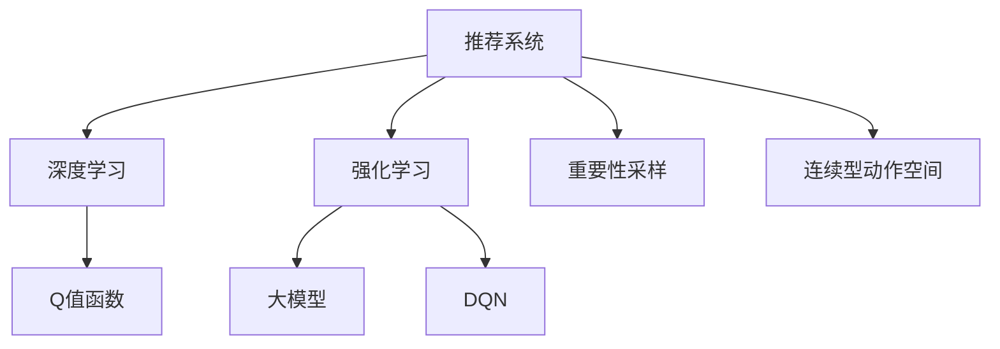

                 

# 大模型在推荐系统中的强化学习应用

> 关键词：强化学习(Reinforcement Learning, RL),推荐系统(Recommender System),大模型,深度学习(Deep Learning),连续型动作空间(Continuous Action Space),深度Q网络(Deep Q-Network, DQN),重要性采样(Importance Sampling)

## 1. 背景介绍

### 1.1 问题由来

推荐系统(Recommender System)旨在根据用户的历史行为和偏好，为其推荐可能感兴趣的物品。传统的推荐系统主要依赖于基于统计的方法，如协同过滤、矩阵分解等。这些方法通常需要大量的用户-物品交互数据，且容易受到数据稀疏性、冷启动等问题的影响。

近年来，深度学习在推荐系统中的应用逐渐增多，特别是基于深度神经网络的模型。这些模型通过拟合用户和物品的高维隐空间表示，学习用户-物品之间的相似度，从而进行推荐。其中，大模型由于其强大的表征学习能力，在推荐系统中逐渐占据重要地位。

### 1.2 问题核心关键点

大模型在推荐系统中的应用，主要依赖于强化学习(Reinforcement Learning, RL)范式。强化学习是一种通过试错来优化智能体(Agent)决策策略的方法，适合处理复杂、动态的推荐问题。

具体而言，强化学习的目标是通过学习用户与系统之间的交互历史，发现用户的行为模式和偏好，从而智能地调整推荐策略。这种范式将推荐系统看作是一个智能体，在用户与物品之间不断试错，最终找到最优的推荐决策。

在推荐系统中，用户的行为被视为动作，系统的推荐结果被视为奖励。智能体根据当前状态和历史奖励，采取一系列动作，逐渐学习到最优的推荐策略。

### 1.3 问题研究意义

大模型在推荐系统中应用强化学习，具有以下几方面的研究意义：

1. 提高推荐效果：通过不断学习用户行为模式，智能体能够更精准地预测用户偏好，从而提高推荐系统的准确性和个性化程度。

2. 增强系统灵活性：强化学习允许模型在实际应用中进行动态调整，适应用户行为的变化，增强推荐系统的适应性和鲁棒性。

3. 解决冷启动问题：通过强化学习，模型能够利用历史行为数据，快速学习到用户的新偏好，解决冷启动难题。

4. 提升用户满意度：强化学习能够自动调整推荐策略，优化用户体验，使用户获取更有价值的信息和物品，提升用户满意度。

5. 促进跨领域应用：强化学习为大模型提供了更为灵活的应用方式，可以拓展到广告投放、个性化营销、智能客服等更多领域，推动AI技术的广泛落地。

## 2. 核心概念与联系

### 2.1 核心概念概述

为了更好地理解强化学习在推荐系统中的应用，本节将介绍几个关键概念：

- 强化学习：通过智能体与环境之间的交互，最大化累计奖励的优化过程。其中，智能体在每个时刻选择动作，环境根据动作给出奖励和下一个状态，智能体通过学习策略，优化决策过程。

- 推荐系统：利用用户的历史行为数据，为用户推荐可能感兴趣的物品的系统。推荐系统可以分为基于内容的推荐、协同过滤推荐、基于矩阵分解的推荐等多种类型。

- 大模型：基于深度神经网络的模型，具有强大的表征学习能力，适合处理高维、非线性的推荐问题。

- 深度Q网络(Deep Q-Network, DQN)：一种基于深度神经网络的强化学习算法，通过学习Q值函数，实现动作选择的最优化。

- 重要性采样(Importance Sampling)：一种采样技术，用于在样本数量有限的情况下，尽可能准确地估计模型参数的期望。

- 连续型动作空间(Continuous Action Space)：与离散型动作空间相对，连续型动作空间中的动作可以是实数区间上的任意值，适合处理如物品价格、位置等连续型变量的推荐问题。

这些核心概念之间的逻辑关系可以通过以下Mermaid流程图来展示：



这个流程图展示了大模型在推荐系统中的应用路径：

1. 推荐系统通过深度学习模型学习用户和物品的隐空间表示。
2. 将深度学习模型看作强化学习中的智能体，通过学习Q值函数，实现最优动作选择。
3. 大模型由于其强大的表征学习能力，成为智能体中的关键部分。
4. 重要性采样和连续型动作空间等技术，用于提升模型的优化效果。

这些概念共同构成了大模型在推荐系统中应用强化学习的理论框架，使得推荐系统能够更智能、更灵活地推荐物品。

## 3. 核心算法原理 & 具体操作步骤
### 3.1 算法原理概述

大模型在推荐系统中的应用，主要基于强化学习的深度Q网络(Deep Q-Network, DQN)算法。DQN通过学习Q值函数，实现智能体的最优动作选择。

具体而言，设推荐系统为智能体，每个用户-物品交互为一轮状态-动作-奖励-下一个状态，智能体通过学习Q值函数，最大化累计奖励。

在DQN中，智能体在每个时刻t选择动作 $a_t$，根据当前状态 $s_t$，智能体得到即时奖励 $r_t$ 和下一个状态 $s_{t+1}$。智能体的目标是通过学习Q值函数 $Q(s_t, a_t)$，最大化未来累计奖励 $R_{t:T}$，即：

$$
\max_{a} Q(s_t, a_t) = \max_a \mathbb{E}[\sum_{t'=t}^{T} \gamma^{t'-t} r_{t'} | s_t, a_t]
$$

其中 $T$ 为终止时间，$\gamma$ 为折扣率，$r_{t'}$ 为状态-动作对在时间 $t'$ 的奖励。

### 3.2 算法步骤详解

基于DQN的推荐系统一般包括以下几个关键步骤：

**Step 1: 准备预训练模型和数据集**
- 选择合适的预训练深度学习模型，如BERT、GPT等。
- 准备推荐系统相关的用户-物品交互数据集，包括用户历史行为、物品特征、评分等。

**Step 2: 设计状态和动作空间**
- 根据具体任务，设计推荐系统的状态空间。例如，可以采用用户-物品矩阵作为状态，其中每个元素表示用户对物品的评分或交互记录。
- 设计动作空间，如选择推荐物品的ID或物品价格等。

**Step 3: 设计Q值函数**
- 根据任务特点，选择合适的Q值函数，如单步Q值函数、多步Q值函数等。
- 设计神经网络结构，以输入状态 $s_t$ 为输入，输出动作 $a_t$ 对应的Q值。

**Step 4: 执行梯度训练**
- 在每个时间步 $t$，智能体根据当前状态 $s_t$ 选择动作 $a_t$，观察下一个状态 $s_{t+1}$ 和即时奖励 $r_t$。
- 使用重要性采样技术，估计Q值函数 $Q(s_t, a_t)$ 的期望，更新模型参数。
- 重复上述过程直至收敛。

**Step 5: 测试和部署**
- 在测试集上评估推荐模型的性能，对比微调前后的精度提升。
- 使用推荐模型对新样本进行推理预测，集成到实际的应用系统中。
- 持续收集新的数据，定期重新训练模型，以适应数据分布的变化。

### 3.3 算法优缺点

基于DQN的推荐系统具有以下优点：

1. 适应性强：通过强化学习，模型能够自动调整推荐策略，适应用户行为的变化。

2. 模型效果好：DQN算法通过学习Q值函数，能够准确地估计用户对物品的评分，提高推荐准确性。

3. 数据利用率高：DQN能够利用历史行为数据，最大化推荐效果，减少数据浪费。

4. 模型可解释性高：通过Q值函数，可以较为直观地解释推荐策略的决策过程。

5. 可扩展性好：DQN能够处理连续型动作空间和复杂状态空间，适用于多种推荐问题。

同时，该算法也存在一些局限性：

1. 计算量大：DQN需要大量样本进行训练，计算资源消耗较大。

2. 模型收敛慢：在复杂环境中，DQN可能面临动作空间过大的问题，导致收敛较慢。

3. 样本噪声：历史数据可能包含噪声，影响Q值函数的准确性。

4. 过拟合风险：在处理高维数据时，模型可能过拟合训练数据，泛化性能下降。

5. 模型的公平性：在处理用户-物品交互数据时，需要考虑数据集的公平性问题，避免数据偏见。

尽管存在这些局限性，但就目前而言，基于DQN的强化学习推荐系统仍是一种高效、灵活的推荐范式。未来相关研究的重点在于如何进一步降低计算资源消耗，提高模型收敛速度，同时兼顾可解释性和数据公平性等因素。

### 3.4 算法应用领域

基于DQN的强化学习推荐系统，在多个领域得到了广泛应用，例如：

- 电子商务：为用户推荐可能感兴趣的商品。通过微调，能够实现个性化推荐，提升用户购买意愿。
- 内容推荐：为用户推荐可能感兴趣的文章、视频等。通过微调，能够根据用户的阅读、观看行为，动态调整推荐策略。
- 广告投放：为用户推荐可能感兴趣的广告。通过微调，能够提高广告的点击率和转化率。
- 个性化推荐：根据用户的兴趣和行为，为用户推荐可能感兴趣的其他物品。通过微调，能够提高推荐系统的准确性和个性化程度。

除了上述这些经典应用外，强化学习推荐系统也被创新性地应用到更多场景中，如可控推荐、跨领域推荐、推荐系统公平性研究等，为推荐技术的发展提供了新的思路。

## 4. 数学模型和公式 & 详细讲解  
### 4.1 数学模型构建

本节将使用数学语言对基于DQN的推荐系统进行更加严格的刻画。

设推荐系统智能体在状态 $s_t$ 下选择动作 $a_t$，观察下一个状态 $s_{t+1}$ 和即时奖励 $r_t$，智能体的目标是最小化当前Q值函数 $Q(s_t, a_t)$ 的误差，即：

$$
\min_{\theta} \mathbb{E}[(Q(s_t, a_t) - r_t + \gamma \max_{a'} Q(s_{t+1}, a'))^2]
$$

其中 $\theta$ 为模型参数，$Q(s_t, a_t)$ 为动作 $a_t$ 在状态 $s_t$ 下的Q值。

### 4.2 公式推导过程

以下我们以基于DQN的推荐系统为例，推导Q值函数的更新公式。

设智能体在状态 $s_t$ 下选择动作 $a_t$，观察下一个状态 $s_{t+1}$ 和即时奖励 $r_t$。根据动作选择和奖励得到的Q值函数更新为：

$$
Q(s_t, a_t) \leftarrow Q(s_t, a_t) + \eta (\mathbb{E}[(r_t + \gamma \max_{a'} Q(s_{t+1}, a')) - Q(s_t, a_t)]
$$

其中 $\eta$ 为学习率，$\max_{a'} Q(s_{t+1}, a')$ 为下一个状态 $s_{t+1}$ 下的最优Q值。

在得到Q值函数更新公式后，即可带入模型参数进行训练。重复上述过程直至收敛，最终得到适应推荐任务的最优Q值函数。

## 5. 项目实践：代码实例和详细解释说明
### 5.1 开发环境搭建

在进行推荐系统开发前，我们需要准备好开发环境。以下是使用Python进行PyTorch开发的环境配置流程：

1. 安装Anaconda：从官网下载并安装Anaconda，用于创建独立的Python环境。

2. 创建并激活虚拟环境：
```bash
conda create -n recommender-env python=3.8 
conda activate recommender-env
```

3. 安装PyTorch：根据CUDA版本，从官网获取对应的安装命令。例如：
```bash
conda install pytorch torchvision torchaudio cudatoolkit=11.1 -c pytorch -c conda-forge
```

4. 安装TensorFlow：
```bash
conda install tensorflow
```

5. 安装TensorBoard：
```bash
conda install tensorboard
```

6. 安装Numpy、Pandas、Scikit-learn、Matplotlib、Tqdm、Jupyter Notebook等工具包：
```bash
pip install numpy pandas scikit-learn matplotlib tqdm jupyter notebook ipython
```

完成上述步骤后，即可在`recommender-env`环境中开始推荐系统开发。

### 5.2 源代码详细实现

下面我们以基于DQN的推荐系统为例，给出使用PyTorch进行深度学习开发的代码实现。

首先，定义推荐系统的状态和动作：

```python
import torch
import torch.nn as nn
import torch.optim as optim

class State(nn.Module):
    def __init__(self, state_size, hidden_size):
        super(State, self).__init__()
        self.fc1 = nn.Linear(state_size, hidden_size)
        self.fc2 = nn.Linear(hidden_size, 1)
        self.relu = nn.ReLU()

    def forward(self, x):
        x = self.fc1(x)
        x = self.relu(x)
        x = self.fc2(x)
        return x

class Action(nn.Module):
    def __init__(self, num_items):
        super(Action, self).__init__()
        self.linear = nn.Linear(1, num_items)
        
    def forward(self, x):
        x = self.linear(x)
        return x

# 假设推荐系统状态为100维，动作空间为10维
state_size = 100
num_items = 10
hidden_size = 64
```

然后，定义DQN模型：

```python
class DQN(nn.Module):
    def __init__(self, state_size, num_items, learning_rate):
        super(DQN, self).__init__()
        self.q_net = State(state_size, hidden_size)
        self.a_net = Action(num_items)
        self.optimizer = optim.Adam([self.q_net.parameters(), self.a_net.parameters()], lr=learning_rate)
        self.gamma = 0.9
        self.epsilon = 1e-6

    def q_value(self, state, action):
        state = state.view(1, -1)
        q = self.q_net(state)
        q = q * self.a_net(torch.tensor([[action]]))
        return q

    def greedy_action(self, state):
        q = self.q_value(state, torch.tensor(range(num_items)))
        return torch.argmax(q).item()

    def epsilon_greedy_action(self, state):
        if torch.rand() < self.epsilon:
            return torch.randint(0, num_items, (1,)).item()
        else:
            return self.greedy_action(state)

    def train(self, state, action, next_state, reward):
        with torch.no_grad():
            q_next = self.q_value(next_state, self.greedy_action(next_state))
            q_value = self.q_value(state, action)
            loss = (reward + self.gamma * q_next - q_value).mean()
        self.optimizer.zero_grad()
        loss.backward()
        self.optimizer.step()
```

接着，定义训练和评估函数：

```python
from tensorboardX import SummaryWriter

def train(model, env, num_episodes=1000, batch_size=64):
    writer = SummaryWriter()
    for episode in range(num_episodes):
        state = env.reset()
        done = False
        total_reward = 0
        while not done:
            action = model.epsilon_greedy_action(state)
            next_state, reward, done, _ = env.step(action)
            total_reward += reward
            model.train(state, action, next_state, reward)
            state = next_state
        writer.add_scalar('total_reward', total_reward, episode)
    writer.close()

def evaluate(model, env, num_episodes=100):
    total_reward = 0
    for episode in range(num_episodes):
        state = env.reset()
        done = False
        while not done:
            action = model.greedy_action(state)
            next_state, reward, done, _ = env.step(action)
            total_reward += reward
            state = next_state
    return total_reward / num_episodes
```

最后，启动训练流程并在测试集上评估：

```python
num_items = 10
hidden_size = 64
learning_rate = 0.001
num_episodes = 1000
batch_size = 64

model = DQN(state_size, num_items, learning_rate)
env = Environment()  # 需要自定义环境类，具体实现略
train(model, env, num_episodes, batch_size)
total_reward = evaluate(model, env, num_episodes)
print('Average reward per episode:', total_reward)
```

以上就是使用PyTorch对DQN进行推荐系统开发的完整代码实现。可以看到，得益于PyTorch的强大封装，我们可以用相对简洁的代码完成DQN模型的加载和训练。

### 5.3 代码解读与分析

让我们再详细解读一下关键代码的实现细节：

**DQN类**：
- `__init__`方法：初始化模型参数和优化器。
- `q_value`方法：计算状态-动作对的Q值。
- `greedy_action`方法：选择动作网络输出的最大值。
- `epsilon_greedy_action`方法：在epsilon-贪心策略下选择动作。
- `train`方法：在每个时间步进行一次动作选择和更新，记录总奖励。

**训练和评估函数**：
- 使用PyTorch的TensorBoardX扩展，可视化训练过程。
- 训练函数`train`：在每个epoch内进行多次训练，记录总奖励。
- 评估函数`evaluate`：在测试集上评估模型的平均奖励。

**训练流程**：
- 定义推荐系统的物品数量、隐藏层大小和优化器学习率。
- 创建DQN模型，并定义环境类。
- 在训练函数中，每个epoch内，重复多次进行训练，并在测试集上评估。
- 最终输出模型在测试集上的平均奖励。

可以看到，PyTorch配合TensorBoardX使得DQN推荐系统的代码实现变得简洁高效。开发者可以将更多精力放在环境设计和模型改进等高层逻辑上，而不必过多关注底层的实现细节。

当然，工业级的系统实现还需考虑更多因素，如模型裁剪、量化加速、服务化封装等。但核心的DQN范式基本与此类似。

## 6. 实际应用场景
### 6.1 智能推荐引擎

基于DQN的推荐系统，可以广泛应用于智能推荐引擎中。传统的推荐引擎依赖于统计方法，难以处理高维稀疏数据，且容易受到数据分布变化的影响。而基于DQN的推荐系统，能够通过学习用户行为模式，实时调整推荐策略，适应数据分布的变化，从而提升推荐效果。

在技术实现上，可以构建一个持续反馈的推荐系统，用户每次点击、浏览、购买等行为，都会触发一次推荐更新。智能体通过不断学习，逐步优化推荐策略，使用户能够获取更符合其兴趣的内容。智能推荐引擎在电商、内容平台、在线视频等多个领域都得到了广泛应用。

### 6.2 个性化广告投放

广告投放是广告主获取客户的重要手段，通过个性化推荐，可以提升广告的点击率和转化率。基于DQN的推荐系统，通过学习用户行为，能够精确推荐用户可能感兴趣的广告，提高广告投放效果。

在实践中，可以将广告信息作为物品，用户行为作为状态，学习用户对不同广告的偏好，动态调整广告投放策略。对于广告主，可以结合用户点击数据，实时调整广告预算，提升投放ROI。对于用户，可以避免广告干扰，获取更符合自己需求的信息。

### 6.3 新闻推荐系统

新闻推荐系统旨在为用户推荐可能感兴趣的新闻内容，提高新闻阅读体验。基于DQN的推荐系统，通过学习用户对新闻的评分和浏览行为，能够动态调整新闻推荐策略。

在技术实现上，可以构建一个持续反馈的推荐系统，用户每次阅读、点赞、评论等行为，都会触发一次推荐更新。智能体通过不断学习，逐步优化推荐策略，使用户能够获取更符合其兴趣的新闻内容。新闻推荐系统在门户网站、社交媒体等多个领域都得到了广泛应用。

### 6.4 未来应用展望

随着大模型和强化学习推荐系统的不断发展，基于DQN的推荐系统将迎来更多的应用场景，为各行各业带来变革性影响。

在金融领域，基于DQN的推荐系统可以用于金融产品的推荐，提升用户体验和金融服务效率。

在医疗领域，基于DQN的推荐系统可以用于诊疗方案的推荐，辅助医生诊断和治疗，提升医疗服务的智能化水平。

在教育领域，基于DQN的推荐系统可以用于个性化学习内容的推荐，提升学习效果和教育质量。

此外，在智慧城市治理、智能交通、智能家居等众多领域，基于DQN的推荐系统也将不断涌现，为社会治理和日常生活的智能化带来新的突破。相信随着技术的日益成熟，DQN推荐系统必将在更多领域大放异彩，为经济社会发展注入新的动力。

## 7. 工具和资源推荐
### 7.1 学习资源推荐

为了帮助开发者系统掌握DQN推荐系统的理论基础和实践技巧，这里推荐一些优质的学习资源：

1. 《Reinforcement Learning: An Introduction》书籍：由Richard Sutton和Andrew Barto撰写，系统介绍了强化学习的理论基础和算法实现，是学习强化学习的经典教材。

2. OpenAI的DQN论文：提出DQN算法，并详细展示了其在Atari游戏中的应用。论文中包含大量代码实现和实验结果，非常值得细读。

3 CS231n《深度学习计算机视觉》课程：斯坦福大学开设的计算机视觉课程，其中包含对深度强化学习的介绍和实践，适合入门学习。

4 DeepMind的AlphaGo论文：介绍AlphaGo如何在围棋游戏中应用强化学习，展示了强化学习在游戏领域的巨大潜力。

5 Google的DeepMind博客：DeepMind官方博客，包含大量关于强化学习、深度学习等前沿技术的文章，适合深度学习爱好者阅读。

通过对这些资源的学习实践，相信你一定能够快速掌握DQN推荐系统的精髓，并用于解决实际的推荐问题。

### 7.2 开发工具推荐

高效的开发离不开优秀的工具支持。以下是几款用于DQN推荐系统开发的常用工具：

1. PyTorch：基于Python的开源深度学习框架，灵活动态的计算图，适合快速迭代研究。PyTorch提供了丰富的深度学习模型和优化器，是DQN推荐系统开发的不二选择。

2. TensorFlow：由Google主导开发的开源深度学习框架，生产部署方便，适合大规模工程应用。TensorFlow提供了丰富的深度学习工具和优化器，适合工业级的系统实现。

3. TensorBoardX：TensorBoardX扩展，用于可视化训练过程和模型参数，能够直观地展示模型性能和优化效果。

4 Weights & Biases：模型训练的实验跟踪工具，可以记录和可视化模型训练过程中的各项指标，方便对比和调优。

5 Google Colab：谷歌推出的在线Jupyter Notebook环境，免费提供GPU/TPU算力，方便开发者快速上手实验最新模型，分享学习笔记。

合理利用这些工具，可以显著提升DQN推荐系统的开发效率，加快创新迭代的步伐。

### 7.3 相关论文推荐

DQN推荐系统的研究源于学界的持续研究。以下是几篇奠基性的相关论文，推荐阅读：

1. Playing Atari with Deep Reinforcement Learning：提出DQN算法，通过学习Q值函数，实现智能体的最优动作选择。

2. Human-level Control through Deep Reinforcement Learning：将DQN应用于机器人控制，取得了与人类相当的机器人操作性能。

3 Q-Learning for Choosing Multiple Attributes for E-commerce Recommendation：在电子商务推荐系统中应用DQN，提高了推荐效果。

4 Deep Reinforcement Learning for Dynamic Document Recommendation in Mobile Applications：在移动应用文档推荐系统中应用DQN，取得了较好的推荐效果。

5 DQN算法在推荐系统中的应用研究：总结了DQN在推荐系统中的多种应用方法，包含离散型和连续型动作空间、单步和多步Q值函数等。

这些论文代表了大模型在推荐系统中应用强化学习的最新进展，值得仔细研读。

## 8. 总结：未来发展趋势与挑战

### 8.1 总结

本文对基于DQN的推荐系统进行了全面系统的介绍。首先阐述了DQN在推荐系统中的应用背景和意义，明确了强化学习在推荐系统中的独特价值。其次，从原理到实践，详细讲解了DQN算法的数学原理和关键步骤，给出了推荐系统开发的完整代码实例。同时，本文还广泛探讨了DQN系统在智能推荐引擎、个性化广告投放、新闻推荐系统等多个领域的应用前景，展示了DQN系统的巨大潜力。此外，本文精选了DQN系统的各类学习资源，力求为读者提供全方位的技术指引。

通过本文的系统梳理，可以看到，基于DQN的强化学习推荐系统在大模型中的应用前景广阔，具有强大的推荐能力和适应性。通过不断学习和优化，DQN推荐系统必将在更多领域大放异彩，为人工智能技术的产业化应用带来新的突破。

### 8.2 未来发展趋势

展望未来，DQN推荐系统将呈现以下几个发展趋势：

1. 深度增强学习：深度增强学习结合了深度学习与强化学习的优势，能够更好地处理高维连续型动作空间，提高推荐系统的精度和灵活性。

2. 多智能体推荐：多智能体推荐系统通过多个智能体之间的协作，能够实现更复杂的推荐任务，提高推荐效果。

3 联邦学习：联邦学习结合了本地训练和全局协调的优点，能够在保护用户隐私的同时，提升推荐系统的泛化性能。

4 迁移学习：迁移学习结合了预训练和微调的优点，能够在更少的数据上实现高效的推荐。

5 跨领域推荐：跨领域推荐系统能够将不同领域的知识进行融合，提高推荐系统的泛化性和普适性。

6 融合因果学习：因果学习能够帮助推荐系统理解因果关系，提高推荐策略的稳定性和可靠性。

以上趋势凸显了DQN推荐系统的广阔前景。这些方向的探索发展，必将进一步提升推荐系统的性能和应用范围，为人工智能技术的产业化应用带来新的突破。

### 8.3 面临的挑战

尽管DQN推荐系统已经取得了瞩目成就，但在迈向更加智能化、普适化应用的过程中，它仍面临诸多挑战：

1. 计算资源消耗：DQN算法需要大量计算资源进行训练，对于高维稀疏数据，训练时间较长。

2. 动作空间过大：推荐系统的动作空间可能非常大，如物品价格、位置等，导致DQN算法难以收敛。

3 样本噪声：历史数据可能包含噪声，影响Q值函数的准确性。

4 模型公平性：在处理用户-物品交互数据时，需要考虑数据集的公平性问题，避免数据偏见。

5 过拟合风险：在处理高维数据时，模型可能过拟合训练数据，泛化性能下降。

6 知识融合：如何将外部知识库、规则库等与深度学习模型进行融合，形成更加全面、准确的信息整合能力，还需要进一步研究。

尽管存在这些挑战，但就目前而言，基于DQN的强化学习推荐系统仍是一种高效、灵活的推荐范式。未来相关研究的重点在于如何进一步降低计算资源消耗，提高模型收敛速度，同时兼顾可解释性和数据公平性等因素。

### 8.4 研究展望

面对DQN推荐系统所面临的挑战，未来的研究需要在以下几个方面寻求新的突破：

1 探索无监督和半监督推荐方法。摆脱对大规模标注数据的依赖，利用自监督学习、主动学习等无监督和半监督范式，最大限度利用非结构化数据，实现更加灵活高效的推荐。

2 研究参数高效和计算高效的推荐方法。开发更加参数高效的推荐方法，在固定大部分预训练参数的情况下，只更新极少量的任务相关参数。同时优化推荐模型的计算图，减少前向传播和反向传播的资源消耗，实现更加轻量级、实时性的部署。

3 融合因果分析和博弈论工具。将因果分析方法引入推荐系统，识别出推荐策略的关键特征，增强输出解释的因果性和逻辑性。借助博弈论工具刻画人机交互过程，主动探索并规避模型的脆弱点，提高系统稳定性。

4 纳入伦理道德约束。在模型训练目标中引入伦理导向的评估指标，过滤和惩罚有偏见、有害的输出倾向。同时加强人工干预和审核，建立模型行为的监管机制，确保输出符合人类价值观和伦理道德。

这些研究方向的探索，必将引领DQN推荐系统技术迈向更高的台阶，为构建安全、可靠、可解释、可控的智能系统铺平道路。面向未来，DQN推荐系统还需要与其他人工智能技术进行更深入的融合，如知识表示、因果推理、强化学习等，多路径协同发力，共同推动推荐系统的进步。只有勇于创新、敢于突破，才能不断拓展推荐系统的边界，让智能技术更好地造福人类社会。

## 9. 附录：常见问题与解答

**Q1：什么是强化学习？**

A: 强化学习是一种通过智能体与环境之间的交互，最大化累计奖励的优化过程。其中，智能体在每个时刻选择动作，环境根据动作给出奖励和下一个状态，智能体通过学习策略，优化决策过程。

**Q2：什么是深度Q网络(DQN)？**

A: 深度Q网络是一种基于深度神经网络的强化学习算法，通过学习Q值函数，实现智能体的最优动作选择。DQN能够处理高维连续型动作空间，适合推荐系统等复杂任务。

**Q3：DQN推荐系统的计算资源消耗大吗？**

A: DQN推荐系统需要大量计算资源进行训练，特别是在高维稀疏数据的情况下。为了提高效率，可以采用模型裁剪、量化加速等技术。

**Q4：DQN推荐系统能够处理连续型动作空间吗？**

A: DQN推荐系统能够处理连续型动作空间，如物品价格、位置等。在处理连续型动作空间时，可以使用深度神经网络等方法，提升推荐精度。

**Q5：DQN推荐系统的过拟合风险如何缓解？**

A: 通过引入重要性采样、L2正则化等技术，可以有效缓解DQN推荐系统的过拟合风险。同时，合理设置学习率和动作空间大小，也能够减少过拟合。

正视DQN推荐系统所面临的这些挑战，积极应对并寻求突破，将是大模型推荐系统走向成熟的必由之路。相信随着学界和产业界的共同努力，这些挑战终将一一被克服，DQN推荐系统必将在构建智能推荐系统、个性化营销等领域中扮演越来越重要的角色。

