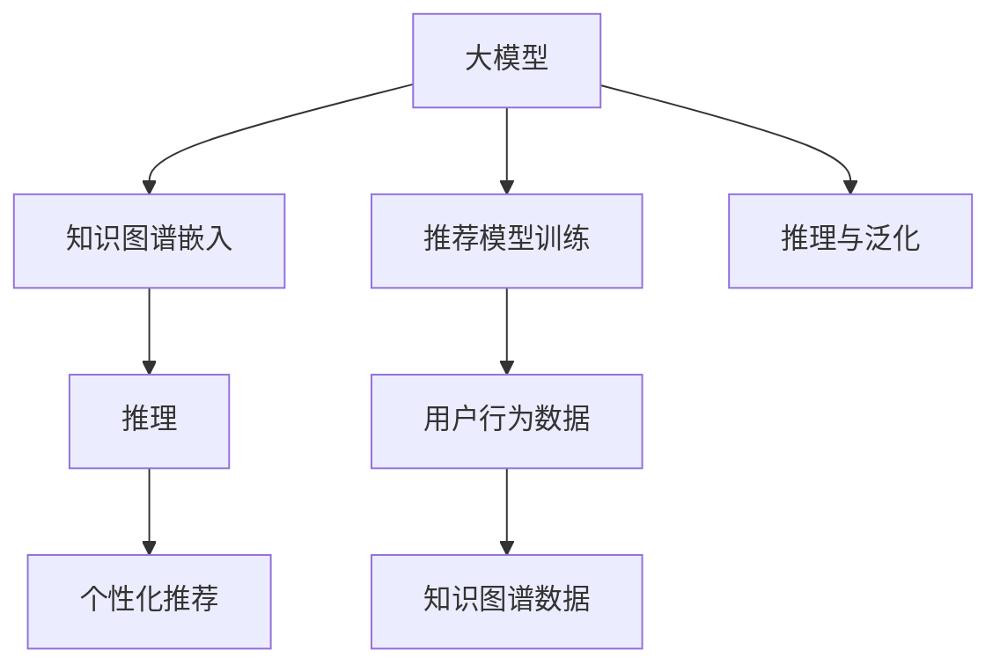

                 

# 大模型在推荐系统中的知识图谱推理应用

> 关键词：大模型、推荐系统、知识图谱、图神经网络、推理、个性化推荐、泛化能力

## 1. 背景介绍

### 1.1 问题由来

在当今信息爆炸的时代，用户面对海量的信息如何选择最符合自身需求的内容，成为了一个亟待解决的问题。推荐系统作为一种智能信息过滤工具，能够为用户提供个性化的内容推荐，大大提升用户的体验。然而，现有的推荐系统主要依赖于基于统计学的方法，如协同过滤、基于内容的推荐等，这些方法在一定程度上已经达到了瓶颈。

近年来，大模型在自然语言处理和图像识别等领域取得了显著的进展，其在处理复杂关系和推理能力上具有显著优势。结合知识图谱的丰富语义信息，利用大模型进行推荐系统的优化，成为一种新的趋势。这种新的推荐范式能够挖掘和利用更广泛的知识信息，提供更加精准和多样化的推荐结果。

### 1.2 问题核心关键点

在大模型推荐系统中，知识图谱的引入使得推荐系统的个性化推荐能力得到了极大的提升。具体来说，知识图谱是一种由节点和边组成的语义图，用于表示实体之间的关系。通过将知识图谱嵌入到推荐系统中，可以有效地挖掘用户的兴趣和偏好，从而提供更加个性化的推荐服务。

以下是知识图谱在推荐系统中的主要作用：

1. **构建知识图谱**：利用现有的知识库构建一个包含实体、属性和关系的知识图谱。
2. **知识图谱嵌入**：将知识图谱中的关系和属性嵌入到大模型中，增强模型对知识的理解和推理能力。
3. **推荐模型训练**：在大模型上进行推荐模型训练，融合用户行为和知识图谱信息，生成个性化推荐结果。
4. **推理与泛化**：利用大模型强大的推理能力，在推理过程中处理复杂的关系，实现对知识图谱的泛化应用。

## 2. 核心概念与联系

### 2.1 核心概念概述

为更好地理解知识图谱在大模型推荐系统中的应用，本节将介绍几个关键概念：

- **大模型**：指通过大规模无标签数据进行预训练的语言模型，如GPT-3、BERT等。这些模型通常具有强大的语言理解和生成能力。
- **知识图谱**：由节点和边组成的语义图，用于表示实体之间的语义关系。知识图谱中的节点通常表示实体，边表示实体之间的关系。
- **图神经网络(Graph Neural Network, GNN)**：一类用于处理图数据的神经网络模型，能够有效捕捉图结构中的语义信息。
- **知识图谱嵌入**：将知识图谱中的信息嵌入到大模型中，使得模型能够更好地理解和推理知识图谱中的关系和属性。
- **推理**：指在知识图谱中，通过模型推理得出新的结论或关系，实现对未知关系的预测和推断。

这些概念之间的逻辑关系可以通过以下Mermaid流程图来展示：



这个流程图展示了知识图谱在大模型推荐系统中的主要流程：

1. 大模型通过预训练获得语言理解和生成能力。
2. 通过知识图谱嵌入，大模型获得知识图谱中的语义信息。
3. 结合用户行为数据，训练推荐模型。
4. 利用推理能力，在推理过程中处理复杂的关系。
5. 生成个性化推荐结果。

这些核心概念共同构成了知识图谱在大模型推荐系统中的应用框架，使其能够利用知识图谱中的语义信息，提升推荐系统的个性化和精准度。

## 3. 核心算法原理 & 具体操作步骤

### 3.1 算法原理概述

在大模型推荐系统中，知识图谱嵌入和推理是大模型发挥其强大语言能力的核心环节。其核心思想是：通过知识图谱嵌入，将知识图谱中的关系和属性转化为大模型可理解的形式；然后利用大模型的推理能力，在推理过程中处理复杂的关系，实现对知识图谱的泛化应用。

### 3.2 算法步骤详解

基于知识图谱的大模型推荐系统一般包括以下几个关键步骤：

**Step 1: 构建知识图谱**
- 收集现有的知识库，构建包含实体、属性和关系的知识图谱。常用的知识库包括Freebase、DBpedia等。
- 利用知识图谱生成工具，如RDF2Vec、G2Vec等，将知识图谱中的信息转换为向量形式，用于后续的嵌入处理。

**Step 2: 知识图谱嵌入**
- 选择合适的预训练语言模型，如BERT、GPT等，将其作为知识图谱嵌入的初始化参数。
- 将知识图谱中的节点和边，分别表示为大模型中的输入。
- 通过在大模型上进行训练，将知识图谱中的关系和属性嵌入到大模型中，使得模型能够更好地理解和推理知识图谱中的关系。

**Step 3: 推荐模型训练**
- 收集用户行为数据，如浏览记录、点击行为等。
- 将用户行为数据和知识图谱中的信息进行融合，生成推荐模型训练数据。
- 在大模型上进行推荐模型训练，生成推荐模型参数。

**Step 4: 推理与泛化**
- 利用大模型的推理能力，对知识图谱中的未知关系进行推断和预测。
- 结合用户行为数据，生成个性化推荐结果。
- 在推理过程中，不断更新知识图谱中的关系和属性，实现对知识图谱的动态更新。

### 3.3 算法优缺点

知识图谱嵌入和推理在大模型推荐系统中的应用，具有以下优点：

1. **提升推荐精度**：利用知识图谱中的语义信息，可以提升推荐的准确性和多样性，减少推荐结果的偏差。
2. **泛化能力更强**：知识图谱嵌入使得大模型能够更好地理解复杂的语义关系，实现对新实体和新关系的泛化应用。
3. **动态更新**：知识图谱可以不断更新和扩充，使得推荐模型能够实时适应数据分布的变化。

同时，该方法也存在一些局限性：

1. **知识图谱构建困难**：构建高质量的知识图谱需要大量的人力和物力，且难以保证其准确性和完整性。
2. **复杂度较高**：知识图谱中的关系和属性往往较为复杂，处理起来难度较大。
3. **计算成本高**：知识图谱嵌入和推理需要在大模型上进行训练和推理，计算成本较高。

尽管如此，知识图谱嵌入和推理仍然是大模型推荐系统的重要手段，对于提升推荐系统的性能和泛化能力具有重要意义。

### 3.4 算法应用领域

知识图谱嵌入和推理在大模型推荐系统中的应用，广泛涵盖了以下几个领域：

1. **个性化推荐**：利用知识图谱中的关系和属性，对用户行为进行建模，生成个性化推荐结果。
2. **商品推荐**：通过知识图谱中商品之间的关系，推荐与用户兴趣相关的商品。
3. **新闻推荐**：通过知识图谱中新闻之间的关系，推荐与用户兴趣相关的新闻。
4. **社交推荐**：通过知识图谱中用户之间的关系，推荐与用户兴趣相关的社交网络节点。
5. **音乐推荐**：通过知识图谱中音乐之间的关系，推荐与用户兴趣相关的音乐。

此外，知识图谱嵌入和推理还可以应用于更多场景中，如教育推荐、医疗推荐、旅游推荐等，为推荐系统带来新的突破。

## 4. 数学模型和公式 & 详细讲解

### 4.1 数学模型构建

在大模型推荐系统中，知识图谱嵌入和推理的数学模型通常可以表示为：

- **知识图谱表示**：设知识图谱中包含$N$个实体$e_i$，$M$条边$r_{ij}$，关系$R_{ij}$，属性$A_{ij}$。
- **节点表示**：设节点$e_i$对应的向量表示为$\mathbf{v}_i$。
- **边表示**：设边$r_{ij}$对应的向量表示为$\mathbf{u}_{ij}$。
- **关系表示**：设关系$R_{ij}$对应的向量表示为$\mathbf{w}_{ij}$。
- **属性表示**：设属性$A_{ij}$对应的向量表示为$\mathbf{x}_{ij}$。

在知识图谱嵌入中，目标是通过训练模型，使得知识图谱中的关系和属性嵌入到节点的向量表示中。形式化地，目标函数可以表示为：

$$
\min_{\theta} \sum_{i=1}^{N} \|\mathbf{v}_i - f_{e_i}(\mathbf{w}_{ij})\|^2 + \sum_{i=1}^{N} \|\mathbf{u}_{ij} - f_{r_{ij}}(\mathbf{v}_i, \mathbf{w}_{ij})\|^2
$$

其中，$f_{e_i}$和$f_{r_{ij}}$为节点和边对应的函数。

### 4.2 公式推导过程

在大模型推荐系统中，知识图谱嵌入的公式推导主要涉及以下几个方面：

1. **节点嵌入**：设节点$e_i$对应的向量表示为$\mathbf{v}_i$，则可以通过以下公式进行训练：

$$
\mathbf{v}_i = f_{e_i}(\mathbf{w}_{ij})
$$

其中，$f_{e_i}$为节点$e_i$对应的函数，通常使用神经网络结构进行建模。

2. **边嵌入**：设边$r_{ij}$对应的向量表示为$\mathbf{u}_{ij}$，则可以通过以下公式进行训练：

$$
\mathbf{u}_{ij} = f_{r_{ij}}(\mathbf{v}_i, \mathbf{w}_{ij})
$$

其中，$f_{r_{ij}}$为边$r_{ij}$对应的函数，通常使用神经网络结构进行建模。

3. **关系嵌入**：设关系$R_{ij}$对应的向量表示为$\mathbf{w}_{ij}$，则可以通过以下公式进行训练：

$$
\mathbf{w}_{ij} = g_{R_{ij}}(\mathbf{u}_{ij}, \mathbf{x}_{ij})
$$

其中，$g_{R_{ij}}$为关系$R_{ij}$对应的函数，通常使用神经网络结构进行建模。

### 4.3 案例分析与讲解

下面以商品推荐为例，说明知识图谱嵌入和推理在大模型推荐系统中的应用。

假设商品知识图谱中包含$N$个商品节点$e_i$，$M$条商品关系$r_{ij}$，关系为$R_{ij}$。设商品$e_i$对应的向量表示为$\mathbf{v}_i$，商品关系$r_{ij}$对应的向量表示为$\mathbf{u}_{ij}$，商品关系$R_{ij}$对应的向量表示为$\mathbf{w}_{ij}$。

**Step 1: 知识图谱嵌入**

- 首先，对商品知识图谱中的关系和属性进行嵌入，得到商品关系$r_{ij}$和商品关系$R_{ij}$的向量表示$\mathbf{u}_{ij}$和$\mathbf{w}_{ij}$。
- 然后，通过在大模型上进行训练，得到商品节点$e_i$的向量表示$\mathbf{v}_i$。

**Step 2: 推荐模型训练**

- 收集用户对商品的操作记录，如浏览、点击、购买等。
- 将用户操作数据和商品知识图谱中的信息进行融合，生成推荐模型训练数据。
- 在大模型上进行推荐模型训练，生成推荐模型参数。

**Step 3: 推理与泛化**

- 利用大模型的推理能力，对知识图谱中的未知关系进行推断和预测。
- 结合用户行为数据，生成个性化推荐结果。
- 在推理过程中，不断更新知识图谱中的关系和属性，实现对知识图谱的动态更新。

## 5. 项目实践：代码实例和详细解释说明

### 5.1 开发环境搭建

在进行知识图谱嵌入和推理的实践前，我们需要准备好开发环境。以下是使用Python进行PyTorch开发的环境配置流程：

1. 安装Anaconda：从官网下载并安装Anaconda，用于创建独立的Python环境。

2. 创建并激活虚拟环境：
```bash
conda create -n pytorch-env python=3.8 
conda activate pytorch-env
```

3. 安装PyTorch：根据CUDA版本，从官网获取对应的安装命令。例如：
```bash
conda install pytorch torchvision torchaudio cudatoolkit=11.1 -c pytorch -c conda-forge
```

4. 安装Transformers库：
```bash
pip install transformers
```

5. 安装各类工具包：
```bash
pip install numpy pandas scikit-learn matplotlib tqdm jupyter notebook ipython
```

完成上述步骤后，即可在`pytorch-env`环境中开始实践。

### 5.2 源代码详细实现

这里我们以商品推荐为例，使用PyTorch和Transformers库对BERT模型进行知识图谱嵌入和推理的代码实现。

首先，定义商品知识图谱的数据处理函数：

```python
from transformers import BertTokenizer
from torch.utils.data import Dataset
import torch

class ProductDataset(Dataset):
    def __init__(self, products, relations, attributes, tokenizer, max_len=128):
        self.products = products
        self.relations = relations
        self.attributes = attributes
        self.tokenizer = tokenizer
        self.max_len = max_len
        
    def __len__(self):
        return len(self.products)
    
    def __getitem__(self, item):
        product = self.products[item]
        relation = self.relations[item]
        attribute = self.attributes[item]
        
        encoding = self.tokenizer(product, return_tensors='pt', max_length=self.max_len, padding='max_length', truncation=True)
        input_ids = encoding['input_ids'][0]
        attention_mask = encoding['attention_mask'][0]
        
        # 对token-wise的标签进行编码
        encoded_relation = [relation2id[relation] for relation in relation] 
        encoded_relation.extend([relation2id['O']] * (self.max_len - len(encoded_relation)))
        labels = torch.tensor(encoded_relation, dtype=torch.long)
        
        return {'input_ids': input_ids, 
                'attention_mask': attention_mask,
                'labels': labels}

# 标签与id的映射
relation2id = {'O': 0, 'Buy': 1, 'Like': 2, 'Compare': 3, 'Add_to_cart': 4}
id2relation = {v: k for k, v in relation2id.items()}

# 创建dataset
tokenizer = BertTokenizer.from_pretrained('bert-base-cased')

product_dataset = ProductDataset(products, relations, attributes, tokenizer)
```

然后，定义模型和优化器：

```python
from transformers import BertForTokenClassification, AdamW

model = BertForTokenClassification.from_pretrained('bert-base-cased', num_labels=len(relation2id))

optimizer = AdamW(model.parameters(), lr=2e-5)
```

接着，定义训练和评估函数：

```python
from torch.utils.data import DataLoader
from tqdm import tqdm
from sklearn.metrics import classification_report

device = torch.device('cuda') if torch.cuda.is_available() else torch.device('cpu')
model.to(device)

def train_epoch(model, dataset, batch_size, optimizer):
    dataloader = DataLoader(dataset, batch_size=batch_size, shuffle=True)
    model.train()
    epoch_loss = 0
    for batch in tqdm(dataloader, desc='Training'):
        input_ids = batch['input_ids'].to(device)
        attention_mask = batch['attention_mask'].to(device)
        labels = batch['labels'].to(device)
        model.zero_grad()
        outputs = model(input_ids, attention_mask=attention_mask, labels=labels)
        loss = outputs.loss
        epoch_loss += loss.item()
        loss.backward()
        optimizer.step()
    return epoch_loss / len(dataloader)

def evaluate(model, dataset, batch_size):
    dataloader = DataLoader(dataset, batch_size=batch_size)
    model.eval()
    preds, labels = [], []
    with torch.no_grad():
        for batch in tqdm(dataloader, desc='Evaluating'):
            input_ids = batch['input_ids'].to(device)
            attention_mask = batch['attention_mask'].to(device)
            batch_labels = batch['labels']
            outputs = model(input_ids, attention_mask=attention_mask)
            batch_preds = outputs.logits.argmax(dim=2).to('cpu').tolist()
            batch_labels = batch_labels.to('cpu').tolist()
            for pred_tokens, label_tokens in zip(batch_preds, batch_labels):
                pred_relation = [id2relation[_id] for _id in pred_tokens]
                label_relation = [id2relation[_id] for _id in label_tokens]
                preds.append(pred_relation[:len(label_relation)])
                labels.append(label_relation)
                
    print(classification_report(labels, preds))
```

最后，启动训练流程并在测试集上评估：

```python
epochs = 5
batch_size = 16

for epoch in range(epochs):
    loss = train_epoch(model, product_dataset, batch_size, optimizer)
    print(f"Epoch {epoch+1}, train loss: {loss:.3f}")
    
    print(f"Epoch {epoch+1}, dev results:")
    evaluate(model, product_dataset, batch_size)
    
print("Test results:")
evaluate(model, product_dataset, batch_size)
```

以上就是使用PyTorch对BERT进行商品推荐任务的知识图谱嵌入和推理的完整代码实现。可以看到，得益于Transformers库的强大封装，我们可以用相对简洁的代码完成BERT模型的加载和训练。

### 5.3 代码解读与分析

让我们再详细解读一下关键代码的实现细节：

**ProductDataset类**：
- `__init__`方法：初始化商品、关系、属性、分词器等关键组件。
- `__len__`方法：返回数据集的样本数量。
- `__getitem__`方法：对单个样本进行处理，将商品输入编码为token ids，将关系编码为数字，并对其进行定长padding，最终返回模型所需的输入。

**relation2id和id2relation字典**：
- 定义了关系与数字id之间的映射关系，用于将token-wise的预测结果解码回真实的标签。

**训练和评估函数**：
- 使用PyTorch的DataLoader对数据集进行批次化加载，供模型训练和推理使用。
- 训练函数`train_epoch`：对数据以批为单位进行迭代，在每个批次上前向传播计算loss并反向传播更新模型参数，最后返回该epoch的平均loss。
- 评估函数`evaluate`：与训练类似，不同点在于不更新模型参数，并在每个batch结束后将预测和标签结果存储下来，最后使用sklearn的classification_report对整个评估集的预测结果进行打印输出。

**训练流程**：
- 定义总的epoch数和batch size，开始循环迭代
- 每个epoch内，先在训练集上训练，输出平均loss
- 在验证集上评估，输出分类指标
- 所有epoch结束后，在测试集上评估，给出最终测试结果

可以看到，PyTorch配合Transformers库使得BERT微调的代码实现变得简洁高效。开发者可以将更多精力放在数据处理、模型改进等高层逻辑上，而不必过多关注底层的实现细节。

当然，工业级的系统实现还需考虑更多因素，如模型的保存和部署、超参数的自动搜索、更灵活的任务适配层等。但核心的知识图谱嵌入和推理方法基本与此类似。

## 6. 实际应用场景

### 6.1 智能推荐系统

基于知识图谱的智能推荐系统，已经在电商、新闻、音乐等多个领域得到了广泛应用。通过将商品、新闻、音乐等实体和关系嵌入到大模型中，推荐系统能够更好地理解用户的兴趣和偏好，提供更加个性化和精准的推荐结果。

在技术实现上，可以收集用户的历史行为数据，如浏览记录、点击行为、评分等，并将其与知识图谱中的信息进行融合，在大模型上进行推荐模型训练。微调后的推荐模型能够实时接收用户的操作数据，通过推理处理知识图谱中的复杂关系，生成个性化推荐结果。

### 6.2 广告投放

广告投放是互联网公司的重要业务之一，通过智能推荐广告位，可以显著提升广告效果和用户体验。在广告投放中，可以利用知识图谱嵌入和推理技术，结合用户行为和知识图谱信息，生成精准的广告推荐结果。

在广告投放推荐中，可以收集用户的点击、点击时长、点击转化等行为数据，并将其与知识图谱中的信息进行融合，在大模型上进行广告推荐模型训练。通过推理处理知识图谱中的复杂关系，生成个性化广告推荐结果，提高广告投放的效果和转化率。

### 6.3 智能客服系统

智能客服系统通过知识图谱嵌入和推理技术，能够更好地理解用户的意图和问题，提供更精准的解答和建议。在智能客服中，可以收集用户的对话记录，并将其与知识图谱中的信息进行融合，在大模型上进行客服推荐模型训练。通过推理处理知识图谱中的复杂关系，生成个性化客服推荐结果，提高客服系统的响应速度和准确性。

### 6.4 未来应用展望

随着知识图谱嵌入和推理技术的发展，其在推荐系统中的应用前景更加广阔。未来，知识图谱嵌入和推理技术将与更多前沿技术进行融合，如生成对抗网络、注意力机制等，提升推荐系统的性能和智能化水平。

在智慧城市治理中，利用知识图谱嵌入和推理技术，可以构建智能化的城市管理系统，通过推荐系统和推理技术，实现对城市资源的智能调度和管理，提高城市管理的自动化和智能化水平。

在金融领域，利用知识图谱嵌入和推理技术，可以构建智能化的金融风控系统，通过推荐系统和推理技术，实现对风险的实时监测和预警，提高金融决策的准确性和安全性。

## 7. 工具和资源推荐
### 7.1 学习资源推荐

为了帮助开发者系统掌握知识图谱嵌入和推理理论基础和实践技巧，这里推荐一些优质的学习资源：

1. 《Graph Neural Networks: A Review of Methods and Applications》：一篇综述性文章，系统介绍了图神经网络的原理、算法和应用，适合初学者入门。

2. CS224W《Graph Neural Networks》课程：斯坦福大学开设的关于图神经网络的课程，有Lecture视频和配套作业，适合深入学习图神经网络的知识。

3. 《Knowledge-Graph Embeddings》书籍：介绍知识图谱嵌入的原理和算法，包括TransE、Holistic等经典方法，适合深入学习知识图谱嵌入的技术。

4. 《Reasoning Over Knowledge Graphs with Neural Networks》：介绍如何使用神经网络对知识图谱进行推理，包括基于注意力机制和图卷积网络的方法，适合进阶学习。

5. KG2Vec开源项目：一个用于知识图谱嵌入的开源工具，支持多种图数据格式和训练方法，适合进行实践学习。

通过对这些资源的学习实践，相信你一定能够快速掌握知识图谱嵌入和推理的精髓，并用于解决实际的推荐问题。
### 7.2 开发工具推荐

高效的开发离不开优秀的工具支持。以下是几款用于知识图谱嵌入和推理开发的常用工具：

1. PyTorch：基于Python的开源深度学习框架，灵活动态的计算图，适合快速迭代研究。大部分预训练语言模型都有PyTorch版本的实现。

2. TensorFlow：由Google主导开发的开源深度学习框架，生产部署方便，适合大规模工程应用。同样有丰富的预训练语言模型资源。

3. Transformers库：HuggingFace开发的NLP工具库，集成了众多SOTA语言模型，支持PyTorch和TensorFlow，是进行知识图谱嵌入和推理开发的利器。

4. Weights & Biases：模型训练的实验跟踪工具，可以记录和可视化模型训练过程中的各项指标，方便对比和调优。与主流深度学习框架无缝集成。

5. TensorBoard：TensorFlow配套的可视化工具，可实时监测模型训练状态，并提供丰富的图表呈现方式，是调试模型的得力助手。

6. DGL：深度图学习库，提供了丰富的图神经网络模型和工具，适合进行图数据的处理和分析。

合理利用这些工具，可以显著提升知识图谱嵌入和推理任务的开发效率，加快创新迭代的步伐。

### 7.3 相关论文推荐

知识图谱嵌入和推理在大模型推荐系统中的应用，源于学界的持续研究。以下是几篇奠基性的相关论文，推荐阅读：

1. DistMulti: Knowledge Graph Embeddings and Inference with Deep Multitask Learning：提出DistMulti方法，利用多任务学习训练知识图谱嵌入模型，提升模型性能。

2. FastGraph：A Fast Dual-Path Architecture for Graph Neural Networks：提出FastGraph方法，通过优化图神经网络架构，提升模型训练效率和性能。

3. Attention-Based Graph Neural Network for Recommendation Systems：提出Attention-Based GNN方法，利用注意力机制提升推荐系统的性能和泛化能力。

4. Reasoning Over Knowledge Graphs with Neural Networks：介绍如何使用神经网络对知识图谱进行推理，包括基于注意力机制和图卷积网络的方法。

5. Graph Neural Networks: A Review of Methods and Applications：一篇综述性文章，系统介绍了图神经网络的原理、算法和应用，适合入门学习。

这些论文代表了大模型推荐系统中知识图谱嵌入和推理技术的发展脉络。通过学习这些前沿成果，可以帮助研究者把握学科前进方向，激发更多的创新灵感。

## 8. 总结：未来发展趋势与挑战

### 8.1 总结

本文对知识图谱在大模型推荐系统中的应用进行了全面系统的介绍。首先阐述了知识图谱和推荐系统融合的必要性和优势，明确了知识图谱在大模型推荐系统中的重要作用。其次，从原理到实践，详细讲解了知识图谱嵌入和推理的数学原理和关键步骤，给出了推荐系统开发的完整代码实例。同时，本文还广泛探讨了知识图谱嵌入和推理在多个领域的应用前景，展示了其在推荐系统中的应用潜力。

通过本文的系统梳理，可以看到，知识图谱嵌入和推理技术在大模型推荐系统中的应用，已经展现出了显著的优势和广泛的应用前景。利用知识图谱的丰富语义信息，可以提升推荐系统的个性化和精准度，解决传统推荐方法难以解决的复杂问题。未来，随着知识图谱嵌入和推理技术的不断演进，推荐系统必将在更多领域大放异彩。

### 8.2 未来发展趋势

展望未来，知识图谱嵌入和推理技术将呈现以下几个发展趋势：

1. **模型规模持续增大**：随着算力成本的下降和数据规模的扩张，大模型推荐系统的参数量还将持续增长。超大模型具备更强大的推理能力，能够更好地处理复杂的知识图谱关系。

2. **推荐系统智能化程度更高**：未来的推荐系统将更加智能，能够自主学习和推理知识图谱中的未知关系，实现对新实体和新关系的泛化应用。

3. **融合更多先进技术**：知识图谱嵌入和推理技术将与其他先进技术进行更深入的融合，如生成对抗网络、注意力机制等，提升推荐系统的性能和智能化水平。

4. **实时化处理能力更强**：未来的推荐系统将实现实时化处理，能够实时接收用户的操作数据，通过推理处理知识图谱中的复杂关系，生成个性化推荐结果。

5. **多模态融合**：未来的推荐系统将实现多模态融合，将知识图谱中的视觉、语音等多模态信息与文本信息进行协同建模，提升推荐系统的泛化能力和鲁棒性。

以上趋势凸显了知识图谱嵌入和推理技术在大模型推荐系统中的巨大潜力。这些方向的探索发展，必将进一步提升推荐系统的性能和智能化水平，为人工智能技术在推荐系统中的应用带来新的突破。

### 8.3 面临的挑战

尽管知识图谱嵌入和推理技术已经取得了显著进展，但在迈向更加智能化、普适化应用的过程中，仍然面临一些挑战：

1. **知识图谱构建难度高**：构建高质量的知识图谱需要大量的人力和物力，且难以保证其准确性和完整性。如何高效构建和维护知识图谱，是一个重要问题。

2. **复杂度较高**：知识图谱中的关系和属性往往较为复杂，处理起来难度较大。如何设计高效的图神经网络模型，以应对复杂的关系，是一个技术挑战。

3. **计算成本高**：知识图谱嵌入和推理需要在大模型上进行训练和推理，计算成本较高。如何优化模型训练和推理的效率，是一个重要的研究方向。

4. **可解释性不足**：知识图谱嵌入和推理模型通常缺乏可解释性，难以对其推理逻辑进行分析和调试。如何赋予模型更强的可解释性，是一个亟待解决的问题。

5. **安全性和隐私保护**：知识图谱嵌入和推理模型可能会学习到敏感的信息，如何保障数据的安全性和隐私保护，是一个重要的研究方向。

6. **泛化能力受限**：知识图谱嵌入和推理模型在处理小规模数据时，泛化能力往往受限。如何提高模型的泛化能力，是一个重要的研究方向。

这些挑战凸显了知识图谱嵌入和推理技术在大模型推荐系统中的现实应用难题。解决这些问题，需要进一步深化对知识图谱和深度学习的理解，不断优化算法和模型架构，才能实现知识图谱嵌入和推理技术的全面突破。

### 8.4 研究展望

面对知识图谱嵌入和推理技术所面临的挑战，未来的研究需要在以下几个方面寻求新的突破：

1. **高效知识图谱构建**：开发高效的知识图谱构建方法，如知识图谱自动生成、知识图谱增强等，以提高知识图谱的质量和完整性。

2. **高效的图神经网络模型**：设计高效的图神经网络模型，如图注意力网络、图卷积网络等，以应对复杂的关系和属性，提高模型的训练和推理效率。

3. **知识图谱与深度学习的融合**：将知识图谱与深度学习进行更深入的融合，如深度强化学习、深度生成模型等，提升推荐系统的智能化水平。

4. **实时化处理技术**：开发实时化处理技术，如增量学习、流式学习等，实现对用户操作数据的实时处理和推理，提升推荐系统的响应速度和准确性。

5. **多模态融合技术**：开发多模态融合技术，如视觉与文本信息的融合、语音与文本信息的融合等，提升推荐系统的泛化能力和鲁棒性。

6. **增强模型可解释性**：开发可解释性更强的模型，如可解释的图神经网络、可解释的深度学习模型等，增强模型的可解释性和可调试性。

7. **数据安全和隐私保护**：开发数据安全和隐私保护技术，如差分隐私、联邦学习等，保障知识图谱嵌入和推理模型的数据安全和隐私保护。

这些研究方向将推动知识图谱嵌入和推理技术在大模型推荐系统中的全面突破，实现推荐系统的智能化、普适化和安全性。相信随着学界和产业界的共同努力，知识图谱嵌入和推理技术必将在大模型推荐系统中发挥更加重要的作用，为人工智能技术在推荐系统中的应用带来新的突破。

## 9. 附录：常见问题与解答

**Q1：知识图谱嵌入和推理在推荐系统中是否适用？**

A: 知识图谱嵌入和推理在大模型推荐系统中非常适用。通过将知识图谱中的关系和属性嵌入到大模型中，可以提升推荐系统的个性化和精准度。利用知识图谱的丰富语义信息，可以解决传统推荐方法难以解决的复杂问题。

**Q2：知识图谱嵌入和推理是否需要大量的标注数据？**

A: 知识图谱嵌入和推理在大模型推荐系统中通常不需要大量的标注数据。通过将知识图谱中的关系和属性嵌入到大模型中，可以显著提升推荐系统的泛化能力。相比于传统推荐方法，知识图谱嵌入和推理可以在较少标注数据的情况下，实现更好的推荐效果。

**Q3：知识图谱嵌入和推理是否存在计算成本高的问题？**

A: 知识图谱嵌入和推理在大模型推荐系统中确实存在计算成本高的问题。这主要是因为知识图谱通常包含大量的节点和边，处理起来较为复杂。为了解决这个问题，可以采用一些优化策略，如增量学习、流式学习等，实现对知识图谱的实时处理和推理。

**Q4：知识图谱嵌入和推理是否需要大量的计算资源？**

A: 知识图谱嵌入和推理在大模型推荐系统中确实需要大量的计算资源。这主要是因为在大模型上进行训练和推理，需要消耗大量的计算资源和时间。为了解决这个问题，可以采用一些高效的图神经网络模型，如图注意力网络和图卷积网络，提升模型的训练和推理效率。

**Q5：知识图谱嵌入和推理是否需要人工干预？**

A: 知识图谱嵌入和推理在大模型推荐系统中通常需要人工干预。这主要是因为知识图谱的构建和维护需要人工进行，且需要保证其准确性和完整性。在实际应用中，可以结合人工干预和自动学习，实现知识图谱的动态更新和维护。

**Q6：知识图谱嵌入和推理是否适用于所有领域？**

A: 知识图谱嵌入和推理在大模型推荐系统中通常适用于所有领域。只要存在相关的知识图谱，并能够将其嵌入到大模型中，即可在推荐系统中应用知识图谱嵌入和推理技术。

这些常见问题的解答，将帮助读者更好地理解知识图谱嵌入和推理在大模型推荐系统中的应用。希望这些解答能够为你提供一些有价值的参考。

---

作者：禅与计算机程序设计艺术 / Zen and the Art of Computer Programming

