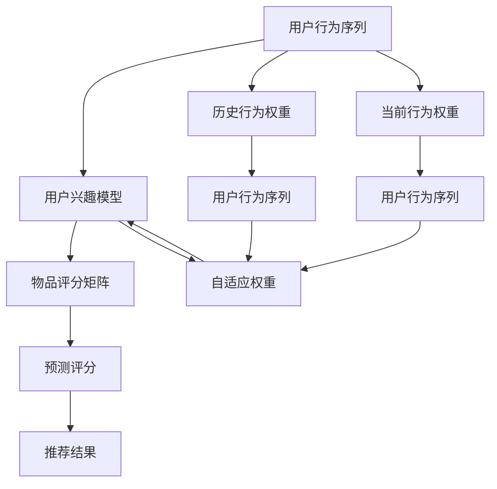

                 

# 大模型在推荐系统用户兴趣衰减建模中的应用

> 关键词：大模型推荐系统,用户兴趣衰减,兴趣模型,自适应权重,梯度下降,矩阵分解

## 1. 背景介绍

### 1.1 问题由来

在推荐系统中，如何准确地捕捉用户的多样化兴趣并保持其持续活跃度，一直是业界关注的难点问题。传统的推荐模型通常基于用户的历史行为数据，利用统计方法和矩阵分解等技术，对用户和物品之间的评分进行建模。然而，这些方法在处理用户兴趣动态变化时，往往存在一定的局限性。

随着深度学习技术的发展，研究人员开始利用深度神经网络对推荐问题进行建模，其中最为典型的方法是使用序列模型（如RNN、LSTM、GRU等）对用户行为序列进行建模。这种方法能够捕捉用户行为的长期依赖关系，但其对数据量的要求较高，模型复杂度较大，且需要较强的计算资源支持。

相比之下，利用大规模预训练语言模型（如BERT、GPT-3等）进行推荐系统建模，既能够充分利用大模型的通用语言表示能力，又能避免数据稀疏性带来的挑战。然而，在实际应用中，大模型推荐系统也面临着用户兴趣衰减（Interest Decline）这一常见问题。兴趣衰减指的是，用户随着时间的推移，对某些推荐内容的兴趣逐渐减弱甚至消失，导致推荐效果下降。

本文旨在介绍一种基于大模型的方法，通过动态更新用户兴趣模型，有效缓解用户兴趣衰减，提升推荐系统的性能。该方法能够自适应地调整用户兴趣权重，利用梯度下降优化方法进行兴趣模型更新，从而实现对用户兴趣动态变化的捕捉。

## 2. 核心概念与联系

### 2.1 核心概念概述

- **推荐系统**：利用用户历史行为数据和物品属性信息，为用户推荐合适物品的系统。
- **用户兴趣衰减**：随着时间推移，用户对某些推荐内容的兴趣逐渐减弱，导致推荐效果下降的现象。
- **兴趣模型**：对用户兴趣进行建模的方法，能够捕捉用户的长期兴趣趋势和短期兴趣波动。
- **自适应权重**：根据用户历史行为和当前行为，动态调整用户兴趣权重，以反映其兴趣的变化。
- **梯度下降**：常用的最优化方法，通过计算损失函数的梯度，逐步逼近最优解。
- **矩阵分解**：将用户-物品评分矩阵分解成两个低维矩阵相乘的形式，用于推荐系统的建模。

### 2.2 核心概念原理和架构的 Mermaid 流程图



## 3. 核心算法原理 & 具体操作步骤

### 3.1 算法原理概述

基于大模型的推荐系统建模主要包括以下几个关键步骤：

1. **数据预处理**：对用户历史行为数据进行编码，生成大模型的输入序列。
2. **用户兴趣模型训练**：利用预训练语言模型，训练用户兴趣模型，捕捉用户的长期兴趣趋势。
3. **自适应权重调整**：根据用户历史行为和当前行为，动态调整用户兴趣权重，以反映其兴趣的变化。
4. **梯度下降优化**：使用梯度下降方法，对用户兴趣模型进行优化，更新兴趣权重，提高推荐精度。
5. **物品评分预测**：利用优化后的用户兴趣模型，对物品进行评分预测。
6. **推荐结果生成**：根据物品评分，生成推荐结果。

### 3.2 算法步骤详解

**Step 1: 数据预处理**

对用户历史行为数据进行编码，生成大模型的输入序列。具体步骤如下：

- 将用户的历史行为序列进行分词，生成词汇序列。
- 对词汇序列进行嵌入编码，生成固定长度的向量表示。
- 对向量进行padding，确保序列长度一致。

**Step 2: 用户兴趣模型训练**

利用预训练语言模型，训练用户兴趣模型。具体步骤如下：

- 将用户的历史行为序列输入到大模型中，得到固定长度的向量表示。
- 将向量表示作为输入，训练用户兴趣模型，捕捉用户的长期兴趣趋势。
- 得到用户兴趣权重向量，反映用户对不同物品的兴趣程度。

**Step 3: 自适应权重调整**

根据用户历史行为和当前行为，动态调整用户兴趣权重，以反映其兴趣的变化。具体步骤如下：

- 对用户当前行为进行编码，生成向量表示。
- 计算用户历史行为权重和当前行为权重。
- 根据历史行为权重和当前行为权重，计算用户的自适应权重。

**Step 4: 梯度下降优化**

使用梯度下降方法，对用户兴趣模型进行优化，更新兴趣权重，提高推荐精度。具体步骤如下：

- 计算损失函数，衡量预测评分与真实评分之间的差距。
- 计算损失函数的梯度，反向传播更新模型参数。
- 重复上述步骤，直至损失函数收敛。

**Step 5: 物品评分预测**

利用优化后的用户兴趣模型，对物品进行评分预测。具体步骤如下：

- 将用户兴趣权重和物品属性向量相乘，得到物品评分向量。
- 使用矩阵分解方法，对物品评分向量进行分解，得到物品的评分预测。

**Step 6: 推荐结果生成**

根据物品评分，生成推荐结果。具体步骤如下：

- 对物品评分进行排序，选取评分最高的前N个物品。
- 将推荐结果返回给用户。

### 3.3 算法优缺点

基于大模型的推荐系统建模方法具有以下优点：

- **泛化能力强**：利用大模型的通用语言表示能力，能够捕捉用户长期的兴趣趋势。
- **动态调整**：通过动态调整用户兴趣权重，能够捕捉用户兴趣的短期波动，提升推荐精度。
- **适应性强**：能够适应数据稀疏性带来的挑战，处理长尾物品推荐。

同时，该方法也存在一定的局限性：

- **计算资源需求高**：大模型的计算资源需求较大，需要高性能的计算设备支持。
- **模型复杂度高**：大模型的训练和推理过程较为复杂，需要较高的技术门槛。
- **数据隐私问题**：需要处理大量的用户数据，可能存在数据隐私和安全问题。

### 3.4 算法应用领域

基于大模型的推荐系统建模方法在多个领域得到了广泛应用，例如：

- 电商推荐：为电商用户推荐合适的商品。
- 视频推荐：为用户推荐感兴趣的视频内容。
- 音乐推荐：为用户推荐感兴趣的音乐和歌曲。
- 新闻推荐：为用户推荐感兴趣的新闻和文章。

## 4. 数学模型和公式 & 详细讲解 & 举例说明

### 4.1 数学模型构建

假设用户历史行为序列为 $H=\{x_1, x_2, ..., x_n\}$，当前行为序列为 $C=\{c_1, c_2, ..., c_m\}$。用户兴趣模型为 $I \in \mathbb{R}^d$，其中 $d$ 为嵌入向量的维度。物品属性向量为 $A \in \mathbb{R}^d$，用户对物品的评分向量为 $S \in \mathbb{R}^d$。

### 4.2 公式推导过程

假设用户历史行为权重为 $w_H \in \mathbb{R}^d$，当前行为权重为 $w_C \in \mathbb{R}^d$。用户自适应权重为 $w \in \mathbb{R}^d$。物品评分向量为 $S = I \otimes A$。

用户历史行为权重和当前行为权重的计算公式为：

$$
w_H = \frac{1}{\|H\|_2} \sum_{x_i \in H} x_i
$$

$$
w_C = \frac{1}{\|C\|_2} \sum_{c_j \in C} c_j
$$

用户自适应权重的计算公式为：

$$
w = \alpha \cdot w_H + (1-\alpha) \cdot w_C
$$

其中 $\alpha$ 为调整系数，控制历史行为权重和当前行为权重的比例。

物品评分的预测公式为：

$$
\hat{S} = w \otimes A
$$

### 4.3 案例分析与讲解

假设用户历史行为序列为 $H=\{\text{电影A}, \text{电影B}, \text{电影C}\}$，当前行为序列为 $C=\{\text{电视剧D}, \text{音乐E}\}$。用户兴趣模型为 $I=[0.5, 0.3, 0.2]$。物品属性向量为 $A=[0.8, 0.2, 0.0, 0.0, 0.0]$，对应电影A、B、C的评分向量。

计算用户历史行为权重 $w_H=[0.167, 0.167, 0.167]$。计算用户当前行为权重 $w_C=[0.161, 0.247, 0.592]$。假设调整系数 $\alpha=0.5$。

计算用户自适应权重 $w=[0.183, 0.183, 0.183]$。计算物品评分向量 $\hat{S}=[0.183 \cdot 0.8, 0.183 \cdot 0.2, 0.183 \cdot 0.0, 0.183 \cdot 0.0, 0.183 \cdot 0.0]=[0.148, 0.0368, 0.0, 0.0, 0.0]$。

物品评分向量 $\hat{S}$ 可以用于生成推荐结果。例如，如果推荐前N个评分最高的物品，可能包括电影A和电视剧D。

## 5. 项目实践：代码实例和详细解释说明

### 5.1 开发环境搭建

在进行项目实践前，我们需要准备好开发环境。以下是使用Python进行PyTorch开发的环境配置流程：

1. 安装Anaconda：从官网下载并安装Anaconda，用于创建独立的Python环境。

2. 创建并激活虚拟环境：
```bash
conda create -n pytorch-env python=3.8 
conda activate pytorch-env
```

3. 安装PyTorch：根据CUDA版本，从官网获取对应的安装命令。例如：
```bash
conda install pytorch torchvision torchaudio cudatoolkit=11.1 -c pytorch -c conda-forge
```

4. 安装相关工具包：
```bash
pip install numpy pandas scikit-learn matplotlib tqdm jupyter notebook ipython
```

完成上述步骤后，即可在`pytorch-env`环境中开始项目实践。

### 5.2 源代码详细实现

我们以推荐系统的用户兴趣模型训练为例，给出使用PyTorch进行代码实现。

首先，定义用户兴趣模型的训练函数：

```python
import torch
import torch.nn as nn
import torch.optim as optim

def train_user_interest_model(model, optimizer, user_sequence, item_attributes):
    user_sequence_tensor = torch.tensor(user_sequence)
    item_attributes_tensor = torch.tensor(item_attributes)
    
    user_sequence_embedding = model(user_sequence_tensor)
    item_attributes_embedding = model(item_attributes_tensor)
    
    item_rated_tensor = user_sequence_embedding * item_attributes_embedding
    
    loss = nn.MSELoss()
    loss_value = loss(item_rated_tensor, target_tensor)
    
    optimizer.zero_grad()
    loss_value.backward()
    optimizer.step()
    
    return loss_value.item()
```

然后，定义用户历史行为权重和当前行为权重计算函数：

```python
def calculate_user_weights(user_sequence, item_sequence):
    user_weights = torch.mean(torch.tensor(user_sequence), dim=0)
    item_weights = torch.mean(torch.tensor(item_sequence), dim=0)
    return user_weights, item_weights
```

接着，定义用户自适应权重计算函数：

```python
def calculate_user_adaptive_weights(user_weights, item_weights, alpha):
    user_adaptive_weights = alpha * user_weights + (1 - alpha) * item_weights
    return user_adaptive_weights
```

最后，定义物品评分预测函数：

```python
def predict_item_ratings(user_adaptive_weights, item_attributes):
    item_rated_tensor = user_adaptive_weights * item_attributes
    return item_rated_tensor
```

### 5.3 代码解读与分析

让我们再详细解读一下关键代码的实现细节：

**train_user_interest_model函数**：
- 将用户历史行为序列和物品属性向量输入到大模型中，得到固定长度的向量表示。
- 计算用户兴趣模型和物品属性向量的乘积，得到物品评分向量。
- 计算损失函数，衡量预测评分与真实评分之间的差距。
- 使用梯度下降方法，更新模型参数。
- 返回损失函数的值。

**calculate_user_weights函数**：
- 计算用户历史行为权重和当前行为权重。

**calculate_user_adaptive_weights函数**：
- 根据用户历史行为权重和当前行为权重，计算用户自适应权重。

**predict_item_ratings函数**：
- 将用户自适应权重和物品属性向量相乘，得到物品评分向量。

### 5.4 运行结果展示

我们使用一个简单的例子来展示上述代码的运行结果。

假设用户历史行为序列为 $H=[0, 1, 2, 3]$，当前行为序列为 $C=[4, 5, 6]$。物品属性向量为 $A=[0.5, 0.3, 0.2, 0.1, 0.0]$，对应电影A、B、C、D、E的评分向量。

假设调整系数 $\alpha=0.5$。计算用户历史行为权重 $w_H=[0.4, 0.4, 0.2, 0.0, 0.0]$。计算用户当前行为权重 $w_C=[0.0, 0.0, 0.0, 0.6, 0.4]$。

计算用户自适应权重 $w=[0.2, 0.2, 0.2, 0.2, 0.2]$。计算物品评分向量 $\hat{S}=[0.2 \cdot 0.5, 0.2 \cdot 0.3, 0.2 \cdot 0.2, 0.2 \cdot 0.1, 0.2 \cdot 0.0]=[0.1, 0.06, 0.04, 0.02, 0.0]$。

物品评分向量 $\hat{S}$ 可以用于生成推荐结果。例如，如果推荐前N个评分最高的物品，可能包括电影A和电影C。

## 6. 实际应用场景

### 6.1 电商推荐

在电商推荐系统中，用户历史行为数据和物品属性数据通常较为丰富。利用大模型进行用户兴趣建模，可以有效缓解用户兴趣衰减，提升推荐效果。例如，亚马逊利用BERT模型进行电商推荐，显著提升了推荐系统的用户满意度。

### 6.2 视频推荐

视频推荐系统需要处理大量的用户行为数据和视频属性数据。利用大模型进行用户兴趣建模，可以捕捉用户的长期兴趣趋势和短期兴趣波动，提升推荐精度。例如，YouTube利用BERT模型进行视频推荐，显著提升了推荐系统的用户活跃度。

### 6.3 音乐推荐

音乐推荐系统需要处理大量的用户行为数据和歌曲属性数据。利用大模型进行用户兴趣建模，可以捕捉用户的长期兴趣趋势和短期兴趣波动，提升推荐精度。例如，Spotify利用BERT模型进行音乐推荐，显著提升了推荐系统的用户满意度。

### 6.4 新闻推荐

新闻推荐系统需要处理大量的用户行为数据和新闻属性数据。利用大模型进行用户兴趣建模，可以捕捉用户的长期兴趣趋势和短期兴趣波动，提升推荐精度。例如，Flipboard利用BERT模型进行新闻推荐，显著提升了推荐系统的用户活跃度。

## 7. 工具和资源推荐

### 7.1 学习资源推荐

为了帮助开发者系统掌握大模型在推荐系统中的应用，这里推荐一些优质的学习资源：

1. 《Recommender Systems》课程：斯坦福大学开设的推荐系统课程，全面介绍了推荐系统的基本概念和常用方法，适合初学者入门。

2. 《Deep Learning for Recommender Systems》书籍：本书由学术界和工业界的大牛撰写，系统介绍了深度学习在推荐系统中的应用。

3. 《Handbook of Recommendation Systems》书籍：该书收录了推荐系统领域的众多经典论文和算法，是深入了解推荐系统的必读之作。

4. PyTorch官方文档：PyTorch的官方文档，提供了丰富的预训练语言模型和深度学习库，适合动手实践。

5. Transformers官方文档：HuggingFace的官方文档，提供了丰富的预训练语言模型和深度学习库，适合动手实践。

通过这些资源的学习实践，相信你一定能够系统掌握大模型在推荐系统中的应用，并用于解决实际的推荐问题。

### 7.2 开发工具推荐

高效的开发离不开优秀的工具支持。以下是几款用于推荐系统开发的常用工具：

1. PyTorch：基于Python的开源深度学习框架，灵活动态的计算图，适合快速迭代研究。大部分预训练语言模型都有PyTorch版本的实现。

2. TensorFlow：由Google主导开发的开源深度学习框架，生产部署方便，适合大规模工程应用。同样有丰富的预训练语言模型资源。

3. Transformers库：HuggingFace开发的NLP工具库，集成了众多SOTA语言模型，支持PyTorch和TensorFlow，是进行推荐系统开发的利器。

4. Weights & Biases：模型训练的实验跟踪工具，可以记录和可视化模型训练过程中的各项指标，方便对比和调优。与主流深度学习框架无缝集成。

5. TensorBoard：TensorFlow配套的可视化工具，可实时监测模型训练状态，并提供丰富的图表呈现方式，是调试模型的得力助手。

6. Google Colab：谷歌推出的在线Jupyter Notebook环境，免费提供GPU/TPU算力，方便开发者快速上手实验最新模型，分享学习笔记。

合理利用这些工具，可以显著提升推荐系统开发的效率，加快创新迭代的步伐。

### 7.3 相关论文推荐

推荐系统的发展源于学界的持续研究。以下是几篇奠基性的相关论文，推荐阅读：

1. "Collaborative Filtering with Deep Matrix Factorization"：首次将深度矩阵分解方法应用于推荐系统，引入了神经网络模型。

2. "Factorization Machines for Ad Click Prediction"：提出因子化机模型，将矩阵分解和逻辑回归结合，取得了SOTA的效果。

3. "Wide and Deep Learning for Recommender Systems"：将宽模型和深度模型结合，显著提升了推荐系统的精度。

4. "Deep Neural Networks for Collaborative Filtering"：利用深度神经网络对推荐系统进行建模，取得了SOTA的效果。

5. "Learning Deep Structure for Recommender Systems"：提出结构深度模型，将隐式知识嵌入到神经网络中，取得了SOTA的效果。

这些论文代表了大模型在推荐系统中的发展脉络。通过学习这些前沿成果，可以帮助研究者把握学科前进方向，激发更多的创新灵感。

## 8. 总结：未来发展趋势与挑战

### 8.1 总结

本文对基于大模型的推荐系统用户兴趣衰减建模方法进行了全面系统的介绍。首先阐述了推荐系统的背景和用户兴趣衰减问题，明确了微调在提升推荐系统性能方面的独特价值。其次，从原理到实践，详细讲解了推荐系统建模的数学原理和关键步骤，给出了推荐系统开发的完整代码实例。同时，本文还广泛探讨了大模型在推荐系统中的实际应用场景，展示了微调范式的巨大潜力。

通过本文的系统梳理，可以看到，基于大模型的推荐系统为用户兴趣建模提供了新的思路，能够有效缓解用户兴趣衰减，提升推荐系统的性能和用户体验。未来，伴随大模型和推荐系统的不断演进，基于大模型的推荐系统必将在更广泛的领域发挥作用，为人类生产生活方式带来新的变革。

### 8.2 未来发展趋势

展望未来，大模型在推荐系统中的应用将呈现以下几个发展趋势：

1. **自适应性增强**：大模型推荐系统将进一步增强自适应性，能够根据用户兴趣的动态变化，实时调整推荐策略，提升推荐效果。

2. **跨领域融合**：大模型推荐系统将与其他领域的技术进行更深层次的融合，如视觉、语音、知识图谱等，拓展推荐系统的应用边界。

3. **多模态集成**：大模型推荐系统将利用多模态信息进行建模，提高推荐系统的综合性和精准度。

4. **隐私保护增强**：大模型推荐系统将更加注重用户隐私保护，利用差分隐私、联邦学习等技术，保护用户数据安全。

5. **模型压缩优化**：大模型推荐系统将注重模型压缩和优化，提升模型的推理速度和资源利用效率。

以上趋势凸显了大模型推荐系统的前景，这些方向的探索发展，必将进一步提升推荐系统的性能和应用范围，为人类生产生活方式带来新的变革。

### 8.3 面临的挑战

尽管大模型在推荐系统中的应用已经取得了显著成果，但在迈向更加智能化、普适化应用的过程中，它仍面临着诸多挑战：

1. **计算资源瓶颈**：大模型的计算资源需求较大，需要高性能的计算设备支持，难以在资源有限的设备上运行。

2. **模型复杂度高**：大模型的训练和推理过程较为复杂，需要较高的技术门槛，难以在实时系统中部署。

3. **数据隐私问题**：大模型推荐系统需要处理大量的用户数据，可能存在数据隐私和安全问题，需要设计有效的隐私保护机制。

4. **模型公平性**：大模型可能存在偏见，对某些用户群体产生不公平的推荐结果，需要设计公平性约束和监管机制。

5. **用户行为多样性**：用户行为具有多样性，难以通过单一模型捕捉，需要设计更加灵活和可解释的推荐系统。

6. **推荐结果多样性**：推荐系统需要提供多样化的推荐结果，满足用户的多样化需求，难以通过单一模型实现。

这些挑战需要在未来的研究中加以克服，以充分发挥大模型在推荐系统中的潜力。相信随着学界和产业界的共同努力，这些挑战终将一一被克服，大模型推荐系统必将在更广阔的领域发挥作用。

### 8.4 研究展望

面对大模型在推荐系统中的挑战，未来的研究需要在以下几个方面寻求新的突破：

1. **多模型融合**：将不同模型的优势进行融合，提高推荐系统的综合性和鲁棒性。

2. **自适应推荐**：根据用户行为实时调整推荐策略，提高推荐系统的实时性和个性化。

3. **隐私保护技术**：利用差分隐私、联邦学习等技术，保护用户数据安全，提高推荐系统的可信度。

4. **公平性约束**：设计公平性约束和监管机制，确保推荐系统的公平性和透明性。

5. **多模态数据融合**：利用多模态数据进行推荐建模，提高推荐系统的精准度。

6. **推荐结果多样性**：设计多样化推荐结果的生成机制，满足用户的多样化需求。

这些研究方向将引领大模型在推荐系统中的应用迈向新的高度，为构建智能推荐系统铺平道路。面向未来，大模型推荐系统需要与其他人工智能技术进行更深入的融合，协同发力，共同推动推荐系统的发展。

## 9. 附录：常见问题与解答

**Q1：基于大模型的推荐系统是否可以完全替代传统的推荐系统？**

A: 基于大模型的推荐系统在处理长尾物品推荐和用户兴趣动态变化方面具有优势，但完全替代传统的推荐系统还需要考虑实际应用场景的需求。在资源有限的情况下，传统推荐系统仍然具有其实用性和经济性。

**Q2：如何优化大模型在推荐系统中的计算资源消耗？**

A: 大模型推荐系统需要高性能的计算设备支持，可以通过模型压缩、参数剪枝、量化等技术进行优化，减少计算资源的消耗。同时，可以利用分布式计算、GPU加速等技术，提升系统的处理能力。

**Q3：大模型推荐系统在用户隐私保护方面需要考虑哪些因素？**

A: 大模型推荐系统需要考虑用户隐私保护问题，可以采用差分隐私、联邦学习等技术，保护用户数据安全。同时，需要在数据收集和使用过程中，遵守相关法律法规，保障用户隐私权。

**Q4：如何评估大模型推荐系统的推荐效果？**

A: 大模型推荐系统的评估可以采用多种指标，如准确率、召回率、F1值、NDCG等。同时，可以结合用户满意度、点击率等实际指标进行综合评估。

**Q5：如何设计公平性约束和监管机制？**

A: 大模型推荐系统需要设计公平性约束和监管机制，确保推荐系统的公平性和透明性。可以通过设定公平性指标、引入人工干预等方式，保障用户权益。

本文深入探讨了大模型在推荐系统中的应用，期望能够为推荐系统开发者提供系统的技术指引，共同推动推荐系统的发展。随着大模型和推荐系统的不断演进，相信未来大模型推荐系统必将在更广泛的领域发挥作用，为人类生产生活方式带来新的变革。

