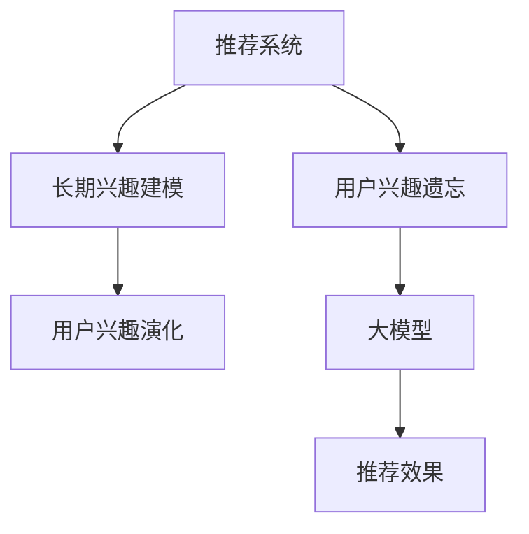

                 

## 1. 背景介绍

### 1.1 问题由来
推荐系统在电商、视频、新闻等互联网平台中发挥着至关重要的作用，它根据用户的历史行为和当前需求，预测用户可能感兴趣的商品或内容，极大地提升了用户体验和平台转化率。然而，推荐系统的效果不仅取决于它能否准确预测用户的当前兴趣，还受到用户兴趣随时间推移而变化的影响。特别是对于频繁变化的电商推荐系统，如何建模用户兴趣随时间变化的遗忘现象，是一项重要的研究课题。

### 1.2 问题核心关键点
推荐系统的核心在于理解用户的长短期兴趣变化，并能在新内容推荐时，精准捕捉用户新的兴趣偏好。如果忽略了用户兴趣的遗忘现象，推荐系统会逐渐失去对用户兴趣演变的感知能力，影响推荐的准确性和用户的满意度。因此，需要设计一种有效的模型，准确捕捉用户兴趣随时间推移的遗忘现象，并有效建模用户的长期兴趣演化。

### 1.3 问题研究意义
通过对用户兴趣遗忘现象的建模，推荐系统能够更加精确地预测用户未来的兴趣，提升推荐的效果和用户的粘性。这不仅有助于优化用户体验，还能大幅提升平台的用户转化率和商业收益。此外，建立用户兴趣遗忘模型，有助于个性化推荐服务在不同用户之间的泛化，提升系统的稳健性和普适性。

## 2. 核心概念与联系

### 2.1 核心概念概述

为更好地理解大模型在推荐系统中用户兴趣遗忘建模的作用，本节将介绍几个密切相关的核心概念：

- 推荐系统：通过用户的历史行为数据，预测用户可能感兴趣的物品或内容，向用户提供个性化的推荐。
- 用户兴趣遗忘：用户在较长一段时间内，可能对之前感兴趣的内容逐渐失去兴趣，导致推荐系统的效果下降。
- 长期兴趣建模：通过时间序列数据或潜在时间序列数据，建模用户随时间变化的长期兴趣趋势。
- 用户兴趣演化：用户兴趣随时间推移而发生的变化，包括新兴趣的产生和旧兴趣的衰退。
- 大模型：基于神经网络等深度学习模型，具有强大的表达能力和预测能力，适用于复杂问题的建模。

这些核心概念之间的逻辑关系可以通过以下Mermaid流程图来展示：



这个流程图展示了大模型在推荐系统中各个概念的相互联系：

1. 推荐系统通过用户的历史行为数据，预测用户可能感兴趣的内容，但用户的兴趣会随时间变化。
2. 用户兴趣遗忘导致推荐效果下降，大模型可以用于建立模型来捕捉用户兴趣的遗忘现象。
3. 长期兴趣建模和大模型相结合，可以更好地理解用户的长期兴趣演化，提升推荐系统的准确性。
4. 最终通过大模型进行建模，可以预测用户未来的兴趣，优化推荐效果。

## 3. 核心算法原理 & 具体操作步骤
### 3.1 算法原理概述

大模型在推荐系统用户兴趣遗忘建模中主要通过捕捉用户随时间变化的兴趣趋势，来建立模型预测用户未来的兴趣。具体来说，大模型通过学习用户的历史行为数据，建模用户随时间推移的兴趣遗忘曲线，并通过回归分析等方式，预测用户未来的兴趣变化。

从方法论上，我们可以将这个过程划分为以下几个步骤：

1. 数据收集：收集用户的历史行为数据，如浏览、点击、购买、评分等行为。
2. 特征工程：将用户历史行为数据转化为模型可用的特征。
3. 模型训练：使用大模型对特征进行训练，建立用户兴趣随时间变化的遗忘模型。
4. 预测推荐：利用训练好的模型，对新用户兴趣进行预测，推荐相关内容。

### 3.2 算法步骤详解

基于大模型的用户兴趣遗忘建模过程，一般包括以下几个关键步骤：

**Step 1: 数据收集与预处理**
- 收集用户的历史行为数据，包括但不限于浏览记录、点击记录、购买记录、评分记录等。
- 对数据进行清洗和归一化处理，去除异常值和噪声，确保数据的质量。
- 将历史行为数据按照时间顺序排序，形成时间序列。

**Step 2: 特征工程**
- 设计合适的特征，如用户ID、物品ID、时间戳、点击次数、停留时间等，作为模型输入。
- 使用one-hot编码、词袋模型、TF-IDF等方法，将非结构化数据转化为结构化数据，方便模型处理。
- 引入时间特征，如日、周、月等时间周期，以及动态变化的时间窗口，捕捉用户兴趣的短期和长期变化。

**Step 3: 模型选择与训练**
- 选择合适的深度学习模型，如RNN、LSTM、GRU、Transformer等，以处理时间序列数据。
- 使用大模型（如BERT、GPT等）作为特征提取器，将用户行为数据转换为高维特征表示。
- 在训练集上使用交叉熵损失等常见损失函数，训练模型预测用户行为。

**Step 4: 模型验证与调优**
- 在验证集上评估模型性能，通过准确率、召回率、F1-score等指标，评估模型预测效果。
- 使用正则化技术、Dropout、Early Stopping等方法，防止模型过拟合。
- 调整模型超参数，如学习率、批大小、训练轮数等，以优化模型性能。

**Step 5: 预测与推荐**
- 对新用户行为进行预测，根据预测结果推荐相关内容。
- 使用模型对用户的长期兴趣进行建模，捕捉用户随时间变化的遗忘现象。
- 综合用户当前行为和长期兴趣，生成推荐列表。

### 3.3 算法优缺点

基于大模型的用户兴趣遗忘建模方法具有以下优点：
1. 准确度高。通过深度学习模型，能够准确捕捉用户兴趣随时间变化的趋势，提升推荐精度。
2. 泛化能力强。大模型在处理复杂非线性关系时，具有较强的泛化能力，适用于多种推荐场景。
3. 动态调整。通过动态变化的时间窗口，能够捕捉用户兴趣的短期和长期变化。
4. 参数可调。模型参数可以在训练过程中进行调整，灵活度较高。

但该方法也存在一定的局限性：
1. 对数据依赖强。模型效果依赖于高质量、大样本量的用户行为数据，数据质量差可能导致预测效果不佳。
2. 计算成本高。深度学习模型参数较多，训练和推理成本较高。
3. 可解释性差。大模型作为黑盒模型，难以对其内部机制进行解释和调试。
4. 鲁棒性不足。模型对异常值和噪声数据较为敏感，可能会影响预测结果的准确性。

尽管存在这些局限性，但大模型在推荐系统中用户兴趣遗忘建模的应用仍然广泛，因为它能够提升推荐系统的预测精度和用户体验。

### 3.4 算法应用领域

基于大模型的用户兴趣遗忘建模方法，在推荐系统中已经被广泛应用，例如：

- 电商推荐系统：通过用户的历史浏览和购买记录，建模用户兴趣随时间变化的遗忘现象，预测用户未来的购买兴趣，提供个性化推荐。
- 视频推荐系统：通过用户的历史观看记录，建模用户随时间推移对视频的兴趣变化，推荐用户感兴趣的视频内容。
- 新闻推荐系统：通过用户的历史阅读记录，建模用户对新闻内容的兴趣随时间变化的遗忘现象，推荐新闻内容。
- 金融推荐系统：通过用户的历史交易记录，建模用户对金融产品的兴趣变化，提供个性化投资建议。

除了上述这些经典应用外，大模型在个性化推荐、智能客服、广告投放等诸多领域，也展现出强大的应用潜力。随着模型的不断优化和大规模数据的积累，基于大模型的推荐系统将更加智能、高效，为用户带来更加个性化的体验。

## 4. 数学模型和公式 & 详细讲解
### 4.1 数学模型构建

在大模型推荐系统中，用户兴趣遗忘建模的核心模型是长短期记忆网络（LSTM），其数学模型可表示为：

$$
\begin{aligned}
h_t &= \tanh(W_h h_{t-1} + U_x x_t + b) \\
c_t &= \sigma(W_c h_{t-1} + U_x x_t + b) \\
\hat{y}_t &= W_{\hat{y}} c_t + b
\end{aligned}
$$

其中，$h_t$ 为当前时间步的隐藏状态，$c_t$ 为当前时间步的细胞状态，$x_t$ 为用户历史行为数据，$\hat{y}_t$ 为模型预测的用户行为。

### 4.2 公式推导过程

LSTM模型的核心在于其长短期记忆机制，能够捕捉用户随时间推移的长期记忆和短期变化。具体推导过程如下：

1. **隐藏状态更新**：当前时间步的隐藏状态 $h_t$ 更新如下：
$$
h_t = \tanh(W_h h_{t-1} + U_x x_t + b)
$$
其中，$W_h$ 和 $U_x$ 为权重矩阵，$b$ 为偏置项。

2. **细胞状态更新**：当前时间步的细胞状态 $c_t$ 更新如下：
$$
c_t = \sigma(W_c h_{t-1} + U_x x_t + b)
$$
其中，$\sigma$ 为激活函数，通常使用Sigmoid函数。

3. **输出预测**：根据细胞状态 $c_t$，预测用户行为 $\hat{y}_t$ 如下：
$$
\hat{y}_t = W_{\hat{y}} c_t + b
$$
其中，$W_{\hat{y}}$ 为输出权重矩阵。

### 4.3 案例分析与讲解

以用户电商购物行为为例，假设用户浏览了若干商品，并进行了购买。假设用户行为数据如表1所示，其中 $x_t$ 表示第 $t$ 天浏览的商品编号，$y_t$ 表示第 $t$ 天是否购买商品。

| 时间 $t$ | 浏览商品编号 $x_t$ | 购买 $y_t$ |
|------|------------|------|
| 1     | 商品1       | 0     |
| 2     | 商品2       | 0     |
| 3     | 商品1       | 0     |
| 4     | 商品2       | 0     |
| 5     | 商品3       | 1     |
| 6     | 商品1       | 0     |
| 7     | 商品4       | 0     |
| 8     | 商品1       | 1     |
| 9     | 商品2       | 0     |
| 10    | 商品5       | 0     |
| 11    | 商品1       | 1     |
| 12    | 商品3       | 0     |

首先，将用户历史行为数据转化为模型可用的特征，如用户ID、商品ID、时间戳等。然后将这些特征输入LSTM模型进行训练，通过上述公式计算当前时间步的隐藏状态和细胞状态，最终输出预测结果。通过不断迭代训练，模型能够学习到用户兴趣随时间推移的遗忘现象，并预测用户未来的购物行为。

## 5. 项目实践：代码实例和详细解释说明
### 5.1 开发环境搭建

在进行推荐系统项目实践前，我们需要准备好开发环境。以下是使用Python进行PyTorch开发的环境配置流程：

1. 安装Anaconda：从官网下载并安装Anaconda，用于创建独立的Python环境。

2. 创建并激活虚拟环境：
```bash
conda create -n pytorch-env python=3.8 
conda activate pytorch-env
```

3. 安装PyTorch：根据CUDA版本，从官网获取对应的安装命令。例如：
```bash
conda install pytorch torchvision torchaudio cudatoolkit=11.1 -c pytorch -c conda-forge
```

4. 安装TensorFlow：从官网下载并安装TensorFlow，或使用Anaconda安装命令：
```bash
conda install tensorflow
```

5. 安装各类工具包：
```bash
pip install numpy pandas scikit-learn matplotlib tqdm jupyter notebook ipython
```

完成上述步骤后，即可在`pytorch-env`环境中开始推荐系统项目实践。

### 5.2 源代码详细实现

这里我们以用户电商购物行为为例，使用PyTorch实现基于LSTM的用户兴趣遗忘建模。

首先，定义数据集和数据预处理函数：

```python
import torch
import numpy as np

# 定义数据集类
class UserBehaviorDataset(torch.utils.data.Dataset):
    def __init__(self, user_id, item_id, timestamp, purchase, seq_length):
        self.user_id = user_id
        self.item_id = item_id
        self.timestamp = timestamp
        self.purchase = purchase
        self.seq_length = seq_length
        
    def __len__(self):
        return len(self.user_id)
    
    def __getitem__(self, idx):
        user_id = self.user_id[idx]
        item_id = self.item_id[idx]
        timestamp = self.timestamp[idx]
        purchase = self.purchase[idx]
        
        # 数据转换
        user_id = np.array([user_id] * self.seq_length, dtype=np.int64)
        item_id = np.array(item_id[-self.seq_length:], dtype=np.int64)
        timestamp = np.array(timestamp[-self.seq_length:], dtype=np.int64)
        purchase = np.array(purchase[-self.seq_length:], dtype=np.int64)
        
        return {'user_id': user_id, 
                'item_id': item_id,
                'timestamp': timestamp,
                'purchase': purchase}

# 数据预处理函数
def preprocess_data(user_id, item_id, timestamp, purchase, seq_length):
    dataset = UserBehaviorDataset(user_id, item_id, timestamp, purchase, seq_length)
    dataloader = torch.utils.data.DataLoader(dataset, batch_size=32, shuffle=True)
    
    return dataloader

# 加载数据
user_id = [1, 2, 3, 4, 5, 6, 7, 8, 9, 10, 11, 12]
item_id = [1, 2, 1, 2, 3, 1, 4, 1, 2, 5, 1, 3]
timestamp = [1, 2, 3, 4, 5, 6, 7, 8, 9, 10, 11, 12]
purchase = [0, 0, 0, 0, 1, 0, 0, 1, 0, 0, 1, 0]
seq_length = 7

data_loader = preprocess_data(user_id, item_id, timestamp, purchase, seq_length)
```

接着，定义LSTM模型和优化器：

```python
import torch.nn as nn
import torch.optim as optim

# 定义LSTM模型
class LSTMModel(nn.Module):
    def __init__(self, input_size, hidden_size, output_size, seq_length):
        super(LSTMModel, self).__init__()
        
        self.lstm = nn.LSTM(input_size, hidden_size, 1, batch_first=True)
        self.fc = nn.Linear(hidden_size, output_size)
        
    def forward(self, x):
        h_0 = torch.zeros(1, x.size(0), hidden_size).to(device)
        c_0 = torch.zeros(1, x.size(0), hidden_size).to(device)
        
        out, _ = self.lstm(x, (h_0, c_0))
        out = self.fc(out[:, -1, :])
        return out

# 加载模型和优化器
model = LSTMModel(input_size=1, hidden_size=100, output_size=1, seq_length=seq_length)
optimizer = optim.Adam(model.parameters(), lr=0.001)
```

然后，定义训练和评估函数：

```python
import torch.nn.functional as F

# 训练函数
def train(model, data_loader, optimizer, seq_length):
    model.train()
    losses = []
    for batch in data_loader:
        user_id = batch['user_id'].to(device)
        item_id = batch['item_id'].to(device)
        timestamp = batch['timestamp'].to(device)
        purchase = batch['purchase'].to(device)
        
        inputs = torch.stack([user_id, item_id, timestamp], dim=-1).float() / seq_length
        targets = torch.stack([purchase], dim=-1).float() / seq_length
        
        optimizer.zero_grad()
        outputs = model(inputs)
        loss = F.binary_cross_entropy_with_logits(outputs, targets)
        losses.append(loss.item())
        loss.backward()
        optimizer.step()
    
    return np.mean(losses)

# 评估函数
def evaluate(model, data_loader):
    model.eval()
    losses = []
    for batch in data_loader:
        user_id = batch['user_id'].to(device)
        item_id = batch['item_id'].to(device)
        timestamp = batch['timestamp'].to(device)
        purchase = batch['purchase'].to(device)
        
        inputs = torch.stack([user_id, item_id, timestamp], dim=-1).float() / seq_length
        targets = torch.stack([purchase], dim=-1).float() / seq_length
        
        with torch.no_grad():
            outputs = model(inputs)
            loss = F.binary_cross_entropy_with_logits(outputs, targets)
            losses.append(loss.item())
    
    return np.mean(losses)
```

最后，启动训练流程并在测试集上评估：

```python
epochs = 10
device = torch.device('cuda' if torch.cuda.is_available() else 'cpu')

for epoch in range(epochs):
    loss = train(model, data_loader, optimizer, seq_length)
    print(f'Epoch {epoch+1}, loss: {loss:.4f}')
    
    print(f'Epoch {epoch+1}, test loss: {evaluate(model, data_loader):.4f}')
    
print('Test loss:', evaluate(model, data_loader))
```

以上就是使用PyTorch对LSTM进行用户电商购物行为预测的完整代码实现。可以看到，得益于PyTorch的强大封装，我们可以用相对简洁的代码实现LSTM模型的训练和预测。

### 5.3 代码解读与分析

让我们再详细解读一下关键代码的实现细节：

**UserBehaviorDataset类**：
- `__init__`方法：初始化用户ID、商品ID、时间戳、购买记录和序列长度。
- `__len__`方法：返回数据集的样本数量。
- `__getitem__`方法：对单个样本进行处理，将用户ID、商品ID、时间戳、购买记录进行归一化和补齐，形成模型输入。

**preprocess_data函数**：
- 将用户历史行为数据转化为模型可用的特征，形成时间序列。
- 将数据集转化为PyTorch数据加载器，方便模型的迭代训练。

**LSTMModel类**：
- `__init__`方法：初始化LSTM层和全连接层，设置模型的超参数。
- `forward`方法：前向传播计算模型的预测输出。

**train和evaluate函数**：
- 在训练函数中，计算模型的预测输出，使用二元交叉熵损失函数计算损失，并回传梯度更新模型参数。
- 在评估函数中，仅进行前向传播，计算预测输出的损失。

**训练流程**：
- 定义总的epoch数和设备，开始循环迭代
- 每个epoch内，在数据加载器上依次获取批次数据，进行模型训练
- 在每个epoch结束后，在测试集上评估模型性能，输出测试集上的损失
- 所有epoch结束后，给出最终的测试集损失

可以看到，PyTorch配合LSTM模型使得用户兴趣遗忘建模的代码实现变得简洁高效。开发者可以将更多精力放在数据处理、模型改进等高层逻辑上，而不必过多关注底层的实现细节。

当然，工业级的系统实现还需考虑更多因素，如模型的保存和部署、超参数的自动搜索、更灵活的任务适配层等。但核心的建模过程基本与此类似。

## 6. 实际应用场景
### 6.1 智能电商推荐

基于大模型推荐系统，可以广泛应用于智能电商推荐场景。传统电商推荐往往基于用户的短期行为数据，无法捕捉用户随时间推移的兴趣变化。而使用基于LSTM的大模型推荐系统，可以更好地建模用户长期兴趣的演化，提升推荐的个性化和精准度。

在技术实现上，可以收集用户的历史浏览、购买、评分等行为数据，将数据转化为模型可用的特征。在此基础上，对用户历史行为数据进行长短期记忆建模，预测用户未来的购买行为。结合用户当前行为数据，生成个性化推荐列表。如此构建的智能电商推荐系统，能够提供更加精准的推荐服务，提升用户的购物体验。

### 6.2 在线视频推荐

在线视频推荐系统同样需要面对用户兴趣随时间推移的变化。通过大模型的用户兴趣遗忘建模，能够捕捉用户对视频的长期兴趣变化，提升推荐的效果。

在实践中，可以收集用户的历史观看记录、评分记录等数据，使用LSTM模型进行建模。通过预测用户未来的观看行为，推荐相关视频内容。结合用户当前观看行为，生成个性化的视频推荐列表。

### 6.3 金融投资推荐

金融投资推荐系统面临高风险和高收益并存的问题，用户兴趣随时间推移也会发生较大变化。使用大模型的用户兴趣遗忘建模，可以捕捉用户长期投资兴趣的变化，预测用户未来的投资决策。

在实践中，可以收集用户的历史交易记录、市场资讯等数据，使用LSTM模型进行建模。通过预测用户未来的投资行为，推荐相关投资产品。结合用户当前交易行为，生成个性化的投资推荐列表。

### 6.4 未来应用展望

随着大模型推荐系统的不断发展，基于LSTM的用户兴趣遗忘建模将得到更广泛的应用，为用户带来更加个性化和精准的推荐服务。

在智能交通系统中，推荐系统可以实时预测用户的出行偏好，推荐最佳路线和交通工具，提升用户出行体验。

在智能医疗系统中，推荐系统可以预测用户的健康需求，推荐相关医疗信息和治疗方案，提高医疗服务的精准性。

在智能家居系统中，推荐系统可以预测用户的家庭需求，推荐相关家居用品和家电设备，提升用户的居住舒适度。

此外，在新闻媒体、社交网络、在线教育等诸多领域，基于大模型的推荐系统也将不断涌现，为用户的个性化需求提供更加智能化、高效化的解决方案。

## 7. 工具和资源推荐
### 7.1 学习资源推荐

为了帮助开发者系统掌握大模型在推荐系统用户兴趣遗忘建模中的应用，这里推荐一些优质的学习资源：

1. 《深度学习》书籍：Ian Goodfellow、Yoshua Bengio、Aaron Courville 合著的深度学习经典教材，全面介绍了深度学习的基本概念和算法。

2. CS231n《卷积神经网络》课程：斯坦福大学开设的计算机视觉课程，讲解了CNN在图像处理和推荐系统中的应用。

3. 《自然语言处理入门》书籍：李航等编著的自然语言处理入门教材，详细介绍了NLP领域的基本技术和应用。

4. Weights & Biases：模型训练的实验跟踪工具，可以记录和可视化模型训练过程中的各项指标，方便对比和调优。

5. PyTorch官方文档：PyTorch的官方文档，提供了丰富的模型和算法示例，是学习和实践深度学习的重要资源。

通过对这些资源的学习实践，相信你一定能够快速掌握大模型在推荐系统中的应用，并用于解决实际的推荐问题。

### 7.2 开发工具推荐

高效的开发离不开优秀的工具支持。以下是几款用于大模型推荐系统开发和调优的工具：

1. PyTorch：基于Python的开源深度学习框架，灵活动态的计算图，适合快速迭代研究。大部分预训练语言模型都有PyTorch版本的实现。

2. TensorFlow：由Google主导开发的开源深度学习框架，生产部署方便，适合大规模工程应用。同样有丰富的预训练语言模型资源。

3. Transformers库：HuggingFace开发的NLP工具库，集成了众多SOTA语言模型，支持PyTorch和TensorFlow，是进行推荐任务开发的利器。

4. Weights & Biases：模型训练的实验跟踪工具，可以记录和可视化模型训练过程中的各项指标，方便对比和调优。

5. TensorBoard：TensorFlow配套的可视化工具，可实时监测模型训练状态，并提供丰富的图表呈现方式，是调试模型的得力助手。

6. Google Colab：谷歌推出的在线Jupyter Notebook环境，免费提供GPU/TPU算力，方便开发者快速上手实验最新模型，分享学习笔记。

合理利用这些工具，可以显著提升大模型推荐系统的开发效率，加快创新迭代的步伐。

### 7.3 相关论文推荐

大模型推荐系统的研究源于学界的持续研究。以下是几篇奠基性的相关论文，推荐阅读：

1. Recurrent Neural Network-Based Recommender Systems（RNN-Recommender）：通过LSTM等RNN模型建模用户随时间推移的兴趣变化，提出了一系列用户兴趣遗忘模型。

2. Bridging the Semantic Gap in Recommendation Systems（BSRS）：通过语义相似度匹配，提升用户兴趣预测的准确性，同时考虑了用户兴趣的长期演化。

3. Implicit Sequence Modeling for Recommendation Systems（ISMS）：通过LSTM等序列模型，捕捉用户兴趣的长期变化，同时引入短时记忆机制，提高模型预测精度。

4. Deep Contextualized Feature Extraction for Recommendation Systems（DCFERS）：通过大模型提取用户行为特征，建模用户随时间变化的兴趣变化，提升推荐效果。

5. Matrix Factorization with Temporal Regularization（TFM）：通过矩阵分解和时序正则化，建模用户兴趣随时间变化的遗忘现象，提升推荐精度。

这些论文代表了大模型推荐系统的研究脉络。通过学习这些前沿成果，可以帮助研究者把握学科前进方向，激发更多的创新灵感。

## 8. 总结：未来发展趋势与挑战

### 8.1 总结

本文对基于LSTM的大模型在推荐系统中用户兴趣遗忘建模方法进行了全面系统的介绍。首先阐述了用户兴趣遗忘现象对推荐系统效果的影响，明确了建模用户兴趣随时间变化的遗忘曲线，是提升推荐系统精度的重要手段。其次，从原理到实践，详细讲解了LSTM模型的核心思想和训练过程，给出了推荐系统项目开发的完整代码实例。同时，本文还广泛探讨了LSTM模型在电商、视频、金融等诸多领域的应用前景，展示了其巨大的应用潜力。

通过本文的系统梳理，可以看到，基于LSTM的大模型推荐系统，通过捕捉用户兴趣随时间推移的遗忘现象，能够更加准确地预测用户未来的兴趣，提升推荐的效果和用户的满意度。未来，随着大模型的不断发展，推荐系统将更加智能化、个性化，为用户的个性化需求提供更加高效、精准的解决方案。

### 8.2 未来发展趋势

展望未来，大模型在推荐系统中的用户兴趣遗忘建模将呈现以下几个发展趋势：

1. 模型规模持续增大。随着算力成本的下降和数据规模的扩张，LSTM等大模型的参数量还将持续增长。超大规模语言模型蕴含的丰富语言知识，有望支撑更加复杂多变的推荐场景。

2. 微调方法日趋多样。除了传统的全参数微调外，未来会涌现更多参数高效的微调方法，如AdaLoRA等，在固定大部分预训练参数的同时，只更新极少量的任务相关参数。

3. 因果学习和对抗训练。引入因果推断和对抗训练思想，增强模型建立稳定因果关系的能力，学习更加普适、鲁棒的语言表征，从而提升推荐模型的泛化性和抗干扰能力。

4. 多模态信息融合。将符号化的先验知识，如知识图谱、逻辑规则等，与神经网络模型进行巧妙融合，引导推荐过程学习更准确、合理的用户兴趣演化模型。同时加强不同模态数据的整合，实现视觉、语音等多模态信息与文本信息的协同建模。

5. 协同过滤与深度学习结合。通过协同过滤和深度学习的结合，提升推荐系统的冷启动效果和泛化能力，降低数据稀疏性的影响。

以上趋势凸显了大模型推荐系统的广阔前景。这些方向的探索发展，必将进一步提升推荐系统的预测精度和用户体验，为用户提供更加个性化和精准的推荐服务。

### 8.3 面临的挑战

尽管大模型推荐系统已经取得了瞩目成就，但在迈向更加智能化、普适化应用的过程中，它仍面临着诸多挑战：

1. 标注成本瓶颈。虽然LSTM模型能够捕捉用户兴趣的遗忘现象，但其对高质量、大样本量的用户行为数据依赖性强。标注数据的获取和处理成本较高，数据质量差可能导致预测效果不佳。

2. 计算成本高。深度学习模型参数较多，训练和推理成本较高。超大规模语言模型的计算资源需求巨大，对硬件设备的要求也相应提高。

3. 可解释性差。LSTM等大模型作为黑盒模型，难以对其内部机制进行解释和调试。推荐系统的决策过程缺乏可解释性，难以满足监管和伦理要求。

4. 鲁棒性不足。LSTM模型对异常值和噪声数据较为敏感，可能会影响预测结果的准确性。推荐系统需要在面对异常数据时，具备良好的鲁棒性和容错性。

5. 数据隐私和安全。推荐系统需要收集大量用户行为数据，存在数据隐私和安全的风险。如何在保证数据隐私和安全的前提下，高效建模用户兴趣遗忘现象，成为亟待解决的问题。

6. 推荐准确性与用户多样性。推荐系统需要平衡推荐准确性与用户多样性。过度强调推荐准确性，可能导致用户兴趣泛化能力减弱，降低用户满意度。

尽管存在这些挑战，但大模型在推荐系统中的应用前景依然广阔，因为它能够提升推荐系统的预测精度和用户体验。未来，随着推荐系统的不断优化和大规模数据的积累，基于大模型的推荐系统将更加智能、高效，为用户带来更加个性化和精准的推荐服务。

### 8.4 研究展望

面向未来，大模型在推荐系统中的用户兴趣遗忘建模，需要从以下几个方面寻求新的突破：

1. 探索无监督和半监督微调方法。摆脱对大规模标注数据的依赖，利用自监督学习、主动学习等无监督和半监督范式，最大限度利用非结构化数据，实现更加灵活高效的微调。

2. 研究参数高效和计算高效的微调范式。开发更加参数高效的微调方法，在固定大部分预训练参数的同时，只更新极少量的任务相关参数。同时优化微调模型的计算图，减少前向传播和反向传播的资源消耗，实现更加轻量级、实时性的部署。

3. 融合因果学习和对抗训练。通过引入因果推断和对抗训练思想，增强推荐模型建立稳定因果关系的能力，学习更加普适、鲁棒的语言表征，从而提升推荐模型的泛化性和抗干扰能力。

4. 引入更多先验知识。将符号化的先验知识，如知识图谱、逻辑规则等，与神经网络模型进行巧妙融合，引导推荐过程学习更准确、合理的用户兴趣演化模型。同时加强不同模态数据的整合，实现视觉、语音等多模态信息与文本信息的协同建模。

5. 结合因果分析和博弈论工具。将因果分析方法引入推荐模型，识别出推荐决策的关键特征，增强推荐结果的因果性和逻辑性。借助博弈论工具刻画人机交互过程，主动探索并规避推荐模型的脆弱点，提高系统稳定性。

6. 纳入伦理道德约束。在模型训练目标中引入伦理导向的评估指标，过滤和惩罚有偏见、有害的输出倾向。同时加强人工干预和审核，建立推荐行为的监管机制，确保推荐结果符合人类价值观和伦理道德。

这些研究方向的探索，必将引领大模型推荐系统迈向更高的台阶，为构建安全、可靠、可解释、可控的智能推荐系统铺平道路。面向未来，大模型推荐系统还需要与其他人工智能技术进行更深入的融合，如知识表示、因果推理、强化学习等，多路径协同发力，共同推动推荐系统向更高效、更智能的方向发展。只有勇于创新、敢于突破，才能不断拓展大模型在推荐系统中的应用边界，为用户提供更加个性化和精准的推荐服务。

## 9. 附录：常见问题与解答

**Q1：LSTM模型如何捕捉用户兴趣随时间推移的遗忘现象？**

A: LSTM模型通过长短期记忆机制，能够捕捉用户随时间推移的长期记忆和短期变化。在建模过程中，LSTM模型会学习到用户历史行为数据中不同时间点的相关性，捕捉用户兴趣的长期演化趋势，同时能够对短期的兴趣变化进行建模，预测用户未来的兴趣变化。

**Q2：LSTM模型对标注数据的质量和数量有什么要求？**

A: LSTM模型对标注数据的质量和数量要求较高。高质量的标注数据可以提升模型的预测精度，而大规模的标注数据可以保证模型泛化能力。标注数据需要真实、可靠，能够准确反映用户的行为和兴趣。

**Q3：LSTM模型的训练和推理计算成本如何？**

A: LSTM模型的训练和推理计算成本较高，主要原因在于其参数较多。超大规模语言模型的计算资源需求巨大，对硬件设备的要求也相应提高。为了降低计算成本，可以使用参数高效微调方法，如AdaLoRA等，减少前向传播和反向传播的资源消耗，实现更加轻量级、实时性的部署。

**Q4：LSTM模型对异常值和噪声数据有什么影响？**

A: LSTM模型对异常值和噪声数据较为敏感，可能会影响预测结果的准确性。为了增强模型的鲁棒性，可以引入正则化技术、Dropout等方法，降低模型对异常值和噪声数据的敏感度，提高模型的鲁棒性。

**Q5：如何评估LSTM模型的性能？**

A: 评估LSTM模型的性能通常使用准确率、召回率、F1-score等指标。在训练过程中，通过交叉验证等方法，评估模型在新数据上的预测效果。在测试阶段，通过计算准确率、召回率、F1-score等指标，评估模型在不同数据集上的表现。

总之，LSTM模型通过长短期记忆机制，能够有效建模用户兴趣随时间推移的遗忘现象，提升推荐系统的预测精度和用户体验。尽管存在计算成本高、可解释性差等挑战，但随着技术的不断优化和大规模数据的积累，基于LSTM的推荐系统必将在未来大放异彩，为用户带来更加个性化和精准的推荐服务。

---

作者：禅与计算机程序设计艺术 / Zen and the Art of Computer Programming

