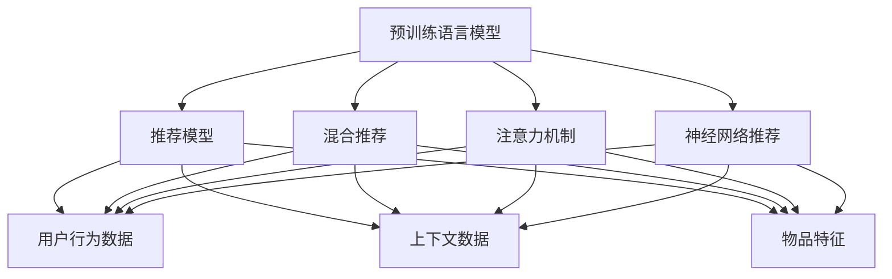

                 

# 大模型在推荐系统的未来发展：统一与融合趋势

## 1. 背景介绍

推荐系统（Recommendation System, RS）是现代互联网不可或缺的重要组成部分，通过深度学习技术的发展，推荐系统已经从单一的协同过滤（Collaborative Filtering）算法，逐步扩展到混合推荐算法、神经网络推荐算法等。然而，这些算法始终基于用户-物品交互历史数据进行推荐，未充分考虑用户上下文、实时环境、物品特征等多维度信息。

近年来，大规模预训练语言模型（Big Language Models, BigLMs）在自然语言处理（NLP）领域取得巨大成功，相关模型如BERT、GPT等表现出超强的泛化能力和自然语言生成能力。本文将探讨基于大模型推荐系统的未来发展方向，着重分析大模型在推荐系统中的统一与融合趋势。

## 2. 核心概念与联系

### 2.1 核心概念概述

为了更深入理解大模型在推荐系统中的应用，本节将详细解释以下几个核心概念：

- 推荐系统：通过分析用户的历史行为和偏好，为用户推荐感兴趣的物品（如商品、视频、音乐等）。推荐系统分为基于用户和基于内容的两种主流算法。
- 预训练语言模型：利用大规模无标签文本数据进行自监督预训练，学习丰富的语言知识，具备强大的文本表示能力。如BERT、GPT等模型。
- 大模型：指参数量在百亿级别以上的预训练语言模型，拥有海量的知识储备和强大的泛化能力。
- 混合推荐：结合基于用户和基于内容的推荐方法，综合利用多维信息进行推荐。
- 注意力机制（Attention Mechanism）：一种机制，用于在序列中动态分配注意力权重，选择重要信息进行组合。
- 神经网络推荐：使用神经网络架构进行推荐，能够自动学习并整合多维数据特征。

通过大模型在推荐系统中的应用，融合上下文信息、实时环境、物品特征等多维度数据，实现更精准、多样、实时的推荐。

### 2.2 核心概念原理和架构的 Mermaid 流程图



该流程图展示了预训练语言模型如何与推荐模型进行结合：

1. 预训练语言模型通过自监督学习获取语言知识，形成通用语义表示。
2. 推荐模型通过结合用户行为数据、上下文信息和物品特征，生成推荐结果。
3. 注意力机制和神经网络推荐进一步优化推荐模型的效果。
4. 用户行为数据、上下文数据和物品特征，进一步丰富推荐模型输入，提升推荐精度。

## 3. 核心算法原理 & 具体操作步骤

### 3.1 算法原理概述

大模型在推荐系统中的应用主要基于三个关键步骤：预训练、微调和融合。

1. **预训练**：使用大规模无标签文本数据，对预训练语言模型进行训练，使其获得通用的语言知识。
2. **微调**：根据特定推荐任务的标注数据，在大模型基础上进行微调，学习领域特定的知识，提升模型针对该任务的性能。
3. **融合**：将预训练语言模型和推荐模型进行融合，利用语言知识丰富推荐结果，提升推荐效果。

### 3.2 算法步骤详解

基于大模型的推荐系统主要包括以下几个关键步骤：

**Step 1: 准备预训练语言模型和推荐任务数据集**

- 选择合适的预训练语言模型，如BERT、GPT等，作为初始化参数。
- 收集推荐任务的标注数据集，划分为训练集、验证集和测试集。数据集需要包含用户行为、上下文信息和物品特征等多维数据。

**Step 2: 添加任务适配层**

- 在预训练语言模型的顶层设计合适的输出层和损失函数。
- 对于推荐任务，通常使用交叉熵损失函数。
- 设计合适的解码器，生成推荐结果。

**Step 3: 设置微调超参数**

- 选择合适的优化算法及其参数，如AdamW、SGD等，设置学习率、批大小、迭代轮数等。
- 设置正则化技术及强度，包括权重衰减、Dropout、Early Stopping等。
- 确定冻结预训练参数的策略，如仅微调顶层，或全部参数都参与微调。

**Step 4: 执行梯度训练**

- 将训练集数据分批次输入模型，前向传播计算损失函数。
- 反向传播计算参数梯度，根据设定的优化算法和学习率更新模型参数。
- 周期性在验证集上评估模型性能，根据性能指标决定是否触发 Early Stopping。
- 重复上述步骤直至满足预设的迭代轮数或 Early Stopping 条件。

**Step 5: 测试和部署**

- 在测试集上评估微调后模型在推荐任务上的性能，对比微调前后的精度提升。
- 使用微调后的模型对新样本进行推理预测，集成到实际的应用系统中。
- 持续收集新的数据，定期重新微调模型，以适应数据分布的变化。

### 3.3 算法优缺点

基于大模型的推荐系统具有以下优点：

- 强大的泛化能力：预训练语言模型拥有海量的知识储备，能够显著提升推荐结果的多样性和相关性。
- 自动学习：使用大模型进行推荐，能够自动学习并整合多维数据特征，提升推荐效果。
- 参数高效微调：在大模型基础上进行微调，可以保持大部分预训练参数不变，只调整少量任务相关参数，避免过拟合。

然而，该方法也存在一定的局限性：

- 标注数据需求：微调推荐系统对标注数据的需求较高，获取高质量标注数据的成本较高。
- 模型规模较大：大模型参数量庞大，对计算资源和存储资源要求较高。
- 可解释性不足：大模型作为"黑盒"，难以解释推荐过程，缺乏透明度。
- 对抗性问题：大模型在对抗性攻击下，推荐结果可能受到较大影响。

### 3.4 算法应用领域

基于大模型的推荐系统已经在多个领域得到广泛应用，包括：

- 电子商务：根据用户浏览和购买历史，推荐商品和广告。
- 内容平台：如YouTube、Netflix等，推荐视频和影视作品。
- 社交网络：根据用户互动信息，推荐朋友和话题。
- 金融服务：推荐金融产品、股票等。

此外，基于大模型的推荐系统还在健康医疗、教育培训等领域展现出了巨大的潜力。

## 4. 数学模型和公式 & 详细讲解 & 举例说明

### 4.1 数学模型构建

推荐系统通常基于用户和物品之间的评分矩阵 $R_{u,i}$ 进行建模，其中 $u$ 表示用户，$i$ 表示物品。推荐系统的目标是最大化预测评分与真实评分之间的均方误差（Mean Squared Error, MSE），即：

$$
\min_{\theta} \frac{1}{N} \sum_{u,i} (R_{u,i} - \hat{R}_{u,i})^2
$$

其中 $\hat{R}_{u,i}$ 表示模型预测的评分。

### 4.2 公式推导过程

在基于大模型的推荐系统中，可以使用注意力机制（Attention）将用户和物品特征进行加权融合，生成推荐结果。假设用户特征表示为 $x_u$，物品特征表示为 $x_i$，融合后的用户特征表示为 $z_u$，则融合过程可以表示为：

$$
z_u = \alpha(x_u, x_i)
$$

其中 $\alpha(x_u, x_i)$ 表示注意力机制，通常为softmax函数。

假设推荐模型的输出为 $\hat{y}_{u,i}$，则推荐模型的损失函数可以表示为：

$$
\ell(y_{u,i}, \hat{y}_{u,i}) = -(y_{u,i} \log \hat{y}_{u,i} + (1-y_{u,i}) \log (1-\hat{y}_{u,i}))
$$

其中 $y_{u,i}$ 表示用户对物品的真实评分，$\hat{y}_{u,i}$ 表示模型预测的评分。

### 4.3 案例分析与讲解

以电商推荐系统为例，假设用户浏览了多个商品，系统需要为用户推荐可能感兴趣的新商品。此时，可以构建一个用户-物品评分矩阵 $R$，其中 $R_{u,i}$ 表示用户 $u$ 对物品 $i$ 的评分。用户特征可以表示为 $x_u$，物品特征可以表示为 $x_i$。通过预训练语言模型学习到用户和物品的语义表示后，将 $x_u$ 和 $x_i$ 作为输入，输出一个推荐分数 $\hat{y}_{u,i}$。最终，根据 $\hat{y}_{u,i}$ 进行排序，得到推荐结果。

## 5. 项目实践：代码实例和详细解释说明

### 5.1 开发环境搭建

在进行推荐系统开发前，需要准备好开发环境。以下是使用Python进行TensorFlow开发的环境配置流程：

1. 安装Anaconda：从官网下载并安装Anaconda，用于创建独立的Python环境。
2. 创建并激活虚拟环境：
```bash
conda create -n tf-env python=3.8 
conda activate tf-env
```

3. 安装TensorFlow：根据CUDA版本，从官网获取对应的安装命令。例如：
```bash
conda install tensorflow tensorflow-cpu -c tf
```

4. 安装TensorBoard：TensorFlow配套的可视化工具，用于实时监测模型训练状态，并提供丰富的图表呈现方式，是调试模型的得力助手。

5. 安装Weights & Biases：模型训练的实验跟踪工具，可以记录和可视化模型训练过程中的各项指标，方便对比和调优。

### 5.2 源代码详细实现

以下是基于TensorFlow和Attention机制的推荐系统代码实现：

```python
import tensorflow as tf
from tensorflow.keras.layers import Input, Embedding, Dense, Softmax
from tensorflow.keras.models import Model

# 定义模型输入和输出
user_input = Input(shape=(1,), name='user')
item_input = Input(shape=(1,), name='item')
user_embedding = Embedding(input_dim=vocab_size, output_dim=embedding_size)(user_input)
item_embedding = Embedding(input_dim=vocab_size, output_dim=embedding_size)(item_input)

# 构建注意力机制
attention_scores = tf.matmul(tf.transpose(user_embedding), item_embedding)
attention_weights = tf.nn.softmax(attention_scores, axis=1)
attention_output = tf.matmul(user_embedding, attention_weights)

# 定义推荐模型输出
prediction = Dense(1, activation='sigmoid')(attention_output)

# 定义损失函数和优化器
loss = tf.keras.losses.BinaryCrossentropy()
optimizer = tf.keras.optimizers.Adam()

# 定义模型和编译
model = Model(inputs=[user_input, item_input], outputs=prediction)
model.compile(optimizer=optimizer, loss=loss)

# 训练模型
model.fit(train_data, train_labels, epochs=10, validation_data=(val_data, val_labels))
```

### 5.3 代码解读与分析

在以上代码中，我们使用了TensorFlow框架，构建了一个基于Attention机制的推荐系统。

**代码解释：**

- `Input`：定义输入层，用于输入用户和物品的特征向量。
- `Embedding`：定义嵌入层，将用户和物品特征向量映射到高维空间中。
- `Dense`：定义全连接层，将注意力输出映射到预测分数。
- `Softmax`：定义softmax函数，用于计算注意力权重。
- `Model`：定义推荐模型。
- `compile`：编译模型，定义损失函数和优化器。
- `fit`：训练模型。

**代码分析：**

- `user_input` 和 `item_input` 表示用户和物品的特征向量，维度均为1。
- `Embedding` 层将特征向量映射到高维空间中，维度为 `embedding_size`。
- `attention_scores` 表示用户和物品的注意力得分，通过矩阵乘法计算。
- `attention_weights` 表示注意力权重，通过softmax函数计算。
- `attention_output` 表示用户对物品的加权融合特征向量。
- `prediction` 表示预测分数，通过全连接层计算。
- `loss` 表示二元交叉熵损失函数。
- `optimizer` 表示Adam优化器。
- `Model` 表示推荐模型，包含输入层和输出层。
- `compile` 编译模型，指定优化器和损失函数。
- `fit` 训练模型，传入训练数据和标签。

### 5.4 运行结果展示

在训练结束后，可以使用TensorBoard查看模型的训练曲线和损失函数值，确保模型训练收敛。同时，在测试集上评估模型的预测效果，对比微调前后的精度提升。

## 6. 实际应用场景

### 6.1 电商推荐

电商推荐系统利用用户浏览和购买历史，为用户推荐感兴趣的商品。大模型可以在用户浏览记录中提取语义信息，帮助推荐系统发现用户潜在的兴趣点。

### 6.2 视频推荐

视频推荐系统可以根据用户观看历史和评分，为用户推荐感兴趣的视频。大模型可以分析视频的文本描述，学习视频和用户偏好的相关性。

### 6.3 社交网络推荐

社交网络推荐系统可以根据用户互动信息，推荐可能感兴趣的朋友和话题。大模型可以分析用户发表的文本内容，提取用户兴趣点和偏好。

### 6.4 金融服务推荐

金融服务推荐系统可以根据用户的历史交易记录和评分，推荐合适的金融产品和投资建议。大模型可以分析交易记录的文本信息，提升推荐效果。

## 7. 工具和资源推荐

### 7.1 学习资源推荐

为了帮助开发者掌握大模型在推荐系统中的应用，这里推荐一些优质的学习资源：

1. 《推荐系统原理与算法》：介绍推荐系统基本原理和常用算法。
2. 《深度学习与推荐系统》：介绍深度学习在推荐系统中的应用。
3. 《Attention Is All You Need》：介绍注意力机制的基本原理和应用。
4. HuggingFace官方文档：提供大量预训练语言模型和推荐系统模型，适合快速上手实验。

### 7.2 开发工具推荐

大模型在推荐系统中的开发需要依赖深度学习框架和模型库。以下是几个常用的开发工具：

1. TensorFlow：用于深度学习和推荐系统模型开发，支持自动求导和可视化。
2. PyTorch：灵活的深度学习框架，支持动态图和静态图。
3. Keras：高层次的深度学习框架，简化模型构建过程。
4. Weights & Biases：实验跟踪工具，记录和可视化模型训练过程。
5. TensorBoard：模型训练可视化工具，展示模型训练曲线和参数分布。

### 7.3 相关论文推荐

大模型在推荐系统中的应用已经产生了诸多重要研究。以下是几篇奠基性的相关论文：

1. Attention is All You Need：提出自注意力机制，为深度学习模型提供了新的范式。
2. Bidirectional Attention Flow：提出双向注意力机制，用于序列建模和推荐系统。
3. Transformer-XL：提出长短期记忆网络，用于解决长序列建模问题。
4. Hierarchical Attention Networks for Document Classification：将注意力机制应用于文本分类任务。
5. Dense Intent Recognition for Conversational Recommendation：提出基于注意力机制的对话推荐系统。

这些论文代表了推荐系统领域的研究前沿，有助于开发者深入理解大模型在推荐系统中的应用。

## 8. 总结：未来发展趋势与挑战

### 8.1 总结

本文对基于大模型的推荐系统进行了全面系统的介绍。首先阐述了大模型在推荐系统中的应用背景和研究意义，明确了预训练语言模型和大模型在推荐系统中的重要地位。其次，从原理到实践，详细讲解了基于大模型的推荐系统开发流程，包括预训练、微调和融合等关键步骤，并给出了完整的代码实现。同时，本文还广泛探讨了大模型在推荐系统中的实际应用场景，展示了其广泛的应用前景。

通过对这些资源的系统梳理，可以看到，大模型在推荐系统中的应用前景广阔，能够显著提升推荐系统的性能和用户体验。未来，伴随大模型的进一步发展，推荐系统有望在更多领域大放异彩，为各行各业带来新的变革。

### 8.2 未来发展趋势

展望未来，大模型在推荐系统中的应用将呈现以下几个发展趋势：

1. 规模和性能持续提升：随着计算能力的提升，大模型将不断增大参数量，提升推荐精度和多样性。
2. 多模态融合：大模型将逐步融合图像、视频、音频等多模态数据，提升推荐系统对复杂场景的建模能力。
3. 实时推荐：大模型结合实时数据流，实现实时推荐，满足用户即时需求。
4. 跨领域迁移：大模型能够跨领域迁移，提升推荐系统在不同场景下的泛化能力。
5. 个性化推荐：大模型能够深度学习用户偏好，实现更加个性化、精准的推荐。
6. 对抗攻击防御：大模型能够识别和抵御对抗性攻击，提升推荐系统的安全性。

这些趋势将引领大模型在推荐系统中的发展方向，推动推荐系统向更加智能、高效、安全的方向迈进。

### 8.3 面临的挑战

尽管大模型在推荐系统中取得了显著成果，但仍面临诸多挑战：

1. 标注数据需求：高质量标注数据对微调推荐系统至关重要，但获取成本较高。
2. 模型资源消耗：大模型参数量庞大，对计算和存储资源要求较高。
3. 可解释性不足：大模型作为"黑盒"，难以解释推荐过程，缺乏透明度。
4. 对抗性攻击：大模型在对抗性攻击下，推荐结果可能受到较大影响。
5. 数据隐私问题：推荐系统需要处理用户隐私数据，如何保护用户隐私是一个重要问题。

这些挑战需要业界共同努力，推动大模型推荐系统的进一步优化和发展。

### 8.4 研究展望

面对大模型推荐系统面临的诸多挑战，未来的研究需要在以下几个方面寻求新的突破：

1. 探索无监督和半监督推荐方法：降低标注数据需求，利用自监督学习、主动学习等方法，最大化利用非结构化数据。
2. 研究参数高效和计算高效的推荐范式：开发更加参数高效的推荐模型，在固定大部分预训练参数的情况下，只调整少量任务相关参数。
3. 融合因果和对比学习范式：引入因果推断和对比学习思想，增强推荐模型的稳定性和泛化能力。
4. 引入更多先验知识：将符号化的先验知识，如知识图谱、逻辑规则等，与神经网络模型进行融合，提升推荐系统的效果。
5. 结合因果分析和博弈论工具：将因果分析方法引入推荐系统，识别出推荐过程的关键特征，增强推荐模型的透明度和可解释性。

这些研究方向将推动大模型推荐系统向更加智能化、普适化、可解释化的方向发展，为构建更加智能、可靠、可控的推荐系统奠定基础。

## 9. 附录：常见问题与解答

**Q1：大模型在推荐系统中的优势是什么？**

A: 大模型在推荐系统中的优势主要体现在以下几个方面：
1. 强大的泛化能力：预训练语言模型拥有海量的知识储备，能够显著提升推荐结果的多样性和相关性。
2. 自动学习：使用大模型进行推荐，能够自动学习并整合多维数据特征，提升推荐效果。
3. 参数高效微调：在大模型基础上进行微调，可以保持大部分预训练参数不变，只调整少量任务相关参数，避免过拟合。

**Q2：如何缓解大模型推荐系统的过拟合问题？**

A: 缓解大模型推荐系统过拟合问题，主要可以通过以下几种方式：
1. 数据增强：通过回译、近义替换等方式扩充训练集。
2. 正则化：使用L2正则、Dropout、Early Stopping等技术，防止模型过度适应小规模训练集。
3. 对抗训练：引入对抗样本，提高模型鲁棒性。
4. 参数高效微调：只调整少量参数，避免过拟合。
5. 多模型集成：训练多个模型，取平均输出，抑制过拟合。

**Q3：大模型在推荐系统中的可解释性不足，如何解决？**

A: 解决大模型在推荐系统中的可解释性不足问题，主要可以通过以下几种方式：
1. 引入因果推断方法，解释推荐过程的因果关系。
2. 利用符号化先验知识，如知识图谱、逻辑规则等，提升推荐系统的可解释性。
3. 结合博弈论工具，刻画用户与系统之间的交互过程，增强推荐系统的可解释性。

**Q4：大模型在推荐系统中的计算和存储资源消耗较高，如何解决？**

A: 解决大模型在推荐系统中的计算和存储资源消耗较高问题，主要可以通过以下几种方式：
1. 参数裁剪：去除不必要的层和参数，减小模型尺寸，加快推理速度。
2. 量化加速：将浮点模型转为定点模型，压缩存储空间，提高计算效率。
3. 模型并行：使用分布式计算框架，如TensorFlow、PyTorch等，实现模型的并行化训练和推理。
4. 混合精度训练：使用混合精度技术，加速模型训练过程，减少内存占用。

这些方法可以在保持模型效果的前提下，显著降低计算和存储资源的消耗，推动大模型在推荐系统中的实际应用。

---

作者：禅与计算机程序设计艺术 / Zen and the Art of Computer Programming

