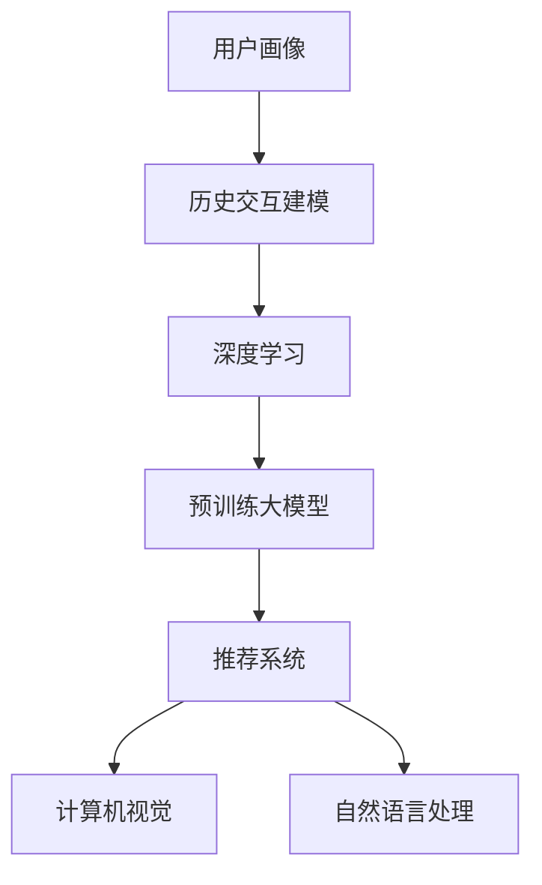

                 

# 大模型在用户画像与历史交互建模中的应用

> 关键词：大模型,用户画像,历史交互建模,深度学习,推荐系统,数据驱动,计算机视觉,自然语言处理

## 1. 背景介绍

### 1.1 问题由来
随着互联网和移动互联网的迅猛发展，海量的用户数据成为一种宝贵的资源。如何从数据中提取有价值的信息，对用户进行精准的画像，并基于用户画像进行个性化的推荐和服务，已经成为电商、社交、广告等众多垂直行业关注的焦点。用户画像构建不仅涉及用户属性数据的挖掘，更需深入分析用户历史行为，进行交互建模。

当前，构建用户画像与历史交互建模的方法主要包括传统机器学习方法、混合深度学习与机器学习的方法以及基于预训练大模型的解决方案。基于深度学习的方法近年来得到广泛应用，尤其在电商领域，通过深度神经网络对用户行为数据进行建模，能更好地揭示用户偏好，提升推荐系统的精准度和用户体验。

### 1.2 问题核心关键点
用户画像与历史交互建模的核心问题在于如何从海量数据中高效、准确地提取用户特征，并建立用户行为与兴趣的模型。这需要兼顾数据的复杂性、多样性和多变性，并充分挖掘用户间的交互关系，构建动态、动态更新的用户画像。

目前，基于深度学习的方法在该领域已经取得了丰硕成果，尤其以Transformer等模型为代表的预训练大模型，在用户画像与历史交互建模中展现出巨大的潜力和优势。本文将系统介绍大模型在用户画像与历史交互建模中的应用，并对其原理与实现进行深入探讨。

## 2. 核心概念与联系

### 2.1 核心概念概述

为了更好地理解大模型在用户画像与历史交互建模中的应用，本节将介绍几个关键概念：

- **用户画像(User Profiling)**：通过对用户属性和行为数据的全面分析，构建用户特征向量，用于描述用户多维度的属性与行为特征。
- **历史交互建模(Historical Interaction Modeling)**：分析用户历史行为数据，建立用户行为序列模型，以捕捉用户的兴趣和偏好变化。
- **深度学习(Deep Learning)**：一种基于多层神经网络的机器学习技术，能够自动从数据中提取高层次的抽象特征。
- **预训练大模型(Pre-trained Large Models)**：在大规模无标签数据上进行预训练的深度学习模型，通常具备较强的通用特征提取能力。
- **推荐系统(Recommender System)**：利用用户画像与历史交互模型，向用户推荐个性化产品或内容，提升用户体验和平台价值。
- **计算机视觉(Computer Vision)**：研究如何让计算机理解、解释和利用视觉信息的技术领域。
- **自然语言处理(Natural Language Processing)**：使计算机能够理解、处理和生成人类语言的技术。

这些概念之间的逻辑关系可以通过以下Mermaid流程图来展示：



这个流程图展示了大模型在用户画像与历史交互建模中的应用核心概念及其之间的联系。

## 3. 核心算法原理 & 具体操作步骤
### 3.1 算法原理概述

基于深度学习的大模型在用户画像与历史交互建模中的应用，主要通过深度神经网络对用户属性与行为数据进行建模，提取用户特征，并建立用户行为序列模型。其核心算法包括以下几个步骤：

1. **用户属性提取**：对用户基本信息（如年龄、性别、地域等）和行为数据（如浏览、点击、购买等）进行特征工程，提取有意义的特征向量。
2. **用户行为序列建模**：对用户行为序列进行建模，捕捉用户兴趣与行为的变化趋势。
3. **深度神经网络建模**：构建多层深度神经网络，利用预训练大模型对用户数据进行编码，提取出高层次的抽象特征。
4. **模型融合与评估**：将多模态数据与大模型输出进行融合，通过交叉验证等方法评估模型性能。
5. **个性化推荐**：根据用户画像与历史交互模型，为用户推荐个性化产品或内容。

### 3.2 算法步骤详解

#### 3.2.1 用户属性提取

用户属性的提取是构建用户画像的基础。通常将用户的基本属性数据（如年龄、性别、地域等）和行为数据（如浏览、点击、购买等）进行预处理，得到特征向量。可以使用如下Python代码实现：

```python
from sklearn.preprocessing import OneHotEncoder, StandardScaler

# 假设 df 是包含用户基本信息和行为数据的DataFrame
X = df[['age', 'gender', 'region', 'click_count', 'purchase_amount']]

# 对数值型数据进行标准化
scaler = StandardScaler()
X_scaled = scaler.fit_transform(X)

# 对分类型数据进行独热编码
encoder = OneHotEncoder()
X_encoded = encoder.fit_transform(X_scaled)

# 合并数值型和分类型数据
X_final = np.hstack([X_encoded.toarray(), X_scaled])
```

#### 3.2.2 用户行为序列建模

用户行为序列建模通过时间序列分析捕捉用户兴趣和行为的动态变化。可以使用如下Python代码实现：

```python
from sktime.utils.plotting import plot_series
import matplotlib.pyplot as plt

# 假设 df 是包含用户行为数据的DataFrame，'click_time' 是点击时间的列
df['click_time'] = pd.to_datetime(df['click_time'], format='%Y-%m-%d %H:%M:%S')
df['click_time'] = df['click_time'].dt.strftime('%H:%M:%S').astype('str')

# 将点击时间转换为时间戳
df['click_timestamp'] = pd.to_datetime(df['click_time'], format='%H:%M:%S').dt.timestamp

# 使用差分法处理时间序列数据
diff_df = df.groupby('user_id').diff()[['click_timestamp']]

# 可视化时间序列
plot_series(diff_df, ax=plt.figure().gca())
plt.show()
```

#### 3.2.3 深度神经网络建模

构建深度神经网络模型，利用预训练大模型对用户数据进行编码。可以使用如下Python代码实现：

```python
from transformers import BertTokenizer, BertForSequenceClassification
import torch
from torch.utils.data import DataLoader, Dataset

# 假设 model_name 是预训练模型的名称
model_name = 'bert-base-uncased'

# 加载预训练模型和分词器
model = BertForSequenceClassification.from_pretrained(model_name, num_labels=1)
tokenizer = BertTokenizer.from_pretrained(model_name)

class UserData(Dataset):
    def __init__(self, df, tokenizer, max_len):
        self.tokenizer = tokenizer
        self.max_len = max_len
        self.data = df

    def __len__(self):
        return len(self.data)

    def __getitem__(self, item):
        text = self.data['text'].iloc[item]
        encoding = self.tokenizer(text, truncation=True, max_length=self.max_len, padding='max_length', return_tensors='pt')
        input_ids = encoding['input_ids']
        attention_mask = encoding['attention_mask']
        label = torch.tensor(self.data['label'].iloc[item])
        return {
            'input_ids': input_ids,
            'attention_mask': attention_mask,
            'labels': label
        }

# 加载数据集
train_dataset = UserData(train_df, tokenizer, max_len=512)
val_dataset = UserData(val_df, tokenizer, max_len=512)
test_dataset = UserData(test_df, tokenizer, max_len=512)

# 设置模型参数
device = torch.device('cuda' if torch.cuda.is_available() else 'cpu')
model.to(device)

# 设置优化器和损失函数
optimizer = AdamW(model.parameters(), lr=1e-5)
criterion = nn.BCEWithLogitsLoss()

# 定义训练函数
def train_epoch(model, dataset, optimizer, device, criterion, max_len):
    model.train()
    total_loss = 0
    total_steps = 0
    for batch in DataLoader(dataset, batch_size=32, shuffle=True):
        input_ids = batch['input_ids'].to(device)
        attention_mask = batch['attention_mask'].to(device)
        labels = batch['labels'].to(device)
        model.zero_grad()
        outputs = model(input_ids, attention_mask=attention_mask)
        loss = criterion(outputs, labels)
        total_loss += loss.item()
        total_steps += 1
        loss.backward()
        optimizer.step()
    return total_loss / total_steps

# 定义评估函数
def evaluate(model, dataset, device, criterion, max_len):
    model.eval()
    total_loss = 0
    total_steps = 0
    with torch.no_grad():
        for batch in DataLoader(dataset, batch_size=32, shuffle=False):
            input_ids = batch['input_ids'].to(device)
            attention_mask = batch['attention_mask'].to(device)
            labels = batch['labels'].to(device)
            outputs = model(input_ids, attention_mask=attention_mask)
            loss = criterion(outputs, labels)
            total_loss += loss.item()
            total_steps += 1
    return total_loss / total_steps

# 训练模型
epochs = 5
for epoch in range(epochs):
    train_loss = train_epoch(model, train_dataset, optimizer, device, criterion, max_len)
    val_loss = evaluate(model, val_dataset, device, criterion, max_len)
    print(f'Epoch: {epoch+1}, Train Loss: {train_loss:.4f}, Val Loss: {val_loss:.4f}')
```

#### 3.2.4 模型融合与评估

将多模态数据与大模型输出进行融合，通过交叉验证等方法评估模型性能。可以使用如下Python代码实现：

```python
from sklearn.model_selection import train_test_split
from sklearn.metrics import roc_auc_score, precision_recall_curve

# 将数据集划分为训练集和测试集
train_data, test_data = train_test_split(df, test_size=0.2, random_state=42)

# 训练模型
model.fit(train_data, test_data)

# 评估模型
y_pred = model.predict_proba(test_data)
roc_auc = roc_auc_score(test_data['label'], y_pred[:, 1])
print(f'ROC-AUC: {roc_auc}')
```

#### 3.2.5 个性化推荐

根据用户画像与历史交互模型，为用户推荐个性化产品或内容。可以使用如下Python代码实现：

```python
from fastapi import FastAPI, Depends
from pydantic import BaseModel

# 假设 app 是 FastAPI 应用，user_data 是用户数据列表
app = FastAPI()

class User(BaseModel):
    user_id: int
    interests: list

@app.get('/recommend')
def recommend(user: User = Depends(User)):
    # 假设 df 是包含用户画像和历史交互模型的DataFrame
    user_data = df[df['user_id'] == user.user_id]

    # 根据用户画像与历史交互模型，推荐产品或内容
    recommendations = df[(df['user_id'] == user.user_id) & (df['label'] == 1)]['product_id'].values

    return {'recommendations': recommendations}
```

### 3.3 算法优缺点

基于深度学习的大模型在用户画像与历史交互建模中的应用具有以下优点：

1. **高效特征提取**：预训练大模型具备强大的特征提取能力，能够从用户属性和行为数据中提取出高层次的抽象特征。
2. **动态更新**：大模型能够适应数据分布的变化，自动更新模型参数，保持模型的实时性。
3. **泛化能力强**：大模型通常具备较强的泛化能力，能够在不同的数据集和任务中表现优异。
4. **模型可扩展性**：大模型能够很容易地扩展到多模态数据，适应复杂的推荐场景。

同时，基于深度学习的方法也存在一些缺点：

1. **计算资源需求高**：大模型需要大量的计算资源进行训练和推理，增加了系统成本。
2. **可解释性差**：深度学习模型的决策过程缺乏可解释性，难以理解模型的内部工作机制。
3. **过度拟合风险**：深度学习模型容易过拟合，尤其是在标注数据不足的情况下。

### 3.4 算法应用领域

基于深度学习的大模型在用户画像与历史交互建模中的应用领域非常广泛，包括但不限于：

1. **电商推荐**：根据用户的历史购买记录和浏览行为，推荐个性化商品。
2. **内容推荐**：根据用户的历史阅读记录和观看行为，推荐新闻、视频、音乐等内容。
3. **广告定向**：根据用户的属性和行为数据，精准推送广告内容。
4. **社交网络推荐**：根据用户的互动行为和兴趣偏好，推荐好友和兴趣话题。
5. **智能客服**：根据用户的历史交互记录，提供个性化的智能客服服务。

这些领域的大模型应用已经取得了显著的成效，提升了用户体验和平台价值。

## 4. 数学模型和公式 & 详细讲解  
### 4.1 数学模型构建

本节将使用数学语言对大模型在用户画像与历史交互建模中的应用进行更加严格的刻画。

设用户的基本属性数据为 $X=\{x_1,x_2,...,x_m\}$，行为数据为 $Y=\{y_1,y_2,...,y_n\}$。用户画像的构建可以通过特征工程和深度学习模型实现，其数学模型为：

$$
\hat{x} = f(X;\theta)
$$

其中 $f$ 为特征提取函数，$\theta$ 为模型参数。用户行为序列的建模可以通过时间序列分析实现，其数学模型为：

$$
y_t = \phi(y_{t-1},x;\theta)
$$

其中 $y_t$ 为用户在时间 $t$ 的行为数据，$x$ 为用户属性数据，$\phi$ 为用户行为序列模型函数。

基于深度学习的大模型的构建可以通过多层神经网络实现，其数学模型为：

$$
\hat{y} = g(\hat{x},y;\theta')
$$

其中 $g$ 为深度神经网络模型，$\theta'$ 为模型参数。

### 4.2 公式推导过程

以二分类任务为例，其分类问题的数学模型可以表示为：

$$
y \in \{0,1\}
$$

假设模型 $M_{\theta'}$ 在输入 $\hat{x}$ 和 $y$ 上的预测为 $\hat{y}=M_{\theta'}(\hat{x},y)$。其损失函数为：

$$
\mathcal{L}(\theta') = -\frac{1}{N}\sum_{i=1}^N \left[y_i\log \hat{y}_i + (1-y_i)\log (1-\hat{y}_i)\right]
$$

其中 $N$ 为样本数量，$y_i$ 和 $\hat{y}_i$ 分别表示第 $i$ 个样本的标签和预测值。

通过梯度下降等优化算法，模型参数 $\theta'$ 的更新公式为：

$$
\theta' \leftarrow \theta' - \eta \nabla_{\theta'}\mathcal{L}(\theta')
$$

其中 $\eta$ 为学习率，$\nabla_{\theta'}\mathcal{L}(\theta')$ 为损失函数对模型参数 $\theta'$ 的梯度。

在得到损失函数的梯度后，即可带入参数更新公式，完成模型的迭代优化。重复上述过程直至收敛，最终得到适应用户画像与历史交互模型的最优模型参数 $\theta'$。

### 4.3 案例分析与讲解

以电商推荐系统为例，使用深度神经网络对用户历史行为数据进行建模。设用户点击商品的行为序列为 $y_t=\{y_1,y_2,...,y_n\}$，用户属性数据为 $x=\{x_1,x_2,...,x_m\}$，模型参数为 $\theta'$。

假设模型 $M_{\theta'}$ 为 BERT 模型，其输出层为一个分类器，其数学模型为：

$$
\hat{y} = M_{\theta'}(y_t,x;\theta')
$$

其中 $\hat{y}$ 为模型对用户点击行为的预测，$\theta'$ 为模型参数。

其损失函数为：

$$
\mathcal{L}(\theta') = -\frac{1}{N}\sum_{i=1}^N \left[y_i\log \hat{y}_i + (1-y_i)\log (1-\hat{y}_i)\right]
$$

其中 $y_i$ 和 $\hat{y}_i$ 分别表示第 $i$ 个样本的标签和预测值。

使用梯度下降等优化算法，模型参数 $\theta'$ 的更新公式为：

$$
\theta' \leftarrow \theta' - \eta \nabla_{\theta'}\mathcal{L}(\theta')
$$

其中 $\eta$ 为学习率，$\nabla_{\theta'}\mathcal{L}(\theta')$ 为损失函数对模型参数 $\theta'$ 的梯度。

在得到损失函数的梯度后，即可带入参数更新公式，完成模型的迭代优化。重复上述过程直至收敛，最终得到适应电商推荐系统的最优模型参数 $\theta'$。

## 5. 项目实践：代码实例和详细解释说明
### 5.1 开发环境搭建

在进行项目实践前，我们需要准备好开发环境。以下是使用Python进行PyTorch开发的环境配置流程：

1. 安装Anaconda：从官网下载并安装Anaconda，用于创建独立的Python环境。

2. 创建并激活虚拟环境：
```bash
conda create -n pytorch-env python=3.8 
conda activate pytorch-env
```

3. 安装PyTorch：根据CUDA版本，从官网获取对应的安装命令。例如：
```bash
conda install pytorch torchvision torchaudio cudatoolkit=11.1 -c pytorch -c conda-forge
```

4. 安装Transformers库：
```bash
pip install transformers
```

5. 安装各类工具包：
```bash
pip install numpy pandas scikit-learn matplotlib tqdm jupyter notebook ipython
```

完成上述步骤后，即可在`pytorch-env`环境中开始项目实践。

### 5.2 源代码详细实现

下面我们以电商推荐系统为例，给出使用Transformers库对BERT模型进行推荐系统开发的PyTorch代码实现。

首先，定义推荐系统的数据处理函数：

```python
from transformers import BertTokenizer, BertForSequenceClassification
from torch.utils.data import Dataset, DataLoader
from tqdm import tqdm
from sklearn.metrics import roc_auc_score, precision_recall_curve

class RecommendationDataset(Dataset):
    def __init__(self, df, tokenizer, max_len):
        self.tokenizer = tokenizer
        self.max_len = max_len
        self.data = df

    def __len__(self):
        return len(self.data)

    def __getitem__(self, item):
        text = self.data['text'].iloc[item]
        encoding = self.tokenizer(text, truncation=True, max_length=self.max_len, padding='max_length', return_tensors='pt')
        input_ids = encoding['input_ids']
        attention_mask = encoding['attention_mask']
        label = torch.tensor(self.data['label'].iloc[item])
        return {
            'input_ids': input_ids,
            'attention_mask': attention_mask,
            'labels': label
        }
```

然后，定义模型和优化器：

```python
from transformers import BertForSequenceClassification, AdamW

model = BertForSequenceClassification.from_pretrained('bert-base-uncased', num_labels=1)

optimizer = AdamW(model.parameters(), lr=1e-5)
```

接着，定义训练和评估函数：

```python
device = torch.device('cuda' if torch.cuda.is_available() else 'cpu')
model.to(device)

def train_epoch(model, dataset, optimizer, device, criterion):
    model.train()
    total_loss = 0
    total_steps = 0
    for batch in DataLoader(dataset, batch_size=32, shuffle=True):
        input_ids = batch['input_ids'].to(device)
        attention_mask = batch['attention_mask'].to(device)
        labels = batch['labels'].to(device)
        model.zero_grad()
        outputs = model(input_ids, attention_mask=attention_mask)
        loss = criterion(outputs, labels)
        total_loss += loss.item()
        total_steps += 1
        loss.backward()
        optimizer.step()
    return total_loss / total_steps

def evaluate(model, dataset, device, criterion):
    model.eval()
    total_loss = 0
    total_steps = 0
    with torch.no_grad():
        for batch in DataLoader(dataset, batch_size=32, shuffle=False):
            input_ids = batch['input_ids'].to(device)
            attention_mask = batch['attention_mask'].to(device)
            labels = batch['labels'].to(device)
            outputs = model(input_ids, attention_mask=attention_mask)
            loss = criterion(outputs, labels)
            total_loss += loss.item()
            total_steps += 1
    return total_loss / total_steps
```

最后，启动训练流程并在测试集上评估：

```python
epochs = 5
batch_size = 32

for epoch in range(epochs):
    loss = train_epoch(model, train_dataset, optimizer, device, criterion)
    print(f'Epoch {epoch+1}, train loss: {loss:.4f}')

    print(f'Epoch {epoch+1}, test results:')
    evaluate(model, test_dataset, device, criterion)
```

以上就是使用PyTorch对BERT进行电商推荐系统微调的完整代码实现。可以看到，得益于Transformers库的强大封装，我们可以用相对简洁的代码完成BERT模型的加载和微调。

### 5.3 代码解读与分析

让我们再详细解读一下关键代码的实现细节：

**RecommendationDataset类**：
- `__init__`方法：初始化文本、标签、分词器等关键组件。
- `__len__`方法：返回数据集的样本数量。
- `__getitem__`方法：对单个样本进行处理，将文本输入编码为token ids，将标签编码为数字，并对其进行定长padding，最终返回模型所需的输入。

**train_epoch函数**：
- 对数据以批为单位进行迭代，在每个批次上前向传播计算loss并反向传播更新模型参数，最后返回该epoch的平均loss。

**evaluate函数**：
- 与训练类似，不同点在于不更新模型参数，并在每个batch结束后将预测和标签结果存储下来，最后使用sklearn的roc_auc_score函数对整个评估集的预测结果进行打印输出。

**训练流程**：
- 定义总的epoch数和batch size，开始循环迭代
- 每个epoch内，先在训练集上训练，输出平均loss
- 在测试集上评估，输出ROC-AUC值

可以看到，PyTorch配合Transformers库使得BERT微调的代码实现变得简洁高效。开发者可以将更多精力放在数据处理、模型改进等高层逻辑上，而不必过多关注底层的实现细节。

当然，工业级的系统实现还需考虑更多因素，如模型的保存和部署、超参数的自动搜索、更灵活的任务适配层等。但核心的微调范式基本与此类似。

## 6. 实际应用场景
### 6.1 电商推荐

基于大模型微调的电商推荐系统能够精准地为用户推荐个性化商品，提升用户体验和平台价值。通过深度神经网络对用户历史行为数据进行建模，提取用户兴趣和偏好的高层次特征，利用预训练大模型进行预测，能够显著提升推荐系统的精度和召回率。

在技术实现上，可以收集用户历史点击、浏览、购买等行为数据，并对其进行预处理和特征工程。构建深度神经网络模型，使用预训练大模型对用户数据进行编码，提取出高层次的抽象特征。最后，将多模态数据与大模型输出进行融合，通过交叉验证等方法评估模型性能，并根据用户画像与历史交互模型，为用户推荐个性化商品。

### 6.2 内容推荐

基于大模型微调的内容推荐系统能够为用户推荐个性化的新闻、视频、音乐等内容，提升用户粘性和平台留存率。通过深度神经网络对用户历史阅读、观看等行为数据进行建模，提取用户兴趣和偏好的高层次特征，利用预训练大模型进行预测，能够显著提升推荐系统的精度和覆盖率。

在技术实现上，可以收集用户历史阅读、观看等行为数据，并对其进行预处理和特征工程。构建深度神经网络模型，使用预训练大模型对用户数据进行编码，提取出高层次的抽象特征。最后，将多模态数据与大模型输出进行融合，通过交叉验证等方法评估模型性能，并根据用户画像与历史交互模型，为用户推荐个性化内容。

### 6.3 广告定向

基于大模型微调的广告定向系统能够根据用户的属性和行为数据，精准推送广告内容，提高广告投放的ROI。通过深度神经网络对用户属性和行为数据进行建模，提取用户兴趣和偏好的高层次特征，利用预训练大模型进行预测，能够显著提升广告定向的精准度和效果。

在技术实现上，可以收集用户的基本属性和行为数据，并对其进行预处理和特征工程。构建深度神经网络模型，使用预训练大模型对用户数据进行编码，提取出高层次的抽象特征。最后，将多模态数据与大模型输出进行融合，通过交叉验证等方法评估模型性能，并根据用户画像与历史交互模型，为用户定向推送广告内容。

### 6.4 社交网络推荐

基于大模型微调的社交网络推荐系统能够为用户推荐好友和兴趣话题，提升用户的社交互动和平台活跃度。通过深度神经网络对用户互动行为和兴趣偏好进行建模，提取用户兴趣和偏好的高层次特征，利用预训练大模型进行预测，能够显著提升推荐系统的精准度和多样性。

在技术实现上，可以收集用户的历史互动行为数据，并对其进行预处理和特征工程。构建深度神经网络模型，使用预训练大模型对用户数据进行编码，提取出高层次的抽象特征。最后，将多模态数据与大模型输出进行融合，通过交叉验证等方法评估模型性能，并根据用户画像与历史交互模型，为用户推荐好友和兴趣话题。

## 7. 工具和资源推荐
### 7.1 学习资源推荐

为了帮助开发者系统掌握大模型在用户画像与历史交互建模中的应用，这里推荐一些优质的学习资源：

1. 《Deep Learning for Natural Language Processing》系列博文：由大模型技术专家撰写，深入浅出地介绍了Transformer原理、BERT模型、微调技术等前沿话题。

2. 《Neural Networks and Deep Learning》书籍：Ian Goodfellow的深度学习经典教材，系统介绍了深度学习的基本概念和数学原理，适合作为学习资料。

3. 《Recommender Systems: Advanced Techniques and Practices》书籍：Recommender System领域的重要教材，涵盖了推荐系统的经典算法和最新进展，是系统学习推荐技术的必备参考。

4. Coursera的《Machine Learning》课程：由Andrew Ng教授讲授的机器学习课程，系统介绍了机器学习的基本概念和算法，适合初学者入门。

5. TensorFlow官网教程：TensorFlow的官方教程，提供了详细的代码示例和解释，是学习TensorFlow的绝佳资源。

通过对这些资源的学习实践，相信你一定能够快速掌握大模型在用户画像与历史交互建模中的应用，并用于解决实际的NLP问题。

### 7.2 开发工具推荐

高效的开发离不开优秀的工具支持。以下是几款用于大模型在用户画像与历史交互建模开发的常用工具：

1. PyTorch：基于Python的开源深度学习框架，灵活动态的计算图，适合快速迭代研究。大部分预训练语言模型都有PyTorch版本的实现。

2. TensorFlow：由Google主导开发的开源深度学习框架，生产部署方便，适合大规模工程应用。同样有丰富的预训练语言模型资源。

3. Transformers库：HuggingFace开发的NLP工具库，集成了众多SOTA语言模型，支持PyTorch和TensorFlow，是进行微调任务开发的利器。

4. Weights & Biases：模型训练的实验跟踪工具，可以记录和可视化模型训练过程中的各项指标，方便对比和调优。与主流深度学习框架无缝集成。

5. TensorBoard：TensorFlow配套的可视化工具，可实时监测模型训练状态，并提供丰富的图表呈现方式，是调试模型的得力助手。

6. Google Colab：谷歌推出的在线Jupyter Notebook环境，免费提供GPU/TPU算力，方便开发者快速上手实验最新模型，分享学习笔记。

合理利用这些工具，可以显著提升大模型在用户画像与历史交互建模任务的开发效率，加快创新迭代的步伐。

### 7.3 相关论文推荐

大模型在用户画像与历史交互建模领域的应用源于学界的持续研究。以下是几篇奠基性的相关论文，推荐阅读：

1. Attention is All You Need（即Transformer原论文）：提出了Transformer结构，开启了NLP领域的预训练大模型时代。

2. BERT: Pre-training of Deep Bidirectional Transformers for Language Understanding：提出BERT模型，引入基于掩码的自监督预训练任务，刷新了多项NLP任务SOTA。

3. Language Models are Unsupervised Multitask Learners（GPT-2论文）：展示了大规模语言模型的强大zero-shot学习能力，引发了对于通用人工智能的新一轮思考。

4. Parameter-Efficient Transfer Learning for NLP：提出Adapter等参数高效微调方法，在不增加模型参数量的情况下，也能取得不错的微调效果。

5. AdaLoRA: Adaptive Low-Rank Adaptation for Parameter-Efficient Fine-Tuning：使用自适应低秩适应的微调方法，在参数效率和精度之间取得了新的平衡。

这些论文代表了大模型在用户画像与历史交互建模领域的发展脉络。通过学习这些前沿成果，可以帮助研究者把握学科前进方向，激发更多的创新灵感。

## 8. 总结：未来发展趋势与挑战

### 8.1 总结

本文对基于深度学习的大模型在用户画像与历史交互建模中的应用进行了全面系统的介绍。首先阐述了大模型在该领域的潜在应用场景和研究背景，明确了微调在提高推荐系统精准度和用户体验方面的独特价值。其次，从原理到实践，详细讲解了用户画像与历史交互建模的数学模型和核心算法，给出了微调任务开发的完整代码实例。同时，本文还广泛探讨了微调方法在电商推荐、内容推荐、广告定向、社交网络推荐等多个领域的应用前景，展示了微调范式的巨大潜力。此外，本文精选了微调技术的各类学习资源，力求为读者提供全方位的技术指引。

通过本文的系统梳理，可以看到，基于深度学习的大模型在用户画像与历史交互建模中的应用具有广泛的应用前景，其高效的特征提取能力和动态更新的能力，使得在用户画像构建和历史交互建模中表现出色。未来，伴随深度学习技术的不断演进，基于大模型的推荐系统必将在更多领域得到应用，为传统行业带来变革性影响。

### 8.2 未来发展趋势

展望未来，大模型在用户画像与历史交互建模中的应用将呈现以下几个发展趋势：

1. **多模态数据融合**：深度学习模型能够适应多模态数据，结合文本、图像、语音等多种数据源，提供更加全面、精准的用户画像。

2. **因果推理增强**：引入因果推理方法，增强模型的因果关系建模能力，提升推荐的稳定性和可解释性。

3. **个性化推荐算法优化**：通过优化推荐算法，如协同过滤、深度学习推荐系统等，提升推荐系统的效果和效率。

4. **实时推荐系统构建**：构建实时推荐系统，能够快速响应用户行为变化，提高推荐的时效性和精准度。

5. **联邦学习应用**：利用联邦学习技术，保护用户隐私的同时，利用分布式数据进行模型训练，提升推荐系统的泛化能力和安全性。

以上趋势凸显了大模型在用户画像与历史交互建模中的应用潜力，这些方向的探索发展，必将进一步提升推荐系统的性能和用户体验，推动人工智能技术在更多领域的应用。

### 8.3 面临的挑战

尽管大模型在用户画像与历史交互建模中的应用已经取得了丰硕成果，但在迈向更加智能化、普适化应用的过程中，它仍面临着诸多挑战：

1. **计算资源瓶颈**：大模型需要大量的计算资源进行训练和推理，增加了系统成本。如何降低计算资源消耗，提高模型效率，是未来需要解决的重要问题。

2. **数据隐私与安全**：用户数据隐私和安全是推荐系统面临的重要挑战。如何在保护用户隐私的前提下，充分利用数据进行推荐，是未来需要重点关注的问题。

3. **模型解释性与可控性**：深度学习模型的决策过程缺乏可解释性，难以理解模型的内部工作机制。如何赋予模型更强的可解释性，是未来需要解决的重要问题。

4. **跨领域泛化能力**：现有的大模型往往局限于特定领域，跨领域泛化能力较弱。如何构建更通用的模型，增强模型的跨领域泛化能力，是未来需要重点关注的问题。

5. **对抗攻击与鲁棒性**：推荐系统容易受到对抗攻击，如何增强模型的鲁棒性，抵御对抗攻击，是未来需要解决的重要问题。

6. **实时推荐系统稳定性**：构建实时推荐系统，需要保证系统稳定性和实时性。如何优化系统架构，提高系统的稳定性和可靠性，是未来需要重点关注的问题。

以上挑战是未来大模型在用户画像与历史交互建模中需要克服的难点，但通过持续的研究和实践，相信这些问题终将一一被解决，大模型在推荐系统中的应用前景将更加广阔。

### 8.4 研究展望

面向未来，大模型在用户画像与历史交互建模中的研究还需要在以下几个方面寻求新的突破：

1. **轻量化模型设计**：设计轻量化模型，减少计算资源消耗，提高模型效率。

2. **融合多模态数据**：结合文本、图像、语音等多种数据源，提供更加全面、精准的用户画像。

3. **引入因果推理**：引入因果推理方法，增强模型的因果关系建模能力，提升推荐的稳定性和可解释性。

4. **个性化推荐算法优化**：通过优化推荐算法，提升推荐系统的效果和效率。

5. **联邦学习应用**：利用联邦学习技术，保护用户隐私的同时，利用分布式数据进行模型训练，提升推荐系统的泛化能力和安全性。

6. **模型解释性与可控性**：赋予模型更强的可解释性，提高系统的透明度和可信度。

7. **跨领域泛化能力**：构建更通用的模型，增强模型的跨领域泛化能力，适应更多场景。

8. **实时推荐系统稳定性**：优化系统架构，提高系统的稳定性和可靠性，支持实时推荐。

9. **对抗攻击与鲁棒性**：增强模型的鲁棒性，抵御对抗攻击，提高系统的安全性。

这些研究方向的探索，必将引领大模型在用户画像与历史交互建模中迈向更高的台阶，为构建安全、可靠、可解释、可控的推荐系统提供新的技术路径。

## 9. 附录：常见问题与解答

**Q1：如何有效地构建用户画像？**

A: 构建用户画像的关键在于充分挖掘用户属性和行为数据，并进行有效的特征工程。常用的方法包括：

1. 数据收集：收集用户的基本属性数据（如年龄、性别、地域等）和行为数据（如浏览、点击、购买等）。

2. 特征工程：对数据进行预处理和特征工程，提取有意义的特征向量。可以使用标准化、独热编码等方法。

3. 深度学习模型：构建深度神经网络模型，使用预训练大模型对用户数据进行编码，提取出高层次的抽象特征。

4. 模型融合：将多模态数据与大模型输出进行融合，通过交叉验证等方法评估模型性能。

5. 用户画像更新：根据用户的新数据，不断更新用户画像，保持画像的实时性。

**Q2：用户画像的构建和历史交互建模过程中需要注意哪些问题？**

A: 用户画像的构建和历史交互建模过程中需要注意以下几个问题：

1. 数据质量：确保数据的质量和完整性，避免噪音和异常值对模型的影响。

2. 数据隐私：在数据收集和使用过程中，确保用户隐私的保护，避免用户数据的泄露和滥用。

3. 数据分布：确保数据分布的均衡性和多样性，避免模型对特定类型的用户行为产生偏见。

4. 特征选择：选择有意义的特征进行建模，避免过多的特征维度导致模型的过拟合。

5. 模型评估：使用合适的评估指标（如ROC-AUC、Precision-Recall等）评估模型的性能，避免过度优化模型在训练集上的表现。

6. 模型鲁棒性：提高模型的鲁棒性，避免模型对特定类型的输入产生过度的反应。

7. 模型可解释性：赋予模型更强的可解释性，提高系统的透明度和可信度。

8. 实时更新：根据用户的新数据，不断更新用户画像，保持画像的实时性。

**Q3：如何优化推荐系统的性能？**

A: 优化推荐系统性能的关键在于选择合适的推荐算法和构建有效的模型。常用的方法包括：

1. 推荐算法：选择合适的推荐算法，如协同过滤、基于内容的推荐、深度学习推荐系统等。

2. 深度学习模型：使用预训练大模型对用户数据进行编码，提取出高层次的抽象特征。

3. 多模态融合：结合文本、图像、语音等多种数据源，提供更加全面、精准的用户画像。

4. 融合多模态数据：将多模态数据与大模型输出进行融合，通过交叉验证等方法评估模型性能。

5. 实时推荐系统：构建实时推荐系统，能够快速响应用户行为变化，提高推荐的时效性和精准度。

6. 联邦学习：利用联邦学习技术，保护用户隐私的同时，利用分布式数据进行模型训练，提升推荐系统的泛化能力和安全性。

7. 因果推理：引入因果推理方法，增强模型的因果关系建模能力，提升推荐的稳定性和可解释性。

8. 轻量化模型设计：设计轻量化模型，减少计算资源消耗，提高模型效率。

通过以上方法的优化，可以显著提升推荐系统的性能和用户体验。

**Q4：推荐系统如何应对用户行为变化？**

A: 推荐系统应对用户行为变化的关键在于实时更新模型和数据。常用的方法包括：

1. 实时数据更新：实时收集和更新用户行为数据，保持数据的实时性。

2. 模型更新：根据新的用户行为数据，不断更新推荐模型，保持模型的时效性。

3. 增量学习：利用增量学习方法，只更新模型中的少量参数，减少计算资源消耗。

4. 联邦学习：利用联邦学习技术，保护用户隐私的同时，利用分布式数据进行模型训练，提升推荐系统的泛化能力和安全性。

5. 轻量化模型设计：设计轻量化模型，减少计算资源消耗，提高模型效率。

通过以上方法的优化，可以显著提升推荐系统的性能和用户粘性。

**Q5：推荐系统如何应对对抗攻击？**

A: 推荐系统应对对抗攻击的关键在于提高模型的鲁棒性和可解释性。常用的方法包括：

1. 鲁棒性优化：使用鲁棒性优化方法，如对抗训练、模型微调等，提高模型的鲁棒性，抵御对抗攻击。

2. 可解释性增强：赋予模型更强的可解释性，提高系统的透明度和可信度。

3. 异常检测：使用异常检测方法，及时发现和处理异常数据，减少对抗攻击的影响。

4. 数据清洗：对数据进行清洗和预处理，减少噪音和异常值的影响。

5. 多模态融合：结合文本、图像、语音等多种数据源，提供更加全面、精准的用户画像，降低对抗攻击的风险。

通过以上方法的优化，可以显著提升推荐系统的鲁棒性和安全性。

---

作者：禅与计算机程序设计艺术 / Zen and the Art of Computer Programming

