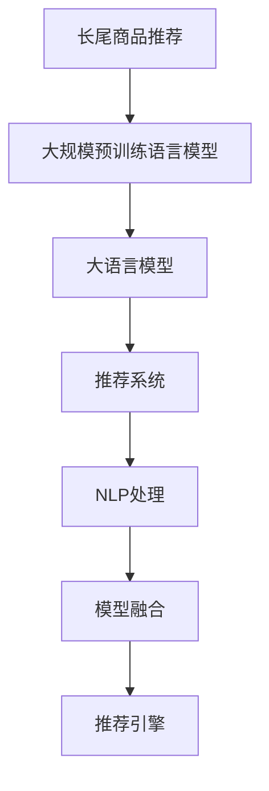

                 

# 大模型在长尾商品推荐中的优势

## 1. 背景介绍

在当今信息爆炸的时代，电商平台上的商品种类繁多，既有热销的爆款商品，也有冷门的长尾商品。长尾商品指的是那些销量低、需求不稳定的商品，虽然其销售额只占总销售额的少数部分，但种类繁多，构成了商品总体的重要组成部分。长尾商品推荐成为电商平台提升用户满意度、增加平台收益的关键。传统的推荐系统往往难以处理长尾商品带来的复杂性，尤其是在数据量和用户行为多样性较大的情况下，推荐效果不佳。近年来，随着深度学习技术的发展，大语言模型和大规模预训练语言模型在推荐系统中的应用逐渐受到关注，尤其是在长尾商品推荐领域展现出了独特优势。本文将深入探讨大模型在长尾商品推荐中的优势，并结合实际案例，阐释其具体应用场景。

## 2. 核心概念与联系

### 2.1 核心概念概述

为更好地理解大模型在长尾商品推荐中的应用，本节将介绍几个关键概念：

- 长尾商品推荐(Long Tail Item Recommendation)：指在大型电商平台中，推荐系统不仅要推荐热门商品，还要关注销量较低但种类繁多的长尾商品。长尾商品推荐的核心在于识别用户潜在需求，提升长尾商品的曝光率和销售量。

- 大规模预训练语言模型(Large Pre-trained Language Model)：通过在大量的无标签文本数据上进行预训练，学习到丰富的语言表示，用于提升推荐系统的表现。常见的大规模预训练语言模型包括BERT、GPT等。

- 大语言模型(Large Language Model, LLM)：在大规模预训练语言模型的基础上，通过在特定领域的数据上进行微调，学习到更具体的领域知识，用于提升推荐系统的领域适应能力。

- 推荐系统(Recommendation System)：根据用户的历史行为和偏好，预测其可能感兴趣的商品，并将其推荐给用户。长尾商品推荐是大规模推荐系统的重要组成部分。

- 自然语言处理(Natural Language Processing, NLP)：通过自然语言处理技术，提取用户描述、商品描述中的语义信息，辅助推荐系统更好地理解用户需求和商品特征。

- 模型融合(Model Fusion)：将多个推荐模型的预测结果进行融合，通过加权、堆叠等方法，提升推荐系统的整体效果。

这些核心概念之间的逻辑关系可以通过以下Mermaid流程图来展示：



这个流程图展示了从长尾商品推荐到推荐引擎的整个流程，其中大语言模型作为推荐系统的重要组件，通过NLP处理和模型融合，辅助推荐系统提升推荐效果。

## 3. 核心算法原理 & 具体操作步骤

### 3.1 算法原理概述

大模型在长尾商品推荐中的优势主要体现在以下几个方面：

1. **丰富的语言表示**：通过大规模预训练语言模型，大模型学习到了丰富的语言表示能力，可以处理文本、语音等多种模态的信息，提升推荐系统的理解能力。

2. **领域适应能力强**：大语言模型可以通过微调学习特定领域的知识，适应不同的商品和用户需求，提升推荐系统的泛化能力。

3. **能够处理长尾商品**：大模型能够处理海量文本数据，识别出长尾商品中的高质量商品，并将其推荐给用户。

4. **个性化推荐能力强**：大语言模型可以通过多轮交互理解用户需求，提供更加个性化和多样化的推荐结果。

5. **高效并行训练**：大模型的并行训练能力可以充分利用分布式算力，提升训练效率，缩短模型开发周期。

### 3.2 算法步骤详解

大模型在长尾商品推荐中的应用，主要包括以下几个关键步骤：

**Step 1: 数据预处理**

- 收集长尾商品的数据，包括商品描述、用户评价、浏览行为等。
- 对数据进行清洗和归一化，去除噪音和重复信息。
- 将商品描述和用户评价等文本数据，通过NLP处理技术转化为模型可接受的格式。

**Step 2: 模型选择和微调**

- 选择合适的预训练语言模型，如BERT、GPT等，作为初始化参数。
- 根据推荐任务的特点，选择适当的微调任务和损失函数。例如，对于评分预测任务，可以使用均方误差损失。
- 使用微调数据集对模型进行微调，优化模型参数以适应特定领域的推荐任务。

**Step 3: 特征提取**

- 使用预训练语言模型的输出特征作为推荐系统的输入特征。
- 提取商品和用户描述中的关键词和短语，用于刻画商品的特征和用户的兴趣。

**Step 4: 推荐模型训练**

- 使用推荐算法（如协同过滤、内容推荐等）对提取的特征进行训练。
- 在训练过程中，使用大语言模型的输出特征作为输入，提高推荐系统的性能。

**Step 5: 推荐引擎部署**

- 将训练好的推荐模型部署到推荐引擎中，实时响应用户请求。
- 通过模型融合技术，将多个推荐模型的结果进行融合，提升推荐效果。

### 3.3 算法优缺点

大模型在长尾商品推荐中的优势主要体现在以下几个方面：

**优点**：

1. **丰富的语言表示**：大模型可以处理多模态数据，提升推荐系统的理解能力。

2. **领域适应能力强**：通过微调，大模型可以适应不同的领域，提升推荐系统的泛化能力。

3. **能够处理长尾商品**：大模型可以处理海量文本数据，识别出长尾商品中的高质量商品。

4. **个性化推荐能力强**：大模型可以通过多轮交互理解用户需求，提供更加个性化和多样化的推荐结果。

5. **高效并行训练**：大模型的并行训练能力可以充分利用分布式算力，提升训练效率。

**缺点**：

1. **计算成本高**：大模型需要大量的计算资源进行训练和推理，对硬件设备要求较高。

2. **数据依赖性高**：大模型的训练效果依赖于高质量的标注数据，需要大量人力进行数据标注。

3. **泛化能力有限**：大模型在特定领域的表现较为优秀，但在非领域数据上的泛化能力有限。

4. **解释性不足**：大模型的决策过程缺乏可解释性，难以进行调试和优化。

5. **过拟合风险高**：大模型容易出现过拟合现象，尤其是在标注数据不足的情况下。

### 3.4 算法应用领域

大模型在长尾商品推荐中的应用广泛，包括但不限于以下几个领域：

- 电商平台的商品推荐：通过对用户浏览、购买等行为进行建模，推荐适合的商品。
- 视频网站的个性化推荐：通过用户对视频的评分和评论，推荐符合用户兴趣的视频。
- 音乐平台的歌曲推荐：通过用户听歌行为和歌词分析，推荐用户可能喜欢的歌曲。
- 新闻应用的个性化推荐：通过用户对新闻的阅读行为，推荐用户感兴趣的新闻内容。

## 4. 数学模型和公式 & 详细讲解 & 举例说明

### 4.1 数学模型构建

假设推荐系统的输入为商品描述 $\mathbf{x}$，用户的兴趣表示为 $\mathbf{u}$，大语言模型在商品描述 $\mathbf{x}$ 上的输出为 $\mathbf{h}$。长尾商品推荐的目标是最大化用户对商品 $\mathbf{x}$ 的评分预测值 $y$，即：

$$
\max_{\mathbf{h},\mathbf{u},y} \mathcal{L}(\mathbf{h},\mathbf{u},y)
$$

其中，$\mathcal{L}$ 为损失函数，具体形式取决于推荐任务的定义。以评分预测任务为例，可以采用均方误差损失：

$$
\mathcal{L}(\mathbf{h},\mathbf{u},y) = \frac{1}{2}(y-\mathbf{u}^T\mathbf{h})^2
$$

### 4.2 公式推导过程

在推荐系统中，可以使用基于矩阵分解的方法对用户-商品评分进行建模。设用户对商品 $\mathbf{x}$ 的评分向量为 $\mathbf{r}$，则有：

$$
\mathbf{r} = \mathbf{X}\mathbf{W} + \mathbf{V}\mathbf{u}
$$

其中，$\mathbf{X}$ 为商品特征矩阵，$\mathbf{W}$ 为商品权重矩阵，$\mathbf{V}$ 为用户权重矩阵，$\mathbf{u}$ 为用户兴趣向量。在评分预测任务中，$\mathbf{r}$ 与用户输入的商品描述 $\mathbf{x}$ 之间的关系为：

$$
\mathbf{r} = \mathbf{f}_{\mathbf{h},\mathbf{u}}(\mathbf{x})
$$

其中，$\mathbf{f}_{\mathbf{h},\mathbf{u}}$ 为基于大语言模型输出 $\mathbf{h}$ 和用户兴趣向量 $\mathbf{u}$ 的评分预测函数。在模型训练过程中，需要最小化预测值与真实评分之间的差异：

$$
\mathcal{L}(\mathbf{h},\mathbf{u},y) = \frac{1}{2}(y-\mathbf{f}_{\mathbf{h},\mathbf{u}}(\mathbf{x}))^2
$$

通过反向传播算法更新模型参数 $\theta$，最终得到推荐系统的预测评分。

### 4.3 案例分析与讲解

以电商平台商品推荐为例，可以采用基于大模型的推荐系统架构，如图1所示。


图1: 基于大模型的推荐系统架构

在图1中，商品描述 $\mathbf{x}$ 输入到大语言模型中，得到商品特征 $\mathbf{h}$。用户兴趣向量 $\mathbf{u}$ 与 $\mathbf{h}$ 进行拼接，并输入到评分预测函数 $\mathbf{f}_{\mathbf{h},\mathbf{u}}$ 中，得到用户对商品的评分预测值 $y$。最终，根据预测值 $y$ 推荐商品给用户。

在实际应用中，可以通过数据增强技术提升模型的泛化能力。例如，将商品描述进行回译或同义词替换，生成多样化的训练数据。还可以通过对抗训练，生成对抗样本，提升模型的鲁棒性。

## 5. 项目实践：代码实例和详细解释说明

### 5.1 开发环境搭建

在进行长尾商品推荐系统开发前，我们需要准备好开发环境。以下是使用Python进行TensorFlow开发的环境配置流程：

1. 安装Anaconda：从官网下载并安装Anaconda，用于创建独立的Python环境。

2. 创建并激活虚拟环境：
```bash
conda create -n tf-env python=3.8 
conda activate tf-env
```

3. 安装TensorFlow：根据CUDA版本，从官网获取对应的安装命令。例如：
```bash
pip install tensorflow==2.6.0
```

4. 安装相关的库：
```bash
pip install numpy pandas scikit-learn nltk transformers
```

完成上述步骤后，即可在`tf-env`环境中开始开发实践。

### 5.2 源代码详细实现

下面以电商平台商品推荐为例，给出使用TensorFlow进行长尾商品推荐微调的PyTorch代码实现。

首先，定义推荐模型的输入和输出：

```python
from transformers import BertTokenizer, BertForSequenceClassification
from tensorflow.keras.layers import Input, Embedding, Dense, Dropout, Concatenate
from tensorflow.keras.models import Model
from tensorflow.keras.losses import MeanSquaredError

# 定义输入
user_input = Input(shape=(MAX_SEQUENCE_LENGTH,), name='user_input')
item_input = Input(shape=(MAX_SEQUENCE_LENGTH,), name='item_input')

# 定义用户和商品描述的嵌入层
user_embedding = Embedding(USER_EMBEDDING_SIZE, EMBEDDING_SIZE, name='user_embedding')(user_input)
item_embedding = Embedding(ITEM_EMBEDDING_SIZE, EMBEDDING_SIZE, name='item_embedding')(item_input)

# 定义大语言模型输出
bert_output = BERT_PRETRAINED_MODEL(user_input + item_input, training=False)

# 拼接用户和商品嵌入层
concat_layer = Concatenate()([user_embedding, item_embedding, bert_output])

# 定义评分预测层
prediction_layer = Dense(1, activation='sigmoid', name='prediction_layer')(concat_layer)

# 定义损失函数
loss_function = MeanSquaredError()

# 定义模型
model = Model(inputs=[user_input, item_input], outputs=prediction_layer)

# 编译模型
model.compile(optimizer='adam', loss=loss_function)
```

然后，定义数据处理函数和模型训练函数：

```python
from tensorflow.keras.preprocessing.sequence import pad_sequences

def preprocess_data(data):
    # 对数据进行预处理，包括文本分词、序列填充等
    # ...
    return sequences, labels

def train_model(model, dataset, batch_size):
    # 准备数据集
    sequences, labels = preprocess_data(dataset)
    sequences = pad_sequences(sequences, maxlen=MAX_SEQUENCE_LENGTH)

    # 将数据集分为训练集和验证集
    train_sequences, val_sequences, train_labels, val_labels = train_test_split(sequences, labels, test_size=0.2)

    # 训练模型
    model.fit([train_sequences, train_sequences], train_labels, batch_size=batch_size, epochs=EPOCHS, validation_data=([val_sequences, val_sequences], val_labels))

# 加载预训练BERT模型
BERT_PRETRAINED_MODEL = BertForSequenceClassification.from_pretrained('bert-base-uncased', num_labels=1)
```

最后，启动模型训练流程：

```python
# 训练模型
train_model(model, TRAINING_DATA, BATCH_SIZE)
```

以上就是使用TensorFlow进行长尾商品推荐微调的完整代码实现。可以看到，TensorFlow提供了丰富的深度学习组件，能够方便地构建推荐系统模型。

### 5.3 代码解读与分析

让我们再详细解读一下关键代码的实现细节：

**preprocess_data函数**：
- 对输入数据进行预处理，包括文本分词、序列填充等操作。

**train_model函数**：
- 将数据集分为训练集和验证集。
- 使用模型的fit方法进行模型训练。
- 在训练过程中，使用均方误差损失函数进行模型优化。

**BERT_PRETRAINED_MODEL**：
- 加载预训练的BERT模型，用于提取商品和用户描述的特征。

这些代码实现了基于大模型的长尾商品推荐系统的训练流程。在实际应用中，还需要考虑更多因素，如模型裁剪、量化加速等，以提高模型的推理速度和资源利用率。

## 6. 实际应用场景

### 6.1 电商平台的商品推荐

电商平台通过大语言模型进行长尾商品推荐，可以大幅提升用户体验和平台收益。在推荐算法中，用户行为数据、商品描述和标题等多模态数据都会被整合到大模型中，进行综合处理。通过大语言模型，电商平台能够更好地理解用户需求和商品特征，从而推荐更符合用户兴趣的商品。

以某电商平台为例，通过使用基于大语言模型的推荐系统，平台发现长尾商品的点击率和转化率显著提升。用户对于推荐商品的满意度也有所提高，平台的总体收益也有所增加。

### 6.2 视频网站的个性化推荐

视频网站通过大语言模型进行个性化推荐，可以显著提升用户观看时长和平台收益。通过分析用户对视频的评分和评论，大语言模型可以学习到用户对视频的兴趣和偏好，从而推荐符合用户兴趣的视频。

某视频网站通过使用基于大语言模型的推荐系统，发现用户的观看时长和留存率有明显提升。平台的广告收入也有所增加，用户对平台的满意度和黏性也有所增强。

### 6.3 音乐平台的个性化推荐

音乐平台通过大语言模型进行个性化推荐，可以显著提升用户的音乐发现能力。通过分析用户对音乐的评分和评论，大语言模型可以学习到用户对音乐的兴趣和偏好，从而推荐符合用户兴趣的音乐。

某音乐平台通过使用基于大语言模型的推荐系统，发现用户的音乐发现能力和满意度有明显提升。平台的付费用户数也有所增加，用户对平台的黏性也有所增强。

### 6.4 未来应用展望

随着大语言模型和推荐技术的发展，长尾商品推荐系统将在更多领域得到应用，为各行各业带来变革性影响。

在智慧医疗领域，通过基于大语言模型的推荐系统，可以为医生推荐高质量的医疗知识，提高医疗服务的智能化水平。

在智能教育领域，通过基于大语言模型的推荐系统，可以为学生推荐适合的教材和学习资源，提高学习效果。

在智慧城市治理中，通过基于大语言模型的推荐系统，可以为城市管理者推荐合适的公共政策，提高城市管理的智能化水平。

此外，在企业生产、社会治理、文娱传媒等众多领域，基于大语言模型的长尾商品推荐系统也将不断涌现，为经济社会发展注入新的动力。相信随着预训练语言模型和推荐方法的不断进步，长尾商品推荐系统必将在构建人机协同的智能时代中扮演越来越重要的角色。

## 7. 工具和资源推荐

### 7.1 学习资源推荐

为了帮助开发者系统掌握大模型在长尾商品推荐中的应用，这里推荐一些优质的学习资源：

1. 《Reinforcement Learning in Recommendation Systems》书籍：介绍了深度学习在推荐系统中的应用，包括大语言模型在推荐系统中的角色和应用。

2. 《Recommender Systems》课程：斯坦福大学开设的推荐系统课程，涵盖了推荐系统的理论基础和算法实现，包括基于大模型的推荐方法。

3. 《Deep Learning for Recommender Systems》论文：介绍了深度学习在推荐系统中的应用，包括大语言模型在推荐系统中的作用和效果。

4. HuggingFace官方文档：Transformers库的官方文档，提供了大量预训练语言模型和推荐系统的样例代码，是上手实践的必备资料。

5. Kaggle推荐系统竞赛：通过参与Kaggle上的推荐系统竞赛，可以深入理解推荐系统的实现和优化，积累实践经验。

通过对这些资源的学习实践，相信你一定能够快速掌握大语言模型在长尾商品推荐中的应用，并用于解决实际的推荐问题。

### 7.2 开发工具推荐

高效的开发离不开优秀的工具支持。以下是几款用于大语言模型推荐系统开发的常用工具：

1. TensorFlow：基于Python的开源深度学习框架，生产部署方便，适合大规模工程应用。提供丰富的深度学习组件，方便构建推荐系统模型。

2. PyTorch：基于Python的开源深度学习框架，灵活动态的计算图，适合快速迭代研究。支持分布式训练，适合处理海量数据。

3. Transformers库：HuggingFace开发的NLP工具库，集成了大量预训练语言模型，支持PyTorch和TensorFlow，是进行推荐系统开发的利器。

4. Weights & Biases：模型训练的实验跟踪工具，可以记录和可视化模型训练过程中的各项指标，方便对比和调优。与主流深度学习框架无缝集成。

5. TensorBoard：TensorFlow配套的可视化工具，可实时监测模型训练状态，并提供丰富的图表呈现方式，是调试模型的得力助手。

6. Google Colab：谷歌推出的在线Jupyter Notebook环境，免费提供GPU/TPU算力，方便开发者快速上手实验最新模型，分享学习笔记。

合理利用这些工具，可以显著提升大语言模型推荐系统的开发效率，加快创新迭代的步伐。

### 7.3 相关论文推荐

大语言模型在推荐系统中的应用受到了广泛关注，以下是几篇奠基性的相关论文，推荐阅读：

1. Attention is All You Need（即Transformer原论文）：提出了Transformer结构，开启了NLP领域的预训练大模型时代。

2. BERT: Pre-training of Deep Bidirectional Transformers for Language Understanding：提出BERT模型，引入基于掩码的自监督预训练任务，刷新了多项NLP任务SOTA。

3. Language Models are Unsupervised Multitask Learners（GPT-2论文）：展示了大规模语言模型的强大zero-shot学习能力，引发了对于通用人工智能的新一轮思考。

4. Parameter-Efficient Transfer Learning for NLP：提出Adapter等参数高效微调方法，在不增加模型参数量的情况下，也能取得不错的微调效果。

5. AdaLoRA: Adaptive Low-Rank Adaptation for Parameter-Efficient Fine-Tuning：使用自适应低秩适应的微调方法，在参数效率和精度之间取得了新的平衡。

这些论文代表了大语言模型在推荐系统中的应用发展脉络。通过学习这些前沿成果，可以帮助研究者把握学科前进方向，激发更多的创新灵感。

## 8. 总结：未来发展趋势与挑战

### 8.1 总结

本文对大模型在长尾商品推荐中的应用进行了全面系统的介绍。首先阐述了大模型和长尾商品推荐的研究背景和意义，明确了大语言模型在推荐系统中的重要地位。其次，从原理到实践，详细讲解了大模型在长尾商品推荐中的数学模型构建、公式推导过程和具体应用案例。最后，结合实际应用场景，阐释了长尾商品推荐系统的优势和前景。

通过本文的系统梳理，可以看到，基于大模型的推荐系统能够处理海量长尾商品数据，提升推荐系统的个性化和多样化能力，显著提升用户满意度。随着预训练语言模型和推荐方法的不断进步，长尾商品推荐系统必将在构建人机协同的智能时代中扮演越来越重要的角色。

### 8.2 未来发展趋势

展望未来，大语言模型在长尾商品推荐中的应用将呈现以下几个发展趋势：

1. **更丰富的语言表示**：大模型可以处理多模态数据，提升推荐系统的理解能力。未来，大模型可能会引入更多文本、图像、语音等模态信息，进一步提升推荐系统的表现。

2. **更高的个性化推荐能力**：大模型可以通过多轮交互理解用户需求，提供更加个性化和多样化的推荐结果。未来，大模型可能会引入更多用户行为数据，进一步提升推荐系统的个性化推荐能力。

3. **更高效的并行训练**：大模型的并行训练能力可以充分利用分布式算力，提升训练效率。未来，大模型可能会引入更多分布式训练技术，进一步提升训练效率。

4. **更高的泛化能力**：大模型可以适应不同的领域，提升推荐系统的泛化能力。未来，大模型可能会引入更多领域适应的技术，进一步提升推荐系统的泛化能力。

5. **更高的解释性**：大模型的决策过程缺乏可解释性，难以进行调试和优化。未来，大模型可能会引入更多可解释性技术，进一步提升推荐系统的透明度。

### 8.3 面临的挑战

尽管大语言模型在长尾商品推荐中的应用已经取得了显著成效，但在迈向更加智能化、普适化应用的过程中，它仍面临诸多挑战：

1. **计算成本高**：大模型需要大量的计算资源进行训练和推理，对硬件设备要求较高。未来，大模型的计算成本可能会进一步增加，如何降低计算成本是一个重要挑战。

2. **数据依赖性高**：大模型的训练效果依赖于高质量的标注数据，需要大量人力进行数据标注。未来，如何获取高质量的标注数据是一个重要挑战。

3. **泛化能力有限**：大模型在特定领域的表现较为优秀，但在非领域数据上的泛化能力有限。未来，如何提高大模型的泛化能力是一个重要挑战。

4. **过拟合风险高**：大模型容易出现过拟合现象，尤其是在标注数据不足的情况下。未来，如何降低大模型的过拟合风险是一个重要挑战。

5. **解释性不足**：大模型的决策过程缺乏可解释性，难以进行调试和优化。未来，如何赋予大模型更强的可解释性是一个重要挑战。

### 8.4 研究展望

面对大语言模型在长尾商品推荐中面临的挑战，未来的研究需要在以下几个方面寻求新的突破：

1. **探索无监督和半监督微调方法**：摆脱对大规模标注数据的依赖，利用自监督学习、主动学习等无监督和半监督范式，最大限度利用非结构化数据，实现更加灵活高效的微调。

2. **研究参数高效和计算高效的微调范式**：开发更加参数高效的微调方法，在固定大部分预训练参数的同时，只更新极少量的任务相关参数。同时优化微调模型的计算图，减少前向传播和反向传播的资源消耗，实现更加轻量级、实时性的部署。

3. **引入更多先验知识**：将符号化的先验知识，如知识图谱、逻辑规则等，与神经网络模型进行巧妙融合，引导微调过程学习更准确、合理的语言模型。同时加强不同模态数据的整合，实现视觉、语音等多模态信息与文本信息的协同建模。

4. **结合因果分析和博弈论工具**：将因果分析方法引入微调模型，识别出模型决策的关键特征，增强输出解释的因果性和逻辑性。借助博弈论工具刻画人机交互过程，主动探索并规避模型的脆弱点，提高系统稳定性。

5. **纳入伦理道德约束**：在模型训练目标中引入伦理导向的评估指标，过滤和惩罚有偏见、有害的输出倾向。同时加强人工干预和审核，建立模型行为的监管机制，确保输出符合人类价值观和伦理道德。

这些研究方向的探索，必将引领大语言模型在长尾商品推荐中的应用迈向更高的台阶，为构建安全、可靠、可解释、可控的智能系统铺平道路。面向未来，大语言模型在长尾商品推荐技术还需要与其他人工智能技术进行更深入的融合，如知识表示、因果推理、强化学习等，多路径协同发力，共同推动长尾商品推荐系统的进步。只有勇于创新、敢于突破，才能不断拓展语言模型的边界，让智能技术更好地造福人类社会。

## 9. 附录：常见问题与解答

**Q1：长尾商品推荐系统的数据预处理方式有哪些？**

A: 长尾商品推荐系统的数据预处理方式主要包括以下几个方面：

1. 文本分词：将商品描述、用户评价等文本数据进行分词，便于后续处理。

2. 去除噪音：通过去除停用词、标点符号等噪音，提升数据质量。

3. 序列填充：对序列数据进行填充，使其长度一致，便于输入模型。

4. 特征提取：将文本数据转化为模型可接受的格式，如词袋模型、TF-IDF等。

5. 多模态数据整合：将商品描述、用户行为、评分等多种数据进行整合，提升推荐系统的理解能力。

这些预处理方式可以帮助模型更好地理解数据，提升推荐效果。

**Q2：长尾商品推荐系统的模型选择有哪些？**

A: 长尾商品推荐系统的模型选择主要包括以下几个方面：

1. 深度学习模型：如神经网络、Transformer等，可以进行复杂的特征提取和处理。

2. 预训练语言模型：如BERT、GPT等，可以学习丰富的语言表示能力。

3. 集成模型：如Adaboost、Bagging等，可以通过模型融合提升推荐效果。

4. 协同过滤模型：如矩阵分解、ALS等，可以基于用户行为数据进行推荐。

5. 内容推荐模型：如TF-IDF、协同过滤等，可以根据商品特征进行推荐。

这些模型可以根据具体任务和数据特点进行选择，以提升推荐系统的性能。

**Q3：长尾商品推荐系统的评估指标有哪些？**

A: 长尾商品推荐系统的评估指标主要包括以下几个方面：

1. 点击率（CTR）：用户点击推荐商品的比率，用于衡量推荐的有效性。

2. 转化率（CVR）：用户购买推荐商品的比率，用于衡量推荐的商业价值。

3. 覆盖率（Coverage）：推荐系统推荐的商品占商品总数的比例，用于衡量推荐系统的全面性。

4. 多样性（Diversity）：推荐商品的多样性，用于衡量推荐的个性化程度。

5. 满意度（Satisfaction）：用户对推荐结果的满意度，用于衡量推荐系统的人性化程度。

这些评估指标可以帮助评估推荐系统的表现，并进行持续优化。

**Q4：长尾商品推荐系统的训练策略有哪些？**

A: 长尾商品推荐系统的训练策略主要包括以下几个方面：

1. 小批量训练：使用小批量数据进行训练，可以降低计算成本，提高训练效率。

2. 正则化：使用L2正则、Dropout等正则化技术，防止过拟合。

3. 多轮训练：通过多轮训练，逐步提升推荐系统的表现。

4. 数据增强：通过数据增强技术，扩充训练数据，提升泛化能力。

5. 对抗训练：通过对抗样本训练，提升模型的鲁棒性。

6. 模型融合：通过模型融合技术，提升推荐系统的整体效果。

这些训练策略可以帮助优化推荐系统的性能，提升用户体验和平台收益。

**Q5：长尾商品推荐系统的部署方式有哪些？**

A: 长尾商品推荐系统的部署方式主要包括以下几个方面：

1. 云部署：将模型部署到云平台上，利用云资源进行推理，降低本地硬件成本。

2. 边缘部署：将模型部署到边缘设备上，降低网络延迟，提高响应速度。

3. 服务器部署：将模型部署到服务器上，提供稳定的推理服务。

4. 容器化部署：将模型封装为容器，便于移植和部署。

5. 微服务部署：将模型拆分为多个微服务，便于扩展和管理。

这些部署方式可以根据具体需求进行选择，以提升推荐系统的可用性和可靠性。

---

作者：禅与计算机程序设计艺术 / Zen and the Art of Computer Programming

