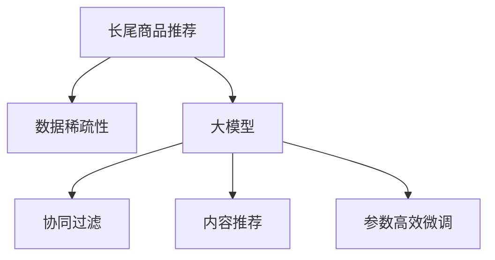

                 

# 大模型在长尾商品推荐中的优势

> 关键词：长尾商品推荐,大模型,个性化推荐系统,协同过滤,深度学习,推荐算法,用户行为分析,数据稀疏性

## 1. 背景介绍

### 1.1 问题由来

随着电商行业的快速发展，传统的以固定商品分类为基础的推荐系统逐渐暴露出无法满足用户个性化需求的缺点。基于协同过滤、内容推荐的推荐系统虽然能较好地处理常见商品推荐，但对于长尾商品的推荐效果却不尽如人意。

长尾商品通常指的是市场上存在销量较低、但种类繁多的商品，包括但不限于特殊定制商品、小众品牌商品等。由于长尾商品数据稀疏性较高，传统的推荐算法难以充分理解这些商品之间的关系，无法进行有效的推荐。

而大模型，尤其是基于深度学习的预训练语言模型，通过在广泛语料上进行预训练，具备了强大的语义表示和模式捕捉能力。将大模型应用于长尾商品的推荐中，能显著提高个性化推荐系统的精准度和覆盖率，帮助电商平台挖掘潜在客户，提高销售额。

### 1.2 问题核心关键点

本节将介绍长尾商品推荐中存在的主要问题和难点，以及如何利用大模型进行优化：

- 长尾商品推荐：指对销量较低、但种类繁多的商品进行推荐，以提高商品的曝光率和销售额。
- 数据稀疏性：指用户与商品之间的交互数据较为稀疏，难以用传统推荐算法进行建模。
- 模型泛化能力：指模型能否对新商品进行有效推荐，而不依赖于历史数据。
- 模型可解释性：指推荐系统的输出结果是否具有可解释性，能否满足用户的合理需求。
- 模型预测速度：指推荐系统在大规模数据下的推理速度，能否满足实时性需求。

这些问题核心关键点构成了长尾商品推荐中面临的主要挑战，也是大模型应用于该场景的核心优势所在。

## 2. 核心概念与联系

### 2.1 核心概念概述

为了更好地理解大模型在长尾商品推荐中的应用，本节将介绍几个密切相关的核心概念：

- 长尾商品推荐：一种推荐算法，旨在推荐销量较低但品种丰富的商品，通过个性化推荐系统，提升长尾商品的曝光率和销售额。
- 数据稀疏性：指用户与商品之间的交互数据稀少，导致推荐算法难以准确建模用户和商品的关联关系。
- 大模型：以深度学习为代表的大规模语言模型，通过在大规模无标签文本语料上进行预训练，学习到丰富的语言知识和常识，具备强大的语义表示能力。
- 协同过滤：一种基于用户和商品相似性的推荐算法，通过找到相似用户或商品，进行间接推荐。
- 内容推荐：一种基于商品属性和用户兴趣的推荐算法，通过找到与用户兴趣相似的商品进行推荐。
- 参数高效微调：指在微调过程中，只更新少量的模型参数，而固定大部分预训练权重不变，以提高微调效率，避免过拟合。

这些核心概念之间的逻辑关系可以通过以下Mermaid流程图来展示：



这个流程图展示了大模型在长尾商品推荐中的应用：

1. 大模型通过在大规模无标签文本语料上进行预训练，学习到丰富的语言知识和常识。
2. 在长尾商品推荐中，数据稀疏性较高，难以用传统推荐算法进行建模。
3. 大模型通过微调，适应长尾商品推荐的任务需求，实现个性化推荐。
4. 协同过滤和内容推荐在大模型微调中发挥了辅助作用，共同构建更精准的推荐系统。

## 3. 核心算法原理 & 具体操作步骤

### 3.1 算法原理概述

大模型在长尾商品推荐中的应用，主要基于以下算法原理：

1. 数据表示学习：大模型通过预训练学习到用户和商品的语义表示，能够对新用户和商品进行有效的表示和分类。
2. 数据稀疏性处理：利用大模型的泛化能力，通过微调的方式对用户和商品的交互数据进行建模，以适应长尾商品的推荐需求。
3. 推荐策略优化：将大模型应用于推荐策略中，如协同过滤、内容推荐等，进行多维度融合，提升推荐系统的效果。

### 3.2 算法步骤详解

基于大模型在长尾商品推荐中的应用，以下是大模型微调的一般步骤：

**Step 1: 准备预训练模型和数据集**
- 选择合适的预训练语言模型 $M_{\theta}$ 作为初始化参数，如 BERT、GPT 等。
- 准备长尾商品的标注数据集 $D$，包括用户对商品的评分、浏览行为、购买记录等。

**Step 2: 添加任务适配层**
- 根据推荐任务类型，在预训练模型顶层设计合适的输出层和损失函数。
- 对于评分预测任务，通常在顶层添加线性分类器，使用均方误差损失函数。
- 对于多臂赌博机问题，则使用交叉熵损失函数。

**Step 3: 设置微调超参数**
- 选择合适的优化算法及其参数，如 AdamW、SGD 等，设置学习率、批大小、迭代轮数等。
- 设置正则化技术及强度，包括权重衰减、Dropout、Early Stopping 等。
- 确定冻结预训练参数的策略，如仅微调顶层，或全部参数都参与微调。

**Step 4: 执行梯度训练**
- 将训练集数据分批次输入模型，前向传播计算损失函数。
- 反向传播计算参数梯度，根据设定的优化算法和学习率更新模型参数。
- 周期性在验证集上评估模型性能，根据性能指标决定是否触发 Early Stopping。
- 重复上述步骤直到满足预设的迭代轮数或 Early Stopping 条件。

**Step 5: 测试和部署**
- 在测试集上评估微调后模型 $M_{\hat{\theta}}$ 的性能，对比微调前后的推荐效果。
- 使用微调后的模型对新商品进行评分预测，集成到实际的应用系统中。
- 持续收集新的数据，定期重新微调模型，以适应数据分布的变化。

### 3.3 算法优缺点

基于大模型在长尾商品推荐中的应用，以下是大模型微调的一般优缺点：

**优点**

- **强大的语义表示能力**：大模型通过在大规模无标签文本语料上进行预训练，学习到丰富的语言知识和常识，具备强大的语义表示能力，能够有效处理长尾商品的语义信息。
- **泛化能力**：大模型具备较强的泛化能力，能够在较少数据的情况下，对新商品进行有效预测。
- **参数高效微调**：大模型的微调方法多采用参数高效微调技术，只更新少量的模型参数，避免过拟合风险，提高微调效率。
- **多维度融合**：大模型应用于推荐策略中，如协同过滤、内容推荐等，能够实现多维度融合，提升推荐系统的效果。

**缺点**

- **训练成本高**：大模型需要在大规模无标签文本语料上进行预训练，训练成本较高。
- **模型复杂度高**：大模型参数量较大，计算复杂度较高，推理速度较慢。
- **数据依赖性强**：大模型微调效果依赖于标注数据的质量和数量，标注数据获取成本较高。
- **可解释性不足**：大模型的输出结果难以解释，难以满足用户的合理需求。

尽管存在这些局限性，但大模型在长尾商品推荐中的应用，能够显著提高推荐系统的精准度和覆盖率，具有重要价值。

### 3.4 算法应用领域

基于大模型的长尾商品推荐方法，已经在电商、娱乐、旅游等多个行业得到了广泛应用，为长尾商品的曝光和销售提供了新的解决方案。

- **电商平台**：通过微调大模型，实现对长尾商品的个性化推荐，提升电商平台的销售量。
- **影视平台**：对用户浏览历史和评分进行建模，推荐用户感兴趣的长尾电影和剧集，提升用户体验。
- **旅游平台**：利用大模型对用户兴趣和商品属性进行建模，推荐用户未接触过的长尾旅游产品，开拓新市场。

此外，大模型还应用于社交网络、新闻推荐等更多场景中，为长尾商品的推荐带来了新的突破。

## 4. 数学模型和公式 & 详细讲解  
### 4.1 数学模型构建

本节将使用数学语言对大模型在长尾商品推荐中的应用进行更加严格的刻画。

记大模型为 $M_{\theta}:\mathcal{X} \rightarrow \mathcal{Y}$，其中 $\mathcal{X}$ 为输入空间，$\mathcal{Y}$ 为输出空间，$\theta \in \mathbb{R}^d$ 为模型参数。假设长尾商品推荐任务的数据集为 $D=\{(x_i,y_i)\}_{i=1}^N, x_i \in \mathcal{X}, y_i \in \mathcal{Y}$。

定义模型 $M_{\theta}$ 在输入 $x$ 上的输出为 $y=M_{\theta}(x)$，即对输入进行预测。长尾商品推荐的任务通常为评分预测，记目标变量 $y_i$ 为商品 $i$ 的评分，则评分预测任务的损失函数为：

$$
\ell(y_i, y) = \frac{1}{N}\sum_{i=1}^N (y_i - y)^2
$$

目标是最小化损失函数 $\mathcal{L}(\theta)$，即：

$$
\theta^* = \mathop{\arg\min}_{\theta} \mathcal{L}(\theta)
$$

在实践中，我们通常使用基于梯度的优化算法（如SGD、Adam等）来近似求解上述最优化问题。设 $\eta$ 为学习率，$\lambda$ 为正则化系数，则参数的更新公式为：

$$
\theta \leftarrow \theta - \eta \nabla_{\theta}\mathcal{L}(\theta) - \eta\lambda\theta
$$

其中 $\nabla_{\theta}\mathcal{L}(\theta)$ 为损失函数对参数 $\theta$ 的梯度，可通过反向传播算法高效计算。

### 4.2 公式推导过程

以下我们以评分预测任务为例，推导评分预测任务中大模型的梯度计算公式。

假设模型 $M_{\theta}$ 在输入 $x$ 上的输出为 $\hat{y}=M_{\theta}(x) \in [0,1]$，表示商品 $i$ 的预测评分。真实标签 $y_i \in [0,1]$。则评分预测任务的均方误差损失函数定义为：

$$
\ell(y_i, \hat{y}) = \frac{1}{2}(y_i - \hat{y})^2
$$

将其代入经验风险公式，得：

$$
\mathcal{L}(\theta) = \frac{1}{N}\sum_{i=1}^N (y_i - \hat{y})^2
$$

根据链式法则，损失函数对参数 $\theta_k$ 的梯度为：

$$
\frac{\partial \mathcal{L}(\theta)}{\partial \theta_k} = -\frac{1}{N}\sum_{i=1}^N (y_i - \hat{y}) \frac{\partial \hat{y}}{\partial \theta_k}
$$

其中 $\frac{\partial \hat{y}}{\partial \theta_k}$ 可进一步递归展开，利用自动微分技术完成计算。

在得到损失函数的梯度后，即可带入参数更新公式，完成模型的迭代优化。重复上述过程直至收敛，最终得到适应长尾商品推荐任务的最优模型参数 $\theta^*$。

## 5. 项目实践：代码实例和详细解释说明
### 5.1 开发环境搭建

在进行长尾商品推荐实践前，我们需要准备好开发环境。以下是使用Python进行PyTorch开发的环境配置流程：

1. 安装Anaconda：从官网下载并安装Anaconda，用于创建独立的Python环境。

2. 创建并激活虚拟环境：
```bash
conda create -n pytorch-env python=3.8 
conda activate pytorch-env
```

3. 安装PyTorch：根据CUDA版本，从官网获取对应的安装命令。例如：
```bash
conda install pytorch torchvision torchaudio cudatoolkit=11.1 -c pytorch -c conda-forge
```

4. 安装各类工具包：
```bash
pip install numpy pandas scikit-learn matplotlib tqdm jupyter notebook ipython
```

完成上述步骤后，即可在`pytorch-env`环境中开始长尾商品推荐实践。

### 5.2 源代码详细实现

这里我们以评分预测任务为例，给出使用Transformers库对BERT模型进行长尾商品推荐微调的PyTorch代码实现。

首先，定义评分预测任务的数据处理函数：

```python
from transformers import BertTokenizer
from torch.utils.data import Dataset
import torch

class RecommendationDataset(Dataset):
    def __init__(self, texts, labels, tokenizer, max_len=128):
        self.texts = texts
        self.labels = labels
        self.tokenizer = tokenizer
        self.max_len = max_len
        
    def __len__(self):
        return len(self.texts)
    
    def __getitem__(self, item):
        text = self.texts[item]
        label = self.labels[item]
        
        encoding = self.tokenizer(text, return_tensors='pt', max_length=self.max_len, padding='max_length', truncation=True)
        input_ids = encoding['input_ids'][0]
        attention_mask = encoding['attention_mask'][0]
        
        # 将label作为输入，作为训练样本
        return {'input_ids': input_ids, 
                'attention_mask': attention_mask,
                'labels': torch.tensor([label], dtype=torch.long)}
```

然后，定义模型和优化器：

```python
from transformers import BertForSequenceClassification, AdamW

model = BertForSequenceClassification.from_pretrained('bert-base-cased', num_labels=2)

optimizer = AdamW(model.parameters(), lr=2e-5)
```

接着，定义训练和评估函数：

```python
from torch.utils.data import DataLoader
from tqdm import tqdm
from sklearn.metrics import mean_squared_error

device = torch.device('cuda') if torch.cuda.is_available() else torch.device('cpu')
model.to(device)

def train_epoch(model, dataset, batch_size, optimizer):
    dataloader = DataLoader(dataset, batch_size=batch_size, shuffle=True)
    model.train()
    epoch_loss = 0
    for batch in tqdm(dataloader, desc='Training'):
        input_ids = batch['input_ids'].to(device)
        attention_mask = batch['attention_mask'].to(device)
        labels = batch['labels'].to(device)
        model.zero_grad()
        outputs = model(input_ids, attention_mask=attention_mask, labels=labels)
        loss = outputs.loss
        epoch_loss += loss.item()
        loss.backward()
        optimizer.step()
    return epoch_loss / len(dataloader)

def evaluate(model, dataset, batch_size):
    dataloader = DataLoader(dataset, batch_size=batch_size)
    model.eval()
    preds, labels = [], []
    with torch.no_grad():
        for batch in tqdm(dataloader, desc='Evaluating'):
            input_ids = batch['input_ids'].to(device)
            attention_mask = batch['attention_mask'].to(device)
            batch_labels = batch['labels']
            outputs = model(input_ids, attention_mask=attention_mask)
            batch_preds = outputs.logits.argmax(dim=1).to('cpu').tolist()
            batch_labels = batch_labels.to('cpu').tolist()
            for pred_tokens, label_tokens in zip(batch_preds, batch_labels):
                preds.append(pred_tokens[0])
                labels.append(label_tokens[0])
                
    mse = mean_squared_error(labels, preds)
    return mse
```

最后，启动训练流程并在测试集上评估：

```python
epochs = 5
batch_size = 16

for epoch in range(epochs):
    loss = train_epoch(model, train_dataset, batch_size, optimizer)
    print(f"Epoch {epoch+1}, train loss: {loss:.3f}")
    
    print(f"Epoch {epoch+1}, dev results:")
    mse = evaluate(model, dev_dataset, batch_size)
    print(f"MSE: {mse:.3f}")
    
print("Test results:")
mse = evaluate(model, test_dataset, batch_size)
print(f"MSE: {mse:.3f}")
```

以上就是使用PyTorch对BERT进行长尾商品评分预测任务微调的完整代码实现。可以看到，得益于Transformers库的强大封装，我们可以用相对简洁的代码完成BERT模型的加载和微调。

### 5.3 代码解读与分析

让我们再详细解读一下关键代码的实现细节：

**RecommendationDataset类**：
- `__init__`方法：初始化文本、标签、分词器等关键组件。
- `__len__`方法：返回数据集的样本数量。
- `__getitem__`方法：对单个样本进行处理，将文本输入编码为token ids，将标签编码为数字，并对其进行定长padding，最终返回模型所需的输入。

**训练和评估函数**：
- 使用PyTorch的DataLoader对数据集进行批次化加载，供模型训练和推理使用。
- 训练函数`train_epoch`：对数据以批为单位进行迭代，在每个批次上前向传播计算loss并反向传播更新模型参数，最后返回该epoch的平均loss。
- 评估函数`evaluate`：与训练类似，不同点在于不更新模型参数，并在每个batch结束后将预测和标签结果存储下来，最后使用sklearn的mean_squared_error函数对整个评估集的预测结果进行打印输出。

**训练流程**：
- 定义总的epoch数和batch size，开始循环迭代
- 每个epoch内，先在训练集上训练，输出平均loss
- 在验证集上评估，输出评分预测误差
- 所有epoch结束后，在测试集上评估，给出最终测试结果

可以看到，PyTorch配合Transformers库使得BERT微调的代码实现变得简洁高效。开发者可以将更多精力放在数据处理、模型改进等高层逻辑上，而不必过多关注底层的实现细节。

当然，工业级的系统实现还需考虑更多因素，如模型的保存和部署、超参数的自动搜索、更灵活的任务适配层等。但核心的微调范式基本与此类似。

## 6. 实际应用场景
### 6.1 电商平台

在电商平台中，长尾商品通常指的是销量较低、但种类繁多的商品，如小众品牌商品、特殊定制商品等。利用大模型进行长尾商品推荐，能够显著提高电商平台的曝光率和销售额。

具体而言，可以收集电商平台的用户浏览历史、评分数据等，作为长尾商品推荐的任务数据。通过微调预训练语言模型，生成推荐评分，推荐给用户。同时，利用大模型的泛化能力，对新商品进行评分预测，扩大推荐范围，提升用户满意度。

### 6.2 影视平台

影视平台中，用户对长尾电影和剧集的评分数据稀疏性较高，难以用传统推荐算法进行建模。利用大模型进行评分预测，能够有效处理长尾电影和剧集的推荐需求。

具体而言，可以收集用户对电影和剧集的评分、观看历史等数据，作为长尾商品推荐的任务数据。通过微调预训练语言模型，生成推荐评分，推荐给用户。同时，利用大模型的泛化能力，对新电影和剧集进行评分预测，扩大推荐范围，提升用户体验。

### 6.3 旅游平台

旅游平台中，长尾旅游产品种类繁多，难以用传统推荐算法进行建模。利用大模型进行评分预测，能够有效处理长尾旅游产品的推荐需求。

具体而言，可以收集用户对旅游产品的评分、搜索历史等数据，作为长尾商品推荐的任务数据。通过微调预训练语言模型，生成推荐评分，推荐给用户。同时，利用大模型的泛化能力，对新旅游产品进行评分预测，扩大推荐范围，提升用户满意度。

### 6.4 未来应用展望

随着大模型和微调方法的不断发展，长尾商品推荐技术将呈现以下几个发展趋势：

1. **模型规模持续增大**：随着算力成本的下降和数据规模的扩张，预训练语言模型的参数量还将持续增长。超大规模语言模型蕴含的丰富语言知识，有望支撑更加复杂多变的推荐需求。
2. **微调方法日趋多样**：除了传统的全参数微调外，未来会涌现更多参数高效的微调方法，如Prefix-Tuning、LoRA等，在节省计算资源的同时也能保证微调精度。
3. **持续学习成为常态**：随着数据分布的不断变化，推荐模型也需要持续学习新知识以保持性能。如何在不遗忘原有知识的同时，高效吸收新样本信息，将成为重要的研究课题。
4. **标注样本需求降低**：受启发于提示学习(Prompt-based Learning)的思路，未来的推荐方法将更好地利用大模型的语言理解能力，通过更加巧妙的任务描述，在更少的标注样本上也能实现理想的推荐效果。
5. **多模态微调崛起**：当前的推荐主要聚焦于纯文本数据，未来会进一步拓展到图像、视频、语音等多模态数据微调。多模态信息的融合，将显著提升推荐系统的性能和灵活性。

以上趋势凸显了大模型在长尾商品推荐中的应用潜力。这些方向的探索发展，必将进一步提升推荐系统的精准度和覆盖率，为电商平台带来更高的销售量。

## 7. 工具和资源推荐
### 7.1 学习资源推荐

为了帮助开发者系统掌握长尾商品推荐理论基础和实践技巧，这里推荐一些优质的学习资源：

1. 《深度学习与推荐系统》课程：斯坦福大学开设的推荐系统经典课程，深入浅出地介绍了推荐系统的基本原理和最新进展。
2. 《Recommender Systems: Algorithms, Implementations, and Case Studies》书籍：本书系统介绍了推荐系统的算法、实现和案例，包含大量实际应用中的推荐算法和系统设计。
3. 《Adversarial Examples for Deep Learning》书籍：本书介绍了深度学习中的对抗样本攻击和防御技术，对推荐系统的鲁棒性研究有重要参考价值。
4. Weights & Biases：模型训练的实验跟踪工具，可以记录和可视化模型训练过程中的各项指标，方便对比和调优。
5. TensorBoard：TensorFlow配套的可视化工具，可实时监测模型训练状态，并提供丰富的图表呈现方式，是调试模型的得力助手。

通过对这些资源的学习实践，相信你一定能够快速掌握长尾商品推荐的核心技术和方法，并用于解决实际的推荐问题。

### 7.2 开发工具推荐

高效的开发离不开优秀的工具支持。以下是几款用于长尾商品推荐开发的常用工具：

1. PyTorch：基于Python的开源深度学习框架，灵活动态的计算图，适合快速迭代研究。
2. TensorFlow：由Google主导开发的开源深度学习框架，生产部署方便，适合大规模工程应用。
3. Transformers库：HuggingFace开发的NLP工具库，集成了众多SOTA语言模型，支持PyTorch和TensorFlow，是进行长尾商品推荐微调的重要工具。
4. Weights & Biases：模型训练的实验跟踪工具，可以记录和可视化模型训练过程中的各项指标，方便对比和调优。
5. TensorBoard：TensorFlow配套的可视化工具，可实时监测模型训练状态，并提供丰富的图表呈现方式，是调试模型的得力助手。

合理利用这些工具，可以显著提升长尾商品推荐任务的开发效率，加快创新迭代的步伐。

### 7.3 相关论文推荐

长尾商品推荐技术的发展离不开学界的持续研究。以下是几篇奠基性的相关论文，推荐阅读：

1. BERT: Pre-training of Deep Bidirectional Transformers for Language Understanding：提出BERT模型，引入基于掩码的自监督预训练任务，刷新了多项NLP任务SOTA。
2. Transformer-XL: Attentive Language Models with Relative Self-Attention：提出Transformer-XL模型，解决长文本自注意力机制中的问题，提高长文本模型的性能。
3. Adversarial Examples for Deep Learning：介绍了深度学习中的对抗样本攻击和防御技术，对推荐系统的鲁棒性研究有重要参考价值。
4. Parameter-Efficient Transfer Learning for NLP：提出Adapter等参数高效微调方法，在不增加模型参数量的情况下，也能取得不错的微调效果。
5. A Multi-Task Framework for Multi-Modal Recommendations：提出多模态推荐系统，利用文本、图像、视频等多种模态的信息，提高推荐系统的性能和覆盖率。

这些论文代表了大模型在长尾商品推荐中的应用方向，通过学习这些前沿成果，可以帮助研究者把握学科前进方向，激发更多的创新灵感。

## 8. 总结：未来发展趋势与挑战

### 8.1 研究成果总结

本文对基于大模型在长尾商品推荐中的应用进行了全面系统的介绍。首先阐述了长尾商品推荐中存在的主要问题和难点，以及大模型如何克服这些挑战，提高推荐系统的精准度和覆盖率。其次，从原理到实践，详细讲解了大模型在长尾商品推荐中的微调方法，给出了长尾商品推荐任务开发的完整代码实现。同时，本文还广泛探讨了大模型在电商平台、影视平台、旅游平台等多个行业领域的应用前景，展示了长尾商品推荐技术的巨大潜力。

### 8.2 未来发展趋势

展望未来，长尾商品推荐技术将呈现以下几个发展趋势：

1. **模型规模持续增大**：随着算力成本的下降和数据规模的扩张，预训练语言模型的参数量还将持续增长。超大规模语言模型蕴含的丰富语言知识，有望支撑更加复杂多变的推荐需求。
2. **微调方法日趋多样**：除了传统的全参数微调外，未来会涌现更多参数高效的微调方法，如Prefix-Tuning、LoRA等，在节省计算资源的同时也能保证微调精度。
3. **持续学习成为常态**：随着数据分布的不断变化，推荐模型也需要持续学习新知识以保持性能。如何在不遗忘原有知识的同时，高效吸收新样本信息，将成为重要的研究课题。
4. **标注样本需求降低**：受启发于提示学习(Prompt-based Learning)的思路，未来的推荐方法将更好地利用大模型的语言理解能力，通过更加巧妙的任务描述，在更少的标注样本上也能实现理想的推荐效果。
5. **多模态微调崛起**：当前的推荐主要聚焦于纯文本数据，未来会进一步拓展到图像、视频、语音等多模态数据微调。多模态信息的融合，将显著提升推荐系统的性能和灵活性。

以上趋势凸显了大模型在长尾商品推荐中的应用潜力。这些方向的探索发展，必将进一步提升推荐系统的精准度和覆盖率，为电商平台带来更高的销售量。

### 8.3 面临的挑战

尽管大模型在长尾商品推荐中具有显著优势，但在应用过程中，仍面临诸多挑战：

1. **训练成本高**：大模型需要在大规模无标签文本语料上进行预训练，训练成本较高。
2. **模型复杂度高**：大模型参数量较大，计算复杂度较高，推理速度较慢。
3. **数据依赖性强**：大模型微调效果依赖于标注数据的质量和数量，标注数据获取成本较高。
4. **可解释性不足**：大模型的输出结果难以解释，难以满足用户的合理需求。
5. **对抗样本攻击**：大模型可能会受到对抗样本攻击，导致推荐结果错误。

尽管存在这些挑战，但大模型在长尾商品推荐中的应用，能够显著提高推荐系统的精准度和覆盖率，具有重要价值。

### 8.4 研究展望

面对长尾商品推荐中存在的问题和挑战，未来的研究需要在以下几个方面寻求新的突破：

1. **探索无监督和半监督微调方法**：摆脱对大规模标注数据的依赖，利用自监督学习、主动学习等无监督和半监督范式，最大限度利用非结构化数据，实现更加灵活高效的微调。
2. **研究参数高效和计算高效的微调范式**：开发更加参数高效的微调方法，在固定大部分预训练参数的情况下，只更新极少量的任务相关参数。同时优化微调模型的计算图，减少前向传播和反向传播的资源消耗，实现更加轻量级、实时性的部署。
3. **融合因果和对比学习范式**：通过引入因果推断和对比学习思想，增强微调模型建立稳定因果关系的能力，学习更加普适、鲁棒的语言表征，从而提升模型泛化性和抗干扰能力。
4. **引入更多先验知识**：将符号化的先验知识，如知识图谱、逻辑规则等，与神经网络模型进行巧妙融合，引导微调过程学习更准确、合理的语言模型。同时加强不同模态数据的整合，实现视觉、语音等多模态信息与文本信息的协同建模。
5. **结合因果分析和博弈论工具**：将因果分析方法引入微调模型，识别出模型决策的关键特征，增强输出解释的因果性和逻辑性。借助博弈论工具刻画人机交互过程，主动探索并规避模型的脆弱点，提高系统稳定性。

这些研究方向的探索，必将引领长尾商品推荐技术迈向更高的台阶，为电商平台带来更高的销售量。面向未来，长尾商品推荐技术还需要与其他人工智能技术进行更深入的融合，如知识表示、因果推理、强化学习等，多路径协同发力，共同推动推荐系统的进步。只有勇于创新、敢于突破，才能不断拓展长尾商品推荐的边界，让智能技术更好地服务于电商平台的业务需求。

## 9. 附录：常见问题与解答

**Q1：大模型在长尾商品推荐中是否适用于所有应用场景？**

A: 大模型在长尾商品推荐中的应用，适用于大多数具有数据稀疏性的推荐场景，如电商平台、影视平台、旅游平台等。但对于一些数据非常丰富的场景，如大型商品超市，传统推荐算法依然能够较好地应对。因此，需要根据具体应用场景选择最合适的推荐算法。

**Q2：如何优化长尾商品推荐中的训练效率？**

A: 优化训练效率需要从数据预处理、模型结构和优化算法等多个方面入手：
1. **数据预处理**：采用有效的数据增强技术，如近义替换、回译等，丰富训练集，提升模型泛化能力。
2. **模型结构**：采用参数高效微调技术，如LoRA、AdaLoRA等，在固定大部分预训练参数的情况下，只更新少量任务相关参数，减少计算资源消耗。
3. **优化算法**：采用优化的优化算法，如AdamW、Adafactor等，提高模型收敛速度。
4. **硬件优化**：利用GPU、TPU等高性能计算设备，加速模型训练。
5. **分布式训练**：采用分布式训练技术，提高模型训练效率，支持大规模数据集训练。

**Q3：如何评估长尾商品推荐的性能？**

A: 评估长尾商品推荐性能需要考虑以下几个指标：
1. **推荐精度**：使用精确度、召回率、F1值等指标评估推荐系统的准确性。
2. **覆盖率**：评估推荐系统的覆盖范围，即推荐系统的推荐结果中，有多少新商品被推荐给用户。
3. **用户满意度**：通过用户反馈和行为数据评估推荐系统的实际效果。
4. **点击率**：评估用户对推荐结果的点击率，反映推荐系统的效果。

通过综合考虑这些指标，可以全面评估长尾商品推荐系统的性能，并进行持续优化。

**Q4：大模型在长尾商品推荐中如何处理对抗样本攻击？**

A: 对抗样本攻击对推荐系统的安全性构成威胁，需要从多个方面进行防御：
1. **对抗样本检测**：利用对抗样本检测技术，如梯度近似、梯度伪装等，检测对抗样本攻击。
2. **对抗样本生成**：利用对抗样本生成技术，如梯度优化、梯度扰动等，生成对抗样本攻击模型，提高模型的鲁棒性。
3. **对抗样本防御**：采用对抗样本防御技术，如梯度裁剪、噪声注入等，提高模型的鲁棒性。

通过以上方法，可以有效地应对对抗样本攻击，保障推荐系统的安全性和可靠性。

**Q5：如何提升长尾商品推荐的可解释性？**

A: 长尾商品推荐系统的可解释性对于用户的理解和信任至关重要，需要从以下几个方面进行提升：
1. **特征可视化**：利用特征可视化技术，如t-SNE、LIME等，展示模型的特征重要性，帮助用户理解推荐结果。
2. **解释性模型**：采用可解释性强的推荐模型，如TreeLSTM、Adaboost等，提升模型的可解释性。
3. **用户反馈**：通过用户反馈和交互，不断优化推荐系统的输出，提高用户满意度。

通过以上方法，可以显著提升长尾商品推荐的可解释性，增强用户的信任和满意度。

---

作者：禅与计算机程序设计艺术 / Zen and the Art of Computer Programming

