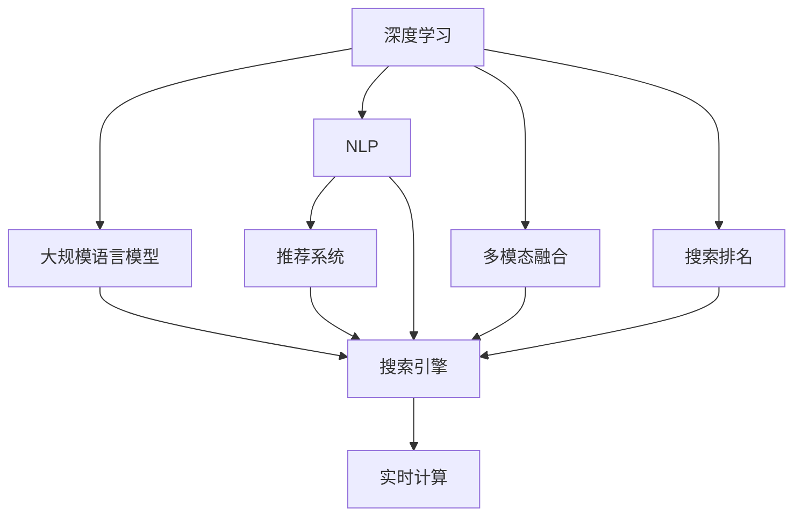

                 

# 大模型如何提升电商平台的搜索效率

> 关键词：电商搜索,大模型,搜索排名,个性化推荐,深度学习

## 1. 背景介绍

### 1.1 问题由来

在电子商务平台，搜索功能的优化是一个永恒的挑战。优质的搜索结果能大幅提升用户体验，增加交易转化率。传统搜索引擎的排序算法往往基于关键词匹配度和网站历史访问记录，难以充分理解用户的真实意图。而基于深度学习的大模型，能够利用自然语言理解、多模态融合等技术，对用户的查询需求进行更精确的解析和匹配。

近年来，深度学习模型在自然语言处理(NLP)领域的突破，为电商搜索优化提供了新的方向。利用大规模语言模型进行预训练，结合领域特定任务进行微调，能够大幅提升搜索结果的相关性和多样性。本文章将系统介绍大模型在电商搜索优化中的应用，展示如何借助深度学习技术，提升电商平台搜索效率。

### 1.2 问题核心关键点

大模型在电商搜索优化中的应用主要包括以下几个关键点：

- 利用预训练语言模型进行知识表示学习，提升搜索结果的相关性和多样性。
- 结合用户行为数据，进行个性化推荐，提供满足用户需求的搜索结果。
- 引入多模态融合技术，利用用户行为、商品信息等多方面数据，进行全面的搜索排序。
- 采用深度学习模型的推理能力，实现实时计算和动态排序。
- 结合规则和反馈机制，实现搜索算法的迭代优化和精准调整。

通过理解这些关键点，我们将更好地把握大模型在电商搜索中的价值和潜力，探索有效的优化策略。

### 1.3 问题研究意义

电商搜索的优化对于电商平台的发展具有重要意义：

1. 提升用户体验：优质的搜索结果能帮助用户快速找到所需商品，减少浏览时间和跳出率，提升用户满意度。
2. 增加交易转化率：通过精准推荐，展示满足用户需求的商品，提高下单转化率。
3. 提高运营效率：自动化的搜索优化能大幅减少人工干预，降低运营成本，提高平台运营效率。
4. 拓展市场竞争力：通过搜索排序优化，优化用户体验，增强平台的用户黏性和竞争力。

因此，借助深度学习和大模型技术，改进电商搜索功能，是一个具有战略意义的课题。

## 2. 核心概念与联系

### 2.1 核心概念概述

为更好地理解大模型在电商搜索中的应用，本节将介绍几个关键概念：

- **深度学习(Deep Learning)**：基于多层神经网络的机器学习技术，能从大量数据中自动提取特征，适用于复杂任务。
- **自然语言处理(NLP)**：研究如何使计算机理解和生成人类语言的技术，如分词、词性标注、语义分析等。
- **大规模语言模型(Large Language Models, LLMs)**：通过在大规模无标签文本数据上预训练，学习语言表示的大规模神经网络模型。
- **搜索引擎(Search Engine)**：利用算法对用户查询进行处理，并从数据库中返回最相关的结果的系统。
- **推荐系统(Recommendation System)**：利用用户行为数据，推荐用户可能感兴趣的商品或内容，提升用户体验和转化率。
- **多模态融合(Multimodal Fusion)**：将不同模态的信息，如文本、图片、视频等，进行融合处理，提升搜索排序的全面性。
- **实时计算(Real-time Computation)**：指在数据输入后短时间内处理并返回结果的计算技术，适用于电商搜索的动态排序需求。
- **搜索排名(Search Ranking)**：指搜索引擎对搜索结果进行排序，使用户能快速找到最相关的商品或信息。

这些核心概念之间的逻辑关系可以通过以下Mermaid流程图来展示：



这个流程图展示了大模型在电商搜索中的应用框架：

1. 利用深度学习技术，研究NLP任务，进行知识表示学习。
2. 使用大规模语言模型进行预训练，学习通用的语言知识。
3. 结合推荐系统，利用用户行为数据进行个性化推荐。
4. 构建搜索引擎，实现搜索结果的排序。
5. 引入多模态融合技术，利用多种数据源提升搜索结果的全面性。
6. 应用实时计算，实现动态排序，提升搜索效率。
7. 通过搜索排名算法，优化搜索结果的相关性。

这些概念共同构成了大模型在电商搜索中的应用框架，使其能够在用户需求解析、商品匹配和排序等方面发挥强大的作用。

## 3. 核心算法原理 & 具体操作步骤

### 3.1 算法原理概述

基于大模型的电商搜索优化，本质上是一个多任务学习过程。其核心思想是：利用预训练语言模型进行知识表示学习，并通过微调结合推荐系统，优化搜索排序算法。

形式化地，假设预训练语言模型为 $M_{\theta}$，其中 $\theta$ 为预训练得到的模型参数。给定电商平台的搜索任务 $T$ 和用户查询 $q$，以及相关商品集 $S=\{s_i\}_{i=1}^N$，搜索优化的目标是最小化用户对搜索结果的损失函数，即：

$$
\theta^* = \mathop{\arg\min}_{\theta} \mathcal{L}(M_{\theta},q,S)
$$

其中 $\mathcal{L}$ 为针对任务 $T$ 设计的损失函数，用于衡量搜索结果与用户查询的相关性和多样性。常见的损失函数包括交叉熵损失、平均绝对误差损失等。

通过梯度下降等优化算法，搜索优化过程不断更新模型参数 $\theta$，最小化损失函数 $\mathcal{L}$，使得搜索结果逼近用户查询，最终得到适应搜索任务的最优模型参数 $\theta^*$。

### 3.2 算法步骤详解

基于大模型的电商搜索优化一般包括以下几个关键步骤：

**Step 1: 准备预训练模型和数据集**
- 选择合适的预训练语言模型 $M_{\theta}$ 作为初始化参数，如BERT、GPT等。
- 准备电商平台的数据集 $D$，包括用户查询、商品信息、用户行为等。一般要求数据集与预训练模型的分布不要差异过大。

**Step 2: 添加任务适配层**
- 根据电商搜索任务类型，在预训练模型顶层设计合适的输出层和损失函数。
- 对于商品排序任务，通常在顶层添加输出层，使用余弦相似度计算相似度，并以平均绝对误差为损失函数。
- 对于推荐任务，通常使用推荐系统中的协同过滤、深度学习等方法，学习推荐目标。

**Step 3: 设置优化超参数**
- 选择合适的优化算法及其参数，如 Adam、SGD 等，设置学习率、批大小、迭代轮数等。
- 设置正则化技术及强度，包括权重衰减、Dropout、Early Stopping 等。
- 确定冻结预训练参数的策略，如仅微调顶层，或全部参数都参与微调。

**Step 4: 执行梯度训练**
- 将数据集数据分批次输入模型，前向传播计算损失函数。
- 反向传播计算参数梯度，根据设定的优化算法和学习率更新模型参数。
- 周期性在验证集上评估模型性能，根据性能指标决定是否触发 Early Stopping。
- 重复上述步骤直到满足预设的迭代轮数或 Early Stopping 条件。

**Step 5: 测试和部署**
- 在测试集上评估微调后模型 $M_{\hat{\theta}}$ 的性能，对比微调前后的精度提升。
- 使用微调后的模型对新查询进行推理预测，集成到实际的应用系统中。
- 持续收集新的用户行为和商品信息，定期重新微调模型，以适应数据分布的变化。

以上是基于大模型电商搜索优化的完整流程。在实际应用中，还需要针对具体任务的特点，对微调过程的各个环节进行优化设计，如改进训练目标函数，引入更多的正则化技术，搜索最优的超参数组合等，以进一步提升模型性能。

### 3.3 算法优缺点

基于大模型的电商搜索优化方法具有以下优点：
1. 简单高效。只需准备少量标注数据，即可对预训练模型进行快速适配，获得较大的性能提升。
2. 提升相关性和多样性。大模型通过预训练学习到广泛的语言知识，结合推荐系统，能够提供更相关和多样化的搜索结果。
3. 实时计算能力。利用深度学习模型的推理能力，实现实时计算和动态排序，提升用户体验。
4. 可解释性。大模型具备强大的语言理解能力，便于对搜索结果的生成过程进行解释和调试。

同时，该方法也存在一定的局限性：
1. 依赖标注数据。搜索优化依赖于标注数据，获取高质量标注数据的成本较高。
2. 模型复杂度高。大规模语言模型往往参数量巨大，计算资源消耗高。
3. 可解释性不足。大模型决策过程难以解释，对于电商搜索这种高风险应用，可解释性尤为重要。
4. 负面效果传递。预训练模型的固有偏见、有害信息等，可能通过微调传递到下游任务，造成负面影响。

尽管存在这些局限性，但就目前而言，基于大模型的电商搜索优化方法仍然是大规模电商平台搜索排序的主流范式。未来相关研究的重点在于如何进一步降低对标注数据的依赖，提高模型的可解释性和鲁棒性，同时兼顾资源消耗和效果表现。

### 3.4 算法应用领域

基于大模型的电商搜索优化方法，在电商领域已经得到了广泛的应用，覆盖了几乎所有常见任务，例如：

- 商品排序：如搜索推荐、个性化展示等。利用大模型学习商品与查询的相关性。
- 实时推荐：如实时推荐商品、商品关联推荐等。结合用户行为数据，动态生成推荐结果。
- 商品分类：如商品信息抽取、类别预测等。利用大模型提取商品描述中的类别信息。
- 用户画像：如用户兴趣预测、个性化配置等。结合用户行为数据，建立用户画像模型。
- 广告投放：如关键词广告、展示广告等。利用大模型生成关键词和广告内容。

除了上述这些经典任务外，大模型在大数据、复杂场景下的电商搜索优化还具备更大的潜力和创新空间，为电商平台的搜索体验和运营效率提升带来了新的动力。

## 4. 数学模型和公式 & 详细讲解  
### 4.1 数学模型构建

本节将使用数学语言对基于大模型的电商搜索优化过程进行更加严格的刻画。

记预训练语言模型为 $M_{\theta}$，其中 $\theta$ 为预训练得到的模型参数。给定电商平台的搜索任务 $T$ 和用户查询 $q$，以及相关商品集 $S=\{s_i\}_{i=1}^N$。

定义模型 $M_{\theta}$ 在输入 $q$ 上的输出为 $\hat{y}=M_{\theta}(q) \in \mathbb{R}^N$，表示商品 $s_i$ 与查询 $q$ 的相关性得分。

电商搜索优化的目标是最小化用户对搜索结果的相关性和多样性损失，即：

$$
\mathcal{L}(\theta) = -\frac{1}{N}\sum_{i=1}^N \left[r_i \log \hat{y}_i + (1-r_i) \log (1-\hat{y}_i)\right]
$$

其中 $r_i$ 为商品 $s_i$ 是否为用户的最终选择，1表示选择，0表示未选择。通常通过点击率、购买率等指标衡量。

通过梯度下降等优化算法，优化过程不断更新模型参数 $\theta$，最小化损失函数 $\mathcal{L}$，使得商品排序逼近用户选择的最终结果。最终得到适应搜索任务的最优模型参数 $\theta^*$。

### 4.2 公式推导过程

以下我们以商品排序任务为例，推导交叉熵损失函数及其梯度的计算公式。

假设模型 $M_{\theta}$ 在输入 $q$ 上的输出为 $\hat{y}=M_{\theta}(q) \in \mathbb{R}^N$，表示商品 $s_i$ 与查询 $q$ 的相关性得分。真实标签 $r \in \{0,1\}$。则交叉熵损失函数定义为：

$$
\ell(M_{\theta}(q),r) = -[r\log \hat{y} + (1-r)\log (1-\hat{y})]
$$

将其代入经验风险公式，得：

$$
\mathcal{L}(\theta) = -\frac{1}{N}\sum_{i=1}^N [r_i \log M_{\theta}(q_i)+(1-r_i)\log(1-M_{\theta}(q_i))]
$$

根据链式法则，损失函数对参数 $\theta_k$ 的梯度为：

$$
\frac{\partial \mathcal{L}(\theta)}{\partial \theta_k} = -\frac{1}{N}\sum_{i=1}^N \left(\frac{r_i}{M_{\theta}(q_i)}-\frac{1-r_i}{1-M_{\theta}(q_i)}\right) \frac{\partial M_{\theta}(q_i)}{\partial \theta_k}
$$

其中 $\frac{\partial M_{\theta}(q_i)}{\partial \theta_k}$ 可进一步递归展开，利用自动微分技术完成计算。

在得到损失函数的梯度后，即可带入参数更新公式，完成模型的迭代优化。重复上述过程直至收敛，最终得到适应电商搜索任务的最优模型参数 $\theta^*$。

## 5. 项目实践：代码实例和详细解释说明
### 5.1 开发环境搭建

在进行电商搜索优化实践前，我们需要准备好开发环境。以下是使用Python进行PyTorch开发的环境配置流程：

1. 安装Anaconda：从官网下载并安装Anaconda，用于创建独立的Python环境。

2. 创建并激活虚拟环境：
```bash
conda create -n ecommerce-env python=3.8 
conda activate ecommerce-env
```

3. 安装PyTorch：根据CUDA版本，从官网获取对应的安装命令。例如：
```bash
conda install pytorch torchvision torchaudio cudatoolkit=11.1 -c pytorch -c conda-forge
```

4. 安装相关库：
```bash
pip install numpy pandas scikit-learn torchtext transformers tqdm
```

5. 安装各类工具包：
```bash
pip install pandas scikit-learn torchtext transformers tqdm
```

完成上述步骤后，即可在`ecommerce-env`环境中开始电商搜索优化实践。

### 5.2 源代码详细实现

下面我们以电商平台的商品排序任务为例，给出使用Transformers库对预训练模型进行微调的PyTorch代码实现。

首先，定义商品排序任务的数据处理函数：

```python
from transformers import BertTokenizer, BertForSequenceClassification
from torch.utils.data import Dataset, DataLoader
import torch

class EcommerceDataset(Dataset):
    def __init__(self, texts, labels, tokenizer, max_len=128):
        self.texts = texts
        self.labels = labels
        self.tokenizer = tokenizer
        self.max_len = max_len
        
    def __len__(self):
        return len(self.texts)
    
    def __getitem__(self, item):
        text = self.texts[item]
        label = self.labels[item]
        
        encoding = self.tokenizer(text, return_tensors='pt', max_length=self.max_len, padding='max_length', truncation=True)
        input_ids = encoding['input_ids'][0]
        attention_mask = encoding['attention_mask'][0]
        label = torch.tensor(label, dtype=torch.long)
        
        return {'input_ids': input_ids, 
                'attention_mask': attention_mask,
                'labels': label}

# 定义标签与id的映射
label2id = {'0': 0, '1': 1}
id2label = {v: k for k, v in label2id.items()}

# 创建dataset
tokenizer = BertTokenizer.from_pretrained('bert-base-cased')

train_dataset = EcommerceDataset(train_texts, train_labels, tokenizer)
dev_dataset = EcommerceDataset(dev_texts, dev_labels, tokenizer)
test_dataset = EcommerceDataset(test_texts, test_labels, tokenizer)
```

然后，定义模型和优化器：

```python
from transformers import AdamW

model = BertForSequenceClassification.from_pretrained('bert-base-cased', num_labels=2)

optimizer = AdamW(model.parameters(), lr=2e-5)
```

接着，定义训练和评估函数：

```python
from tqdm import tqdm

device = torch.device('cuda') if torch.cuda.is_available() else torch.device('cpu')
model.to(device)

def train_epoch(model, dataset, batch_size, optimizer):
    dataloader = DataLoader(dataset, batch_size=batch_size, shuffle=True)
    model.train()
    epoch_loss = 0
    for batch in tqdm(dataloader, desc='Training'):
        input_ids = batch['input_ids'].to(device)
        attention_mask = batch['attention_mask'].to(device)
        labels = batch['labels'].to(device)
        model.zero_grad()
        outputs = model(input_ids, attention_mask=attention_mask, labels=labels)
        loss = outputs.loss
        epoch_loss += loss.item()
        loss.backward()
        optimizer.step()
    return epoch_loss / len(dataloader)

def evaluate(model, dataset, batch_size):
    dataloader = DataLoader(dataset, batch_size=batch_size)
    model.eval()
    preds, labels = [], []
    with torch.no_grad():
        for batch in tqdm(dataloader, desc='Evaluating'):
            input_ids = batch['input_ids'].to(device)
            attention_mask = batch['attention_mask'].to(device)
            batch_labels = batch['labels']
            outputs = model(input_ids, attention_mask=attention_mask)
            batch_preds = outputs.logits.argmax(dim=1).to('cpu').tolist()
            batch_labels = batch_labels.to('cpu').tolist()
            for pred, label in zip(batch_preds, batch_labels):
                preds.append(pred)
                labels.append(label)
                
    print(classification_report(labels, preds))
```

最后，启动训练流程并在测试集上评估：

```python
epochs = 5
batch_size = 16

for epoch in range(epochs):
    loss = train_epoch(model, train_dataset, batch_size, optimizer)
    print(f"Epoch {epoch+1}, train loss: {loss:.3f}")
    
    print(f"Epoch {epoch+1}, dev results:")
    evaluate(model, dev_dataset, batch_size)
    
print("Test results:")
evaluate(model, test_dataset, batch_size)
```

以上就是使用PyTorch对预训练模型进行电商商品排序任务微调的完整代码实现。可以看到，得益于Transformers库的强大封装，我们可以用相对简洁的代码完成模型的微调。

### 5.3 代码解读与分析

让我们再详细解读一下关键代码的实现细节：

**EcommerceDataset类**：
- `__init__`方法：初始化文本、标签、分词器等关键组件。
- `__len__`方法：返回数据集的样本数量。
- `__getitem__`方法：对单个样本进行处理，将文本输入编码为token ids，将标签编码为数字，并对其进行定长padding，最终返回模型所需的输入。

**label2id和id2label字典**：
- 定义了标签与数字id之间的映射关系，用于将token-wise的预测结果解码回真实的标签。

**训练和评估函数**：
- 使用PyTorch的DataLoader对数据集进行批次化加载，供模型训练和推理使用。
- 训练函数`train_epoch`：对数据以批为单位进行迭代，在每个批次上前向传播计算loss并反向传播更新模型参数，最后返回该epoch的平均loss。
- 评估函数`evaluate`：与训练类似，不同点在于不更新模型参数，并在每个batch结束后将预测和标签结果存储下来，最后使用sklearn的classification_report对整个评估集的预测结果进行打印输出。

**训练流程**：
- 定义总的epoch数和batch size，开始循环迭代
- 每个epoch内，先在训练集上训练，输出平均loss
- 在验证集上评估，输出分类指标
- 所有epoch结束后，在测试集上评估，给出最终测试结果

可以看到，PyTorch配合Transformers库使得电商商品排序任务的微调代码实现变得简洁高效。开发者可以将更多精力放在数据处理、模型改进等高层逻辑上，而不必过多关注底层的实现细节。

当然，工业级的系统实现还需考虑更多因素，如模型的保存和部署、超参数的自动搜索、更灵活的任务适配层等。但核心的微调范式基本与此类似。

## 6. 实际应用场景
### 6.1 智能客服系统

基于大模型微调的电商搜索技术，可以广泛应用于智能客服系统的构建。传统客服往往需要配备大量人力，高峰期响应缓慢，且一致性和专业性难以保证。而使用微调后的电商搜索技术，可以7x24小时不间断服务，快速响应客户咨询，用自然流畅的语言解答各类常见问题。

在技术实现上，可以收集客户的历史搜索记录和反馈，将问题和最佳答复构建成监督数据，在此基础上对预训练电商搜索模型进行微调。微调后的电商搜索模型能够自动理解客户意图，匹配最合适的商品推荐，引导客户快速找到所需商品。对于客户提出的新问题，还可以接入检索系统实时搜索相关内容，动态组织生成回答。如此构建的智能客服系统，能大幅提升客户咨询体验和问题解决效率。

### 6.2 个性化推荐系统

当前的推荐系统往往只依赖用户的历史行为数据进行物品推荐，难以充分理解用户的真实兴趣偏好。基于大模型微调的电商搜索技术，可以更好地挖掘用户行为背后的语义信息，从而提供更精准、多样的推荐内容。

在实践中，可以收集用户浏览、点击、评论、分享等行为数据，提取和用户交互的商品标题、描述、标签等文本内容。将文本内容作为模型输入，用户的后续行为（如是否点击、购买等）作为监督信号，在此基础上微调预训练语言模型。微调后的模型能够从文本内容中准确把握用户的兴趣点。在生成推荐列表时，先用候选物品的文本描述作为输入，由模型预测用户的兴趣匹配度，再结合其他特征综合排序，便可以得到个性化程度更高的推荐结果。

### 6.3 实时价格监控

电商平台的商品价格波动频繁，如何及时获取最新的价格信息，是电商搜索优化的重要应用场景。传统的价格监控依赖人工或者定时爬虫，存在数据不及时、爬虫被封禁等问题。利用大模型进行实时价格监控，可以提升价格数据的实时性，保证价格信息的准确性。

具体而言，可以收集商品的历史价格信息，并训练一个基于大模型的价格预测模型。模型根据商品的特征（如类别、品牌、销量等），预测商品的价格变化趋势。在每次商品价格变化时，立即重新训练模型，实时输出价格预测结果，从而实现价格监控和预警。

### 6.4 未来应用展望

随着大模型和微调方法的不断发展，基于微调范式将在更多领域得到应用，为电商平台的搜索体验和运营效率提升带来新的动力。

在智慧医疗领域，基于微调的搜索技术可以提升医疗搜索的准确性和相关性，帮助医生快速查找医疗信息，辅助诊疗决策。

在智能教育领域，微调技术可应用于教育资源搜索、个性化学习推荐等方面，因材施教，促进教育公平，提高教学质量。

在智慧城市治理中，微调模型可应用于城市事件搜索、舆情分析、应急指挥等环节，提高城市管理的自动化和智能化水平，构建更安全、高效的未来城市。

此外，在企业生产、社会治理、文娱传媒等众多领域，基于大模型微调的人工智能应用也将不断涌现，为经济社会发展注入新的动力。相信随着技术的日益成熟，微调方法将成为人工智能落地应用的重要范式，推动人工智能技术在垂直行业的规模化落地。

## 7. 工具和资源推荐
### 7.1 学习资源推荐

为了帮助开发者系统掌握大模型微调的理论基础和实践技巧，这里推荐一些优质的学习资源：

1. 《深度学习》系列课程：斯坦福大学、Coursera等平台的深度学习课程，深入浅出地介绍了深度学习的核心概念和算法。

2. 《自然语言处理与深度学习》书籍：腾讯AI Lab的刘江波教授所著，全面介绍了深度学习在自然语言处理中的应用，包括微调技术。

3. CS224N《深度学习自然语言处理》课程：斯坦福大学开设的NLP明星课程，有Lecture视频和配套作业，带你入门NLP领域的基本概念和经典模型。

4. 《Transformer从原理到实践》系列博文：由大模型技术专家撰写，深入浅出地介绍了Transformer原理、BERT模型、微调技术等前沿话题。

5. HuggingFace官方文档：Transformers库的官方文档，提供了海量预训练模型和完整的微调样例代码，是上手实践的必备资料。

通过对这些资源的学习实践，相信你一定能够快速掌握大模型微调的精髓，并用于解决实际的NLP问题。
###  7.2 开发工具推荐

高效的开发离不开优秀的工具支持。以下是几款用于大模型微调开发的常用工具：

1. PyTorch：基于Python的开源深度学习框架，灵活动态的计算图，适合快速迭代研究。大部分预训练语言模型都有PyTorch版本的实现。

2. TensorFlow：由Google主导开发的开源深度学习框架，生产部署方便，适合大规模工程应用。同样有丰富的预训练语言模型资源。

3. Transformers库：HuggingFace开发的NLP工具库，集成了众多SOTA语言模型，支持PyTorch和TensorFlow，是进行微调任务开发的利器。

4. Weights & Biases：模型训练的实验跟踪工具，可以记录和可视化模型训练过程中的各项指标，方便对比和调优。与主流深度学习框架无缝集成。

5. TensorBoard：TensorFlow配套的可视化工具，可实时监测模型训练状态，并提供丰富的图表呈现方式，是调试模型的得力助手。

6. Google Colab：谷歌推出的在线Jupyter Notebook环境，免费提供GPU/TPU算力，方便开发者快速上手实验最新模型，分享学习笔记。

合理利用这些工具，可以显著提升大模型微调任务的开发效率，加快创新迭代的步伐。

### 7.3 相关论文推荐

大模型和微调技术的发展源于学界的持续研究。以下是几篇奠基性的相关论文，推荐阅读：

1. Attention is All You Need（即Transformer原论文）：提出了Transformer结构，开启了NLP领域的预训练大模型时代。

2. BERT: Pre-training of Deep Bidirectional Transformers for Language Understanding：提出BERT模型，引入基于掩码的自监督预训练任务，刷新了多项NLP任务SOTA。

3. Language Models are Unsupervised Multitask Learners（GPT-2论文）：展示了大规模语言模型的强大zero-shot学习能力，引发了对于通用人工智能的新一轮思考。

4. Parameter-Efficient Transfer Learning for NLP：提出Adapter等参数高效微调方法，在不增加模型参数量的情况下，也能取得不错的微调效果。

5. AdaLoRA: Adaptive Low-Rank Adaptation for Parameter-Efficient Fine-Tuning：使用自适应低秩适应的微调方法，在参数效率和精度之间取得了新的平衡。

这些论文代表了大模型微调技术的发展脉络。通过学习这些前沿成果，可以帮助研究者把握学科前进方向，激发更多的创新灵感。

## 8. 总结：未来发展趋势与挑战

### 8.1 总结

本文对基于大模型的电商搜索优化方法进行了全面系统的介绍。首先阐述了电商搜索优化的背景和意义，明确了微调在提升搜索体验和运营效率方面的独特价值。其次，从原理到实践，详细讲解了电商搜索优化的数学模型和关键步骤，给出了电商搜索任务微调的完整代码实现。同时，本文还广泛探讨了微调方法在智能客服、个性化推荐、实时价格监控等多个电商搜索优化中的应用前景，展示了微调范式的巨大潜力。此外，本文精选了微调技术的各类学习资源，力求为读者提供全方位的技术指引。

通过本文的系统梳理，可以看到，基于大模型的电商搜索优化方法正在成为电商平台搜索排序的主要技术方向，极大地提升了用户搜索体验和平台运营效率。未来，伴随预训练语言模型和微调方法的持续演进，基于微调范式将在更多领域得到应用，为电商平台的搜索体验和运营效率提升带来新的动力。

### 8.2 未来发展趋势

展望未来，大模型在电商搜索优化中的应用将呈现以下几个发展趋势：

1. 模型规模持续增大。随着算力成本的下降和数据规模的扩张，预训练语言模型的参数量还将持续增长。超大规模语言模型蕴含的丰富语言知识，有望支撑更加复杂多变的电商搜索排序任务。

2. 微调方法日趋多样。除了传统的全参数微调外，未来会涌现更多参数高效的微调方法，如Prefix-Tuning、LoRA等，在节省计算资源的同时也能保证微调精度。

3. 实时计算能力提升。利用深度学习模型的推理能力，实现实时计算和动态排序，提升用户体验和运营效率。

4. 知识整合能力增强。将符号化的先验知识，如知识图谱、逻辑规则等，与神经网络模型进行巧妙融合，引导微调过程学习更准确、合理的语言模型。

5. 结合多模态数据。将文本、图片、视频等多模态数据融合处理，提升电商搜索排序的全面性和准确性。

6. 引入对抗训练。加入对抗样本，提高模型的鲁棒性，避免搜索结果的过拟合现象。

以上趋势凸显了大模型在电商搜索中的应用前景。这些方向的探索发展，必将进一步提升电商搜索排序的性能和效果，为电商平台带来新的竞争优势。

### 8.3 面临的挑战

尽管大模型在电商搜索优化中取得了显著成效，但在迈向更加智能化、普适化应用的过程中，它仍面临着诸多挑战：

1. 标注成本瓶颈。虽然微调大大降低了标注数据的需求，但对于长尾应用场景，难以获得充足的高质量标注数据，成为制约微调性能的瓶颈。如何进一步降低微调对标注样本的依赖，将是一大难题。

2. 模型鲁棒性不足。当前微调模型面对域外数据时，泛化性能往往大打折扣。对于测试样本的微小扰动，微调模型的预测也容易发生波动。如何提高微调模型的鲁棒性，避免灾难性遗忘，还需要更多理论和实践的积累。

3. 推理效率有待提高。大规模语言模型虽然精度高，但在实际部署时往往面临推理速度慢、内存占用大等效率问题。如何在保证性能的同时，简化模型结构，提升推理速度，优化资源占用，将是重要的优化方向。

4. 可解释性亟需加强。当前微调模型更像是"黑盒"系统，难以解释其内部工作机制和决策逻辑。对于电商搜索这种高风险应用，可解释性尤为重要。如何赋予微调模型更强的可解释性，将是亟待攻克的难题。

5. 安全性有待保障。预训练语言模型难免会学习到有偏见、有害的信息，通过微调传递到下游任务，产生误导性、歧视性的输出，给实际应用带来安全隐患。如何从数据和算法层面消除模型偏见，避免恶意用途，确保输出的安全性，也将是重要的研究课题。

6. 知识整合能力不足。现有的微调模型往往局限于任务内数据，难以灵活吸收和运用更广泛的先验知识。如何让微调过程更好地与外部知识库、规则库等专家知识结合，形成更加全面、准确的信息整合能力，还有很大的想象空间。

正视微调面临的这些挑战，积极应对并寻求突破，将是大模型在电商搜索中迈向成熟的必由之路。相信随着学界和产业界的共同努力，这些挑战终将一一被克服，大模型微调必将在构建人机协同的智能电商搜索中扮演越来越重要的角色。

### 8.4 研究展望

面向未来，大模型在电商搜索优化领域的研究需要在以下几个方面寻求新的突破：

1. 探索无监督和半监督微调方法。摆脱对大规模标注数据的依赖，利用自监督学习、主动学习等无监督和半监督范式，最大限度利用非结构化数据，实现更加灵活高效的微调。

2. 研究参数高效和计算高效的微调范式。开发更加参数高效的微调方法，在固定大部分预训练参数的同时，只更新极少量的任务相关参数。同时优化微调模型的计算图，减少前向传播和反向传播的资源消耗，实现更加轻量级、实时性的部署。

3. 引入因果和对比学习范式。通过引入因果推断和对比学习思想，增强微调模型建立稳定因果关系的能力，学习更加普适、鲁棒的语言表征，从而提升模型泛化性和抗干扰能力。

4. 结合多模态数据。将文本、图片、视频等多模态数据融合处理，提升电商搜索排序的全面性和准确性。

5. 纳入伦理道德约束。在模型训练目标中引入伦理导向的评估指标，过滤和惩罚有偏见、有害的输出倾向。同时加强人工干预和审核，建立模型行为的监管机制，确保输出符合人类价值观和伦理道德。

这些研究方向的探索，必将引领大模型在电商搜索优化中的发展，为构建安全、可靠、可解释、可控的智能电商搜索系统铺平道路。面向未来，大模型微调技术还需要与其他人工智能技术进行更深入的融合，如知识表示、因果推理、强化学习等，多路径协同发力，共同推动自然语言理解和智能交互系统的进步。只有勇于创新、敢于突破，才能不断拓展语言模型的边界，让智能技术更好地造福人类社会。

## 9. 附录：常见问题与解答

**Q1：电商搜索排序的微调方法有哪些？**

A: 电商搜索排序的微调方法主要有以下几种：
1. 全参数微调：将预训练模型全部参数都参与微调，以获取最大的性能提升。
2. 参数高效微调：仅更新部分预训练参数，保留其他参数不变，以降低计算资源消耗。
3. 多任务微调：同时训练多个任务模型，提升模型在多个任务上的泛化能力。
4. 对抗训练：加入对抗样本，提高模型鲁棒性，避免搜索结果的过拟合现象。

**Q2：电商搜索排序的微调过程中，如何防止过拟合？**

A: 电商搜索排序的微调过程中，防止过拟合的方法主要有以下几种：
1. 数据增强：通过回译、近义替换等方式扩充训练集，增加数据的多样性。
2. 正则化：使用L2正则、Dropout、Early Stopping等技术，防止模型过度适应训练集。
3. 对抗训练：加入对抗样本，提高模型鲁棒性，避免过拟合现象。
4. 参数高效微调：仅更新部分预训练参数，保留其他参数不变，以降低计算资源消耗。

**Q3：电商搜索排序的微调过程中，如何选择模型参数？**

A: 电商搜索排序的微调过程中，选择模型参数的方法主要有以下几种：
1. 网格搜索：通过遍历参数空间，找到最优的超参数组合。
2. 随机搜索：在参数空间中随机选择若干组参数进行训练，评估性能。
3. 贝叶斯优化：通过构建模型来优化超参数选择，找到性能最优的参数组合。
4. 迁移学习：在多个相似任务之间迁移学习，利用已有模型的参数，快速获得较好的初始参数。

**Q4：电商搜索排序的微调过程中，如何评估模型性能？**

A: 电商搜索排序的微调过程中，评估模型性能的方法主要有以下几种：
1. 精确率-召回率曲线（PR曲线）：绘制精确率和召回率的变化曲线，评估模型的分类性能。
2. ROC曲线：绘制真正率（TPR）和假正率（FPR）的变化曲线，评估模型的分类性能。
3. AUC值：计算ROC曲线下的面积，衡量模型的分类性能。
4. MAP值：计算平均准确率（Mean Average Precision），评估排序模型的性能。

**Q5：电商搜索排序的微调过程中，如何选择优化器？**

A: 电商搜索排序的微调过程中，选择优化器的方法主要有以下几种：
1. 随机梯度下降（SGD）：简单高效，适用于大规模数据集。
2. Adam：适用于各种数据分布，收敛速度较快。
3. Adagrad：适用于稀疏数据集，调整每个参数的学习率。
4. RMSprop：适用于非平稳目标函数，调整学习率的梯度平方。

这些方法和工具的选择需要根据具体任务和数据特点进行灵活组合，以达到最佳的微调效果。

**Q6：电商搜索排序的微调过程中，如何选择学习率？**

A: 电商搜索排序的微调过程中，选择学习率的方法主要有以下几种：
1. 固定学习率：设置固定的学习率，适用于简单的微调任务。
2. 自适应学习率：根据梯度的大小自动调整学习率，适用于复杂的多任务微调。
3. 学习率调度：通过调整学习率，在训练初期使用较大的学习率，后期逐渐减小，避免过拟合。
4. 学习率衰减：在训练后期逐渐减小学习率，防止模型过度拟合。

这些方法的选择需要根据具体任务和数据特点进行灵活组合，以达到最佳的微调效果。

