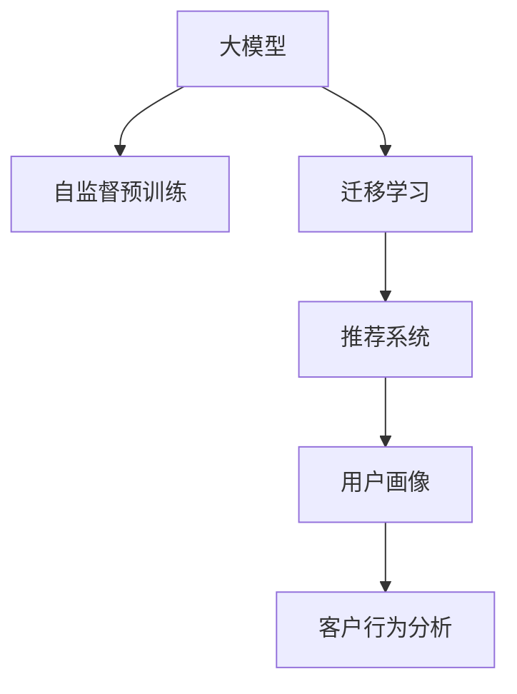

                 

# 大模型技术在电商平台用户画像中的应用

> 关键词：大模型,用户画像,电商平台,深度学习,自然语言处理,NLP,机器学习,推荐系统,客户行为分析,数据挖掘,模型训练

## 1. 背景介绍

### 1.1 问题由来

电商平台在数字化转型中面临的挑战之一是如何在海量的用户行为数据中挖掘出有用的信息，构建精确的用户画像，从而提供个性化的推荐和服务，提高用户体验和运营效率。传统的数据挖掘和特征工程方法往往难以捕捉到用户行为的深层次模式和潜在需求，且模型复杂度较高，难以实现实时高效的预测和推荐。

近年来，大模型技术（Large Model）因其强大的表征学习能力和自监督预训练的优势，在自然语言处理(NLP)、推荐系统、客户行为分析等诸多领域取得了显著成果。尤其是基于Transformer架构的预训练语言模型（如BERT、GPT系列），已经成为了解决上述问题的重要手段。

### 1.2 问题核心关键点

大模型技术在电商平台用户画像中的应用主要集中在以下几个关键点：

- **用户行为理解**：通过大模型理解用户的文字评论、浏览记录等文本数据，提取其背后的行为模式和需求偏好。
- **潜在需求预测**：利用大模型的自监督预训练能力和自然语言理解能力，预测用户在未来可能采取的购买行为和偏好。
- **推荐系统优化**：结合用户画像和商品属性，构建推荐系统，实现更精准的商品推荐。
- **个性化服务**：通过用户画像，提供个性化的产品展示、客服咨询等增值服务，提升用户体验。
- **运营决策支持**：分析用户画像和行为数据，为电商平台的运营决策提供数据支撑，如活动策划、库存管理等。

这些关键点构成了大模型技术在电商平台用户画像应用的完整框架，帮助电商平台更好地理解用户、预测需求、优化推荐、提升服务。

## 2. 核心概念与联系

### 2.1 核心概念概述

为更好地理解大模型技术在电商平台用户画像中的应用，本节将介绍几个密切相关的核心概念：

- **大模型（Large Model）**：以Transformer架构为代表的大规模预训练语言模型，如BERT、GPT等。通过在海量无标签文本数据上进行预训练，学习通用的语言表示，具备强大的语言理解和生成能力。
- **自监督预训练（Self-Supervised Pre-training）**：在大规模无标签数据上，通过自动构造的预训练任务进行无监督学习，学习通用的语言知识。
- **迁移学习（Transfer Learning）**：将一个领域学习到的知识，迁移应用到另一个不同但相关的领域的学习范式。大模型的预训练-微调过程即是一种典型的迁移学习方式。
- **推荐系统（Recommender System）**：根据用户的历史行为数据和偏好，推荐可能感兴趣的物品的系统。
- **用户画像（User Profile）**：通过分析用户的行为数据、属性信息等，构建出用户的行为模型、兴趣偏好等，用于个性化推荐和服务。
- **客户行为分析（Customer Behavior Analysis）**：分析用户行为数据，了解用户需求、偏好、消费模式等，帮助电商平台优化运营策略。

这些核心概念之间的逻辑关系可以通过以下Mermaid流程图来展示：



这个流程图展示了大模型技术的核心概念及其之间的关系：

1. 大模型通过自监督预训练获得基础能力。
2. 迁移学习使得大模型更好地适应特定领域的用户画像构建和行为分析。
3. 推荐系统利用用户画像进行个性化推荐。
4. 客户行为分析通过用户画像了解用户需求，优化运营决策。

## 3. 核心算法原理 & 具体操作步骤
### 3.1 算法原理概述

大模型技术在电商平台用户画像中的应用，主要基于以下几个算法原理：

1. **自然语言处理（NLP）**：通过大模型理解用户评论、描述等文本数据，提取用户行为模式和需求偏好。
2. **推荐系统**：利用大模型预测用户潜在需求，结合商品属性构建推荐系统，实现个性化推荐。
3. **迁移学习**：将大模型在通用领域预训练的知识，迁移应用到电商平台的用户画像和行为分析中。
4. **用户画像构建**：通过大模型的自监督预训练和微调，提取用户的行为特征和兴趣标签，构建详细的用户画像。
5. **客户行为分析**：通过大模型分析用户行为数据，理解用户需求、预测购买行为，辅助运营决策。

### 3.2 算法步骤详解

#### 3.2.1 数据准备

1. **收集用户数据**：收集用户的评论、浏览记录、购买历史、用户属性等数据。
2. **数据清洗和预处理**：对数据进行去重、清洗、分词、格式化等处理，确保数据质量。
3. **构建标注数据**：对于推荐系统等任务，需要构建带标签的训练数据。例如，将用户评论与标签相关联，如评分、商品类别等。

#### 3.2.2 模型选择与预训练

1. **选择预训练模型**：根据任务需求选择合适的预训练语言模型，如BERT、GPT等。
2. **自监督预训练**：在大规模无标签数据上，通过自监督任务（如掩码语言模型、next sentence prediction等）进行预训练，学习通用的语言表示。

#### 3.2.3 模型微调与用户画像构建

1. **微调模型**：在标注数据集上，对预训练模型进行微调，学习特定领域的知识。例如，在评论数据上微调BERT模型，学习用户评论的情感倾向和主题。
2. **用户画像构建**：通过微调后的模型，提取用户的行为特征和兴趣标签，构建详细的用户画像。例如，提取用户的评论内容、购买记录等，构建用户的兴趣偏好和行为模式。

#### 3.2.4 推荐系统开发

1. **特征提取**：利用微调后的模型提取用户画像和商品属性特征。
2. **构建推荐模型**：结合用户画像和商品属性，使用协同过滤、深度学习等方法构建推荐系统。
3. **推荐策略优化**：根据用户画像和推荐结果，优化推荐策略，提升推荐精度和用户体验。

#### 3.2.5 客户行为分析

1. **数据收集与处理**：收集用户的行为数据，如点击、浏览、购买记录等。
2. **用户行为建模**：通过大模型分析用户行为数据，构建用户的行为模式和需求预测模型。
3. **运营决策支持**：分析用户行为数据，优化库存管理、活动策划等运营决策。

### 3.3 算法优缺点

大模型技术在电商平台用户画像中的应用具有以下优点：

1. **强大的表征学习能力**：大模型能够自动学习丰富的语言知识和用户行为模式，无需人工干预。
2. **高泛化能力**：大模型的预训练知识和迁移学习能力，使得模型能够适应不同的电商场景和用户画像构建需求。
3. **实时高效**：大模型的推理速度快，能够实时分析用户行为数据，快速构建个性化推荐。
4. **可扩展性强**：大模型可以轻松扩展到不同的数据源和应用场景，灵活应用。

同时，该方法也存在一些局限性：

1. **数据需求高**：大模型的预训练和微调需要大量的标注数据和计算资源，对于小规模电商平台的资源有限制。
2. **模型复杂度高**：大模型参数量巨大，需要高性能计算资源，难以在小规模电商平台上部署。
3. **可解释性差**：大模型的复杂性和黑盒特性，使得其决策过程难以解释和调试。
4. **依赖标注质量**：标注数据的准确性直接影响模型的性能，高质量标注数据的获取成本较高。
5. **隐私风险**：用户行为数据的隐私保护问题，需要严格的数据使用规范和隐私保护措施。

尽管存在这些局限性，但大模型技术在电商平台用户画像的应用前景依然广阔，通过合理的算法优化和资源配置，可以最大限度地发挥其优势，提升电商平台的运营效率和用户满意度。

### 3.4 算法应用领域

大模型技术在电商平台用户画像的应用，已经涵盖了电商平台的多个方面：

1. **个性化推荐**：利用大模型预测用户潜在需求，构建推荐系统，提供个性化的商品推荐。
2. **客户服务优化**：通过分析用户行为数据，构建用户画像，提供个性化的客服咨询和产品展示。
3. **运营决策支持**：分析用户行为数据，优化库存管理、活动策划等运营决策。
4. **用户行为分析**：通过大模型理解用户评论、行为数据，了解用户需求、偏好，辅助市场研究和产品优化。
5. **广告投放优化**：利用大模型预测用户广告响应，优化广告投放策略，提升广告效果。
6. **内容生成与推荐**：生成个性化的广告文案和推荐内容，提升用户体验。

这些应用场景展示了大模型技术在电商平台用户画像中的广泛应用，为电商平台的数字化转型提供了强大的技术支持。

## 4. 数学模型和公式 & 详细讲解 & 举例说明
### 4.1 数学模型构建

假设电商平台的用户行为数据为 $D=\{(x_i,y_i)\}_{i=1}^N$，其中 $x_i$ 为用户行为特征向量，$y_i$ 为标签向量。构建用户画像的过程可以形式化为：

$$
\hat{x_i} = f_{\theta}(x_i) = M_{\theta}(x_i)
$$

其中 $f_{\theta}$ 为微调后的模型，$M_{\theta}$ 为预训练语言模型，$\theta$ 为模型参数。目标是最小化预测误差，即：

$$
\min_{\theta} \frac{1}{N} \sum_{i=1}^N \| f_{\theta}(x_i) - y_i \|
$$

通过梯度下降等优化算法，不断更新模型参数 $\theta$，最小化损失函数，使得预测结果逼近真实标签。

### 4.2 公式推导过程

以推荐系统为例，假设用户 $u$ 对商品 $p$ 的评分 $r$ 为 $x_u$ 的线性加权和，即：

$$
r_{up} = \sum_{j=1}^{d} w_{ujp} x_{uj}
$$

其中 $w_{ujp}$ 为权重，$x_{uj}$ 为用户 $u$ 对商品 $p$ 的评分特征。假设权重向量 $w_{ujp}$ 为微调后的模型 $M_{\theta}$ 的输出，即：

$$
w_{ujp} = M_{\theta}(x_u) \cdot M_{\theta}(x_p)
$$

则预测评分 $r_{up}$ 可以表示为：

$$
r_{up} = M_{\theta}(x_u) \cdot M_{\theta}(x_p) \cdot \sum_{j=1}^{d} x_{uj}
$$

通过微调后的模型，可以直接从用户行为特征和商品属性中预测评分，构建推荐系统。

### 4.3 案例分析与讲解

#### 案例分析：用户画像构建

以电商平台的用户评论分析为例，通过微调BERT模型，提取用户评论的情感倾向和主题，构建用户画像。具体步骤如下：

1. **数据准备**：收集用户评论数据，进行预处理和分词。
2. **模型选择与预训练**：选择BERT模型，在无标签数据上进行自监督预训练。
3. **微调模型**：在带有情感标签的用户评论上微调BERT模型，学习情感分类任务。
4. **用户画像构建**：利用微调后的模型，提取用户评论的情感倾向和主题，构建用户画像。

#### 案例分析：推荐系统构建

以电商平台个性化推荐为例，通过微调BERT模型，预测用户对商品的评分，构建推荐系统。具体步骤如下：

1. **数据准备**：收集用户行为数据和商品属性数据。
2. **模型选择与预训练**：选择BERT模型，在无标签数据上进行自监督预训练。
3. **微调模型**：在用户行为数据和商品属性数据上微调BERT模型，学习用户评分预测任务。
4. **推荐系统构建**：利用微调后的模型，预测用户对商品的评分，构建推荐系统。

## 5. 项目实践：代码实例和详细解释说明
### 5.1 开发环境搭建

在进行电商平台的电商平台用户画像构建时，我们需要准备好开发环境。以下是使用Python进行PyTorch开发的环境配置流程：

1. 安装Anaconda：从官网下载并安装Anaconda，用于创建独立的Python环境。

2. 创建并激活虚拟环境：
```bash
conda create -n pytorch-env python=3.8 
conda activate pytorch-env
```

3. 安装PyTorch：根据CUDA版本，从官网获取对应的安装命令。例如：
```bash
conda install pytorch torchvision torchaudio cudatoolkit=11.1 -c pytorch -c conda-forge
```

4. 安装Transformers库：
```bash
pip install transformers
```

5. 安装各类工具包：
```bash
pip install numpy pandas scikit-learn matplotlib tqdm jupyter notebook ipython
```

完成上述步骤后，即可在`pytorch-env`环境中开始电商平台的电商平台用户画像构建实践。

### 5.2 源代码详细实现

这里我们以电商平台的用户评论分析为例，给出使用Transformers库对BERT模型进行微调的PyTorch代码实现。

首先，定义用户评论数据集：

```python
from transformers import BertTokenizer
from torch.utils.data import Dataset
import torch

class UserCommentDataset(Dataset):
    def __init__(self, texts, labels, tokenizer, max_len=128):
        self.texts = texts
        self.labels = labels
        self.tokenizer = tokenizer
        self.max_len = max_len
        
    def __len__(self):
        return len(self.texts)
    
    def __getitem__(self, item):
        text = self.texts[item]
        label = self.labels[item]
        
        encoding = self.tokenizer(text, return_tensors='pt', max_length=self.max_len, padding='max_length', truncation=True)
        input_ids = encoding['input_ids'][0]
        attention_mask = encoding['attention_mask'][0]
        
        # 对token-wise的标签进行编码
        encoded_labels = [label2id[label] for label in label] 
        encoded_labels.extend([label2id['O']] * (self.max_len - len(encoded_labels)))
        labels = torch.tensor(encoded_labels, dtype=torch.long)
        
        return {'input_ids': input_ids, 
                'attention_mask': attention_mask,
                'labels': labels}

# 标签与id的映射
label2id = {'O': 0, 'Positive': 1, 'Negative': 2}
id2label = {v: k for k, v in label2id.items()}

# 创建dataset
tokenizer = BertTokenizer.from_pretrained('bert-base-cased')

train_dataset = UserCommentDataset(train_texts, train_labels, tokenizer)
dev_dataset = UserCommentDataset(dev_texts, dev_labels, tokenizer)
test_dataset = UserCommentDataset(test_texts, test_labels, tokenizer)
```

然后，定义模型和优化器：

```python
from transformers import BertForTokenClassification, AdamW

model = BertForTokenClassification.from_pretrained('bert-base-cased', num_labels=len(label2id))

optimizer = AdamW(model.parameters(), lr=2e-5)
```

接着，定义训练和评估函数：

```python
from torch.utils.data import DataLoader
from tqdm import tqdm
from sklearn.metrics import classification_report

device = torch.device('cuda') if torch.cuda.is_available() else torch.device('cpu')
model.to(device)

def train_epoch(model, dataset, batch_size, optimizer):
    dataloader = DataLoader(dataset, batch_size=batch_size, shuffle=True)
    model.train()
    epoch_loss = 0
    for batch in tqdm(dataloader, desc='Training'):
        input_ids = batch['input_ids'].to(device)
        attention_mask = batch['attention_mask'].to(device)
        labels = batch['labels'].to(device)
        model.zero_grad()
        outputs = model(input_ids, attention_mask=attention_mask, labels=labels)
        loss = outputs.loss
        epoch_loss += loss.item()
        loss.backward()
        optimizer.step()
    return epoch_loss / len(dataloader)

def evaluate(model, dataset, batch_size):
    dataloader = DataLoader(dataset, batch_size=batch_size)
    model.eval()
    preds, labels = [], []
    with torch.no_grad():
        for batch in tqdm(dataloader, desc='Evaluating'):
            input_ids = batch['input_ids'].to(device)
            attention_mask = batch['attention_mask'].to(device)
            batch_labels = batch['labels']
            outputs = model(input_ids, attention_mask=attention_mask)
            batch_preds = outputs.logits.argmax(dim=2).to('cpu').tolist()
            batch_labels = batch_labels.to('cpu').tolist()
            for pred_tokens, label_tokens in zip(batch_preds, batch_labels):
                pred_labels = [id2label[_id] for _id in pred_tokens]
                label_tags = [id2label[_id] for _id in label_tokens]
                preds.append(pred_labels[:len(label_tags)])
                labels.append(label_tags)
                
    print(classification_report(labels, preds))
```

最后，启动训练流程并在测试集上评估：

```python
epochs = 5
batch_size = 16

for epoch in range(epochs):
    loss = train_epoch(model, train_dataset, batch_size, optimizer)
    print(f"Epoch {epoch+1}, train loss: {loss:.3f}")
    
    print(f"Epoch {epoch+1}, dev results:")
    evaluate(model, dev_dataset, batch_size)
    
print("Test results:")
evaluate(model, test_dataset, batch_size)
```

以上就是使用PyTorch对BERT进行用户评论分析的完整代码实现。可以看到，得益于Transformers库的强大封装，我们可以用相对简洁的代码完成BERT模型的加载和微调。

### 5.3 代码解读与分析

让我们再详细解读一下关键代码的实现细节：

**UserCommentDataset类**：
- `__init__`方法：初始化用户评论、标签、分词器等关键组件。
- `__len__`方法：返回数据集的样本数量。
- `__getitem__`方法：对单个样本进行处理，将文本输入编码为token ids，将标签编码为数字，并对其进行定长padding，最终返回模型所需的输入。

**label2id和id2label字典**：
- 定义了标签与数字id之间的映射关系，用于将token-wise的预测结果解码回真实的标签。

**训练和评估函数**：
- 使用PyTorch的DataLoader对数据集进行批次化加载，供模型训练和推理使用。
- 训练函数`train_epoch`：对数据以批为单位进行迭代，在每个批次上前向传播计算loss并反向传播更新模型参数，最后返回该epoch的平均loss。
- 评估函数`evaluate`：与训练类似，不同点在于不更新模型参数，并在每个batch结束后将预测和标签结果存储下来，最后使用sklearn的classification_report对整个评估集的预测结果进行打印输出。

**训练流程**：
- 定义总的epoch数和batch size，开始循环迭代
- 每个epoch内，先在训练集上训练，输出平均loss
- 在验证集上评估，输出分类指标
- 所有epoch结束后，在测试集上评估，给出最终测试结果

可以看到，PyTorch配合Transformers库使得BERT微调的代码实现变得简洁高效。开发者可以将更多精力放在数据处理、模型改进等高层逻辑上，而不必过多关注底层的实现细节。

当然，工业级的系统实现还需考虑更多因素，如模型的保存和部署、超参数的自动搜索、更灵活的任务适配层等。但核心的微调范式基本与此类似。

## 6. 实际应用场景
### 6.1 智能客服系统

基于大模型技术的电商平台用户画像构建，可以广泛应用于智能客服系统的构建。传统客服往往需要配备大量人力，高峰期响应缓慢，且一致性和专业性难以保证。而使用用户画像的智能客服系统，可以7x24小时不间断服务，快速响应客户咨询，用自然流畅的语言解答各类常见问题。

在技术实现上，可以收集用户的历史咨询记录，提取其行为特征和偏好，构建详细的用户画像。然后利用BERT等大模型进行微调，使其能够自动理解用户意图，匹配最合适的回答。对于客户提出的新问题，还可以接入检索系统实时搜索相关内容，动态组织生成回答。如此构建的智能客服系统，能大幅提升客户咨询体验和问题解决效率。

### 6.2 个性化推荐系统

当前的推荐系统往往只依赖用户的历史行为数据进行物品推荐，无法深入理解用户的真实兴趣偏好。基于大模型技术构建的用户画像，可以更好地挖掘用户行为背后的语义信息，从而提供个性化的推荐和服务。

在实践中，可以收集用户浏览、点击、评论、分享等行为数据，提取和用户交互的物品标题、描述、标签等文本内容。将文本内容作为模型输入，用户的后续行为（如是否点击、购买等）作为监督信号，在此基础上微调BERT等大模型。微调后的模型能够从文本内容中准确把握用户的兴趣点。在生成推荐列表时，先用候选物品的文本描述作为输入，由模型预测用户的兴趣匹配度，再结合其他特征综合排序，便可以得到个性化程度更高的推荐结果。

### 6.3 运营决策支持

电商平台需要实时监测市场舆论动向，以便及时应对负面信息传播，规避金融风险。传统的人工监测方式成本高、效率低，难以应对网络时代海量信息爆发的挑战。基于大模型技术构建的用户画像，可以实时分析用户行为数据，理解用户需求、预测购买行为，辅助运营决策。

具体而言，可以收集用户的浏览、点击、购买记录等行为数据，利用BERT等大模型进行微调，构建用户画像。通过分析用户画像，了解用户需求、偏好，优化商品展示、活动策划等运营策略，提升运营效率和客户满意度。例如，可以根据用户画像预测某类商品的需求增长趋势，提前备货；或根据用户偏好调整广告投放策略，提升广告效果。

### 6.4 未来应用展望

随着大模型技术和用户画像构建方法的不断发展，未来电商平台的个性化推荐和服务将更加智能化和高效。以下是一些未来应用展望：

1. **动态推荐**：利用实时分析的用户画像和行为数据，动态调整推荐策略，提升推荐效果。例如，根据用户在线时间、浏览行为等实时数据，动态调整推荐内容。
2. **个性化内容生成**：利用大模型生成个性化的广告文案和推荐内容，提升用户体验。例如，根据用户画像生成个性化的产品介绍、评论等。
3. **智能客服优化**：结合用户画像和自然语言处理技术，提升智能客服的对话理解和回答质量。例如，利用微调后的BERT模型进行意图识别和实体抽取，生成更自然的对话回复。
4. **用户行为分析**：通过大模型深入分析用户行为数据，挖掘用户需求和行为模式，辅助市场研究和产品优化。例如，分析用户对某类商品的偏好变化，指导产品研发和市场推广。

这些应用场景展示了电商平台的个性化推荐和服务将如何借助大模型技术不断优化和创新，提升用户满意度和运营效率。未来，随着技术的进一步发展，基于大模型技术构建的用户画像和推荐系统，将为电商平台的数字化转型带来更多的创新和机遇。

## 7. 工具和资源推荐
### 7.1 学习资源推荐

为了帮助开发者系统掌握大模型技术在电商平台用户画像的应用，这里推荐一些优质的学习资源：

1. 《Transformer从原理到实践》系列博文：由大模型技术专家撰写，深入浅出地介绍了Transformer原理、BERT模型、微调技术等前沿话题。

2. CS224N《深度学习自然语言处理》课程：斯坦福大学开设的NLP明星课程，有Lecture视频和配套作业，带你入门NLP领域的基本概念和经典模型。

3. 《Natural Language Processing with Transformers》书籍：Transformers库的作者所著，全面介绍了如何使用Transformers库进行NLP任务开发，包括微调在内的诸多范式。

4. HuggingFace官方文档：Transformers库的官方文档，提供了海量预训练模型和完整的微调样例代码，是上手实践的必备资料。

5. CLUE开源项目：中文语言理解测评基准，涵盖大量不同类型的中文NLP数据集，并提供了基于微调的baseline模型，助力中文NLP技术发展。

通过对这些资源的学习实践，相信你一定能够快速掌握大模型技术在电商平台用户画像应用的精髓，并用于解决实际的电商问题。
###  7.2 开发工具推荐

高效的开发离不开优秀的工具支持。以下是几款用于电商平台用户画像构建开发常用的工具：

1. PyTorch：基于Python的开源深度学习框架，灵活动态的计算图，适合快速迭代研究。大部分预训练语言模型都有PyTorch版本的实现。

2. TensorFlow：由Google主导开发的开源深度学习框架，生产部署方便，适合大规模工程应用。同样有丰富的预训练语言模型资源。

3. Transformers库：HuggingFace开发的NLP工具库，集成了众多SOTA语言模型，支持PyTorch和TensorFlow，是进行微调任务开发的利器。

4. Weights & Biases：模型训练的实验跟踪工具，可以记录和可视化模型训练过程中的各项指标，方便对比和调优。与主流深度学习框架无缝集成。

5. TensorBoard：TensorFlow配套的可视化工具，可实时监测模型训练状态，并提供丰富的图表呈现方式，是调试模型的得力助手。

6. Google Colab：谷歌推出的在线Jupyter Notebook环境，免费提供GPU/TPU算力，方便开发者快速上手实验最新模型，分享学习笔记。

合理利用这些工具，可以显著提升电商平台用户画像构建任务的开发效率，加快创新迭代的步伐。

### 7.3 相关论文推荐

大模型技术在电商平台用户画像的发展源于学界的持续研究。以下是几篇奠基性的相关论文，推荐阅读：

1. Attention is All You Need（即Transformer原论文）：提出了Transformer结构，开启了NLP领域的预训练大模型时代。

2. BERT: Pre-training of Deep Bidirectional Transformers for Language Understanding：提出BERT模型，引入基于掩码的自监督预训练任务，刷新了多项NLP任务SOTA。

3. Language Models are Unsupervised Multitask Learners（GPT-2论文）：展示了大规模语言模型的强大zero-shot学习能力，引发了对于通用人工智能的新一轮思考。

4. Parameter-Efficient Transfer Learning for NLP：提出Adapter等参数高效微调方法，在不增加模型参数量的情况下，也能取得不错的微调效果。

5. Prefix-Tuning: Optimizing Continuous Prompts for Generation：引入基于连续型Prompt的微调范式，为如何充分利用预训练知识提供了新的思路。

6. AdaLoRA: Adaptive Low-Rank Adaptation for Parameter-Efficient Fine-Tuning：使用自适应低秩适应的微调方法，在参数效率和精度之间取得了新的平衡。

这些论文代表了大模型技术在电商平台用户画像发展脉络。通过学习这些前沿成果，可以帮助研究者把握学科前进方向，激发更多的创新灵感。

## 8. 总结：未来发展趋势与挑战
### 8.1 总结

本文对大模型技术在电商平台用户画像中的应用进行了全面系统的介绍。首先阐述了大模型技术和电商平台用户画像的研究背景和意义，明确了用户画像在提升电商推荐和运营决策中的重要性。其次，从原理到实践，详细讲解了大模型技术在用户画像构建、个性化推荐、客户行为分析等关键环节的算法原理和操作步骤，给出了用户画像构建的完整代码实例。同时，本文还广泛探讨了大模型技术在智能客服、个性化推荐、运营决策等多个电商场景中的应用前景，展示了其广泛的适用性和巨大的潜力。

通过本文的系统梳理，可以看到，大模型技术在电商平台用户画像构建中的强大应用前景。它不仅能够提升电商平台的推荐精度和用户满意度，还能为电商平台的运营决策提供有力的数据支撑，推动电商平台的数字化转型。未来，随着技术的不断进步和应用场景的拓展，大模型技术在电商平台中的应用将更加深入和广泛，为电商平台带来更多的创新和机遇。

### 8.2 未来发展趋势

展望未来，大模型技术在电商平台用户画像的应用将呈现以下几个发展趋势：

1. **多模态融合**：未来的电商推荐系统将不仅仅依赖文本数据，还将融合图像、视频、语音等多模态数据，提升推荐系统的准确性和用户体验。
2. **实时化处理**：利用大模型技术，实现对用户行为的实时分析和预测，提升推荐系统的动态响应能力。例如，根据用户在线行为实时调整推荐内容。
3. **联邦学习**：利用联邦学习技术，在不暴露用户隐私的前提下，实现跨电商平台的用户画像共享和模型联合训练，提升推荐系统的覆盖范围和效果。
4. **模型压缩与加速**：随着电商平台的业务场景和用户规模的不断扩展，需要高效低耗的模型结构，以适应高性能计算和边缘计算的需求。例如，使用模型剪枝、量化加速等技术，提升模型的推理速度和资源利用率。
5. **隐私保护**：随着用户隐私保护意识的增强，电商平台的推荐系统和用户画像构建需要严格遵循数据使用规范，确保用户隐私安全。例如，采用差分隐私、联邦学习等技术，保护用户数据隐私。

这些趋势展示了大模型技术在电商平台用户画像应用的未来发展方向。通过这些方向的探索，可以进一步提升电商平台的运营效率和用户体验，推动电商行业的数字化转型。

### 8.3 面临的挑战

尽管大模型技术在电商平台用户画像的应用前景广阔，但在迈向更加智能化、普适化应用的过程中，它仍面临着诸多挑战：

1. **数据质量与标注成本**：高质量标注数据和大规模数据集是构建高质量用户画像的前提。但获取高质量标注数据和高性能计算资源，仍是一个不小的挑战。
2. **模型复杂性与计算资源**：大模型参数量巨大，需要高性能计算资源，难以在小规模电商平台上部署。如何在有限的资源条件下，实现高效的用户画像构建和推荐，是一个重要的研究方向。
3. **模型可解释性与鲁棒性**：大模型的复杂性和黑盒特性，使得其决策过程难以解释和调试。此外，面对不同来源和形式的数据，模型的鲁棒性仍需进一步提升。
4. **隐私保护与合规性**：电商平台的推荐系统和用户画像构建需要严格遵循数据使用规范和隐私保护法规，确保用户隐私安全。如何在数据隐私保护和模型性能之间取得平衡，是一个亟待解决的问题。
5. **用户体验与推荐精度**：电商平台的推荐系统需要兼顾用户体验和推荐精度，如何在提升推荐效果的同时，不造成用户过度打扰，是一个需要考虑的问题。

尽管存在这些挑战，但大模型技术在电商平台用户画像的应用前景依然广阔。通过合理的算法优化和资源配置，可以最大限度地发挥其优势，提升电商平台的运营效率和用户体验。

### 8.4 研究展望

面对大模型技术在电商平台用户画像构建面临的挑战，未来的研究需要在以下几个方面寻求新的突破：

1. **无监督和半监督学习**：探索无监督和半监督学习技术，降低对大规模标注数据的依赖，利用自监督学习、主动学习等方法，提高用户画像构建的效率和效果。
2. **参数高效微调与计算高效模型**：开发更加参数高效和计算高效的微调方法，在固定大部分预训练参数的同时，只更新极少量的任务相关参数，以提高微调效率和模型的资源利用率。
3. **多模态融合与跨平台协作**：探索多模态数据融合和跨平台协作的方法，提升电商推荐系统的覆盖范围和效果，实现跨电商平台的联合推荐。
4. **隐私保护与合规性**：研究隐私保护和合规性技术，确保用户数据安全，遵守相关法规，提升用户对电商平台的信任度。
5. **模型压缩与加速**：研究模型压缩和加速技术，提升电商平台的推荐系统处理能力和实时响应能力，适应高性能计算和边缘计算的需求。

这些研究方向将推动大模型技术在电商平台用户画像构建中的应用不断深入，为电商平台的数字化转型提供更强大的技术支撑。面向未来，大模型技术在电商平台的应用场景将更加丰富多样，为用户带来更多创新的体验和服务。

## 9. 附录：常见问题与解答

**Q1：电商平台如何选择合适的预训练模型？**

A: 电商平台应根据具体的业务需求和数据特征，选择合适的预训练模型。对于文本处理任务，可以选择BERT、GPT等预训练语言模型；对于图像处理任务，可以选择ViT、ResNet等预训练视觉模型。同时，应考虑模型的大小和计算资源，选择适合平台规模的模型。

**Q2：电商平台在构建用户画像时需要注意哪些问题？**

A: 电商平台在构建用户画像时，需要注意以下几个问题：
1. **数据质量**：确保用户行为数据的准确性和完整性，避免数据噪音对模型性能的影响。
2. **用户隐私**：在数据收集和使用过程中，严格遵循数据隐私保护法规，确保用户数据安全。
3. **数据标注**：对于标注数据，应确保标签的准确性和一致性，避免标注错误对模型性能的影响。
4. **模型复杂度**：应根据数据规模和计算资源，选择合适大小的模型，避免过拟合或欠拟合。
5. **模型更新**：应定期更新用户画像模型，以反映用户行为的最新变化，避免模型过时。

**Q3：电商平台的推荐系统如何动态调整推荐策略？**

A: 电商平台的推荐系统可以通过实时分析用户行为数据，动态调整推荐策略，提升推荐效果。具体步骤包括：
1. **实时数据收集**：收集用户的浏览、点击、购买等实时行为数据。
2. **行为分析**：利用大模型分析用户行为数据，了解用户需求和偏好。
3. **动态推荐**：根据用户行为分析结果，动态调整推荐内容，提升推荐精度和用户体验。例如，根据用户在线行为实时调整推荐内容。

**Q4：电商平台在构建用户画像时如何保护用户隐私？**

A: 电商平台在构建用户画像时，应采取以下措施保护用户隐私：
1. **数据匿名化**：对用户数据进行匿名化处理，避免敏感信息的泄露。
2. **数据加密**：在数据存储和传输过程中，采用加密技术，确保数据安全。
3. **用户同意**：在数据收集和使用过程中，获得用户的明确同意，尊重用户的隐私权利。
4. **隐私保护技术**：采用差分隐私、联邦学习等隐私保护技术，确保用户数据的安全和隐私。

这些措施可以有效保护用户隐私，提升用户对电商平台信任度，推动电商平台的数字化转型。

**Q5：电商平台在构建用户画像时如何优化模型性能？**

A: 电商平台在构建用户画像时，可以采用以下方法优化模型性能：
1. **数据增强**：通过数据增强技术，扩充训练集，提升模型的泛化能力。
2. **正则化技术**：采用L2正则、Dropout等正则化技术，避免过拟合。
3. **模型压缩与加速**：采用模型剪枝、量化加速等技术，提升模型的推理速度和资源利用率。
4. **模型融合**：将多个模型的预测结果进行融合，提升模型的精度和鲁棒性。
5. **超参数调优**：通过网格搜索、贝叶斯优化等方法，优化模型超参数，提升模型性能。

这些方法可以有效提升电商平台的推荐系统性能，提高用户满意度和运营效率。

---

作者：禅与计算机程序设计艺术 / Zen and the Art of Computer Programming

