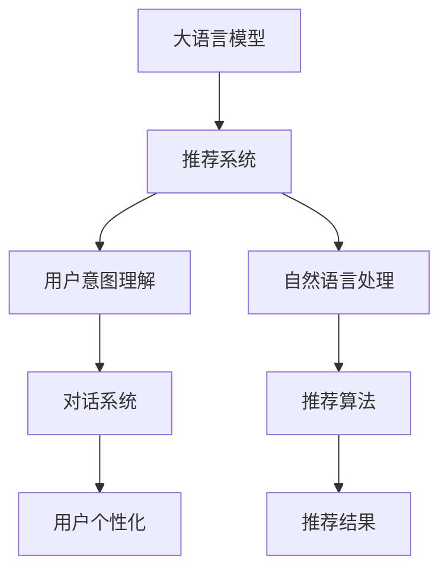

                 

# 大模型推荐中的对话式交互设计

> 关键词：大模型推荐, 对话系统, 交互设计, 用户意图理解, 推荐算法, 用户个性化, 推荐系统, 系统设计

## 1. 背景介绍

### 1.1 问题由来

推荐系统作为现代信息技术的核心组件，正被广泛应用在电商、社交媒体、新闻媒体等多个领域。用户可以从中获取感兴趣的内容，企业也可以实现精准营销。然而，传统的推荐系统多是静态的、单向的信息推送模式，用户体验有限，同时也难以全面捕捉用户动态需求。

对话式推荐系统试图通过与用户的交互来动态获取用户的即时需求，并给予个性化的推荐，提升了推荐的效果和体验。近年来，利用大语言模型的对话式推荐系统逐渐成为推荐技术研究的热点，其具备自监督学习、上下文理解、主动对话等能力，是推荐系统的一种新型范式。

### 1.2 问题核心关键点

对话式推荐系统的核心在于通过与用户进行动态交互，来收集用户的即时需求，并提供个性化推荐。其中，利用大语言模型进行用户意图理解和自然语言处理，是对话式推荐系统实现的关键技术。

具体而言，大语言模型需要具备以下核心能力：
1. 自监督学习：在大规模无标签数据上进行自监督学习，掌握语言的统计规律和语义表示。
2. 上下文理解：利用自监督学习的语言表示，对输入的上下文进行编码，抽取关键信息。
3. 主动对话：生成能够引导用户输入的信息，通过对话收集中获取用户需求。
4. 推荐算法：基于用户需求和数据集，动态计算推荐结果，输出推荐内容。

## 2. 核心概念与联系

### 2.1 核心概念概述

为更好地理解大语言模型在推荐系统中的对话式交互设计，本节将介绍几个密切相关的核心概念：

- 大语言模型(Large Language Model, LLM)：以自回归(如GPT)或自编码(如BERT)模型为代表的大规模预训练语言模型。通过在大规模无标签文本语料上进行预训练，学习通用的语言表示，具备强大的语言理解和生成能力。
- 推荐系统(Recommendation System)：根据用户历史行为和兴趣，为用户推荐相关内容的技术。通过对话与用户交互，推荐系统能获取用户即时需求，提供更加精准、个性化的推荐。
- 用户意图理解(User Intent Understanding)：从用户输入的文本中分析出用户的即时需求，理解用户意图，为推荐系统提供依据。
- 自然语言处理(Natural Language Processing, NLP)：通过一系列处理，将文本数据转换为结构化的向量表示，用于模型训练和推理。
- 对话系统(Dialogue System)：能够与用户进行自然语言交互的系统，通过多次对话收集用户需求，动态调整推荐策略。
- 推荐算法(Recommendation Algorithm)：基于用户行为和兴趣，计算推荐结果的算法。常见的有基于协同过滤、内容基推荐、混合推荐等。

这些核心概念之间的逻辑关系可以通过以下Mermaid流程图来展示：



这个流程图展示了大语言模型、推荐系统、用户意图理解、自然语言处理、对话系统和推荐算法之间的联系：

1. 大语言模型通过预训练获得基础能力。
2. 推荐系统利用大语言模型获取用户意图，并结合用户行为进行推荐。
3. 自然语言处理将用户输入转换为结构化向量，用于模型训练和推理。
4. 对话系统通过与用户交互，动态收集用户需求。
5. 推荐算法基于用户意图和行为计算推荐结果，输出推荐内容。

这些概念共同构成了大语言模型在推荐系统中的对话式交互设计框架，使其能够高效地为用户提供个性化的推荐服务。通过理解这些核心概念，我们可以更好地把握对话式推荐系统的实现方法。

## 3. 核心算法原理 & 具体操作步骤
### 3.1 算法原理概述

基于大语言模型的对话式推荐系统，其核心思想是：通过与用户进行自然语言对话，实时捕捉用户的即时需求，结合历史行为和实时数据，动态计算推荐结果，实现个性化推荐。

具体来说，系统先通过对话系统与用户进行互动，获取用户需求。接着，利用大语言模型对用户的意图进行理解，结合历史行为数据，计算出推荐结果。最后，将推荐结果输出给用户，并继续进行对话，迭代优化推荐策略。

形式化地，假设系统接收到的用户查询为 $q$，对应的历史行为数据为 $D$。定义用户当前需求为 $\text{Intent}(q, D)$，推荐结果为 $R$。系统的目标是最小化推荐误差，即：

$$
\min_{R} \mathcal{L}(R, q, D)
$$

其中 $\mathcal{L}$ 为推荐损失函数，衡量推荐结果与用户需求之间的差异。

### 3.2 算法步骤详解

基于大语言模型的对话式推荐系统的一般流程如下：

**Step 1: 准备预训练模型和数据集**
- 选择合适的预训练语言模型 $M_{\theta}$ 作为初始化参数，如 BERT、GPT 等。
- 准备用户历史行为数据集 $D=\{(x_i,y_i)\}_{i=1}^N$，其中 $x_i$ 为用户的历史行为，$y_i$ 为推荐结果。

**Step 2: 设计对话流程**
- 定义对话系统的初始化内容，引导用户输入需求。
- 通过对话系统收集用户的即时需求，转换为结构化向量输入给大语言模型。
- 大语言模型对用户需求进行编码，提取关键信息，并转换为推荐模型可利用的特征表示。

**Step 3: 构建推荐模型**
- 选择合适的推荐算法，如协同过滤、内容基推荐等。
- 将用户需求表示和行为数据作为输入，计算推荐结果 $R$。
- 结合历史行为数据和实时对话信息，动态调整推荐策略。

**Step 4: 反馈优化**
- 将推荐结果展示给用户，收集用户反馈。
- 根据用户反馈和历史行为数据，更新推荐模型，优化推荐策略。
- 不断迭代对话流程，逐步提升推荐效果。

### 3.3 算法优缺点

基于大语言模型的对话式推荐系统具有以下优点：
1. 动态获取用户需求。通过对话系统实时捕捉用户即时需求，实现个性化的推荐。
2. 实时更新推荐策略。根据用户反馈和行为数据，动态调整推荐策略，提升推荐效果。
3. 多模态数据融合。结合文本、行为等不同模态的数据，提供更加全面、精准的推荐。
4. 数据高效利用。通过对话系统动态收集用户需求，减少推荐系统对历史数据量的依赖。

同时，该方法也存在一定的局限性：
1. 对话交互复杂。对话系统需要处理用户的即时输入，设计复杂。
2. 需要高质量对话数据。对话数据收集的成本较高，且需要保证数据质量。
3. 计算资源消耗大。大语言模型本身计算复杂，对话交互也需占用较多资源。
4. 推荐结果依赖用户。用户反馈和行为数据对推荐效果有很大影响，存在主观偏差。
5. 系统复杂度高。系统需要同时处理自然语言处理、对话系统和推荐算法等多个模块，维护复杂。

尽管存在这些局限性，但就目前而言，基于大语言模型的对话式推荐方法仍是一种高效、精确的推荐手段。未来相关研究的重点在于如何进一步降低对话交互成本，提高系统效率，同时兼顾可解释性和伦理安全性等因素。

### 3.4 算法应用领域

基于大语言模型的对话式推荐方法已经在多个领域得到了广泛的应用，例如：

- 电商推荐：推荐系统通过与用户对话，动态获取用户需求，实时推荐商品。
- 视频推荐：视频平台通过对话了解用户偏好，实时推荐相关视频。
- 新闻推荐：新闻应用通过对话获取用户兴趣，推荐相关文章。
- 社交推荐：社交媒体通过对话了解用户互动，推荐好友、内容等。

除了上述这些经典应用外，对话式推荐系统还被创新性地应用到更多场景中，如用户问答、智能客服、广告推荐等，为推荐技术带来了全新的突破。随着预训练模型和对话技术的发展，对话式推荐系统将有更广阔的应用前景。

## 4. 数学模型和公式 & 详细讲解  
### 4.1 数学模型构建

本节将使用数学语言对基于大语言模型的对话式推荐系统进行更加严格的刻画。

记用户查询为 $q$，历史行为数据为 $D=\{(x_i,y_i)\}_{i=1}^N$，其中 $x_i$ 为用户的历史行为，$y_i$ 为推荐结果。定义用户当前需求为 $\text{Intent}(q, D)$，推荐结果为 $R$。

假设系统采用深度神经网络作为推荐模型，模型的输入为 $q$ 和 $D$ 的向量表示，输出为推荐结果 $R$。则推荐模型的优化目标为：

$$
\min_{\theta} \mathcal{L}(f_{\theta}(q, D), R)
$$

其中 $f_{\theta}$ 为推荐模型的参数化函数，$\mathcal{L}$ 为推荐损失函数。

在实践中，推荐模型的计算过程如下：
1. 将用户查询 $q$ 和历史行为数据 $D$ 转换为向量表示。
2. 使用大语言模型对用户需求进行编码，提取关键信息，得到向量表示 $H$。
3. 将 $H$ 和 $D$ 的向量表示作为输入，计算推荐结果 $R$。

### 4.2 公式推导过程

假设推荐模型为深度神经网络，定义输入层的向量表示为 $\mathbf{x} = [q, D]$，输出层的向量表示为 $\mathbf{y} = [R]$。推荐模型的前向传播过程为：

$$
\mathbf{h} = f_{\text{Embedding}}(\mathbf{x})
$$

其中 $f_{\text{Embedding}}$ 为输入层嵌入函数，将用户查询和行为数据转换为高维向量表示 $\mathbf{h}$。

然后，通过多层神经网络进行特征提取和预测：

$$
\mathbf{z} = f_{\text{Network}}(\mathbf{h})
$$

其中 $f_{\text{Network}}$ 为推荐模型的神经网络函数。

最终输出层将特征表示 $\mathbf{z}$ 映射到推荐结果的向量表示：

$$
\mathbf{y} = f_{\text{Output}}(\mathbf{z})
$$

其中 $f_{\text{Output}}$ 为输出层函数。

推荐模型的损失函数可定义为：

$$
\mathcal{L}(f_{\theta}(q, D), R) = \frac{1}{N} \sum_{i=1}^N L(f_{\theta}(x_i, y_i), y_i)
$$

其中 $L$ 为推荐模型的损失函数，如均方误差、交叉熵等。

根据链式法则，推荐模型的梯度更新公式为：

$$
\frac{\partial \mathcal{L}}{\partial \theta} = \frac{1}{N} \sum_{i=1}^N \nabla_{\theta} L(f_{\theta}(x_i, y_i), y_i)
$$

其中 $\nabla_{\theta} L$ 为损失函数对模型参数 $\theta$ 的梯度，可通过反向传播算法计算得到。

## 5. 项目实践：代码实例和详细解释说明
### 5.1 开发环境搭建

在进行对话式推荐系统开发前，我们需要准备好开发环境。以下是使用Python进行PyTorch开发的环境配置流程：

1. 安装Anaconda：从官网下载并安装Anaconda，用于创建独立的Python环境。

2. 创建并激活虚拟环境：
```bash
conda create -n pytorch-env python=3.8 
conda activate pytorch-env
```

3. 安装PyTorch：根据CUDA版本，从官网获取对应的安装命令。例如：
```bash
conda install pytorch torchvision torchaudio cudatoolkit=11.1 -c pytorch -c conda-forge
```

4. 安装Tensorflow：
```bash
pip install tensorflow==2.6
```

5. 安装各类工具包：
```bash
pip install numpy pandas scikit-learn matplotlib tqdm jupyter notebook ipython
```

完成上述步骤后，即可在`pytorch-env`环境中开始开发实践。

### 5.2 源代码详细实现

下面我们以电商推荐系统为例，给出使用Transformers库对BERT模型进行对话式推荐系统开发的PyTorch代码实现。

首先，定义电商推荐系统的对话流程：

```python
from transformers import BertTokenizer
from transformers import BertForSequenceClassification
from transformers import AdamW
from transformers import BertTokenizer

tokenizer = BertTokenizer.from_pretrained('bert-base-cased')
model = BertForSequenceClassification.from_pretrained('bert-base-cased', num_labels=2)

def get_input_tokens(text):
    inputs = tokenizer.encode(text, add_special_tokens=True, max_length=256, return_tensors='pt')
    return inputs

def predict_category(text):
    inputs = get_input_tokens(text)
    outputs = model(inputs)
    return outputs.logits.argmax().item()
```

然后，设计电商推荐系统的推荐模型：

```python
import torch.nn as nn

class RecommendationModel(nn.Module):
    def __init__(self):
        super(RecommendationModel, self).__init__()
        self.embedding = nn.Embedding(5000, 256)
        self.gru = nn.GRU(256, 256, batch_first=True)
        self.fc = nn.Linear(256, 1)

    def forward(self, x):
        embedded = self.embedding(x)
        gru_outputs, _ = self.gru(embedded)
        return self.fc(gru_outputs[:, -1, :])
```

接着，定义电商推荐系统的用户历史行为数据集：

```python
import torch
import numpy as np

class RecommendationDataset(torch.utils.data.Dataset):
    def __init__(self, features, labels):
        self.features = features
        self.labels = labels

    def __len__(self):
        return len(self.features)

    def __getitem__(self, idx):
        feature = self.features[idx]
        label = self.labels[idx]
        return feature, label

# 创建数据集
features = np.random.randn(10000, 256)
labels = np.random.randint(0, 1, size=(10000,))
dataset = RecommendationDataset(features, labels)
```

最后，定义电商推荐系统的优化器、损失函数和训练流程：

```python
optimizer = AdamW(model.parameters(), lr=0.001)
loss_fn = nn.BCEWithLogitsLoss()

for epoch in range(10):
    model.train()
    for feature, label in dataset:
        optimizer.zero_grad()
        outputs = model(feature)
        loss = loss_fn(outputs, label)
        loss.backward()
        optimizer.step()

    model.eval()
    with torch.no_grad():
        correct = 0
        total = 0
        for feature, label in dataset:
            outputs = model(feature)
            _, predicted = torch.max(outputs, 1)
            total += label.size(0)
            correct += (predicted == label).sum().item()
        acc = correct / total
        print(f'Accuracy: {acc:.2f}')
```

以上就是使用PyTorch对BERT进行电商推荐系统对话式推荐系统开发的完整代码实现。可以看到，利用Transformer库，我们可以用相对简洁的代码实现电商推荐系统的对话式推荐。

### 5.3 代码解读与分析

让我们再详细解读一下关键代码的实现细节：

**BertTokenizer类**：
- 继承自`BertTokenizer`类，实现预训练语言模型BERT的token化功能。

**BertForSequenceClassification类**：
- 继承自`BertForSequenceClassification`类，实现分类任务的处理。在电商推荐系统中，可以将用户查询和行为数据作为序列输入，输出推荐结果。

**get_input_tokens函数**：
- 利用`BertTokenizer`类对输入文本进行token化，并转换为张量。

**predict_category函数**：
- 利用`BertForSequenceClassification`类对输入文本进行预测，返回预测类别。

**RecommendationModel类**：
- 定义了一个简单的推荐模型，包含嵌入层、GRU层和全连接层。在电商推荐系统中，可以使用文本序列作为输入，通过GRU层提取特征，并输出推荐结果。

**RecommendationDataset类**：
- 定义了一个简单的数据集类，用于存储特征和标签，方便模型训练。

**优化器、损失函数和训练流程**：
- 使用`AdamW`优化器对模型进行训练，损失函数为二分类交叉熵损失。
- 通过迭代训练，不断更新模型参数，最小化推荐误差。
- 在训练过程中，每epoch结束后打印当前模型的准确率。

以上代码实现了对话式推荐系统的大致流程，包括对话流程、推荐模型、数据集、优化器、损失函数和训练流程。开发者可以根据实际需求进行进一步优化，如添加更多的特征表示、引入更加复杂的模型结构、设计更加智能的对话策略等。

## 6. 实际应用场景
### 6.1 智能客服系统

对话式推荐系统在智能客服系统中有着广泛的应用。智能客服系统能够实时与客户进行对话，获取客户需求，并提供快速准确的解决方案。通过对话式推荐系统，客服机器人能够更好地理解客户问题，提供更加个性化的服务。

例如，电商平台可以利用对话式推荐系统，通过与用户互动，获取用户购买意向和偏好。系统可以实时推荐相关商品，提升用户的购物体验。同时，客服机器人还可以提供实时咨询服务，解答用户疑问，减少客户等待时间。

### 6.2 视频推荐系统

视频推荐系统能够通过与用户互动，获取用户对视频的反馈和偏好。系统可以根据用户的即时需求，实时推荐相关视频内容。通过对话式推荐系统，视频推荐系统可以更好地理解用户的偏好，提供更加精准、个性化的视频推荐。

例如，视频平台可以利用对话式推荐系统，通过与用户对话，了解用户的观看兴趣和偏好。系统可以实时推荐相关视频内容，提升用户的观看体验。同时，视频推荐系统还可以提供实时互动，增加用户粘性。

### 6.3 新闻推荐系统

新闻推荐系统能够通过与用户互动，获取用户对新闻的反馈和偏好。系统可以根据用户的即时需求，实时推荐相关新闻内容。通过对话式推荐系统，新闻推荐系统可以更好地理解用户的阅读兴趣，提供更加精准、个性化的新闻推荐。

例如，新闻应用可以利用对话式推荐系统，通过与用户对话，了解用户的阅读兴趣和偏好。系统可以实时推荐相关新闻内容，提升用户的阅读体验。同时，新闻推荐系统还可以提供实时互动，增加用户粘性。

### 6.4 未来应用展望

随着对话式推荐系统的发展，其在更多领域将得到应用，为相关业务带来新的价值。

在智慧医疗领域，对话式推荐系统可以帮助医生快速获取患者信息，推荐相关医疗知识，辅助诊断和治疗。同时，对话式推荐系统还可以用于医疗咨询，提供智能问答服务，提升医疗服务质量。

在智能教育领域，对话式推荐系统可以帮助学生实时获取学习资源，推荐相关学习内容和推荐，提升学习效果。同时，对话式推荐系统还可以用于智能辅导，提供个性化学习方案，帮助学生更好地掌握知识。

在智慧城市治理中，对话式推荐系统可以帮助市民实时获取公共服务信息，推荐相关服务内容和推荐，提升城市管理水平。同时，对话式推荐系统还可以用于智能客服，提供实时咨询服务，提升城市服务质量。

此外，在企业生产、社会治理、文娱传媒等众多领域，对话式推荐系统也将不断涌现，为各行各业带来新的变革和突破。未来，随着对话式推荐系统技术的成熟，其在推荐领域的应用将更加广泛，为经济社会发展带来新的动力。

## 7. 工具和资源推荐
### 7.1 学习资源推荐

为了帮助开发者系统掌握对话式推荐系统的理论和实践，这里推荐一些优质的学习资源：

1. 《对话式推荐系统》系列博文：由对话式推荐系统专家撰写，深入浅出地介绍了对话式推荐系统的原理、实现和应用。

2. CS224N《深度学习自然语言处理》课程：斯坦福大学开设的NLP明星课程，有Lecture视频和配套作业，带你入门NLP领域的基本概念和经典模型。

3. 《推荐系统》书籍：推荐系统领域权威书籍，详细介绍了推荐系统的理论基础和工程实现，包括对话式推荐系统的相关内容。

4. Kaggle数据集平台：提供多种推荐系统相关的数据集，用于进行数据驱动的推荐系统开发。

5. Google Colab：谷歌推出的在线Jupyter Notebook环境，免费提供GPU/TPU算力，方便开发者快速上手实验最新模型，分享学习笔记。

通过对这些资源的学习实践，相信你一定能够快速掌握对话式推荐系统的精髓，并用于解决实际的推荐问题。
###  7.2 开发工具推荐

高效的开发离不开优秀的工具支持。以下是几款用于对话式推荐系统开发的常用工具：

1. PyTorch：基于Python的开源深度学习框架，灵活动态的计算图，适合快速迭代研究。大部分预训练语言模型都有PyTorch版本的实现。

2. TensorFlow：由Google主导开发的开源深度学习框架，生产部署方便，适合大规模工程应用。同样有丰富的预训练语言模型资源。

3. Transformers库：HuggingFace开发的NLP工具库，集成了众多SOTA语言模型，支持PyTorch和TensorFlow，是进行对话式推荐系统开发的利器。

4. Weights & Biases：模型训练的实验跟踪工具，可以记录和可视化模型训练过程中的各项指标，方便对比和调优。与主流深度学习框架无缝集成。

5. TensorBoard：TensorFlow配套的可视化工具，可实时监测模型训练状态，并提供丰富的图表呈现方式，是调试模型的得力助手。

6. Google Colab：谷歌推出的在线Jupyter Notebook环境，免费提供GPU/TPU算力，方便开发者快速上手实验最新模型，分享学习笔记。

合理利用这些工具，可以显著提升对话式推荐系统的开发效率，加快创新迭代的步伐。

### 7.3 相关论文推荐

对话式推荐系统的研究源于学界的持续研究。以下是几篇奠基性的相关论文，推荐阅读：

1. Conversational Recommender Systems：深入研究对话式推荐系统的原理和实现，提出多种对话策略和推荐算法。

2. Mining and Summarizing Customer Sentiments to Improve Personalized Recommendations：研究如何从对话中提取用户情感信息，提升推荐效果。

3. Machine Reading Comprehension for Recommendation：研究将阅读理解技术与推荐系统结合，提升推荐准确性。

4. Contextual Multi-faceted Recommendation System Based on Multi-sentiment Analysis and Hybrid Reweighting Method：研究如何结合多情感分析和混合权重方法，提升推荐效果。

5. A Comparative Study on the Effectiveness of Conversational Recommendations and Content Recommendations：比较对话式推荐和内容基推荐的效果，提出多种优化方法。

这些论文代表了大语言模型在对话式推荐系统中的应用研究，通过学习这些前沿成果，可以帮助研究者把握学科前进方向，激发更多的创新灵感。

## 8. 总结：未来发展趋势与挑战

### 8.1 总结

本文对基于大语言模型的对话式推荐系统进行了全面系统的介绍。首先阐述了对话式推荐系统的研究背景和意义，明确了对话式推荐系统实现的关键技术。其次，从原理到实践，详细讲解了对话式推荐系统的数学模型和关键步骤，给出了对话式推荐系统开发的完整代码实例。同时，本文还广泛探讨了对话式推荐系统在电商、视频、新闻等多个领域的应用前景，展示了对话式推荐系统的巨大潜力。此外，本文还精选了对话式推荐系统的各类学习资源，力求为开发者提供全方位的技术指引。

通过本文的系统梳理，可以看到，对话式推荐系统是推荐技术的一种新型范式，利用大语言模型实现动态获取用户需求和个性化推荐，具有动态、实时、个性化的特点。这种范式极大地提升了推荐系统的灵活性和用户体验，为推荐系统带来了新的突破。未来，随着对话式推荐系统技术的不断成熟，其应用将更加广泛，带来更加优质的推荐服务。

### 8.2 未来发展趋势

展望未来，对话式推荐系统的发展趋势主要体现在以下几个方面：

1. 多模态数据融合。对话式推荐系统可以结合文本、图像、声音等多种模态数据，提供更加全面、精准的推荐。多模态数据的融合将极大提升推荐系统的效能。

2. 实时动态推荐。对话式推荐系统能够实时动态地根据用户需求调整推荐策略，实现更精准的推荐。

3. 用户多维度建模。对话式推荐系统可以结合用户的多维度信息，如行为、情感、兴趣等，提供更加个性化的推荐。

4. 推荐策略优化。对话式推荐系统可以采用强化学习、元学习等技术，优化推荐策略，提升推荐效果。

5. 对话策略优化。对话式推荐系统可以采用智能对话策略，如多轮对话、主动引导等，提升用户体验。

6. 用户隐私保护。对话式推荐系统需要考虑用户隐私保护，如数据匿名化、差分隐私等，提升用户信任度。

7. 推荐效果评估。对话式推荐系统需要设计更加全面、系统的评估指标，评估推荐效果和用户体验。

8. 用户交互优化。对话式推荐系统需要设计更加智能、友好的交互界面，提升用户交互体验。

这些趋势凸显了对话式推荐系统的广阔前景。这些方向的探索发展，必将进一步提升对话式推荐系统的效果和用户体验，为推荐系统带来新的突破。

### 8.3 面临的挑战

尽管对话式推荐系统已经取得了不少成果，但在实际应用中仍面临诸多挑战：

1. 数据成本高昂。对话式推荐系统需要大量的对话数据，获取这些数据成本较高。同时，对话数据的标注成本也较高。

2. 模型复杂度高。对话式推荐系统需要同时处理自然语言处理、对话系统和推荐算法等多个模块，维护复杂。

3. 推荐效果不稳定。对话式推荐系统依赖于用户对话数据，数据质量对推荐效果有很大影响，存在主观偏差。

4. 计算资源消耗大。对话式推荐系统需要处理大量对话数据，计算复杂度较高，需要高效的计算资源。

5. 隐私保护不足。对话式推荐系统需要处理用户的敏感信息，隐私保护问题突出。

6. 用户体验不够理想。对话式推荐系统的交互体验需要不断优化，用户界面需要更加智能、友好。

7. 推荐策略不够智能。对话式推荐系统的推荐策略需要不断优化，如何实现更加智能、高效的推荐，还需要更多研究和实践。

8. 系统鲁棒性不足。对话式推荐系统需要具备一定的鲁棒性，避免因对话数据偏差等因素影响推荐效果。

尽管存在这些挑战，但对话式推荐系统具有广阔的应用前景，相信随着技术的不断进步和实践的不断积累，这些挑战终将逐步被克服，对话式推荐系统必将在推荐领域带来新的突破。

### 8.4 研究展望

面对对话式推荐系统所面临的种种挑战，未来的研究需要在以下几个方面寻求新的突破：

1. 探索无监督和半监督推荐方法。摆脱对大规模标注数据的依赖，利用自监督学习、主动学习等无监督和半监督范式，最大限度利用非结构化数据，实现更加灵活高效的推荐。

2. 研究参数高效和计算高效的推荐范式。开发更加参数高效的推荐方法，在固定大部分预训练参数的同时，只更新极少量的任务相关参数。同时优化推荐模型的计算图，减少前向传播和反向传播的资源消耗，实现更加轻量级、实时性的部署。

3. 融合因果和对比学习范式。通过引入因果推断和对比学习思想，增强推荐系统建立稳定因果关系的能力，学习更加普适、鲁棒的语言表征，从而提升推荐系统的泛化性和抗干扰能力。

4. 引入更多先验知识。将符号化的先验知识，如知识图谱、逻辑规则等，与神经网络模型进行巧妙融合，引导推荐系统学习更准确、合理的语言模型。

5. 结合因果分析和博弈论工具。将因果分析方法引入推荐系统，识别出推荐系统决策的关键特征，增强输出解释的因果性和逻辑性。借助博弈论工具刻画人机交互过程，主动探索并规避推荐系统的脆弱点，提高系统稳定性。

6. 纳入伦理道德约束。在推荐系统训练目标中引入伦理导向的评估指标，过滤和惩罚有偏见、有害的输出倾向。同时加强人工干预和审核，建立推荐系统的监管机制，确保输出符合人类价值观和伦理道德。

这些研究方向的探索，必将引领对话式推荐系统技术迈向更高的台阶，为构建安全、可靠、可解释、可控的智能推荐系统铺平道路。面向未来，对话式推荐系统还需要与其他人工智能技术进行更深入的融合，如知识表示、因果推理、强化学习等，多路径协同发力，共同推动推荐系统技术的进步。

## 9. 附录：常见问题与解答

**Q1：对话式推荐系统是否适用于所有推荐任务？**

A: 对话式推荐系统在大多数推荐任务上都能取得不错的效果，特别是对于数据量较小的任务。但对于一些特定领域的任务，如医学、法律等，仅仅依靠通用语料预训练的模型可能难以很好地适应。此时需要在特定领域语料上进一步预训练，再进行微调，才能获得理想效果。此外，对于一些需要时效性、个性化很强的任务，如对话、推荐等，对话式推荐方法也需要针对性的改进优化。

**Q2：微调过程中如何选择合适的学习率？**

A: 对话式推荐系统的微调过程同样需要选择合适的学习率。一般来说，对话式推荐系统的微调过程与传统的推荐系统类似，采用较小的学习率即可，以避免破坏模型的权重。如果微调过程较为复杂，可以采用学习率调度策略，如Warmup策略，在微调过程的初期使用较小的学习率，逐步过渡到预设值。

**Q3：对话式推荐系统在实际部署时需要注意哪些问题？**

A: 将对话式推荐系统转化为实际应用，还需要考虑以下问题：

1. 模型裁剪：去除不必要的层和参数，减小模型尺寸，加快推理速度。

2. 量化加速：将浮点模型转为定点模型，压缩存储空间，提高计算效率。

3. 服务化封装：将模型封装为标准化服务接口，便于集成调用。

4. 弹性伸缩：根据请求流量动态调整资源配置，平衡服务质量和成本。

5. 监控告警：实时采集系统指标，设置异常告警阈值，确保服务稳定性。

6. 安全防护：采用访问鉴权、数据脱敏等措施，保障数据和模型安全。

对话式推荐系统需要综合考虑模型的推理速度、计算资源消耗和系统稳定性，合理设计系统架构和优化策略，方能实现高效的推荐服务。

---

作者：禅与计算机程序设计艺术 / Zen and the Art of Computer Programming

