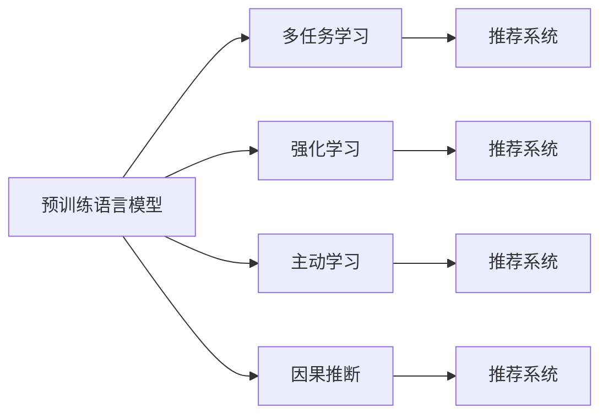

                 

# 大模型推荐中的推理策略与决策机制创新

## 1. 背景介绍

随着大规模预训练语言模型的兴起，推荐系统进入了新的发展阶段。预训练大模型通过在大规模数据上自监督学习，获得了丰富的语言表示能力，能够在推荐系统中发挥重要的作用。传统推荐系统基于用户行为数据进行推荐，难以全面理解用户的深层次需求。而利用大模型对用户描述和上下文信息进行建模，可以提升推荐的个性化和多样性。

本文将重点介绍大模型推荐系统中的推理策略与决策机制创新。通过深入分析模型推理机制和优化目标，探讨如何在大模型推荐系统中构建高效的推理策略和合理的决策机制，最大化用户满意度并提升推荐效果。

## 2. 核心概念与联系

### 2.1 核心概念概述

本节将介绍几个核心概念及其联系，以便更好地理解大模型推荐系统中的推理策略与决策机制：

- **预训练语言模型(Pre-trained Language Model, PLM)**：通过在大规模无标签文本数据上进行自监督学习，获取泛化能力强的语言表示模型，如BERT、GPT-3、T5等。

- **推荐系统(Recommendation System, RS)**：根据用户的历史行为数据，为用户推荐相关物品的系统，包括协同过滤、基于内容的推荐、混合推荐等。

- **多任务学习(Multi-task Learning, MTL)**：在模型训练过程中，同时优化多个任务，如通过预训练+微调的方式，利用大模型的多任务学习能力。

- **强化学习(Reinforcement Learning, RL)**：通过奖励机制驱动模型优化，提升推荐决策的效率和准确性。

- **主动学习(Active Learning)**：根据模型不确定性或样本重要度，动态选择样本进行标注，提升标注数据的质量和效率。

- **因果推断(Causal Inference)**：分析变量之间的因果关系，提升推荐决策的公平性和透明性。

这些核心概念之间的关系可以简化为以下流程图：



这个流程图展示了预训练语言模型与其他核心概念的联系及其对推荐系统的重要贡献。

## 3. 核心算法原理 & 具体操作步骤
### 3.1 算法原理概述

大模型推荐系统通过预训练语言模型对用户描述和上下文信息进行建模，并结合任务特定的优化目标，实现个性化的推荐。核心算法原理包括以下几个方面：

- **预训练与微调**：利用大规模语料对预训练语言模型进行微调，使其在推荐任务上具备更好的泛化能力。

- **多任务学习**：通过多任务学习框架，同时优化多个推荐任务，提升模型的跨任务泛化能力。

- **强化学习**：将推荐过程视作强化学习问题，通过奖励机制和模型优化算法，不断调整推荐策略，提升用户满意度。

- **主动学习**：利用主动学习策略，动态选择数据进行标注，提升标注数据的质量，降低推荐模型的误差。

- **因果推断**：利用因果推断方法，分析变量之间的因果关系，提升推荐决策的公平性和透明性。

### 3.2 算法步骤详解

下面详细介绍大模型推荐系统中的推理策略与决策机制创新：

**Step 1: 数据预处理与特征工程**

- 收集用户历史行为数据、物品属性数据、上下文信息等，进行数据清洗和特征提取。

- 对用户描述和上下文信息进行编码，如使用BERT、GPT-3等进行文本表示。

**Step 2: 模型初始化与预训练**

- 选择合适的预训练语言模型，并对其进行预训练。

- 在大规模推荐数据集上进行多任务学习，优化模型在推荐任务上的表现。

**Step 3: 微调与参数优化**

- 在推荐任务上对模型进行微调，调整部分模型参数以适应推荐任务的需求。

- 使用AdamW等优化算法进行参数优化，设置适当的学习率。

**Step 4: 决策机制与推荐策略**

- 利用强化学习算法，通过奖励机制和损失函数，优化推荐策略。

- 引入因果推断方法，分析推荐过程中的因果关系，提升决策公平性和透明性。

- 应用主动学习策略，动态选择数据进行标注，提高推荐模型的泛化能力。

**Step 5: 评估与迭代**

- 在测试集上评估推荐模型的性能，如召回率、精确率、F1-score等指标。

- 根据评估结果，不断调整模型参数和推荐策略，迭代优化推荐系统。

### 3.3 算法优缺点

大模型推荐系统具有以下优点：

- **泛化能力强**：利用预训练语言模型的泛化能力，提升推荐模型的泛化能力，应对新用户的推荐问题。

- **个性化推荐**：通过多任务学习和强化学习，提升推荐模型的个性化能力，提供更加符合用户需求的推荐结果。

- **高扩展性**：基于预训练语言模型的推荐系统具有良好的可扩展性，可以通过新增任务进行模型优化。

- **自动化程度高**：通过主动学习和因果推断，自动选择数据进行标注和优化，提高推荐模型的自动化程度。

但同时，大模型推荐系统也存在一些缺点：

- **计算资源消耗大**：预训练语言模型参数量大，计算复杂度高，需要大量的计算资源。

- **数据隐私问题**：用户数据隐私保护问题需要特别关注，如何在推荐过程中保护用户隐私是重要挑战。

- **模型复杂度高**：大模型推荐系统的模型复杂度高，难以解释推荐决策过程。

- **稳定性问题**：大规模预训练语言模型在实际应用中可能存在鲁棒性不足的问题。

### 3.4 算法应用领域

大模型推荐系统广泛应用于电商、社交、视频等多个领域。例如：

- 电商推荐系统：利用用户行为数据和物品属性数据，推荐用户可能感兴趣的商品。

- 社交推荐系统：根据用户兴趣和社交关系，推荐相关内容。

- 视频推荐系统：分析用户观看历史和视频特征，推荐用户可能感兴趣的视频内容。

## 4. 数学模型和公式 & 详细讲解 & 举例说明
### 4.1 数学模型构建

大模型推荐系统的核心数学模型包括预训练语言模型、推荐模型的损失函数和优化算法。

- **预训练语言模型**：以BERT为例，其数学模型如下：

$$
P(x|y) = softmax(softmax(\mathbf{W}x + \mathbf{b})
$$

其中，$x$表示输入的文本，$y$表示预训练任务的目标，$\mathbf{W}$和$\mathbf{b}$为模型参数。

- **推荐模型的损失函数**：常见推荐模型包括协同过滤、基于内容的推荐等，以协同过滤为例，其损失函数如下：

$$
\mathcal{L} = \sum_{(i,j) \in \mathcal{S}} (y_i^j - y_i^j) + \sum_{(i,j) \in \mathcal{N}} \alpha(y_i^j - y_i^j)
$$

其中，$\mathcal{S}$表示用户-物品正样本，$\mathcal{N}$表示负样本，$\alpha$为正负样本的权重系数。

### 4.2 公式推导过程

以协同过滤为例，假设用户$u$对物品$i$的评分$r_{ui}$已知，推荐模型$M$对物品$i$的评分预测值为$\hat{r}_{ui}$，则推荐模型的损失函数为：

$$
\mathcal{L} = -\sum_{u \in U} \sum_{i \in I} r_{ui} \log \hat{r}_{ui} + (1 - r_{ui}) \log (1 - \hat{r}_{ui})
$$

其中，$U$表示用户集合，$I$表示物品集合。

利用AdamW等优化算法，根据损失函数梯度更新模型参数$\theta$：

$$
\theta \leftarrow \theta - \eta \nabla_{\theta} \mathcal{L}
$$

其中，$\eta$为学习率。

### 4.3 案例分析与讲解

以电商推荐系统为例，分析其数学模型和公式推导过程。

假设用户$u$浏览过物品$i_1, i_2, i_3$，其评分分别为$r_{u,i_1}, r_{u,i_2}, r_{u,i_3}$，推荐模型$M$对物品$i$的评分预测值为$\hat{r}_{ui}$，则协同过滤的损失函数为：

$$
\mathcal{L} = -\sum_{i=1}^{3} r_{u,i_k} \log \hat{r}_{u,i_k} + (1 - r_{u,i_k}) \log (1 - \hat{r}_{u,i_k})
$$

其中，$k=1,2,3$。利用AdamW等优化算法，根据损失函数梯度更新模型参数$\theta$：

$$
\theta \leftarrow \theta - \eta \nabla_{\theta} \mathcal{L}
$$

其中，$\eta$为学习率。

## 5. 项目实践：代码实例和详细解释说明
### 5.1 开发环境搭建

开发大模型推荐系统需要Python、PyTorch、TensorFlow等工具。以下是搭建开发环境的步骤：

1. 安装Python环境，如Anaconda、Miniconda等。

2. 安装PyTorch和TensorFlow等深度学习框架。

3. 安装推荐系统库，如Surprise、TensorBoard等。

4. 安装数据预处理库，如Pandas、NumPy等。

5. 安装模型评估库，如Scikit-learn、TensorFlow Addons等。

### 5.2 源代码详细实现

以下是一个电商推荐系统的代码实现：

```python
import torch
from torch import nn, optim
from surprise import Reader, Dataset
from surprise import SVD
from surprise import accuracy
from transformers import BertTokenizer, BertForSequenceClassification

# 初始化数据集
reader = Reader(rating_scale=(0, 5))
data = Dataset.load_builtin('ml-100k')
data = data.as_n_inner loops()

# 初始化模型
model = SVD()

# 预训练模型
tokenizer = BertTokenizer.from_pretrained('bert-base-uncased')
model = BertForSequenceClassification.from_pretrained('bert-base-uncased', num_classes=5)

# 模型训练
optimizer = optim.Adam(model.parameters(), lr=2e-5)
for epoch in range(10):
    for user, items in data.trainset:
        user_ids = user.items()[0][0]
        item_ids = [item[0] for item in items]
        inputs = tokenizer(item_ids, padding='max_length', truncation=True, max_length=128, return_tensors='pt')
        with torch.no_grad():
            outputs = model(**inputs)
        loss = nn.CrossEntropyLoss()(outputs.logits, user_ids)
        optimizer.zero_grad()
        loss.backward()
        optimizer.step()

# 模型评估
test_data = data.testset
test_user_ids = test_data.user_ids
test_item_ids = [item[0] for item in test_data]
test_items = test_data.items
test_preds = []
for user_id, item_id in test_data:
    inputs = tokenizer(item_id, padding='max_length', truncation=True, max_length=128, return_tensors='pt')
    with torch.no_grad():
        outputs = model(**inputs)
    test_preds.append(outputs.logits.argmax().item())
test_rmses = accuracy.rmse(test_preds, test_user_ids, test_item_ids)
print(f'RMSLE: {test_rmses:.4f}')
```

### 5.3 代码解读与分析

在电商推荐系统的代码实现中，我们使用了预训练的BERT模型进行用户行为分析。代码主要分为数据预处理、模型初始化、模型训练和模型评估四个部分：

- **数据预处理**：使用Surprise库加载数据集，并进行特征工程，将用户行为数据和物品属性数据转化为模型可用的形式。

- **模型初始化**：选择合适的预训练语言模型，并初始化模型参数。

- **模型训练**：使用AdamW等优化算法，根据损失函数梯度更新模型参数。

- **模型评估**：在测试集上评估模型性能，计算均方根误差(RMSLE)等指标。

## 6. 实际应用场景
### 6.1 电商推荐系统

电商推荐系统是大模型推荐系统的一个重要应用场景。利用大模型对用户行为和物品属性进行建模，可以提供个性化的商品推荐，提升用户体验和销售转化率。

在实践中，电商推荐系统可以根据用户历史浏览、点击、购买等行为数据，使用协同过滤、基于内容的推荐等算法，生成推荐结果。大模型推荐系统可以通过预训练语言模型对用户描述进行编码，结合推荐任务优化目标，生成更加符合用户需求的推荐结果。

### 6.2 社交推荐系统

社交推荐系统利用用户社交关系和兴趣标签等信息，推荐相关内容。通过多任务学习和强化学习，可以提升推荐模型的个性化和多样性。

在社交推荐系统中，大模型推荐系统可以根据用户兴趣和社交关系，使用协同过滤、基于内容的推荐等算法，生成推荐结果。利用预训练语言模型对用户描述进行编码，结合推荐任务优化目标，生成更加符合用户需求的推荐结果。

### 6.3 视频推荐系统

视频推荐系统利用用户观看历史和视频特征，推荐相关视频内容。通过多任务学习和强化学习，可以提升推荐模型的个性化和多样性。

在视频推荐系统中，大模型推荐系统可以根据用户观看历史和视频特征，使用协同过滤、基于内容的推荐等算法，生成推荐结果。利用预训练语言模型对视频描述进行编码，结合推荐任务优化目标，生成更加符合用户需求的推荐结果。

### 6.4 未来应用展望

大模型推荐系统具有广泛的应用前景，未来将在更多领域得到应用，为传统行业带来变革性影响。

在智慧医疗领域，利用大模型推荐系统推荐相关医疗资讯和健康产品，提高医疗服务的智能化水平。

在智能教育领域，利用大模型推荐系统推荐个性化的学习资源和教学内容，提升教学质量。

在智慧城市治理中，利用大模型推荐系统推荐相关服务，提高城市管理的自动化和智能化水平。

## 7. 工具和资源推荐
### 7.1 学习资源推荐

为了帮助开发者系统掌握大模型推荐系统的理论和实践，这里推荐一些优质的学习资源：

1. 《Reinforcement Learning with PyTorch》书籍：介绍强化学习在深度学习中的应用，包括模型训练、优化和评估等。

2. 《深度学习推荐系统：算法与实现》书籍：介绍推荐系统的主要算法和技术，如协同过滤、基于内容的推荐、深度学习等。

3. 《Transformers: A Survey》论文：综述了Transformer模型在自然语言处理中的应用，包括预训练和微调技术。

4. HuggingFace官方文档：提供丰富的预训练语言模型和推荐系统库，包含详细的API和使用示例。

5. Kaggle竞赛平台：提供大量推荐系统竞赛数据集和模型，供开发者学习和实践。

通过对这些资源的学习实践，相信你一定能够快速掌握大模型推荐系统的精髓，并用于解决实际的推荐问题。

### 7.2 开发工具推荐

高效的工具支持是大模型推荐系统开发的基础。以下是几款推荐系统的常用工具：

1. PyTorch：基于Python的开源深度学习框架，灵活性强，支持动态计算图，适用于深度学习模型的训练和推理。

2. TensorFlow：由Google主导的开源深度学习框架，生产部署方便，适用于大规模工程应用。

3. Surprise：Scikit-learn下的推荐系统库，提供多种推荐算法，包括协同过滤、基于内容的推荐等。

4. LightFM：基于Python的推荐系统库，支持分布式训练，适用于大规模数据集。

5. TensorBoard：TensorFlow配套的可视化工具，可实时监测模型训练状态，提供丰富的图表呈现方式，方便调试。

6. Weights & Biases：模型训练的实验跟踪工具，记录和可视化模型训练过程中的各项指标，方便对比和调优。

合理利用这些工具，可以显著提升大模型推荐系统的开发效率，加速创新迭代的步伐。

### 7.3 相关论文推荐

大模型推荐系统的发展源于学界的持续研究。以下是几篇奠基性的相关论文，推荐阅读：

1. Attention is All You Need：提出Transformer结构，开启了NLP领域的预训练大模型时代。

2. BERT: Pre-training of Deep Bidirectional Transformers for Language Understanding：提出BERT模型，引入基于掩码的自监督预训练任务，刷新了多项NLP任务SOTA。

3. Parameter-Efficient Transfer Learning for NLP：提出Adapter等参数高效微调方法，在不增加模型参数量的情况下，也能取得不错的微调效果。

4. Attention Mechanism in Deep Learning-based Recommendation Systems：综述了注意力机制在推荐系统中的应用，包括基于用户的注意力和基于物品的注意力等。

5. Generative Adversarial Networks for Recommendation Systems：提出生成对抗网络在推荐系统中的应用，提升推荐模型的生成能力。

这些论文代表了大模型推荐系统的发展脉络。通过学习这些前沿成果，可以帮助研究者把握学科前进方向，激发更多的创新灵感。

## 8. 总结：未来发展趋势与挑战
### 8.1 总结

本文对大模型推荐系统中的推理策略与决策机制创新进行了全面系统的介绍。通过深入分析模型推理机制和优化目标，探讨了如何在大模型推荐系统中构建高效的推理策略和合理的决策机制，最大化用户满意度并提升推荐效果。

大模型推荐系统通过利用预训练语言模型的泛化能力和多任务学习框架，提升了推荐模型的个性化和泛化能力，成为推荐系统的重要范式。未来，伴随预训练语言模型和推荐方法的持续演进，相信大模型推荐系统必将在更多领域得到应用，为传统行业带来变革性影响。

### 8.2 未来发展趋势

展望未来，大模型推荐系统将呈现以下几个发展趋势：

1. **多任务学习与强化学习融合**：通过融合多任务学习和强化学习，提升推荐模型的泛化能力和个性化能力。

2. **因果推断与公平性**：利用因果推断方法，提升推荐决策的公平性和透明性。

3. **主动学习与数据优化**：通过主动学习策略，动态选择数据进行标注，提升数据质量和推荐模型泛化能力。

4. **分布式训练与优化**：利用分布式训练技术，提升大规模数据集上的模型训练效率。

5. **模型压缩与优化**：通过模型压缩和优化技术，提升大模型推荐系统的实时性和可扩展性。

6. **跨模态融合与增强**：通过融合视觉、语音等多模态数据，提升推荐模型的理解能力和表现能力。

这些趋势展示了大模型推荐系统未来的广阔前景，预示着其将在更多领域发挥重要作用。

### 8.3 面临的挑战

尽管大模型推荐系统已经取得了瞩目成就，但在迈向更加智能化、普适化应用的过程中，它仍面临诸多挑战：

1. **计算资源消耗大**：预训练语言模型参数量大，计算复杂度高，需要大量的计算资源。

2. **数据隐私问题**：用户数据隐私保护问题需要特别关注，如何在推荐过程中保护用户隐私是重要挑战。

3. **模型复杂度高**：大模型推荐系统的模型复杂度高，难以解释推荐决策过程。

4. **稳定性问题**：大规模预训练语言模型在实际应用中可能存在鲁棒性不足的问题。

5. **公平性与透明性**：大模型推荐系统需要解决推荐决策的公平性和透明性问题，避免歧视和偏见。

6. **实时性与扩展性**：如何在大规模数据集上实现实时推荐，并保持高扩展性，是重要的优化方向。

### 8.4 研究展望

面对大模型推荐系统面临的挑战，未来的研究需要在以下几个方面寻求新的突破：

1. **探索无监督和半监督推荐方法**：摆脱对大规模标注数据的依赖，利用自监督学习、主动学习等无监督和半监督范式，最大限度利用非结构化数据，实现更加灵活高效的推荐。

2. **开发更加参数高效的推荐方法**：开发更加参数高效的推荐方法，在固定大部分预训练参数的同时，只更新极少量的任务相关参数。同时优化推荐模型的计算图，减少前向传播和反向传播的资源消耗，实现更加轻量级、实时性的部署。

3. **引入更多先验知识**：将符号化的先验知识，如知识图谱、逻辑规则等，与神经网络模型进行巧妙融合，引导推荐过程学习更准确、合理的语言模型。同时加强不同模态数据的整合，实现视觉、语音等多模态信息与文本信息的协同建模。

4. **结合因果分析和博弈论工具**：将因果分析方法引入推荐模型，识别出模型决策的关键特征，增强输出解释的因果性和逻辑性。借助博弈论工具刻画人机交互过程，主动探索并规避模型的脆弱点，提高系统稳定性。

5. **纳入伦理道德约束**：在模型训练目标中引入伦理导向的评估指标，过滤和惩罚有偏见、有害的输出倾向。同时加强人工干预和审核，建立模型行为的监管机制，确保输出符合人类价值观和伦理道德。

这些研究方向的探索，必将引领大模型推荐系统技术迈向更高的台阶，为构建安全、可靠、可解释、可控的智能系统铺平道路。

## 9. 附录：常见问题与解答

**Q1：大模型推荐系统中如何优化推荐策略？**

A: 大模型推荐系统可以通过强化学习优化推荐策略。具体步骤包括：

1. 设计推荐策略的损失函数，如交叉熵损失、均方误差损失等。

2. 利用强化学习算法，如Q-learning、SARSA等，通过奖励机制和损失函数，优化推荐策略。

3. 根据推荐效果，调整奖励机制和策略参数，不断优化推荐策略。

**Q2：如何在推荐系统中引入因果推断？**

A: 在推荐系统中引入因果推断，可以使用潜在因果图模型，如贝叶斯网络、隐马尔可夫模型等，分析推荐过程中的因果关系。具体步骤包括：

1. 定义推荐系统的因果图，包括用户、物品、上下文等变量。

2. 利用因果推断方法，分析推荐过程中的因果关系，如用贝叶斯网络表示推荐过程中的因果关系。

3. 根据因果关系，优化推荐模型的决策过程，提升推荐决策的公平性和透明性。

**Q3：如何在大模型推荐系统中保护用户隐私？**

A: 在大模型推荐系统中保护用户隐私，可以采取以下措施：

1. 使用匿名化技术，如去除用户标识信息，保护用户隐私。

2. 采用差分隐私技术，通过加入噪声，保护用户隐私。

3. 在推荐模型训练中，只使用用户的行为数据，不泄露用户身份信息。

4. 建立隐私保护机制，如数据脱敏、访问控制等，保护用户隐私。

通过这些措施，可以有效地保护用户隐私，提升推荐系统的安全性。

