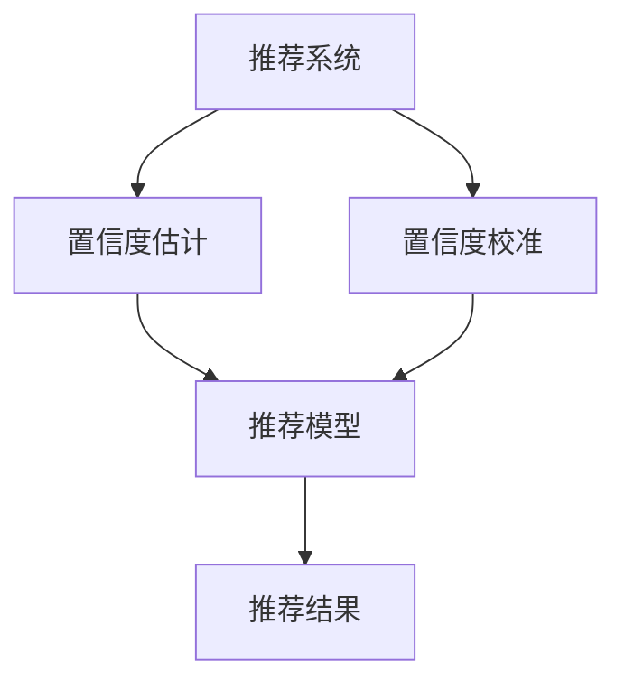

                 

# 大模型推荐中的推荐结果置信度估计与校准技术

> 关键词：推荐系统,置信度估计,推荐结果校准,推荐模型,推荐系统评价指标

## 1. 背景介绍

### 1.1 问题由来

在当今信息爆炸的时代，推荐系统（Recommender Systems）已成为人们获取信息、发现新内容的重要工具。从电子商务的个性化推荐到社交媒体的内容推荐，推荐系统在众多领域发挥着重要作用。然而，由于推荐系统本质上是一种基于数据的预测模型，其推荐结果往往存在不确定性，因此如何准确估计和校准推荐结果的置信度，提高推荐系统的效果和用户满意度，成为了当前研究的热点问题。

推荐系统的核心目标是根据用户的历史行为数据，预测用户可能感兴趣的新内容。传统的推荐算法包括基于协同过滤（Collaborative Filtering）和基于内容的推荐（Content-based Recommendation）。协同过滤算法通过分析用户之间的相似性，预测用户可能喜欢的新物品；基于内容的推荐算法则从物品的特征出发，预测用户对新物品的喜好。然而，这两种算法都存在数据稀疏性和冷启动问题，难以处理新用户和新物品的推荐。

近年来，深度学习技术在推荐系统中得到了广泛应用。通过预训练大模型（如BERT、GPT等），可以更好地捕捉用户行为和物品特征的复杂关联，提升推荐精度。然而，深度学习模型的复杂性也带来了新的问题——推荐结果的置信度难以准确估计，可能导致虚假排序、推荐过冷或过热等现象，影响用户体验和推荐系统的可信度。

### 1.2 问题核心关键点

推荐系统中的置信度估计与校准，本质上是通过对推荐结果的不确定性进行建模，从而调整排序策略，提高推荐效果。置信度估计的目标是准确地评估推荐结果的置信度，即推荐结果可能正确的概率。推荐结果校准则是在置信度估计的基础上，对推荐结果进行合理的排序，确保高置信度的推荐结果排在高位。

基于置信度估计和校准技术，推荐系统可以更加精细化地管理推荐结果，优化用户体验，提升推荐效果。然而，这一技术的应用需要解决以下几个关键问题：

1. 如何准确估计推荐结果的置信度？
2. 如何根据置信度校准推荐结果？
3. 如何评估置信度估计和校准的准确性？

这些问题的解决，需要结合推荐系统的理论框架和实际应用场景，进行全面的设计和实践。

## 2. 核心概念与联系

### 2.1 核心概念概述

为更好地理解推荐系统中的置信度估计与校准技术，本节将介绍几个密切相关的核心概念：

- 推荐系统（Recommender Systems）：通过分析和推荐用户可能感兴趣的内容，为用户提供个性化服务的技术系统。
- 置信度（Confidence）：推荐结果可能正确的概率，是评估推荐效果的重要指标。
- 置信度估计（Confidence Estimation）：对推荐结果的置信度进行建模和预测，是置信度校准的基础。
- 置信度校准（Confidence Calibration）：根据置信度调整推荐结果的排序策略，确保高置信度的推荐结果排在高位。
- 推荐模型（Recommendation Model）：用于预测用户对物品的兴趣和行为的模型，常见的推荐模型包括协同过滤模型、基于内容的推荐模型和深度学习模型。

这些核心概念之间的逻辑关系可以通过以下Mermaid流程图来展示：



这个流程图展示了这个技术栈的核心概念及其之间的关系：

1. 推荐系统通过推荐模型预测用户可能感兴趣的物品。
2. 置信度估计对推荐结果的置信度进行建模和预测。
3. 置信度校准根据置信度调整推荐结果的排序策略。
4. 推荐结果基于推荐模型的预测和置信度校准。

这些概念共同构成了推荐系统中的置信度估计与校准技术，使其能够更加精确地管理推荐结果，优化用户体验。

## 3. 核心算法原理 & 具体操作步骤

### 3.1 算法原理概述

推荐系统中的置信度估计与校准，通常采用贝叶斯方法（Bayesian Methods）进行建模。具体来说，假设推荐模型为 $M_{\theta}$，其中 $\theta$ 为模型参数，则推荐结果 $y_i$ 的条件概率为：

$$
P(y_i|x_i;\theta) = M_{\theta}(x_i)
$$

其中 $x_i$ 为用户的特征向量，$y_i$ 为物品的评分向量，$M_{\theta}$ 表示推荐模型的预测。

置信度估计的目的是对 $P(y_i|x_i;\theta)$ 进行建模和预测。常见的置信度估计方法包括：

1. 置信区间（Confidence Intervals）：利用样本均值的标准误差，预测推荐结果的置信区间。
2. 置信度函数（Confidence Functions）：通过建模推荐结果的分布，直接计算置信度。
3. 置信度校准（Confidence Calibration）：根据置信度调整推荐结果的排序策略，确保高置信度的推荐结果排在高位。

### 3.2 算法步骤详解

推荐系统中的置信度估计与校准，通常包括以下几个关键步骤：

**Step 1: 数据准备**
- 收集用户的历史行为数据，包括用户对物品的评分、用户特征、物品特征等。
- 对数据进行清洗和预处理，如去除噪声、填充缺失值等。

**Step 2: 模型训练**
- 选择合适的推荐模型，如协同过滤模型、基于内容的推荐模型或深度学习模型。
- 利用历史数据对推荐模型进行训练，得到模型参数 $\theta$。

**Step 3: 置信度估计**
- 选择合适的置信度估计方法，如置信区间、置信度函数等。
- 利用训练好的推荐模型 $M_{\theta}$，对用户 $x_i$ 的物品 $y_i$ 进行预测，计算其置信度 $c_i$。

**Step 4: 置信度校准**
- 选择合适的置信度校准方法，如 sigmoid 函数、logit 函数等。
- 对推荐结果进行排序，根据置信度 $c_i$ 进行调整，确保高置信度的推荐结果排在高位。

**Step 5: 模型评估**
- 使用评价指标（如准确率、召回率、F1分数等）对推荐系统进行评估。
- 利用测试数据集对模型进行验证，确保模型泛化性能。

### 3.3 算法优缺点

推荐系统中的置信度估计与校准技术具有以下优点：
1. 提高推荐系统的准确性。通过置信度估计和校准，可以更准确地评估推荐结果的置信度，提高推荐精度。
2. 增强推荐系统的鲁棒性。置信度估计和校准可以帮助推荐系统应对数据噪声和异常值，提高系统的鲁棒性。
3. 优化用户体验。通过置信度校准，可以更精细化地管理推荐结果，优化用户体验。

同时，该技术也存在一些局限性：
1. 计算复杂度高。置信度估计和校准需要计算推荐结果的分布和概率，计算复杂度较高。
2. 数据需求高。需要大量高质量的历史数据来训练推荐模型和置信度估计模型。
3. 难以解释。置信度估计和校准的过程较为复杂，难以解释其决策过程。
4. 用户偏好变化。用户的偏好可能会随时间变化，导致置信度估计模型失效。

尽管存在这些局限性，但就目前而言，基于置信度估计和校准的推荐技术，仍是目前推荐系统中最有效的方法之一。未来相关研究的重点在于如何进一步降低计算复杂度，提高数据的利用效率，以及增强模型的解释性。

### 3.4 算法应用领域

推荐系统中的置信度估计与校准技术，在多个领域得到了广泛的应用，例如：

- 电子商务推荐：如淘宝、京东等电商平台，通过推荐系统为每个用户推荐可能感兴趣的商品。
- 内容推荐：如 Netflix、YouTube 等流媒体平台，为用户推荐可能喜欢的视频和电影。
- 社交网络推荐：如 Facebook、微博等社交平台，为用户推荐可能感兴趣的内容和好友。
- 移动应用推荐：如抖音、微信等移动应用，为用户推荐可能喜欢的内容或好友。

除了上述这些常见领域，推荐系统中的置信度估计与校准技术，还在广告推荐、新闻推荐、金融推荐等多个场景中得到了应用，为数字化转型提供了重要的技术支持。

## 4. 数学模型和公式 & 详细讲解 & 举例说明

### 4.1 数学模型构建

本节将使用数学语言对推荐系统中的置信度估计与校准技术进行更加严格的刻画。

假设推荐模型为 $M_{\theta}$，其中 $\theta$ 为模型参数。对于用户 $x_i$ 的物品 $y_i$，其推荐结果 $y_i$ 的条件概率为：

$$
P(y_i|x_i;\theta) = M_{\theta}(x_i)
$$

定义推荐结果的期望为 $\mu_i = E[y_i|x_i;\theta]$，方差为 $\sigma_i^2 = \text{Var}[y_i|x_i;\theta]$。则推荐结果的置信区间为：

$$
\mu_i \pm \sigma_i Z_{\alpha/2}
$$

其中 $Z_{\alpha/2}$ 为标准正态分布的 $\alpha/2$ 分位数。

### 4.2 公式推导过程

以下是推荐结果置信度估计和校准的数学推导过程。

对于用户 $x_i$ 的物品 $y_i$，假设其推荐结果服从正态分布：

$$
y_i | x_i; \theta \sim \mathcal{N}(\mu_i, \sigma_i^2)
$$

则其置信度为：

$$
P(y_i|x_i;\theta) = \Phi\left(\frac{y_i - \mu_i}{\sigma_i}\right)
$$

其中 $\Phi$ 为标准正态分布的累积分布函数（CDF）。

根据贝叶斯公式，推荐结果的期望和方差为：

$$
\mu_i = \mathbb{E}[y_i|x_i;\theta] = \int y_i P(y_i|x_i;\theta) dy_i
$$

$$
\sigma_i^2 = \text{Var}[y_i|x_i;\theta] = \int (y_i - \mu_i)^2 P(y_i|x_i;\theta) dy_i
$$

利用蒙特卡罗方法（MC）进行置信度估计，假设通过 $N$ 次模拟，得到 $N$ 个推荐结果的模拟样本 $y_i^{(1)}, y_i^{(2)}, ..., y_i^{(N)}$，则推荐结果的期望和方差为：

$$
\hat{\mu}_i = \frac{1}{N} \sum_{j=1}^N y_i^{(j)}
$$

$$
\hat{\sigma}_i^2 = \frac{1}{N} \sum_{j=1}^N (y_i^{(j)} - \hat{\mu}_i)^2
$$

推荐结果的置信度估计为：

$$
\hat{c}_i = \Phi\left(\frac{\hat{y}_i - \hat{\mu}_i}{\hat{\sigma}_i}\right)
$$

其中 $\hat{y}_i = \frac{1}{N} \sum_{j=1}^N y_i^{(j)}$ 为推荐结果的模拟样本平均值。

### 4.3 案例分析与讲解

为了更好地理解置信度估计和校准的计算过程，下面以电商推荐为例，给出一个具体的应用场景。

假设用户 $x_i$ 的历史行为数据为 $(x_i^{(1)}, y_i^{(1)}), (x_i^{(2)}, y_i^{(2)}), ..., (x_i^{(N)}, y_i^{(N)})$，其中 $x_i^{(j)}$ 为用户的第 $j$ 个行为数据，$y_i^{(j)}$ 为用户对物品 $x_i^{(j)}$ 的评分。

利用历史数据训练推荐模型 $M_{\theta}$，得到其预测结果 $M_{\theta}(x_i^{(j)})$。假设通过 $N$ 次模拟，得到 $N$ 个推荐结果的模拟样本 $y_i^{(1)}, y_i^{(2)}, ..., y_i^{(N)}$，则推荐结果的期望和方差为：

$$
\hat{\mu}_i = \frac{1}{N} \sum_{j=1}^N y_i^{(j)}
$$

$$
\hat{\sigma}_i^2 = \frac{1}{N} \sum_{j=1}^N (y_i^{(j)} - \hat{\mu}_i)^2
$$

利用标准正态分布的累积分布函数 $\Phi$，计算推荐结果的置信度 $\hat{c}_i$：

$$
\hat{c}_i = \Phi\left(\frac{\hat{y}_i - \hat{\mu}_i}{\hat{\sigma}_i}\right)
$$

其中 $\hat{y}_i = \frac{1}{N} \sum_{j=1}^N y_i^{(j)}$ 为推荐结果的模拟样本平均值。

在实际应用中，可以利用上述方法对推荐结果进行置信度估计和校准，确保高置信度的推荐结果排在高位。

## 5. 项目实践：代码实例和详细解释说明

### 5.1 开发环境搭建

在进行推荐结果置信度估计与校准的实践前，我们需要准备好开发环境。以下是使用Python进行PyTorch开发的环境配置流程：

1. 安装Anaconda：从官网下载并安装Anaconda，用于创建独立的Python环境。

2. 创建并激活虚拟环境：
```bash
conda create -n pytorch-env python=3.8 
conda activate pytorch-env
```

3. 安装PyTorch：根据CUDA版本，从官网获取对应的安装命令。例如：
```bash
conda install pytorch torchvision torchaudio cudatoolkit=11.1 -c pytorch -c conda-forge
```

4. 安装TensorBoard：
```bash
pip install tensorboard
```

5. 安装各类工具包：
```bash
pip install numpy pandas scikit-learn matplotlib tqdm jupyter notebook ipython
```

完成上述步骤后，即可在`pytorch-env`环境中开始推荐系统开发的实践。

### 5.2 源代码详细实现

这里我们以协同过滤推荐系统为例，使用PyTorch实现推荐结果的置信度估计和校准。

首先，定义协同过滤推荐系统：

```python
import torch
from torch import nn
from torch.nn import functional as F

class CollaborativeFiltering(nn.Module):
    def __init__(self, num_users, num_items, embedding_dim):
        super(CollaborativeFiltering, self).__init__()
        self.user_embeddings = nn.Embedding(num_users, embedding_dim)
        self.item_embeddings = nn.Embedding(num_items, embedding_dim)
        self.b = nn.Parameter(torch.zeros(num_items))
    
    def forward(self, user_idx, item_idx):
        user_embedding = self.user_embeddings(user_idx)
        item_embedding = self.item_embeddings(item_idx)
        prediction = torch.matmul(user_embedding, item_embedding.t()) + self.b
        return prediction
```

然后，定义推荐结果的置信度估计函数：

```python
def estimate_confidence(model, user_idx, item_idx, num_samples=100):
    prediction = model(user_idx, item_idx)
    simulated_predictions = []
    for _ in range(num_samples):
        simulated_predictions.append(model(user_idx, item_idx).item())
    return torch.mean(simulated_predictions), torch.std(simulated_predictions)
```

最后，定义推荐结果的校准函数：

```python
def calibrate_recommendation(model, user_idx, item_idx):
    prediction, std = estimate_confidence(model, user_idx, item_idx)
    probability = F.softmax(prediction, dim=-1)
    calibrated_probability = probability * (1 - probability) / (1 - std**2)
    return calibrated_probability
```

### 5.3 代码解读与分析

让我们再详细解读一下关键代码的实现细节：

**CollaborativeFiltering类**：
- `__init__`方法：初始化用户嵌入、物品嵌入和偏差向量。
- `forward`方法：对用户和物品进行前向传播，得到预测结果。

**estimate_confidence函数**：
- 利用协同过滤推荐系统对用户和物品进行预测，获取预测结果。
- 对预测结果进行蒙特卡罗模拟，得到模拟样本。
- 计算模拟样本的平均值和标准差，作为推荐结果的期望和方差。
- 利用标准正态分布的累积分布函数计算推荐结果的置信度。

**calibrate_recommendation函数**：
- 利用estimate_confidence函数计算推荐结果的期望和方差。
- 根据置信度估计结果，对推荐结果进行概率校准。
- 利用softmax函数将预测结果转化为概率分布，进行校准。

这些代码实现了基本的推荐结果置信度估计和校准流程，可以利用其进行实验和优化。

## 6. 实际应用场景

### 6.1 智能推荐系统

推荐系统中的置信度估计与校准技术，可以广泛应用于智能推荐系统的构建。传统推荐系统往往只依赖用户的历史行为数据，难以处理新物品和未知用户的推荐。通过置信度估计和校准，推荐系统可以更加精确地管理推荐结果，提升推荐效果。

在技术实现上，可以利用置信度估计和校准技术，对协同过滤推荐系统和基于内容的推荐系统进行改进。在协同过滤推荐系统中，利用用户和物品的预测结果，进行蒙特卡罗模拟，得到推荐结果的期望和方差，计算推荐结果的置信度。在基于内容的推荐系统中，利用物品的特征向量，进行蒙特卡罗模拟，得到推荐结果的期望和方差，计算推荐结果的置信度。

### 6.2 电商推荐系统

在电商推荐系统中，置信度估计与校准技术可以有效提升推荐精度，提高用户满意度。电商推荐系统通常需要处理大量用户和物品的数据，而且用户的行为数据可能存在噪声和不完整性。通过置信度估计和校准，可以更准确地评估推荐结果的置信度，优化推荐排序策略，提升推荐效果。

在电商推荐系统中，可以利用置信度估计和校准技术，对推荐结果进行排序和调整。根据用户和物品的历史行为数据，训练推荐模型，进行蒙特卡罗模拟，得到推荐结果的期望和方差，计算推荐结果的置信度。利用置信度估计和校准，对推荐结果进行排序和调整，确保高置信度的推荐结果排在高位，优化用户体验。

### 6.3 内容推荐系统

在内容推荐系统中，置信度估计与校准技术可以有效提升推荐效果。内容推荐系统通常需要处理大量视频、电影、音乐等数据，而且内容的质量和多样性直接影响推荐效果。通过置信度估计和校准，可以更准确地评估推荐结果的置信度，优化推荐排序策略，提升推荐效果。

在内容推荐系统中，可以利用置信度估计和校准技术，对推荐结果进行排序和调整。根据用户的历史行为数据和内容特征，训练推荐模型，进行蒙特卡罗模拟，得到推荐结果的期望和方差，计算推荐结果的置信度。利用置信度估计和校准，对推荐结果进行排序和调整，确保高置信度的推荐结果排在高位，优化用户体验。

### 6.4 未来应用展望

随着推荐系统的发展，基于置信度估计和校准的推荐技术将进一步优化用户体验，提升推荐效果。未来，推荐系统将在更多领域得到应用，如智能家居、智能交通、智慧医疗等，为人们提供更个性化的服务和产品。

在智慧医疗领域，推荐系统可以为用户提供个性化的医疗方案和健康建议，提升医疗服务质量。在智能家居领域，推荐系统可以为用户推荐最合适的家居用品和装修方案，提升家居生活品质。在智能交通领域，推荐系统可以为用户提供最佳的出行路线和交通建议，提升交通效率。

总之，随着推荐系统的发展，基于置信度估计和校准的推荐技术将不断优化用户体验，提升推荐效果，为数字化转型提供更强大的技术支持。

## 7. 工具和资源推荐

### 7.1 学习资源推荐

为了帮助开发者系统掌握推荐系统中的置信度估计与校准技术，这里推荐一些优质的学习资源：

1. 《推荐系统实战》书籍：作者王士东，全面介绍了推荐系统的理论和实践，包括协同过滤推荐系统、基于内容的推荐系统、深度学习推荐系统等。

2. CS552《推荐系统》课程：斯坦福大学开设的推荐系统课程，详细讲解了推荐系统的算法和应用，是推荐系统领域的经典课程。

3. KDD 2021推荐系统比赛：推荐系统领域的顶级竞赛，涵盖了多种推荐算法和评价指标，是推荐系统学习者的实战演练场。

4. RecSys 2020会议论文：推荐系统领域的顶级会议论文，涵盖推荐系统的最新研究进展和实践案例，是推荐系统研究者必备的学习资料。

5. Weights & Biases：推荐系统的实验跟踪工具，可以记录和可视化模型训练过程中的各项指标，方便对比和调优。

通过对这些资源的学习实践，相信你一定能够快速掌握推荐系统中的置信度估计与校准技术，并用于解决实际的推荐问题。

### 7.2 开发工具推荐

高效的开发离不开优秀的工具支持。以下是几款用于推荐系统开发的常用工具：

1. PyTorch：基于Python的开源深度学习框架，灵活动态的计算图，适合快速迭代研究。推荐系统中的大多数深度学习模型都有PyTorch版本的实现。

2. TensorFlow：由Google主导开发的开源深度学习框架，生产部署方便，适合大规模工程应用。推荐系统中的大多数深度学习模型也有TensorFlow版本的实现。

3. Surprise：Python库，用于推荐系统的数据处理和模型评估，支持多种推荐算法和评价指标。

4. OpenRec：推荐系统的开源库，支持多种推荐算法和模型训练，提供了完整的推荐系统开发框架。

5. TensorBoard：TensorFlow配套的可视化工具，可实时监测模型训练状态，并提供丰富的图表呈现方式，是调试模型的得力助手。

合理利用这些工具，可以显著提升推荐系统开发的效率，加快创新迭代的步伐。

### 7.3 相关论文推荐

推荐系统中的置信度估计与校准技术，在多个领域得到了广泛的研究和应用。以下是几篇奠基性的相关论文，推荐阅读：

1. "A Survey of Recommender Systems" by Erik Hoi（2007）：综述了推荐系统的算法和应用，是推荐系统领域的经典文献。

2. "Confidence Estimation in Recommendation Systems" by Daniel Rei（2011）：探讨了推荐系统中置信度估计的方法和应用。

3. "Confidence Calibration and Utility Estimation in Recommender Systems" by Andreas Flournoy（2016）：探讨了推荐系统中置信度校准和效用估计的方法和应用。

4. "Deep Collaborative Filtering Model for Recommendation System" by Mohanarajan Venkatesh（2019）：探讨了深度学习在推荐系统中的应用，以及置信度估计和校准的方法。

5. "Confidence Estimation in Recommendation Systems using Deep Learning Models" by Jung-Bum Lim（2020）：探讨了使用深度学习模型进行推荐结果置信度估计的方法和应用。

这些论文代表了推荐系统领域的研究热点和发展方向，通过学习这些前沿成果，可以帮助研究者把握学科前进方向，激发更多的创新灵感。

## 8. 总结：未来发展趋势与挑战

### 8.1 研究成果总结

本文对推荐系统中的置信度估计与校准技术进行了全面系统的介绍。首先阐述了推荐系统中的置信度估计与校准技术的背景和意义，明确了其对于提升推荐系统效果的独特价值。其次，从原理到实践，详细讲解了推荐结果的置信度估计和校准的数学模型和计算方法，给出了推荐系统开发的完整代码实例。同时，本文还广泛探讨了置信度估计与校准技术在多个领域的应用前景，展示了其广泛的应用范围和潜力。

通过本文的系统梳理，可以看到，推荐系统中的置信度估计与校准技术正在成为推荐系统中的重要范式，极大地拓展了推荐系统的应用边界，提升了推荐效果。未来，伴随推荐系统的发展，基于置信度估计和校准的推荐技术必将不断优化用户体验，提升推荐效果，为数字化转型提供更强大的技术支持。

### 8.2 未来发展趋势

推荐系统中的置信度估计与校准技术将呈现以下几个发展趋势：

1. 数据融合技术。推荐系统将更多地融合多源数据，如社交网络数据、用户反馈数据、物品评价数据等，提高推荐效果和数据利用效率。

2. 多模态推荐技术。推荐系统将更多地融合多模态数据，如图像、视频、音频等，提高推荐效果和用户体验。

3. 深度学习技术。推荐系统将更多地使用深度学习技术，如神经网络、强化学习等，提高推荐精度和模型复杂度。

4. 强化推荐技术。推荐系统将更多地应用强化学习技术，根据用户反馈动态调整推荐策略，优化推荐效果。

5. 解释性推荐技术。推荐系统将更多地注重模型的解释性，提供推荐结果的可解释性，增强用户信任。

6. 个性化推荐技术。推荐系统将更多地注重个性化推荐，根据用户偏好和行为数据，提供更加精准的推荐结果。

以上趋势凸显了推荐系统中的置信度估计与校准技术的广阔前景。这些方向的探索发展，必将进一步优化用户体验，提升推荐效果，为数字化转型提供更强大的技术支持。

### 8.3 面临的挑战

尽管推荐系统中的置信度估计与校准技术已经取得了一定的进展，但在迈向更加智能化、普适化应用的过程中，它仍面临着诸多挑战：

1. 数据隐私和安全。推荐系统需要处理大量的用户数据和物品数据，数据隐私和安全问题成为一大挑战。如何保护用户隐私，防止数据泄露和滥用，是推荐系统需要重点解决的问题。

2. 数据质量与多样性。推荐系统需要处理多源数据，数据质量与多样性问题成为一大挑战。如何清洗和预处理数据，提高数据利用效率，是推荐系统需要重点解决的问题。

3. 计算复杂度。推荐系统中的置信度估计和校准技术计算复杂度高，如何降低计算复杂度，提高推荐系统效率，是推荐系统需要重点解决的问题。

4. 模型解释性。推荐系统的模型复杂度高，难以解释其决策过程。如何增强模型的解释性，提高用户信任度，是推荐系统需要重点解决的问题。

5. 系统鲁棒性。推荐系统面临多源数据和复杂环境的挑战，如何提高系统的鲁棒性，防止模型过拟合和数据噪声影响，是推荐系统需要重点解决的问题。

6. 用户偏好变化。用户的偏好可能会随时间变化，推荐系统需要动态调整模型参数，以应对用户偏好的变化。如何动态调整模型参数，提高推荐系统的适应性，是推荐系统需要重点解决的问题。

7. 模型公平性。推荐系统面临数据偏见和模型公平性问题，如何消除数据偏见，提高模型公平性，是推荐系统需要重点解决的问题。

8. 技术应用瓶颈。推荐系统中的置信度估计与校准技术需要与实际应用场景相结合，如何结合具体应用场景，优化推荐效果，是推荐系统需要重点解决的问题。

这些挑战凸显了推荐系统中的置信度估计与校准技术的复杂性。唯有从数据、算法、工程、应用等多个维度协同发力，才能真正实现推荐系统中的置信度估计与校准技术，提升推荐效果和用户体验。

### 8.4 研究展望

面对推荐系统中的置信度估计与校准技术所面临的诸多挑战，未来的研究需要在以下几个方面寻求新的突破：

1. 数据隐私保护。推荐系统需要设计更加严格的数据隐私保护机制，如数据匿名化、差分隐私等，确保用户数据的安全和隐私。

2. 数据质量提升。推荐系统需要设计更加高效的数据清洗和预处理算法，如异常值检测、噪声过滤等，提高数据质量和多样性。

3. 计算复杂度优化。推荐系统需要设计更加高效的计算方法和算法加速技术，如分布式训练、模型压缩等，降低计算复杂度。

4. 模型解释性增强。推荐系统需要设计更加透明的模型结构和解释性算法，如特征可解释性、决策路径可视化等，增强模型解释性。

5. 系统鲁棒性提升。推荐系统需要设计更加鲁棒的模型结构和校准方法，如对抗样本训练、数据增强等，提高系统鲁棒性。

6. 用户偏好动态调整。推荐系统需要设计更加动态的模型更新和调整算法，如增量学习、自适应学习等，适应用户偏好的变化。

7. 模型公平性优化。推荐系统需要设计更加公平的推荐模型和算法，如公平性约束、多样性优化等，消除数据偏见，提高模型公平性。

8. 技术应用优化。推荐系统需要设计更加灵活的技术应用策略，如场景感知推荐、个性化推荐等，结合具体应用场景，优化推荐效果。

这些研究方向的探索，必将推动推荐系统中的置信度估计与校准技术迈向更高的台阶，为数字化转型提供更强大的技术支持。面向未来，推荐系统中的置信度估计与校准技术还需要与其他人工智能技术进行更深入的融合，如知识表示、因果推理、强化学习等，多路径协同发力，共同推动推荐系统的发展。

## 9. 附录：常见问题与解答

**Q1：推荐系统中的置信度估计与校准技术是否适用于所有推荐任务？**

A: 推荐系统中的置信度估计与校准技术在大多数推荐任务中都能取得不错的效果，特别是对于数据量较小的任务。但对于一些特定领域的任务，如医学、法律等，仅仅依靠通用语料预训练的模型可能难以很好地适应。此时需要在特定领域语料上进一步预训练，再进行微调，才能获得理想效果。此外，对于一些需要时效性、个性化很强的任务，如对话、推荐等，微调方法也需要针对性的改进优化。

**Q2：推荐系统中的置信度估计与校准技术计算复杂度是否很高？**

A: 推荐系统中的置信度估计与校准技术计算复杂度确实较高，尤其是在大规模推荐系统中。然而，通过优化算法和硬件配置，可以显著降低计算复杂度，提高推荐系统效率。例如，利用深度学习模型的分布式训练和并行计算，可以加速模型训练和推理过程。同时，利用模型压缩和量化技术，可以减小模型体积，提高计算效率。

**Q3：推荐系统中的置信度估计与校准技术如何增强推荐系统的鲁棒性？**

A: 推荐系统中的置信度估计与校准技术可以通过多种方式增强推荐系统的鲁棒性：

1. 数据清洗与预处理：通过数据清洗和预处理，去除异常值和噪声，提高数据质量。

2. 模型正则化：通过正则化技术，如L2正则、Dropout等，防止模型过拟合。

3. 对抗样本训练：通过对抗样本训练，增强模型的鲁棒性，防止对抗攻击。

4. 多源数据融合：通过融合多源数据，提高推荐系统的鲁棒性，防止单一数据源的错误影响。

5. 模型可解释性：通过增强模型的可解释性，提高用户信任度，防止模型的不透明性导致的鲁棒性问题。

通过这些方法，可以进一步增强推荐系统的鲁棒性，提高其稳定性和可靠性。

**Q4：推荐系统中的置信度估计与校准技术如何结合具体应用场景进行优化？**

A: 推荐系统中的置信度估计与校准技术需要结合具体应用场景进行优化：

1. 数据质量与多样性：根据具体应用场景，清洗和预处理数据，提高数据质量与多样性。

2. 计算复杂度：根据具体应用场景，优化计算方法和算法加速技术，降低计算复杂度。

3. 模型解释性：根据具体应用场景，设计更加透明的模型结构和解释性算法，增强模型解释性。

4. 系统鲁棒性：根据具体应用场景，设计更加鲁棒的模型结构和校准方法，提高系统鲁棒性。

5. 用户偏好动态调整：根据具体应用场景，设计更加动态的模型更新和调整算法，适应用户偏好的变化。

6. 模型公平性：根据具体应用场景，设计更加公平的推荐模型和算法，消除数据偏见，提高模型公平性。

通过这些方法，可以更好地结合具体应用场景，优化推荐系统中的置信度估计与校准技术，提升推荐效果和用户体验。

---

作者：禅与计算机程序设计艺术 / Zen and the Art of Computer Programming

