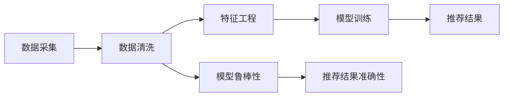

                 

# 大模型推荐中的数据质量问题与应对策略

> 关键词：推荐系统,数据质量,冷启动,用户行为,对抗样本,鲁棒性

## 1. 背景介绍

推荐系统作为电商、社交、视频等多个领域的基础设施，逐渐成为互联网应用的重要组成部分。大模型推荐系统以深度学习为核心，利用大数据对用户行为进行建模，为用户推荐个性化的内容。然而，推荐系统的核心——大数据的质量问题，直接影响模型训练和推荐结果的准确性。本文将系统梳理大模型推荐系统中常见的数据质量问题，并提出相应的应对策略，为构建高质量推荐系统提供指导。

## 2. 核心概念与联系

### 2.1 核心概念概述

为了深入理解大模型推荐系统中的数据质量问题，我们首先介绍几个关键概念：

- **推荐系统**：利用用户行为数据和商品属性数据，通过预测模型为用户推荐感兴趣的物品的系统。
- **冷启动**：新用户或新物品加入推荐系统时，由于缺乏历史数据，无法利用模型进行推荐，即冷启动问题。
- **用户行为**：用户在平台上的浏览、点击、购买、评价等行为，是推荐系统的重要数据来源。
- **对抗样本**：有意构造的、导致模型输出错误的行为数据，用于攻击和干扰模型的正常工作。
- **鲁棒性**：模型在面对噪声、对抗样本等异常情况时，仍然能够稳定输出的能力。

这些概念之间存在紧密联系，共同构成了推荐系统的工作框架。具体而言，数据质量问题影响用户行为的建模，进而影响模型的推荐效果和鲁棒性。以下Mermaid流程图展示了数据质量与推荐系统各组成部分的联系：



## 3. 核心算法原理 & 具体操作步骤

### 3.1 算法原理概述

大模型推荐系统的主要工作流程包括数据采集、数据清洗、特征工程、模型训练和推荐结果生成。在这一流程中，数据质量问题贯穿始终，直接决定了模型训练的可靠性和推荐结果的准确性。因此，本文将从数据质量问题出发，逐一探讨应对策略。

### 3.2 算法步骤详解

#### 3.2.1 数据采集

在推荐系统中，数据采集是推荐系统正常工作的前提。这一阶段的数据质量问题主要集中在：

- **数据多样性**：不同用户和物品的特征差异较大，需要采集多样化的数据进行建模。
- **数据完整性**：部分用户和物品缺乏足够的历史数据，导致冷启动问题。
- **数据时效性**：用户行为数据随着时间推移可能发生变化，需要定期更新数据。

应对策略包括：

- 采用多渠道数据采集，如网页点击、移动应用行为、社交媒体互动等，增加数据多样性。
- 针对冷启动用户和物品，利用时间戳或标签等方式进行特征扩展，辅助模型学习。
- 定期更新数据，以捕捉用户行为的最新变化，保证数据的时效性。

#### 3.2.2 数据清洗

数据清洗是数据预处理的第一步，目的是从原始数据中提取出有用的信息，去除噪声和错误数据。数据清洗的常见问题包括：

- **缺失值**：用户行为数据中可能存在缺失值，需要根据实际情况进行处理。
- **异常值**：某些异常数据可能对模型产生负面影响，需要识别和处理。
- **重复数据**：数据中可能存在重复记录，需要去重。

应对策略包括：

- 对于缺失值，采用插值法、均值填补、删除等方法进行处理。
- 对于异常值，采用统计方法识别和填补，或直接删除。
- 对于重复数据，采用去重算法，如哈希表去重、时间戳去重等。

#### 3.2.3 特征工程

特征工程是利用数据中的特征进行建模，通过构造新的特征来提升模型的预测能力。常见的特征工程问题包括：

- **特征维度过宽**：过多的特征可能导致维度灾难，影响模型性能。
- **特征不均衡**：不同特征的重要性可能不均衡，需要平衡处理。

应对策略包括：

- 采用特征选择方法，如方差筛选、相关系数分析、L1正则化等，选择重要特征。
- 利用特征降维技术，如主成分分析(PCA)、线性判别分析(LDA)、T-SNE等，减少特征维度。
- 利用特征构造方法，如交叉特征、组合特征、时序特征等，提升特征表示能力。

#### 3.2.4 模型训练

模型训练是利用数据进行模型优化，得到预测模型。这一阶段的数据质量问题主要集中在：

- **数据不平衡**：不同类别的数据样本不均衡，可能导致模型偏差。
- **过拟合**：模型在训练数据上表现优异，但泛化能力不足。
- **数据泄露**：训练数据和测试数据不一致，导致模型评估失效。

应对策略包括：

- 采用数据增强技术，如SMOTE、数据扩充等，平衡不同类别的数据样本。
- 采用正则化技术，如L2正则、Dropout、 Early Stopping等，防止模型过拟合。
- 采用数据划分技术，如交叉验证、留一法等，保证训练和测试数据的一致性。

#### 3.2.5 推荐结果生成

推荐结果生成是利用模型预测结果，为用户推荐物品的过程。这一阶段的数据质量问题主要集中在：

- **推荐结果多样性不足**：推荐结果过于单一，无法满足用户的个性化需求。
- **推荐结果精度不足**：推荐结果与用户真实需求不一致，导致用户体验不佳。

应对策略包括：

- 采用多样性提升技术，如推荐排名N-排列、多样性约束优化等，增加推荐结果的多样性。
- 采用精度提升技术，如召回率优化、排序算法改进等，提高推荐结果的准确性。

### 3.3 算法优缺点

大模型推荐系统具有以下优点：

- **高精度**：利用深度学习模型进行建模，能够捕捉用户行为中的复杂关系，推荐结果精度高。
- **可扩展性**：大模型推荐系统可以处理大规模数据，支持实时推荐。
- **鲁棒性**：大模型推荐系统能够处理噪声、异常值等干扰，保证推荐结果的稳定性。

同时，该方法也存在以下缺点：

- **计算成本高**：大模型推荐系统需要大量计算资源进行训练，且模型推理开销大。
- **冷启动问题**：新用户或新物品缺乏历史数据，导致推荐结果不准确。
- **数据依赖性强**：推荐系统高度依赖数据质量，数据问题会影响模型效果。

### 3.4 算法应用领域

大模型推荐系统在电商、社交、视频等多个领域得到广泛应用：

- **电商推荐**：利用用户浏览、点击、购买等行为数据，推荐商品。
- **社交推荐**：利用用户互动数据，推荐内容、好友等。
- **视频推荐**：利用用户观看数据，推荐视频内容。

此外，大模型推荐系统还应用于个性化推荐、智能广告投放、智能客服等场景，为互联网应用带来显著的用户体验提升。

## 4. 数学模型和公式 & 详细讲解 & 举例说明

### 4.1 数学模型构建

推荐系统中最常用的模型包括协同过滤、内容推荐、混合模型等。这些模型通过不同的数学框架进行建模，如矩阵分解、深度神经网络等。以下以协同过滤模型为例，介绍推荐系统的数学模型构建。

协同过滤模型的目标是为用户 $u$ 推荐物品 $i$，最大化用户满意度 $R(u,i)$。其中，$R(u,i)$ 通常定义为用户的隐式评分或显式评分。协同过滤模型的目标函数为：

$$
\max \sum_{u,i} R(u,i)f(u,i)
$$

其中，$f(u,i)$ 是评分函数，通常定义为预测评分与真实评分的差距。

### 4.2 公式推导过程

协同过滤模型的核心在于矩阵分解。假设用户-物品评分矩阵为 $R$，将其分解为两个矩阵的乘积：

$$
R \approx P \times Q^T
$$

其中，$P$ 和 $Q$ 分别表示用户和物品的潜在特征矩阵。在训练阶段，我们利用矩阵分解算法求解 $P$ 和 $Q$，使得 $R \approx P \times Q^T$ 的误差最小化。在测试阶段，我们通过 $P_u \times Q_i^T$ 计算用户 $u$ 对物品 $i$ 的预测评分。

### 4.3 案例分析与讲解

为了更好地理解推荐系统的数学模型和公式，我们以电商推荐为例，展示模型训练和预测过程。

假设一个电商平台有 $M$ 个用户和 $N$ 个商品，用户对商品的评分矩阵为 $R \in \mathbb{R}^{M \times N}$。我们将其分解为两个矩阵：用户特征矩阵 $P \in \mathbb{R}^{M \times K}$ 和物品特征矩阵 $Q \in \mathbb{R}^{N \times K}$，其中 $K$ 是特征维度。在训练阶段，我们利用矩阵分解算法求解 $P$ 和 $Q$，使得误差最小化：

$$
\min_{P,Q} \| R - P \times Q^T \|_F^2
$$

其中，$\| \cdot \|_F$ 表示矩阵的Frobenius范数。在测试阶段，我们通过 $P_u \times Q_i^T$ 计算用户 $u$ 对物品 $i$ 的预测评分 $P_u^T \times Q_i$，并将预测评分转化为推荐结果。

## 5. 项目实践：代码实例和详细解释说明

### 5.1 开发环境搭建

在进行推荐系统开发前，我们需要准备好开发环境。以下是使用Python进行TensorFlow开发的环境配置流程：

1. 安装Anaconda：从官网下载并安装Anaconda，用于创建独立的Python环境。

2. 创建并激活虚拟环境：
```bash
conda create -n tf-env python=3.8 
conda activate tf-env
```

3. 安装TensorFlow：根据CUDA版本，从官网获取对应的安装命令。例如：
```bash
conda install tensorflow -c pytorch -c conda-forge
```

4. 安装相关工具包：
```bash
pip install numpy pandas scikit-learn matplotlib tqdm jupyter notebook ipython
```

完成上述步骤后，即可在`tf-env`环境中开始推荐系统开发。

### 5.2 源代码详细实现

下面我们以协同过滤模型为例，给出使用TensorFlow进行电商推荐系统开发的PyTorch代码实现。

首先，定义推荐系统的主要类：

```python
import tensorflow as tf

class RecommendationSystem(tf.keras.Model):
    def __init__(self, num_users, num_items, num_factors):
        super(RecommendationSystem, self).__init__()
        self.P = tf.Variable(tf.random.normal([num_users, num_factors]))
        self.Q = tf.Variable(tf.random.normal([num_items, num_factors]))
        self.W = tf.Variable(tf.random.normal([num_factors, 1]))
    
    def call(self, user_ids, item_ids):
        P_u = tf.matmul(self.P, user_ids)
        Q_i = tf.matmul(self.Q, item_ids)
        ratings = tf.matmul(P_u, tf.transpose(Q_i))
        predictions = tf.reduce_sum(ratings * self.W, axis=1)
        return predictions
```

然后，定义推荐系统的训练和评估函数：

```python
def train_recommender(model, train_data, validation_data, num_epochs, batch_size):
    num_users, num_items, num_factors = train_data.shape
    optimizer = tf.keras.optimizers.Adam()
    
    for epoch in range(num_epochs):
        for user_ids, item_ids, ratings in train_data:
            with tf.GradientTape() as tape:
                predictions = model(user_ids, item_ids)
                loss = tf.losses.mean_squared_error(ratings, predictions)
            grads = tape.gradient(loss, model.trainable_variables)
            optimizer.apply_gradients(zip(grads, model.trainable_variables))
        
        for user_ids, item_ids, ratings in validation_data:
            predictions = model(user_ids, item_ids)
            print(f'Epoch {epoch+1}, validation loss: {tf.reduce_mean(tf.losses.mean_squared_error(ratings, predictions))}')
```

最后，启动训练流程：

```python
train_data = ...
validation_data = ...
num_epochs = ...
batch_size = ...
num_factors = ...

model = RecommendationSystem(num_users, num_items, num_factors)
train_recommender(model, train_data, validation_data, num_epochs, batch_size)
```

以上就是使用TensorFlow进行协同过滤模型电商推荐系统的完整代码实现。可以看到，利用TensorFlow的高级API，我们可以方便地构建推荐系统模型并进行训练。

### 5.3 代码解读与分析

让我们再详细解读一下关键代码的实现细节：

**RecommendationSystem类**：
- `__init__`方法：初始化模型参数，包括用户特征矩阵 $P$、物品特征矩阵 $Q$ 和评分函数 $W$。
- `call`方法：计算用户和物品的评分预测，并转换为推荐结果。

**训练和评估函数**：
- 定义训练数据和验证数据的形状，并初始化优化器。
- 循环迭代多个epoch，对每个epoch内的训练数据进行前向传播和反向传播，更新模型参数。
- 在每个epoch结束后，对验证数据进行前向传播，输出验证集的损失。

**启动训练流程**：
- 定义训练数据和验证数据，以及训练轮数和批量大小。
- 创建推荐模型对象，并调用训练函数进行模型训练。

可以看到，TensorFlow提供了丰富的工具和API，使得推荐系统模型的开发和训练变得相对简单。

当然，实际系统中还需要考虑更多因素，如模型评估、模型保存、参数调优等。但核心的推荐过程基本与此类似。

## 6. 实际应用场景

### 6.1 智能电商推荐

基于大模型推荐系统的智能电商推荐，能够为用户提供个性化、多样化的商品推荐，提升用户购物体验。在技术实现上，可以收集用户的浏览、点击、购买、评价等行为数据，结合商品属性信息，通过微调和训练得到个性化推荐模型。在推荐时，将用户的当前行为数据输入模型，得到推荐的商品列表，为用户展示。

### 6.2 社交网络推荐

社交网络推荐系统利用用户的互动数据，为用户推荐内容、好友等。在技术实现上，可以收集用户的点赞、评论、分享等互动行为数据，以及好友关系数据，通过微调和训练得到推荐模型。在推荐时，将用户的行为数据和好友关系输入模型，得到推荐的帖子、好友列表，为用户展示。

### 6.3 视频推荐

视频推荐系统利用用户的观看数据，为用户推荐相关视频内容。在技术实现上，可以收集用户的观看数据、评分数据，以及视频属性信息，通过微调和训练得到推荐模型。在推荐时，将用户的观看数据输入模型，得到推荐的短视频列表，为用户展示。

### 6.4 未来应用展望

随着推荐系统技术的不断进步，基于大模型的推荐系统将在更多领域得到应用，为各行各业带来变革性影响。

在智慧医疗领域，基于推荐系统的个性化医疗推荐，能够提升医疗服务的精准性和可及性，帮助医生制定个性化诊疗方案。

在智能教育领域，推荐系统能够根据学生的学习行为数据，推荐个性化的学习内容和路径，提升教育质量和效果。

在智慧城市治理中，推荐系统能够根据市民的互动数据，推荐城市事件、公共服务等信息，提升城市管理水平。

此外，在企业生产、社会治理、文娱传媒等众多领域，推荐系统将发挥越来越重要的作用，为各行各业带来新的增长点。相信随着技术的日益成熟，推荐系统必将在构建智能社会中扮演越来越重要的角色。

## 7. 工具和资源推荐

### 7.1 学习资源推荐

为了帮助开发者系统掌握推荐系统的理论基础和实践技巧，这里推荐一些优质的学习资源：

1. 《推荐系统实战》系列博文：由推荐系统技术专家撰写，深入浅出地介绍了推荐系统的基本原理、建模方法及优化技巧。

2. 斯坦福大学CS246推荐系统课程：斯坦福大学开设的推荐系统明星课程，涵盖推荐系统的核心内容，并提供丰富的案例分析。

3. 《推荐系统》书籍：推荐系统领域经典教材，全面介绍推荐系统的各种方法和技术，是入门推荐系统的好资源。

4. RecSys开源项目：推荐系统开源框架，提供高效的推荐算法实现，是进行推荐系统开发的必备资源。

5. KDD Cup推荐系统竞赛数据集：包括多个推荐系统竞赛的公开数据集，提供大量的实践和评测数据，方便开发者进行学习和评估。

通过对这些资源的学习实践，相信你一定能够快速掌握推荐系统的精髓，并用于解决实际的推荐问题。

### 7.2 开发工具推荐

高效的开发离不开优秀的工具支持。以下是几款用于推荐系统开发的常用工具：

1. TensorFlow：由Google主导开发的开源深度学习框架，生产部署方便，适合大规模工程应用。

2. PyTorch：基于Python的开源深度学习框架，灵活性高，适合快速迭代研究。

3. RecSys库：Apache Software Foundation推出的推荐系统库，支持多种推荐算法，提供丰富的API接口。

4. Spark：Apache Hadoop的替代品，支持大规模数据处理，适合推荐系统的训练和部署。

5. Elasticsearch：开源搜索引擎，适合大规模推荐数据的存储和查询，支持分布式处理。

合理利用这些工具，可以显著提升推荐系统的开发效率，加快创新迭代的步伐。

### 7.3 相关论文推荐

推荐系统技术的发展源于学界的持续研究。以下是几篇奠基性的相关论文，推荐阅读：

1. Collaborative Filtering for Implicit Feedback Datasets（协同过滤经典论文）：提出协同过滤的基本思想和方法，是推荐系统领域的奠基性工作。

2. Matrix Factorization Techniques for Recommender Systems（矩阵分解经典论文）：详细阐述了矩阵分解方法的基本原理和优化技巧，是推荐系统的核心算法之一。

3. Fast Matrix Factorization for Large-Scale Recommender Systems（大规模推荐系统矩阵分解论文）：提出优化的矩阵分解方法，提高了推荐系统的训练和推理效率。

4. Deep Matrix Factorization for Recommender Systems（深度矩阵分解论文）：将深度学习引入推荐系统，提升了模型的表达能力和预测精度。

5. Attention Mechanism in Recommender Systems（注意力机制推荐系统论文）：引入注意力机制，提升了推荐系统的推荐效果和鲁棒性。

这些论文代表了大推荐系统技术的发展脉络。通过学习这些前沿成果，可以帮助研究者把握学科前进方向，激发更多的创新灵感。

## 8. 总结：未来发展趋势与挑战

### 8.1 总结

本文对大模型推荐系统中的数据质量问题进行了全面系统的介绍。首先阐述了推荐系统的工作框架和数据质量问题，明确了数据质量对推荐系统性能的影响。其次，从数据采集、数据清洗、特征工程、模型训练和推荐结果生成五个环节，详细讲解了推荐系统的数据质量问题和应对策略。最后，结合实际应用场景，展示了推荐系统在大模型推荐中的广阔应用前景。

通过本文的系统梳理，可以看到，数据质量问题贯穿于推荐系统的各个环节，深刻影响着推荐结果的准确性和鲁棒性。因此，在实际推荐系统中，我们需要综合考虑各个环节的数据质量问题，不断优化模型和算法，构建高质量的推荐系统。

### 8.2 未来发展趋势

展望未来，推荐系统将呈现以下几个发展趋势：

1. **个性化推荐**：随着数据的多样性和丰富性不断提高，推荐系统将进一步提升个性化推荐的能力，推荐结果将更加贴合用户需求。

2. **跨领域推荐**：推荐系统将突破单一领域的限制，实现跨领域的推荐，如电商推荐到医疗、娱乐等。

3. **实时推荐**：推荐系统将支持实时推荐，通过流式处理技术，实时捕捉用户行为变化，提升推荐效果。

4. **推荐系统自动化**：推荐系统的模型训练和参数调优将实现自动化，利用机器学习算法优化推荐过程。

5. **推荐系统解释性**：推荐系统将引入可解释性技术，提高用户对推荐结果的理解和信任度。

这些趋势凸显了推荐系统技术的广阔前景，未来的推荐系统必将在提升用户体验、优化资源配置等方面发挥越来越重要的作用。

### 8.3 面临的挑战

尽管推荐系统技术已经取得了瞩目成就，但在迈向更加智能化、普适化应用的过程中，它仍面临着诸多挑战：

1. **数据获取难度大**：获取高质量的推荐数据需要大规模用户行为数据和物品属性数据，而数据获取成本高、难度大。

2. **推荐系统冷启动问题**：新用户或新物品缺乏历史数据，导致推荐结果不准确。

3. **推荐系统过拟合问题**：模型在训练数据上表现优异，但泛化能力不足，推荐结果不稳定。

4. **推荐系统偏见问题**：模型可能学习到数据中的偏见，导致推荐结果有偏差。

5. **推荐系统安全性**：推荐系统可能被恶意利用，产生误导性推荐，造成安全风险。

6. **推荐系统透明性**：推荐系统的决策过程缺乏透明性，难以解释和调试。

这些挑战需要我们在未来研究和实践中不断克服，才能构建更加高效、公平、安全的推荐系统。

### 8.4 研究展望

面对推荐系统面临的种种挑战，未来的研究需要在以下几个方面寻求新的突破：

1. **数据增强技术**：采用数据增强方法，提升推荐系统的数据多样性和完整性，解决冷启动问题。

2. **模型优化技术**：优化推荐系统的模型结构和训练算法，提高模型的表达能力和泛化能力。

3. **对抗样本技术**：引入对抗样本技术，增强推荐系统的鲁棒性和安全性。

4. **可解释性技术**：引入可解释性技术，提高推荐系统的透明性和可理解性。

5. **跨领域推荐技术**：研究跨领域的推荐方法，实现多领域数据的协同建模。

这些研究方向的探索，必将引领推荐系统技术迈向更高的台阶，为构建安全、可靠、可解释、可控的推荐系统铺平道路。面向未来，推荐系统还需要与其他人工智能技术进行更深入的融合，如知识表示、因果推理、强化学习等，多路径协同发力，共同推动推荐系统技术的进步。只有勇于创新、敢于突破，才能不断拓展推荐系统的边界，让推荐技术更好地服务人类社会。

## 9. 附录：常见问题与解答

**Q1：推荐系统中如何处理数据不平衡问题？**

A: 推荐系统中数据不平衡问题常见于不同类别的用户或物品，需要采用以下方法进行处理：

1. **欠采样**：从多数类别中随机采样，减少多数类别的样本数，使得各类别样本数接近。

2. **过采样**：对少数类别进行过采样，如SMOTE算法，生成新样本，增加少数类别的样本数。

3. **重采样**：对训练数据进行重新采样，如Bagging和Boosting方法，生成新的训练样本。

4. **类别权重调整**：在损失函数中引入类别权重，对少数类别赋予更高的权重，使得模型更加关注少数类别。

这些方法可以单独使用，也可以结合使用，以达到更好的效果。

**Q2：推荐系统如何处理对抗样本攻击？**

A: 对抗样本攻击是指攻击者通过输入特定的噪声或扰动，导致推荐系统输出错误的推荐结果。为了应对对抗样本攻击，推荐系统可以采用以下方法：

1. **对抗训练**：在模型训练过程中加入对抗样本，使得模型能够对噪声和扰动具有鲁棒性。

2. **异常检测**：利用异常检测技术，识别并过滤掉异常样本，减少对抗样本的影响。

3. **鲁棒性评估**：在模型训练和测试过程中，引入鲁棒性评估指标，评估模型的鲁棒性表现。

4. **多样性约束**：在推荐过程中，引入多样性约束，限制推荐结果的单一性，防止对抗样本干扰。

这些方法可以单独使用，也可以结合使用，以达到更好的效果。

**Q3：推荐系统中如何提高模型的可解释性？**

A: 推荐系统的可解释性问题主要集中在模型的决策过程难以理解，需要采用以下方法进行处理：

1. **特征重要性分析**：利用特征重要性分析方法，如Shapley值、LIME等，解释模型的决策过程。

2. **规则提取**：利用规则提取技术，从模型中提取规则，解释推荐结果。

3. **可视化方法**：利用可视化方法，如LIME、SHAP等，可视化模型的决策过程。

4. **解释模型**：利用可解释模型，如决策树、线性模型等，提高模型的可解释性。

这些方法可以单独使用，也可以结合使用，以达到更好的效果。

---

作者：禅与计算机程序设计艺术 / Zen and the Art of Computer Programming

