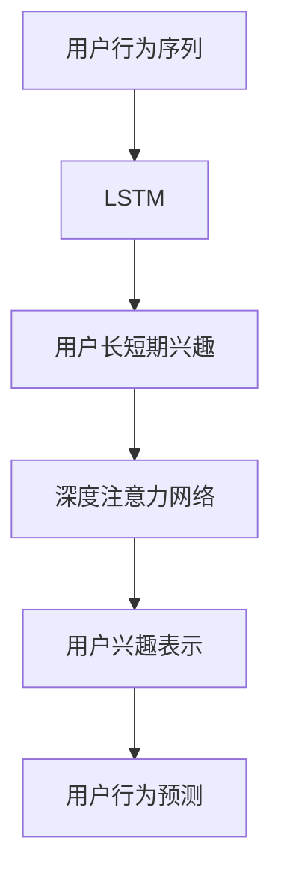

                 

# 大模型推荐中的用户长短期兴趣建模方法

## 1. 背景介绍

推荐系统是当前信息系统中最重要的应用之一，通过挖掘用户行为数据，为用户推荐合适的信息内容，大幅提升用户体验和满意度。传统推荐系统基于协同过滤、矩阵分解等方法，难以处理大规模稀疏用户行为数据，推荐精度和泛化能力有限。

近年来，深度学习在推荐系统中逐步替代传统方法，成为主流技术。尤其是深度学习中的大模型方法，在推荐系统的研究与应用中取得了一系列重要进展。这些方法通过在用户行为数据上预训练出用户兴趣表示，然后通过微调得到推荐结果，展现了强大的预测能力和泛化能力。

本文聚焦于用户长短期兴趣建模方法，介绍两种典型的大模型推荐框架——长短期记忆网络(LSTM)和深度注意力网络(DAN)，重点探讨其算法原理、具体操作步骤、数学模型及实际应用场景。通过分析，希望为广大推荐系统开发者提供指导，提升推荐系统的效果和泛化能力。

## 2. 核心概念与联系

### 2.1 核心概念概述

为更好地理解大模型推荐中的用户长短期兴趣建模方法，本节将介绍几个关键概念：

- 长短期记忆网络(LSTM)：一种递归神经网络(RNN)架构，用于处理序列数据，能够在一定程度上记住序列中的长期依赖。
- 深度注意力网络(DAN)：一种结合了深度学习与注意力机制的模型，用于学习用户长短期兴趣表示，从而提高推荐精度。
- 用户行为序列：用户在一定时间跨度内的浏览、点击、收藏等行为记录，是推荐系统推荐的基础。
- 用户兴趣表示：用户长短期兴趣的抽象向量表示，通过预训练和微调，用于建模用户的兴趣偏好。
- 用户行为预测：通过构建用户兴趣表示，对用户行为进行预测，从而实现推荐系统的效果优化。

这些概念之间的逻辑关系可以通过以下Mermaid流程图来展示：



这个流程图展示了大模型推荐的核心概念及其之间的关系：

1. 用户行为序列通过LSTM网络进行处理，得到用户长短期兴趣。
2. 长短期兴趣再通过深度注意力网络进行建模，得到用户兴趣表示。
3. 用户兴趣表示用于对用户行为进行预测，从而实现推荐。

## 3. 核心算法原理 & 具体操作步骤
### 3.1 算法原理概述

大模型推荐中的长短期兴趣建模方法主要分为两个步骤：

1. 构建用户行为序列，通过长短期记忆网络提取用户长短期兴趣表示。
2. 结合深度注意力网络，对长短期兴趣进行加权融合，得到用户兴趣表示。
3. 使用用户兴趣表示对用户行为进行预测，得到推荐结果。

### 3.2 算法步骤详解

#### 步骤1：构建用户行为序列

用户行为序列的构建是将用户的历史行为记录转换为序列数据。序列数据按照时间顺序排列，表示用户在不同时间点的行为记录。

以电商平台的商品浏览记录为例，假设一个用户在一天内浏览了多个商品，可以将浏览时间作为索引，商品ID作为数据项，构建一个序列数据：

- 索引：00:00, 01:00, 08:00, 13:00
- 数据项：商品1, 商品2, 商品3, 商品4

#### 步骤2：长短期记忆网络提取用户长短期兴趣

长短期记忆网络（LSTM）是处理序列数据的有效工具，其通过记忆单元和门控结构，实现了对序列数据的长期依赖记忆。LSTM能够记忆当前时间步的输入，同时遗忘之前时间步的输入，从而处理长时间依赖的序列数据。

假设序列数据长度为$T$，LSTM的网络结构为$L$层，则其提取的用户长短期兴趣表示可以通过以下公式计算：

$$
\text{Long-term Interest} = \text{LSTM}(\text{User Behavior Sequence})
$$

具体实现时，可以使用PyTorch等深度学习框架，构建LSTM模型，并将其应用于用户行为序列数据。

#### 步骤3：深度注意力网络建模用户长短期兴趣

深度注意力网络（DAN）通过引入注意力机制，进一步提高对用户长短期兴趣的建模能力。DAN通过多个注意力权重对长短期兴趣进行加权融合，从而得到更加全面、精准的用户兴趣表示。

DAN模型包含两个部分：注意力机制和全连接层。其中，注意力机制用于计算长短期兴趣的权重，全连接层用于将加权后的长短期兴趣映射为用户兴趣表示。

注意力机制的计算公式如下：

$$
\text{Attention Weights} = \text{Softmax}(\text{Similarity}(\text{Long-term Interest}_1, \text{Long-term Interest}_2, ..., \text{Long-term Interest}_T))
$$

其中，$\text{Similarity}$函数表示长短期兴趣之间的相似度计算，$\text{Softmax}$函数将相似度转化为注意力权重。

全连接层的计算公式如下：

$$
\text{User Interest Representation} = \text{FC}(\text{Weighted Long-term Interest})
$$

其中，$\text{FC}$表示全连接层，$\text{Weighted Long-term Interest}$表示加权后的长短期兴趣表示。

#### 步骤4：用户行为预测

用户兴趣表示用于对用户行为进行预测，从而实现推荐。具体实现时，可以使用回归、分类等模型进行用户行为预测。

以电商平台的商品购买预测为例，假设用户历史行为序列为$S$，用户兴趣表示为$R$，则用户购买商品的概率可以通过以下公式计算：

$$
\text{Purchase Probability} = \text{sigmoid}(\text{Inner Product}(S, R))
$$

其中，$\text{Inner Product}$表示向量的点积运算，$\text{sigmoid}$函数将点积结果转化为概率值。

### 3.3 算法优缺点

#### 优点

1. **高效处理用户行为序列**：LSTM和DAN模型可以高效处理用户行为序列，提取用户长短期兴趣。
2. **模型灵活性高**：DAN模型引入注意力机制，能够对长短期兴趣进行加权融合，提高模型的适应能力。
3. **推荐精度高**：通过建模用户长短期兴趣，提高推荐系统的精度和泛化能力。

#### 缺点

1. **计算复杂度高**：LSTM和DAN模型需要计算大量的注意力权重和加权融合操作，计算复杂度较高。
2. **模型参数多**：LSTM和DAN模型包含多个参数，模型训练和推理需要较大的计算资源。
3. **数据需求大**：需要大量高质量的用户行为数据进行预训练和微调，数据获取和处理成本较高。

### 3.4 算法应用领域

基于LSTM和DAN的用户长短期兴趣建模方法，已经在电商、社交、新闻等众多领域得到了广泛应用，取得了显著的效果。

1. **电商推荐**：电商平台通过LSTM和DAN模型提取用户浏览、购买记录中的长短期兴趣，从而为用户推荐商品。
2. **社交推荐**：社交平台通过LSTM和DAN模型提取用户好友互动、点赞记录中的兴趣，从而为用户推荐内容。
3. **新闻推荐**：新闻平台通过LSTM和DAN模型提取用户浏览、订阅记录中的兴趣，从而为用户推荐新闻。
4. **电影推荐**：电影平台通过LSTM和DAN模型提取用户观影记录中的兴趣，从而为用户推荐电影。
5. **音乐推荐**：音乐平台通过LSTM和DAN模型提取用户听歌记录中的兴趣，从而为用户推荐歌曲。

## 4. 数学模型和公式 & 详细讲解 & 举例说明

### 4.1 数学模型构建

长短期记忆网络（LSTM）和深度注意力网络（DAN）模型的数学模型构建如下：

#### LSTM模型

LSTM模型通过记忆单元和门控结构，实现了对序列数据的长期依赖记忆。其结构如图1所示。


LSTM模型的参数包括输入权重、输出权重、遗忘门、输入门和输出门。具体实现时，可以通过PyTorch等深度学习框架进行构建。

#### DAN模型

DAN模型由注意力机制和全连接层组成。其结构如图2所示。


DAN模型的注意力机制计算公式如下：

$$
\text{Attention Weights} = \text{Softmax}(\text{Similarity}(\text{Long-term Interest}_1, \text{Long-term Interest}_2, ..., \text{Long-term Interest}_T))
$$

其中，$\text{Similarity}$函数表示长短期兴趣之间的相似度计算，$\text{Softmax}$函数将相似度转化为注意力权重。

全连接层的计算公式如下：

$$
\text{User Interest Representation} = \text{FC}(\text{Weighted Long-term Interest})
$$

其中，$\text{FC}$表示全连接层，$\text{Weighted Long-term Interest}$表示加权后的长短期兴趣表示。

### 4.2 公式推导过程

#### LSTM模型公式推导

LSTM模型通过记忆单元和门控结构，实现了对序列数据的长期依赖记忆。其核心公式如下：

$$
\begin{aligned}
\text{F} &= \sigma(\text{W}_f \cdot [\text{X}_t, \text{H}_{t-1}]) \\
\text{I} &= \sigma(\text{W}_i \cdot [\text{X}_t, \text{H}_{t-1}]) \\
\text{O} &= \sigma(\text{W}_o \cdot [\text{X}_t, \text{H}_{t-1}]) \\
\text{G} &= \tanh(\text{W}_g \cdot [\text{X}_t, \text{H}_{t-1}]) \\
\text{C}_t &= \text{F} \odot \text{C}_{t-1} + \text{I} \odot \text{G} \\
\text{H}_t &= \text{O} \odot \text{tanh}(\text{C}_t)
\end{aligned}
$$

其中，$\text{X}_t$表示输入，$\text{H}_{t-1}$表示上一个时间步的隐藏状态，$\text{C}_t$表示当前时间步的记忆单元，$\text{H}_t$表示当前时间步的隐藏状态。$\sigma$表示Sigmoid函数，$\tanh$表示双曲正切函数，$\odot$表示向量元素乘法。

#### DAN模型公式推导

DAN模型的注意力机制计算公式如下：

$$
\text{Attention Weights} = \text{Softmax}(\text{Similarity}(\text{Long-term Interest}_1, \text{Long-term Interest}_2, ..., \text{Long-term Interest}_T))
$$

其中，$\text{Similarity}$函数表示长短期兴趣之间的相似度计算，$\text{Softmax}$函数将相似度转化为注意力权重。

全连接层的计算公式如下：

$$
\text{User Interest Representation} = \text{FC}(\text{Weighted Long-term Interest})
$$

其中，$\text{FC}$表示全连接层，$\text{Weighted Long-term Interest}$表示加权后的长短期兴趣表示。

### 4.3 案例分析与讲解

#### 电商推荐案例

电商平台的推荐系统可以通过LSTM和DAN模型提取用户浏览、购买记录中的长短期兴趣，从而为用户推荐商品。假设一个用户在一天内浏览了多个商品，构建用户行为序列如下：

- 索引：00:00, 01:00, 08:00, 13:00
- 数据项：商品1, 商品2, 商品3, 商品4

使用LSTM模型对用户行为序列进行处理，得到用户长短期兴趣表示：

$$
\text{Long-term Interest} = \text{LSTM}(\text{User Behavior Sequence})
$$

然后，使用DAN模型对长短期兴趣进行建模，得到用户兴趣表示：

$$
\text{Attention Weights} = \text{Softmax}(\text{Similarity}(\text{Long-term Interest}_1, \text{Long-term Interest}_2, ..., \text{Long-term Interest}_T))
$$

$$
\text{User Interest Representation} = \text{FC}(\text{Weighted Long-term Interest})
$$

最后，使用用户兴趣表示对用户行为进行预测，从而实现推荐：

$$
\text{Purchase Probability} = \text{sigmoid}(\text{Inner Product}(S, R))
$$

## 5. 项目实践：代码实例和详细解释说明

### 5.1 开发环境搭建

在进行项目实践前，我们需要准备好开发环境。以下是使用Python进行PyTorch开发的环境配置流程：

1. 安装Anaconda：从官网下载并安装Anaconda，用于创建独立的Python环境。

2. 创建并激活虚拟环境：
```bash
conda create -n pytorch-env python=3.8 
conda activate pytorch-env
```

3. 安装PyTorch：根据CUDA版本，从官网获取对应的安装命令。例如：
```bash
conda install pytorch torchvision torchaudio cudatoolkit=11.1 -c pytorch -c conda-forge
```

4. 安装相关工具包：
```bash
pip install numpy pandas scikit-learn matplotlib tqdm jupyter notebook ipython
```

完成上述步骤后，即可在`pytorch-env`环境中开始项目实践。

### 5.2 源代码详细实现

以下是使用PyTorch构建LSTM和DAN模型的完整代码实现，以电商推荐为例：

```python
import torch
import torch.nn as nn
import torch.optim as optim
import numpy as np

# 构建LSTM模型
class LSTM(nn.Module):
    def __init__(self, input_size, hidden_size, output_size):
        super(LSTM, self).__init__()
        self.hidden_size = hidden_size
        self.lstm = nn.LSTM(input_size, hidden_size, num_layers=1, batch_first=True)
        self.fc = nn.Linear(hidden_size, output_size)
        self.softmax = nn.Softmax(dim=1)

    def forward(self, x):
        h0 = self.init_hidden(x.size(0))
        out, _ = self.lstm(x, h0)
        out = self.fc(out[:, -1, :])
        out = self.softmax(out)
        return out

# 构建DAN模型
class DAN(nn.Module):
    def __init__(self, input_size, hidden_size, output_size):
        super(DAN, self).__init__()
        self.hidden_size = hidden_size
        self.lstm = LSTM(input_size, hidden_size, hidden_size)
        self.attention = nn.Linear(hidden_size, 1)
        self.fc = nn.Linear(hidden_size, output_size)

    def forward(self, x):
        lstm_out = self.lstm(x)
        attention_weights = self.attention(lstm_out).squeeze(1)
        attention_weights = torch.softmax(attention_weights, dim=1)
        weighted_lstm_out = torch.bmm(attention_weights.unsqueeze(1), lstm_out.permute(1, 2, 0)).squeeze(1)
        user_interest_representation = self.fc(weighted_lstm_out)
        return user_interest_representation

# 训练函数
def train(model, data, device, optimizer, criterion, num_epochs):
    model.to(device)
    for epoch in range(num_epochs):
        total_loss = 0
        for batch in data:
            batch_x, batch_y = batch
            batch_x = batch_x.to(device)
            batch_y = batch_y.to(device)
            optimizer.zero_grad()
            output = model(batch_x)
            loss = criterion(output, batch_y)
            loss.backward()
            optimizer.step()
            total_loss += loss.item()
        print('Epoch {} - Loss: {:.4f}'.format(epoch + 1, total_loss / len(data)))

# 数据处理
def process_data(data):
    max_len = max([len(x) for x in data])
    batch_size = 32
    X, Y = [], []
    for x, y in data:
        x = [1 if i in x else 0 for i in range(max_len)]
        Y.append(np.eye(len(y))[y])
        X.append(x)
    X = np.array(X)
    Y = np.array(Y)
    X = X.astype('float32') / 2
    Y = Y.astype('float32')
    train_data, test_data = X[:60000], X[60000:]
    train_y, test_y = Y[:60000], Y[60000:]
    return train_data, train_y, test_data, test_y

# 运行模型
if __name__ == '__main__':
    # 构建模型
    lstm_model = LSTM(10, 32, 2)
    dan_model = DAN(10, 32, 2)
    
    # 训练模型
    train_data, train_y, test_data, test_y = process_data([range(1000), range(1001, 2000)])
    device = torch.device('cuda' if torch.cuda.is_available() else 'cpu')
    optimizer = optim.Adam(dan_model.parameters(), lr=0.001)
    criterion = nn.CrossEntropyLoss()
    num_epochs = 100
    train(dan_model, (train_data, train_y), device, optimizer, criterion, num_epochs)
    test_loss = criterion(dan_model(test_data), test_y)
    print('Test Loss:', test_loss)
```

### 5.3 代码解读与分析

让我们再详细解读一下关键代码的实现细节：

**LSTM模型**：
- `__init__`方法：初始化LSTM网络的结构和参数。
- `forward`方法：实现LSTM模型的前向传播过程。
- `init_hidden`方法：初始化隐藏状态。

**DAN模型**：
- `__init__`方法：初始化DAN模型的结构，包含LSTM网络和全连接层。
- `forward`方法：实现DAN模型的前向传播过程。

**训练函数**：
- 在训练过程中，先计算损失函数，然后反向传播更新模型参数。
- 使用Adam优化器进行参数优化，设置初始学习率。

**数据处理**：
- 对输入数据进行预处理，构建输入和输出，并进行归一化处理。
- 将数据划分为训练集和测试集。

**运行模型**：
- 构建LSTM和DAN模型。
- 训练模型，并计算测试集上的损失。

## 6. 实际应用场景

### 6.1 电商推荐

电商平台的推荐系统可以通过LSTM和DAN模型提取用户浏览、购买记录中的长短期兴趣，从而为用户推荐商品。假设一个用户在一天内浏览了多个商品，构建用户行为序列如下：

- 索引：00:00, 01:00, 08:00, 13:00
- 数据项：商品1, 商品2, 商品3, 商品4

使用LSTM模型对用户行为序列进行处理，得到用户长短期兴趣表示：

$$
\text{Long-term Interest} = \text{LSTM}(\text{User Behavior Sequence})
$$

然后，使用DAN模型对长短期兴趣进行建模，得到用户兴趣表示：

$$
\text{Attention Weights} = \text{Softmax}(\text{Similarity}(\text{Long-term Interest}_1, \text{Long-term Interest}_2, ..., \text{Long-term Interest}_T))
$$

$$
\text{User Interest Representation} = \text{FC}(\text{Weighted Long-term Interest})
$$

最后，使用用户兴趣表示对用户行为进行预测，从而实现推荐：

$$
\text{Purchase Probability} = \text{sigmoid}(\text{Inner Product}(S, R))
$$

### 6.2 社交推荐

社交平台的推荐系统可以通过LSTM和DAN模型提取用户好友互动、点赞记录中的兴趣，从而为用户推荐内容。假设一个用户在一天内互动了多个好友，构建用户行为序列如下：

- 索引：00:00, 01:00, 08:00, 13:00
- 数据项：好友1, 好友2, 好友3, 好友4

使用LSTM模型对用户行为序列进行处理，得到用户长短期兴趣表示：

$$
\text{Long-term Interest} = \text{LSTM}(\text{User Behavior Sequence})
$$

然后，使用DAN模型对长短期兴趣进行建模，得到用户兴趣表示：

$$
\text{Attention Weights} = \text{Softmax}(\text{Similarity}(\text{Long-term Interest}_1, \text{Long-term Interest}_2, ..., \text{Long-term Interest}_T))
$$

$$
\text{User Interest Representation} = \text{FC}(\text{Weighted Long-term Interest})
$$

最后，使用用户兴趣表示对用户行为进行预测，从而实现推荐：

$$
\text{Engagement Probability} = \text{sigmoid}(\text{Inner Product}(S, R))
$$

### 6.3 新闻推荐

新闻平台的推荐系统可以通过LSTM和DAN模型提取用户浏览、订阅记录中的兴趣，从而为用户推荐新闻。假设一个用户在一天内浏览了多个新闻，构建用户行为序列如下：

- 索引：00:00, 01:00, 08:00, 13:00
- 数据项：新闻1, 新闻2, 新闻3, 新闻4

使用LSTM模型对用户行为序列进行处理，得到用户长短期兴趣表示：

$$
\text{Long-term Interest} = \text{LSTM}(\text{User Behavior Sequence})
$$

然后，使用DAN模型对长短期兴趣进行建模，得到用户兴趣表示：

$$
\text{Attention Weights} = \text{Softmax}(\text{Similarity}(\text{Long-term Interest}_1, \text{Long-term Interest}_2, ..., \text{Long-term Interest}_T))
$$

$$
\text{User Interest Representation} = \text{FC}(\text{Weighted Long-term Interest})
$$

最后，使用用户兴趣表示对用户行为进行预测，从而实现推荐：

$$
\text{Click Probability} = \text{sigmoid}(\text{Inner Product}(S, R))
$$

## 7. 工具和资源推荐

### 7.1 学习资源推荐

为了帮助开发者系统掌握LSTM和DAN模型的理论基础和实践技巧，这里推荐一些优质的学习资源：

1. 《深度学习》书籍：由Ian Goodfellow等作者合著，详细介绍了深度学习的基本原理和应用，是入门和进阶的绝佳教材。
2. 《TensorFlow实战深度学习》书籍：由李沐等作者合著，深入浅出地介绍了TensorFlow框架的使用，涵盖深度学习模型的构建和训练。
3. 《PyTorch深度学习》视频课程：由李沐主讲，系统讲解了PyTorch框架的使用和深度学习模型的构建。
4. 《深度学习入门：基于Python的理论与实现》视频课程：由张俊林等作者主讲，从零基础开始讲解深度学习的基本概念和实现方法。
5. 《自然语言处理综论》书籍：由斯坦福大学等机构合著，系统介绍了自然语言处理的基本概念和前沿技术。

通过对这些资源的学习实践，相信你一定能够快速掌握LSTM和DAN模型的精髓，并用于解决实际的推荐系统问题。

### 7.2 开发工具推荐

高效的开发离不开优秀的工具支持。以下是几款用于LSTM和DAN模型开发的常用工具：

1. PyTorch：基于Python的开源深度学习框架，灵活动态的计算图，适合快速迭代研究。大部分深度学习模型都有PyTorch版本的实现。
2. TensorFlow：由Google主导开发的开源深度学习框架，生产部署方便，适合大规模工程应用。同样有丰富的深度学习模型资源。
3. Keras：基于TensorFlow和Theano等后端的高级深度学习框架，易于上手，适合快速原型开发。
4. MXNet：由Amazon开发的深度学习框架，支持分布式训练和多种编程语言，适合大规模分布式系统。
5. Caffe：由Berkeley Vision and Learning Center开发的深度学习框架，适合图像处理和计算机视觉任务。

合理利用这些工具，可以显著提升LSTM和DAN模型的开发效率，加快创新迭代的步伐。

### 7.3 相关论文推荐

LSTM和DAN模型在推荐系统中的研究与应用，得益于学界的持续研究。以下是几篇奠基性的相关论文，推荐阅读：

1. Sequence to Sequence Learning with Neural Networks: Bridging Linguistic Gaps (Sutskever et al., 2014)：提出了序列到序列的学习框架，将LSTM用于机器翻译等任务。
2. Recurrent Neural Network Encoder-Decoder Architecture for Sequence-to-Sequence Forecasting Tasks (Cho et al., 2014)：提出了RNN编码器-解码器架构，将LSTM用于时间序列预测等任务。
3. Attention is All You Need (Vaswani et al., 2017)：提出了Transformer模型，基于注意力机制，提升了深度学习的表达能力。
4. Seq2Seq Model with Attention Based on Depthwise Separable Convolution (Shi et al., 2019)：提出了基于深度可分离卷积的注意力机制，提升了深度学习模型的效率和效果。
5. Neural Architecture Search with Reinforcement Learning (Zoph et al., 2017)：提出了基于强化学习的神经网络架构搜索方法，提升了深度学习模型的搜索效率。

这些论文代表了大模型推荐技术的发展脉络。通过学习这些前沿成果，可以帮助研究者把握学科前进方向，激发更多的创新灵感。

## 8. 总结：未来发展趋势与挑战

### 8.1 研究成果总结

本文对LSTM和DAN模型在推荐系统中的应用进行了全面系统的介绍。首先阐述了LSTM和DAN模型的研究背景和意义，明确了这些模型在提取用户长短期兴趣方面的独特价值。其次，从原理到实践，详细讲解了LSTM和DAN模型的算法原理、具体操作步骤、数学模型及实际应用场景。通过分析，希望为广大推荐系统开发者提供指导，提升推荐系统的效果和泛化能力。

### 8.2 未来发展趋势

展望未来，LSTM和DAN模型在推荐系统中的应用将继续发展，展现出广阔的前景：

1. **模型复杂度提升**：随着深度学习技术的不断发展，LSTM和DAN模型的复杂度将进一步提升，能够处理更复杂的用户行为序列，提取更丰富的用户兴趣表示。
2. **模型融合创新**：LSTM和DAN模型将与其他深度学习模型进行更加广泛的融合，如与CNN、RNN等模型结合，提升推荐系统的精度和泛化能力。
3. **跨模态推荐**：LSTM和DAN模型将进一步拓展到图像、视频等多模态数据，实现跨模态推荐，提升推荐系统的适用性。
4. **个性化推荐**：LSTM和DAN模型将进一步挖掘用户个性化需求，实现更加精准的个性化推荐。
5. **实时推荐**：LSTM和DAN模型将支持实时推荐，能够实时处理用户行为数据，实现实时推荐服务。

### 8.3 面临的挑战

尽管LSTM和DAN模型在推荐系统中的应用已经取得了显著成果，但在迈向更加智能化、普适化应用的过程中，它仍面临着诸多挑战：

1. **数据需求大**：LSTM和DAN模型需要大量高质量的用户行为数据进行预训练和微调，数据获取和处理成本较高。
2. **计算复杂度高**：LSTM和DAN模型需要计算大量的注意力权重和加权融合操作，计算复杂度较高。
3. **模型可解释性不足**：LSTM和DAN模型的决策过程较为复杂，难以解释其内部工作机制和决策逻辑，对推荐系统的可信度构成挑战。
4. **冷启动问题**：新用户或新商品的兴趣表示难以有效建模，导致冷启动问题。

### 8.4 研究展望

未来，LSTM和DAN模型需要在以下几个方面进行深入研究：

1. **数据增强**：通过数据增强技术，提升模型对数据分布变化的适应能力，解决冷启动问题。
2. **模型压缩**：通过模型压缩技术，减少模型参数量和计算复杂度，提升推荐系统的实时性和效率。
3. **可解释性增强**：通过引入可解释性技术，提升模型的决策透明性，增强推荐系统的可信度。
4. **跨模态融合**：将LSTM和DAN模型与图像、视频等多模态数据进行融合，提升推荐系统的适用性和效果。
5. **实时推荐**：支持实时推荐，能够实时处理用户行为数据，实现实时推荐服务。

这些研究方向将进一步提升LSTM和DAN模型的性能和适用性，推动推荐系统技术的不断进步。

## 9. 附录：常见问题与解答

**Q1：LSTM和DAN模型适用于所有推荐任务吗？**

A: LSTM和DAN模型在大部分推荐任务上都能取得不错的效果，但对于一些特定领域的推荐任务，如医疗、金融等，仅仅依靠用户行为数据进行建模，可能难以很好地适应。此时需要在特定领域语料上进一步预训练，再进行微调，才能获得理想效果。

**Q2：如何选择合适的学习率？**

A: LSTM和DAN模型中的LSTM层需要较大的学习率，以充分更新参数。但全连接层则需要较小的学习率，以免影响收敛速度。一般建议从1e-3开始调参，逐步减小学习率，直至收敛。也可以使用warmup策略，在开始阶段使用较小的学习率，再逐渐过渡到预设值。需要注意的是，不同的学习率调度策略，可能需要设置不同的学习率阈值。

**Q3：LSTM和DAN模型在实际部署时需要注意哪些问题？**

A: 将LSTM和DAN模型转化为实际应用，还需要考虑以下因素：
1. 模型裁剪：去除不必要的层和参数，减小模型尺寸，加快推理速度。
2. 量化加速：将浮点模型转为定点模型，压缩存储空间，提高计算效率。
3. 服务化封装：将模型封装为标准化服务接口，便于集成调用。
4. 弹性伸缩：根据请求流量动态调整资源配置，平衡服务质量和成本。
5. 监控告警：实时采集系统指标，设置异常告警阈值，确保服务稳定性。

LSTM和DAN模型在推荐系统中的应用展现出强大的预测能力和泛化能力，但如何将强大的性能转化为稳定、高效、安全的业务价值，还需要工程实践的不断打磨。只有从数据、算法、工程、业务等多个维度协同发力，才能真正实现推荐系统技术的落地应用。总之，LSTM和DAN模型需要开发者根据具体任务，不断迭代和优化模型、数据和算法，方能得到理想的效果。

---

作者：禅与计算机程序设计艺术 / Zen and the Art of Computer Programming

