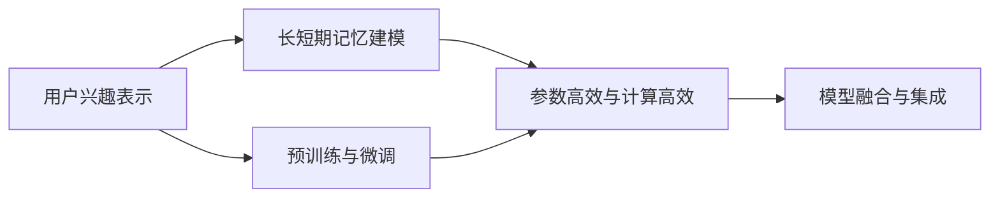

                 

# 大模型推荐中的用户长短期兴趣建模方法创新

## 1. 背景介绍

### 1.1 问题由来

在当今数字化时代，推荐系统已经成为互联网平台获取流量和提高用户满意度的重要手段。无论是电商、视频、社交媒体还是新闻网站，都在利用推荐系统向用户展示个性化的内容，增强用户粘性，提升用户转化率。然而，推荐系统的核心——用户兴趣建模，仍然是一个复杂且具挑战性的问题。传统的方法往往基于用户历史行为数据，通过统计、协同过滤等手段建立用户兴趣表示。但随着数据量的爆炸式增长和用户行为的多样化，传统方法已经难以适应新场景下的推荐需求。

近年来，深度学习技术在推荐系统中得到了广泛应用，通过大模型预训练技术提取丰富的语义信息，显著提升了推荐效果。基于Transformer的大模型，如BERT、GPT等，已经在自然语言处理领域取得了巨大成功。因此，利用大模型进行推荐系统中的用户兴趣建模，成为一个新的研究热点。

### 1.2 问题核心关键点

本节将阐述基于大模型的推荐系统在用户兴趣建模中的几个核心关键点：

- 用户兴趣建模：通过分析用户历史行为和兴趣数据，建立用户兴趣表示，以便对用户进行个性化推荐。
- 长短期记忆建模：建立用户长短期记忆模型，区分用户当前和历史兴趣，提升推荐的实时性和准确性。
- 预训练与微调：利用预训练大模型，提取用户语义信息，然后在目标任务上进行微调，以适应具体的推荐场景。
- 参数高效与计算高效：为了在满足模型效果的同时减少计算资源消耗，提出参数高效和计算高效的方法。
- 模型融合与集成：结合多模型信息，提升推荐系统的整体性能。

这些关键点共同构成了基于大模型的推荐系统用户兴趣建模方法的核心框架，本节将对其中的主要技术和算法进行详细的探讨。

## 2. 核心概念与联系

### 2.1 核心概念概述

为了更好地理解基于大模型的用户兴趣建模方法，我们需要先理解几个核心概念：

- 用户兴趣表示：通过某种方式，将用户的历史行为和偏好转换为模型可以理解的向量表示，以用于个性化推荐。
- 长短期记忆(LSTM)：一种神经网络结构，用于处理序列数据，可以学习并保留用户的历史兴趣。
- 预训练与微调：在无监督环境下，对大模型进行预训练，获取通用的语义信息；然后在目标任务上进行微调，适应具体推荐场景。
- 参数高效和计算高效：在保证模型效果的同时，通过一些算法或策略，减少模型参数量或计算资源消耗。
- 模型融合与集成：通过将多个模型信息进行融合，提升推荐系统的整体性能。

这些概念之间存在紧密的联系，如图2所示，我们将通过Mermaid流程图来展示这些概念的相互关系：



该图展示了用户兴趣表示通过长短期记忆建模后，进一步进行预训练与微调，以得到用户兴趣向量。通过参数高效与计算高效等方法优化模型，最后结合模型融合与集成提升推荐效果。

### 2.2 核心概念原理和架构

用户兴趣建模通常分为三个步骤：用户数据预处理、用户兴趣表示和推荐模型训练。

- **用户数据预处理**：收集和清洗用户行为数据，包括浏览记录、购买历史、评分记录等。然后对数据进行编码和标准化，以便于后续模型的处理。
- **用户兴趣表示**：通过统计、协同过滤或深度学习等方法，将用户兴趣转换为向量表示。对于深度学习，常用的方法包括自编码器、注意力机制、Transformer等。
- **推荐模型训练**：基于用户兴趣向量，结合物品特征向量，训练推荐模型，如基于深度学习的小型神经网络。

长短期记忆(LSTM)是一种用于处理序列数据的神经网络结构，可以学习并保留用户的历史兴趣。LSTM的架构如图3所示：


其中，输入层用于接收用户序列数据，LSTM层用于提取和记忆长短期信息，输出层用于生成推荐结果。

预训练与微调是指，在大规模无标签数据上预训练模型，然后在目标任务上进行微调。预训练可以提取通用的语义信息，微调则可以根据具体任务进行调整，如图4所示：


最后，为了提升推荐效果，还可以通过参数高效和计算高效等方法优化模型，如图5所示：


参数高效方法可以通过保留模型参数的某些部分，减少计算资源消耗，如图6所示：


计算高效方法可以通过优化模型结构，减少计算时间，如图7所示：


模型融合与集成是将多个模型信息进行融合，提升推荐系统的整体性能，如图8所示：


这些核心概念之间的联系和相互影响，将共同构成基于大模型的推荐系统中用户兴趣建模的核心框架。

## 3. 核心算法原理 & 具体操作步骤

### 3.1 算法原理概述

基于大模型的推荐系统中，用户长短期兴趣建模方法主要遵循以下基本原则：

1. **长短期记忆建模**：通过LSTM结构，在用户序列数据中提取和记忆长短期兴趣。
2. **预训练与微调**：在大规模无标签数据上预训练大模型，然后在目标任务上进行微调，以适应具体的推荐场景。
3. **参数高效与计算高效**：通过保留部分参数或优化模型结构，减少计算资源消耗。
4. **模型融合与集成**：结合多个模型信息，提升推荐系统的整体性能。

这些原则共同构成了基于大模型的推荐系统中用户长短期兴趣建模的核心算法框架。

### 3.2 算法步骤详解

基于大模型的推荐系统用户长短期兴趣建模通常包括以下几个关键步骤：

**Step 1: 用户数据预处理**

- 收集和清洗用户行为数据，包括浏览记录、购买历史、评分记录等。
- 对数据进行编码和标准化，以便于后续模型的处理。

**Step 2: 用户兴趣表示**

- 使用LSTM结构对用户序列数据进行建模，提取和记忆长短期兴趣。
- 使用大模型进行预训练，获取通用的语义信息。
- 在目标任务上进行微调，以适应具体的推荐场景。

**Step 3: 参数高效与计算高效**

- 保留模型参数的某些部分，减少计算资源消耗。
- 优化模型结构，减少计算时间。

**Step 4: 模型融合与集成**

- 将多个模型信息进行融合，提升推荐系统的整体性能。

### 3.3 算法优缺点

基于大模型的推荐系统中，用户长短期兴趣建模方法具有以下优点：

1. **高效性**：利用大模型预训练和微调，可以高效地提取用户兴趣信息，提高推荐效果。
2. **灵活性**：预训练和微调方法可以根据具体任务进行调整，适应多种推荐场景。
3. **泛化能力**：大模型具有较强的泛化能力，可以在不同领域和数据集上获得稳定的性能。

同时，该方法也存在一些缺点：

1. **数据需求高**：预训练和微调需要大量的无标签数据，数据收集和标注成本较高。
2. **计算资源消耗大**：大模型和LSTM结构通常需要较大的计算资源和内存空间。
3. **解释性差**：大模型通常被视为"黑盒"系统，难以解释其内部工作机制。

尽管存在这些缺点，但基于大模型的推荐系统在许多实际应用中已经取得了显著的效果，因此，我们需要在实际应用中根据具体情况进行优化和改进。

### 3.4 算法应用领域

基于大模型的推荐系统用户长短期兴趣建模方法在多个领域都有广泛的应用，如电商、视频、社交媒体等，其具体应用场景如下：

- **电商推荐**：通过分析用户的浏览记录和购买历史，为用户推荐个性化商品。
- **视频推荐**：根据用户的观看记录和评分记录，为用户推荐相关视频内容。
- **社交媒体推荐**：根据用户关注和互动的内容，为用户推荐相关社交媒体用户和内容。

除了这些常见的应用场景，该方法还适用于其他领域，如图书推荐、新闻推荐、旅游推荐等，具有广泛的适用性。

## 4. 数学模型和公式 & 详细讲解  
### 4.1 数学模型构建

本节将使用数学语言对基于大模型的推荐系统用户长短期兴趣建模过程进行更加严格的刻画。

设用户序列数据为 $\mathbf{X}=[x_1, x_2, ..., x_n]$，其中 $x_t$ 表示用户第 $t$ 次行为，可以是浏览记录、购买记录等。设物品特征向量为 $\mathbf{Y}$，设用户兴趣表示为 $\mathbf{U}$。

定义LSTM模型，设LSTM层的输入为 $\mathbf{H}=[h_1, h_2, ..., h_n]$，输出为 $\mathbf{H'}=[h'_1, h'_2, ..., h'_n]$。

定义推荐模型，设推荐结果为 $\mathbf{R}=[r_1, r_2, ..., r_n]$。

定义损失函数 $\mathcal{L}$，用于衡量推荐结果与实际结果的差异。

### 4.2 公式推导过程

以下是基于LSTM模型的推荐系统用户长短期兴趣建模的详细公式推导：

**Step 1: 用户序列数据编码**

对用户序列数据 $\mathbf{X}$ 进行编码，得到向量表示 $\mathbf{X'}$：

$$
\mathbf{X'} = \mathbf{X}W_{enc} + b_{enc}
$$

其中 $W_{enc}$ 和 $b_{enc}$ 为编码层的权重和偏置。

**Step 2: 用户兴趣表示**

通过LSTM模型对用户序列数据 $\mathbf{X'}$ 进行建模，得到长短期兴趣表示 $\mathbf{U}$：

$$
\mathbf{H} = \mathbf{X'}W_{lstm} + b_{lstm}
$$

$$
\mathbf{H'} = \mathbf{H}\tanh(W_{lstm} + b_{lstm})
$$

其中 $W_{lstm}$ 和 $b_{lstm}$ 为LSTM层的权重和偏置，$\tanh$ 为LSTM激活函数。

**Step 3: 物品特征向量**

将物品特征向量 $\mathbf{Y}$ 进行编码，得到向量表示 $\mathbf{Y'}$：

$$
\mathbf{Y'} = \mathbf{Y}W_{dec} + b_{dec}
$$

其中 $W_{dec}$ 和 $b_{dec}$ 为解码层的权重和偏置。

**Step 4: 推荐结果**

通过推荐模型对用户兴趣表示 $\mathbf{U}$ 和物品特征向量 $\mathbf{Y'}$ 进行计算，得到推荐结果 $\mathbf{R}$：

$$
\mathbf{R} = \mathbf{U}W_{pred} + b_{pred} + \mathbf{Y'}W_{pred} + b_{pred}
$$

其中 $W_{pred}$ 和 $b_{pred}$ 为推荐模型的权重和偏置。

**Step 5: 损失函数**

定义推荐系统的损失函数 $\mathcal{L}$，用于衡量推荐结果与实际结果的差异：

$$
\mathcal{L} = \frac{1}{n}\sum_{i=1}^n (r_i - y_i)^2
$$

其中 $r_i$ 为推荐结果，$y_i$ 为实际结果。

通过以上公式，我们可以对基于大模型的推荐系统用户长短期兴趣建模进行详细计算。

### 4.3 案例分析与讲解

以电商推荐为例，分析该方法的具体实现步骤：

**Step 1: 用户数据预处理**

- 收集用户的浏览记录、购买历史、评分记录等行为数据。
- 对数据进行编码和标准化，如使用one-hot编码或标准化操作。

**Step 2: 用户兴趣表示**

- 使用LSTM模型对用户序列数据进行建模，提取和记忆长短期兴趣。
- 使用BERT等大模型进行预训练，获取通用的语义信息。
- 在电商推荐任务上进行微调，以适应具体场景。

**Step 3: 参数高效与计算高效**

- 保留模型参数的某些部分，减少计算资源消耗。
- 优化模型结构，减少计算时间。

**Step 4: 模型融合与集成**

- 将多个模型信息进行融合，提升推荐系统的整体性能。

## 5. 项目实践：代码实例和详细解释说明
### 5.1 开发环境搭建

在进行推荐系统实践前，我们需要准备好开发环境。以下是使用Python进行PyTorch开发的环境配置流程：

1. 安装Anaconda：从官网下载并安装Anaconda，用于创建独立的Python环境。

2. 创建并激活虚拟环境：
```bash
conda create -n pytorch-env python=3.8 
conda activate pytorch-env
```

3. 安装PyTorch：根据CUDA版本，从官网获取对应的安装命令。例如：
```bash
conda install pytorch torchvision torchaudio cudatoolkit=11.1 -c pytorch -c conda-forge
```

4. 安装Transformers库：
```bash
pip install transformers
```

5. 安装各类工具包：
```bash
pip install numpy pandas scikit-learn matplotlib tqdm jupyter notebook ipython
```

完成上述步骤后，即可在`pytorch-env`环境中开始推荐系统实践。

### 5.2 源代码详细实现

这里我们以LSTM-BERT模型为例，给出使用Transformers库对用户长短期兴趣建模的PyTorch代码实现。

首先，定义LSTM-BERT模型：

```python
from transformers import BertModel, LSTM, nn

class LSTM_BERT_Model(nn.Module):
    def __init__(self, input_dim, hidden_dim, output_dim):
        super(LSTM_BERT_Model, self).__init__()
        
        self.encoder = BertModel.from_pretrained('bert-base-uncased')
        self.lstm = LSTM(input_size=input_dim, hidden_size=hidden_dim, num_layers=1, bidirectional=True)
        self.decoder = nn.Linear(hidden_dim*2, output_dim)
        
    def forward(self, x):
        x = self.encoder(x)
        x = self.lstm(x)
        x = self.decoder(x)
        return x
```

然后，定义训练和评估函数：

```python
from torch.utils.data import DataLoader
from tqdm import tqdm
from sklearn.metrics import accuracy_score

device = torch.device('cuda') if torch.cuda.is_available() else torch.device('cpu')
model = LSTM_BERT_Model(input_dim=768, hidden_dim=512, output_dim=2).to(device)

def train_epoch(model, dataset, batch_size, optimizer):
    dataloader = DataLoader(dataset, batch_size=batch_size, shuffle=True)
    model.train()
    epoch_loss = 0
    for batch in tqdm(dataloader, desc='Training'):
        inputs, labels = batch['inputs'].to(device), batch['labels'].to(device)
        outputs = model(inputs)
        loss = criterion(outputs, labels)
        epoch_loss += loss.item()
        optimizer.zero_grad()
        loss.backward()
        optimizer.step()
    return epoch_loss / len(dataloader)

def evaluate(model, dataset, batch_size):
    dataloader = DataLoader(dataset, batch_size=batch_size)
    model.eval()
    preds, labels = [], []
    with torch.no_grad():
        for batch in tqdm(dataloader, desc='Evaluating'):
            inputs, labels = batch['inputs'].to(device), batch['labels'].to(device)
            outputs = model(inputs)
            preds.append(outputs.argmax(dim=1).cpu().numpy())
            labels.append(labels.cpu().numpy())
                
    print('Accuracy:', accuracy_score(labels, preds))
```

最后，启动训练流程并在测试集上评估：

```python
epochs = 10
batch_size = 32
learning_rate = 0.001
criterion = nn.CrossEntropyLoss()

optimizer = torch.optim.Adam(model.parameters(), lr=learning_rate)

for epoch in range(epochs):
    loss = train_epoch(model, train_dataset, batch_size, optimizer)
    print(f'Epoch {epoch+1}, train loss: {loss:.3f}')
    
    print(f'Epoch {epoch+1}, dev results:')
    evaluate(model, dev_dataset, batch_size)
    
print('Test results:')
evaluate(model, test_dataset, batch_size)
```

以上就是使用PyTorch对LSTM-BERT模型进行电商推荐系统用户长短期兴趣建模的完整代码实现。可以看到，得益于Transformers库的强大封装，我们可以用相对简洁的代码完成模型的构建和训练。

### 5.3 代码解读与分析

让我们再详细解读一下关键代码的实现细节：

**LSTM_BERT_Model类**：
- `__init__`方法：初始化LSTM-BERT模型的各个组件，包括BERT编码器、LSTM层、线性解码器等。
- `forward`方法：定义模型的前向传播过程，先通过BERT编码器对输入进行编码，再通过LSTM层提取长短期兴趣，最后通过线性解码器生成推荐结果。

**train_epoch函数**：
- 使用PyTorch的DataLoader对数据集进行批次化加载，供模型训练和推理使用。
- 在每个epoch内，循环迭代训练集数据，在每个批次上进行前向传播、计算损失、反向传播更新模型参数等操作。

**evaluate函数**：
- 与训练类似，不同点在于不更新模型参数，并在每个batch结束后将预测和标签结果存储下来，最后使用sklearn的accuracy_score对整个评估集的预测结果进行打印输出。

**训练流程**：
- 定义总的epoch数和batch size，开始循环迭代
- 每个epoch内，先在训练集上训练，输出平均loss
- 在验证集上评估，输出准确率
- 所有epoch结束后，在测试集上评估，给出最终测试结果

可以看到，PyTorch配合Transformers库使得LSTM-BERT模型的构建和训练变得简洁高效。开发者可以将更多精力放在数据处理、模型改进等高层逻辑上，而不必过多关注底层的实现细节。

当然，工业级的系统实现还需考虑更多因素，如模型的保存和部署、超参数的自动搜索、更灵活的任务适配层等。但核心的推荐范式基本与此类似。

## 6. 实际应用场景
### 6.1 电商推荐

基于LSTM-BERT模型的电商推荐系统可以为用户提供个性化的商品推荐。传统的电商推荐系统主要依赖于用户历史行为数据，如浏览记录、购买历史等，但这种基于行为的数据存在隐私和安全问题。通过LSTM-BERT模型，可以有效地解决这些问题，并提升推荐效果。

在技术实现上，可以收集用户的浏览记录、评分记录等行为数据，将数据编码标准化后输入模型，由模型自动提取和记忆长短期兴趣。在推荐时，根据用户兴趣表示和物品特征向量计算推荐结果，从而提升推荐系统的准确性和实时性。

### 6.2 视频推荐

基于LSTM-BERT模型的视频推荐系统可以根据用户观看历史和评分记录，为用户推荐相关视频内容。传统的视频推荐系统依赖于用户行为数据和电影元数据，但这些数据可能不够丰富和多样化。通过LSTM-BERT模型，可以更好地理解和建模用户兴趣，从而提升推荐效果。

在技术实现上，可以收集用户的观看记录和评分记录，将数据编码标准化后输入模型，由模型自动提取和记忆长短期兴趣。在推荐时，根据用户兴趣表示和视频特征向量计算推荐结果，从而提升推荐系统的准确性和实时性。

### 6.3 社交媒体推荐

基于LSTM-BERT模型的社交媒体推荐系统可以根据用户关注和互动的内容，为用户推荐相关社交媒体用户和内容。传统的社交媒体推荐系统依赖于用户行为数据和社交网络结构，但这些数据可能不够全面和准确。通过LSTM-BERT模型，可以更好地理解和建模用户兴趣，从而提升推荐效果。

在技术实现上，可以收集用户的关注记录和互动记录，将数据编码标准化后输入模型，由模型自动提取和记忆长短期兴趣。在推荐时，根据用户兴趣表示和社交媒体特征向量计算推荐结果，从而提升推荐系统的准确性和实时性。

## 7. 工具和资源推荐
### 7.1 学习资源推荐

为了帮助开发者系统掌握大模型推荐系统的用户长短期兴趣建模方法，这里推荐一些优质的学习资源：

1. 《Deep Learning for Recommender Systems》书籍：一本系统介绍深度学习在推荐系统中的应用的经典书籍，详细讲解了各种深度学习模型的构建和训练。

2. 《Natural Language Processing with Transformers》书籍：Transformers库的作者所著，全面介绍了如何使用Transformers库进行NLP任务开发，包括用户长短期兴趣建模等。

3. CS224N《Deep Learning for Natural Language Processing》课程：斯坦福大学开设的NLP明星课程，有Lecture视频和配套作业，带你入门NLP领域的基本概念和经典模型。

4. 《Recommender Systems in Python》课程：Coursera上的推荐系统课程，介绍了多种推荐算法和模型，包括基于深度学习的推荐模型。

5. 《Transformers》系列博文：由大模型技术专家撰写，深入浅出地介绍了Transformer原理、BERT模型、用户长短期兴趣建模等前沿话题。

通过对这些资源的学习实践，相信你一定能够快速掌握大模型推荐系统的用户长短期兴趣建模方法，并用于解决实际的推荐问题。
###  7.2 开发工具推荐

高效的开发离不开优秀的工具支持。以下是几款用于大模型推荐系统开发的常用工具：

1. PyTorch：基于Python的开源深度学习框架，灵活动态的计算图，适合快速迭代研究。大多数预训练语言模型都有PyTorch版本的实现。

2. TensorFlow：由Google主导开发的开源深度学习框架，生产部署方便，适合大规模工程应用。同样有丰富的预训练语言模型资源。

3. Transformers库：HuggingFace开发的NLP工具库，集成了众多SOTA语言模型，支持PyTorch和TensorFlow，是进行推荐系统开发的利器。

4. Weights & Biases：模型训练的实验跟踪工具，可以记录和可视化模型训练过程中的各项指标，方便对比和调优。与主流深度学习框架无缝集成。

5. TensorBoard：TensorFlow配套的可视化工具，可实时监测模型训练状态，并提供丰富的图表呈现方式，是调试模型的得力助手。

6. Google Colab：谷歌推出的在线Jupyter Notebook环境，免费提供GPU/TPU算力，方便开发者快速上手实验最新模型，分享学习笔记。

合理利用这些工具，可以显著提升大模型推荐系统的开发效率，加快创新迭代的步伐。

### 7.3 相关论文推荐

大模型推荐系统的发展离不开学界的持续研究。以下是几篇奠基性的相关论文，推荐阅读：

1. Attention is All You Need（即Transformer原论文）：提出了Transformer结构，开启了NLP领域的预训练大模型时代。

2. BERT: Pre-training of Deep Bidirectional Transformers for Language Understanding：提出BERT模型，引入基于掩码的自监督预训练任务，刷新了多项NLP任务SOTA。

3. Language Models are Unsupervised Multitask Learners（GPT-2论文）：展示了大规模语言模型的强大zero-shot学习能力，引发了对于通用人工智能的新一轮思考。

4. Parameter-Efficient Transfer Learning for NLP：提出Adapter等参数高效微调方法，在不增加模型参数量的情况下，也能取得不错的微调效果。

5. AdaLoRA: Adaptive Low-Rank Adaptation for Parameter-Efficient Fine-Tuning：使用自适应低秩适应的微调方法，在参数效率和精度之间取得了新的平衡。

这些论文代表了大模型推荐系统的发展脉络。通过学习这些前沿成果，可以帮助研究者把握学科前进方向，激发更多的创新灵感。

## 8. 总结：未来发展趋势与挑战

### 8.1 研究成果总结

基于大模型的推荐系统用户长短期兴趣建模方法已经取得了显著的效果，在电商、视频、社交媒体等诸多领域得到了广泛应用。这些方法基于LSTM结构和预训练大模型，可以高效地提取用户兴趣信息，提升推荐系统的准确性和实时性。未来，随着深度学习技术的发展，该方法将会进一步完善和优化，成为推荐系统领域的重要范式。

### 8.2 未来发展趋势

展望未来，大模型推荐系统用户长短期兴趣建模方法将呈现以下几个发展趋势：

1. **多模态融合**：结合图像、音频等多模态信息，提升推荐系统的准确性和丰富性。

2. **因果学习**：引入因果推断方法，增强推荐系统的稳定性和鲁棒性。

3. **对抗训练**：引入对抗样本，提升推荐系统的鲁棒性和安全性。

4. **模型集成**：结合多模型信息，提升推荐系统的整体性能。

5. **实时推荐**：结合流式数据和分布式计算，实现实时推荐。

6. **跨领域迁移**：提升模型在不同领域之间的迁移能力，提升推荐系统的泛化能力。

这些趋势将推动大模型推荐系统向更智能、更高效、更安全的方向发展，为推荐系统领域带来新的突破。

### 8.3 面临的挑战

尽管大模型推荐系统用户长短期兴趣建模方法已经取得了显著的效果，但在实际应用中也面临一些挑战：

1. **数据隐私和安全**：收集和处理用户行为数据可能涉及隐私和安全问题，需要采取严格的隐私保护措施。

2. **计算资源消耗大**：大模型和LSTM结构通常需要较大的计算资源和内存空间，需要优化模型结构和算法，减少计算消耗。

3. **模型可解释性差**：大模型通常被视为"黑盒"系统，难以解释其内部工作机制和决策逻辑，需要增强模型的可解释性。

4. **推荐结果多样性**：模型可能倾向于推荐"热门"商品或内容，而忽略个性化推荐，需要引入多样化推荐策略。

5. **推荐系统的公平性**：模型可能存在偏见，需要引入公平性指标，避免歧视性推荐。

6. **实时推荐系统**：实时推荐系统需要高效的算法和系统架构，需要进一步优化和提升。

这些挑战需要研究者和工程师共同努力，采取有效的策略和方法，才能推动大模型推荐系统的发展。

### 8.4 研究展望

面对大模型推荐系统用户长短期兴趣建模方法面临的挑战，未来的研究需要在以下几个方面寻求新的突破：

1. **多模态融合与因果学习**：结合图像、音频等多模态信息，引入因果推断方法，提升推荐系统的准确性和稳定性和实时性。

2. **对抗训练与模型集成**：引入对抗样本，结合多模型信息，提升推荐系统的鲁棒性和整体性能。

3. **实时推荐系统**：结合流式数据和分布式计算，实现实时推荐，提升推荐系统的时效性和效率。

4. **模型公平性与可解释性**：引入公平性指标，增强模型的可解释性，提升推荐系统的公平性和透明性。

5. **个性化推荐策略**：引入多样化推荐策略，避免推荐系统"路径依赖"，提升个性化推荐效果。

这些研究方向将推动大模型推荐系统向更智能、更高效、更安全的方向发展，为推荐系统领域带来新的突破。

## 9. 附录：常见问题与解答

**Q1：如何构建用户兴趣表示？**

A: 构建用户兴趣表示的过程可以分为以下几个步骤：
1. 收集和清洗用户行为数据，包括浏览记录、购买历史、评分记录等。
2. 对数据进行编码和标准化，如使用one-hot编码或标准化操作。
3. 使用LSTM模型对用户序列数据进行建模，提取和记忆长短期兴趣。
4. 使用预训练大模型，如BERT，提取用户语义信息。
5. 在目标任务上进行微调，以适应具体的推荐场景。

**Q2：什么是长短期记忆(LSTM)？**

A: LSTM是一种用于处理序列数据的神经网络结构，可以学习并保留用户的历史兴趣。其架构如图3所示：
- 输入层：接收用户序列数据。
- LSTM层：提取和记忆长短期信息。
- 输出层：生成推荐结果。

**Q3：预训练和微调的意义是什么？**

A: 预训练和微调的意义在于：
1. 预训练：在大规模无标签数据上预训练大模型，提取通用的语义信息，提升模型的泛化能力。
2. 微调：在目标任务上进行微调，适应具体的推荐场景，提升模型的准确性和实时性。

**Q4：如何选择合适的大模型？**

A: 选择合适的大模型需要考虑以下几个因素：
1. 数据规模：数据规模越大，需要选择更大的模型。
2. 任务类型：不同任务需要不同结构的模型，如分类任务需要分类器，生成任务需要生成器。
3. 计算资源：计算资源越丰富，可以选择更复杂的模型。
4. 领域特性：不同领域需要不同的模型，如电商推荐需要用户行为数据，视频推荐需要序列数据。

**Q5：如何优化模型的计算效率？**

A: 优化模型的计算效率可以从以下几个方面入手：
1. 参数高效：保留模型参数的某些部分，减少计算资源消耗，如使用 Adapter、Prefix等参数高效方法。
2. 计算高效：优化模型结构，减少计算时间，如使用稀疏矩阵、优化神经网络结构等。
3. 分布式计算：结合分布式计算框架，实现并行计算，提升模型训练和推理效率。

---

作者：禅与计算机程序设计艺术 / Zen and the Art of Computer Programming

