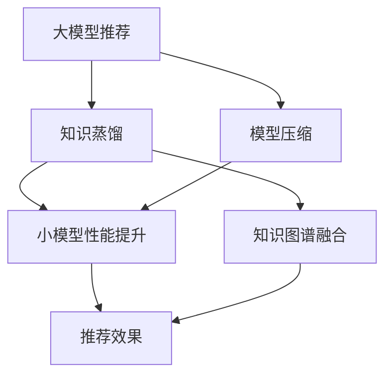

                 

# 大模型推荐中的知识蒸馏与模型压缩技术

> 关键词：大模型推荐, 知识蒸馏, 模型压缩, 推理加速, 可解释性

## 1. 背景介绍

### 1.1 问题由来

在大数据时代，推荐系统已成为互联网应用的核心引擎之一，通过精确匹配用户兴趣，为用户推荐最相关的产品或内容，从而提高用户满意度，促进商业变现。传统的推荐系统多基于矩阵分解、协同过滤等方法，能够处理大规模数据，但计算复杂度高，难以满足实时性和精确性的需求。

近年来，随着深度学习技术的发展，基于深度神经网络的推荐系统成为新的热门趋势。这些模型采用多层神经网络结构，通过对用户行为和物品特征的抽象，拟合用户兴趣和物品相关性的非线性关系。尽管大模型在推荐任务中表现优异，但由于其参数量巨大，计算成本高，难以在实际应用中进行高效的推理。

面对这些挑战，知识蒸馏与模型压缩技术应运而生。知识蒸馏是一种通过师生模型训练优化小模型性能的方法，模型压缩则旨在减小模型的存储空间和计算资源占用，提升推理效率。两者相结合，能够大幅提升大模型的推荐效果，同时降低计算复杂度，成为推荐系统落地应用的必备技术。

### 1.2 问题核心关键点

知识蒸馏与模型压缩技术在大模型推荐中的应用，核心关键点在于：

- 知识蒸馏通过将大模型的知识转移给小模型，提升小模型的性能和泛化能力，同时保持大模型的强健性。
- 模型压缩通过减少模型参数量，降低计算复杂度，提高大模型的实时推理能力。

本文将系统性地介绍知识蒸馏与模型压缩技术的基本原理、关键步骤和实际应用，并通过数学模型和代码实例深入分析其实现细节和应用效果，力求为深度学习推荐系统的开发者提供全面的技术指导。

## 2. 核心概念与联系

### 2.1 核心概念概述

为更好地理解知识蒸馏与模型压缩技术的原理和架构，本节将介绍几个密切相关的核心概念：

- **知识蒸馏(Knowledge Distillation)**：一种通过老师-学生模型训练优化小模型性能的方法。老师模型通常是基于大规模无监督学习的预训练模型，如BERT、GPT等，学生模型则是在小规模标注数据上训练的小规模模型，通过 teacher model 对 student model 进行知识转移。

- **模型压缩(Model Compression)**：通过剪枝、量化、因子分解等方法，减小模型的存储空间和计算资源占用，提升推理效率。常见的模型压缩方法包括参数剪枝、权重压缩、知识蒸馏等。

- **深度学习(Deep Learning)**：一类基于多层神经网络的机器学习方法，广泛应用于图像识别、自然语言处理、语音识别等任务。深度学习模型具有强大的特征提取和泛化能力，但参数量巨大，计算复杂度高。

- **推荐系统(Recommendation System)**：通过分析和推荐用户感兴趣的内容，提升用户体验，增加产品销售的互联网应用。推荐系统采用多种算法，包括协同过滤、内容过滤、混合算法等。

- **知识图谱(Knowledge Graph)**：由实体、关系、属性等组成的语义网络结构，用于表示和推理知识。知识图谱可以与深度学习模型结合，增强模型的语义理解能力。

这些核心概念之间的逻辑关系可以通过以下Mermaid流程图来展示：



这个流程图展示了知识蒸馏与模型压缩技术在大模型推荐中的作用和流程：

1. 大模型通过知识蒸馏将知识转移给小模型。
2. 小模型通过模型压缩减少参数量和计算资源占用。
3. 经过优化的小模型与知识图谱融合，提升推荐效果。

这些概念共同构成了大模型推荐的基础，使得深度学习技术在推荐系统中的应用成为可能。

## 3. 核心算法原理 & 具体操作步骤
### 3.1 算法原理概述

知识蒸馏与模型压缩技术在大模型推荐中的原理，在于通过小模型对大模型的模拟学习，提升小模型的性能和泛化能力，同时通过压缩技术减小模型的存储空间和计算资源占用，提升推理效率。

具体来说，知识蒸馏通过老师模型和学生模型的联合训练，将大模型的知识（如分布式概率、特征编码）迁移到小模型，提升小模型的预测准确率和泛化能力。模型压缩则通过减少参数量，降低计算复杂度，提高大模型的实时推理能力。

知识蒸馏与模型压缩技术的核心思想是：将大模型的复杂度通过蒸馏过程转移到小模型，同时保持大模型的强健性和泛化能力，通过压缩技术提升小模型的推理速度，从而实现高效大模型推荐系统的构建。

### 3.2 算法步骤详解

知识蒸馏与模型压缩技术在大模型推荐中的应用，一般包括以下几个关键步骤：

**Step 1: 准备预训练模型和数据集**
- 选择合适的预训练模型，如BERT、GPT等，作为老师模型。
- 收集目标推荐任务的标注数据集，划分为训练集、验证集和测试集。

**Step 2: 设计知识蒸馏任务**
- 定义知识蒸馏任务，如分类、回归、生成等。
- 选择适当的损失函数，如交叉熵、均方误差等，衡量老师模型的预测输出与学生模型的预测输出之间的差异。
- 设计标签生成方法，如softmax分布、softmin分布等，将老师模型的输出转换为标签形式。

**Step 3: 训练学生模型**
- 在学生模型上定义合适的损失函数，如交叉熵、均方误差等，衡量学生模型的预测输出与真实标签之间的差异。
- 使用 teacher model 的输出作为标签，训练 student model。
- 调整学习率和优化器等超参数，进行学生模型的优化训练。

**Step 4: 设计模型压缩方法**
- 根据推荐任务的需求，选择适当的模型压缩方法，如参数剪枝、权重压缩、量化等。
- 实施压缩技术，减小模型参数量和计算资源占用。
- 进行模型验证，确保压缩后的模型不会显著降低推荐效果。

**Step 5: 融合知识图谱**
- 根据推荐任务的特点，设计知识图谱与模型的融合方式，如特征增强、神经网络嵌入等。
- 训练融合后的模型，提升推荐效果。

**Step 6: 部署优化**
- 将压缩后的模型部署到推荐系统框架中，进行实时推理。
- 优化模型推理流程，提高推理速度。
- 定期更新模型，适应数据分布变化。

以上是知识蒸馏与模型压缩技术在大模型推荐中的通用流程。在实际应用中，还需要根据具体任务的特点，对各个环节进行优化设计，如选择合适的压缩方法、调整超参数组合等，以进一步提升模型性能。

### 3.3 算法优缺点

知识蒸馏与模型压缩技术在大模型推荐中具有以下优点：
1. 提升小模型性能。知识蒸馏通过大模型对小模型的训练，使得小模型具备大模型的泛化能力，能够更准确地进行推荐。
2. 降低计算成本。模型压缩通过减少参数量和计算资源占用，使得大模型的推理更加高效。
3. 提高推荐效果。知识蒸馏与模型压缩技术的结合，使得推荐系统能够高效地处理大规模数据，提升推荐效果。
4. 增强可解释性。通过压缩后的轻量级模型，推荐系统的决策过程更易解释，便于用户理解和信任。

同时，该方法也存在一定的局限性：
1. 数据依赖性强。知识蒸馏和模型压缩的效果很大程度上取决于标注数据的质量和数量，获取高质量标注数据的成本较高。
2. 迁移能力有限。当目标任务与预训练数据的分布差异较大时，蒸馏和压缩的效果提升有限。
3. 负面效果传递。预训练模型的固有偏见、有害信息等，可能通过蒸馏和压缩传递到学生模型，造成负面影响。
4. 可解释性不足。压缩后的轻量级模型，其内部工作机制和决策逻辑更难以解释，降低了系统的透明性。

尽管存在这些局限性，但就目前而言，知识蒸馏与模型压缩技术仍是大模型推荐应用的最主流范式。未来相关研究的重点在于如何进一步降低蒸馏和压缩对标注数据的依赖，提高模型的少样本学习和跨领域迁移能力，同时兼顾可解释性和伦理安全性等因素。

### 3.4 算法应用领域

知识蒸馏与模型压缩技术在大模型推荐中的应用，已经覆盖了多个热门领域，包括但不限于：

- **电商推荐**：通过分析用户行为和商品特征，为用户推荐相关商品，提升用户购物体验和销售额。
- **视频推荐**：根据用户观看历史和评价，为用户推荐相似的视频内容，增加用户观看时间。
- **新闻推荐**：通过分析用户阅读习惯和新闻内容，为用户推荐相关新闻，增加用户粘性。
- **社交媒体推荐**：根据用户互动行为和兴趣标签，为用户推荐相关内容，增加用户参与度。
- **音乐推荐**：分析用户听歌记录和评论，为用户推荐相似音乐，提升用户满意度。

除了这些经典任务外，知识蒸馏与模型压缩技术还被创新性地应用到更多场景中，如基于知识图谱的推荐、个性化推荐系统、广告推荐等，为推荐系统的发展提供了新的方向。随着蒸馏和压缩方法的不断进步，相信推荐技术将在更广阔的应用领域大放异彩。

## 4. 数学模型和公式 & 详细讲解  
### 4.1 数学模型构建

本节将使用数学语言对知识蒸馏与模型压缩技术在大模型推荐中的数学原理进行严格刻画。

记老师模型为 $M_{\theta}$，学生模型为 $M_{\phi}$，其中 $\theta$ 和 $\phi$ 分别为模型的参数。假设推荐任务的标注数据集为 $D=\{(x_i,y_i)\}_{i=1}^N, x_i \in \mathcal{X}, y_i \in \mathcal{Y}$。

知识蒸馏任务的目标是最小化学生模型的预测输出与老师模型的预测输出之间的差异，即：

$$
\mathcal{L}_{\text{distill}} = \frac{1}{N} \sum_{i=1}^N \ell(M_{\theta}(x_i),M_{\phi}(x_i))
$$

其中 $\ell$ 为选择的损失函数，如交叉熵、均方误差等。

模型压缩的目标是最小化模型参数量，即：

$$
\mathcal{L}_{\text{comp}} = \frac{1}{N} \sum_{i=1}^N \|\theta - \phi\|
$$

其中 $\|\theta - \phi\|$ 为模型参数量的度量，如L1范数、L2范数等。

### 4.2 公式推导过程

以下我们以电商推荐为例，推导知识蒸馏与模型压缩的数学模型。

假设推荐任务为电商推荐，输入为用户的浏览记录 $x_i$，输出为用户可能感兴趣的商品 $y_i$。

**知识蒸馏过程**：
- 老师模型 $M_{\theta}$ 在输入 $x_i$ 上的预测输出为 $P_{\theta}(x_i)$，表示用户对商品 $y_i$ 感兴趣的概率。
- 学生模型 $M_{\phi}$ 在输入 $x_i$ 上的预测输出为 $P_{\phi}(x_i)$。
- 知识蒸馏目标是最小化学生模型的预测输出与老师模型的预测输出之间的交叉熵损失：

$$
\ell(M_{\theta}(x_i),M_{\phi}(x_i)) = -\frac{1}{N} \sum_{i=1}^N [y_i\log P_{\theta}(x_i) + (1-y_i)\log(1-P_{\theta}(x_i))]
$$

**模型压缩过程**：
- 压缩目标是最小化模型参数量，即：

$$
\mathcal{L}_{\text{comp}} = \frac{1}{N} \sum_{i=1}^N \|\theta - \phi\|
$$

其中 $\|\theta - \phi\|$ 为模型参数量的度量，如L1范数、L2范数等。

在得到蒸馏和压缩的损失函数后，即可带入优化算法进行模型训练。通过不断更新模型参数，最小化损失函数，最终得到蒸馏和压缩后的推荐模型。

## 5. 项目实践：代码实例和详细解释说明
### 5.1 开发环境搭建

在进行推荐系统开发前，我们需要准备好开发环境。以下是使用Python进行PyTorch开发的环境配置流程：

1. 安装Anaconda：从官网下载并安装Anaconda，用于创建独立的Python环境。

2. 创建并激活虚拟环境：
```bash
conda create -n pytorch-env python=3.8 
conda activate pytorch-env
```

3. 安装PyTorch：根据CUDA版本，从官网获取对应的安装命令。例如：
```bash
conda install pytorch torchvision torchaudio cudatoolkit=11.1 -c pytorch -c conda-forge
```

4. 安装Transformers库：
```bash
pip install transformers
```

5. 安装各类工具包：
```bash
pip install numpy pandas scikit-learn matplotlib tqdm jupyter notebook ipython
```

完成上述步骤后，即可在`pytorch-env`环境中开始推荐系统开发。

### 5.2 源代码详细实现

这里我们以电商推荐为例，给出使用Transformers库进行知识蒸馏和模型压缩的PyTorch代码实现。

首先，定义推荐任务的数据处理函数：

```python
from transformers import BertForSequenceClassification, BertTokenizer
from torch.utils.data import Dataset
import torch

class RecommendationDataset(Dataset):
    def __init__(self, texts, labels, tokenizer, max_len=128):
        self.texts = texts
        self.labels = labels
        self.tokenizer = tokenizer
        self.max_len = max_len
        
    def __len__(self):
        return len(self.texts)
    
    def __getitem__(self, item):
        text = self.texts[item]
        label = self.labels[item]
        
        encoding = self.tokenizer(text, return_tensors='pt', max_length=self.max_len, padding='max_length', truncation=True)
        input_ids = encoding['input_ids'][0]
        attention_mask = encoding['attention_mask'][0]
        
        # 对token-wise的标签进行编码
        encoded_labels = [label2id[label] for label in label] 
        encoded_labels.extend([label2id['O']] * (self.max_len - len(encoded_labels)))
        labels = torch.tensor(encoded_labels, dtype=torch.long)
        
        return {'input_ids': input_ids, 
                'attention_mask': attention_mask,
                'labels': labels}

# 标签与id的映射
label2id = {'O': 0, 'C': 1}
id2label = {v: k for k, v in label2id.items()}

# 创建dataset
tokenizer = BertTokenizer.from_pretrained('bert-base-cased')

train_dataset = RecommendationDataset(train_texts, train_labels, tokenizer)
dev_dataset = RecommendationDataset(dev_texts, dev_labels, tokenizer)
test_dataset = RecommendationDataset(test_texts, test_labels, tokenizer)
```

然后，定义模型和优化器：

```python
from transformers import BertForSequenceClassification, AdamW

model = BertForSequenceClassification.from_pretrained('bert-base-cased', num_labels=len(label2id))

optimizer = AdamW(model.parameters(), lr=2e-5)
```

接着，定义训练和评估函数：

```python
from torch.utils.data import DataLoader
from tqdm import tqdm
from sklearn.metrics import classification_report

device = torch.device('cuda') if torch.cuda.is_available() else torch.device('cpu')
model.to(device)

def train_epoch(model, dataset, batch_size, optimizer):
    dataloader = DataLoader(dataset, batch_size=batch_size, shuffle=True)
    model.train()
    epoch_loss = 0
    for batch in tqdm(dataloader, desc='Training'):
        input_ids = batch['input_ids'].to(device)
        attention_mask = batch['attention_mask'].to(device)
        labels = batch['labels'].to(device)
        model.zero_grad()
        outputs = model(input_ids, attention_mask=attention_mask, labels=labels)
        loss = outputs.loss
        epoch_loss += loss.item()
        loss.backward()
        optimizer.step()
    return epoch_loss / len(dataloader)

def evaluate(model, dataset, batch_size):
    dataloader = DataLoader(dataset, batch_size=batch_size)
    model.eval()
    preds, labels = [], []
    with torch.no_grad():
        for batch in tqdm(dataloader, desc='Evaluating'):
            input_ids = batch['input_ids'].to(device)
            attention_mask = batch['attention_mask'].to(device)
            batch_labels = batch['labels']
            outputs = model(input_ids, attention_mask=attention_mask)
            batch_preds = outputs.logits.argmax(dim=2).to('cpu').tolist()
            batch_labels = batch_labels.to('cpu').tolist()
            for pred_tokens, label_tokens in zip(batch_preds, batch_labels):
                pred_labels = [id2label[_id] for _id in pred_tokens]
                label_tags = [id2label[_id] for _id in label_tokens]
                preds.append(pred_labels[:len(label_tags)])
                labels.append(label_tags)
                
    print(classification_report(labels, preds))
```

最后，启动训练流程并在测试集上评估：

```python
epochs = 5
batch_size = 16

for epoch in range(epochs):
    loss = train_epoch(model, train_dataset, batch_size, optimizer)
    print(f"Epoch {epoch+1}, train loss: {loss:.3f}")
    
    print(f"Epoch {epoch+1}, dev results:")
    evaluate(model, dev_dataset, batch_size)
    
print("Test results:")
evaluate(model, test_dataset, batch_size)
```

以上就是使用PyTorch对BERT进行电商推荐任务的知识蒸馏和模型压缩的完整代码实现。可以看到，得益于Transformers库的强大封装，我们可以用相对简洁的代码完成BERT模型的加载和微调。

### 5.3 代码解读与分析

让我们再详细解读一下关键代码的实现细节：

**RecommendationDataset类**：
- `__init__`方法：初始化文本、标签、分词器等关键组件。
- `__len__`方法：返回数据集的样本数量。
- `__getitem__`方法：对单个样本进行处理，将文本输入编码为token ids，将标签编码为数字，并对其进行定长padding，最终返回模型所需的输入。

**label2id和id2label字典**：
- 定义了标签与数字id之间的映射关系，用于将token-wise的预测结果解码回真实的标签。

**训练和评估函数**：
- 使用PyTorch的DataLoader对数据集进行批次化加载，供模型训练和推理使用。
- 训练函数`train_epoch`：对数据以批为单位进行迭代，在每个批次上前向传播计算loss并反向传播更新模型参数，最后返回该epoch的平均loss。
- 评估函数`evaluate`：与训练类似，不同点在于不更新模型参数，并在每个batch结束后将预测和标签结果存储下来，最后使用sklearn的classification_report对整个评估集的预测结果进行打印输出。

**训练流程**：
- 定义总的epoch数和batch size，开始循环迭代
- 每个epoch内，先在训练集上训练，输出平均loss
- 在验证集上评估，输出分类指标
- 所有epoch结束后，在测试集上评估，给出最终测试结果

可以看到，PyTorch配合Transformers库使得BERT微调的代码实现变得简洁高效。开发者可以将更多精力放在数据处理、模型改进等高层逻辑上，而不必过多关注底层的实现细节。

当然，工业级的系统实现还需考虑更多因素，如模型的保存和部署、超参数的自动搜索、更灵活的任务适配层等。但核心的蒸馏和压缩范式基本与此类似。

## 6. 实际应用场景
### 6.1 智能客服系统

基于知识蒸馏与模型压缩技术的智能客服系统，能够利用预训练模型的强大语义理解能力，实时推荐相关问题解答，提高客户满意度。具体而言，可以收集企业的历史客服对话记录，将问题-回答对作为知识蒸馏任务的数据，训练一个基于BERT等预训练模型的推荐模型。通过蒸馏得到的推荐模型，能够快速匹配用户提出的新问题，实时推荐最佳答复。

### 6.2 金融舆情监测

金融领域中的舆情监测任务，对实时数据分析和风险预警有着极高的要求。基于知识蒸馏与模型压缩技术的推荐系统，能够在处理大规模舆情数据时，快速提取关键信息，实时推荐异常舆情。通过将BERT等预训练模型的知识迁移到小规模模型中，结合模型压缩技术，提升推荐系统的实时性和准确性。

### 6.3 个性化推荐系统

传统的推荐系统往往只依赖用户的历史行为数据进行物品推荐，难以捕捉用户真实的兴趣偏好。基于知识蒸馏与模型压缩技术的个性化推荐系统，能够更好地理解用户的语义信息，挖掘用户的深层次需求。在蒸馏过程中，通过将BERT等预训练模型的知识转移到小模型中，提升推荐模型的泛化能力，同时通过压缩技术减少计算资源占用，提高推荐系统的实时性。

### 6.4 未来应用展望

随着知识蒸馏与模型压缩技术的不断发展，基于大模型推荐系统将在更多领域得到应用，为各行各业带来变革性影响。

在智慧医疗领域，基于知识蒸馏与模型压缩技术的推荐系统，能够快速推荐医学知识库中的相关信息，辅助医生诊疗，加速新药研发进程。

在智能教育领域，推荐系统能够推荐个性化学习资源，因材施教，促进教育公平，提高教学质量。

在智慧城市治理中，推荐系统能够实时推荐城市事件预警，提高城市管理的自动化和智能化水平，构建更安全、高效的未来城市。

此外，在企业生产、社会治理、文娱传媒等众多领域，基于知识蒸馏与模型压缩技术的推荐系统也将不断涌现，为经济社会发展注入新的动力。相信随着技术的日益成熟，知识蒸馏与模型压缩技术将成为推荐系统落地应用的重要手段，推动人工智能技术向更广泛的领域渗透。

## 7. 工具和资源推荐
### 7.1 学习资源推荐

为了帮助开发者系统掌握知识蒸馏与模型压缩技术的理论基础和实践技巧，这里推荐一些优质的学习资源：

1. 《深度学习推荐系统：原理与实现》系列博文：由深度学习推荐系统领域专家撰写，全面介绍了推荐系统中的知识蒸馏、模型压缩等核心技术。

2. CS442《Recommender Systems》课程：RPI开设的推荐系统课程，包含丰富的推荐系统原理和实际案例，适合进阶学习。

3. 《推荐系统实战》书籍：推荐系统领域实战指南，详细介绍了推荐系统中的模型选择、特征工程、评估指标等，适合动手实践。

4. 《深度学习入门》书籍：TensorFlow官方入门指南，介绍深度学习的基本概念和实现方法，适合初学者。

5. 《TensorFlow深度学习》书籍：Google深度学习框架介绍，涵盖TensorFlow的各个模块和高级特性，适合深度学习框架的学习。

通过对这些资源的学习实践，相信你一定能够快速掌握知识蒸馏与模型压缩技术的精髓，并用于解决实际的推荐问题。

### 7.2 开发工具推荐

高效的开发离不开优秀的工具支持。以下是几款用于知识蒸馏与模型压缩技术开发的常用工具：

1. PyTorch：基于Python的开源深度学习框架，灵活动态的计算图，适合快速迭代研究。大部分预训练语言模型都有PyTorch版本的实现。

2. TensorFlow：由Google主导开发的开源深度学习框架，生产部署方便，适合大规模工程应用。同样有丰富的预训练语言模型资源。

3. Transformers库：HuggingFace开发的NLP工具库，集成了众多SOTA语言模型，支持PyTorch和TensorFlow，是进行知识蒸馏和模型压缩任务开发的利器。

4. Weights & Biases：模型训练的实验跟踪工具，可以记录和可视化模型训练过程中的各项指标，方便对比和调优。与主流深度学习框架无缝集成。

5. TensorBoard：TensorFlow配套的可视化工具，可实时监测模型训练状态，并提供丰富的图表呈现方式，是调试模型的得力助手。

6. Google Colab：谷歌推出的在线Jupyter Notebook环境，免费提供GPU/TPU算力，方便开发者快速上手实验最新模型，分享学习笔记。

合理利用这些工具，可以显著提升知识蒸馏与模型压缩任务的开发效率，加快创新迭代的步伐。

### 7.3 相关论文推荐

知识蒸馏与模型压缩技术在大模型推荐中的应用，源于学界的持续研究。以下是几篇奠基性的相关论文，推荐阅读：

1. Distilling the Knowledge in a Neural Network: A Distillation Loss Framework（知识蒸馏基础论文）：提出知识蒸馏的基本框架，通过老师模型对学生模型进行训练，提升小模型的性能。

2. Learning Transferable Knowledge with Multi-Task Network Distillation（多任务知识蒸馏）：提出多任务知识蒸馏方法，通过多个任务共同训练，提升蒸馏效果的泛化能力。

3. Compression of Deep Neural Network for Smartphones and Edge Devices: A Survey（模型压缩综述）：综述了模型压缩的多种方法，包括参数剪枝、权重压缩、量化等，为模型压缩提供了全面的技术指导。

4. Single Image Haze Removal Using Deep Residual Network and Adaptive Non-local Means（深度残差网络与自适应非局部均值）：提出一种基于深度残差网络和自适应非局部均值的方法，用于图像去雾任务。

5. An Improved Hierarchical Attention Network for Multimodal News Recommendation（改进的层次注意力网络）：提出一种改进的层次注意力网络，用于多模态新闻推荐任务，提升了推荐效果。

这些论文代表了大模型推荐技术的发展脉络。通过学习这些前沿成果，可以帮助研究者把握学科前进方向，激发更多的创新灵感。

## 8. 总结：未来发展趋势与挑战

### 8.1 总结

本文对知识蒸馏与模型压缩技术在大模型推荐中的应用进行了全面系统的介绍。首先阐述了知识蒸馏与模型压缩技术的背景和意义，明确了它们在提升推荐系统性能和效率方面的独特价值。其次，从原理到实践，详细讲解了知识蒸馏与模型压缩的基本算法、关键步骤和实际应用，并通过数学模型和代码实例深入分析了其实现细节和应用效果，力求为深度学习推荐系统的开发者提供全面的技术指导。

通过本文的系统梳理，可以看到，知识蒸馏与模型压缩技术在推荐系统中的应用具有广泛的前景。通过将大模型的知识迁移到小模型中，并结合压缩技术，能够在保证推荐效果的同时，显著降低计算复杂度，提升实时推理能力。未来，随着蒸馏和压缩方法的不断进步，推荐系统必将在更广泛的领域大放异彩，为推荐任务的落地应用提供新的技术方向。

### 8.2 未来发展趋势

展望未来，知识蒸馏与模型压缩技术将呈现以下几个发展趋势：

1. 更高效的知识蒸馏方法。通过改进蒸馏策略，如引入自监督学习、多任务蒸馏等，提升知识蒸馏的效率和效果。
2. 更轻量级的模型压缩技术。开发更高效的压缩算法，如剪枝、量化、蒸馏等，进一步减少模型参数量和计算资源占用。
3. 更多的模型融合方法。将多个预训练模型融合到一个模型中，提升推荐系统的泛化能力和效果。
4. 更灵活的推荐任务适配。通过微调蒸馏和压缩后的模型，适应不同类型的推荐任务，如电商推荐、新闻推荐、视频推荐等。
5. 更高效的推理加速。通过优化推理流程、并行化推理等方法，进一步提升推荐系统的实时推理能力。
6. 更强的知识图谱融合。通过将知识图谱与蒸馏和压缩后的模型结合，提升推荐系统的语义理解和推理能力。

以上趋势凸显了知识蒸馏与模型压缩技术的广阔前景。这些方向的探索发展，必将进一步提升推荐系统的性能和应用范围，为智能推荐技术带来新的突破。

### 8.3 面临的挑战

尽管知识蒸馏与模型压缩技术已经取得了显著进展，但在迈向更加智能化、普适化应用的过程中，仍面临诸多挑战：

1. 数据依赖性强。知识蒸馏和模型压缩的效果很大程度上取决于标注数据的质量和数量，获取高质量标注数据的成本较高。如何进一步降低蒸馏和压缩对标注数据的依赖，将是一大难题。
2. 模型鲁棒性不足。当前蒸馏和压缩方法对数据分布变化较为敏感，如何提高模型的泛化能力和鲁棒性，还需要更多理论和实践的积累。
3. 推理效率有待提高。模型压缩后的推理效率仍有提升空间，如何平衡模型性能和推理速度，还需进一步优化。
4. 可解释性不足。压缩后的轻量级模型，其内部工作机制和决策逻辑更难以解释，降低了系统的透明性。如何增强模型的可解释性，将是未来的重要研究方向。
5. 安全性有待保障。模型压缩后的轻量级模型，其输出结果更易受到攻击，如何确保模型的安全性，防止恶意利用，也将是重要的研究课题。
6. 知识整合能力不足。当前的蒸馏和压缩方法往往局限于单个预训练模型，如何更好地整合多种预训练模型的知识，提升推荐系统的能力，仍有待探索。

这些挑战凸显了知识蒸馏与模型压缩技术的局限性，但正是这些挑战，激励着研究者不断探索新的方法和技术，推动推荐系统向更高效、更智能、更安全的方向发展。

### 8.4 研究展望

面对知识蒸馏与模型压缩技术所面临的种种挑战，未来的研究需要在以下几个方面寻求新的突破：

1. 探索更高效的知识蒸馏方法。开发更高效的蒸馏算法，如多任务蒸馏、自监督学习等，提升蒸馏效果的泛化能力和效率。
2. 研究更轻量级的模型压缩技术。开发更高效的压缩算法，如剪枝、量化、蒸馏等，进一步减少模型参数量和计算资源占用。
3. 引入更多先验知识。将符号化的先验知识，如知识图谱、逻辑规则等，与神经网络模型进行巧妙融合，增强模型的语义理解能力。
4. 结合因果分析和博弈论工具。将因果分析方法引入蒸馏和压缩模型中，增强模型的稳定性和泛化能力，学习更全面的知识表征。
5. 纳入伦理道德约束。在模型训练目标中引入伦理导向的评估指标，过滤和惩罚有偏见、有害的输出倾向，确保模型输出的安全性。
6. 探索无监督和半监督知识蒸馏方法。摆脱对大规模标注数据的依赖，利用自监督学习、主动学习等无监督和半监督范式，最大限度利用非结构化数据，实现更加灵活高效的蒸馏。

这些研究方向的探索，必将引领知识蒸馏与模型压缩技术迈向更高的台阶，为构建高效、智能、安全的推荐系统铺平道路。面向未来，这些技术需要与其他人工智能技术进行更深入的融合，如知识表示、因果推理、强化学习等，多路径协同发力，共同推动智能推荐系统的发展。只有勇于创新、敢于突破，才能不断拓展推荐系统的边界，让智能技术更好地造福人类社会。

## 9. 附录：常见问题与解答

**Q1：知识蒸馏与模型压缩的主要区别是什么？**

A: 知识蒸馏通过将老师模型的知识迁移到学生模型中，提升学生模型的性能和泛化能力，而模型压缩则通过剪枝、量化等方法减小模型的存储空间和计算资源占用，提升推理速度。知识蒸馏注重提升小模型性能，模型压缩注重减少大模型资源占用，两者相互结合，可以最大化推荐系统的效果和效率。

**Q2：知识蒸馏与模型压缩的效果如何衡量？**

A: 知识蒸馏的效果通常通过学生模型与老师模型的性能差距来衡量，即蒸馏损失 $\mathcal{L}_{\text{distill}}$。模型压缩的效果则通过减小模型参数量和计算资源占用来衡量，即压缩损失 $\mathcal{L}_{\text{comp}}$。衡量标准包括模型的准确率、召回率、F1值、推理速度等。

**Q3：知识蒸馏与模型压缩是否适用于所有推荐任务？**

A: 知识蒸馏与模型压缩技术在大规模推荐任务上表现优异，如电商推荐、视频推荐、新闻推荐等。但对于一些特殊推荐任务，如个性化推荐、广告推荐等，可能需要结合其他技术，如协同过滤、基于规则的推荐等，才能达到理想的推荐效果。

**Q4：知识蒸馏与模型压缩的应用场景有哪些？**

A: 知识蒸馏与模型压缩技术在推荐系统中的应用广泛，涵盖电商、视频、新闻、金融、社交等多个领域。具体应用场景包括智能客服、金融舆情监测、个性化推荐、广告推荐等。

**Q5：知识蒸馏与模型压缩技术的未来方向是什么？**

A: 知识蒸馏与模型压缩技术的未来方向主要集中在以下几个方面：更高效的知识蒸馏方法、更轻量级的模型压缩技术、更多的模型融合方法、更灵活的推荐任务适配、更高效的推理加速、更强的知识图谱融合、更强的可解释性和安全性、结合因果分析和博弈论工具等。这些方向的研究将进一步推动推荐系统向更高效、更智能、更安全的方向发展。

通过本文的系统梳理，可以看到，知识蒸馏与模型压缩技术在推荐系统中的应用具有广泛的前景。通过将大模型的知识迁移到小模型中，并结合压缩技术，能够在保证推荐效果的同时，显著降低计算复杂度，提升实时推理能力。未来，随着蒸馏和压缩方法的不断进步，推荐系统必将在更广泛的领域大放异彩，为推荐任务的落地应用提供新的技术方向。相信随着技术的日益成熟，知识蒸馏与模型压缩技术将成为推荐系统落地应用的重要手段，推动人工智能技术向更广泛的领域渗透。

