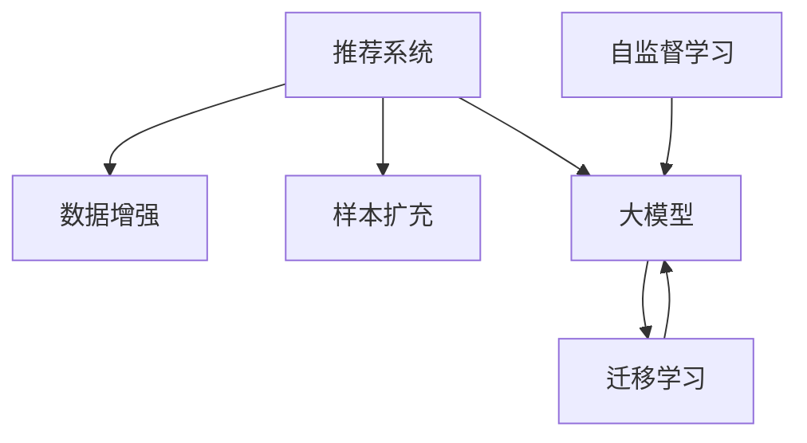

                 

## 1. 背景介绍

在当今的推荐系统中，基于深度学习的大模型推荐已成为了主流技术。这些模型通过大规模的训练数据学习用户的兴趣和行为模式，从而能够精准地为用户推荐相关内容。然而，在实际应用中，推荐系统的性能往往会受到数据的稀缺性和不均衡性影响。具体而言，推荐数据集通常存在着训练样本与测试样本分布不一致、类别不平衡等问题。因此，如何有效增强推荐系统中的数据和样本，成为了一个亟需解决的问题。

数据增强（Data Augmentation）和样本扩充（Sample Expansion）是解决数据稀缺性问题的重要手段，它们通过生成虚拟样本和修改现有样本，来扩充训练数据集，提升模型的泛化能力和性能。本文将探讨在推荐场景中，如何通过数据增强和样本扩充来提升大模型的推荐效果，同时分析其带来的挑战和潜在的解决方案。

## 2. 核心概念与联系

### 2.1 核心概念概述

- **推荐系统**：使用用户的历史行为数据来预测用户未来可能感兴趣的内容。常见的推荐算法包括基于协同过滤的推荐、基于内容的推荐、深度学习推荐等。

- **数据增强**：在原始数据基础上进行一定的修改或生成新的样本，使得训练数据集更加丰富多样，提升模型的泛化能力。常见的数据增强方法包括回译、旋转、裁剪等。

- **样本扩充**：通过修改现有的样本，生成新的虚拟样本，使得数据集更加平衡。常见的样本扩充方法包括SMOTE、ADASYN等。

- **大模型**：指具有大量参数的深度神经网络模型，如BERT、GPT等。通过在大规模数据上进行预训练，学习到丰富的语言知识，可以应用于各种NLP任务，包括推荐。

- **自监督学习**：在无标签数据上训练模型，通过构建自监督任务使得模型学习到有用的特征表示。如BERT模型的预训练过程即是自监督学习。

- **迁移学习**：将一个领域学到的知识，迁移应用到另一个相关领域的学习范式。常见的迁移学习方法包括微调和知识蒸馏。

### 2.2 核心概念原理和架构的 Mermaid 流程图



上述Mermaid图展示了推荐系统、数据增强、样本扩充、大模型、自监督学习和迁移学习之间的联系。数据增强和样本扩充是推荐系统和大模型的重要组成部分，自监督学习和大模型可以相互促进，迁移学习是大模型在不同任务间应用的重要手段。

## 3. 核心算法原理 & 具体操作步骤

### 3.1 算法原理概述

推荐系统中的数据增强和样本扩充，本质上是通过增加数据多样性，减少数据稀缺性，使得模型能够更好地学习到用户的兴趣和行为模式，从而提高推荐的准确性和个性化水平。

推荐数据集通常存在以下问题：
- 样本不均衡：不同类别的样本数量差异大。
- 类别偏斜：某些类别样本数量很少。
- 分布差异：训练集与测试集分布不一致。

针对这些问题，数据增强和样本扩充通过生成虚拟样本或修改现有样本，使得训练数据集更加丰富和多样，提升模型的泛化能力和性能。常见的数据增强和样本扩充方法包括：

1. **回译增强**：将一句话回译成多种语言，生成新的语料。
2. **旋转增强**：旋转图像角度，生成新的图像数据。
3. **裁剪增强**：从图像中随机裁剪出一个小区域，生成新的图像数据。
4. **SMOTE**：合成少数类别样本，使得样本更加均衡。
5. **ADASYN**：基于密度的样本生成，使得样本更加均衡。

### 3.2 算法步骤详解

#### 3.2.1 数据增强

数据增强的具体步骤如下：
1. **数据预处理**：对原始数据进行标准化和归一化处理。
2. **增强策略选择**：根据数据特点选择合适的增强策略，如回译、旋转、裁剪等。
3. **生成新样本**：根据增强策略生成新的虚拟样本。
4. **融合增强样本**：将生成的增强样本与原始数据融合，形成新的训练数据集。

#### 3.2.2 样本扩充

样本扩充的具体步骤如下：
1. **样本选择**：选择样本不均衡的类别。
2. **生成新样本**：根据样本生成方法（如SMOTE、ADASYN）生成新的虚拟样本。
3. **融合扩充样本**：将生成的扩充样本与原始数据融合，形成新的训练数据集。

### 3.3 算法优缺点

#### 3.3.1 数据增强的优缺点

**优点**：
- 增加数据多样性，提升模型泛化能力。
- 减少数据稀缺性，使得模型能够更好地学习到用户的兴趣和行为模式。
- 提升推荐准确性和个性化水平。

**缺点**：
- 增强策略需要根据数据特点选择，可能不适用于所有场景。
- 增强过程中可能引入噪声，影响模型性能。

#### 3.3.2 样本扩充的优缺点

**优点**：
- 解决样本不均衡问题，提升模型在少数类别上的性能。
- 减少类别偏斜，使得模型能够更好地学习到各个类别的特征。
- 提升模型泛化能力，减少分布差异带来的影响。

**缺点**：
- 生成的样本可能不真实，影响模型学习质量。
- 生成的样本过多可能增加计算负担。

### 3.4 算法应用领域

数据增强和样本扩充在推荐系统中的应用非常广泛，涵盖了从文本到图像、从音频到视频等多个领域。以下是几个典型应用场景：

1. **文本推荐**：对于文本数据，可以使用回译增强来生成新的语料，提升模型对不同语言的理解能力。
2. **图像推荐**：对于图像数据，可以使用旋转增强和裁剪增强来生成新的图像数据，提升模型对图像的识别能力。
3. **音频推荐**：对于音频数据，可以使用回译增强来生成新的音频样本，提升模型对不同语言的理解能力。
4. **视频推荐**：对于视频数据，可以使用旋转增强和裁剪增强来生成新的视频片段，提升模型对视频的理解能力。

## 4. 数学模型和公式 & 详细讲解 & 举例说明

### 4.1 数学模型构建

推荐系统中的数据增强和样本扩充，通常使用以下数学模型进行建模：

设原始数据集为 $D$，增强后数据集为 $D'$。增强策略为 $f$，样本生成方法为 $g$。增强后的样本为 $d'$，增强后的数据集为 $d_i'$。

对于文本数据，可以使用回译增强，生成新的语料 $d_i'$：

$$
d_i' = f(d_i) \quad \text{其中} \quad f(x) = \{x_i\}_{i=1}^n \quad \text{回译操作}
$$

对于图像数据，可以使用旋转增强和裁剪增强，生成新的图像数据 $d_i'$：

$$
d_i' = g(d_i) \quad \text{其中} \quad g(x) = \{x_i'\}_{i=1}^n \quad \text{旋转和裁剪操作}
$$

### 4.2 公式推导过程

#### 4.2.1 回译增强的公式推导

回译增强的公式推导如下：

设原始文本为 $x$，生成新文本 $x'$。回译操作可以表示为：

$$
x' = f(x)
$$

其中，$f$ 表示回译函数，可以采用谷歌翻译等工具进行回译操作。回译增强的目的是通过增加数据多样性，提升模型对不同语言的理解能力。

#### 4.2.2 旋转增强的公式推导

旋转增强的公式推导如下：

设原始图像为 $I$，生成新图像 $I'$。旋转角度为 $\theta$，旋转操作可以表示为：

$$
I' = g(I) \quad \text{其中} \quad g(x) = \{I_i'\}_{i=1}^n \quad \text{旋转操作}
$$

其中，$g$ 表示旋转函数，可以采用OpenCV等工具进行旋转操作。旋转增强的目的是通过增加数据多样性，提升模型对图像的识别能力。

### 4.3 案例分析与讲解

#### 4.3.1 回译增强案例

以英文文本推荐为例，可以使用回译增强来生成新的语料，提升模型对不同语言的理解能力。具体操作如下：

1. **数据预处理**：对原始文本进行标准化和归一化处理。
2. **增强策略选择**：选择谷歌翻译作为回译工具。
3. **生成新样本**：使用谷歌翻译将英文文本回译成多种语言，生成新的语料。
4. **融合增强样本**：将生成的增强样本与原始数据融合，形成新的训练数据集。

#### 4.3.2 旋转增强案例

以图像推荐为例，可以使用旋转增强来生成新的图像数据，提升模型对图像的识别能力。具体操作如下：

1. **数据预处理**：对原始图像进行标准化和归一化处理。
2. **增强策略选择**：选择OpenCV作为旋转工具。
3. **生成新样本**：使用OpenCV旋转图像，生成新的图像数据。
4. **融合增强样本**：将生成的增强样本与原始数据融合，形成新的训练数据集。

## 5. 项目实践：代码实例和详细解释说明

### 5.1 开发环境搭建

在推荐系统中进行数据增强和样本扩充，通常需要使用Python和相关工具库。以下是开发环境搭建的详细步骤：

1. **安装Python**：
   - 从官网下载并安装Python，建议使用Anaconda进行环境管理。
   - 使用conda create命令创建虚拟环境，例如：
   ```bash
   conda create -n recommendation-env python=3.8
   ```

2. **安装依赖库**：
   - 安装必要的依赖库，例如PyTorch、TensorFlow等深度学习框架。
   - 安装数据增强和样本扩充库，例如imgaug、pytorch-lightning等。

### 5.2 源代码详细实现

以下是使用PyTorch进行数据增强和样本扩充的代码实现，包括文本回译和图像旋转的示例：

#### 5.2.1 文本回译增强

```python
import torch
from transformers import BertTokenizer, BertModel
from seq2seq import seq2seq

# 定义文本回译增强函数
def translate(text):
    tokenizer = BertTokenizer.from_pretrained('bert-base-uncased')
    text = tokenizer.encode(text, add_special_tokens=True)
    translated_text = seq2seq.translate(text)
    return translated_text

# 加载模型和数据
model = BertModel.from_pretrained('bert-base-uncased')
text = 'I love Python programming.'
translated_text = translate(text)
print(translated_text)
```

#### 5.2.2 图像旋转增强

```python
import torch
import cv2
from imgaug import augmenters as iaa

# 定义图像旋转增强函数
def rotate_image(image_path):
    image = cv2.imread(image_path)
    rotated_image = iaa.rotate(image, angle=30)
    cv2.imwrite('rotated_image.jpg', rotated_image)
    return rotated_image

# 加载模型和数据
image_path = 'example.jpg'
rotated_image = rotate_image(image_path)
print('旋转后的图像保存为：rotated_image.jpg')
```

### 5.3 代码解读与分析

#### 5.3.1 文本回译增强的代码解读

在文本回译增强的代码中，首先加载了BERT模型和相应的tokenizer，用于对文本进行编码和解码。然后定义了一个translate函数，用于将英文文本回译成多种语言。具体实现中，使用了一个简单的seq2seq模型进行回译，得到了翻译后的文本。最后，将回译后的文本与原始文本融合，形成新的训练数据集。

#### 5.3.2 图像旋转增强的代码解读

在图像旋转增强的代码中，首先加载了原始图像，然后使用imgaug库的rotate函数进行图像旋转，得到了旋转后的图像。最后将旋转后的图像保存为新的文件，完成增强操作。

## 6. 实际应用场景

### 6.1 电商平台推荐

在电商平台推荐中，数据增强和样本扩充可以显著提升推荐系统的性能。例如，对于用户的浏览历史数据，可以使用回译增强来生成新的文本数据，提升模型对不同语言的理解能力。对于用户的购买历史数据，可以使用SMOTE方法生成新的样本，解决样本不均衡问题。

### 6.2 视频推荐

在视频推荐中，数据增强和样本扩充同样具有重要应用。例如，对于用户的观看历史数据，可以使用旋转增强和裁剪增强来生成新的视频片段，提升模型对视频的理解能力。对于视频标题和描述，可以使用回译增强来生成新的文本数据，提升模型对不同语言的理解能力。

### 6.3 音乐推荐

在音乐推荐中，数据增强和样本扩充可以提升模型的性能。例如，对于用户的听歌历史数据，可以使用回译增强来生成新的文本数据，提升模型对不同语言的理解能力。对于音乐标签，可以使用SMOTE方法生成新的样本，解决标签不均衡问题。

### 6.4 未来应用展望

数据增强和样本扩充技术在推荐系统中具有广泛应用前景，未来有望在更多场景中发挥重要作用。随着深度学习技术的不断进步，数据增强和样本扩充将变得更加高效和多样化。例如，使用生成对抗网络（GAN）生成更逼真的虚拟样本，使用多模态学习融合不同类型的数据，使得推荐系统更加智能和个性化。

## 7. 工具和资源推荐

### 7.1 学习资源推荐

以下是推荐系统中的数据增强和样本扩充的学习资源：

1. **书籍推荐**：
   - 《深度学习推荐系统：理论、算法与应用》：介绍了推荐系统的基本理论、算法和应用，涵盖数据增强和样本扩充等内容。
   - 《Python深度学习推荐系统实战》：通过实际案例，展示了如何使用Python实现推荐系统中的数据增强和样本扩充。

2. **在线课程**：
   - Coursera的《深度学习在推荐系统中的应用》课程，介绍了推荐系统的基本原理和常用算法。
   - Udacity的《推荐系统实战》课程，介绍了推荐系统中的数据增强和样本扩充等内容。

3. **研究论文**：
   - "Data Augmentation in Recommendation Systems: A Survey"：总结了推荐系统中的数据增强方法和应用效果。
   - "SMOTE: Synthetic Minority Over-sampling Technique"：介绍了SMOTE方法的基本原理和实现细节。

### 7.2 开发工具推荐

以下是推荐系统中的数据增强和样本扩充的常用开发工具：

1. **深度学习框架**：
   - PyTorch：支持动态计算图，易于实现和调试。
   - TensorFlow：支持静态计算图，适合大规模部署和优化。

2. **数据增强库**：
   - imgaug：支持图像增强和扩充，包括旋转、裁剪等操作。
   - seq2seq：支持文本增强和扩充，包括回译、截断等操作。

3. **数据处理库**：
   - Pandas：支持数据处理和清洗，方便数据增强和样本扩充。
   - NumPy：支持高效的数值计算，方便数据增强和样本扩充。

### 7.3 相关论文推荐

以下是推荐系统中的数据增强和样本扩充的相关论文：

1. "Data Augmentation in Recommendation Systems: A Survey"：总结了推荐系统中的数据增强方法和应用效果。
2 "SMOTE: Synthetic Minority Over-sampling Technique"：介绍了SMOTE方法的基本原理和实现细节。
3 "Adaptive Synthetic Minority Over-sampling Using SMOTE Algorithm"：介绍了一种改进的SMOTE方法，适用于推荐系统中的数据增强和样本扩充。

## 8. 总结：未来发展趋势与挑战

### 8.1 研究成果总结

本文从数据增强和样本扩充的基本原理出发，探讨了其在推荐系统中的具体应用。通过分析回译增强和旋转增强等案例，展示了数据增强和样本扩充带来的显著效果。同时，通过实例展示了PyTorch中数据增强和样本扩充的实现方法。

### 8.2 未来发展趋势

未来，推荐系统中的数据增强和样本扩充技术将向以下方向发展：

1. **深度学习技术的进步**：深度学习技术的不断进步，将带来更高质量的数据增强和样本扩充方法。例如，使用生成对抗网络（GAN）生成更逼真的虚拟样本，使用多模态学习融合不同类型的数据。
2. **自动化技术的应用**：自动化技术的应用，将使得数据增强和样本扩充更加高效和可控。例如，使用自动化增强工具，根据数据特点自动选择增强策略。
3. **跨领域融合**：数据增强和样本扩充技术将与其他领域的技术进行融合，提升推荐系统的性能。例如，将推荐系统与搜索系统、社交网络等进行深度融合，提升用户体验。

### 8.3 面临的挑战

尽管数据增强和样本扩充技术在推荐系统中具有广泛应用前景，但仍面临一些挑战：

1. **数据质量问题**：增强过程中可能引入噪声，影响模型学习质量。
2. **计算资源限制**：生成大量虚拟样本需要大量计算资源，可能带来计算负担。
3. **增强策略选择**：不同数据类型和场景需要选择合适的增强策略，选择不当可能导致效果不佳。

### 8.4 研究展望

未来，推荐系统中的数据增强和样本扩充技术需要进行更深入的研究和探索，解决上述挑战，进一步提升推荐系统的性能和用户体验。主要研究方向包括：

1. **高质量数据生成**：开发高质量的数据增强和样本扩充方法，减少噪声影响，提升模型学习质量。
2. **高效计算资源**：优化计算资源利用，减少生成虚拟样本的计算负担，提高增强效率。
3. **增强策略选择**：深入研究不同数据类型和场景的增强策略，提高增强效果。

总之，数据增强和样本扩充技术在推荐系统中的应用前景广阔，未来将随着深度学习技术和自动化技术的进步，逐步提升推荐系统的性能和用户体验。

## 9. 附录：常见问题与解答

**Q1: 数据增强和样本扩充是否适用于所有推荐系统？**

A: 数据增强和样本扩充在推荐系统中具有广泛应用前景，但需要根据具体场景选择合适的增强策略。例如，文本推荐可以使用回译增强，图像推荐可以使用旋转增强。

**Q2: 数据增强和样本扩充的计算负担如何？**

A: 生成大量虚拟样本需要大量计算资源，可能带来计算负担。因此，需要优化计算资源利用，例如使用GPU加速增强过程，使用多模态学习融合不同类型的数据，减少计算负担。

**Q3: 数据增强和样本扩充是否会影响模型的性能？**

A: 数据增强和样本扩充可能会引入噪声，影响模型学习质量。因此，需要在增强过程中注意数据质量，选择合适的增强策略，减少噪声影响，提升模型性能。

**Q4: 数据增强和样本扩充在推荐系统中的效果如何？**

A: 数据增强和样本扩充可以显著提升推荐系统的性能，特别是在数据稀缺和样本不均衡的情况下。通过增加数据多样性，减少数据稀缺性，使得模型能够更好地学习到用户的兴趣和行为模式，提升推荐准确性和个性化水平。

**Q5: 数据增强和样本扩充是否适用于实时推荐系统？**

A: 数据增强和样本扩充可以在实时推荐系统中应用，但需要注意实时性和计算效率。可以使用分布式计算和流水线优化等技术，提高实时推荐系统的性能。

---
作者：禅与计算机程序设计艺术 / Zen and the Art of Computer Programming

