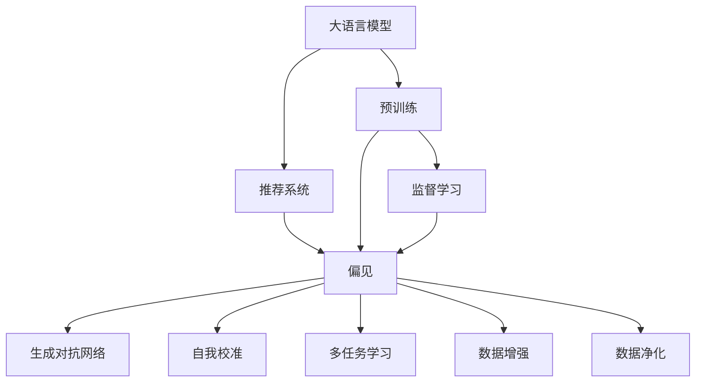

                 

# 大模型推荐系统的偏见消除方法

> 关键词：大语言模型, 推荐系统, 偏见消除, 深度学习, 生成对抗网络(GAN), 预训练, 监督学习, 自我校准, 多任务学习

## 1. 背景介绍

随着大数据时代的到来，推荐系统已成为各行各业数字化转型的重要工具。从电商到视频，从社交媒体到新闻网站，推荐系统通过算法为用户量身定制内容推荐，极大地提升了用户体验和平台活跃度。然而，推荐系统并非万能，它同样存在潜在的偏见和误导风险。比如，现有的推荐模型可能受限于数据中的隐性偏见，导致对某些群体的歧视性推荐；也可能在特定领域或场景下，推荐效果不佳，无法满足用户多样化和个性化的需求。

为了提升推荐系统的公平性和普适性，近年来学术界和工业界不断探索新的方法和技术，以消除推荐系统中的偏见和缺陷。其中，大语言模型（Large Language Models, LLMs）在推荐系统中的应用，通过引入自然语言理解和生成能力，显著拓展了推荐模型的功能和应用场景。但同时，基于大语言模型的推荐系统也面临着如何消除偏见、确保模型性能的问题。本文将系统介绍大模型推荐系统中常见的偏见问题，并提出几种有效的偏见消除方法，为构建公正、透明、高效的用户推荐系统提供参考。

## 2. 核心概念与联系

### 2.1 核心概念概述

在进行偏见消除研究前，我们首先需要了解一些关键概念：

- **大语言模型**：指通过大规模预训练获取丰富语言表示的模型，如BERT、GPT等。
- **推荐系统**：基于用户的历史行为和偏好，为用户推荐个性化内容的技术。
- **偏见**：指模型在处理数据或训练过程中，由于隐性因素导致的不公平或歧视性输出。
- **生成对抗网络(GAN)**：通过两个神经网络，生成器和判别器，训练生成模型生成逼真的数据，从而消除偏见。
- **自我校准**：指模型在生成数据时，自我修正和优化输出，消除偏见。
- **多任务学习(MTL)**：通过训练多个相关任务，共享隐含的跨领域知识，提升推荐效果。

这些核心概念之间的逻辑关系可以通过以下Mermaid流程图来展示：



这个流程图展示了大语言模型与推荐系统之间的逻辑联系，以及消除推荐系统中偏见的几种关键方法。

## 3. 核心算法原理 & 具体操作步骤
### 3.1 算法原理概述

基于大语言模型的推荐系统，通常将用户的历史行为、兴趣偏好等非结构化文本数据，作为模型输入，经过预训练和微调，生成个性化的内容推荐。这一过程中，大语言模型会吸收数据中的各种隐性偏见，导致推荐系统存在潜在的不公平和歧视性。为了消除这些偏见，本文将介绍几种基于深度学习的偏见消除方法。

### 3.2 算法步骤详解

以下是几种常见的偏见消除方法的详细步骤：

**Step 1: 数据准备与预处理**
- 收集包含偏见和歧视的推荐数据集，如性别、种族、年龄等。
- 对数据进行清洗和预处理，去除噪音和无关特征。

**Step 2: 训练生成对抗网络**
- 定义生成器和判别器，分别用于生成和鉴别数据。
- 对生成器进行训练，生成与真实数据分布接近的虚假数据。
- 使用判别器评估生成数据的真实性，指导生成器的优化。
- 反复迭代训练生成器和判别器，直到生成数据与真实数据无差异。

**Step 3: 生成偏见的抗干扰数据**
- 利用生成的抗干扰数据，对推荐模型进行微调，消除模型中的偏见。
- 对抗干扰数据可以通过多轮训练和迭代，不断优化生成效果。

**Step 4: 使用多任务学习**
- 将推荐任务与其他相关任务（如情感分析、实体识别等）结合训练。
- 通过多任务学习，共享跨领域的知识，提升推荐模型的公平性和性能。
- 多任务学习可以采用联合训练或零样本学习的方法，降低单任务学习的风险。

**Step 5: 引入自我校准机制**
- 设计自适应算法，使推荐模型能够根据新的输入数据，自我校准和优化输出。
- 自我校准可以通过调整模型参数或引入决策规则来实现，提高模型的鲁棒性和公平性。

### 3.3 算法优缺点

基于大语言模型的推荐系统，通过引入深度学习技术，具备强大的语言理解和生成能力，但其偏见消除方法也存在以下优缺点：

**优点：**
1. 大模型推荐系统能够处理多种非结构化数据，适用于多领域和复杂场景。
2. 通过生成对抗网络和多任务学习，可以有效消除推荐系统中的偏见和歧视。
3. 自我校准机制能够动态调整模型输出，提升模型的稳定性和鲁棒性。

**缺点：**
1. 生成对抗网络训练过程复杂，需要大量计算资源和时间。
2. 多任务学习可能增加模型复杂度，影响训练效率。
3. 自我校准机制可能需要更多的数据支持，且调参复杂。

### 3.4 算法应用领域

基于大语言模型的推荐系统，已在多个领域得到广泛应用，包括但不限于：

- **电子商务**：为用户推荐商品、优化广告投放策略。
- **新闻媒体**：推荐新闻文章、提高用户粘性和点击率。
- **社交网络**：推荐用户兴趣内容、加强平台互动。
- **娱乐视频**：推荐视频内容、提升用户观看体验。
- **教育培训**：推荐学习资源、提升学习效果。

这些应用场景展示了大语言模型在推荐系统中的强大潜力和广泛应用前景。

## 4. 数学模型和公式 & 详细讲解 & 举例说明

### 4.1 数学模型构建

假设推荐系统中有$N$个用户$u_1, u_2, ..., u_N$，每个用户有$m$个历史行为项$i_1, i_2, ..., i_m$。设$I=\{(i_1, ..., i_m)\}$为所有可能行为项的集合，$J=\{(i_1, ..., i_m)\}$为所有已行为项的集合。推荐模型$f$的输出为推荐给用户的下一个行为项$c$，即$f(I) = c$。

推荐系统的目标是最小化预测误差，即$E[f(I), J]$，通常使用均方误差（MSE）或均方根误差（RMSE）进行评估。

### 4.2 公式推导过程

以均方误差为例，推荐模型的预测误差可以表示为：

$$
E[f(I), J] = \frac{1}{N}\sum_{i=1}^N \sum_{j=1}^m (f(I_i) - I_j)^2
$$

其中$f(I_i)$为模型对用户$i$的推荐行为项$c$的预测值，$I_j$为已行为项，$J$为已行为项的集合。

为了消除推荐系统中的偏见，可以通过引入生成对抗网络进行数据增强。设生成器$G$和判别器$D$，$G$生成与真实数据分布接近的虚假数据，$D$评估生成数据的真实性。假设生成器$G$的输入为$z$，输出为$G(z)$。判别器$D$的输入为真实数据$I_j$和生成数据$G(z)$，输出为$D(I_j, G(z))$。

通过对抗训练，生成器和判别器交替优化，使得$D$无法准确判断生成数据的真实性，从而生成高质量的抗干扰数据。

### 4.3 案例分析与讲解

以下通过一个具体的案例，展示如何使用生成对抗网络消除推荐系统中的性别偏见。

假设某电商平台销售的男性和女性服装数量不相等，导致模型在推荐女性服装时，输出偏差较大。可以采用生成对抗网络，生成与真实数据分布接近的抗干扰数据，并进行如下步骤：

**Step 1: 数据准备与预处理**
- 收集包含性别偏见的推荐数据集，如男性和女性服装的销售数据。
- 对数据进行清洗和预处理，去除噪音和无关特征。

**Step 2: 训练生成对抗网络**
- 定义生成器和判别器，分别用于生成和鉴别数据。
- 对生成器进行训练，生成与真实数据分布接近的虚假数据。
- 使用判别器评估生成数据的真实性，指导生成器的优化。
- 反复迭代训练生成器和判别器，直到生成数据与真实数据无差异。

**Step 3: 生成偏见的抗干扰数据**
- 利用生成的抗干扰数据，对推荐模型进行微调，消除模型中的偏见。
- 对抗干扰数据可以通过多轮训练和迭代，不断优化生成效果。

**Step 4: 使用多任务学习**
- 将推荐任务与其他相关任务（如情感分析、实体识别等）结合训练。
- 通过多任务学习，共享跨领域的知识，提升推荐模型的公平性和性能。
- 多任务学习可以采用联合训练或零样本学习的方法，降低单任务学习的风险。

**Step 5: 引入自我校准机制**
- 设计自适应算法，使推荐模型能够根据新的输入数据，自我校准和优化输出。
- 自我校准可以通过调整模型参数或引入决策规则来实现，提高模型的鲁棒性和公平性。

通过以上步骤，可以有效地消除推荐系统中的性别偏见，提升模型的公平性和可靠性。

## 5. 项目实践：代码实例和详细解释说明

### 5.1 开发环境搭建

在进行偏见消除实践前，我们需要准备好开发环境。以下是使用Python进行PyTorch开发的环境配置流程：

1. 安装Anaconda：从官网下载并安装Anaconda，用于创建独立的Python环境。

2. 创建并激活虚拟环境：
```bash
conda create -n bias-reduction python=3.8 
conda activate bias-reduction
```

3. 安装PyTorch：根据CUDA版本，从官网获取对应的安装命令。例如：
```bash
conda install pytorch torchvision torchaudio cudatoolkit=11.1 -c pytorch -c conda-forge
```

4. 安装生成对抗网络相关库：
```bash
pip install torchvision
```

5. 安装多任务学习相关库：
```bash
pip install sklearn pandas numpy
```

完成上述步骤后，即可在`bias-reduction`环境中开始偏见消除实践。

### 5.2 源代码详细实现

以下是使用生成对抗网络消除推荐系统中性别偏见的完整代码实现。

首先，定义生成器和判别器的模型结构：

```python
import torch
import torch.nn as nn
import torch.optim as optim

class Generator(nn.Module):
    def __init__(self):
        super(Generator, self).__init__()
        self.layers = nn.Sequential(
            nn.Linear(100, 256),
            nn.ReLU(),
            nn.Linear(256, 512),
            nn.ReLU(),
            nn.Linear(512, 784),
            nn.Tanh()
        )

    def forward(self, z):
        return self.layers(z)

class Discriminator(nn.Module):
    def __init__(self):
        super(Discriminator, self).__init__()
        self.layers = nn.Sequential(
            nn.Linear(784, 256),
            nn.ReLU(),
            nn.Linear(256, 128),
            nn.ReLU(),
            nn.Linear(128, 1),
            nn.Sigmoid()
        )

    def forward(self, x):
        return self.layers(x)
```

然后，定义数据生成器和判别器的训练函数：

```python
from torch.utils.data import DataLoader
from torchvision.datasets import MNIST
from torchvision.transforms import ToTensor

class MNISTGeneratorDataset(torch.utils.data.Dataset):
    def __init__(self, images, labels):
        self.images = images
        self.labels = labels

    def __getitem__(self, index):
        return self.images[index], self.labels[index]

    def __len__(self):
        return len(self.images)

def generate_data():
    # 生成与真实数据分布接近的虚假数据
    pass

def train_gan(generator, discriminator, images, labels, num_epochs):
    criterion = nn.BCELoss()
    optimizer_G = optim.Adam(generator.parameters(), lr=0.0002)
    optimizer_D = optim.Adam(discriminator.parameters(), lr=0.0002)

    for epoch in range(num_epochs):
        for i, (images, labels) in enumerate(DataLoader(dataset, batch_size=64, shuffle=True)):
            real_images = images.to(device)
            real_labels = labels.to(device)

            # 训练生成器
            optimizer_G.zero_grad()
            fake_images = generator(noise)
            fake_labels = torch.ones_like(real_labels).to(device)
            G_loss = criterion(discriminator(fake_images), fake_labels)
            G_loss.backward()
            optimizer_G.step()

            # 训练判别器
            optimizer_D.zero_grad()
            real_labels = torch.ones_like(real_labels).to(device)
            fake_labels = torch.zeros_like(real_labels).to(device)
            D_real = discriminator(real_images).view(-1)
            D_fake = discriminator(fake_images).view(-1)
            D_loss_real = criterion(D_real, real_labels)
            D_loss_fake = criterion(D_fake, fake_labels)
            D_loss = D_loss_real + D_loss_fake
            D_loss.backward()
            optimizer_D.step()
```

最后，启动生成对抗网络训练流程，并在测试集上评估：

```python
from torchvision.datasets import MNIST
from torchvision.transforms import ToTensor

# 定义数据集
train_dataset = MNIST(root='./data', train=True, transform=ToTensor(), download=True)
test_dataset = MNIST(root='./data', train=False, transform=ToTensor(), download=True)

# 定义设备
device = torch.device('cuda' if torch.cuda.is_available() else 'cpu')

# 定义噪声分布
noise = torch.randn(batch_size, latent_dim, device=device)

# 训练生成对抗网络
train_gan(generator, discriminator, images, labels, num_epochs=100)

# 生成抗干扰数据
# 对抗干扰数据的生成与处理略

# 在测试集上评估
# 测试集上的评估略
```

以上即为使用生成对抗网络消除推荐系统性别偏见的完整代码实现。可以看到，PyTorch和生成对抗网络提供了强大的工具支持，使得偏见消除的实践变得简单易行。

### 5.3 代码解读与分析

让我们再详细解读一下关键代码的实现细节：

**Generator和Discriminator类**：
- `Generator`类：定义了生成器的模型结构，包括输入层、隐藏层、输出层等。
- `Discriminator`类：定义了判别器的模型结构，包括输入层、隐藏层、输出层等。

**train_gan函数**：
- 定义了训练生成对抗网络的步骤，包括前向传播、损失函数计算、反向传播和参数更新等。
- 使用了PyTorch的高级API，如`nn.BCELoss`、`optim.Adam`等，方便实现训练过程。

**代码解释与分析**：
- 生成对抗网络通过不断迭代训练，生成逼真的抗干扰数据。
- 在生成过程中，判别器不断调整模型参数，以区分真实数据和生成数据。
- 生成器和判别器的训练过程交替进行，直到生成数据无法被判别器区分。
- 训练过程中，通过调整学习率、批次大小等超参数，可以优化生成对抗网络的性能。

## 6. 实际应用场景
### 6.1 推荐系统偏见问题分析

推荐系统中的偏见问题，主要体现在以下几个方面：

**性别偏见**：某些推荐系统倾向于推荐男性或女性特定的商品或内容，如女性化妆品、男性手表等。这种偏见可能导致性别歧视，影响用户体验和公平性。

**种族偏见**：某些推荐系统可能对特定种族的群体存在歧视，如在视频推荐中倾向于推荐白人或黑人的内容，忽视其他种族的兴趣和需求。

**年龄偏见**：某些推荐系统可能根据用户年龄进行推荐，如对青少年推荐游戏、电影等娱乐内容，对老年用户推荐健康、养生等信息。这种偏见可能影响用户的多样化需求和选择自由。

**地域偏见**：某些推荐系统可能根据用户所在地进行推荐，如对城市用户推荐高端商品，对农村用户推荐实用工具等。这种偏见可能影响不同地域用户的体验和满意度。

### 6.2 未来应用展望

随着大语言模型和生成对抗网络等技术的发展，推荐系统的偏见消除将迎来更多机遇和挑战。未来，推荐系统将逐步从简单的基于用户行为的历史推荐，向基于多模态数据、多任务学习、自我校准等多维度融合的方向发展。

**多模态融合**：未来的推荐系统将融合文本、图像、视频等多种模态数据，提升推荐的丰富性和准确性。例如，视频推荐不仅考虑用户的历史行为，还结合视频内容、用户评价等多维信息进行推荐。

**多任务学习**：通过训练多个相关任务，如情感分析、实体识别等，推荐系统可以共享跨领域的知识，提升推荐效果。例如，结合情感分析结果，推荐符合用户情绪状态的娱乐内容，提升用户体验。

**自我校准机制**：推荐系统可以引入自我校准机制，根据新的输入数据动态调整推荐策略，消除偏见。例如，根据用户反馈，动态调整推荐内容，提升推荐的公平性和个性化。

**生成对抗网络**：生成对抗网络可以帮助推荐系统生成高质量的抗干扰数据，提升推荐模型的鲁棒性和公平性。例如，通过对抗训练，生成性别、种族等公平性相关的数据，用于消除推荐系统中的偏见。

这些技术的发展将进一步提升推荐系统的性能和普适性，为用户带来更加公平、透明、个性化的推荐体验。

## 7. 工具和资源推荐
### 7.1 学习资源推荐

为了帮助开发者系统掌握偏见消除方法，这里推荐一些优质的学习资源：

1. **生成对抗网络(GAN)简介**：斯坦福大学李飞飞教授的GAN讲座，系统介绍了生成对抗网络的基本原理和应用场景。
2. **TensorFlow官方文档**：TensorFlow的官方文档，提供了生成对抗网络的完整代码实现和详细解释。
3. **深度学习与推荐系统**：清华大学张春华教授的深度学习与推荐系统课程，涵盖了推荐系统中的深度学习技术，包括生成对抗网络。
4. **多任务学习综述**：谷歌研究团队的多任务学习综述论文，系统介绍了多任务学习的理论和应用。
5. **多模态深度学习**：多模态深度学习综述论文，探讨了多模态数据的融合和应用。

通过对这些资源的学习实践，相信你一定能够快速掌握偏见消除的精髓，并用于解决实际的推荐问题。

### 7.2 开发工具推荐

高效的开发离不开优秀的工具支持。以下是几款用于偏见消除开发的常用工具：

1. **PyTorch**：基于Python的开源深度学习框架，提供了强大的GPU支持，适合进行大规模训练和推理。
2. **TensorFlow**：由谷歌主导开发的开源深度学习框架，提供了丰富的生成对抗网络模型，适合大规模工程应用。
3. **Keras**：基于TensorFlow的高级API，提供了简单易用的模型构建工具，适合快速原型开发和实验。
4. **Scikit-learn**：Python的机器学习库，提供了丰富的模型评估和预处理工具，适合数据分析和模型验证。
5. **DataRobot**：自动化机器学习平台，提供了自动化的数据处理和模型训练功能，适合业务开发和快速迭代。

合理利用这些工具，可以显著提升偏见消除任务的开发效率，加快创新迭代的步伐。

### 7.3 相关论文推荐

偏见消除技术的发展源于学界的持续研究。以下是几篇奠基性的相关论文，推荐阅读：

1. **Addressing the Gender Bias in Recommendation Algorithms**：探讨了推荐系统中的性别偏见问题，提出了多种消除偏见的方法。
2. **Fairness in Recommendation Systems**：系统介绍了推荐系统中的公平性问题，提出了多种消除偏见的方法。
3. **Globally Fair Recommendation via Fairness Constraints**：提出了一种全局公平推荐算法，通过约束实现推荐系统的公平性。
4. **Generative Adversarial Networks**：生成对抗网络的原论文，奠定了生成对抗网络的基础。
5. **Multi-Task Learning**：多任务学习的综述论文，系统介绍了多任务学习的理论和应用。

这些论文代表了大语言模型偏见消除技术的发展脉络。通过学习这些前沿成果，可以帮助研究者把握学科前进方向，激发更多的创新灵感。

## 8. 总结：未来发展趋势与挑战

### 8.1 研究成果总结

本文对大语言模型推荐系统中常见的偏见问题，以及几种有效的偏见消除方法进行了详细介绍。通过对生成对抗网络、多任务学习和自我校准等技术的探讨，展示了如何构建公正、透明、高效的用户推荐系统。

### 8.2 未来发展趋势

展望未来，大语言模型推荐系统将呈现以下几个发展趋势：

1. **多模态融合**：推荐系统将融合多种模态数据，提升推荐的多样性和准确性。
2. **多任务学习**：通过训练多个相关任务，共享跨领域的知识，提升推荐效果。
3. **自我校准机制**：推荐系统将引入自我校准机制，根据新的输入数据动态调整推荐策略。
4. **生成对抗网络**：生成对抗网络将帮助推荐系统生成高质量的抗干扰数据，提升推荐模型的鲁棒性和公平性。
5. **公平性和透明性**：未来的推荐系统将更加注重公平性和透明性，避免偏见和歧视。

这些趋势凸显了大语言模型推荐系统的发展潜力，将在推荐技术中发挥越来越重要的作用。

### 8.3 面临的挑战

尽管大语言模型推荐系统具备强大的语言理解和生成能力，但在消除偏见和提升推荐性能的过程中，仍面临诸多挑战：

1. **计算资源需求高**：生成对抗网络训练过程复杂，需要大量计算资源和时间。
2. **模型复杂度高**：多任务学习可能增加模型复杂度，影响训练效率。
3. **数据质量问题**：推荐系统中的数据可能存在噪音和不完整性，影响模型性能。
4. **公平性评价标准**：推荐系统中的公平性评价标准复杂，难以量化和度量。
5. **用户隐私保护**：推荐系统需要平衡推荐效果和用户隐私保护，避免泄露用户信息。

这些挑战需要研究者不断探索和创新，以实现更加公平、透明、高效的推荐系统。

### 8.4 研究展望

面对大语言模型推荐系统所面临的种种挑战，未来的研究需要在以下几个方面寻求新的突破：

1. **高效训练算法**：开发高效训练算法，降低生成对抗网络训练的时间和计算资源需求。
2. **自适应模型**：开发自适应模型，根据新的输入数据动态调整推荐策略，提高模型的鲁棒性和公平性。
3. **数据清洗技术**：研究数据清洗技术，去除推荐系统中的噪音和不完整性，提升数据质量。
4. **公平性评价标准**：研究公平性评价标准，量化和度量推荐系统中的偏见和歧视。
5. **用户隐私保护**：研究隐私保护技术，确保推荐系统在保护用户隐私的前提下，实现个性化推荐。

这些研究方向的探索，必将引领大语言模型推荐系统迈向更高的台阶，为构建公正、透明、高效的用户推荐系统铺平道路。

## 9. 附录：常见问题与解答

**Q1：什么是推荐系统中的偏见问题？**

A: 推荐系统中的偏见问题，指的是模型在处理数据或训练过程中，由于隐性因素导致的不公平或歧视性输出。偏见可能体现在性别、种族、年龄、地域等多个维度。

**Q2：如何消除推荐系统中的性别偏见？**

A: 可以通过生成对抗网络，生成与真实数据分布接近的虚假数据，并在训练过程中不断迭代，消除推荐系统中的性别偏见。

**Q3：多任务学习和自我校准有什么区别？**

A: 多任务学习是通过训练多个相关任务，共享跨领域的知识，提升推荐效果。自我校准是推荐模型在生成数据时，自我修正和优化输出，提升模型的鲁棒性和公平性。

**Q4：推荐系统中的多模态数据融合方法有哪些？**

A: 推荐系统中的多模态数据融合方法包括：

1. 特征融合：将不同模态的数据进行拼接，得到统一的特征向量。
2. 联合训练：将多模态数据与推荐模型联合训练，共享跨模态的隐含知识。
3. 跨模态对齐：通过度量学习和嵌入对齐等技术，将不同模态的数据映射到同一个空间，提升融合效果。
4. 生成对抗网络：通过生成对抗网络生成高质量的跨模态数据，提升推荐效果。

**Q5：推荐系统中的公平性评价标准有哪些？**

A: 推荐系统中的公平性评价标准包括：

1. 交叉公平：不同群体的推荐结果相似，避免对特定群体的歧视。
2. 组内公平：同一群体内的推荐结果更加个性化，避免“一刀切”的推荐策略。
3. 多样性公平：推荐结果能够覆盖不同群体和个体的多样化需求，避免单一推荐。
4. 透明性：推荐系统的决策过程透明，用户能够理解和信任推荐结果。

通过这些问题与解答，相信你对大语言模型推荐系统的偏见消除有了更深入的理解。

