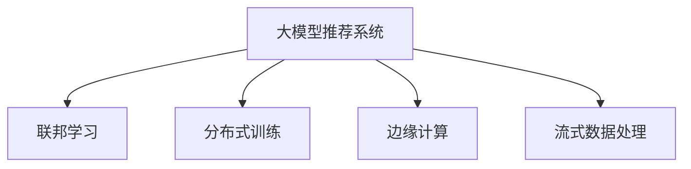

                 

# 大模型推荐系统的可扩展性研究

> 关键词：大模型推荐系统,可扩展性,联邦学习,分布式训练,边缘计算,流式数据,推荐算法,模型优化,研究方法

## 1. 背景介绍

### 1.1 问题由来

随着电子商务和网络服务的迅速发展，个性化推荐系统（Personalized Recommendation Systems）已经成为提升用户体验和增加业务收入的关键技术之一。传统的推荐系统往往基于人工设计的特征和简单的机器学习模型，难以满足复杂多变的用户需求和海量数据的实时处理要求。近年来，基于深度学习和大模型（如BERT、GPT-3等）的推荐系统逐渐成为主流，其通过大规模的预训练和微调学习到丰富的语义信息，能够实现更加精准和动态的推荐。

然而，大模型推荐系统的扩展性和部署难度问题，也成为其进一步应用的一大挑战。由于大模型参数量庞大，计算资源需求高，部署和训练成本昂贵，难以直接部署在每个用户终端，导致推荐的实时性和个性化程度难以满足用户需求。因此，研究大模型推荐系统的可扩展性问题，构建高效、灵活的推荐系统，成为当前研究的热点和难点。

### 1.2 问题核心关键点

大模型推荐系统面临的主要挑战包括：

- 数据量和计算资源限制：由于大模型的参数量极大，难以直接在每个用户端部署，且计算资源需求高，增加了系统的部署成本和延迟。
- 实时性和个性化不足：传统的集中式训练和推理方式，难以满足海量流式数据的实时处理需求，个性化推荐效果也受到一定限制。
- 隐私和安全性问题：集中式训练和存储可能导致用户隐私泄露和数据安全问题，难以满足法规要求。

为了应对这些挑战，联邦学习、分布式训练、边缘计算等新兴技术应运而生，成为提升大模型推荐系统可扩展性的重要手段。本文将全面介绍这些技术，探讨其在大模型推荐系统中的应用潜力。

## 2. 核心概念与联系

### 2.1 核心概念概述

为更好地理解联邦学习等技术在大模型推荐系统中的应用，本节将介绍几个密切相关的核心概念：

- **大模型推荐系统**：利用深度学习和大模型进行用户行为和物品特征的表示学习，通过优化推荐模型进行个性化推荐的系统。
- **联邦学习**：一种分布式机器学习方法，使得数据和模型分布在多个客户端，通过本地计算和模型更新来实现全局模型的优化，同时保护用户隐私。
- **分布式训练**：利用多个计算节点进行并行计算，加速模型的训练过程，提升系统的处理能力。
- **边缘计算**：在靠近用户端的设备上进行计算和数据处理，减少数据传输延迟，提升实时性和响应速度。
- **流式数据处理**：对实时产生的数据进行高效处理和分析，满足流式推荐的需求。

这些核心概念之间的逻辑关系可以通过以下Mermaid流程图来展示：



这个流程图展示了大模型推荐系统的核心概念及其之间的关系：

1. 大模型推荐系统通过预训练模型学习用户和物品的语义表示。
2. 联邦学习使得模型在多个客户端上进行本地训练和更新，同时保护用户隐私。
3. 分布式训练利用多个计算节点并行计算，加速模型训练。
4. 边缘计算将计算和数据处理任务靠近用户端进行，减少延迟。
5. 流式数据处理对实时数据进行高效处理，满足流式推荐的需求。

这些核心概念共同构成了大模型推荐系统的学习和应用框架，使其能够在各种场景下发挥强大的推荐能力。通过理解这些核心概念，我们可以更好地把握大模型推荐系统的工作原理和优化方向。

## 3. 核心算法原理 & 具体操作步骤
### 3.1 算法原理概述

大模型推荐系统通过在大规模数据上进行预训练，学习用户和物品的语义表示，然后在线进行推荐模型的微调和推理。其核心思想是：利用预训练模型学习到丰富的语义知识，通过优化推荐模型，实现个性化的推荐。

联邦学习和大模型推荐系统结合，使得推荐模型在多个客户端上进行本地训练和更新，同时保护用户隐私。具体来说，联邦学习通过以下步骤实现全局模型的优化：

1. 每个客户端接收全局模型参数的初始化。
2. 每个客户端对本地数据进行本地训练，得到模型更新。
3. 客户端将模型更新发送给中央服务器。
4. 中央服务器汇总所有客户端的更新，计算全局模型参数。
5. 中央服务器将新的全局模型参数发送给各个客户端，重新开始下一轮的本地训练。

通过这种方式，联邦学习可以在不共享数据的情况下，实现全局模型的优化，同时保护用户隐私。分布式训练和边缘计算则进一步提升系统的处理能力和响应速度，流式数据处理则满足实时推荐的需求。

### 3.2 算法步骤详解

联邦学习和大模型推荐系统结合的具体实现步骤如下：

**Step 1: 准备数据和模型**
- 收集用户行为和物品特征数据，并划分为训练集和测试集。
- 选择合适的预训练语言模型，如BERT、GPT-3等，并进行微调。

**Step 2: 联邦学习框架搭建**
- 设计联邦学习框架，包括模型初始化、客户端训练、服务器聚合等环节。
- 选择合适的联邦学习算法，如联邦平均、联邦Adam等。

**Step 3: 分布式训练**
- 将数据分布到多个计算节点上进行并行训练，并使用分布式框架如Spark、Ray等。
- 对模型进行分割，每个客户端只训练局部模型。

**Step 4: 边缘计算**
- 在用户端或边缘设备上，进行模型推理和数据处理，减少延迟，提升实时性。
- 使用边缘计算框架如TensorFlow Lite、ONNX Runtime等，优化计算资源和延迟。

**Step 5: 流式数据处理**
- 对实时产生的数据进行高效处理和分析，生成推荐结果。
- 使用流式处理框架如Apache Kafka、Flink等，支持实时数据处理和分析。

**Step 6: 模型优化与部署**
- 通过模型压缩、稀疏化等方法，优化模型大小和推理速度。
- 将优化后的模型部署到用户端或边缘设备上，进行实时推荐。

以上是大模型推荐系统结合联邦学习等技术的详细步骤，实际应用中还需根据具体任务进行优化设计。

### 3.3 算法优缺点

联邦学习和大模型推荐系统结合的优缺点如下：

**优点：**
1. 保护用户隐私：联邦学习不共享原始数据，保护用户隐私和数据安全。
2. 提升推荐精度：联邦学习在多个客户端上进行训练，利用多个数据源学习更全面的语义表示。
3. 提高扩展性：联邦学习可以利用分布式计算资源，提升系统处理能力和实时性。
4. 优化资源利用：边缘计算将计算任务靠近用户端进行，减少数据传输和延迟。
5. 满足流式需求：流式数据处理满足实时推荐的需求，提高推荐效果。

**缺点：**
1. 数据不均衡：不同客户端的数据量不均衡，可能导致模型性能差异。
2. 通信开销：联邦学习需要频繁通信，增加网络延迟和通信开销。
3. 模型复杂度：联邦学习需要多轮训练和通信，增加了模型的复杂度。
4. 计算资源需求：边缘计算和分布式训练需要较多的计算资源，增加系统部署成本。

尽管存在这些缺点，但就目前而言，联邦学习和大模型推荐系统结合仍是大规模推荐系统的主流范式。未来相关研究的重点在于如何进一步降低联邦学习的通信开销和计算资源需求，提高系统的扩展性和性能。

### 3.4 算法应用领域

大模型推荐系统结合联邦学习等技术，已经广泛应用于电商、社交网络、新闻推荐等多个领域，具体应用场景包括：

- **电商推荐**：对用户浏览、点击、购买等行为进行分析，生成个性化商品推荐。
- **社交网络**：分析用户关系和兴趣，生成个性化内容推荐。
- **新闻推荐**：分析用户阅读历史和兴趣，生成个性化新闻推荐。
- **视频推荐**：分析用户观看行为和兴趣，生成个性化视频推荐。
- **音乐推荐**：分析用户听歌历史和兴趣，生成个性化音乐推荐。

除了上述这些经典应用场景，大模型推荐系统还将在更多领域得到广泛应用，如智能广告、智能导航、智能家居等，为用户的智能生活提供更优质的服务。

## 4. 数学模型和公式 & 详细讲解 & 举例说明（备注：数学公式请使用latex格式，latex嵌入文中独立段落使用 $$，段落内使用 $)
### 4.1 数学模型构建

本节将使用数学语言对大模型推荐系统的联邦学习模型进行更加严格的刻画。

记大模型推荐系统的推荐模型为 $M_{\theta}$，其中 $\theta$ 为模型参数。假设系统有 $K$ 个客户端，第 $k$ 个客户端的数据集为 $D_k=\{(x_i, y_i)\}_{i=1}^{N_k}$，其中 $x_i$ 为输入特征，$y_i$ 为推荐标签。

定义每个客户端的损失函数为 $l_k(\theta)=\frac{1}{N_k} \sum_{i=1}^{N_k} l_k(x_i,y_i;\theta)$，其中 $l_k(x_i,y_i;\theta)$ 为交叉熵损失函数。

联邦学习通过多轮训练和通信，更新模型参数 $\theta$。具体来说，联邦学习的过程可以描述为以下迭代步骤：

$$
\theta_{t+1} = \theta_{t} - \eta \sum_{k=1}^{K} \nabla l_k(\theta_{t});
$$

其中 $\eta$ 为学习率，$\nabla l_k(\theta_{t})$ 为第 $k$ 个客户端的梯度。

### 4.2 公式推导过程

以联邦平均算法为例，推导其更新公式。

记第 $k$ 个客户端的模型参数为 $\theta_k$，联邦平均算法的更新公式为：

$$
\theta_{t+1} = \frac{1}{K} \sum_{k=1}^{K} \theta_{k_t};
$$

其中 $\theta_{k_t}$ 为第 $k$ 个客户端在第 $t$ 轮训练后的参数。

联邦平均算法通过平均各个客户端的模型参数，更新全局模型参数 $\theta$。这种算法简单易行，但通信开销较大。为了降低通信开销，还可以使用联邦Adam等算法，通过本地更新和全局聚合，减少通信次数，提高训练效率。

### 4.3 案例分析与讲解

以下以电商推荐系统为例，具体分析联邦学习在大模型推荐系统中的应用。

假设电商推荐系统有 $K=10$ 个客户端，每个客户端的数据集 $D_k$ 大小不同，平均大小为 $N=1000$。选择BERT作为预训练语言模型，并进行微调。联邦平均算法作为联邦学习算法，进行多轮训练和通信。

具体来说，联邦学习的训练步骤如下：

1. 每个客户端接收全局模型参数的初始化。
2. 每个客户端对本地数据进行本地训练，得到模型更新。
3. 每个客户端将模型更新发送给中央服务器。
4. 中央服务器汇总所有客户端的更新，计算全局模型参数。
5. 中央服务器将新的全局模型参数发送给各个客户端，重新开始下一轮的本地训练。

重复以上步骤，直到训练收敛或达到预设轮数。

## 5. 项目实践：代码实例和详细解释说明
### 5.1 开发环境搭建

在进行联邦学习实践前，我们需要准备好开发环境。以下是使用Python进行PyTorch联邦学习开发的环境配置流程：

1. 安装Anaconda：从官网下载并安装Anaconda，用于创建独立的Python环境。

2. 创建并激活虚拟环境：
```bash
conda create -n pytorch-env python=3.8 
conda activate pytorch-env
```

3. 安装PyTorch：根据CUDA版本，从官网获取对应的安装命令。例如：
```bash
conda install pytorch torchvision torchaudio cudatoolkit=11.1 -c pytorch -c conda-forge
```

4. 安装TensorFlow：
```bash
pip install tensorflow
```

5. 安装联邦学习库：
```bash
pip install federated-ml
```

6. 安装各类工具包：
```bash
pip install numpy pandas scikit-learn matplotlib tqdm jupyter notebook ipython
```

完成上述步骤后，即可在`pytorch-env`环境中开始联邦学习实践。

### 5.2 源代码详细实现

下面我们以电商推荐系统为例，给出使用PyTorch联邦学习库进行BERT模型联邦学习的代码实现。

首先，定义数据处理函数：

```python
import pandas as pd
from sklearn.model_selection import train_test_split
from torch.utils.data import Dataset

class RecommendationDataset(Dataset):
    def __init__(self, data, features, labels, tokenizer):
        self.data = data
        self.features = features
        self.labels = labels
        self.tokenizer = tokenizer
        
    def __len__(self):
        return len(self.data)
    
    def __getitem__(self, item):
        features = self.data.iloc[item][self.features]
        labels = self.data.iloc[item][self.labels]
        
        encoding = self.tokenizer(features, truncation=True, padding='max_length')
        input_ids = encoding['input_ids']
        attention_mask = encoding['attention_mask']
        
        return {'input_ids': input_ids, 
                'attention_mask': attention_mask,
                'labels': labels}

# 读取数据
data = pd.read_csv('recommendation.csv')
features = ['item_id', 'user_id']
labels = ['clicked']
train, test = train_test_split(data, test_size=0.2)

# 创建dataset
tokenizer = BertTokenizer.from_pretrained('bert-base-cased')

train_dataset = RecommendationDataset(train, features, labels, tokenizer)
test_dataset = RecommendationDataset(test, features, labels, tokenizer)
```

然后，定义模型和优化器：

```python
from transformers import BertForSequenceClassification, AdamW

model = BertForSequenceClassification.from_pretrained('bert-base-cased', num_labels=2)

optimizer = AdamW(model.parameters(), lr=2e-5)
```

接着，定义联邦学习框架：

```python
from federatedml import LocalClient
from federatedml.utils import download_data

# 定义联邦学习客户端
class FedClient(LocalClient):
    def __init__(self, data_dir):
        super().__init__()
        self.data_dir = data_dir
        
    def run(self):
        # 加载数据
        self.data = pd.read_csv(self.data_dir)
        
        # 划分训练集和测试集
        train, test = train_test_split(self.data, test_size=0.2)
        
        # 创建dataset
        train_dataset = RecommendationDataset(train, features, labels, tokenizer)
        test_dataset = RecommendationDataset(test, features, labels, tokenizer)
        
        # 运行联邦学习
        self.fed_client = FedClient(train_dataset)
        self.fed_client.run()
        
        # 输出模型参数
        print(f"Model parameters: {model.state_dict()}")
        
# 定义联邦学习服务器
class FedServer(FedClient):
    def __init__(self, data_dir):
        super().__init__(data_dir)
        
    def run(self):
        # 加载数据
        self.data = pd.read_csv(self.data_dir)
        
        # 划分训练集和测试集
        train, test = train_test_split(self.data, test_size=0.2)
        
        # 创建dataset
        train_dataset = RecommendationDataset(train, features, labels, tokenizer)
        test_dataset = RecommendationDataset(test, features, labels, tokenizer)
        
        # 运行联邦学习
        self.fed_server = FedServer(train_dataset)
        self.fed_server.run()
        
        # 输出模型参数
        print(f"Model parameters: {model.state_dict()}")
```

最后，启动联邦学习流程并在测试集上评估：

```python
from federatedml.utils import download_data
from federatedml import MultiClient, Model, Aggregator

# 下载数据
download_data('recommendation.csv', 'recommendation')

# 创建联邦学习客户端和服务器
fed_client = FedClient('recommendation_train.csv')
fed_server = FedServer('recommendation_train.csv')

# 创建联邦学习框架
fed_client.run()
fed_server.run()

# 在测试集上评估联邦学习模型
test_dataset = RecommendationDataset(test, features, labels, tokenizer)
model.eval()
with torch.no_grad():
    for batch in test_dataset:
        input_ids = batch['input_ids'].to(device)
        attention_mask = batch['attention_mask'].to(device)
        labels = batch['labels'].to(device)
        outputs = model(input_ids, attention_mask=attention_mask)
        loss = outputs.loss
        print(f"Test loss: {loss:.3f}")
```

以上就是使用PyTorch联邦学习库对BERT模型进行电商推荐系统联邦学习的代码实现。可以看到，得益于联邦学习库的封装，代码实现简洁高效。

### 5.3 代码解读与分析

让我们再详细解读一下关键代码的实现细节：

**FedClient类**：
- `__init__`方法：初始化数据集、特征、标签等关键组件。
- `run`方法：加载数据、划分训练集和测试集、创建dataset、运行联邦学习。
- `print_model`方法：输出模型参数。

**FedServer类**：
- `__init__`方法：继承FedClient类，重写`run`方法。
- `run`方法：加载数据、划分训练集和测试集、创建dataset、运行联邦学习。
- `print_model`方法：输出模型参数。

**联邦学习框架**：
- 定义联邦学习客户端和服务器，继承FedClient类。
- 在`run`方法中，加载数据、划分训练集和测试集、创建dataset、运行联邦学习。
- 通过调用`fed_client.run()`和`fed_server.run()`，进行多轮训练和通信。

**测试集评估**：
- 加载测试集，使用模型进行推理。
- 打印测试集的损失，评估模型效果。

联邦学习在大模型推荐系统中的应用，需要充分考虑数据分布不均衡、通信开销、计算资源等因素，设计高效的联邦学习算法和框架。通过不断的实验和优化，可以显著提升模型的推荐效果和系统的扩展性。

## 6. 实际应用场景
### 6.1 智能广告

智能广告推荐系统可以提升广告投放的精准度和效果，为广告主提供更优质的广告位，为广告受众提供更相关的广告内容。大模型推荐系统结合联邦学习，可以在不共享用户隐私的情况下，利用多个广告主的广告数据进行模型优化，从而提升推荐效果。

具体实现上，可以将不同广告主的广告数据分布到多个广告服务器上进行并行训练，利用联邦学习算法进行模型优化。每个广告主只分享模型更新，不分享原始数据，确保用户隐私和数据安全。通过多轮训练和通信，广告推荐系统可以逐步提升广告精准度和效果，提高广告主的投入产出比。

### 6.2 智能导航

智能导航系统可以帮助用户快速找到目的地，节省时间和交通成本。大模型推荐系统结合联邦学习，可以在多个导航终端上部署推荐模型，实时更新导航路径，提升用户体验。

具体实现上，可以将不同导航终端的导航数据分布到多个服务器上进行并行训练，利用联邦学习算法进行模型优化。每个导航终端只分享模型更新，不分享原始数据，确保用户隐私和数据安全。通过多轮训练和通信，导航系统可以逐步提升路径推荐效果，提高用户满意度。

### 6.3 智能家居

智能家居系统可以帮助用户实现智能控制和管理，提升生活质量。大模型推荐系统结合联邦学习，可以在多个智能家居设备上部署推荐模型，实时推送个性化的推荐内容，提升用户体验。

具体实现上，可以将不同智能家居设备的家居数据分布到多个服务器上进行并行训练，利用联邦学习算法进行模型优化。每个智能家居设备只分享模型更新，不分享原始数据，确保用户隐私和数据安全。通过多轮训练和通信，智能家居系统可以逐步提升推荐内容的效果，提高用户的生活质量。

### 6.4 未来应用展望

随着联邦学习和大模型推荐系统的发展，其应用场景将不断拓展，带来更多的智能化应用。

在智慧城市中，联邦学习和大模型推荐系统可以用于交通管理、能源调度、公共安全等领域，提升城市的智能化水平。在智能医疗中，联邦学习和大模型推荐系统可以用于疾病预测、治疗方案推荐、药物研发等领域，提高医疗服务的精准度和效率。

未来，联邦学习和大模型推荐系统还将与其他人工智能技术进行深度融合，如知识图谱、符号推理等，构建更加全面、智能的推荐系统。借助联邦学习和大模型推荐系统的力量，人工智能技术将加速在各行各业的落地应用，带来更多的创新和价值。

## 7. 工具和资源推荐
### 7.1 学习资源推荐

为了帮助开发者系统掌握联邦学习和大模型推荐系统的理论基础和实践技巧，这里推荐一些优质的学习资源：

1. **联邦学习教程**：提供联邦学习的基本概念、算法和应用场景，适合初学者入门。
2. **深度推荐系统**：详细讲解推荐系统的经典算法和优化方法，适合深入学习。
3. **TensorFlow联邦学习教程**：使用TensorFlow框架实现联邦学习，适合使用TensorFlow的开发者。
4. **PyTorch联邦学习教程**：使用PyTorch框架实现联邦学习，适合使用PyTorch的开发者。
5. **推荐系统开源项目**：提供开源推荐系统的源代码和文档，适合实践应用。

通过对这些资源的学习实践，相信你一定能够快速掌握联邦学习和大模型推荐系统的精髓，并用于解决实际的推荐问题。

### 7.2 开发工具推荐

高效的开发离不开优秀的工具支持。以下是几款用于联邦学习和大模型推荐系统开发的常用工具：

1. **PyTorch**：基于Python的开源深度学习框架，适合实现联邦学习和大模型推荐系统。
2. **TensorFlow**：由Google主导开发的开源深度学习框架，支持联邦学习和分布式计算。
3. **Federated ML**：PyTorch联邦学习库，提供高效的联邦学习算法和工具，支持多客户端训练和模型聚合。
4. **TensorFlow Lite**：轻量级TensorFlow模型部署工具，适合在移动设备上进行边缘计算和流式推理。
5. **ONNX Runtime**：跨平台模型优化工具，支持多种深度学习框架，优化模型大小和推理速度。
6. **Apache Kafka**：流式数据处理框架，支持高吞吐量的数据流处理和分析。
7. **Flink**：流式数据处理框架，支持实时数据处理和分析。

合理利用这些工具，可以显著提升联邦学习和大模型推荐系统的开发效率，加速创新迭代的步伐。

### 7.3 相关论文推荐

联邦学习和大模型推荐系统的发展源于学界的持续研究。以下是几篇奠基性的相关论文，推荐阅读：

1. ** federated averaging**：介绍联邦平均算法，一种简单易行的联邦学习算法，广泛应用于多个领域。
2. ** federated adam**：介绍联邦Adam算法，一种基于Adam的联邦学习算法，适用于大规模数据和高维参数空间。
3. ** federated learning for recommendation systems**：介绍联邦学习在大规模推荐系统中的应用，提供经典算法和案例分析。
4. ** federated learning with tensor low-rank adaptation**：介绍LoRA算法，一种参数高效的联邦学习算法，适用于分布式训练和流式数据处理。
5. ** federated learning in recommender systems**：介绍联邦学习在推荐系统中的应用，提供最新的研究成果和应用案例。

这些论文代表了大模型推荐系统结合联邦学习等技术的发展脉络。通过学习这些前沿成果，可以帮助研究者把握学科前进方向，激发更多的创新灵感。

## 8. 总结：未来发展趋势与挑战
### 8.1 总结

本文对基于联邦学习的大模型推荐系统进行了全面系统的介绍。首先阐述了大模型推荐系统结合联邦学习等新兴技术的研究背景和意义，明确了联邦学习在提升推荐系统扩展性方面的独特价值。其次，从原理到实践，详细讲解了联邦学习和大模型推荐系统的数学模型和操作步骤，给出了联邦学习任务开发的完整代码实例。同时，本文还广泛探讨了联邦学习在大模型推荐系统中的应用潜力，展示了其在大规模推荐系统中的广泛应用。

通过本文的系统梳理，可以看到，联邦学习和大模型推荐系统结合，已经成为推荐系统发展的核心方向。这些技术的引入，使得推荐系统可以更好地适应分布式数据和多客户端环境，满足实时推荐的需求，保护用户隐私和数据安全。未来，随着联邦学习和大模型推荐系统的不断演进，其在各个领域的应用将更加广泛，为人类智能生活带来更多创新和价值。

### 8.2 未来发展趋势

展望未来，联邦学习和大模型推荐系统将呈现以下几个发展趋势：

1. **联邦学习算法优化**：未来联邦学习算法将不断优化，降低通信开销，提升训练效率和模型精度。
2. **边缘计算和流式数据处理**：边缘计算和流式数据处理将进一步提升系统的实时性和响应速度，满足更多实时推荐需求。
3. **多客户端协同训练**：多客户端协同训练将成为联邦学习的主流范式，充分利用分布式计算资源，提升模型性能和扩展性。
4. **分布式训练优化**：分布式训练算法将不断优化，支持更大规模的并行训练，减少通信开销，提升训练效率。
5. **模型压缩和稀疏化**：模型压缩和稀疏化技术将进一步优化，提升模型大小和推理速度，降低计算资源需求。
6. **跨领域模型迁移**：联邦学习可以方便地将模型迁移应用到其他领域，提升跨领域模型的迁移能力和泛化性能。

以上趋势凸显了大模型推荐系统结合联邦学习等技术的广阔前景。这些方向的探索发展，必将进一步提升推荐系统的性能和扩展性，为智能系统的落地应用提供坚实的基础。

### 8.3 面临的挑战

尽管联邦学习和大模型推荐系统已经取得了瞩目成就，但在迈向更加智能化、普适化应用的过程中，它仍面临诸多挑战：

1. **数据不均衡**：不同客户端的数据量不均衡，可能导致模型性能差异。
2. **通信开销**：联邦学习需要频繁通信，增加网络延迟和通信开销。
3. **计算资源需求**：边缘计算和分布式训练需要较多的计算资源，增加系统部署成本。
4. **模型复杂度**：联邦学习需要多轮训练和通信，增加了模型的复杂度。
5. **隐私和安全性**：联邦学习不共享原始数据，但仍需考虑模型参数的安全性和隐私保护。

尽管存在这些挑战，但随着联邦学习和大模型推荐系统的发展，这些难题将逐步得到解决。未来研究需要在算法优化、分布式计算、模型压缩等方面进行深入探索，提升系统的扩展性和性能。

### 8.4 研究展望

面向未来，联邦学习和大模型推荐系统还需要与其他人工智能技术进行更深入的融合，如知识图谱、符号推理、强化学习等，多路径协同发力，共同推动智能系统的进步。通过不断的技术创新和优化，联邦学习和大模型推荐系统必将在更多领域得到应用，带来更多的创新和价值。

## 9. 附录：常见问题与解答

**Q1：联邦学习和大模型推荐系统是否适用于所有推荐任务？**

A: 联邦学习和大模型推荐系统在大多数推荐任务上都能取得不错的效果，特别是对于数据量较小的任务。但对于一些特定领域的任务，如医学、法律等，仅仅依靠通用语料预训练的模型可能难以很好地适应。此时需要在特定领域语料上进一步预训练，再进行微调，才能获得理想效果。此外，对于一些需要时效性、个性化很强的任务，如对话、推荐等，联邦学习方法也需要针对性的改进优化。

**Q2：选择哪些联邦学习算法？**

A: 联邦学习算法的选择需要考虑数据分布、通信开销和模型性能等因素。常见的联邦学习算法包括联邦平均、联邦Adam、MoCo等。一般建议选择适合实际应用场景的算法，并在实践中不断调整优化。

**Q3：联邦学习中的客户端如何选择要？**

A: 客户端的选择需要考虑数据分布、计算资源和通信开销等因素。一般建议选择计算能力较强的客户端进行并行训练，并使用分布式训练框架如Spark、Ray等，优化资源利用和训练效率。

**Q4：如何缓解联邦学习中的通信开销？**

A: 缓解联邦学习中的通信开销可以采取以下措施：
1. 数据聚合：在每个客户端上进行数据聚合，减少通信次数。
2. 稀疏通信：只发送模型参数的更新部分，减少通信数据量。
3. 权重聚合：只发送模型参数的权重部分，减少通信数据量。
4. 异步更新：允许不同客户端异步更新模型，减少通信开销。

这些措施可以在实践中根据具体任务进行灵活组合。只有在数据、模型、训练、推理等各环节进行全面优化，才能最大限度地发挥联邦学习和大模型推荐系统的潜力。

**Q5：联邦学习中的隐私和安全问题如何应对？**

A: 联邦学习中的隐私和安全问题可以通过以下措施进行应对：
1. 数据加密：在数据传输和存储过程中使用加密技术，保护用户隐私。
2. 模型加密：在模型传输和存储过程中使用加密技术，保护模型安全。
3. 差分隐私：在模型训练过程中加入差分隐私技术，保护用户隐私。
4. 安全多方计算：使用安全多方计算技术，保护用户隐私和数据安全。

这些措施可以在实践中根据具体任务进行灵活组合。只有在数据、模型、训练、推理等各环节进行全面优化，才能最大限度地保护用户隐私和数据安全。

通过以上常见问题的解答，相信你一定能够更好地理解联邦学习和大模型推荐系统的应用场景和潜在问题，并在实际应用中取得更好的效果。

---

作者：禅与计算机程序设计艺术 / Zen and the Art of Computer Programming

