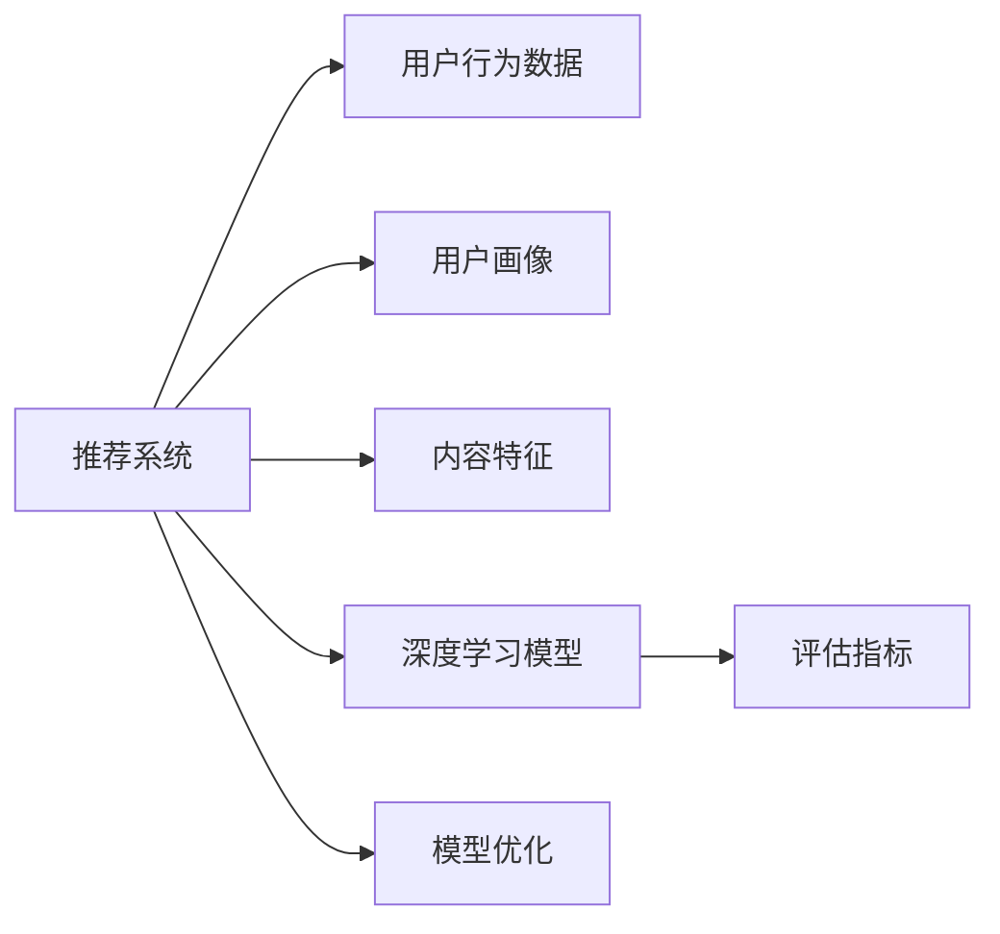

                 

## 1. 背景介绍

推荐系统在互联网生态中扮演着越来越重要的角色，从电商购物、新闻阅读到视频观影，推荐算法已成为用户与内容间最核心的交互纽带。在大数据和深度学习的助力下，推荐系统的性能不断提升，但模型的评估和优化也面临着新的挑战。从以预测准确率为主的传统评估体系，转向注重用户行为、时间序列、多样性、公平性等多维度评估，成为了推荐系统迈向高效、可靠、个性化的关键。

在推荐系统构建的各个环节中，模型评估体系的构建是重中之重。评估体系的合理性直接影响模型的优化方向和实际效果。大模型视角下的推荐系统评估体系，强调以大模型为核心，综合多模态数据和多维度评估指标，构建全面的模型评估体系。

本文将从大模型视角出发，系统介绍推荐系统模型评估体系构建的方法和实践，涵盖模型构建、数据处理、评估指标、实验设计、部署与优化等多个方面，为推荐系统开发者提供全方位的技术指导。

## 2. 核心概念与联系

### 2.1 核心概念概述

推荐系统通常分为内容推荐和协同过滤两种类型，分别针对不同类型的用户行为和数据特点，采用不同的推荐算法和评估方法。在大模型视角下，推荐系统评估体系构建主要包括以下几个核心概念：

- **推荐系统**：基于用户历史行为、内容特征等因素，为用户推荐个性化内容的技术。常见的推荐算法包括基于协同过滤、基于内容的推荐、混合推荐、深度学习推荐等。
- **用户行为数据**：用户在平台上的浏览、点击、购买、评分等行为数据，是推荐系统的重要输入。
- **用户画像**：通过对用户行为数据进行分析，构建用户画像，用于个性化推荐。
- **内容特征**：商品的标题、描述、标签、价格等信息，是内容推荐的基础。
- **深度学习模型**：包括大模型在内的深度学习模型，通过学习用户行为和内容特征，构建推荐模型。
- **评估指标**：包括预测准确率、覆盖率、个性化指标、多样性指标、公平性指标等，用于评估推荐系统性能。
- **模型优化**：通过调整模型参数、引入正则化、集成学习等方法，优化推荐模型，提升评估指标。

这些概念之间的逻辑关系可以通过以下Mermaid流程图来展示：



通过这个流程图，可以清晰地看到，推荐系统的核心工作是通过模型学习用户行为和内容特征，构建个性化推荐结果，并通过多维度评估指标，优化模型性能。

## 3. 核心算法原理 & 具体操作步骤
### 3.1 算法原理概述

在大模型视角下，推荐系统的模型构建和评估原理主要包括以下几个方面：

1. **数据预处理**：将用户行为数据和内容特征进行归一化、降维、特征提取等处理，以适合大模型的输入。
2. **特征工程**：通过用户画像、内容特征、时间序列等维度的特征构建，丰富模型输入。
3. **模型构建**：选择合适的大模型，如BERT、GPT等，并在其基础上进行微调或增量学习，构建推荐模型。
4. **评估指标设计**：根据推荐系统的应用场景，设计多维度评估指标，如预测准确率、覆盖率、个性化指标、多样性指标、公平性指标等。
5. **模型优化**：通过超参数调优、正则化、集成学习等方法，提升模型性能。
6. **模型部署**：将训练好的模型部署到推荐系统中，实时生成推荐结果。

### 3.2 算法步骤详解

基于大模型视角下的推荐系统模型评估体系构建，主要包括以下步骤：

**Step 1: 数据预处理**

推荐系统数据来源丰富多样，包括用户行为数据、商品数据、用户画像、内容特征等。需要将这些数据进行预处理，统一格式和尺度，以适合大模型输入。

- 数据清洗：去除噪声、处理缺失值、处理异常值等。
- 归一化：将不同量级的特征归一化到同一尺度，如Z-Score标准化、Min-Max标准化等。
- 特征降维：通过PCA、LDA等方法，减少特征维度，提升大模型处理效率。
- 特征工程：根据推荐系统的应用场景，选择和构建适合的特征，如用户画像、时间特征、内容特征等。

**Step 2: 模型构建**

选择合适的深度学习模型，如BERT、GPT等，并在其基础上进行微调或增量学习，构建推荐模型。

- 模型选择：根据任务特点，选择合适的大模型，如BERT、GPT、LoRA等。
- 微调与增量学习：在微调框架下，使用少量标注数据进行微调，或在大模型基础上进行增量学习，提升模型性能。
- 特征工程：将预处理后的数据输入模型，并设置合适的超参数，如学习率、批量大小、迭代轮数等。

**Step 3: 评估指标设计**

根据推荐系统的应用场景，设计多维度评估指标，如预测准确率、覆盖率、个性化指标、多样性指标、公平性指标等。

- 预测准确率：衡量模型预测结果与真实结果的匹配度。
- 覆盖率：衡量推荐结果覆盖用户历史行为的能力。
- 个性化指标：衡量推荐结果与用户偏好的一致性，如个性化交叉熵、个性化对数似然等。
- 多样性指标：衡量推荐结果的多样性，如Recall-DCG、Diversity Loss等。
- 公平性指标：衡量推荐结果的公平性，如公平性排序指标、公平性惩罚等。

**Step 4: 模型优化**

通过超参数调优、正则化、集成学习等方法，提升模型性能。

- 超参数调优：使用网格搜索、贝叶斯优化等方法，寻找最优超参数组合。
- 正则化：使用L1、L2正则、Dropout等方法，防止模型过拟合。
- 集成学习：通过Bagging、Boosting等方法，提升模型性能。

**Step 5: 模型部署**

将训练好的模型部署到推荐系统中，实时生成推荐结果。

- 模型导出：将训练好的模型导出为推理格式，如ONNX、TorchScript等。
- 部署集成：将导出模型集成到推荐系统中，并进行必要的接口调用和数据预处理。
- 实时推理：在推荐系统中实时输入用户行为数据和内容特征，调用模型生成推荐结果。

### 3.3 算法优缺点

大模型视角下的推荐系统模型评估体系构建，具有以下优点：

1. 提升模型精度：通过多维度评估指标设计，全面评估模型性能，提升推荐准确率。
2. 兼顾多样性和公平性：考虑个性化指标、多样性指标、公平性指标，提升推荐系统的全面性和公平性。
3. 兼容多种推荐算法：可以通过微调和增量学习，适应多种推荐算法，灵活应对不同应用场景。

但该方法也存在以下局限性：

1. 数据需求高：模型构建和评估需要大量的用户行为数据和内容特征，数据获取成本高。
2. 模型复杂度高：大模型的训练和推理复杂度较高，需要高性能算力支持。
3. 评估指标多样：多维度评估指标的设计和优化较为复杂，需进行多轮迭代优化。

尽管存在这些局限性，但就目前而言，大模型视角下的推荐系统评估体系构建仍是最为主流和有效的方法。未来相关研究的重点在于如何进一步降低数据需求，提高模型效率，同时兼顾模型性能和公平性等因素。

### 3.4 算法应用领域

大模型视角下的推荐系统模型评估体系构建，已在电商、新闻、视频等多个领域得到广泛应用。以下是几个典型的应用场景：

- **电商推荐系统**：通过分析用户历史浏览、购买记录，推荐个性化商品。利用多维度评估指标，如个性化交叉熵、召回率、点击率等，优化推荐模型。
- **新闻推荐系统**：根据用户阅读历史，推荐相关新闻文章。通过多样性指标、公平性指标等评估推荐结果的多样性和公平性。
- **视频推荐系统**：通过分析用户观看历史，推荐相关视频内容。利用个性化指标、覆盖率等评估推荐效果。

除了这些经典应用外，大模型视角下的推荐系统评估体系构建，还在社交网络、音乐推荐、旅游推荐等更多场景中得到应用，提升了用户的个性化体验和满意度。

## 4. 数学模型和公式 & 详细讲解 & 举例说明
### 4.1 数学模型构建

推荐系统模型评估体系构建，主要依赖于深度学习模型和大规模数据。以下介绍几个常用的数学模型：

1. **深度学习模型**：
   - **BERT**：使用Transformer架构，在大规模文本语料上进行预训练，可用于序列化推荐任务。
   - **GPT**：使用自回归模型，可用于生成式推荐任务。
   - **LoRA**：利用线性化技术，在大模型上实现参数高效的微调。

2. **评估指标**：
   - **预测准确率**：
     \[
     Precision = \frac{TP}{TP + FP}
     \]
     \[
     Recall = \frac{TP}{TP + FN}
     \]
   - **覆盖率**：
     \[
     Coverage = \frac{\#推荐结果}{\#历史行为}
     \]
   - **个性化指标**：
     \[
     Personalized Cross-Entropy = -\frac{1}{N}\sum_{i=1}^N\log\frac{e^{y_i\hat{y}_i}}{\sum_{k=1}^K e^{k\hat{y}_i}}
     \]
   - **多样性指标**：
     \[
     Diversity Loss = -\frac{1}{N}\sum_{i=1}^N\log\frac{e^{\hat{y}_i}}{\sum_{k=1}^K e^{k\hat{y}_i}}
     \]

### 4.2 公式推导过程

以BERT模型在电商推荐系统中的应用为例，推导预测准确率和个性化指标的计算公式。

**预测准确率**：
设推荐系统对商品$x$的预测结果为$\hat{y}(x)$，真实结果为$y(x)$，则预测准确率为：
\[
Precision = \frac{TP}{TP + FP} = \frac{\sum_{x\in Pos}I(y(x) = \hat{y}(x))}{\sum_{x\in Pos}I(y(x) = \hat{y}(x)) + \sum_{x\in Neg}I(y(x) = \hat{y}(x))}
\]

**个性化指标**：
设推荐系统对商品$x$的预测结果为$\hat{y}(x)$，真实结果为$y(x)$，则个性化指标为：
\[
Personalized Cross-Entropy = -\frac{1}{N}\sum_{i=1}^N\log\frac{e^{y_i\hat{y}_i}}{\sum_{k=1}^K e^{k\hat{y}_i}}
\]

通过上述公式，可以计算推荐系统的预测准确率和个性化指标，评估模型的性能。

### 4.3 案例分析与讲解

以下以一个电商推荐系统为例，展示推荐系统模型评估体系构建的完整流程。

**数据准备**：
收集用户历史浏览、购买记录，商品标题、描述、价格等数据。进行数据清洗、归一化、特征降维等预处理操作。

**模型构建**：
选择合适的BERT模型，在大规模语料上进行预训练，然后在电商数据上进行微调。通过调整超参数、引入正则化、集成学习等方法，优化模型性能。

**评估指标设计**：
设计多维度评估指标，如预测准确率、覆盖率、个性化指标、多样性指标、公平性指标等。

**模型优化**：
通过超参数调优、正则化、集成学习等方法，提升模型性能。

**模型部署**：
将训练好的模型导出为推理格式，部署到电商推荐系统中，实时生成推荐结果。

**评估与优化**：
在测试集上评估模型性能，根据评估结果进行模型优化，再次部署并测试，循环迭代，直至满足预设性能指标。

通过上述流程，可以构建一个高效、可靠、个性化的电商推荐系统，提升用户体验和满意度。

## 5. 项目实践：代码实例和详细解释说明
### 5.1 开发环境搭建

在进行推荐系统构建的实践前，需要准备相应的开发环境。以下是使用Python进行TensorFlow开发的环境配置流程：

1. 安装Anaconda：从官网下载并安装Anaconda，用于创建独立的Python环境。

2. 创建并激活虚拟环境：
```bash
conda create -n recommendation-env python=3.8 
conda activate recommendation-env
```

3. 安装TensorFlow：根据CUDA版本，从官网获取对应的安装命令。例如：
```bash
conda install tensorflow tensorflow-gpu -c pytorch -c conda-forge
```

4. 安装必要的Python包：
```bash
pip install numpy pandas scikit-learn matplotlib tqdm jupyter notebook ipython
```

5. 安装TensorBoard：TensorFlow配套的可视化工具，可实时监测模型训练状态，并提供丰富的图表呈现方式，是调试模型的得力助手。

完成上述步骤后，即可在`recommendation-env`环境中开始推荐系统构建的实践。

### 5.2 源代码详细实现

下面以电商推荐系统为例，给出使用TensorFlow构建推荐模型的PyTorch代码实现。

首先，定义推荐系统的数据处理函数：

```python
import tensorflow as tf
from tensorflow.keras import layers, models

def build_model(input_dim, hidden_dim, output_dim, learning_rate):
    model = models.Sequential()
    model.add(layers.Dense(hidden_dim, activation='relu', input_shape=(input_dim,)))
    model.add(layers.Dense(output_dim, activation='sigmoid'))
    model.compile(loss='binary_crossentropy', optimizer=tf.keras.optimizers.Adam(learning_rate), metrics=['accuracy'])
    return model
```

然后，定义推荐系统的训练和评估函数：

```python
def train_model(model, train_data, val_data, epochs, batch_size, learning_rate):
    model.fit(train_data, epochs=epochs, batch_size=batch_size, validation_data=val_data, callbacks=[tf.keras.callbacks.EarlyStopping(patience=2)])
    test_loss, test_acc = model.evaluate(test_data)
    return test_loss, test_acc

def evaluate_model(model, test_data, batch_size):
    test_loss, test_acc = model.evaluate(test_data, batch_size=batch_size)
    return test_loss, test_acc
```

接着，启动训练流程并在测试集上评估：

```python
from sklearn.model_selection import train_test_split

# 构建模型
input_dim = 10 # 假设特征维度为10
hidden_dim = 64 # 隐藏层维度为64
output_dim = 1 # 输出维度为1（二分类）
learning_rate = 0.001 # 学习率为0.001

model = build_model(input_dim, hidden_dim, output_dim, learning_rate)

# 准备数据
X_train, X_test, y_train, y_test = train_test_split(train_data, test_data, test_size=0.2, random_state=42)
X_train, X_val, y_train, y_val = train_test_split(X_train, y_train, test_size=0.2, random_state=42)

# 训练模型
epochs = 10 # 设置训练轮数为10
batch_size = 64 # 设置批次大小为64
test_loss, test_acc = train_model(model, X_train, val_data=y_val, epochs=epochs, batch_size=batch_size, learning_rate=learning_rate)

# 评估模型
test_loss, test_acc = evaluate_model(model, X_test, batch_size=batch_size)
print('Test Loss:', test_loss)
print('Test Accuracy:', test_acc)
```

以上就是使用TensorFlow对电商推荐系统进行构建和评估的完整代码实现。可以看到，通过TensorFlow的API，可以快速构建推荐模型并进行训练和评估。

### 5.3 代码解读与分析

让我们再详细解读一下关键代码的实现细节：

**build_model函数**：
- 构建一个包含一个隐藏层和一个输出层的神经网络模型。
- 使用ReLU作为激活函数，输出层使用Sigmoid函数，适合二分类任务。
- 使用Adam优化器，损失函数为二分类交叉熵。

**train_model函数**：
- 使用模型在训练数据上进行训练，并指定训练轮数、批次大小、验证数据等参数。
- 使用EarlyStopping回调函数，防止模型过拟合。
- 返回模型在测试集上的损失和准确率。

**evaluate_model函数**：
- 使用模型在测试数据上进行评估，并返回损失和准确率。

**训练流程**：
- 构建模型，准备数据
- 在训练集上训练模型，并在验证集上进行验证，防止过拟合
- 在测试集上评估模型性能
- 输出测试集上的损失和准确率

通过这些代码，可以简单高效地构建和评估一个基本的电商推荐系统。TensorFlow提供了丰富的API和工具，使得模型构建和训练过程更加便捷。

## 6. 实际应用场景
### 6.1 电商推荐系统

电商推荐系统是推荐系统中最常见的应用场景之一。通过分析用户历史浏览、购买记录，推荐个性化商品，提升用户体验和满意度。在大模型视角下，电商推荐系统可以利用多维度评估指标，如预测准确率、覆盖率、个性化指标、多样性指标、公平性指标等，优化推荐模型。

在技术实现上，可以收集用户历史行为数据，构建用户画像，并使用BERT模型进行微调，预测用户对商品的兴趣。通过设计多维度评估指标，如个性化交叉熵、召回率、点击率等，优化模型性能。同时，利用数据增强、对抗训练等方法，提高模型泛化能力和鲁棒性。

### 6.2 新闻推荐系统

新闻推荐系统根据用户阅读历史，推荐相关新闻文章。通过多维度评估指标，如多样性指标、公平性指标等，评估推荐结果的多样性和公平性。在大模型视角下，新闻推荐系统可以利用BERT模型进行微调，预测用户对新闻文章的兴趣，并结合多样性优化算法，提升推荐效果。

在技术实现上，可以收集用户阅读历史和新闻文章数据，构建用户画像，并使用BERT模型进行微调。通过多样性指标、公平性指标等评估推荐结果的多样性和公平性，优化模型性能。同时，利用对抗训练等方法，提高模型鲁棒性。

### 6.3 视频推荐系统

视频推荐系统通过分析用户观看历史，推荐相关视频内容。利用个性化指标、覆盖率等评估推荐效果。在大模型视角下，视频推荐系统可以利用GPT模型进行生成式推荐，提升推荐多样性和个性化。

在技术实现上，可以收集用户观看历史和视频数据，构建用户画像，并使用GPT模型进行生成式推荐。通过个性化指标、覆盖率等评估推荐效果，优化模型性能。同时，利用对抗训练等方法，提高模型鲁棒性。

## 7. 工具和资源推荐
### 7.1 学习资源推荐

为了帮助开发者系统掌握推荐系统构建的理论基础和实践技巧，这里推荐一些优质的学习资源：

1. 《推荐系统实践》：斯坦福大学开设的推荐系统课程，涵盖推荐算法、模型评估、实验设计等多个方面，适合系统学习。

2. 《深度学习推荐系统》：深入介绍深度学习在推荐系统中的应用，包括模型构建、评估指标、优化方法等。

3. 《TensorFlow推荐系统实战》：基于TensorFlow的推荐系统实战教程，适合动手实践。

4. 《PyTorch推荐系统》：基于PyTorch的推荐系统教程，适合使用PyTorch的开发者。

5. 《推荐系统评估指标》：系统介绍推荐系统常用评估指标的计算方法和应用场景，适合学习评估指标的设计和优化。

通过对这些资源的学习实践，相信你一定能够快速掌握推荐系统构建的技术细节，并用于解决实际的推荐问题。

### 7.2 开发工具推荐

高效的开发离不开优秀的工具支持。以下是几款用于推荐系统构建的常用工具：

1. TensorFlow：由Google主导开发的深度学习框架，生产部署方便，适合大规模工程应用。

2. PyTorch：基于Python的开源深度学习框架，灵活度高，适合研究和实验。

3. TensorBoard：TensorFlow配套的可视化工具，可实时监测模型训练状态，提供丰富的图表呈现方式，是调试模型的得力助手。

4. Weights & Biases：模型训练的实验跟踪工具，可以记录和可视化模型训练过程中的各项指标，方便对比和调优。

5. Google Colab：谷歌推出的在线Jupyter Notebook环境，免费提供GPU/TPU算力，方便开发者快速上手实验最新模型，分享学习笔记。

合理利用这些工具，可以显著提升推荐系统构建的开发效率，加快创新迭代的步伐。

### 7.3 相关论文推荐

推荐系统构建的深入研究离不开相关论文的指导。以下是几篇奠基性的相关论文，推荐阅读：

1. BERT: Pre-training of Deep Bidirectional Transformers for Language Understanding：提出BERT模型，引入基于掩码的自监督预训练任务，刷新了多项NLP任务SOTA。

2. DeepFM: A Factorization-Machine Based Neural Network for CTR Prediction：提出DeepFM模型，结合深度学习和FM模型，提升推荐系统性能。

3. Multi-Task Learning from Data of All Formats：提出多任务学习框架，结合多种数据形式，提升推荐系统效果。

4. Online Learning for Matrix Factorization Factorization Machines：提出在线学习算法，提升推荐系统实时更新能力。

5. A Decentralized Learning Framework for Recommendation System：提出分布式学习框架，提升推荐系统扩展性。

这些论文代表了大模型视角下推荐系统构建的理论前沿，通过学习这些前沿成果，可以帮助研究者把握学科前进方向，激发更多的创新灵感。

## 8. 总结：未来发展趋势与挑战
### 8.1 总结

本文从大模型视角出发，系统介绍了推荐系统模型评估体系的构建方法。通过数据预处理、模型构建、评估指标设计、模型优化、模型部署等环节，构建了一个全面的推荐系统模型评估体系。

通过本文的系统梳理，可以看到，大模型视角下的推荐系统评估体系构建，正成为推荐系统构建的重要范式，极大地拓展了推荐模型的应用边界，催生了更多的落地场景。未来，伴随深度学习模型和大规模数据的不断演进，推荐系统模型评估体系也将不断进步，为推荐系统提供更全面、高效、可靠的评估手段。

### 8.2 未来发展趋势

展望未来，推荐系统模型评估体系将呈现以下几个发展趋势：

1. 数据需求降低。通过数据增强、对抗训练等方法，可以进一步降低推荐系统对数据量的依赖，提升模型的泛化能力。

2. 模型复杂度提升。深度学习模型的复杂度将持续提升，带动推荐系统模型的性能提升。

3. 模型公平性增强。推荐系统模型将更加注重公平性，防止数据偏见和算法歧视。

4. 模型可解释性提升。推荐系统模型的决策过程将更加透明和可解释，便于理解和调试。

5. 实时性要求提高。随着推荐系统应用场景的多样化，实时性和动态性将成为关键指标。

6. 跨模态融合增强。推荐系统将更加注重跨模态数据融合，提升推荐结果的多样性和精准性。

以上趋势凸显了推荐系统模型评估体系的广阔前景。这些方向的探索发展，必将进一步提升推荐系统的性能和应用范围，为推荐系统构建提供更全面、高效、可靠的评估手段。

### 8.3 面临的挑战

尽管推荐系统模型评估体系已经取得了瞩目成就，但在迈向更加智能化、普适化应用的过程中，它仍面临着诸多挑战：

1. 数据质量要求高。推荐系统对数据质量的要求非常高，需要大量的高质量标注数据，数据获取成本高。

2. 模型复杂度高。深度学习模型的复杂度较高，训练和推理过程耗时较长，需要高性能算力支持。

3. 模型可解释性不足。推荐系统模型决策过程较为复杂，难以解释其内部工作机制和决策逻辑，存在一定的黑盒问题。

4. 实时性要求高。推荐系统需要实时响应用户请求，对模型的计算效率要求较高。

5. 跨模态数据融合难度大。推荐系统需要融合多种数据类型，如文本、图像、音频等，数据格式不一致，融合难度大。

尽管存在这些挑战，但就目前而言，大模型视角下的推荐系统模型评估体系构建仍是最为主流和有效的方法。未来相关研究的重点在于如何进一步降低数据需求，提高模型效率，同时兼顾模型性能和公平性等因素。

### 8.4 研究展望

面向未来，推荐系统模型评估体系的研究需要从以下几个方面进行探索：

1. 数据增强与对抗训练。通过数据增强和对抗训练等方法，进一步降低推荐系统对数据量的依赖，提升模型的泛化能力和鲁棒性。

2. 多任务学习与联合训练。利用多任务学习框架，结合多种任务进行联合训练，提升推荐系统的效果。

3. 公平性优化与算法设计。引入公平性优化算法，提升推荐系统的公平性，防止数据偏见和算法歧视。

4. 可解释性增强与透明化。通过模型解释方法，提升推荐系统模型的可解释性和透明性。

5. 实时性与动态性提升。优化推荐系统模型的实时性和动态性，提升用户体验。

6. 跨模态数据融合与协同学习。利用跨模态数据融合和协同学习方法，提升推荐系统模型的多样性和精准性。

这些研究方向将推动推荐系统模型评估体系迈向更高的台阶，为构建高效、可靠、公平、可解释的推荐系统提供新的技术路径。只有勇于创新、敢于突破，才能不断拓展推荐系统模型的边界，让推荐系统更好地服务于用户。

## 9. 附录：常见问题与解答

**Q1：推荐系统评估指标如何设计？**

A: 推荐系统评估指标的设计需要根据具体的应用场景进行定制。常见的评估指标包括预测准确率、覆盖率、个性化指标、多样性指标、公平性指标等。在设计评估指标时，需要考虑数据分布、模型类型、应用场景等多方面因素，并进行多轮迭代优化。

**Q2：推荐系统模型如何优化？**

A: 推荐系统模型的优化方法包括超参数调优、正则化、集成学习等。超参数调优可以通过网格搜索、贝叶斯优化等方法进行，选择合适的超参数组合。正则化可以通过L1、L2正则、Dropout等方法防止模型过拟合。集成学习可以通过Bagging、Boosting等方法提升模型性能。

**Q3：推荐系统模型如何部署？**

A: 推荐系统模型的部署需要考虑模型裁剪、量化加速、服务化封装等技术。模型裁剪可以去除不必要的层和参数，减小模型尺寸，加快推理速度。量化加速可以将浮点模型转为定点模型，压缩存储空间，提高计算效率。服务化封装可以将模型封装为标准化服务接口，便于集成调用。

**Q4：推荐系统模型如何实时更新？**

A: 推荐系统模型的实时更新可以通过在线学习算法实现。在线学习算法可以根据新数据实时更新模型，避免模型退化。常见的在线学习算法包括AdaGrad、Adam、SGD等。

**Q5：推荐系统模型如何考虑公平性？**

A: 推荐系统模型考虑公平性可以通过公平性优化算法实现。公平性优化算法可以根据不同的用户特征，调整推荐结果，避免偏见和歧视。常见的公平性优化算法包括Fairness-aware Recommender、Fair-ML等。

通过这些问答，可以更好地理解推荐系统模型评估体系构建的方法和实践，提升推荐系统模型的性能和效果。

