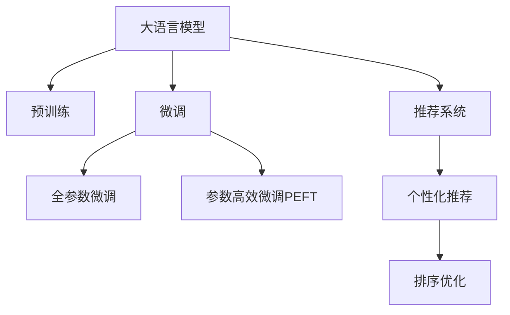

                 

# 大模型驱动的电商个性化活动设计与优化

在数字化转型的浪潮中，电商行业以其快速发展和巨大市场潜力，成为全球数字经济的重要组成部分。个性化推荐、精准营销等技术在电商平台的广泛应用，不仅提升了用户体验，也极大促进了销售增长。随着技术的发展，大语言模型（Large Language Models, LLMs）在电商领域的应用日益深入，成为电商个性化活动设计和优化的强大工具。本文将从大模型驱动的电商个性化活动设计与优化这一主题出发，深度剖析其实现原理、操作步骤及优缺点，并给出具体的数学模型和代码实现。同时，还将介绍实际应用场景、工具和资源推荐，最后总结未来发展趋势与挑战。

## 1. 背景介绍

### 1.1 问题由来
电商行业竞争激烈，用户选择众多。如何精准定位用户需求，提供个性化的商品推荐和服务，是电商平台提升用户体验和转化率的关键。传统的个性化推荐系统往往依赖于历史行为数据，难以覆盖长尾商品和新手用户。大语言模型通过在大规模无标签文本数据上进行预训练，具备强大的语义理解和生成能力，能够有效弥补传统推荐系统的不足，实现更精准、高效的个性化服务。

### 1.2 问题核心关键点
大模型驱动的电商个性化活动设计和优化，核心在于利用预训练语言模型理解用户查询，提供相关商品推荐。该方法主要包括以下关键环节：
- 用户查询理解：通过大模型分析用户查询语义，提取关键词和意图。
- 商品推荐生成：基于用户查询，生成个性化商品推荐列表。
- 结果排序优化：对推荐结果进行排序，提升用户满意度。

本文将系统介绍大模型在电商个性化推荐中的关键技术和操作步骤，分析其优缺点，并探讨其在不同领域的实际应用。

## 2. 核心概念与联系

### 2.1 核心概念概述

为更好地理解大模型驱动的电商个性化活动设计，本节将介绍几个密切相关的核心概念：

- 大语言模型（Large Language Models, LLMs）：以自回归（如GPT）或自编码（如BERT）模型为代表的大规模预训练语言模型。通过在大规模无标签文本语料上进行预训练，学习通用的语言表示，具备强大的语言理解和生成能力。
- 预训练(Pre-training)：指在大规模无标签文本语料上，通过自监督学习任务训练通用语言模型的过程。常见的预训练任务包括言语建模、掩码语言模型等。
- 微调(Fine-tuning)：指在预训练模型的基础上，使用下游任务的少量标注数据，通过有监督学习优化模型在该任务上的性能。通常只需要调整顶层分类器或解码器，并以较小的学习率更新全部或部分的模型参数。
- 迁移学习(Transfer Learning)：指将一个领域学习到的知识，迁移应用到另一个不同但相关的领域的学习范式。大模型的预训练-微调过程即是一种典型的迁移学习方式。
- 推荐系统(Recommender System)：通过用户行为数据或内容数据，利用机器学习算法为用户推荐商品或内容的技术。电商个性化推荐系统是其重要应用之一。

这些核心概念之间的逻辑关系可以通过以下Mermaid流程图来展示：



这个流程图展示了大语言模型的核心概念及其之间的关系：

1. 大语言模型通过预训练获得基础能力。
2. 微调是对预训练模型进行任务特定的优化，可以分为全参数微调和参数高效微调（PEFT）。
3. 推荐系统是连接预训练模型与电商推荐任务的桥梁，可以通过微调或结合其他技术实现。
4. 排序优化是电商推荐系统的重要环节，提升推荐的准确性和用户满意度。

这些概念共同构成了大模型在电商个性化推荐中的学习和应用框架，使其能够更好地适应电商业务场景，提供个性化推荐服务。

## 3. 核心算法原理 & 具体操作步骤
### 3.1 算法原理概述

大模型驱动的电商个性化活动设计和优化，本质上是将大语言模型应用于电商推荐系统，通过理解用户查询，生成个性化推荐列表的过程。其核心思想是：将预训练的大语言模型视作一个强大的"文本生成器"，通过下游任务的少量标注数据进行微调，使得模型能够根据用户查询，生成相关商品推荐。

形式化地，假设预训练模型为 $M_{\theta}$，其中 $\theta$ 为预训练得到的模型参数。给定电商推荐任务 $T$ 的标注数据集 $D=\{(x_i,y_i)\}_{i=1}^N, x_i \in \mathbb{R}^d, y_i \in \{1,...,K\}$，微调的目标是找到新的模型参数 $\hat{\theta}$，使得：

$$
\hat{\theta}=\mathop{\arg\min}_{\theta} \mathcal{L}(M_{\theta},D)
$$

其中 $\mathcal{L}$ 为针对任务 $T$ 设计的损失函数，用于衡量模型预测输出与真实标签之间的差异。常见的损失函数包括交叉熵损失、均方误差损失等。

通过梯度下降等优化算法，微调过程不断更新模型参数 $\theta$，最小化损失函数 $\mathcal{L}$，使得模型输出逼近真实标签。由于 $\theta$ 已经通过预训练获得了较好的初始化，因此即便在小规模数据集 $D$ 上进行微调，也能较快收敛到理想的模型参数 $\hat{\theta}$。

### 3.2 算法步骤详解

基于大语言模型驱动的电商个性化活动设计和优化，一般包括以下几个关键步骤：

**Step 1: 准备预训练模型和数据集**
- 选择合适的预训练语言模型 $M_{\theta}$ 作为初始化参数，如 BERT、GPT等。
- 准备电商推荐任务 $T$ 的标注数据集 $D$，划分为训练集、验证集和测试集。一般要求标注数据与预训练数据的分布不要差异过大。

**Step 2: 添加任务适配层**
- 根据电商推荐任务类型，在预训练模型顶层设计合适的输出层和损失函数。
- 对于分类任务，通常在顶层添加线性分类器和交叉熵损失函数。
- 对于生成任务，通常使用语言模型的解码器输出概率分布，并以负对数似然为损失函数。

**Step 3: 设置微调超参数**
- 选择合适的优化算法及其参数，如 AdamW、SGD 等，设置学习率、批大小、迭代轮数等。
- 设置正则化技术及强度，包括权重衰减、Dropout、Early Stopping 等。
- 确定冻结预训练参数的策略，如仅微调顶层，或全部参数都参与微调。

**Step 4: 执行梯度训练**
- 将训练集数据分批次输入模型，前向传播计算损失函数。
- 反向传播计算参数梯度，根据设定的优化算法和学习率更新模型参数。
- 周期性在验证集上评估模型性能，根据性能指标决定是否触发 Early Stopping。
- 重复上述步骤直到满足预设的迭代轮数或 Early Stopping 条件。

**Step 5: 测试和部署**
- 在测试集上评估微调后模型 $M_{\hat{\theta}}$ 的性能，对比微调前后的精度提升。
- 使用微调后的模型对新商品进行推荐，集成到电商推荐系统中。
- 持续收集新的用户行为数据，定期重新微调模型，以适应数据分布的变化。

以上是基于大语言模型驱动的电商个性化活动设计和优化的一般流程。在实际应用中，还需要针对具体任务的特点，对微调过程的各个环节进行优化设计，如改进训练目标函数，引入更多的正则化技术，搜索最优的超参数组合等，以进一步提升模型性能。

### 3.3 算法优缺点

大模型驱动的电商个性化活动设计和优化方法具有以下优点：
1. 提升个性化推荐精度：大语言模型通过理解用户查询，生成相关商品推荐，大幅提升推荐系统的个性化能力。
2. 适应性强：大语言模型可以适应不同领域的电商任务，支持多品类商品推荐。
3. 泛化能力强：大模型在大量无标签文本数据上进行预训练，具备较强的泛化能力，可以在小规模标注数据下仍取得良好效果。
4. 可扩展性强：大语言模型通过微调，支持动态更新模型参数，适应数据分布变化。

同时，该方法也存在一定的局限性：
1. 对标注数据依赖高：电商推荐任务需要大量标注数据进行微调，标注成本较高。
2. 实时性问题：大模型推理速度较慢，可能影响实时推荐系统的响应速度。
3. 计算资源消耗大：大语言模型参数量巨大，对计算资源和存储资源要求高。
4. 可解释性差：大模型推荐过程难以解释，用户难以理解其推荐依据。

尽管存在这些局限性，但就目前而言，大语言模型驱动的电商个性化活动设计和优化方法仍是一种高效、先进的推荐系统设计范式，广泛应用于电商推荐系统。未来相关研究的重点在于如何进一步降低微调对标注数据的依赖，提高模型的实时性，优化计算资源消耗，同时兼顾可解释性和用户体验。

### 3.4 算法应用领域

大语言模型驱动的电商个性化活动设计和优化方法，在电商推荐系统中的应用非常广泛，覆盖了几乎所有常见的电商推荐场景，例如：

- 商品推荐：基于用户查询生成个性化商品推荐列表。
- 相关商品推荐：生成与用户已购或浏览商品相关的商品列表。
- 新品推荐：根据用户兴趣推荐新上市商品。
- 用户画像：分析用户历史行为数据，生成用户兴趣标签和画像。
- 活动推荐：推荐用户参与优惠券、折扣活动等电商活动。

除了上述这些经典应用外，大语言模型还可用于创新性地解决更复杂的电商问题，如跨品类商品推荐、用户行为预测、个性化视频推荐等，为电商推荐系统带来新的突破。

## 4. 数学模型和公式 & 详细讲解 & 举例说明
### 4.1 数学模型构建

本节将使用数学语言对大语言模型驱动的电商个性化推荐过程进行更加严格的刻画。

记预训练语言模型为 $M_{\theta}$，其中 $\theta$ 为模型参数。假设电商推荐任务为 $T$，训练集为 $D=\{(x_i,y_i)\}_{i=1}^N$，其中 $x_i$ 为用户查询，$y_i$ 为相关商品列表。

定义模型 $M_{\theta}$ 在数据样本 $(x_i,y_i)$ 上的损失函数为 $\ell(M_{\theta}(x_i),y_i)$，则在数据集 $D$ 上的经验风险为：

$$
\mathcal{L}(\theta) = \frac{1}{N} \sum_{i=1}^N \ell(M_{\theta}(x_i),y_i)
$$

微调的优化目标是最小化经验风险，即找到最优参数：

$$
\theta^* = \mathop{\arg\min}_{\theta} \mathcal{L}(\theta)
$$

在实践中，我们通常使用基于梯度的优化算法（如SGD、Adam等）来近似求解上述最优化问题。设 $\eta$ 为学习率，$\lambda$ 为正则化系数，则参数的更新公式为：

$$
\theta \leftarrow \theta - \eta \nabla_{\theta}\mathcal{L}(\theta) - \eta\lambda\theta
$$

其中 $\nabla_{\theta}\mathcal{L}(\theta)$ 为损失函数对参数 $\theta$ 的梯度，可通过反向传播算法高效计算。

### 4.2 公式推导过程

以下我们以电商推荐任务为例，推导交叉熵损失函数及其梯度的计算公式。

假设模型 $M_{\theta}$ 在输入 $x_i$ 上的输出为 $\hat{y}=M_{\theta}(x_i) \in \{1,...,K\}$，表示模型预测的相关商品列表编号。真实标签 $y_i \in \{1,...,K\}$。则二分类交叉熵损失函数定义为：

$$
\ell(M_{\theta}(x_i),y_i) = -[y_i\log \hat{y} + (1-y_i)\log (1-\hat{y})]
$$

将其代入经验风险公式，得：

$$
\mathcal{L}(\theta) = -\frac{1}{N}\sum_{i=1}^N [y_i\log M_{\theta}(x_i)+(1-y_i)\log(1-M_{\theta}(x_i))]
$$

根据链式法则，损失函数对参数 $\theta_k$ 的梯度为：

$$
\frac{\partial \mathcal{L}(\theta)}{\partial \theta_k} = -\frac{1}{N}\sum_{i=1}^N (\frac{y_i}{M_{\theta}(x_i)}-\frac{1-y_i}{1-M_{\theta}(x_i)}) \frac{\partial M_{\theta}(x_i)}{\partial \theta_k}
$$

其中 $\frac{\partial M_{\theta}(x_i)}{\partial \theta_k}$ 可进一步递归展开，利用自动微分技术完成计算。

在得到损失函数的梯度后，即可带入参数更新公式，完成模型的迭代优化。重复上述过程直至收敛，最终得到适应电商推荐任务的最优模型参数 $\theta^*$。

## 5. 项目实践：代码实例和详细解释说明
### 5.1 开发环境搭建

在进行电商推荐系统微调实践前，我们需要准备好开发环境。以下是使用Python进行PyTorch开发的环境配置流程：

1. 安装Anaconda：从官网下载并安装Anaconda，用于创建独立的Python环境。

2. 创建并激活虚拟环境：
```bash
conda create -n pytorch-env python=3.8 
conda activate pytorch-env
```

3. 安装PyTorch：根据CUDA版本，从官网获取对应的安装命令。例如：
```bash
conda install pytorch torchvision torchaudio cudatoolkit=11.1 -c pytorch -c conda-forge
```

4. 安装Transformer库：
```bash
pip install transformers
```

5. 安装各类工具包：
```bash
pip install numpy pandas scikit-learn matplotlib tqdm jupyter notebook ipython
```

完成上述步骤后，即可在`pytorch-env`环境中开始电商推荐系统的微调实践。

### 5.2 源代码详细实现

下面我们以电商商品推荐任务为例，给出使用Transformers库对BERT模型进行微调的PyTorch代码实现。

首先，定义电商商品推荐任务的数据处理函数：

```python
from transformers import BertTokenizer
from torch.utils.data import Dataset
import torch

class ProductRecommendationDataset(Dataset):
    def __init__(self, queries, products, tokenizer, max_len=128):
        self.queries = queries
        self.products = products
        self.tokenizer = tokenizer
        self.max_len = max_len
        
    def __len__(self):
        return len(self.queries)
    
    def __getitem__(self, item):
        query = self.queries[item]
        product_ids = self.products[item]  # 商品ID列表
        
        encoding = self.tokenizer(query, return_tensors='pt', max_length=self.max_len, padding='max_length', truncation=True)
        input_ids = encoding['input_ids'][0]
        attention_mask = encoding['attention_mask'][0]
        
        # 将商品ID列表转换为向量表示
        product_ids = [product_id + 1 for product_id in product_ids]  # 假设商品ID从0开始，+1从1开始
        product_ids = [0] * (self.max_len - len(product_ids)) + product_ids
        labels = torch.tensor(product_ids, dtype=torch.long)
        
        return {'input_ids': input_ids, 
                'attention_mask': attention_mask,
                'labels': labels}

# 商品ID与索引的映射
product_id2idx = {product_id: idx for idx, product_id in enumerate(range(1, 1000))}

# 创建dataset
tokenizer = BertTokenizer.from_pretrained('bert-base-cased')

train_dataset = ProductRecommendationDataset(train_queries, train_products, tokenizer)
dev_dataset = ProductRecommendationDataset(dev_queries, dev_products, tokenizer)
test_dataset = ProductRecommendationDataset(test_queries, test_products, tokenizer)
```

然后，定义模型和优化器：

```python
from transformers import BertForTokenClassification, AdamW

model = BertForTokenClassification.from_pretrained('bert-base-cased', num_labels=1000)

optimizer = AdamW(model.parameters(), lr=2e-5)
```

接着，定义训练和评估函数：

```python
from torch.utils.data import DataLoader
from tqdm import tqdm
from sklearn.metrics import classification_report

device = torch.device('cuda') if torch.cuda.is_available() else torch.device('cpu')
model.to(device)

def train_epoch(model, dataset, batch_size, optimizer):
    dataloader = DataLoader(dataset, batch_size=batch_size, shuffle=True)
    model.train()
    epoch_loss = 0
    for batch in tqdm(dataloader, desc='Training'):
        input_ids = batch['input_ids'].to(device)
        attention_mask = batch['attention_mask'].to(device)
        labels = batch['labels'].to(device)
        model.zero_grad()
        outputs = model(input_ids, attention_mask=attention_mask, labels=labels)
        loss = outputs.loss
        epoch_loss += loss.item()
        loss.backward()
        optimizer.step()
    return epoch_loss / len(dataloader)

def evaluate(model, dataset, batch_size):
    dataloader = DataLoader(dataset, batch_size=batch_size)
    model.eval()
    preds, labels = [], []
    with torch.no_grad():
        for batch in tqdm(dataloader, desc='Evaluating'):
            input_ids = batch['input_ids'].to(device)
            attention_mask = batch['attention_mask'].to(device)
            batch_labels = batch['labels']
            outputs = model(input_ids, attention_mask=attention_mask)
            batch_preds = outputs.logits.argmax(dim=2).to('cpu').tolist()
            batch_labels = batch_labels.to('cpu').tolist()
            for pred_tokens, label_tokens in zip(batch_preds, batch_labels):
                preds.append(pred_tokens[:len(label_tokens)])
                labels.append(label_tokens)
                
    print(classification_report(labels, preds))
```

最后，启动训练流程并在测试集上评估：

```python
epochs = 5
batch_size = 16

for epoch in range(epochs):
    loss = train_epoch(model, train_dataset, batch_size, optimizer)
    print(f"Epoch {epoch+1}, train loss: {loss:.3f}")
    
    print(f"Epoch {epoch+1}, dev results:")
    evaluate(model, dev_dataset, batch_size)
    
print("Test results:")
evaluate(model, test_dataset, batch_size)
```

以上就是使用PyTorch对BERT进行电商商品推荐任务微调的完整代码实现。可以看到，得益于Transformers库的强大封装，我们可以用相对简洁的代码完成BERT模型的加载和微调。

### 5.3 代码解读与分析

让我们再详细解读一下关键代码的实现细节：

**ProductRecommendationDataset类**：
- `__init__`方法：初始化查询、商品ID、分词器等关键组件。
- `__len__`方法：返回数据集的样本数量。
- `__getitem__`方法：对单个样本进行处理，将查询输入编码为token ids，将商品ID转换为数字，并对其进行定长padding，最终返回模型所需的输入。

**product_id2idx字典**：
- 定义了商品ID与索引之间的映射关系，用于将商品ID列表转换为向量表示，作为模型标签。

**训练和评估函数**：
- 使用PyTorch的DataLoader对数据集进行批次化加载，供模型训练和推理使用。
- 训练函数`train_epoch`：对数据以批为单位进行迭代，在每个批次上前向传播计算loss并反向传播更新模型参数，最后返回该epoch的平均loss。
- 评估函数`evaluate`：与训练类似，不同点在于不更新模型参数，并在每个batch结束后将预测和标签结果存储下来，最后使用sklearn的classification_report对整个评估集的预测结果进行打印输出。

**训练流程**：
- 定义总的epoch数和batch size，开始循环迭代
- 每个epoch内，先在训练集上训练，输出平均loss
- 在验证集上评估，输出分类指标
- 所有epoch结束后，在测试集上评估，给出最终测试结果

可以看到，PyTorch配合Transformers库使得BERT微调的代码实现变得简洁高效。开发者可以将更多精力放在数据处理、模型改进等高层逻辑上，而不必过多关注底层的实现细节。

当然，工业级的系统实现还需考虑更多因素，如模型的保存和部署、超参数的自动搜索、更灵活的任务适配层等。但核心的微调范式基本与此类似。

## 6. 实际应用场景
### 6.1 智能客服系统

基于大语言模型驱动的电商推荐技术，可以广泛应用于智能客服系统的构建。传统客服往往需要配备大量人力，高峰期响应缓慢，且一致性和专业性难以保证。而使用推荐系统辅助，可以自动推荐相关商品，提升客服效率和客户满意度。

在技术实现上，可以收集用户浏览、点击、购买等行为数据，提取商品标题、描述、标签等文本内容。将文本内容作为模型输入，推荐系统输出相关商品列表，供客服参考。对于用户提出的具体问题，推荐系统还可生成预置回复模板，进一步提升客服响应速度和准确性。

### 6.2 金融舆情监测

金融机构需要实时监测市场舆论动向，以便及时应对负面信息传播，规避金融风险。传统的人工监测方式成本高、效率低，难以应对网络时代海量信息爆发的挑战。基于大语言模型驱动的情感分析技术，为金融舆情监测提供了新的解决方案。

具体而言，可以收集金融领域相关的新闻、报道、评论等文本数据，并对其进行情感标注。在此基础上对预训练语言模型进行微调，使其能够自动判断文本情感倾向，实时监测舆情变化。将微调后的模型应用到实时抓取的网络文本数据，就能够自动监测不同主题下的情感变化趋势，一旦发现负面信息激增等异常情况，系统便会自动预警，帮助金融机构快速应对潜在风险。

### 6.3 个性化推荐系统

当前的推荐系统往往只依赖用户的历史行为数据进行物品推荐，难以覆盖长尾商品和新手用户。基于大语言模型驱动的电商推荐系统，能够通过理解用户查询，生成相关商品推荐，弥补传统推荐系统的不足。

在技术实现上，可以收集用户浏览、点击、购买等行为数据，提取商品标题、描述、标签等文本内容。将文本内容作为模型输入，推荐系统输出相关商品列表，供用户选择。用户查询时，推荐系统还可自动生成商品展示页面，提高点击转化率。

### 6.4 未来应用展望

随着大语言模型和电商推荐系统的不断发展，基于微调范式将在更多领域得到应用，为电商推荐系统带来新的突破。

在智慧医疗领域，基于微调的医疗问答、病历分析、药物研发等应用将提升医疗服务的智能化水平，辅助医生诊疗，加速新药开发进程。

在智能教育领域，微调技术可应用于作业批改、学情分析、知识推荐等方面，因材施教，促进教育公平，提高教学质量。

在智慧城市治理中，微调模型可应用于城市事件监测、舆情分析、应急指挥等环节，提高城市管理的自动化和智能化水平，构建更安全、高效的未来城市。

此外，在企业生产、社会治理、文娱传媒等众多领域，基于大模型驱动的电商推荐系统也将不断涌现，为传统行业数字化转型升级提供新的技术路径。相信随着技术的日益成熟，微调方法将成为电商推荐系统的重要范式，推动电商推荐系统向更广阔的领域加速渗透。

## 7. 工具和资源推荐
### 7.1 学习资源推荐

为了帮助开发者系统掌握大语言模型驱动的电商推荐技术，这里推荐一些优质的学习资源：

1. 《Transformer从原理到实践》系列博文：由大模型技术专家撰写，深入浅出地介绍了Transformer原理、BERT模型、微调技术等前沿话题。

2. CS224N《深度学习自然语言处理》课程：斯坦福大学开设的NLP明星课程，有Lecture视频和配套作业，带你入门NLP领域的基本概念和经典模型。

3. 《Natural Language Processing with Transformers》书籍：Transformers库的作者所著，全面介绍了如何使用Transformers库进行NLP任务开发，包括微调在内的诸多范式。

4. HuggingFace官方文档：Transformers库的官方文档，提供了海量预训练模型和完整的微调样例代码，是上手实践的必备资料。

5. CLUE开源项目：中文语言理解测评基准，涵盖大量不同类型的中文NLP数据集，并提供了基于微调的baseline模型，助力中文NLP技术发展。

通过对这些资源的学习实践，相信你一定能够快速掌握大语言模型驱动的电商推荐技术的精髓，并用于解决实际的电商问题。
###  7.2 开发工具推荐

高效的开发离不开优秀的工具支持。以下是几款用于电商推荐系统微调开发的常用工具：

1. PyTorch：基于Python的开源深度学习框架，灵活动态的计算图，适合快速迭代研究。大部分预训练语言模型都有PyTorch版本的实现。

2. TensorFlow：由Google主导开发的开源深度学习框架，生产部署方便，适合大规模工程应用。同样有丰富的预训练语言模型资源。

3. Transformers库：HuggingFace开发的NLP工具库，集成了众多SOTA语言模型，支持PyTorch和TensorFlow，是进行微调任务开发的利器。

4. Weights & Biases：模型训练的实验跟踪工具，可以记录和可视化模型训练过程中的各项指标，方便对比和调优。与主流深度学习框架无缝集成。

5. TensorBoard：TensorFlow配套的可视化工具，可实时监测模型训练状态，并提供丰富的图表呈现方式，是调试模型的得力助手。

6. Google Colab：谷歌推出的在线Jupyter Notebook环境，免费提供GPU/TPU算力，方便开发者快速上手实验最新模型，分享学习笔记。

合理利用这些工具，可以显著提升电商推荐系统微调任务的开发效率，加快创新迭代的步伐。

### 7.3 相关论文推荐

大语言模型和电商推荐系统的研究源于学界的持续研究。以下是几篇奠基性的相关论文，推荐阅读：

1. Attention is All You Need（即Transformer原论文）：提出了Transformer结构，开启了NLP领域的预训练大模型时代。

2. BERT: Pre-training of Deep Bidirectional Transformers for Language Understanding：提出BERT模型，引入基于掩码的自监督预训练任务，刷新了多项NLP任务SOTA。

3. Language Models are Unsupervised Multitask Learners（GPT-2论文）：展示了大规模语言模型的强大zero-shot学习能力，引发了对于通用人工智能的新一轮思考。

4. Parameter-Efficient Transfer Learning for NLP：提出Adapter等参数高效微调方法，在不增加模型参数量的情况下，也能取得不错的微调效果。

5. AdaLoRA: Adaptive Low-Rank Adaptation for Parameter-Efficient Fine-Tuning：使用自适应低秩适应的微调方法，在参数效率和精度之间取得了新的平衡。

这些论文代表了大语言模型驱动的电商推荐技术的发展脉络。通过学习这些前沿成果，可以帮助研究者把握学科前进方向，激发更多的创新灵感。

## 8. 总结：未来发展趋势与挑战

### 8.1 总结

本文对大语言模型驱动的电商个性化推荐系统进行了全面系统的介绍。首先阐述了电商个性化推荐系统的发展背景和需求，明确了大语言模型在推荐系统中的关键应用。其次，从原理到实践，详细讲解了大模型在电商推荐系统中的应用流程、操作步骤及优缺点，并给出了具体的数学模型和代码实现。同时，本文还介绍了大模型在电商推荐系统中的实际应用场景，展示了其广阔的应用前景。最后，本文总结了未来大语言模型驱动的电商推荐系统的研究趋势和面临的挑战。

通过本文的系统梳理，可以看到，大语言模型驱动的电商推荐系统正在成为电商推荐系统的重要设计范式，极大地拓展了电商推荐系统的应用边界，提升了电商推荐系统的个性化能力。未来，伴随大语言模型和电商推荐系统的不断发展，基于微调范式将在更多领域得到应用，为电商推荐系统带来新的突破。

### 8.2 未来发展趋势

展望未来，大语言模型驱动的电商推荐系统将呈现以下几个发展趋势：

1. 模型规模持续增大。随着算力成本的下降和数据规模的扩张，预训练语言模型的参数量还将持续增长。超大规模语言模型蕴含的丰富语言知识，有望支撑更加复杂多变的电商推荐任务。

2. 微调方法日趋多样。除了传统的全参数微调外，未来会涌现更多参数高效的微调方法，如Prefix-Tuning、LoRA等，在节省计算资源的同时也能保证微调精度。

3. 持续学习成为常态。随着数据分布的不断变化，电商推荐模型也需要持续学习新知识以保持性能。如何在不遗忘原有知识的同时，高效吸收新样本信息，将成为重要的研究课题。

4. 标注样本需求降低。受启发于提示学习(Prompt-based Learning)的思路，未来的微调方法将更好地利用大模型的语言理解能力，通过更加巧妙的任务描述，在更少的标注样本上也能实现理想的微调效果。

5. 实时性问题解决。大语言模型推理速度较慢，可能影响实时推荐系统的响应速度。未来需要探索更高效的模型结构、优化策略，实现更快速的推理。

6. 计算资源优化。大语言模型参数量巨大，对计算资源和存储资源要求高。未来需要开发更高效的模型压缩、稀疏化存储方法，降低计算资源消耗。

7. 可解释性增强。大模型推荐过程难以解释，用户难以理解其推荐依据。未来需要探索更强的可解释性方法，增强推荐系统的透明度。

以上趋势凸显了大语言模型驱动的电商推荐系统的广阔前景。这些方向的探索发展，必将进一步提升电商推荐系统的性能和应用范围，为电商推荐系统带来新的突破。

### 8.3 面临的挑战

尽管大语言模型驱动的电商推荐系统已经取得了瞩目成就，但在迈向更加智能化、普适化应用的过程中，它仍面临着诸多挑战：

1. 标注成本瓶颈。虽然微调大大降低了标注数据的需求，但对于长尾应用场景，难以获得充足的高质量标注数据，成为制约微调性能的瓶颈。如何进一步降低微调对标注样本的依赖，将是一大难题。

2. 模型鲁棒性不足。当前电商推荐模型面对域外数据时，泛化性能往往大打折扣。对于测试样本的微小扰动，微调模型的预测也容易发生波动。如何提高微调模型的鲁棒性，避免灾难性遗忘，还需要更多理论和实践的积累。

3. 实时性问题。大语言模型推理速度较慢，可能影响实时推荐系统的响应速度。未来需要探索更高效的模型结构、优化策略，实现更快速的推理。

4. 计算资源消耗大。大语言模型参数量巨大，对计算资源和存储资源要求高。未来需要开发更高效的模型压缩、稀疏化存储方法，降低计算资源消耗。

5. 可解释性差。大模型推荐过程难以解释，用户难以理解其推荐依据。未来需要探索更强的可解释性方法，增强推荐系统的透明度。

尽管存在这些局限性，但就目前而言，大语言模型驱动的电商推荐系统仍是一种高效、先进的推荐系统设计范式，广泛应用于电商推荐系统。未来相关研究的重点在于如何进一步降低微调对标注数据的依赖，提高模型的实时性，优化计算资源消耗，同时兼顾可解释性和用户体验。

### 8.4 研究展望

面对大语言模型驱动的电商推荐系统所面临的种种挑战，未来的研究需要在以下几个方面寻求新的突破：

1. 探索无监督和半监督微调方法。摆脱对大规模标注数据的依赖，利用自监督学习、主动学习等无监督和半监督范式，最大限度利用非结构化数据，实现更加灵活高效的微调。

2. 研究参数高效和计算高效的微调范式。开发更加参数高效的微调方法，在固定大部分预训练参数的同时，只更新极少量的任务相关参数。同时优化微调模型的计算图，减少前向传播和反向传播的资源消耗，实现更加轻量级、实时性的部署。

3. 融合因果和对比学习范式。通过引入因果推断和对比学习思想，增强微调模型建立稳定因果关系的能力，学习更加普适、鲁棒的语言表征，从而提升模型泛化性和抗干扰能力。

4. 引入更多先验知识。将符号化的先验知识，如知识图谱、逻辑规则等，与神经网络模型进行巧妙融合，引导微调过程学习更准确、合理的语言模型。同时加强不同模态数据的整合，实现视觉、语音等多模态信息与文本信息的协同建模。

5. 结合因果分析和博弈论工具。将因果分析方法引入微调模型，识别出模型决策的关键特征，增强输出解释的因果性和逻辑性。借助博弈论工具刻画人机交互过程，主动探索并规避模型的脆弱点，提高系统稳定性。

6. 纳入伦理道德约束。在模型训练目标中引入伦理导向的评估指标，过滤和惩罚有偏见、有害的输出倾向。同时加强人工干预和审核，建立模型行为的监管机制，确保输出符合人类价值观和伦理道德。

这些研究方向的探索，必将引领大语言模型驱动的电商推荐系统迈向更高的台阶，为构建安全、可靠、可解释、可控的智能系统铺平道路。面向未来，大语言模型驱动的电商推荐系统还需要与其他人工智能技术进行更深入的融合，如知识表示、因果推理、强化学习等，多路径协同发力，共同推动电商推荐系统的发展。只有勇于创新、敢于突破，才能不断拓展电商推荐系统的边界，让智能技术更好地造福电商用户。

## 9. 附录：常见问题与解答

**Q1：大语言模型驱动的电商推荐系统是否适用于所有电商业务？**

A: 大语言模型驱动的电商推荐系统可以应用于大多数电商业务，特别是对于用户行为数据较多的场景。但对于一些特殊领域，如B2B电商、商品特殊属性需求较强的场景，可能需要结合行业知识进行微调，才能取得最佳效果。

**Q2：如何选择合适的微调模型和任务适配层？**

A: 选择微调模型时，需要考虑业务需求、数据特点、硬件资源等综合因素。对于数据量较大、标签质量较高的场景，可以选择全参数微调；对于数据量较小、标签质量较低的场景，可以选择参数高效微调或 Prompt-based Learning。

选择任务适配层时，需要根据电商推荐任务的具体类型进行设计。对于分类任务，如商品标签预测，可以使用线性分类器；对于生成任务，如商品标题生成，可以使用语言模型的解码器。

**Q3：电商推荐系统如何处理长尾商品和新手用户？**

A: 长尾商品和新手用户的推荐需求不同于主流用户，传统推荐系统难以覆盖。大语言模型驱动的电商推荐系统可以通过理解用户查询，生成相关商品推荐，弥补传统推荐系统的不足。同时，结合领域知识图谱和用户画像，可以有效提升长尾商品和新手用户的推荐效果。

**Q4：电商推荐系统如何平衡个性化和多样性？**

A: 电商推荐系统需要在个性化和多样性之间取得平衡，避免过度个性化导致的过滤泡沫问题。可以通过引入多样性约束、协同过滤等方法，确保推荐结果的多样性。同时，通过A/B测试等方法，持续优化个性化和多样性的平衡策略。

**Q5：电商推荐系统如何提升实时性？**

A: 大语言模型推理速度较慢，可能影响实时推荐系统的响应速度。可以通过模型剪枝、模型压缩、优化计算图等方法，提高模型的推理速度。同时，结合分布式计算、异步推理等技术，可以实现更高的实时性。

这些回答帮助开发者更好地理解大语言模型驱动的电商推荐系统的核心问题及其解决策略，为实际应用提供了重要的指导。

---

作者：禅与计算机程序设计艺术 / Zen and the Art of Computer Programming

