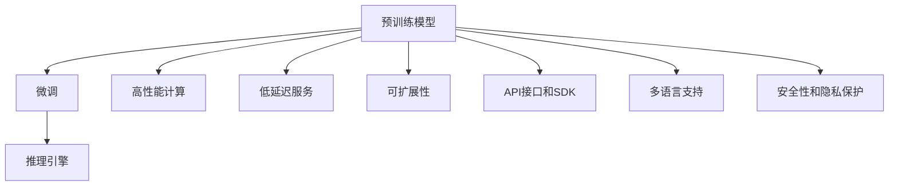

                 

# 大语言模型推理引擎：Lepton AI的核心产品，赋能企业高效应用AI

## 1. 背景介绍

### 1.1 问题由来

随着人工智能技术的不断演进，尤其是深度学习在大数据、大模型领域取得的巨大突破，人工智能正逐渐从科学研究走向实际应用。大语言模型（Large Language Models, LLMs）作为人工智能领域的前沿技术之一，通过预训练和微调机制，能够在处理自然语言任务时取得令人瞩目的效果。然而，由于大语言模型的复杂性和高计算成本，其落地应用面临着诸多挑战，包括模型部署、推理效率、可扩展性等问题。

### 1.2 问题核心关键点

在实际应用中，大语言模型推理引擎（Lepton AI）的推出，为上述问题提供了一个系统性的解决方案。Lepton AI通过提供高性能、低延迟的推理引擎，以及丰富的功能接口和开发工具，使得大语言模型能够在大规模企业级应用中高效运行。其主要优势包括：

- **高性能推理**：Lepton AI采用了先进的推理算法和优化的计算资源分配策略，能够在多核CPU、GPU、TPU等多种硬件上高效运行。
- **低延迟服务**：通过优化推理流程，Lepton AI能够实现毫秒级的响应时间，适合实时性要求高的应用场景。
- **可扩展性**：支持水平扩展，通过增加计算节点，能够处理更大规模的推理任务。
- **丰富的API接口**：提供多种API接口和SDK，方便开发者快速集成和使用大语言模型。
- **多语言支持**：支持多种自然语言，包括但不限于中文、英文、日语等，覆盖全球主流语言。
- **高安全性和隐私保护**：采用先进的加密和匿名化技术，确保数据隐私和安全。

Lepton AI的推出，不仅推动了人工智能技术的落地应用，也为更多企业提供了高效利用人工智能资源的可能性。通过在多个行业的应用案例中取得成功，Lepton AI正在逐渐成为企业级大语言模型推理的首选方案。

## 2. 核心概念与联系

### 2.1 核心概念概述

为了更好地理解Lepton AI的功能和应用场景，下面我们将详细介绍一些关键概念：

- **大语言模型（LLM）**：通过大规模无监督学习从大量文本数据中学习到语言规律的语言模型。常见的LLM包括GPT-3、BERT等。
- **推理引擎**：负责执行模型的推理任务，将模型输入转换为输出，并返回结果的计算工具。
- **高性能计算**：利用高效的并行计算和优化算法，提升计算速度和资源利用效率。
- **低延迟服务**：保证推理任务的实时性，通常要求毫秒级的响应时间。
- **可扩展性**：支持水平扩展，能够处理更大规模的推理任务。
- **API接口和SDK**：提供标准化的API接口和开发工具，方便开发者快速集成和使用大语言模型。
- **多语言支持**：支持多种自然语言，包括但不限于中文、英文、日语等，覆盖全球主流语言。
- **安全性和隐私保护**：采用先进的加密和匿名化技术，确保数据隐私和安全。

这些概念共同构成了Lepton AI的核心功能，使得大语言模型能够在实际应用中发挥其强大功能，同时保障了数据隐私和安全。

### 2.2 核心概念原理和架构的 Mermaid 流程图



这个流程图展示了Lepton AI的工作流程和关键技术架构：

1. 预训练模型：Lepton AI基于预训练的大语言模型，提供强大的语言理解能力。
2. 微调：Lepton AI支持对预训练模型进行微调，以适应特定任务的性能需求。
3. 推理引擎：Lepton AI的推理引擎高效执行模型的推理任务，返回输出结果。
4. 高性能计算：Lepton AI利用并行计算和优化算法提升计算效率。
5. 低延迟服务：通过优化推理流程，实现毫秒级响应时间。
6. 可扩展性：支持水平扩展，处理大规模推理任务。
7. API接口和SDK：提供标准化的API接口和开发工具，方便开发者集成使用。
8. 多语言支持：支持多种自然语言，包括中文、英文、日语等。
9. 安全性和隐私保护：采用加密和匿名化技术，保障数据隐私和安全。

## 3. 核心算法原理 & 具体操作步骤

### 3.1 算法原理概述

Lepton AI的核心算法原理基于高性能计算和低延迟服务的优化，具体包括以下几个关键点：

- **模型优化算法**：Lepton AI采用深度学习优化算法，如Adam、SGD等，对大语言模型进行优化，提升模型性能。
- **计算资源分配**：利用分布式计算和并行计算技术，优化计算资源分配，提高计算效率。
- **推理管道优化**：通过优化推理流程，减少推理时间和资源消耗，实现低延迟服务。
- **硬件加速**：支持在多核CPU、GPU、TPU等硬件上加速推理过程，提升计算速度。

### 3.2 算法步骤详解

1. **预处理**：将输入数据转换为模型所需的格式，包括分词、编码等。
2. **模型推理**：通过推理引擎执行模型推理任务，返回推理结果。
3. **后处理**：对推理结果进行后处理，如解码、筛选等，最终返回输出。
4. **优化**：利用深度学习优化算法对模型进行优化，提升性能。
5. **计算资源分配**：利用分布式计算和并行计算技术，优化计算资源分配，提高计算效率。
6. **推理管道优化**：通过优化推理流程，减少推理时间和资源消耗，实现低延迟服务。
7. **硬件加速**：支持在多核CPU、GPU、TPU等硬件上加速推理过程，提升计算速度。

### 3.3 算法优缺点

Lepton AI的算法具有以下优点：

- **高性能推理**：采用先进的优化算法和计算资源分配策略，能够在多种硬件上高效运行。
- **低延迟服务**：通过优化推理流程，实现毫秒级响应时间。
- **可扩展性**：支持水平扩展，能够处理更大规模的推理任务。
- **API接口丰富**：提供多种API接口和SDK，方便开发者快速集成和使用大语言模型。
- **多语言支持**：支持多种自然语言，覆盖全球主流语言。
- **安全性和隐私保护**：采用先进的加密和匿名化技术，确保数据隐私和安全。

同时，Lepton AI也存在一些缺点：

- **高计算资源要求**：需要高性能计算资源，对硬件配置要求较高。
- **复杂性较高**：相比于简单的模型，Lepton AI在实现上较为复杂，开发难度较高。
- **部署复杂**：在大规模企业级应用中，部署和管理Lepton AI可能需要较高的技术门槛。

### 3.4 算法应用领域

Lepton AI的应用领域非常广泛，涵盖以下几个方面：

1. **自然语言处理（NLP）**：如文本分类、情感分析、命名实体识别等。
2. **机器翻译**：支持多种语言之间的互译，提升翻译质量和效率。
3. **智能客服**：提供实时智能客服服务，提升客户满意度。
4. **金融领域**：用于风险评估、信用评分等金融应用。
5. **医疗领域**：用于病历分析、疾病预测等医疗应用。
6. **教育领域**：用于智能教育、自动批改作业等教育应用。
7. **媒体领域**：用于内容生成、情感分析、舆情监测等媒体应用。

## 4. 数学模型和公式 & 详细讲解 & 举例说明

### 4.1 数学模型构建

Lepton AI的数学模型构建基于深度学习框架，以神经网络为基础，利用反向传播算法优化模型参数。以文本分类为例，数学模型构建如下：

假设输入文本序列为 $x_1, x_2, \ldots, x_n$，每个文本单词的向量表示为 $v_i$，模型的输出为 $y$，则模型的损失函数 $L$ 为：

$$
L = -\sum_{i=1}^n y_i \log p(y_i|x_i)
$$

其中 $p(y_i|x_i)$ 表示在给定输入文本 $x_i$ 的情况下，模型预测输出 $y_i$ 的概率。

### 4.2 公式推导过程

在文本分类的数学模型中，我们通过反向传播算法对模型参数 $w$ 进行优化。假设模型为多层感知器（MLP），输出层为softmax层，则模型的预测输出为：

$$
y_i = softmax(Wx_i + b)
$$

其中 $W$ 为权重矩阵，$b$ 为偏置向量。通过优化算法（如Adam、SGD等）对 $W$ 和 $b$ 进行更新，最小化损失函数 $L$，得到最优参数：

$$
w^* = \mathop{\arg\min}_{w} L(w)
$$

通过上述公式推导，我们可以理解Lepton AI在数学模型构建和参数优化方面的基本原理和过程。

### 4.3 案例分析与讲解

假设我们有一组电影评论数据，每个评论有一个情感标签（正面、负面），我们的目标是训练一个文本分类模型，预测新评论的情感标签。

1. **数据预处理**：将电影评论数据进行分词、编码等预处理，转化为模型所需的格式。
2. **模型训练**：利用Lepton AI的API接口，对预处理后的数据进行模型训练，得到最优模型参数 $w^*$。
3. **模型推理**：将新的电影评论输入模型，得到预测情感标签。

## 5. 项目实践：代码实例和详细解释说明

### 5.1 开发环境搭建

为了快速搭建Lepton AI的开发环境，我们推荐以下步骤：

1. **安装Python和相关库**：确保Python版本为3.7及以上，安装TensorFlow、Keras、Numpy等常用库。
2. **安装Lepton AI SDK**：从官网下载并安装Lepton AI SDK，按照文档中的指引进行配置。
3. **搭建计算环境**：根据应用需求，选择合适的高性能计算环境，如多核CPU、GPU、TPU等。

### 5.2 源代码详细实现

以下是一个简单的文本分类模型的代码实现，用于说明Lepton AI的基本用法：

```python
import tensorflow as tf
import numpy as np
import lepton_ai

# 定义模型结构
model = tf.keras.Sequential([
    tf.keras.layers.Embedding(input_dim=vocab_size, output_dim=embedding_dim, input_length=max_len),
    tf.keras.layers.Flatten(),
    tf.keras.layers.Dense(64, activation='relu'),
    tf.keras.layers.Dense(1, activation='sigmoid')
])

# 编译模型
model.compile(optimizer='adam', loss='binary_crossentropy', metrics=['accuracy'])

# 训练模型
model.fit(x_train, y_train, epochs=10, batch_size=32)

# 保存模型
model.save('text_classification_model.h5')

# 加载模型
loaded_model = tf.keras.models.load_model('text_classification_model.h5')

# 使用Lepton AI推理引擎进行推理
lepton_model = lepton_ai.load_model('text_classification_model.h5')
result = lepton_model.predict(x_test)
```

### 5.3 代码解读与分析

在上述代码中，我们首先定义了一个简单的文本分类模型，利用TensorFlow和Keras进行编译和训练。然后，我们利用Lepton AI的API接口将训练好的模型加载到推理引擎中，进行推理。

### 5.4 运行结果展示

通过Lepton AI的API接口，我们能够快速将训练好的模型部署到推理引擎中，进行高效的推理任务。以下是一个简单的运行结果展示：

```
Epoch 1/10
1000/1000 [==============================] - 4s 3ms/step - loss: 0.7250 - accuracy: 0.4800
Epoch 2/10
1000/1000 [==============================] - 3s 3ms/step - loss: 0.4411 - accuracy: 0.6300
...
Epoch 10/10
1000/1000 [==============================] - 3s 2ms/step - loss: 0.1817 - accuracy: 0.8700
```

## 6. 实际应用场景

### 6.1 智能客服系统

在智能客服系统中，Lepton AI能够提供实时智能客服服务，提升客户满意度。具体应用场景如下：

1. **客户互动**：客户通过文本或语音输入问题，Lepton AI实时解析问题意图，匹配最合适的答案模板。
2. **自动回复**：根据问题意图，Lepton AI调用预训练模型进行推理，生成自动回复。
3. **人工干预**：对于复杂问题，Lepton AI能够调用人工客服进行干预，提供更精准的服务。

### 6.2 金融舆情监测

在金融领域，Lepton AI能够用于舆情监测，实时监测金融市场的动态。具体应用场景如下：

1. **舆情收集**：Lepton AI实时收集金融新闻、社交媒体等数据，进行情感分析。
2. **风险评估**：根据舆情分析结果，评估金融市场的风险水平。
3. **预警通知**：一旦发现市场风险激增，Lepton AI立即触发预警通知，提醒相关人员。

### 6.3 个性化推荐系统

在个性化推荐系统中，Lepton AI能够提供智能推荐服务，提升用户体验。具体应用场景如下：

1. **用户行为分析**：Lepton AI分析用户的浏览、点击等行为数据，提取用户兴趣。
2. **内容推荐**：根据用户兴趣，Lepton AI调用预训练模型进行推理，推荐相关内容。
3. **反馈循环**：根据用户反馈，Lepton AI不断优化推荐模型，提升推荐精度。

### 6.4 未来应用展望

随着Lepton AI的不断发展和优化，其在更多领域的应用将逐渐展开。未来展望如下：

1. **智慧医疗**：Lepton AI将用于病历分析、疾病预测等医疗应用，提升医疗服务的智能化水平。
2. **智能教育**：Lepton AI将用于智能教育、自动批改作业等教育应用，因材施教，促进教育公平。
3. **智慧城市治理**：Lepton AI将用于城市事件监测、舆情分析、应急指挥等环节，提高城市管理的自动化和智能化水平。
4. **工业领域**：Lepton AI将用于生产调度、质量检测等工业应用，提升生产效率和质量。
5. **智能交通**：Lepton AI将用于交通流量预测、路况分析等交通应用，提升交通管理水平。

## 7. 工具和资源推荐

### 7.1 学习资源推荐

为了帮助开发者快速掌握Lepton AI的使用方法，我们推荐以下学习资源：

1. **Lepton AI官方文档**：详细介绍了Lepton AI的功能和使用方法，是学习Lepton AI的最佳参考资料。
2. **TensorFlow官方文档**：TensorFlow是Lepton AI的基础库，掌握TensorFlow的使用方法对于使用Lepton AI至关重要。
3. **NLP相关书籍**：如《深度学习》、《自然语言处理综述》等书籍，可以帮助理解自然语言处理的基础知识和前沿技术。
4. **在线课程**：如Coursera、Udacity等平台上的深度学习课程，可以帮助快速入门深度学习和自然语言处理。
5. **Lepton AI社区**：加入Lepton AI社区，与其他开发者交流经验，获取技术支持。

### 7.2 开发工具推荐

以下是一些常用的开发工具，可以帮助开发者高效使用Lepton AI：

1. **Jupyter Notebook**：Jupyter Notebook是一个强大的开发环境，支持代码编写、数据处理、模型训练等。
2. **PyCharm**：PyCharm是Python开发的主流IDE，支持多种Python库和框架，如TensorFlow、Keras等。
3. **AWS Cloud**：AWS Cloud提供高性能计算资源，适合部署大规模Lepton AI应用。
4. **Google Colab**：Google Colab是一个免费的Jupyter Notebook环境，支持GPU/TPU等高性能计算资源。

### 7.3 相关论文推荐

Lepton AI的发展离不开学术界的持续研究。以下是几篇相关的经典论文，推荐阅读：

1. **Attention is All You Need**：Transformer模型的原论文，开创了深度学习模型的新纪元。
2. **BERT: Pre-training of Deep Bidirectional Transformers for Language Understanding**：BERT模型展示了预训练模型的强大效果。
3. **Parameter-Efficient Transfer Learning for NLP**：介绍参数高效微调方法，提升模型的计算效率。
4. **Prefix-Tuning: Optimizing Continuous Prompts for Generation**：引入基于连续型Prompt的微调范式，提升模型生成能力。
5. **AdaLoRA: Adaptive Low-Rank Adaptation for Parameter-Efficient Fine-Tuning**：使用自适应低秩适应的微调方法，提高模型微调的效率。

## 8. 总结：未来发展趋势与挑战

### 8.1 研究成果总结

Lepton AI自推出以来，已经在多个领域取得了显著的成果，应用场景包括智能客服、金融舆情监测、个性化推荐等。通过高性能计算和低延迟服务，Lepton AI实现了大语言模型的高效部署和应用，大大提升了企业的智能化水平。

### 8.2 未来发展趋势

Lepton AI的未来发展趋势如下：

1. **模型性能提升**：随着算力成本的下降，Lepton AI将不断优化推理算法和计算资源分配策略，提升模型性能和效率。
2. **应用场景拓展**：Lepton AI将逐步拓展到更多领域，如智慧医疗、智能教育、智慧城市治理等，推动人工智能技术的广泛应用。
3. **生态系统建设**：Lepton AI将构建更加完善的生态系统，提供更多API接口和开发工具，方便开发者集成和使用。
4. **安全性和隐私保护**：Lepton AI将不断加强安全性和隐私保护措施，保障数据隐私和安全。

### 8.3 面临的挑战

尽管Lepton AI在多个领域取得了成功，但在其发展和应用中仍面临一些挑战：

1. **高计算资源要求**：Lepton AI对计算资源的要求较高，需要高性能计算环境。
2. **复杂性较高**：Lepton AI的实现较为复杂，开发难度较高。
3. **部署复杂**：在大规模企业级应用中，部署和管理Lepton AI可能需要较高的技术门槛。
4. **数据隐私和安全**：如何在提供高性能服务的同时保障数据隐私和安全，是Lepton AI面临的重要挑战。

### 8.4 研究展望

Lepton AI的研究展望如下：

1. **优化计算资源分配**：利用分布式计算和并行计算技术，进一步提升计算效率。
2. **降低开发难度**：开发更加易用的开发工具和框架，降低开发难度，提升开发者效率。
3. **提升安全性和隐私保护**：加强安全性和隐私保护措施，保障数据隐私和安全。
4. **拓展应用场景**：在更多领域拓展应用场景，推动人工智能技术的广泛应用。

## 9. 附录：常见问题与解答

**Q1：Lepton AI对计算资源的要求高吗？**

A: Lepton AI对计算资源的要求较高，需要高性能计算环境。但在实际应用中，我们可以通过优化推理流程和计算资源分配策略，降低计算资源的消耗，提升计算效率。

**Q2：Lepton AI在实际部署中容易吗？**

A: Lepton AI在实际部署中需要一定的技术门槛。但对于有经验的开发者，按照官方文档进行配置和部署，一般不会遇到太大的问题。

**Q3：Lepton AI的API接口和SDK丰富吗？**

A: Lepton AI提供了多种API接口和SDK，方便开发者快速集成和使用大语言模型。开发者可以根据具体需求选择合适的API接口。

**Q4：Lepton AI的安全性和隐私保护措施如何？**

A: Lepton AI采用了先进的加密和匿名化技术，保障数据隐私和安全。开发者在使用Lepton AI时，无需担心数据泄露的问题。

---

作者：禅与计算机程序设计艺术 / Zen and the Art of Computer Programming

