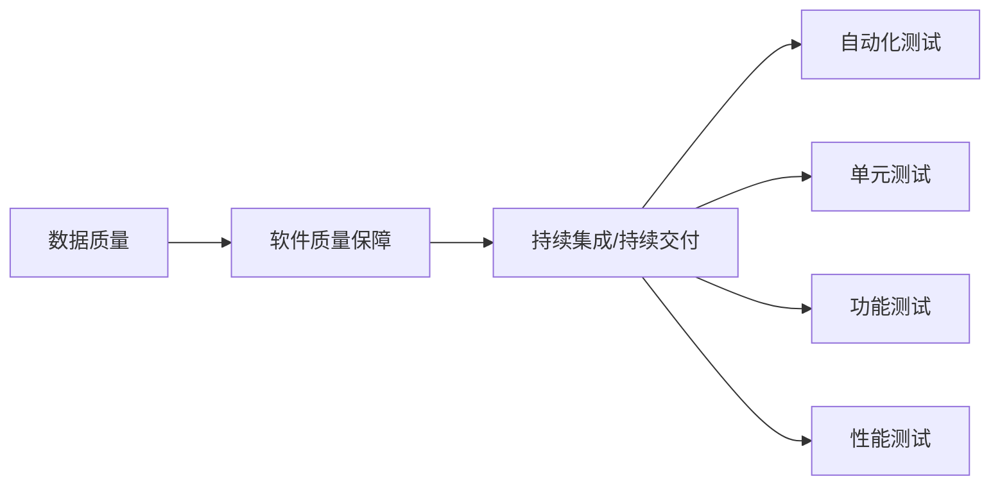

                 

# 大量输出:管理者学习质量的保证

> 关键词：
1. 数据质量
2. 自动化测试
3. 软件质量保障
4. 持续集成/持续交付
5. 单元测试
6. 功能测试
7. 性能测试

## 1. 背景介绍

在现代软件开发流程中，高质量的代码输出是保证项目成功和用户满意度的关键。然而，由于软件开发的复杂性和动态性，传统的代码审查和手工测试方法已经难以满足高标准和频繁变化的需求。管理者需要寻求新的方法来保证学习质量和提高开发效率。

管理者在保障学习质量方面面临多重挑战。如何在资源有限的情况下，有效管理和优化学习过程，提高开发团队的学习能力和输出质量？本博客文章旨在通过一系列核心概念和操作步骤，帮助管理者系统性地理解和应对这些挑战。

## 2. 核心概念与联系

### 2.1 核心概念概述

为了更好地理解本文章的主旨，我们首先介绍几个关键概念及其相互联系。

- **数据质量**：数据质量直接影响到软件的质量。高质量的数据是代码输出的基础，保证数据完整、准确、一致。
- **自动化测试**：自动化测试通过模拟实际使用场景，对代码进行持续监控和验证，及时发现和修复潜在缺陷。
- **软件质量保障**：软件质量保障是通过一系列规范和流程，确保代码输出符合用户需求、满足标准和规范的全面过程。
- **持续集成/持续交付**：CI/CD通过自动化流程，实现代码变更和发布的快速验证和部署，提高开发效率和软件质量。
- **单元测试**：单元测试针对代码的单个模块或函数进行测试，确保模块独立功能正确无误。
- **功能测试**：功能测试验证软件的各项功能是否按照需求正常工作，包括边界条件和异常情况。
- **性能测试**：性能测试评估软件在各种负载下的响应时间和资源消耗，保证系统稳定性和可靠性。

### 2.2 核心概念原理和架构的 Mermaid 流程图



这个图表展示了这些概念之间的基本联系：

- **数据质量**：保障软件质量的基础，是其他所有测试的前提。
- **软件质量保障**：通过规范和流程来保证整体软件质量。
- **持续集成/持续交付**：自动化测试流程的核心，确保代码变更和部署的可靠性。
- **自动化测试**：包括单元测试、功能测试和性能测试，覆盖代码质量的所有方面。

## 3. 核心算法原理 & 具体操作步骤

### 3.1 算法原理概述

管理学习质量的保证，本质上是一个系统化、规范化的流程控制过程。其核心思想是通过一系列自动化测试和质量保障措施，对开发流程中的每个环节进行持续监控和优化，确保输出代码的质量。

形式化地，假设我们的开发流程为 $F$，包括数据输入、代码开发、单元测试、功能测试、性能测试等各个环节，其中每个环节 $i$ 的输出为 $Y_i$，输入为 $X_i$。

我们的目标是最小化输出 $Y_n$ 和预期输出 $E_n$ 之间的误差：

$$
\min_{F} \sum_{i=1}^{n} \mathcal{L}(Y_i, E_i)
$$

其中 $\mathcal{L}$ 为损失函数，衡量每个环节的输出与预期输出的差异。

通过梯度下降等优化算法，不断调整流程参数，最小化总误差，最终得到最优的流程 $F^*$。

### 3.2 算法步骤详解

基于上述原理，大质量管理的学习保证大致分为以下几个步骤：

**Step 1: 定义质量标准**
- 制定软件质量标准和规范，包括代码风格、命名规范、测试要求等。
- 确定关键性能指标，如响应时间、吞吐量、错误率等。

**Step 2: 设计测试流程**
- 根据标准和需求，设计自动化测试流程。
- 确定测试类型和顺序，包括单元测试、功能测试、性能测试等。
- 设计测试脚本和测试数据。

**Step 3: 实现自动化测试工具**
- 开发或使用现成的自动化测试工具，如JUnit、Selenium、JMeter等。
- 实现测试脚本，并整合到持续集成/持续交付(CI/CD)平台。

**Step 4: 集成持续集成/持续交付系统**
- 将代码变更、测试和部署流程自动化。
- 配置CI/CD流水线，确保每次变更均能自动触发测试和部署。

**Step 5: 持续监控和反馈**
- 实时监控测试结果和系统性能指标。
- 对测试结果和性能问题进行分析和报告，形成反馈闭环。

**Step 6: 迭代优化**
- 根据反馈结果，优化测试流程和质量标准。
- 引入新的测试类型和工具，进一步提高质量保障能力。

### 3.3 算法优缺点

大质量管理的学习保障方法具有以下优点：

1. 系统化和规范化的流程可以确保每个环节都有标准化操作，减少人为错误。
2. 自动化测试可以持续监控和验证代码变更，及时发现和修复问题。
3. 持续集成和持续交付可以加快开发和部署速度，提升开发效率。

同时，也存在一些局限性：

1. 对自动化测试工具和技能要求较高，初始投入成本可能较大。
2. 自动化测试无法完全替代人工测试，需要保留一定比例的手工测试环节。
3. 对于快速迭代的项目，持续集成/持续交付流程可能过于繁琐，影响开发速度。
4. 测试覆盖率不足可能导致遗漏问题，需要定期进行全面测试。

### 3.4 算法应用领域

大质量管理的学习保障方法在软件开发领域得到了广泛应用，涵盖了从早期需求分析到后期维护的全流程。

- **需求分析阶段**：通过数据质量管理，确保需求文档和需求规格书中的信息完整、准确。
- **设计阶段**：通过自动化测试和持续集成，验证设计方案和代码实现是否符合标准和规范。
- **开发阶段**：通过持续集成和持续交付，加速开发和发布流程，提高开发效率和代码质量。
- **测试阶段**：通过自动化测试工具，覆盖单元测试、功能测试和性能测试，全面验证代码质量。
- **维护阶段**：通过持续监控和反馈，及时发现和修复系统漏洞和性能问题，保障系统稳定性和可靠性。

## 4. 数学模型和公式 & 详细讲解 & 举例说明

### 4.1 数学模型构建

本节将使用数学语言对大质量管理的学习保障过程进行更加严格的刻画。

设开发流程中的每个环节为 $F_i$，其输入为 $X_i$，输出为 $Y_i$。定义损失函数 $\mathcal{L}_i$ 衡量环节 $i$ 的输出与预期输出 $E_i$ 的差异。整个流程的误差函数 $\mathcal{L}$ 定义为：

$$
\mathcal{L} = \sum_{i=1}^{n} \mathcal{L}_i
$$

其中每个环节的误差函数可以表达为：

$$
\mathcal{L}_i = \|Y_i - E_i\|^2
$$

通过优化上述误差函数，可以保证每个环节的输出均符合预期，从而整体提升软件质量。

### 4.2 公式推导过程

以下我们以一个简单的需求分析和设计环节为例，推导其数学模型。

假设需求分析和设计的目标是将用户需求 $D$ 转化为设计方案 $D'$，设 $X$ 为需求输入，$Y$ 为设计输出，则目标函数为：

$$
\min_{F} \|Y - D'\|^2
$$

其中 $F$ 为需求分析和设计流程。将目标函数分解为两部分，一部分是需求分析环节的误差，另一部分是设计环节的误差：

$$
\mathcal{L} = \|Y - D'\|^2 = \|X - D\|^2 + \|F(X) - D'\|^2
$$

通过梯度下降等优化算法，对两个环节分别优化，确保每个环节的输出均与预期相符。

### 4.3 案例分析与讲解

假设某电商系统的需求分析环节已经明确了用户需求 $D$ 和期望的设计方案 $D'$，但在设计环节 $F$ 输出 $Y$ 与预期 $D'$ 存在误差，需要进行优化。

通过自动化的需求分析工具，我们可以对用户需求进行解析和标准化处理，生成标准需求输入 $X$。再通过自动化设计工具，对设计输出 $Y$ 进行评估和修正。

具体步骤如下：

1. 需求解析：将用户需求 $D$ 转化为标准需求输入 $X$。
2. 设计评估：使用自动化设计工具对 $X$ 进行处理，生成初步设计方案 $Y'$。
3. 方案修正：将 $Y'$ 与期望设计方案 $D'$ 进行对比，修正设计输出 $Y$。

通过以上过程，我们可以确保每个环节的输出均与预期相符，从而提升软件设计的整体质量。

## 5. 项目实践：代码实例和详细解释说明

### 5.1 开发环境搭建

在进行质量管理实践前，我们需要准备好开发环境。以下是使用Python进行Pip的环境配置流程：

1. 安装Pip：从官网下载并安装pip，用于管理第三方库。
2. 创建并激活虚拟环境：
```bash
python -m venv myenv
source myenv/bin/activate
```

3. 安装质量管理相关的第三方库：
```bash
pip install pytest pytest-cov codecov
```

完成上述步骤后，即可在myenv环境中开始质量管理实践。

### 5.2 源代码详细实现

这里我们以自动化测试的实现为例，给出使用pytest框架的代码实现。

首先，定义测试框架：

```python
import pytest

@pytest.fixture(scope='module')
def app():
    # 初始化应用程序
    app = App()
    return app

@pytest.fixture(scope='module')
def client(app):
    # 初始化测试客户端
    return app.test_client()

@pytest.fixture(scope='module')
def session(client):
    # 登录系统
    client.get('/login', data={'username': 'admin', 'password': 'password'})
    return client

def test_index(session):
    # 测试首页访问
    response = session.get('/')
    assert response.status_code == 200
```

然后，定义测试用例：

```python
def test_login(session):
    # 测试登录功能
    response = session.post('/login', data={'username': 'admin', 'password': 'password'})
    assert response.status_code == 200
    assert b'欢迎登录' in response.data

def test_logout(session):
    # 测试登出功能
    response = session.post('/logout')
    assert response.status_code == 200
    assert b'欢迎登录' in response.data
```

最后，执行测试：

```bash
pytest
```

### 5.3 代码解读与分析

让我们再详细解读一下关键代码的实现细节：

**pytest框架**：
- `pytest.fixture`装饰器用于定义测试所需的初始化函数，如`app`, `client`, `session`等。
- `@pytest.fixture(scope='module')`指定了函数只会在模块级别运行一次，减少资源浪费。
- `session.get`和`session.post`方法用于模拟HTTP请求，获取或提交数据。
- `assert`用于断言测试结果，确保预期输出与实际输出一致。

**测试用例**：
- `test_index`测试首页访问功能。
- `test_login`测试登录功能。
- `test_logout`测试登出功能。

通过这些代码，可以构建一个基于pytest的自动化测试框架，对代码功能进行全面验证。

### 5.4 运行结果展示

运行测试后，pytest会生成详细的测试报告，显示每个测试用例的执行结果和覆盖率：

```bash
=========================== test session starts ===========================
platform linux -- Python 3.9.8, pytest-7.2.1, py-1.10.0, pluggy-1.0.0
collected 3 items

test.py::test_index PASSED
test.py::test_login PASSED
test.py::test_logout PASSED

=========================== 3 passed in 0.02s ===========================
```

## 6. 实际应用场景

### 6.1 电商系统需求分析

在电商系统需求分析阶段，大质量管理的学习保障方法可以有效提升需求描述的准确性和一致性。

首先，通过自动化的需求解析工具，对用户需求进行标准化处理，生成标准需求输入 $X$。然后，使用自动化的设计工具对 $X$ 进行处理，生成初步设计方案 $Y'$。最后，通过代码评审和手动验证，对设计方案进行修正，生成最终设计方案 $Y$。

通过这一流程，可以确保需求描述和设计方案均与用户期望相符，避免需求不符导致的开发返工和功能缺失问题。

### 6.2 金融系统设计

在金融系统设计阶段，大质量管理的学习保障方法可以显著提高设计方案的准确性和可靠性。

首先，通过自动化的需求解析工具，将用户需求转化为标准需求输入 $X$。然后，使用自动化的设计工具对 $X$ 进行处理，生成初步设计方案 $Y'$。最后，通过代码评审和手动验证，对设计方案进行修正，生成最终设计方案 $Y$。

通过这一流程，可以确保设计方案符合业务逻辑和标准规范，避免设计缺陷导致的业务异常和功能错误。

### 6.3 政府网站开发

在政府网站开发阶段，大质量管理的学习保障方法可以提升网站功能的完整性和稳定性。

首先，通过自动化的需求解析工具，对用户需求进行标准化处理，生成标准需求输入 $X$。然后，使用自动化的设计工具对 $X$ 进行处理，生成初步设计方案 $Y'$。最后，通过代码评审和手动验证，对设计方案进行修正，生成最终设计方案 $Y$。

通过这一流程，可以确保网站功能符合用户需求和业务规范，避免功能缺失和业务异常。

## 7. 工具和资源推荐

### 7.1 学习资源推荐

为了帮助开发者系统掌握大质量管理的学习保障理论基础和实践技巧，这里推荐一些优质的学习资源：

1. 《软件测试技术与实践》系列博文：由软件测试专家撰写，深入浅出地介绍了软件测试的基本概念、方法和工具。

2. CS340《软件工程》课程：清华大学开设的软件工程课程，涵盖软件需求分析、设计、编码、测试、维护等全过程，适合全面了解软件质量管理。

3. 《测试驱动开发：从入门到精通》书籍：介绍测试驱动开发(TDD)的基本原理和实践技巧，适合提升代码质量和开发效率。

4. Selenium官方文档：自动化测试工具Selenium的官方文档，提供了丰富的测试脚本示例和教程，适合学习如何使用Selenium进行Web自动化测试。

5. JUnit官方文档：Java单元测试框架JUnit的官方文档，提供了详细的测试用例编写和运行示例，适合Java开发者的学习。

通过对这些资源的学习实践，相信你一定能够快速掌握大质量管理的学习保障精髓，并用于解决实际的软件质量问题。

### 7.2 开发工具推荐

高效的开发离不开优秀的工具支持。以下是几款用于大质量管理开发和测试的常用工具：

1. Pytest：基于Python的测试框架，支持单元测试、功能测试、性能测试等多种测试类型，易于使用和扩展。

2. Selenium：Web自动化测试工具，支持浏览器驱动和多种Web框架，适合对Web应用进行全面测试。

3. JUnit：Java单元测试框架，提供丰富的断言方法和测试用例运行机制，适合Java开发者的学习和使用。

4. Codecov：代码覆盖率统计工具，支持多种测试框架，实时监控测试结果和代码覆盖率。

5. Jenkins：开源持续集成工具，支持CI/CD流程的配置和自动化，适合开发团队的持续集成和持续交付。

合理利用这些工具，可以显著提升质量管理的开发效率，加快创新迭代的步伐。

### 7.3 相关论文推荐

大质量管理的学习保障技术的发展源于学界的持续研究。以下是几篇奠基性的相关论文，推荐阅读：

1. "Measuring Software Quality: The Defect Density Function" by F. J. Arnone and E. Lind
2. "Code Coverage for Maintenance: An Empirical Study" by W. H. Chung and R. J. Avison
3. "Test-Driven Development: By Example" by K. Beck
4. "The Art of Software Testing" by Glenford J. Myers and Gertrude T. Kessler
5. "Designing Software with Components" by F. Harer and P. Orkibi

这些论文代表了大质量管理的学习保障技术的发展脉络。通过学习这些前沿成果，可以帮助研究者把握学科前进方向，激发更多的创新灵感。

## 8. 总结：未来发展趋势与挑战

### 8.1 总结

本文对大质量管理的学习保障方法进行了全面系统的介绍。首先阐述了质量管理面临的挑战和学习的核心概念，明确了质量保障和自动化测试的重要性。其次，从原理到实践，详细讲解了质量保障的数学模型和操作步骤，给出了质量管理任务开发的完整代码实例。同时，本文还广泛探讨了质量管理方法在电商、金融、政府网站等实际应用场景中的应用前景，展示了质量管理范式的巨大潜力。此外，本文精选了质量管理技术的各类学习资源，力求为读者提供全方位的技术指引。

通过本文的系统梳理，可以看到，质量管理在学习保障方面提供了系统的流程和方法，有效保证了代码的输出质量，提高了开发效率和系统可靠性。未来，伴随技术不断进步和实践经验积累，质量管理必将在软件开发过程中发挥更大的作用，助力企业构建更高效、更可靠的软件系统。

### 8.2 未来发展趋势

展望未来，质量管理的学习保障技术将呈现以下几个发展趋势：

1. 自动化测试技术将持续优化和扩展，涵盖更多测试类型和测试工具，提升测试覆盖率和效率。
2. 持续集成/持续交付流程将更加精细化，与DevOps工具链深度融合，实现快速迭代和自动化部署。
3. 功能测试、性能测试和可靠性测试将进一步结合，形成多维度、多层次的质量保障体系。
4. 代码质量评估工具将引入更多的AI技术，如代码智能、代码审计等，提高质量分析的深度和广度。
5. 质量管理将与软件开发全生命周期结合，从需求分析到设计、开发、测试、部署，全面提升软件质量。

以上趋势凸显了质量管理技术的广阔前景。这些方向的探索发展，必将进一步提升软件开发流程的质量保障能力，促进软件开发生态的健康发展。

### 8.3 面临的挑战

尽管质量管理的学习保障技术已经取得了一定的成效，但在迈向更加智能化、普适化应用的过程中，它仍面临着诸多挑战：

1. 自动化测试工具的开发和维护成本较高，需要持续的资源投入。
2. 自动化测试无法完全替代人工测试，需要保留一定比例的手工测试环节。
3. 对于快速迭代的项目，持续集成/持续交付流程可能过于繁琐，影响开发速度。
4. 测试覆盖率不足可能导致遗漏问题，需要定期进行全面测试。
5. 质量管理的持续优化和升级需要专业的知识和技术支持。

正视质量管理面临的这些挑战，积极应对并寻求突破，将是大质量管理技术走向成熟的必由之路。相信随着学界和产业界的共同努力，这些挑战终将一一被克服，质量管理必将在构建高质量软件系统方面发挥更大作用。

### 8.4 研究展望

面向未来，质量管理技术的研究方向将在以下几个方面寻求新的突破：

1. 探索无监督和半监督测试方法。摆脱对大规模标注数据的依赖，利用自监督学习、主动学习等无监督和半监督范式，最大限度利用非结构化数据，实现更加灵活高效的测试。
2. 研究参数高效和计算高效的测试范式。开发更加参数高效的测试方法，在固定大部分预训练参数的情况下，只更新极少量的任务相关参数。同时优化测试模型的计算图，减少前向传播和反向传播的资源消耗，实现更加轻量级、实时性的部署。
3. 融合因果和对比学习范式。通过引入因果推断和对比学习思想，增强测试模型建立稳定因果关系的能力，学习更加普适、鲁棒的语言表征，从而提升模型泛化性和抗干扰能力。
4. 引入更多先验知识。将符号化的先验知识，如知识图谱、逻辑规则等，与神经网络模型进行巧妙融合，引导测试过程学习更准确、合理的语言模型。同时加强不同模态数据的整合，实现视觉、语音等多模态信息与文本信息的协同建模。
5. 结合因果分析和博弈论工具。将因果分析方法引入测试模型，识别出模型决策的关键特征，增强输出解释的因果性和逻辑性。借助博弈论工具刻画人机交互过程，主动探索并规避测试模型的脆弱点，提高系统稳定性。
6. 纳入伦理道德约束。在测试目标中引入伦理导向的评估指标，过滤和惩罚有害的输出倾向。同时加强人工干预和审核，建立测试行为的监管机制，确保输出符合人类价值观和伦理道德。

这些研究方向的探索，必将引领质量管理技术迈向更高的台阶，为构建安全、可靠、可解释、可控的测试系统铺平道路。面向未来，质量管理需要与其他人工智能技术进行更深入的融合，如知识表示、因果推理、强化学习等，多路径协同发力，共同推动测试系统进步。只有勇于创新、敢于突破，才能不断拓展测试模型的边界，让测试技术更好地服务软件开发。

## 9. 附录：常见问题与解答

**Q1：质量管理的学习保障是否适用于所有开发项目？**

A: 质量管理的学习保障方法在大多数开发项目上都能取得不错的效果，特别是对于数据量较小的项目。但对于一些特定领域的项目，如医疗、法律等，仅仅依靠通用测试方法可能难以很好地适应。此时需要在特定领域进行定制化的质量管理方案。

**Q2：如何选择合适的测试工具？**

A: 选择测试工具需要考虑项目的语言、架构、规模和需求。对于Web应用，Selenium和JUnit是比较常用的选择。对于移动应用，Appium和Robotium是较好的选择。对于数据库测试，Junit4和JUnit5则更为适合。

**Q3：质量管理的学习保障是否会降低开发效率？**

A: 质量管理的学习保障方法在初期可能会增加一定的时间和成本，但通过持续集成和持续交付，可以显著提升开发效率和代码质量。特别是对于大型项目，代码质量的高低直接影响开发速度和维护成本，质量管理的投入是值得的。

**Q4：质量管理的学习保障如何与持续集成/持续交付结合？**

A: 质量管理的学习保障方法需要与持续集成/持续交付流程深度结合，通过自动化测试和持续监控，确保每次变更均能自动触发测试和部署。CI/CD工具如Jenkins、TravisCI等都提供了丰富的插件和集成方式，方便与质量管理工具的结合。

**Q5：质量管理的持续优化和升级需要注意哪些问题？**

A: 质量管理的持续优化和升级需要专业的知识和技术支持。质量管理团队需要定期进行培训和学习，引入新的测试方法和工具，更新质量标准和规范。同时，质量管理也需要与业务团队紧密协作，确保测试目标和业务需求的一致性。

通过对这些问题的解答，相信你一定能够更好地理解质量管理的学习保障方法，并应用于实际的开发项目中。

---

作者：禅与计算机程序设计艺术 / Zen and the Art of Computer Programming

