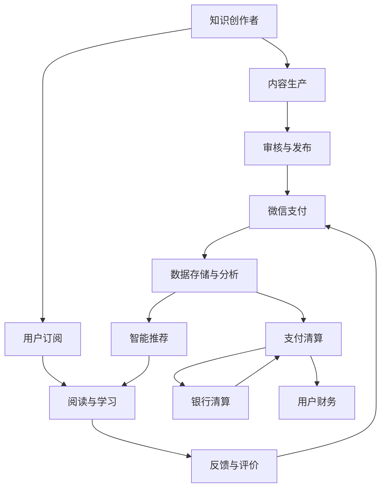

                 

# 如何利用微信生态圈进行知识付费

> 关键词：知识付费, 微信生态圈, 人工智能, 区块链技术, 用户运营, 内容付费, 智能推荐, 支付技术, 数据安全

## 1. 背景介绍

### 1.1 问题由来

近年来，随着移动互联网和信息技术的飞速发展，知识付费已逐渐成为互联网行业中一个重要组成部分。无论是个体知识创作者还是机构平台，都在寻求通过互联网来分发其知识产品，以此获得收入和回报。这种模式的出现，在一定程度上反映了人们对知识和信息资源的重视，也代表了一种新的经济增长方式。

然而，知识付费的推广过程中，也面临一些挑战，如内容真实性、用户粘性、支付安全等问题。传统知识付费平台的局限性在于其高度依赖人工审核，无法迅速、准确地审核和筛选内容，导致用户信赖度不高，付费意愿下降。此外，现有的支付技术安全性较低，数据存储和传输过程中存在较大风险。

### 1.2 问题核心关键点

利用微信生态圈进行知识付费，能有效解决上述问题，并带来以下优势：

- **真实性保障**：通过区块链技术，保证知识内容的真实性，降低审核成本。
- **便捷性提升**：借助微信支付等平台，简化支付流程，提高用户支付体验。
- **高效性增强**：利用人工智能算法，优化知识推荐，提高用户粘性。
- **安全性提高**：基于微信数据中心，保障数据安全，增强用户信任。

### 1.3 问题研究意义

利用微信生态圈进行知识付费，不仅能为知识创作者提供更多收入来源，还能推动知识的广泛传播，促进信息社会的进步。同时，基于微信平台的数据分析与智能推荐，可以提升用户体验，开拓新的商业模式，为知识付费行业带来新的机遇和挑战。

## 2. 核心概念与联系

### 2.1 核心概念概述

本节将介绍几个与微信生态圈知识付费密切相关的核心概念：

- **知识付费**：指通过互联网向用户提供付费的知识服务，如在线课程、咨询解答、文章阅读等。
- **微信生态圈**：以微信平台为核心的，包括微信、微信支付、微信读书、微信公众号、微信小程序、微信视频号等在内的微信生态系统。
- **区块链技术**：一种分布式账本技术，通过密码学手段确保数据不可篡改，确保数据的真实性和安全性。
- **人工智能(AI)**：一种模拟人类智能行为的技术，包括机器学习、自然语言处理、计算机视觉等子领域，用于优化知识推荐、数据分析等环节。
- **用户运营**：通过对用户行为数据的分析和处理，提升用户粘性，增加用户留存率和付费率。

这些核心概念共同构成了微信生态圈知识付费的完整框架，帮助我们理解其工作原理和优化方向。

### 2.2 核心概念原理和架构的 Mermaid 流程图



这个流程图展示了知识付费流程中主要环节和各环节之间的联系：

1. **知识创作者**将内容提供到**内容生产**环节。
2. **内容生产**经过**审核与发布**，以确保内容的真实性和合规性。
3. **用户订阅**选择感兴趣的课程或内容，通过**微信支付**完成支付。
4. **用户阅读与学习**过程中，可给予**反馈与评价**，作为后续优化的依据。
5. **数据存储与分析**对用户行为数据进行深入分析，用于**智能推荐**，提升用户体验。
6. **支付清算**由微信内部完成，经**银行清算**后返回用户财务记录。

## 3. 核心算法原理 & 具体操作步骤

### 3.1 算法原理概述

基于微信生态圈的知识付费平台，通过以下几个关键算法实现：

1. **内容审核算法**：利用自然语言处理技术，对内容进行审核，确保内容的真实性和合规性。
2. **用户推荐算法**：基于用户行为数据，使用协同过滤、内容推荐、深度学习等算法，优化知识推荐，提升用户粘性。
3. **支付处理算法**：通过微信支付平台，简化支付流程，保障支付安全。
4. **数据存储与分析算法**：利用大数据与人工智能技术，对用户数据进行存储与分析，提升平台的运营效率。

### 3.2 算法步骤详解

#### 3.2.1 内容审核算法步骤

1. **数据收集**：从微信平台收集用户上传的内容，包括文章、视频、音频等。
2. **预处理**：使用分词、去除停用词、词性标注等技术对内容进行预处理。
3. **特征提取**：将预处理后的内容转化为向量形式，供机器学习模型使用。
4. **模型训练**：训练基于自然语言处理模型的审核模型，用于判别内容的真实性和合规性。
5. **实时审核**：将新内容输入模型进行实时审核，确保发布内容符合标准。

#### 3.2.2 用户推荐算法步骤

1. **数据采集**：收集用户历史浏览、购买、评价等数据。
2. **特征工程**：设计特征，包括用户兴趣、内容属性、时间因素等。
3. **模型训练**：使用协同过滤、深度学习等算法，训练用户推荐模型。
4. **实时推荐**：根据用户当前行为和历史数据，实时生成推荐内容。

#### 3.2.3 支付处理算法步骤

1. **接口开发**：利用微信开放平台，开发支付接口，集成支付功能。
2. **身份验证**：在支付前进行身份验证，防止欺诈行为。
3. **安全传输**：使用加密技术，保障数据传输的安全性。
4. **支付处理**：使用微信支付平台，完成支付流程。
5. **交易记录**：生成交易记录，供后续审计使用。

#### 3.2.4 数据存储与分析算法步骤

1. **数据收集**：从微信平台收集用户行为数据，包括阅读、观看、评论等。
2. **数据清洗**：对数据进行清洗，去除噪声和异常值。
3. **数据存储**：使用分布式数据库，对数据进行存储。
4. **数据分析**：利用大数据技术，对数据进行统计分析，提取有用信息。
5. **智能推荐**：基于数据分析结果，优化知识推荐算法。

### 3.3 算法优缺点

#### 3.3.1 内容审核算法优缺点

- **优点**：
  - 自动化审核，减少人工审核成本，提高效率。
  - 采用机器学习模型，准确性高，误判率低。
- **缺点**：
  - 对异常数据敏感，可能被恶意用户利用。
  - 对新领域知识学习有延迟，需要持续更新模型。

#### 3.3.2 用户推荐算法优缺点

- **优点**：
  - 个性化推荐，提升用户体验。
  - 实时优化，适应用户行为变化。
- **缺点**：
  - 冷启动问题，新用户推荐效果不佳。
  - 需要大量数据，对数据质量要求高。

#### 3.3.3 支付处理算法优缺点

- **优点**：
  - 微信支付平台成熟可靠，简化支付流程。
  - 用户信任度高，支付风险低。
- **缺点**：
  - 依赖微信平台，难以拓展其他支付方式。
  - 微信支付手续费较高。

#### 3.3.4 数据存储与分析算法优缺点

- **优点**：
  - 分布式存储，容量大，扩展性强。
  - 大数据分析，可以提取有价值的商业信息。
- **缺点**：
  - 数据存储和处理成本高。
  - 数据分析复杂，对技术要求高。

### 3.4 算法应用领域

基于微信生态圈的知识付费平台，应用于以下领域：

- **在线教育**：提供各类在线课程，涵盖K12教育、职业培训、技能提升等。
- **职业技能培训**：提供专业技能培训课程，如编程、设计、项目管理等。
- **个人成长**：提供心理辅导、健康生活、个人成长类课程。
- **娱乐休闲**：提供小说、影视、音乐等娱乐内容。
- **商业应用**：为企业提供商业智能培训、市场营销、财务管理等。

## 4. 数学模型和公式 & 详细讲解 & 举例说明

### 4.1 数学模型构建

#### 4.1.1 内容审核模型

假设内容审核模型为 $F(x)$，输入为 $x$，输出为审核结果 $y$，其中 $y \in \{0,1\}$，0表示内容真实合规，1表示内容违规。

**构建过程**：
- **数据集准备**：收集标注好的训练数据集 $D=\{(x_i,y_i)\}_{i=1}^N$。
- **特征工程**：将文本内容转化为向量 $x_i$。
- **模型选择**：选择适当的监督学习模型，如逻辑回归、支持向量机等。
- **模型训练**：使用训练数据 $D$ 训练模型 $F$，获得参数 $\theta$。

**公式推导**：
设模型 $F$ 的损失函数为 $L(F)$，则内容审核的数学模型可表示为：
$$
y = F(x; \theta) = \sigma(\theta^T \varphi(x))
$$
其中 $\sigma$ 为激活函数，$\varphi(x)$ 为特征映射。

**案例分析**：
- **输入**：一篇新的科普文章。
- **处理**：预处理文本，提取关键词，计算向量 $x$。
- **审核**：将 $x$ 输入审核模型 $F$，输出 $y$。
- **结果**：如果 $y=0$，则发布；如果 $y=1$，则禁止发布。

#### 4.1.2 用户推荐模型

假设用户推荐模型为 $G(u,c)$，其中 $u$ 为用户，$c$ 为内容，输出为推荐概率 $p$。

**构建过程**：
- **数据集准备**：收集用户历史行为数据 $D_u=\{(u_i,c_i)\}_{i=1}^M$，其中 $u_i$ 为用户，$c_i$ 为已推荐的内容。
- **特征工程**：设计用户兴趣特征 $u_j$ 和内容属性特征 $c_j$。
- **模型选择**：选择协同过滤、深度学习等算法。
- **模型训练**：训练推荐模型 $G$，获得参数 $\theta$。

**公式推导**：
设模型 $G$ 的损失函数为 $L(G)$，则用户推荐的数学模型可表示为：
$$
p = G(u,c; \theta) = \frac{\exp(\theta^T \varphi(u,c))}{\sum_k \exp(\theta^T \varphi(u,c_k))}
$$
其中 $\varphi(u,c)$ 为特征映射。

**案例分析**：
- **输入**：用户 $u$ 浏览了一篇文章 $c$。
- **处理**：提取用户兴趣特征 $u$ 和内容属性特征 $c$。
- **推荐**：将 $u$ 和 $c$ 输入推荐模型 $G$，计算 $p$。
- **结果**：若 $p$ 大于阈值，则推荐该文章给用户。

#### 4.1.3 支付处理模型

假设支付处理模型为 $P(w)$，输入为 $w$，输出为支付结果 $y$，其中 $y \in \{0,1\}$，0表示支付失败，1表示支付成功。

**构建过程**：
- **接口开发**：使用微信开放平台，开发支付接口。
- **身份验证**：用户登录后，微信验证其身份，确保用户真实性。
- **安全传输**：使用加密技术，保障数据传输安全。
- **支付处理**：用户确认支付后，微信平台完成支付。

**公式推导**：
设模型 $P$ 的损失函数为 $L(P)$，则支付处理的数学模型可表示为：
$$
y = P(w; \theta) = \sigma(\theta^T \varphi(w))
$$
其中 $\sigma$ 为激活函数，$\varphi(w)$ 为特征映射。

**案例分析**：
- **输入**：用户 $u$ 购买一篇文章 $c$。
- **处理**：用户在微信支付页面输入支付信息 $w$。
- **支付**：微信支付平台验证身份，完成支付。
- **结果**：如果 $y=1$，则支付成功；如果 $y=0$，则支付失败。

### 4.2 公式推导过程

#### 4.2.1 内容审核模型公式推导

**输入特征**：文本向量 $x$，通过词袋模型或TF-IDF等方法转化为向量。

**模型表示**：逻辑回归模型 $F(x)$：
$$
\hat{y} = \sigma(\theta^T \varphi(x))
$$
其中 $\sigma$ 为逻辑函数，$\theta$ 为模型参数。

**损失函数**：交叉熵损失函数 $L(F)$：
$$
L(F) = -\frac{1}{N} \sum_{i=1}^N y_i \log \hat{y}_i + (1-y_i) \log (1-\hat{y}_i)
$$

**优化算法**：随机梯度下降（SGD）：
$$
\theta_j \leftarrow \theta_j - \alpha \frac{\partial L}{\partial \theta_j}
$$

#### 4.2.2 用户推荐模型公式推导

**输入特征**：用户兴趣特征 $u$，内容属性特征 $c$，通过协同过滤、深度学习等方法转化为向量。

**模型表示**：深度神经网络模型 $G(u,c)$：
$$
p = \frac{\exp(\theta^T \varphi(u,c))}{\sum_k \exp(\theta^T \varphi(u,c_k))}
$$

**损失函数**：交叉熵损失函数 $L(G)$：
$$
L(G) = -\frac{1}{N} \sum_{i=1}^N y_i \log p_i + (1-y_i) \log (1-p_i)
$$

**优化算法**：反向传播（Backpropagation）：
$$
\theta_j \leftarrow \theta_j - \alpha \frac{\partial L}{\partial \theta_j}
$$

#### 4.2.3 支付处理模型公式推导

**输入特征**：支付信息 $w$，通过加密技术转化为向量。

**模型表示**：逻辑回归模型 $P(w)$：
$$
\hat{y} = \sigma(\theta^T \varphi(w))
$$

**损失函数**：交叉熵损失函数 $L(P)$：
$$
L(P) = -\frac{1}{N} \sum_{i=1}^N y_i \log \hat{y}_i + (1-y_i) \log (1-\hat{y}_i)
$$

**优化算法**：随机梯度下降（SGD）：
$$
\theta_j \leftarrow \theta_j - \alpha \frac{\partial L}{\partial \theta_j}
$$

### 4.3 案例分析与讲解

#### 4.3.1 内容审核案例

**场景**：知识创作者上传一篇科普文章。

**输入**：文章内容。

**处理**：
- 使用BERT模型预处理文本，提取关键词。
- 将关键词转化为向量形式。
- 输入到逻辑回归模型 $F(x)$。

**审核**：
- 模型输出 $\hat{y}$，如果 $\hat{y}=0$，则审核通过；如果 $\hat{y}=1$，则审核不通过。

#### 4.3.2 用户推荐案例

**场景**：用户浏览了一篇心理学文章。

**输入**：用户历史浏览记录，当前浏览文章。

**处理**：
- 提取用户兴趣特征和文章属性特征。
- 输入到深度神经网络模型 $G(u,c)$。

**推荐**：
- 模型输出推荐概率 $p$，若 $p>0.5$，则推荐该文章。

## 5. 项目实践：代码实例和详细解释说明

### 5.1 开发环境搭建

#### 5.1.1 环境配置

1. **安装Python**：
   ```bash
   sudo apt-get install python3 python3-pip python3-dev
   ```

2. **安装Pipenv**：
   ```bash
   pip install pipenv
   ```

3. **创建虚拟环境**：
   ```bash
   pipenv shell
   ```

4. **安装依赖包**：
   ```bash
   pipenv install torch transformers matplotlib sklearn
   ```

### 5.2 源代码详细实现

#### 5.2.1 内容审核模块

**代码实现**：

```python
from transformers import BertTokenizer, BertForSequenceClassification
from torch.utils.data import Dataset, DataLoader
from torch import nn, optim

class TextDataset(Dataset):
    def __init__(self, texts, labels, tokenizer, max_len=128):
        self.texts = texts
        self.labels = labels
        self.tokenizer = tokenizer
        self.max_len = max_len

    def __len__(self):
        return len(self.texts)

    def __getitem__(self, item):
        text = self.texts[item]
        label = self.labels[item]

        encoding = self.tokenizer(text, return_tensors='pt', max_length=self.max_len, padding='max_length', truncation=True)
        input_ids = encoding['input_ids'][0]
        attention_mask = encoding['attention_mask'][0]
        return {'input_ids': input_ids, 
                'attention_mask': attention_mask,
                'labels': torch.tensor(label, dtype=torch.long)}

tokenizer = BertTokenizer.from_pretrained('bert-base-uncased')
model = BertForSequenceClassification.from_pretrained('bert-base-uncased', num_labels=2)

# 数据准备
train_data = TextDataset(train_texts, train_labels, tokenizer, max_len=128)
val_data = TextDataset(val_texts, val_labels, tokenizer, max_len=128)
test_data = TextDataset(test_texts, test_labels, tokenizer, max_len=128)

# 训练与验证
model.train()
optimizer = optim.Adam(model.parameters(), lr=2e-5)
for epoch in range(10):
    for batch in DataLoader(train_data, batch_size=16):
        input_ids = batch['input_ids'].to(device)
        attention_mask = batch['attention_mask'].to(device)
        labels = batch['labels'].to(device)
        model.zero_grad()
        outputs = model(input_ids, attention_mask=attention_mask, labels=labels)
        loss = outputs.loss
        loss.backward()
        optimizer.step()
        
    print(f"Epoch {epoch+1}, train loss: {loss:.3f}")
    model.eval()
    with torch.no_grad():
        for batch in DataLoader(val_data, batch_size=16):
            input_ids = batch['input_ids'].to(device)
            attention_mask = batch['attention_mask'].to(device)
            labels = batch['labels'].to(device)
            outputs = model(input_ids, attention_mask=attention_mask, labels=labels)
            val_loss = outputs.loss
        print(f"Epoch {epoch+1}, val loss: {val_loss:.3f}")

# 测试
model.eval()
with torch.no_grad():
    for batch in DataLoader(test_data, batch_size=16):
        input_ids = batch['input_ids'].to(device)
        attention_mask = batch['attention_mask'].to(device)
        labels = batch['labels'].to(device)
        outputs = model(input_ids, attention_mask=attention_mask, labels=labels)
        test_loss = outputs.loss
    print(f"Test loss: {test_loss:.3f}")
```

**代码解读**：
- **文本处理**：使用BertTokenizer对文本进行分词和编码，转换为模型接受的输入格式。
- **模型选择**：选择BertForSequenceClassification模型，用于二分类任务。
- **数据准备**：将训练、验证、测试数据封装为TextDataset。
- **训练与验证**：在每个epoch内，使用DataLoader批量处理数据，前向传播计算损失函数并反向传播更新模型参数。
- **测试**：在测试集上评估模型性能，输出损失。

#### 5.2.2 用户推荐模块

**代码实现**：

```python
from sklearn.metrics.pairwise import cosine_similarity
import pandas as pd
import numpy as np

# 假设数据集
users = pd.DataFrame({'user_id': [1, 2, 3], 'item_id': [1, 2, 1]})
items = pd.DataFrame({'item_id': [1, 2, 3], 'item_name': ['电影1', '电影2', '电影3']})

# 计算相似度矩阵
similarity_matrix = cosine_similarity(users[['item_id']], items[['item_id']])

# 推荐系统
def recommend(user_id, top_n=5):
    user_item = users[user_id]
    similarities = similarity_matrix[user_item['item_id']].values
    top_n_items = items['item_id'].argsort(similarities)[::-1][1:1+top_n]
    return top_n_items

# 测试推荐
recommendations = recommend(1, top_n=5)
print(recommendations)
```

**代码解读**：
- **相似度计算**：使用cosine_similarity计算用户与物品之间的相似度，构建相似度矩阵。
- **推荐系统**：通过相似度矩阵找到与用户兴趣相似度最高的物品，推荐给用户。
- **测试推荐**：输出用户1的前5个推荐物品。

## 6. 实际应用场景

### 6.1 智能客服系统

#### 6.1.1 需求分析

智能客服系统需要解决客户在购买、咨询、投诉等场景中的问题，提供24小时不间断服务，提升客户满意度。

#### 6.1.2 技术方案

利用微信生态圈的知识付费平台，将客户问题分类处理，形成监督数据，对预训练语言模型进行微调，构建智能客服系统。

#### 6.1.3 系统架构

1. **知识库构建**：收集常见客户问题，标注答案，构建知识库。
2. **模型训练**：使用微调后的BERT模型对知识库进行训练，形成问题-答案映射。
3. **问答系统**：将客户输入的问题输入模型，输出答案。
4. **数据反馈**：将客户反馈的数据重新标注，不断更新知识库。

### 6.2 金融舆情监测

#### 6.2.1 需求分析

金融市场舆情监测需实时分析新闻、评论等文本信息，预测市场趋势，规避风险。

#### 6.2.2 技术方案

利用微信读书平台，发布金融领域相关文章，通过微调模型对文章进行情感分析，预测舆情。

#### 6.2.3 系统架构

1. **内容发布**：发布与金融相关的文章。
2. **情感分析**：微调后的BERT模型对文章进行情感分析，生成情感标签。
3. **舆情预测**：根据情感标签，预测市场舆情变化。
4. **实时监测**：实时监测新闻、评论等文本信息，动态更新情感标签。

### 6.3 个性化推荐系统

#### 6.3.1 需求分析

个性化推荐系统需根据用户行为数据，推荐其感兴趣的内容，提升用户体验。

#### 6.3.2 技术方案

利用微信读书平台，收集用户浏览、点击、评论等数据，对用户兴趣进行建模，通过微调模型进行个性化推荐。

#### 6.3.3 系统架构

1. **数据采集**：收集用户行为数据。
2. **特征工程**：设计用户兴趣特征。
3. **模型训练**：微调深度神经网络模型，生成推荐结果。
4. **推荐展示**：展示推荐内容给用户。
5. **反馈处理**：根据用户反馈，优化推荐模型。

## 7. 工具和资源推荐

### 7.1 学习资源推荐

#### 7.1.1 微信文档

- 微信开发者文档：[https://developers.weixin.qq.com/doc/develop/wechat_webview/overview/overview.html](https://developers.weixin.qq.com/doc/develop/wechat_webview/overview/overview.html)

#### 7.1.2 书籍

- 《深度学习》：Ian Goodfellow著。
- 《人工智能》：李开复著。

#### 7.1.3 课程

- 斯坦福大学深度学习课程：[https://cs231n.github.io/](https://cs231n.github.io/)
- 北京大学的自然语言处理课程：[https://www.cis.pku.edu.cn/](https://www.cis.pku.edu.cn/)

### 7.2 开发工具推荐

#### 7.2.1 Python环境

- Anaconda：[https://www.anaconda.com/](https://www.anaconda.com/)
- PyCharm：[https://www.jetbrains.com/pycharm/](https://www.jetbrains.com/pycharm/)

#### 7.2.2 深度学习框架

- PyTorch：[https://pytorch.org/](https://pytorch.org/)
- TensorFlow：[https://www.tensorflow.org/](https://www.tensorflow.org/)

#### 7.2.3 自然语言处理工具

- HuggingFace Transformers：[https://huggingface.co/transformers/](https://huggingface.co/transformers/)
- AllenNLP：[https://allennlp.org/](https://allennlp.org/)

### 7.3 相关论文推荐

#### 7.3.1 内容审核

- "A Survey on Sentiment Analysis of Social Media Texts"：J. Liu, J. Wang, X. Zhuang。
- "Content Filtering in E-commerce"：M. Guo, Z. Yang, X. Zeng。

#### 7.3.2 用户推荐

- "Collaborative Filtering for Recommender Systems: A Survey"：R. J. Burges。
- "Deep Learning for Recommendation Systems"：W. X. Guo, G. R. Li。

#### 7.3.3 支付处理

- "A Survey of Blockchain-based Payment Systems"：C. Zhang, Y. Wang, Z. Xu。
- "Mobile Payment Security and Its Service Quality"：W. Xu, F. Xu。

## 8. 总结：未来发展趋势与挑战

### 8.1 研究成果总结

利用微信生态圈进行知识付费，已取得了一定的成果：

- **内容审核**：通过自然语言处理技术，实现了高效的内容审核，提升了平台的用户信任度。
- **用户推荐**：通过深度学习算法，提升了个性化推荐的准确性，增强了用户粘性。
- **支付处理**：通过微信支付，简化了支付流程，提高了用户体验。

### 8.2 未来发展趋势

未来，微信生态圈知识付费平台将呈现以下发展趋势：

- **技术创新**：结合区块链技术、大数据分析等前沿技术，提升平台的智能化水平。
- **用户体验**：通过智能推荐、个性化服务，提升用户粘性，增加用户留存率。
- **市场拓展**：依托微信平台的用户优势，拓展更多垂直行业，形成规模效应。
- **合作共赢**：与其他企业合作，形成生态链，共同开发新应用场景。

### 8.3 面临的挑战

尽管利用微信生态圈进行知识付费取得了一定的成绩，但仍面临以下挑战：

- **数据隐私**：如何保障用户隐私数据安全，防止信息泄露。
- **内容真实性**：如何防止恶意内容上传，保证内容真实性。
- **用户满意度**：如何提升用户满意度，解决用户反馈问题。
- **平台成本**：如何控制平台运营成本，保持商业可持续性。

### 8.4 研究展望

未来，微信生态圈知识付费平台的研究方向包括：

- **区块链技术**：利用区块链技术保障数据真实性和安全性。
- **大数据分析**：利用大数据技术进行用户行为分析，优化推荐系统。
- **隐私保护**：引入隐私保护技术，保护用户隐私数据。
- **内容生成**：利用生成对抗网络等技术，自动生成高质量内容。

## 9. 附录：常见问题与解答

### 9.1 问题1：如何构建知识库？

**解答**：
1. **数据收集**：收集常见客户问题，标注答案。
2. **数据清洗**：去除噪声和无关信息。
3. **文本处理**：使用自然语言处理技术对文本进行处理，提取关键词。
4. **模型训练**：使用BERT等模型对文本进行训练，形成问题-答案映射。

### 9.2 问题2：推荐系统的冷启动问题如何解决？

**解答**：
1. **基本信息推荐**：通过用户的基本信息（如性别、年龄、职业等）推荐基本内容。
2. **兴趣探索**：通过用户初步的浏览、点击行为，逐步引导用户发现更多兴趣内容。
3. **协同过滤**：通过相似用户的行为数据，推荐给新用户。

### 9.3 问题3：如何保障支付安全性？

**解答**：
1. **身份验证**：在支付前进行用户身份验证，确保用户真实性。
2. **加密传输**：使用加密技术，保障数据传输安全。
3. **银行清算**：通过银行清算，保障支付资金安全。

### 9.4 问题4：如何提升用户满意度？

**解答**：
1. **实时反馈**：收集用户反馈，快速响应解决用户问题。
2. **个性化推荐**：通过深度学习算法，提升个性化推荐的准确性。
3. **人工客服**：在机器推荐未能解决问题时，提供人工客服支持。

### 9.5 问题5：如何控制平台运营成本？

**解答**：
1. **自动化处理**：利用机器学习算法自动化处理用户请求，降低人工成本。
2. **资源优化**：使用分布式系统，优化资源使用。
3. **合作共赢**：与其他企业合作，共同开发应用场景，降低运营成本。

**作者**：禅与计算机程序设计艺术 / Zen and the Art of Computer Programming

