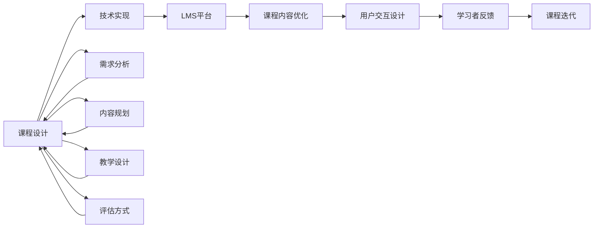

                 

# 如何利用技术能力创建在线 课程

> 关键词：在线教育, 课程设计, 技术实现, 学习管理系统(LMS), 课程内容优化, 用户交互设计

## 1. 背景介绍

在线教育是近年来迅猛发展的行业，尤其是在全球疫情背景下，越来越多的用户转向线上学习平台，以获取更加灵活、自由的学习体验。教育技术的发展，尤其是以人工智能、大数据、区块链等为核心的技术手段的引入，正在推动在线教育向智能化、个性化、泛在化方向迈进。本文章将详细探讨如何利用技术能力创建高质量的在线课程，从课程设计、技术实现到用户体验的各个环节进行深入剖析。

## 2. 核心概念与联系

### 2.1 核心概念概述

要创建优质的在线课程，首先需要理解以下几个核心概念：

- **在线教育**：指通过互联网技术，为用户提供随时随地学习的平台。课程形式多样，包括视频、音频、文本、互动练习等。
- **课程设计**：指根据学习目标和用户需求，设计课程内容、结构、评估方式等，确保课程的系统性和连贯性。
- **技术实现**：指利用编程、网络、数据库、人工智能等技术手段，将课程设计转化为可操作的平台和工具。
- **学习管理系统(LMS)**：指为在线课程提供的统一管理平台，包括课程创建、发布、学习跟踪、评估反馈等功能。
- **课程内容优化**：指通过数据分析、学习者反馈等手段，持续改进课程内容，提升学习效果。
- **用户交互设计**：指设计直观、易用、高效的用户界面和交互流程，提升用户体验和学习效果。

这些概念之间相互关联，共同构成了一个完整的在线课程生态系统。课程设计和技术实现是课程创建的基础，LMS平台提供了教学资源的管理和分发，课程内容优化和用户交互设计则进一步提升了课程的使用体验和学习效果。

### 2.2 核心概念原理和架构的 Mermaid 流程图



此流程图展示了在线课程从需求分析到迭代改进的完整流程，每个环节均相互关联，共同推动课程质量的提升。

## 3. 核心算法原理 & 具体操作步骤

### 3.1 算法原理概述

创建在线课程的核心算法原理主要集中在课程内容的设计和优化上。课程内容的设计需要考虑学习目标、学习者需求和资源限制，而课程优化则需要通过技术手段，如数据分析、个性化推荐、自适应学习等，持续改进课程，提升学习效果。

### 3.2 算法步骤详解

#### 3.2.1 课程内容设计

1. **需求分析**：通过调查问卷、访谈、数据分析等方式，确定目标受众和课程目标，明确课程的核心内容和结构。
2. **内容规划**：根据需求分析的结果，规划课程的章节、课时、知识点等，确保课程的系统性和连贯性。
3. **教学设计**：设计每节课的讲授方式、互动环节、作业布置等，以提升学习效果。

#### 3.2.2 课程内容优化

1. **数据分析**：利用学习管理系统收集学生的学习行为数据，如学习时间、答题情况等，分析学生的学习情况。
2. **个性化推荐**：根据学生的学习行为和偏好，推荐个性化的学习资源和路径。
3. **自适应学习**：通过智能算法，根据学生的学习进度和理解能力，调整课程难度和节奏。

#### 3.2.3 用户交互设计

1. **界面设计**：设计直观、易用的用户界面，确保课程内容可访问、可操作。
2. **交互设计**：设计高效的学习交互流程，如课程互动、讨论、测试等，提升学习体验。
3. **反馈机制**：建立用户反馈机制，及时收集学习者的意见和建议，不断优化课程内容。

### 3.3 算法优缺点

#### 3.3.1 优点

- **灵活性**：在线课程可以随时随地访问，适应不同学习者的需求和时间安排。
- **个性化**：利用技术手段，可以提供个性化的学习体验，提升学习效果。
- **资源丰富**：通过网络资源共享，课程内容可以更加丰富多样。
- **低成本**：相比于传统教育，在线课程的开发和运营成本较低。

#### 3.3.2 缺点

- **缺乏互动**：在线课程缺少面对面的互动，可能影响学习效果。
- **自主性要求高**：需要学习者具备较高的自我管理能力。
- **技术依赖**：课程的设计和优化需要一定的技术背景，对技术实现者的要求较高。

### 3.4 算法应用领域

在线课程技术的应用领域广泛，包括K-12教育、职业培训、继续教育、企业内部培训等。通过技术手段，可以显著提升这些领域的教育质量和效率。

## 4. 数学模型和公式 & 详细讲解 & 举例说明

### 4.1 数学模型构建

在线课程的优化可以通过以下数学模型进行构建：

- **学习效果评估模型**：
  $$
  E = \alpha \times C + \beta \times T
  $$
  其中，$E$为学习效果，$C$为课程内容质量，$T$为技术实现质量，$\alpha$和$\beta$为权重系数。

- **个性化推荐模型**：
  $$
  R = F(C, P, H)
  $$
  其中，$R$为个性化推荐结果，$C$为课程内容，$P$为用户偏好，$H$为历史学习行为。

- **自适应学习模型**：
  $$
  L = f(D, P, E)
  $$
  其中，$L$为学习进度，$D$为学习难度，$P$为用户属性，$E$为学习效果。

### 4.2 公式推导过程

- **学习效果评估模型推导**：
  $$
  E = \alpha \times C + \beta \times T
  $$
  该模型通过加权平均的方式，综合评估课程内容和技术实现对学习效果的影响。

- **个性化推荐模型推导**：
  $$
  R = F(C, P, H)
  $$
  该模型通过构建特征向量$(C, P, H)$，使用机器学习算法$F$进行推荐，以提高学习者的满意度。

- **自适应学习模型推导**：
  $$
  L = f(D, P, E)
  $$
  该模型通过动态调整学习难度$D$，根据用户属性$P$和当前学习效果$E$，优化学习进度$L$。

### 4.3 案例分析与讲解

假设我们有一个在线编程课程，根据公式推导，需要设计以下步骤：

1. **课程内容设计**：课程内容涉及Python基础、数据结构、算法设计等。
2. **技术实现**：利用HTML5、JavaScript、CSS等技术，实现互动练习、在线测试、即时反馈等功能。
3. **学习效果评估**：通过学生成绩、互动频率、完成时间等指标，评估课程效果。
4. **个性化推荐**：根据学生的学习进度和偏好，推荐适合的练习题和参考资料。
5. **自适应学习**：根据学生的学习效果和问题反馈，动态调整课程难度和练习题类型。

## 5. 项目实践：代码实例和详细解释说明

### 5.1 开发环境搭建

在线课程开发需要以下环境：

1. **编程环境**：Python、JavaScript、HTML5、CSS等。
2. **服务器环境**：Node.js、Django等。
3. **数据库环境**：MySQL、MongoDB等。
4. **工具库**：React、D3.js、Flask等。

### 5.2 源代码详细实现

#### 5.2.1 课程内容设计

```python
from django import forms

class CourseForm(forms.Form):
    name = forms.CharField(max_length=50)
    description = forms.CharField(max_length=200)
    platform = forms.ChoiceField(choices=[('Coursera', 'Coursera'), ('Udemy', 'Udemy'), ('EdX', 'EdX')])
    duration = forms.DurationField()
```

#### 5.2.2 技术实现

```javascript
class InteractiveModule {
    constructor(courseId) {
        this.courseId = courseId;
        this.content = this.loadContent();
    }
    
    loadContent() {
        // 加载课程内容，返回HTML
    }
    
    displayContent() {
        // 将HTML内容渲染到页面上
    }
    
    updateContent() {
        // 根据用户操作，动态更新内容
    }
}
```

#### 5.2.3 用户交互设计

```html
<div id="interactive-module">
    <div class="content">
        <!-- 课程内容 -->
    </div>
    <div class="interaction">
        <!-- 交互元素 -->
    </div>
</div>
```

### 5.3 代码解读与分析

- **课程内容设计**：使用Django框架，创建课程表单，包括课程名称、描述、平台、时长等属性。
- **技术实现**：使用JavaScript和React，创建交互模块，通过异步加载和渲染，提升用户体验。
- **用户交互设计**：使用HTML5和CSS，设计直观、易用的交互界面，确保课程内容可操作。

### 5.4 运行结果展示

运行上述代码后，可以在浏览器中看到完整的课程页面，包括课程内容、互动元素等。学生可以通过该页面进行课程学习，系统会根据学习行为进行评估和推荐。

## 6. 实际应用场景

在线课程技术已经被广泛应用于多个领域：

1. **K-12教育**：通过在线课程平台，提供基础教育和辅助教育，帮助学生进行个性化学习。
2. **职业培训**：为企业和职业院校提供专业技能培训，提升员工技能和工作效率。
3. **继续教育**：帮助在职人员进行知识更新和技能提升，适应职业发展需要。
4. **企业内部培训**：提供企业内部员工的专业技能培训和知识分享，提升团队整体素质。

## 7. 工具和资源推荐

### 7.1 学习资源推荐

- **Coursera、Udacity、edX等在线教育平台**：提供丰富的课程资源和学习社区，涵盖多个学科领域。
- **Khan Academy**：提供免费的数学、科学、历史等课程，适合各个年龄段的学习者。
- **Google Developers**：提供全面的编程和开发资源，适合技术学习和实践。
- **Coursera和edX提供的公开课**：免费的在线课程，涵盖多个学科领域，适合自主学习。

### 7.2 开发工具推荐

- **Django和Flask**：Python Web开发框架，适合快速构建课程平台。
- **React和Vue**：JavaScript前端框架，适合开发交互丰富的课程界面。
- **MongoDB和MySQL**：数据库管理系统，适合存储和处理用户数据。
- **Node.js和Express**：JavaScript服务器端框架，适合搭建课程平台后台。

### 7.3 相关论文推荐

- **Adaptive Learning in Large Enrollment Courses**：探讨自适应学习技术在大型在线课程中的应用。
- **Personalized Recommendation Systems in Education**：介绍个性化推荐系统在教育中的应用，提升学习效果。
- **Collaborative Filtering for Recommendation Systems**：研究协同过滤算法在推荐系统中的应用，优化个性化推荐效果。
- **Blockchain Technology in Education**：探讨区块链技术在教育中的应用，保障学习数据的隐私和安全。

## 8. 总结：未来发展趋势与挑战

### 8.1 研究成果总结

在线教育技术的发展，尤其是在线课程的创建和优化方面，已经取得了显著进展。通过技术手段，可以提供更加灵活、个性化和高效的学习体验，提升学习效果。

### 8.2 未来发展趋势

- **智能化和个性化**：未来在线课程将更加智能化和个性化，利用人工智能、大数据等技术手段，提升学习效果。
- **社交化学习**：在线课程将更加注重社交化学习，通过学习社区和讨论区，增强学习互动。
- **混合学习模式**：在线课程将与线下学习相结合，形成混合学习模式，提升学习效果。
- **虚拟现实和增强现实**：利用虚拟现实和增强现实技术，提供沉浸式的学习体验。
- **实时反馈和评估**：通过实时反馈和评估，及时调整学习进度和难度，提升学习效果。

### 8.3 面临的挑战

- **技术依赖**：在线课程的开发和优化需要较高的技术背景，对技术实现者的要求较高。
- **数据隐私和安全**：在线课程需要收集和处理大量的用户数据，如何保障数据隐私和安全是一个重要问题。
- **课程质量保障**：在线课程的质量保障是一个复杂的问题，需要考虑课程设计、内容质量、技术实现等多个方面。
- **互动和反馈**：在线课程缺少面对面的互动，可能影响学习效果，如何设计高效的互动和反馈机制是一个重要挑战。

### 8.4 研究展望

- **大规模个性化学习**：利用大数据和人工智能技术，实现大规模个性化学习，提升学习效果。
- **自适应学习技术**：进一步研究和优化自适应学习技术，提升学习者的自主性和学习效果。
- **混合学习模式**：探索混合学习模式，实现线上线下学习的有效结合。
- **区块链技术应用**：利用区块链技术，保障在线教育的数据隐私和安全。
- **虚拟现实和增强现实**：利用虚拟现实和增强现实技术，提供沉浸式的学习体验。

## 9. 附录：常见问题与解答

### Q1：如何设计高质量的在线课程？

A：高质量的在线课程需要考虑以下几个方面：

1. **需求分析**：通过调查问卷、访谈、数据分析等方式，确定目标受众和课程目标，明确课程的核心内容和结构。
2. **内容规划**：根据需求分析的结果，规划课程的章节、课时、知识点等，确保课程的系统性和连贯性。
3. **教学设计**：设计每节课的讲授方式、互动环节、作业布置等，以提升学习效果。
4. **技术实现**：利用编程、网络、数据库、人工智能等技术手段，将课程设计转化为可操作的平台和工具。
5. **课程优化**：通过数据分析、学习者反馈等手段，持续改进课程内容，提升学习效果。
6. **用户交互设计**：设计直观、易用、高效的用户界面和交互流程，提升用户体验和学习效果。

### Q2：在线课程开发需要哪些技术工具？

A：在线课程开发需要以下技术工具：

1. **编程环境**：Python、JavaScript、HTML5、CSS等。
2. **服务器环境**：Node.js、Django等。
3. **数据库环境**：MySQL、MongoDB等。
4. **工具库**：React、D3.js、Flask等。
5. **开发平台**：Jupyter Notebook、Google Colab等。

### Q3：如何保障在线课程的数据隐私和安全？

A：保障在线课程的数据隐私和安全需要以下几个方面：

1. **数据加密**：对用户数据进行加密处理，防止数据泄露。
2. **访问控制**：设置严格的访问权限控制，确保只有授权用户可以访问数据。
3. **匿名化处理**：对用户数据进行匿名化处理，保护用户隐私。
4. **安全审计**：定期进行安全审计，发现和修复潜在的安全漏洞。

### Q4：如何设计高效的互动和反馈机制？

A：设计高效的互动和反馈机制需要以下几个方面：

1. **在线讨论区**：建立在线讨论区，鼓励学生互相交流和讨论。
2. **即时反馈**：通过即时反馈机制，及时调整学习进度和难度。
3. **评价系统**：建立评价系统，收集学习者的反馈，不断优化课程内容。
4. **互动游戏**：设计互动游戏，增加学习的趣味性和参与度。

### Q5：在线课程的智能化和个性化是如何实现的？

A：在线课程的智能化和个性化可以通过以下方式实现：

1. **机器学习**：利用机器学习算法，分析用户的学习行为和偏好，提供个性化的学习建议。
2. **大数据分析**：通过大数据分析，收集和处理用户的学习数据，发现学习规律和趋势。
3. **自适应学习系统**：利用自适应学习系统，根据用户的学习进度和理解能力，动态调整学习内容和难度。
4. **个性化推荐系统**：利用推荐系统，根据用户的学习行为和偏好，推荐个性化的学习资源和路径。

---

作者：禅与计算机程序设计艺术 / Zen and the Art of Computer Programming

