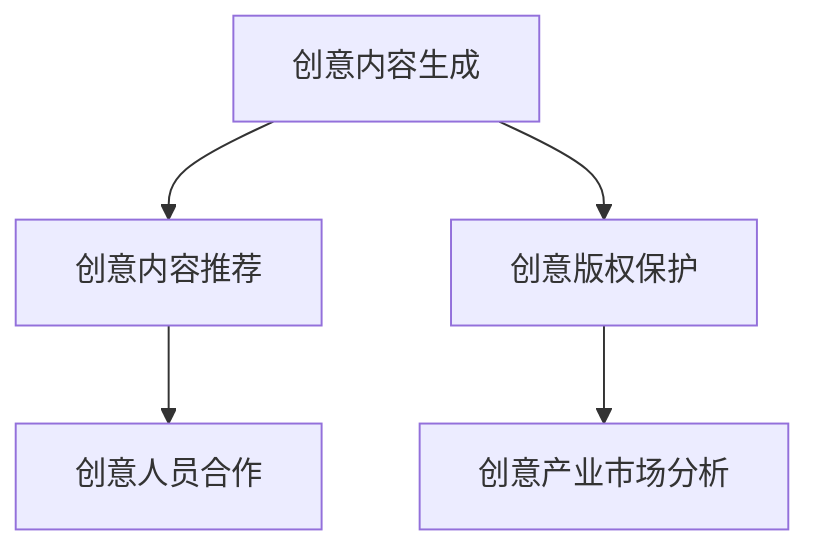

                 

# 如何利用技术能力进行创意产业革新

## 1. 背景介绍

### 1.1 问题由来
创意产业作为现代经济的重要组成部分，正逐渐成为推动社会发展和经济增长的关键力量。然而，传统的创意产业往往依赖于创意人员的直觉和经验，缺乏系统的数据支持和科学方法。这使得创意产业的效率和创新力受到制约，难以适应快速变化的市场需求。

技术的发展为创意产业带来了新的可能。通过将数据驱动的科学方法与创意人员的艺术才能相结合，可以显著提升创意产业的生产效率和创新能力。利用AI、大数据、区块链等前沿技术，可以实现创意内容的高效生成、智能推荐、版权保护等功能，极大地拓展了创意产业的发展空间。

### 1.2 问题核心关键点
本文将探讨如何利用技术能力，特别是人工智能、大数据、区块链等前沿技术，进行创意产业的革新。主要包括以下几个方面：
- 创意内容的生成与推荐
- 创意版权的保护与管理
- 创意产业的市场监测与趋势分析
- 创意人员的合作与协作

### 1.3 问题研究意义
通过技术创新，创意产业可以摆脱对传统创意人员依赖的束缚，实现智能化、高效化和系统化的发展。技术革新可以：
- 提升创意内容的生产效率，降低成本，扩大生产规模。
- 优化创意内容的分发与推荐，满足用户多样化需求。
- 保护创意人员的知识产权，激发创新热情。
- 提供数据支持，指导创意产业的市场决策与规划。

## 2. 核心概念与联系

### 2.1 核心概念概述

为更好地理解技术在创意产业革新中的应用，本节将介绍几个密切相关的核心概念：

- **创意内容生成**：利用AI技术，自动生成文本、图像、音乐、视频等多媒体创意内容。
- **创意内容推荐**：通过算法模型，根据用户偏好、行为数据等，智能推荐创意内容。
- **创意版权保护**：利用区块链等技术，实现创意作品的数字指纹和分布式版权管理。
- **创意产业市场分析**：通过大数据分析，识别市场趋势、热点和用户需求，指导创意产业的市场决策。
- **创意人员合作**：利用AI协作工具，促进创意人员之间的协同工作，提高创意产出效率。

这些核心概念之间的逻辑关系可以通过以下Mermaid流程图来展示：



这个流程图展示了几类创意产业相关的核心概念及其之间的关系：

1. 创意内容生成是创意产业的基础，可以提供大量的素材和素材库。
2. 创意内容推荐利用生成内容进行精准推送，提升用户体验和满意度。
3. 创意版权保护为创意产业提供了法律保障，避免盗版和侵权行为。
4. 创意产业市场分析为创意产业提供了数据支持，指导创意内容的创作和推广。
5. 创意人员合作促进了创意产业的人才流动，提高整个产业的创新能力。

这些概念共同构成了创意产业的技术基础，使其能够不断创新，适应市场变化，提升整体竞争力。

## 3. 核心算法原理 & 具体操作步骤
### 3.1 算法原理概述

创意产业的革新依赖于多种前沿技术的结合使用。本文将以创意内容生成和推荐为例，阐述基于人工智能和大数据的创意产业革新方法。

**创意内容生成**：
创意内容生成的核心算法是生成对抗网络（GAN）和变分自编码器（VAE）等深度学习模型。这些模型通过自监督学习，可以生成高质量的创意内容，如音乐、图像、视频等。生成的内容经过微调，可以满足特定的风格、情感和主题要求。

**创意内容推荐**：
创意内容推荐的算法模型主要基于协同过滤、基于内容的推荐和深度学习等方法。协同过滤通过分析用户行为数据，推荐相似内容的创意作品；基于内容的推荐则通过分析创意内容的元数据，如关键词、主题等，进行内容推荐；深度学习模型（如神经网络、神经协同过滤等）则通过学习用户与内容之间的复杂关系，实现个性化的推荐。

### 3.2 算法步骤详解

#### 3.2.1 创意内容生成步骤

1. **数据准备**：收集大量的文本、图像、音频等创意素材，作为训练数据集。
2. **模型选择**：选择适合的生成模型，如GAN、VAE等，并进行初始化。
3. **训练模型**：利用训练数据集训练生成模型，优化模型参数。
4. **内容生成**：使用训练好的生成模型，生成创意内容，并进行微调，以满足特定需求。

#### 3.2.2 创意内容推荐步骤

1. **数据准备**：收集用户行为数据（如浏览历史、评分记录等）和创意内容数据。
2. **模型选择**：选择适合的推荐模型，如协同过滤、基于内容的推荐、深度学习模型等。
3. **训练模型**：利用用户行为数据和创意内容数据训练推荐模型，优化模型参数。
4. **内容推荐**：使用训练好的推荐模型，推荐符合用户偏好的创意内容，并进行实时更新。

### 3.3 算法优缺点

**创意内容生成**：
优点：
- 生成高质量创意内容，降低创作成本。
- 实现个性化创作，满足用户多样化需求。

缺点：
- 生成内容可能缺乏人类情感和深度。
- 需要大量高质量训练数据，数据获取成本较高。

**创意内容推荐**：
优点：
- 提高创意内容的分发效率，优化用户体验。
- 个性化推荐，提升用户满意度。

缺点：
- 推荐模型可能存在冷启动问题，新用户推荐效果不佳。
- 推荐算法可能存在数据隐私和安全风险。

### 3.4 算法应用领域

创意内容生成和推荐技术在多个领域得到了广泛应用：

- **音乐创作**：通过GAN生成音乐，并进行个性化的创作推荐。
- **图像设计**：利用VAE生成图像，并进行风格迁移和创意设计。
- **视频制作**：使用生成对抗网络生成视频片段，并进行剪辑和特效处理。
- **广告创意**：根据用户行为数据，自动生成广告文案和图片，并进行推荐。
- **游戏开发**：生成游戏角色、场景等素材，并进行智能推荐。

## 4. 数学模型和公式 & 详细讲解  
### 4.1 数学模型构建

本节将使用数学语言对创意内容生成和推荐的技术原理进行更加严格的刻画。

**创意内容生成**：
假设生成模型为 $G(z)$，其中 $z$ 为随机噪声向量。生成模型训练的目标是最大化生成内容的似然，即：
$$
\max_{G} \log p(x|G)
$$
其中 $p(x|G)$ 表示通过模型 $G$ 生成的内容 $x$ 的概率分布。训练过程通常通过最大化似然损失函数来实现：
$$
\mathcal{L}_{\text{gan}} = \mathbb{E}_{x \sim p_{\text{data}}} [\log D(x)] + \mathbb{E}_{z \sim p(z)} [\log(1 - D(G(z))]
$$
其中 $D(x)$ 为判别器，用于区分真实数据和生成数据。

**创意内容推荐**：
假设推荐模型为 $R(u, x)$，其中 $u$ 为用户行为特征向量，$x$ 为创意内容特征向量。推荐模型训练的目标是最大化用户满意度和内容曝光度，即：
$$
\max_{R} \log p(u|R)
$$
其中 $p(u|R)$ 表示通过推荐模型 $R$ 推荐给用户 $u$ 的内容 $x$ 的概率分布。训练过程通常通过最大化交叉熵损失函数来实现：
$$
\mathcal{L}_{\text{rec}} = -\frac{1}{N} \sum_{i=1}^N \sum_{j=1}^M [y_{i,j} \log R(u_i, x_j) + (1 - y_{i,j}) \log (1 - R(u_i, x_j))]
$$
其中 $y_{i,j}$ 为真实评分数据。

### 4.2 公式推导过程

以下我们以创意内容生成为例，推导生成对抗网络（GAN）的数学原理。

GAN由生成器和判别器两个部分组成，其中生成器 $G$ 将随机噪声 $z$ 转化为生成内容 $x$，判别器 $D$ 用于区分生成内容和真实内容。GAN的目标是使生成内容尽可能接近真实内容，即：
$$
\max_G \min_D \mathcal{L}_{\text{gan}}
$$
其中生成器的损失函数为：
$$
\mathcal{L}_G = -\mathbb{E}_{z \sim p(z)} [\log D(G(z))]
$$
判别器的损失函数为：
$$
\mathcal{L}_D = -\mathbb{E}_{x \sim p_{\text{data}}} [\log D(x)] - \mathbb{E}_{z \sim p(z)} [\log(1 - D(G(z)))
$$

通过交替训练生成器和判别器，优化目标函数，可以生成高质量的创意内容。

### 4.3 案例分析与讲解

**创意内容生成案例**：
某音乐创作平台使用GAN模型生成音乐，具体步骤如下：
1. **数据准备**：收集大量已发表音乐作品，作为训练数据集。
2. **模型选择**：选择适合的GAN模型，并进行初始化。
3. **训练模型**：利用训练数据集训练GAN模型，优化生成器的参数。
4. **内容生成**：使用训练好的生成器，生成新的音乐作品，并进行微调，以满足特定的风格和情感要求。

**创意内容推荐案例**：
某视频平台使用基于协同过滤的推荐算法，具体步骤如下：
1. **数据准备**：收集用户观看历史和视频元数据，作为训练数据集。
2. **模型选择**：选择基于协同过滤的推荐算法，并进行初始化。
3. **训练模型**：利用训练数据集训练推荐模型，优化模型参数。
4. **内容推荐**：使用训练好的推荐模型，为用户推荐感兴趣的视频内容，并进行实时更新。

## 5. 项目实践：代码实例和详细解释说明
### 5.1 开发环境搭建

在进行创意产业技术实践前，我们需要准备好开发环境。以下是使用Python进行TensorFlow开发的环境配置流程：

1. 安装Anaconda：从官网下载并安装Anaconda，用于创建独立的Python环境。

2. 创建并激活虚拟环境：
```bash
conda create -n tf-env python=3.8 
conda activate tf-env
```

3. 安装TensorFlow：根据CUDA版本，从官网获取对应的安装命令。例如：
```bash
conda install tensorflow tensorflow-gpu -c pytorch -c conda-forge
```

4. 安装各类工具包：
```bash
pip install numpy pandas scikit-learn matplotlib tqdm jupyter notebook ipython
```

完成上述步骤后，即可在`tf-env`环境中开始创意产业技术实践。

### 5.2 源代码详细实现

这里我们以创意内容生成为例，给出使用TensorFlow实现GAN模型的PyTorch代码实现。

首先，定义生成器和判别器的计算图：

```python
import tensorflow as tf
from tensorflow.keras import layers

# 定义生成器计算图
def make_generator_model():
    model = tf.keras.Sequential()
    model.add(layers.Dense(256, use_bias=False, input_shape=(100,)))
    model.add(layers.BatchNormalization())
    model.add(layers.LeakyReLU())
    model.add(layers.Dense(512))
    model.add(layers.BatchNormalization())
    model.add(layers.LeakyReLU())
    model.add(layers.Dense(1024))
    model.add(layers.BatchNormalization())
    model.add(layers.LeakyReLU())
    model.add(layers.Dense(784, activation='tanh'))
    return model

# 定义判别器计算图
def make_discriminator_model():
    model = tf.keras.Sequential()
    model.add(layers.Flatten(input_shape=(28, 28)))
    model.add(layers.Dense(1024))
    model.add(layers.LeakyReLU())
    model.add(layers.Dropout(0.4))
    model.add(layers.Dense(512))
    model.add(layers.LeakyReLU())
    model.add(layers.Dropout(0.4))
    model.add(layers.Dense(1, activation='sigmoid'))
    return model
```

然后，定义损失函数和优化器：

```python
# 定义损失函数
def loss_fn(real_output, fake_output):
    real_loss = tf.keras.losses.BinaryCrossentropy()(real_output, real_output)
    fake_loss = tf.keras.losses.BinaryCrossentropy()(fake_output, tf.zeros_like(fake_output))
    return real_loss + fake_loss

# 定义优化器
optimizer = tf.keras.optimizers.Adam(1e-4)
```

接着，定义训练函数：

```python
@tf.function
def train_step(images):
    noise = tf.random.normal([BATCH_SIZE, 100])

    with tf.GradientTape() as gen_tape, tf.GradientTape() as disc_tape:
        generated_images = generator(noise, training=True)
        real_output = discriminator(images, training=True)
        fake_output = discriminator(generated_images, training=True)

        gen_loss = loss_fn(real_output, fake_output)
        disc_loss = loss_fn(real_output, real_output) + loss_fn(fake_output, tf.zeros_like(fake_output))

    gradients_of_generator = gen_tape.gradient(gen_loss, generator.trainable_variables)
    gradients_of_discriminator = disc_tape.gradient(disc_loss, discriminator.trainable_variables)

    optimizer.apply_gradients(zip(gradients_of_generator, generator.trainable_variables))
    optimizer.apply_gradients(zip(gradients_of_discriminator, discriminator.trainable_variables))

def train_loop(dataset):
    for epoch in range(EPOCHS):
        for images in dataset:
            train_step(images)
        print(f"Epoch {epoch+1} complete.")
```

最后，启动训练流程：

```python
dataset = load_dataset()  # 加载数据集
train_loop(dataset)
```

以上就是使用TensorFlow实现GAN模型进行创意内容生成的完整代码实现。可以看到，通过TensorFlow和Keras的高级API，我们可以轻松构建创意内容生成模型的计算图，并利用其优化器进行高效训练。

### 5.3 代码解读与分析

让我们再详细解读一下关键代码的实现细节：

**生成器和判别器计算图定义**：
- `make_generator_model`和`make_discriminator_model`函数定义了生成器和判别器的计算图结构，使用了TF Keras的高级API，使得代码简洁高效。
- 生成器使用多个全连接层、BatchNormalization、LeakyReLU等激活函数，生成符合特定风格和情感要求的创意内容。
- 判别器使用Flatten、Dense、LeakyReLU、Dropout等操作，区分真实数据和生成数据。

**损失函数定义**：
- `loss_fn`函数定义了GAN模型的损失函数，结合真实数据和生成数据的输出，计算总损失。
- 使用了TensorFlow内置的二元交叉熵损失函数，计算真实数据和生成数据的区别。

**优化器定义**：
- `optimizer`变量定义了Adam优化器，用于训练生成器和判别器。
- 通过`apply_gradients`方法，将优化器应用于生成器和判别器的变量更新。

**训练函数定义**：
- `train_step`函数定义了单次训练的流程，利用梯度下降优化模型参数。
- 通过`GradientTape`记录梯度，使用`apply_gradients`更新模型参数。
- 通过`tf.function`装饰器，将训练函数编译为图模式，提升训练效率。

**训练流程启动**：
- `train_loop`函数定义了完整的训练流程，循环遍历数据集，执行单次训练，并输出训练进度。
- 通过`load_dataset`函数加载数据集，进行模型训练。

可以看到，TensorFlow提供了强大的API和工具，使得创意内容生成模型的开发和训练变得高效便捷。开发者可以更多地关注算法和业务逻辑，而不必过多关注底层的实现细节。

当然，工业级的系统实现还需考虑更多因素，如模型的保存和部署、超参数的自动搜索、更多的训练技巧等。但核心的创意内容生成技术基本与此类似。

## 6. 实际应用场景
### 6.1 智能音乐创作

基于GAN模型的创意内容生成技术，可以用于智能音乐创作。通过分析用户的偏好和风格，生成个性化的音乐作品。

具体而言，平台可以收集用户的听歌历史、评分记录等数据，分析其偏好和情感倾向，并根据这些数据生成新的音乐作品。生成的音乐作品可以自动推送给用户，供其试听和反馈。

### 6.2 个性化视频推荐

利用创意内容推荐技术，可以优化视频内容的推荐效果，提升用户体验。

平台可以收集用户的观看历史和行为数据，分析其偏好和兴趣点，并根据这些数据推荐相关的视频内容。推荐系统可以实时更新，动态调整推荐内容，满足用户多样化需求。

### 6.3 广告创意生成

通过生成对抗网络等技术，可以自动生成广告文案和图片，并进行个性化推荐。

广告主可以上传广告素材和目标用户画像，平台自动生成创意内容，并进行精准投放。生成的广告文案和图片可以不断优化，提升广告效果和转化率。

### 6.4 游戏角色设计

基于GAN等技术，可以自动生成游戏角色和场景，并进行智能推荐。

游戏开发者可以上传游戏素材和用户需求，平台自动生成创意素材，并进行智能推荐。生成的素材可以不断优化，提升游戏设计和用户体验。

### 6.5 创意产品设计

利用创意内容生成技术，可以自动生成产品设计和创意素材，并进行智能推荐。

设计师可以上传设计需求和素材库，平台自动生成创意内容，并进行智能推荐。生成的设计素材可以不断优化，提升设计效果和用户体验。

## 7. 工具和资源推荐
### 7.1 学习资源推荐

为了帮助开发者系统掌握创意产业技术的基础知识，这里推荐一些优质的学习资源：

1. TensorFlow官方文档：TensorFlow的官方文档，提供了详尽的使用指南和样例代码，是入门TensorFlow的理想选择。
2. PyTorch官方文档：PyTorch的官方文档，提供了丰富的深度学习框架和工具库，适合进行深度学习和创意内容生成任务。
3. Keras官方文档：Keras的官方文档，提供了简单易用的深度学习API，适合进行快速原型开发和创意内容生成任务。
4. Coursera深度学习课程：由斯坦福大学等名校开设的深度学习课程，系统讲解深度学习的基本概念和实践技巧，适合系统学习深度学习技术。
5. Udacity深度学习课程：Udacity的深度学习课程，提供实战项目和项目指导，适合动手实践深度学习任务。

通过对这些资源的学习实践，相信你一定能够快速掌握创意产业技术的基础知识，并用于解决实际的创意产业问题。

### 7.2 开发工具推荐

高效的开发离不开优秀的工具支持。以下是几款用于创意产业技术开发的常用工具：

1. TensorFlow：由Google主导开发的深度学习框架，功能强大，适合进行大规模深度学习任务。
2. PyTorch：由Facebook主导开发的深度学习框架，灵活便捷，适合进行快速原型开发。
3. Keras：基于TensorFlow的高级API，提供了简单易用的深度学习API，适合进行快速原型开发和创意内容生成任务。
4. Jupyter Notebook：开源的交互式编程环境，支持Python和TensorFlow等深度学习框架，适合进行原型开发和模型调试。
5. Visual Studio Code：轻量级的代码编辑器，支持多种编程语言和插件，适合进行代码编写和模型训练。

合理利用这些工具，可以显著提升创意产业技术的开发效率，加快创新迭代的步伐。

### 7.3 相关论文推荐

创意产业技术的发展源于学界的持续研究。以下是几篇奠基性的相关论文，推荐阅读：

1. Generative Adversarial Networks (GANs)：Ian Goodfellow等人的GAN论文，提出了生成对抗网络的基本框架，开创了创意内容生成的新领域。
2. Variational Autoencoders (VAEs)：Diederik P. Kingma等人的VAE论文，提出变分自编码器的理论基础，提供了生成创意内容的数学模型。
3. Deep Collaborative Filtering for Recommender Systems：Breese等人的协同过滤论文，提供了协同过滤推荐的基本方法，适用于创意内容推荐。
4. Attention is All You Need (Transformers)：Ashish Vaswani等人的Transformer论文，提出了注意力机制的基本原理，适用于深度学习推荐和创意内容生成。
5. Music Transformer Networks：Shaoqing Chen等人的音乐生成论文，提出基于Transformer的创意内容生成模型，适用于音乐创作和生成。

这些论文代表了大创意产业技术的发展脉络。通过学习这些前沿成果，可以帮助研究者把握学科前进方向，激发更多的创新灵感。

## 8. 总结：未来发展趋势与挑战

### 8.1 总结

本文对利用技术能力进行创意产业革新的方法进行了全面系统的介绍。首先阐述了创意产业技术革新的背景和意义，明确了技术革新在提升创意产业生产效率和创新能力方面的价值。其次，从原理到实践，详细讲解了创意内容生成和推荐的数学模型和算法步骤，给出了创意产业技术开发的完整代码实例。同时，本文还广泛探讨了创意内容生成和推荐技术在多个行业领域的应用前景，展示了技术的广泛应用空间。

通过本文的系统梳理，可以看到，技术创新已经成为推动创意产业革新不可或缺的力量。技术革新可以：
- 提升创意内容的生产效率，降低成本，扩大生产规模。
- 优化创意内容的分发与推荐，满足用户多样化需求。
- 保护创意人员的知识产权，激发创新热情。
- 提供数据支持，指导创意产业的市场决策与规划。

### 8.2 未来发展趋势

展望未来，创意产业技术将呈现以下几个发展趋势：

1. **技术融合**：创意产业技术将与其他领域技术深度融合，如物联网、AR/VR、区块链等，推动创意产业向多领域跨界发展。
2. **智能化**：基于深度学习和大数据的创意内容生成和推荐技术将不断优化，实现更加智能化和个性化的创作和推荐。
3. **协同化**：创意产业将更多利用AI协作工具，促进创意人员之间的协同工作，提高创意产出效率。
4. **生态化**：创意产业将建立更加开放和协作的生态系统，实现资源共享和价值最大化。
5. **人性化**：创意内容将更多体现人类的情感和深度，提升用户的情感共鸣和互动体验。

这些趋势凸显了创意产业技术革新的广阔前景。技术创新将继续推动创意产业的智能化、协同化和生态化发展，为创意产业带来更多的机遇和挑战。

### 8.3 面临的挑战

尽管创意产业技术已经取得了显著进展，但在迈向更加智能化、协同化和生态化的应用过程中，仍面临诸多挑战：

1. **数据质量与隐私**：创意产业技术依赖于高质量的数据和用户隐私保护。如何获取、清洗和保护数据，避免数据泄露和滥用，是一个重要问题。
2. **技术壁垒**：创意产业技术需要跨学科的知识和技能，技术门槛较高。如何降低技术壁垒，推动技术普及和应用，是一个重要问题。
3. **创新激励**：创意产业技术需要持续的创新和优化，如何激励创意人员和研发团队进行技术创新，是一个重要问题。
4. **知识产权保护**：创意内容容易受到盗版和侵权，如何保护创意人员的知识产权，是一个重要问题。
5. **市场适应性**：创意内容推荐系统需要不断适应市场变化和用户需求，如何提高系统的市场适应性，是一个重要问题。

### 8.4 未来突破

面对创意产业技术面临的挑战，未来的研究需要在以下几个方面寻求新的突破：

1. **数据获取与隐私保护**：建立完善的隐私保护机制，确保用户数据的安全性。同时优化数据清洗和预处理流程，提高数据质量。
2. **技术普及与培训**：通过在线课程和开源项目，降低技术壁垒，普及创意产业技术。同时建立创意产业人才培训体系，培养更多专业人才。
3. **激励机制设计**：建立合理的激励机制，激发创意人员的创新热情。可以考虑采用股权激励、奖金激励等多元化激励方式。
4. **知识产权保护**：利用区块链等技术，实现创意内容的数字指纹和分布式版权管理，确保创意内容的知识产权保护。
5. **市场适应性提升**：通过持续学习和优化推荐算法，提高创意内容推荐系统的市场适应性。可以考虑引入因果推断和在线学习技术，动态调整推荐策略。

这些研究方向的探索，必将引领创意产业技术迈向更高的台阶，为创意产业带来更多的机遇和挑战。面向未来，创意产业技术还需要与其他人工智能技术进行更深入的融合，如知识表示、因果推理、强化学习等，多路径协同发力，共同推动创意产业技术的进步。只有勇于创新、敢于突破，才能不断拓展创意产业的边界，让技术创新更好地造福人类社会。

## 9. 附录：常见问题与解答

**Q1：创意内容生成是否适合所有创意产业领域？**

A: 创意内容生成技术可以应用于多个创意产业领域，如音乐、游戏、广告、视频等。但对于一些特定领域的创意产业，如医学、法律等，仅仅依靠创意内容生成可能无法满足需求。此时需要在特定领域语料上进一步预训练，再进行微调，才能获得理想效果。

**Q2：创意内容推荐是否需要大量标注数据？**

A: 创意内容推荐通常不需要大量标注数据。推荐系统可以通过分析用户行为数据和创意内容元数据，进行智能推荐。相比传统的基于用户评分等标注数据的推荐方法，创意内容推荐可以通过数据挖掘和深度学习实现更个性化和高效的推荐。

**Q3：创意产业技术开发中需要注意哪些问题？**

A: 创意产业技术开发中需要注意以下问题：
1. 数据获取和隐私保护。
2. 技术门槛和普及。
3. 创新激励机制。
4. 知识产权保护。
5. 市场适应性和动态调整。

这些问题的解决需要跨学科的合作和多维度的优化，才能推动创意产业技术的创新和应用。

**Q4：创意产业技术未来有哪些发展方向？**

A: 创意产业技术未来的发展方向包括：
1. 技术融合与跨界发展。
2. 智能化和个性化。
3. 协同化与生态化。
4. 人性化与互动体验。
5. 数据质量与隐私保护。

这些方向凸显了创意产业技术创新的广阔前景，将为创意产业带来更多的机遇和挑战。

---

作者：禅与计算机程序设计艺术 / Zen and the Art of Computer Programming

