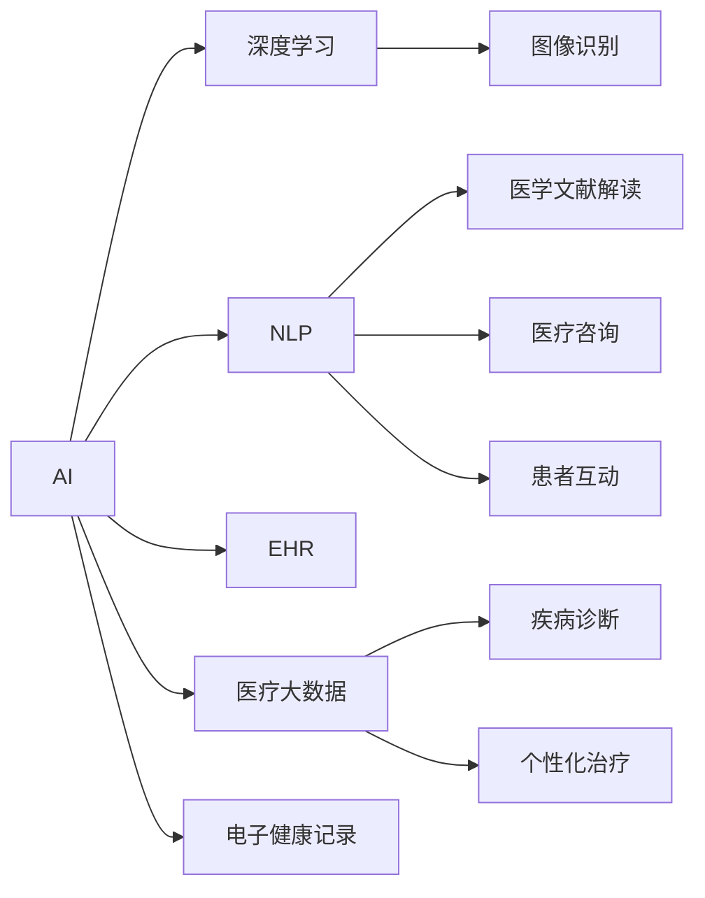

                 

# 如何利用技术能力进行医疗科技创新

## 1. 背景介绍

### 1.1 问题由来

医疗健康是人类社会发展的基石，自古以来一直是人类关注的焦点。但传统医疗方式存在诸多瓶颈，如医疗资源分布不均、诊疗效率低、疾病预防手段有限等，使得医疗服务的质量和效率难以满足社会需求。近年来，随着人工智能(AI)技术的飞速发展，借助技术手段进行医疗创新，成为提升医疗服务水平的重要路径。

### 1.2 问题核心关键点

在AI技术驱动下，医疗创新主要围绕以下几个关键点展开：
- **数据驱动**：通过收集、处理和分析医疗大数据，挖掘潜在的医疗价值。
- **模型优化**：使用深度学习、自然语言处理等技术，构建高效、准确的医疗模型。
- **人机协同**：推动AI与人类医疗专家的协同工作，提升诊断和治疗的精度和效率。
- **实时响应**：构建实时监控和预警系统，及时捕捉和响应患者健康状况变化。
- **个性化服务**：根据患者的病史、基因信息等个性化特征，提供量身定制的医疗服务。

## 2. 核心概念与联系

### 2.1 核心概念概述

为更好地理解如何利用技术能力进行医疗科技创新，本节将介绍几个关键概念及其相互联系：

- **人工智能(AI)**：一种通过模拟人类智能行为，实现信息处理和决策的计算技术。在医疗领域，AI技术可以用于图像识别、疾病诊断、个性化治疗等多个方面。

- **深度学习(Deep Learning, DL)**：一种基于多层神经网络的机器学习方法，适用于处理大规模复杂数据。在医疗领域，深度学习模型能够从医学影像、电子健康记录等大数据中提取特征，辅助诊断和治疗。

- **自然语言处理(Natural Language Processing, NLP)**：一种使计算机理解、生成人类语言的技术。在医疗领域，NLP技术可以用于解读医学文献、医疗咨询、患者互动等。

- **电子健康记录(Electronic Health Records, EHR)**：一种以电子形式记录患者健康信息的系统。在医疗领域，EHR数据是AI和深度学习模型的重要数据来源。

- **医疗大数据(Healthcare Big Data)**：指在医疗领域产生、收集和存储的大规模数据集。通过分析这些数据，可以获得有价值的医疗洞察，优化诊疗流程。

这些概念共同构成了AI在医疗领域的核心技术框架，通过数据驱动和模型优化，实现人机协同、实时响应和个性化服务。以下通过Mermaid流程图展示这些概念之间的关系：



## 3. 核心算法原理 & 具体操作步骤

### 3.1 算法原理概述

利用技术能力进行医疗创新，主要依赖于数据驱动和模型优化两个核心步骤。其中，数据驱动通过收集和分析医疗大数据，提供模型训练的依据；模型优化则通过构建深度学习、自然语言处理等技术模型，提升医疗服务的精度和效率。

形式化地，设 $D$ 为医疗数据集，$M_{\theta}$ 为深度学习模型，其优化目标为最小化损失函数 $\mathcal{L}(M_{\theta},D)$，以提升模型的预测准确性。假设模型的预测结果为 $y_{\hat{\theta}}$，则优化目标为：

$$
\hat{\theta}=\mathop{\arg\min}_{\theta} \mathcal{L}(y_{\hat{\theta}},y)
$$

其中，$y$ 为真实标签，$\mathcal{L}$ 为损失函数，$y_{\hat{\theta}}$ 为模型预测输出。

### 3.2 算法步骤详解

基于数据驱动和模型优化的医疗创新过程，主要包括以下几个步骤：

**Step 1: 数据收集与预处理**
- 收集医疗领域的数据源，如电子健康记录、医学影像、基因数据等。
- 清洗数据，去除噪声、冗余和异常值，确保数据质量和一致性。
- 对数据进行标准化和归一化，以便后续模型处理。

**Step 2: 数据标注与构建数据集**
- 根据具体任务需求，对数据进行标注，如标注医学影像的病变位置、标注电子健康记录的诊断结果等。
- 构建训练集、验证集和测试集，确保模型在各种数据分布上都能表现稳定。

**Step 3: 模型构建与训练**
- 选择合适的深度学习模型，如卷积神经网络(CNN)、循环神经网络(RNN)、Transformer等，根据任务需求设计网络结构和参数。
- 将预处理后的数据输入模型，进行前向传播计算输出。
- 计算损失函数，通过反向传播算法更新模型参数，优化模型预测能力。
- 在验证集上评估模型性能，调整模型参数和超参数，确保模型泛化能力。

**Step 4: 模型部署与应用**
- 将训练好的模型部署到实际医疗系统中，如电子健康记录系统、医学影像诊断系统等。
- 集成模型到用户接口，提供便捷的医疗服务。
- 持续收集新数据，定期更新和优化模型，保持模型性能。

### 3.3 算法优缺点

利用技术能力进行医疗创新的优点包括：
- **数据驱动**：能够充分利用医疗大数据，挖掘潜在的医疗价值，提升诊疗效率。
- **模型优化**：深度学习、自然语言处理等技术模型的引入，使得医疗服务的精度和效率显著提升。
- **人机协同**：通过AI与医疗专家的协同工作，提升诊断和治疗的可靠性。

同时，这些方法也存在一些局限性：
- **数据隐私与安全**：医疗数据的敏感性和隐私性要求严格的数据保护措施，增加了技术实现的复杂性。
- **模型解释性**：复杂的深度学习模型通常缺乏可解释性，难以被医生和患者理解和接受。
- **伦理问题**：AI在医疗决策中的作用需要明确，避免过度依赖AI导致医生职责不清。
- **计算资源需求**：构建和部署AI模型需要大量的计算资源，对医疗机构的硬件设施提出了较高要求。

尽管存在这些局限性，但AI在医疗领域的应用前景仍然广阔，推动了医疗服务的数字化、智能化和个性化进程。

### 3.4 算法应用领域

基于技术能力进行医疗创新的应用领域非常广泛，主要包括以下几个方面：

- **医学影像分析**：利用深度学习模型对医学影像进行自动标注、分类和分析，辅助放射科医生进行诊断。如对肺部CT影像进行结节检测，对乳腺X光片进行乳腺癌筛查等。
- **电子健康记录分析**：通过自然语言处理技术，解析电子健康记录中的非结构化文本信息，提取疾病诊断、治疗方案等信息，辅助医生制定诊疗方案。
- **个性化医疗**：结合基因数据和病历信息，构建个性化治疗方案，提供量身定制的医疗服务，如基因驱动的癌症治疗、精准医学等。
- **智能问诊**：使用自然语言处理技术，构建智能问诊系统，通过问答形式获取患者症状，提供初步诊断和建议。
- **医疗资源优化**：通过大数据分析，优化医疗资源的分配和管理，提升医院运行效率，如病人流量预测、手术室排程等。
- **医疗知识图谱构建**：利用知识图谱技术，构建医学领域的知识图谱，整合医学文献、诊疗指南等信息，辅助医生学习和决策。

## 4. 数学模型和公式 & 详细讲解 & 举例说明

### 4.1 数学模型构建

为更严格地刻画基于技术能力进行医疗创新的过程，我们构建一个数学模型进行详细讲解。

设 $D=\{(x_i,y_i)\}_{i=1}^N$ 为医疗数据集，其中 $x_i$ 为输入，如医学影像、电子健康记录等，$y_i$ 为输出，如诊断结果、治疗方案等。设 $M_{\theta}$ 为深度学习模型，其优化目标为：

$$
\hat{\theta}=\mathop{\arg\min}_{\theta} \mathcal{L}(M_{\theta},D)
$$

其中，$\mathcal{L}$ 为损失函数，可以采用交叉熵损失、均方误差损失等。

### 4.2 公式推导过程

以医学影像分类任务为例，假设输入为 $x_i$，输出为 $y_i$，模型 $M_{\theta}$ 的输出为 $y_{\hat{\theta}}$。交叉熵损失函数为：

$$
\ell(x_i,y_i)= -\sum_{i=1}^N y_i \log M_{\hat{\theta}}(x_i)
$$

将 $M_{\hat{\theta}}(x_i)$ 展开，得：

$$
\ell(x_i,y_i)=-\sum_{i=1}^N y_i \log \sigma(\sum_{j=1}^m \theta_{ij} x_{ij} + b_i)
$$

其中，$\sigma$ 为激活函数，$m$ 为模型层数，$\theta$ 为模型参数，$x_{ij}$ 为输入向量。通过反向传播算法计算损失函数对参数 $\theta$ 的梯度，使用优化算法更新模型参数，直到收敛。

### 4.3 案例分析与讲解

以下我们以医学影像分类为例，详细讲解基于技术能力进行医疗创新的过程。

假设有一张肺部CT影像，需要判断其是否存在结节。首先，将影像数据输入卷积神经网络模型进行特征提取，得到特征表示 $h(x)$。然后，将特征表示输入全连接层进行分类，得到模型预测结果 $y_{\hat{\theta}}$。最后，通过计算交叉熵损失 $\ell(x_i,y_i)$，使用反向传播算法更新模型参数，最小化损失函数，提升模型预测准确性。

## 5. 项目实践：代码实例和详细解释说明

### 5.1 开发环境搭建

为了便于开展医疗科技创新项目，首先需要搭建一个适合的技术环境。以下是一个基本的Python开发环境搭建步骤：

1. 安装Anaconda：从官网下载并安装Anaconda，用于创建独立的Python环境。

2. 创建并激活虚拟环境：
```bash
conda create -n medtech python=3.8 
conda activate medtech
```

3. 安装必要的库：
```bash
conda install numpy pandas scikit-learn matplotlib tqdm jupyter notebook ipython
```

4. 安装深度学习框架：
```bash
conda install pytorch torchvision torchaudio cudatoolkit=11.1 -c pytorch -c conda-forge
```

5. 安装自然语言处理库：
```bash
pip install spacy
```

完成上述步骤后，即可在`medtech`环境中进行医疗科技创新项目开发。

### 5.2 源代码详细实现

下面以医学影像分类为例，给出使用PyTorch进行深度学习的代码实现。

首先，定义数据处理函数：

```python
import torch
from torch.utils.data import Dataset, DataLoader
from torchvision import transforms
from PIL import Image

class ImageDataset(Dataset):
    def __init__(self, image_dir, label_dir, transform=None):
        self.image_dir = image_dir
        self.label_dir = label_dir
        self.transform = transform
        self.file_list = [f for f in os.listdir(self.image_dir) if os.path.isfile(os.path.join(self.image_dir, f))]
        self.label_dict = {int(f.split('.')[0]): int(f.split('.')[1]) for f in os.listdir(self.label_dir)}
    
    def __len__(self):
        return len(self.file_list)
    
    def __getitem__(self, idx):
        img_path = os.path.join(self.image_dir, self.file_list[idx])
        img = Image.open(img_path)
        label = self.label_dict[self.file_list[idx].split('.')[0]]
        if self.transform:
            img = self.transform(img)
        return img, label
```

然后，定义模型和优化器：

```python
import torch.nn as nn
import torch.optim as optim

class ConvNet(nn.Module):
    def __init__(self):
        super(ConvNet, self).__init__()
        self.conv1 = nn.Conv2d(1, 32, 3)
        self.pool = nn.MaxPool2d(2)
        self.fc1 = nn.Linear(32 * 8 * 8, 256)
        self.fc2 = nn.Linear(256, 10)
        self.softmax = nn.Softmax(dim=1)
    
    def forward(self, x):
        x = self.pool(F.relu(self.conv1(x)))
        x = x.view(-1, 32 * 8 * 8)
        x = F.relu(self.fc1(x))
        x = self.fc2(x)
        return self.softmax(x)

model = ConvNet()
criterion = nn.CrossEntropyLoss()
optimizer = optim.Adam(model.parameters(), lr=0.001)
```

接着，定义训练和评估函数：

```python
def train(model, device, train_loader, optimizer, criterion, num_epochs):
    model.train()
    for epoch in range(num_epochs):
        running_loss = 0.0
        for i, data in enumerate(train_loader, 0):
            inputs, labels = data[0].to(device), data[1].to(device)
            optimizer.zero_grad()
            outputs = model(inputs)
            loss = criterion(outputs, labels)
            loss.backward()
            optimizer.step()
            running_loss += loss.item()
            if i % 100 == 99:
                print(f'Epoch {epoch+1}, loss: {running_loss/100:.4f}')
                running_loss = 0.0
```

最后，启动训练流程并在测试集上评估：

```python
import os
from torchvision import transforms

# 定义数据增强
train_transform = transforms.Compose([
    transforms.Resize((32, 32)),
    transforms.ToTensor(),
    transforms.Normalize(mean=[0.485, 0.456, 0.406], std=[0.229, 0.224, 0.225])
])

# 创建数据集和数据加载器
train_dataset = ImageDataset(train_dir, train_label_dir, train_transform)
test_dataset = ImageDataset(test_dir, test_label_dir)
train_loader = DataLoader(train_dataset, batch_size=32, shuffle=True)
test_loader = DataLoader(test_dataset, batch_size=32)

# 定义设备
device = torch.device('cuda' if torch.cuda.is_available() else 'cpu')

# 启动训练
train(model, device, train_loader, optimizer, criterion, num_epochs=10)

# 评估模型
with torch.no_grad():
    correct = 0
    total = 0
    for data in test_loader:
        images, labels = data[0].to(device), data[1].to(device)
        outputs = model(images)
        _, predicted = torch.max(outputs, 1)
        total += labels.size(0)
        correct += (predicted == labels).sum().item()
    print(f'Accuracy on the test images: {100 * correct / total}%')
```

以上就是使用PyTorch进行医学影像分类的完整代码实现。可以看到，通过简单的代码设计和调参，即可构建出一个初步的医疗创新项目。

### 5.3 代码解读与分析

让我们再详细解读一下关键代码的实现细节：

**ImageDataset类**：
- `__init__`方法：初始化数据集，包括图片路径、标签路径和数据增强。
- `__len__`方法：返回数据集的样本数量。
- `__getitem__`方法：对单个样本进行处理，打开图片文件，应用数据增强，返回图片和标签。

**ConvNet类**：
- `__init__`方法：定义卷积神经网络的结构，包括卷积层、池化层、全连接层和激活函数。
- `forward`方法：定义前向传播过程，包括卷积、池化、全连接和softmax操作。

**train函数**：
- 在训练过程中，模型以小批量为单位迭代，计算每个批次的损失并反向传播更新模型参数。
- 每个epoch结束时，输出该epoch的平均损失。

**测试评估函数**：
- 在测试集上，评估模型的分类准确率，输出最终测试结果。

可以看到，代码实现相对简洁，易于理解和修改。通过合理的超参数设置和数据增强策略，可以进一步优化模型性能。

## 6. 实际应用场景

### 6.1 智能诊断

智能诊断是医疗创新的一个重要方向。利用深度学习模型，可以自动分析医学影像、电子健康记录等大数据，辅助医生进行诊断和治疗决策。

例如，利用卷积神经网络对肺部CT影像进行结节检测，能够显著提升肺结节筛查的精度和效率。通过构建更深的卷积网络，增加特征提取能力，可以进一步提高检测效果。

### 6.2 电子健康记录分析

电子健康记录(EHR)是医疗大数据的重要来源，通过自然语言处理技术，可以从EHR文本中提取疾病诊断、治疗方案等信息，辅助医生制定个性化诊疗方案。

例如，使用BERT模型对EHR文本进行情感分析，可以了解患者的情绪状态，辅助医生进行心理干预和诊疗。通过结合上下文语义信息，可以提高情感分析的准确性。

### 6.3 个性化医疗

个性化医疗是医疗创新的另一重要方向。结合基因数据和病历信息，构建个性化治疗方案，提供量身定制的医疗服务。

例如，利用深度学习模型对基因数据进行特征提取，结合病历信息进行多任务学习，可以预测患者的疾病风险和治疗效果。通过模型优化和特征工程，可以进一步提高预测准确性。

### 6.4 智能问诊

智能问诊系统通过自然语言处理技术，自动解析患者的问题，提供初步诊断和建议，缓解医生资源短缺问题。

例如，使用BERT模型构建智能问诊系统，通过问答形式获取患者症状，提供初步诊断和建议。通过模型调优和用户反馈，可以不断提升系统效果。

### 6.5 医疗资源优化

医疗资源优化是提升医院运行效率的重要手段。通过大数据分析，可以优化病人流量预测、手术室排程等，提升医院运行效率。

例如，利用深度学习模型对医院数据进行分析，预测病人的住院时间，优化床位分配和手术室排程。通过模型优化和实时监控，可以显著提高医院资源利用率。

## 7. 工具和资源推荐

### 7.1 学习资源推荐

为了帮助开发者系统掌握医疗科技创新的理论基础和实践技巧，这里推荐一些优质的学习资源：

1. 《深度学习医疗应用》系列博文：由深度学习领域专家撰写，深入浅出地介绍了深度学习在医疗领域的应用。

2. CS229《机器学习》课程：斯坦福大学开设的机器学习明星课程，涵盖了机器学习的基本理论和算法，适合入门学习。

3. 《自然语言处理与医疗健康》书籍：介绍自然语言处理技术在医疗健康领域的应用，包括电子健康记录分析、智能问诊等。

4. Coursera《医疗数据分析》课程：由约翰霍普金斯大学开设，介绍了医疗数据分析的基本方法，适合医疗领域的学习者。

5. UCI医疗数据集：包含各种医疗数据集，如PACS影像数据、EHR数据等，适合进行深度学习模型的训练和评估。

通过学习这些资源，相信你一定能够快速掌握医疗科技创新的精髓，并用于解决实际的医疗问题。

### 7.2 开发工具推荐

高效的开发离不开优秀的工具支持。以下是几款用于医疗科技创新开发的常用工具：

1. PyTorch：基于Python的开源深度学习框架，灵活动态的计算图，适合快速迭代研究。主流医疗创新项目大多使用PyTorch实现。

2. TensorFlow：由Google主导开发的开源深度学习框架，生产部署方便，适合大规模工程应用。许多医疗创新项目使用TensorFlow构建模型。

3. Keras：高层神经网络API，简化了深度学习模型的构建和训练过程，适合快速开发原型。

4. Weights & Biases：模型训练的实验跟踪工具，可以记录和可视化模型训练过程中的各项指标，方便对比和调优。

5. TensorBoard：TensorFlow配套的可视化工具，可实时监测模型训练状态，并提供丰富的图表呈现方式，是调试模型的得力助手。

6. Dask：分布式计算框架，适合处理大规模医疗数据，支持多种计算任务。

合理利用这些工具，可以显著提升医疗科技创新项目的开发效率，加快创新迭代的步伐。

### 7.3 相关论文推荐

医疗科技创新涉及多个领域，以下是几篇具有代表性的相关论文，推荐阅读：

1. "ResNet for Medical Image Classification"（医学影像分类）：使用深度残差网络对医学影像进行分类，提升了分类精度。

2. "Medical Image Segmentation Using Deep Learning: A Review"（医学影像分割）：综述了深度学习在医学影像分割中的应用，如肺部CT影像分割、乳腺癌分割等。

3. "Natural Language Processing in Medicine: An Overview"（医疗自然语言处理）：综述了自然语言处理技术在医疗领域的应用，如电子健康记录分析、智能问诊等。

4. "A Survey on Deep Learning for Genomic Data"（基因组数据深度学习）：综述了深度学习在基因组数据中的应用，如基因驱动的癌症治疗、个性化医疗等。

5. "Patient-Level Prediction Using Deep Learning: A Survey"（患者级预测）：综述了深度学习在患者级预测中的应用，如疾病风险预测、治疗效果预测等。

这些论文代表了大数据驱动的医疗创新的前沿进展，阅读这些论文可以帮助你了解最新的研究动态和实践技巧。

## 8. 总结：未来发展趋势与挑战

### 8.1 总结

本文对如何利用技术能力进行医疗创新进行了全面系统的介绍。首先阐述了医疗创新的重要性和当前面临的主要问题，明确了数据驱动和模型优化在医疗创新中的关键作用。其次，从原理到实践，详细讲解了深度学习、自然语言处理等技术在医疗创新中的应用，给出了医疗创新项目的代码实现和详细分析。同时，本文还探讨了医疗创新的未来发展趋势和面临的挑战，提供了详细的学习资源和工具推荐。

通过本文的系统梳理，可以看到，利用技术能力进行医疗创新，将医疗服务推向了更加智能、个性化和高效的新阶段。借助深度学习、自然语言处理等前沿技术，医疗数据被充分挖掘和利用，推动了医疗服务的数字化、智能化和个性化进程。未来，伴随技术手段的不断进步，医疗创新的应用场景将更加广泛，有望进一步提升医疗服务的质量和效率。

### 8.2 未来发展趋势

展望未来，医疗创新将呈现以下几个发展趋势：

1. **跨模态医疗数据融合**：结合医学影像、电子健康记录、基因组数据等多种模态数据，构建更加全面、准确的医疗模型。跨模态数据融合技术的应用，将大幅提升医疗诊断和治疗的精度和效率。

2. **实时医疗数据分析**：构建实时医疗数据分析平台，及时捕捉和响应患者健康状况变化，提升医疗服务的响应速度和准确性。通过大数据分析和机器学习技术，可以实现实时病情监测和预警。

3. **精准医疗和基因驱动治疗**：结合基因数据和病历信息，构建个性化治疗方案，提供量身定制的医疗服务。精准医疗技术的应用，将大幅提升治疗效果和患者满意度。

4. **人工智能辅助手术**：利用计算机视觉和自然语言处理技术，构建智能辅助手术系统，辅助医生进行手术决策和操作。智能辅助手术技术的应用，将提升手术精度和安全性。

5. **智能问诊和医疗咨询**：使用自然语言处理技术，构建智能问诊和医疗咨询系统，通过问答形式获取患者症状，提供初步诊断和建议。智能问诊技术的应用，将缓解医生资源短缺问题。

6. **医疗知识图谱构建**：利用知识图谱技术，构建医学领域的知识图谱，整合医学文献、诊疗指南等信息，辅助医生学习和决策。医疗知识图谱的应用，将提升医生的诊疗水平和医疗服务的可解释性。

以上趋势凸显了医疗创新的广阔前景。这些方向的探索发展，必将进一步提升医疗服务的质量和效率，为人类健康带来新的突破。

### 8.3 面临的挑战

尽管医疗创新取得了显著进展，但在迈向更加智能化、普适化应用的过程中，仍然面临诸多挑战：

1. **数据隐私与安全**：医疗数据的敏感性和隐私性要求严格的数据保护措施，增加了技术实现的复杂性。如何确保数据隐私和安全，是一个亟待解决的问题。

2. **模型鲁棒性**：医疗数据的复杂性和多样性，使得模型泛化能力不足。如何在不同的数据分布上保持模型性能稳定，是一个重要研究方向。

3. **计算资源需求**：构建和部署AI模型需要大量的计算资源，对医疗机构的硬件设施提出了较高要求。如何优化模型结构，降低计算需求，是一个重要问题。

4. **模型可解释性**：复杂的深度学习模型通常缺乏可解释性，难以被医生和患者理解和接受。如何提高模型的可解释性，是一个重要研究方向。

5. **伦理问题**：AI在医疗决策中的作用需要明确，避免过度依赖AI导致医生职责不清。如何建立伦理导向的AI使用规范，是一个重要课题。

6. **标准化问题**：医疗数据的格式和标准各异，难以进行统一管理和分析。如何构建统一的医疗数据标准，是一个重要研究方向。

尽管面临这些挑战，但医疗创新作为推动医疗服务发展的关键驱动力，其价值和潜力不容忽视。相信在学界和产业界的共同努力下，这些挑战终将一一被克服，医疗创新将为人类健康带来新的突破。

### 8.4 研究展望

面对医疗创新面临的诸多挑战，未来的研究需要在以下几个方面寻求新的突破：

1. **跨模态数据融合技术**：探索更多跨模态数据融合方法，如多模态深度学习、知识图谱嵌入等，提升模型的综合性和鲁棒性。

2. **实时数据分析技术**：研究实时医疗数据分析方法，如流式学习、在线学习等，提升模型的实时响应能力和数据利用效率。

3. **精准医疗和基因驱动治疗**：结合基因组学、临床数据等多源数据，构建更加精准的个性化治疗模型，提升治疗效果和患者满意度。

4. **智能问诊和医疗咨询**：探索更多智能问诊和医疗咨询方法，如多轮对话系统、深度学习驱动的问答系统等，提升系统的智能水平和用户体验。

5. **医疗知识图谱构建**：利用知识图谱技术，构建医学领域的知识图谱，整合医学文献、诊疗指南等信息，辅助医生学习和决策。

6. **AI辅助手术**：研究更多AI辅助手术方法，如智能手术导航、手术视频分析等，提升手术精度和安全性。

7. **数据隐私与安全**：研究更多数据隐私保护技术，如差分隐私、联邦学习等，确保医疗数据的隐私和安全。

这些研究方向的探索，必将引领医疗创新的新一轮突破，为构建更加智能、普适和安全的医疗服务体系提供技术支持。

## 9. 附录：常见问题与解答

**Q1：医疗大数据对医疗创新有哪些重要影响？**

A: 医疗大数据是医疗创新的重要基础。通过收集和分析医疗大数据，可以发现疾病分布、诊疗效果等潜在的医疗价值，辅助医生进行决策和研究。大数据分析还可以预测患者病情发展趋势，优化诊疗方案，提升医疗服务质量和效率。

**Q2：如何在医疗创新中应用深度学习模型？**

A: 深度学习模型可以应用于医疗影像分析、电子健康记录分析、基因组数据分析等多个方面。以医疗影像分析为例，使用深度学习模型对医学影像进行分类、分割、标注等操作，可以显著提升影像诊断的精度和效率。通过不断优化模型结构和训练方法，可以实现更高的医疗创新效果。

**Q3：如何在医疗创新中保护数据隐私和安全？**

A: 保护数据隐私和安全是医疗创新的关键问题。可以采用数据匿名化、差分隐私等技术手段，确保医疗数据的隐私和安全。同时，建立严格的访问控制和审计机制，防止数据泄露和滥用。

**Q4：医疗创新的未来趋势是什么？**

A: 医疗创新的未来趋势包括跨模态数据融合、实时数据分析、精准医疗、智能问诊、医疗知识图谱构建、AI辅助手术等多个方向。通过多模态数据的融合和实时分析，可以实现更加全面、准确的医疗模型。精准医疗和AI辅助手术等技术的应用，将提升医疗服务的精度和安全性。智能问诊和医疗知识图谱构建等技术的应用，将提升医疗服务的智能化和可解释性。

**Q5：医疗创新面临的主要挑战是什么？**

A: 医疗创新面临的主要挑战包括数据隐私与安全、模型鲁棒性、计算资源需求、模型可解释性、伦理问题和标准化问题。需要采取多重措施，如数据匿名化、差分隐私、跨模态数据融合、实时数据分析、知识图谱构建等，才能解决这些问题。

总之，利用技术能力进行医疗创新，将医疗服务推向了更加智能、个性化和高效的新阶段。通过深度学习、自然语言处理等前沿技术，医疗数据被充分挖掘和利用，推动了医疗服务的数字化、智能化和个性化进程。未来，伴随技术手段的不断进步，医疗创新的应用场景将更加广泛，有望进一步提升医疗服务的质量和效率。

