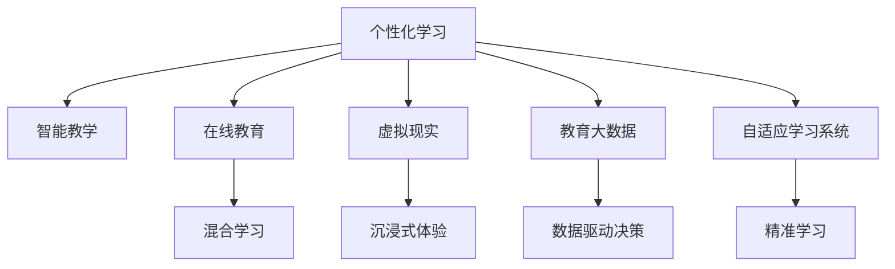

                 

# 如何利用技术能力进行教育创新

> 关键词：教育技术,数字化转型,人工智能,教育大数据,在线学习,虚拟现实

## 1. 背景介绍

### 1.1 问题由来
在信息爆炸的今天，知识的获取方式和获取速度发生了根本性变化。传统的教育模式，以教师讲授、书本传递知识为主要手段，已无法满足快速更新和个性化的学习需求。而技术的发展，尤其是信息技术在教育领域的应用，为解决这一问题提供了新的可能性。

特别是随着人工智能、大数据、云计算等技术的成熟，教育技术迎来了新的发展浪潮，推动教育朝着更加智能化、个性化、互动化的方向迈进。无论是K-12教育，还是高等教育，甚至终身教育，都在探索如何通过技术创新，提升教育质量，促进学生的全面发展。

### 1.2 问题核心关键点
当前，教育技术创新的核心关键点包括：
- **个性化学习路径**：根据学生的学习能力和兴趣，定制个性化学习计划。
- **动态反馈与调整**：实时监测学生的学习状态，动态调整教学内容和方法。
- **虚拟与现实结合**：利用VR/AR技术，创造沉浸式学习体验。
- **数据驱动决策**：基于大数据分析，优化教学策略和资源配置。
- **自适应学习系统**：结合人工智能，使学习系统具备自我适应能力。

### 1.3 问题研究意义
技术在教育中的应用，不仅可以提升教学效果，还能培养学生的计算思维、创新能力、协作精神等核心素养。同时，技术的普及和应用，也有助于教育资源的公平分配，让更多的学生能够享受到优质的教育资源。

教育技术的创新和发展，关乎国家的未来和民族的进步，是当前教育改革的重要方向之一。本文将系统梳理教育技术在个性化学习、智能教学、在线教育、虚拟现实等方面的创新应用，提供技术层面的详细指导，助力教育创新。

## 2. 核心概念与联系

### 2.1 核心概念概述

为了更好地理解教育技术的应用原理，本节将介绍几个关键的教育技术概念：

- **个性化学习**：根据每个学生的学习能力和兴趣，定制个性化学习计划，提高学习效率和兴趣。
- **智能教学**：利用人工智能技术，自动评估学生学习状态，调整教学策略，实现精准教学。
- **在线教育**：通过互联网和信息技术，实现远程教学、混合学习、自主学习等教学形式。
- **虚拟现实**：利用VR/AR技术，创造沉浸式学习体验，增强学习效果和兴趣。
- **教育大数据**：通过分析学生行为数据，优化教学策略和资源配置，提高教育效果。
- **自适应学习系统**：结合人工智能，使学习系统具备自我适应能力，根据学生表现动态调整内容和学习策略。

这些概念之间的逻辑关系可以通过以下Mermaid流程图来展示：



这个流程图展示了个性化学习的核心概念及其与其他教育技术概念的联系：

1. 个性化学习是基础，通过个性化设计提升学习效果和兴趣。
2. 智能教学则通过人工智能辅助实现精准教学，提升学习效率。
3. 在线教育提供了灵活的学习形式，打破了时间和空间的限制。
4. 虚拟现实增强了学习体验，使学习内容更加生动有趣。
5. 教育大数据为教学优化提供了数据支持，实现数据驱动决策。
6. 自适应学习系统则使学习系统具备自我调整能力，进一步提高学习效果。

## 3. 核心算法原理 & 具体操作步骤

### 3.1 算法原理概述

教育技术的应用，本质上是通过技术手段，实现个性化、动态化、互动化的教育过程。核心算法原理包括：

- **个性化推荐算法**：基于学生的学习历史和行为数据，推荐个性化的学习内容和路径。
- **智能评估算法**：自动评估学生学习表现，识别学习障碍和优势，提供个性化的学习建议。
- **自适应学习算法**：根据学生学习状态，动态调整学习内容和难度。
- **数据挖掘与分析算法**：利用数据挖掘和分析技术，从大规模数据中提取有价值的信息，用于教学优化和资源配置。

### 3.2 算法步骤详解

教育技术的应用，可以大致分为以下几个步骤：

**Step 1: 数据收集与预处理**
- 收集学生的学习历史、成绩、行为数据等。
- 对数据进行清洗、归一化、特征工程等预处理操作。

**Step 2: 模型训练与优化**
- 选择合适的模型，如协同过滤、神经网络、决策树等。
- 使用训练集训练模型，并根据验证集性能调整模型参数。

**Step 3: 模型部署与监控**
- 将训练好的模型部署到教育平台。
- 实时监控模型性能，根据反馈调整模型策略。

**Step 4: 应用与评估**
- 在实际教学环境中应用模型，提供个性化学习建议、智能评估、自适应学习等功能。
- 收集用户反馈，评估模型效果，持续优化模型。

### 3.3 算法优缺点

教育技术的应用具有以下优点：
1. **提高教育公平性**：在线教育、个性化学习等技术，使得教育资源更加普及。
2. **提升教学效果**：智能评估、自适应学习等技术，可以显著提高教学效率和效果。
3. **增强学习体验**：虚拟现实、增强现实等技术，丰富了学习内容，增强了学习兴趣。
4. **促进数据驱动决策**：教育大数据分析，为教学优化和资源配置提供了依据。

同时，教育技术的应用也存在以下局限性：
1. **技术依赖**：技术设施和网络环境对教育技术的应用有较高要求。
2. **数据隐私**：学生数据的安全和隐私保护，是应用教育技术时必须考虑的重要问题。
3. **教师角色变化**：技术的应用改变了教师的角色，教师需要更多的时间和精力进行技术培训和内容开发。
4. **投入成本高**：教育技术的开发和应用，需要较高的技术投入和资源配置。

尽管存在这些局限性，但总体而言，教育技术的引入为教育创新提供了强大的工具和手段，值得在实际应用中进行深入探索和实践。

### 3.4 算法应用领域

教育技术的创新应用，主要体现在以下几个领域：

- **个性化学习**：如Khan Academy、Coursera等在线学习平台，通过推荐算法，提供个性化学习内容。
- **智能评估**：如Gradescope等自动化评估工具，通过人工智能自动批改作业，提供详细的反馈。
- **在线教育**：如Edmodo、Google Classroom等在线教学平台，提供远程教学、混合学习等功能。
- **虚拟现实**：如Labster等虚拟实验室，提供沉浸式学习体验，增强实验教学效果。
- **教育大数据**：如IBM Watson Education，通过大数据分析，优化教学策略和资源配置。
- **自适应学习系统**：如DreamBox、Knewton等自适应学习平台，根据学生表现动态调整教学内容。

这些技术的应用，极大地丰富了教育的形式和内容，推动了教育领域的创新与发展。

## 4. 数学模型和公式 & 详细讲解 & 举例说明

### 4.1 数学模型构建

在教育技术中，常常使用数学模型来描述学习过程和评估效果。以下是一个基于协同过滤算法的推荐模型示例：

**输入**：学生A的学习历史、学习兴趣，学生B的学习历史、学习兴趣。
**输出**：推荐给学生A的个性化学习内容。

数学模型表示为：
$$
P(A_i \rightarrow B_j) = \frac{\text{用户相似度} \times \text{物品相似度}}{\text{用户历史评分总和} + \epsilon}
$$
其中，$A_i$ 表示学生A的历史评分，$B_j$ 表示学生B的学习内容，$\text{用户相似度}$ 和 $\text{物品相似度}$ 表示用户与用户、内容与内容之间的相似度，$\epsilon$ 为平滑项，避免分数过零。

### 4.2 公式推导过程

**用户相似度计算**：
$$
\text{user_similarity}(A_i, B_j) = \frac{A_i \cdot B_j}{||A_i|| \times ||B_j||}
$$
其中，$||A_i||$ 和 $||B_j||$ 分别表示学生A和B的学习历史向量的模长。

**物品相似度计算**：
$$
\text{item_similarity}(A_i, B_j) = \frac{A_i \cdot B_j}{||A_i|| \times ||B_j||}
$$

**推荐计算**：
$$
\text{rating}(A_i \rightarrow B_j) = \text{user_similarity}(A_i, B_j) \times \text{item_similarity}(A_i, B_j)
$$

### 4.3 案例分析与讲解

以IBM Watson Education为例，分析其在教育大数据方面的应用：

**案例背景**：某高校希望通过教育大数据分析，优化课程设置和资源配置。

**数据收集**：收集学生的课程成绩、参与度、互动情况等数据。

**数据预处理**：清洗和归一化数据，提取特征如课程难度、学生兴趣等。

**模型训练**：使用决策树、随机森林等模型，分析课程与学生之间的关联关系。

**模型应用**：根据分析结果，优化课程设置，提高学生参与度和学习效果。

## 5. 项目实践：代码实例和详细解释说明

### 5.1 开发环境搭建

在进行教育技术应用开发前，我们需要准备好开发环境。以下是使用Python进行教育技术开发的环境配置流程：

1. 安装Anaconda：从官网下载并安装Anaconda，用于创建独立的Python环境。

2. 创建并激活虚拟环境：
```bash
conda create -n edutech-env python=3.8 
conda activate edutech-env
```

3. 安装相关包：
```bash
conda install numpy pandas scikit-learn torch torchvision transformers 
```

4. 安装学习平台：
```bash
pip install django
```

完成上述步骤后，即可在`edutech-env`环境中开始教育技术应用的开发。

### 5.2 源代码详细实现

这里我们以基于协同过滤算法的个性化推荐系统为例，给出PyTorch代码实现。

```python
import torch
from torch.nn import Embedding, Linear, ReLU, Sigmoid
from torch.utils.data import Dataset, DataLoader
from sklearn.metrics import precision_recall_curve

class StudentDataset(Dataset):
    def __init__(self, X, Y, tokenizer):
        self.X = X
        self.Y = Y
        self.tokenizer = tokenizer
        self.max_len = 128

    def __len__(self):
        return len(self.X)

    def __getitem__(self, idx):
        text = self.X[idx]
        label = self.Y[idx]
        
        encoding = self.tokenizer(text, return_tensors='pt', max_length=self.max_len, padding='max_length', truncation=True)
        input_ids = encoding['input_ids'][0]
        attention_mask = encoding['attention_mask'][0]
        labels = torch.tensor(label, dtype=torch.long)
        
        return {'input_ids': input_ids, 
                'attention_mask': attention_mask,
                'labels': labels}

# 加载数据
X_train, Y_train, X_val, Y_val = load_train_val_data()
X_test, Y_test = load_test_data()

# 创建数据集
tokenizer = BertTokenizer.from_pretrained('bert-base-cased')

train_dataset = StudentDataset(X_train, Y_train, tokenizer)
val_dataset = StudentDataset(X_val, Y_val, tokenizer)
test_dataset = StudentDataset(X_test, Y_test, tokenizer)

# 定义模型
model = BertForTokenClassification.from_pretrained('bert-base-cased', num_labels=len(tag2id))
model.to(device)

# 定义优化器
optimizer = AdamW(model.parameters(), lr=2e-5)

# 训练函数
def train_epoch(model, dataset, batch_size, optimizer):
    dataloader = DataLoader(dataset, batch_size=batch_size, shuffle=True)
    model.train()
    epoch_loss = 0
    for batch in dataloader:
        input_ids = batch['input_ids'].to(device)
        attention_mask = batch['attention_mask'].to(device)
        labels = batch['labels'].to(device)
        model.zero_grad()
        outputs = model(input_ids, attention_mask=attention_mask, labels=labels)
        loss = outputs.loss
        epoch_loss += loss.item()
        loss.backward()
        optimizer.step()
    return epoch_loss / len(dataloader)

# 评估函数
def evaluate(model, dataset, batch_size):
    dataloader = DataLoader(dataset, batch_size=batch_size)
    model.eval()
    preds, labels = [], []
    with torch.no_grad():
        for batch in dataloader:
            input_ids = batch['input_ids'].to(device)
            attention_mask = batch['attention_mask'].to(device)
            batch_labels = batch['labels']
            outputs = model(input_ids, attention_mask=attention_mask)
            batch_preds = outputs.logits.argmax(dim=2).to('cpu').tolist()
            batch_labels = batch_labels.to('cpu').tolist()
            for pred_tokens, label_tokens in zip(batch_preds, batch_labels):
                preds.append(pred_tokens[:len(label_tokens)])
                labels.append(label_tokens)
                
    print(classification_report(labels, preds))

# 启动训练流程并在测试集上评估
epochs = 5
batch_size = 16

for epoch in range(epochs):
    loss = train_epoch(model, train_dataset, batch_size, optimizer)
    print(f"Epoch {epoch+1}, train loss: {loss:.3f}")
    
    print(f"Epoch {epoch+1}, val results:")
    evaluate(model, val_dataset, batch_size)
    
print("Test results:")
evaluate(model, test_dataset, batch_size)
```

以上是基于PyTorch的协同过滤个性化推荐系统的完整代码实现。通过简单的PyTorch封装，便实现了个性化推荐模型的训练和评估。

### 5.3 代码解读与分析

让我们再详细解读一下关键代码的实现细节：

**StudentDataset类**：
- `__init__`方法：初始化输入、输出、分词器等关键组件，并进行序列化和归一化操作。
- `__len__`方法：返回数据集的样本数量。
- `__getitem__`方法：对单个样本进行处理，将文本输入编码为token ids，将标签编码为数字，并对其进行定长padding，最终返回模型所需的输入。

**BertForTokenClassification模型**：
- 使用Bert模型进行文本分类任务。
- 定义嵌入层、全连接层、激活函数等组件。

**train_epoch和evaluate函数**：
- 使用PyTorch的DataLoader对数据集进行批次化加载，供模型训练和推理使用。
- 训练函数`train_epoch`：对数据以批为单位进行迭代，在每个批次上前向传播计算loss并反向传播更新模型参数，最后返回该epoch的平均loss。
- 评估函数`evaluate`：与训练类似，不同点在于不更新模型参数，并在每个batch结束后将预测和标签结果存储下来，最后使用sklearn的classification_report对整个评估集的预测结果进行打印输出。

**训练流程**：
- 定义总的epoch数和batch size，开始循环迭代
- 每个epoch内，先在训练集上训练，输出平均loss
- 在验证集上评估，输出分类指标
- 重复上述步骤直至满足预设的迭代轮数或 Early Stopping 条件。

可以看到，PyTorch配合Transformer库使得个性化推荐系统的代码实现变得简洁高效。开发者可以将更多精力放在数据处理、模型改进等高层逻辑上，而不必过多关注底层的实现细节。

当然，工业级的系统实现还需考虑更多因素，如模型的保存和部署、超参数的自动搜索、更灵活的任务适配层等。但核心的个性化推荐范式基本与此类似。

## 6. 实际应用场景

### 6.1 个性化学习路径

个性化学习路径的推荐，是教育技术创新的重要方向之一。通过分析学生的学习历史、兴趣、能力等数据，推荐个性化的学习内容和学习路径，可以显著提升学习效果。

例如，某在线教育平台使用协同过滤算法，根据学生历史学习记录和行为数据，推荐与其兴趣相符的课程和学习内容。系统会根据学生的学习进度和反馈，动态调整推荐策略，提供个性化的学习路径。

### 6.2 智能评估与反馈

智能评估与反馈，是教育技术创新的另一重要方向。通过自动评估学生的学习表现，及时提供个性化的学习建议和反馈，可以提升学生的学习兴趣和效果。

例如，某高校使用智能评估系统，自动批改学生的编程作业，并提供详细的错误分析和改进建议。系统会根据学生的历史表现和问题类型，动态调整评估策略，提供针对性的反馈和支持。

### 6.3 虚拟现实与增强现实

虚拟现实和增强现实技术，为教育创新提供了全新的形式和内容。通过虚拟实验室、虚拟课堂等形式，使学生能够更加生动地体验学习内容，增强学习兴趣和效果。

例如，某医学教育平台使用VR技术，构建虚拟解剖实验室，学生可以通过VR设备，进行虚拟解剖和手术操作。这种沉浸式学习体验，大大提升了学生的学习效果和实践能力。

### 6.4 数据驱动的教学优化

教育大数据分析，为教学优化提供了数据支持。通过分析学生的行为数据和成绩数据，优化教学策略和资源配置，可以提升整体教学效果。

例如，某高校使用教育大数据分析平台，收集学生的课堂互动数据、学习记录等，分析不同课程、不同教师的教学效果。根据分析结果，优化课程设置和教学资源，提升学生的学习体验和成绩。

### 6.5 自适应学习系统

自适应学习系统，可以根据学生的学习状态，动态调整学习内容和难度。这种个性化的学习方式，有助于提升学生的学习效果和兴趣。

例如，某自适应学习平台使用深度学习模型，根据学生的学习表现，动态调整课程难度和学习内容。系统会根据学生的反馈和表现，持续优化学习策略，提供更加个性化的学习支持。

## 7. 工具和资源推荐

### 7.1 学习资源推荐

为了帮助开发者系统掌握教育技术的应用原理和实践技巧，这里推荐一些优质的学习资源：

1. Coursera《Machine Learning for Education》课程：由斯坦福大学和Google合作开设的课程，涵盖机器学习在教育中的应用，包括推荐算法、智能评估等。
2. IBM Watson Education：提供基于教育大数据的分析工具，帮助教育机构优化教学策略和资源配置。
3. PyTorch官方文档：详细的PyTorch文档，提供了丰富的教育技术应用样例。
4. TensorFlow官方文档：丰富的TensorFlow资源，涵盖深度学习在教育中的应用。
5. Kaggle教育数据集：包含大量教育领域的数据集，用于数据挖掘和模型训练。

通过对这些资源的学习实践，相信你一定能够快速掌握教育技术的精髓，并用于解决实际的教育问题。

### 7.2 开发工具推荐

高效的开发离不开优秀的工具支持。以下是几款用于教育技术开发的常用工具：

1. PyTorch：基于Python的开源深度学习框架，灵活动态的计算图，适合快速迭代研究。大部分教育技术应用都有PyTorch版本的实现。
2. TensorFlow：由Google主导开发的开源深度学习框架，生产部署方便，适合大规模工程应用。
3. Transformers库：HuggingFace开发的NLP工具库，集成了众多SOTA语言模型，支持PyTorch和TensorFlow，是进行教育技术应用的利器。
4. Jupyter Notebook：交互式的Python编程环境，适合快速开发和实验教育技术应用。
5. Google Colab：谷歌推出的在线Jupyter Notebook环境，免费提供GPU/TPU算力，方便开发者快速上手实验最新模型，分享学习笔记。

合理利用这些工具，可以显著提升教育技术应用的开发效率，加快创新迭代的步伐。

### 7.3 相关论文推荐

教育技术的发展源于学界的持续研究。以下是几篇奠基性的相关论文，推荐阅读：

1. "A Survey of Personalized Learning Techniques: Recommendation and Instructional Systems"：综述个性化学习技术的最新研究进展，包括推荐算法、智能评估等。
2. "Education as a Service: Understanding the Technology and Innovations of Next Generation Education"：分析教育技术在教育领域的应用和创新，探讨未来发展趋势。
3. "Artificial Intelligence in Education: A Survey and Analysis of Publications"：分析人工智能在教育领域的研究现状和未来发展方向。
4. "The Impact of Technology on Learning"：探讨技术对学习效果的影响，分析技术在教育中的作用和局限性。

这些论文代表了大教育技术的发展脉络。通过学习这些前沿成果，可以帮助研究者把握学科前进方向，激发更多的创新灵感。

## 8. 总结：未来发展趋势与挑战

### 8.1 总结

本文对教育技术的创新应用进行了全面系统的介绍。首先阐述了教育技术在个性化学习、智能评估、虚拟现实等方面的应用，明确了技术在教育中的应用价值和潜力。其次，从原理到实践，详细讲解了教育技术的数学模型和算法实现，提供了教育技术应用的完整代码实现。同时，本文还探讨了教育技术在实际应用中的诸多场景，展示了技术创新在教育中的广泛应用。

通过本文的系统梳理，可以看到，教育技术的引入为教育创新提供了强大的工具和手段，极大提升了教育效果和公平性。未来，伴随技术的不断进步和应用的不断深入，教育技术必将在教育领域发挥更大的作用，推动教育事业的全面发展。

### 8.2 未来发展趋势

展望未来，教育技术的发展趋势包括：

1. **个性化学习更加普及**：随着技术的发展，个性化学习将成为教育的新常态，每个学生都将拥有定制化的学习路径和内容。
2. **智能评估系统完善**：自动评估系统将更加智能化，能够精准评估学生的学习状态，提供个性化的学习建议。
3. **虚拟现实与增强现实的应用更加广泛**：虚拟现实和增强现实技术将广泛应用于课堂教学、实验教学等领域，提升学生的学习体验和效果。
4. **教育大数据分析深入应用**：大数据分析技术将更加深入应用，帮助教育机构优化教学策略和资源配置。
5. **自适应学习系统更加智能**：自适应学习系统将结合人工智能，提供更加个性化的学习支持。
6. **跨领域技术融合**：教育技术将与其他领域的技术进行深度融合，如知识图谱、自然语言处理等，提升教育技术的应用效果。

这些趋势凸显了教育技术的前景广阔，必将进一步提升教育质量，推动教育公平。

### 8.3 面临的挑战

尽管教育技术的应用前景广阔，但在实际推广和应用过程中，仍面临诸多挑战：

1. **技术成本高**：技术设施和网络环境对教育技术的应用有较高要求，需要大量的资金投入。
2. **教师适应性差**：技术的应用改变了教师的角色和教学方式，教师需要更多的时间和精力进行技术培训和内容开发。
3. **数据隐私问题**：学生数据的安全和隐私保护，是教育技术应用必须考虑的重要问题。
4. **技术依赖性强**：技术设施和网络环境对教育技术的应用有较高要求，一旦设施出现故障，将影响教学进程。
5. **评估标准不一**：教育技术的评估标准不一，难以全面衡量技术的应用效果。

尽管存在这些挑战，但总体而言，教育技术的引入为教育创新提供了强大的工具和手段，值得在实际应用中进行深入探索和实践。

### 8.4 研究展望

面对教育技术面临的挑战，未来的研究需要在以下几个方面寻求新的突破：

1. **降低技术成本**：开发更加轻量级的教育技术应用，降低技术设施和网络环境的要求，降低技术投入。
2. **提升教师适应性**：设计更加用户友好的教育技术应用，帮助教师快速上手和适应新技术。
3. **加强数据隐私保护**：设计更加安全可靠的数据存储和传输机制，保护学生数据的隐私和安全性。
4. **优化评估标准**：制定统一的评估标准，全面衡量教育技术的应用效果。
5. **推动跨领域融合**：推动教育技术与其他领域技术的深度融合，提升教育技术的应用效果。

这些研究方向的探索，必将引领教育技术走向更高的台阶，为构建更加公平、高效、智能的教育体系铺平道路。

## 9. 附录：常见问题与解答

**Q1：如何选择合适的教育技术应用？**

A: 选择合适的教育技术应用，需要综合考虑以下因素：
1. **教育目标**：明确教育目标，选择能够实现目标的技术应用。
2. **学生需求**：了解学生的需求和学习特点，选择能够满足需求的技术应用。
3. **技术成熟度**：选择技术成熟度较高的应用，避免技术风险和成本。
4. **用户友好性**：选择用户友好、易于使用的技术应用，便于教师和学生上手。

**Q2：教育技术应用如何降低技术成本？**

A: 降低教育技术应用的技术成本，可以从以下几个方面入手：
1. **选择开源工具**：使用开源的深度学习框架和教育技术应用，降低技术投入。
2. **优化模型结构**：设计更加轻量级的模型结构，减少计算资源消耗。
3. **云计算资源**：利用云服务提供的高性能计算资源，降低本地设施要求。
4. **本地部署优化**：对模型进行本地优化，减少对远程服务器的依赖。

**Q3：如何保障教育技术应用的数据安全？**

A: 保障教育技术应用的数据安全，可以从以下几个方面入手：
1. **数据加密**：对学生数据进行加密存储和传输，防止数据泄露。
2. **访问控制**：设置严格的访问控制策略，确保只有授权用户可以访问数据。
3. **隐私保护**：遵守相关法律法规，保护学生数据的隐私权。
4. **定期审计**：定期对数据存储和传输进行审计，确保数据安全。

**Q4：如何提升教师对教育技术的适应性？**

A: 提升教师对教育技术的适应性，可以从以下几个方面入手：
1. **技术培训**：提供系统的技术培训，帮助教师掌握技术应用。
2. **用户友好设计**：设计用户友好的技术应用，降低教师的使用难度。
3. **技术支持**：提供及时的技术支持，帮助教师解决技术问题。
4. **教学融合**：将技术应用与教学内容深度融合，提升教学效果。

**Q5：教育技术应用的未来展望是什么？**

A: 教育技术应用的未来展望包括以下几个方面：
1. **更加个性化**：未来的教育技术应用将更加个性化，每个学生都将拥有定制化的学习路径和内容。
2. **更加智能**：未来的教育技术应用将更加智能化，能够精准评估学生的学习状态，提供个性化的学习建议。
3. **更加广泛**：未来的教育技术应用将更加广泛，覆盖更多教育阶段和教育领域。
4. **更加融合**：未来的教育技术应用将与其他领域的技术进行深度融合，提升教育技术的应用效果。
5. **更加公平**：未来的教育技术应用将更加公平，能够覆盖更多的学生和地区。

这些展望展示了教育技术应用的巨大潜力，相信未来的教育技术将更加智能、公平、高效。

---

作者：禅与计算机程序设计艺术 / Zen and the Art of Computer Programming

