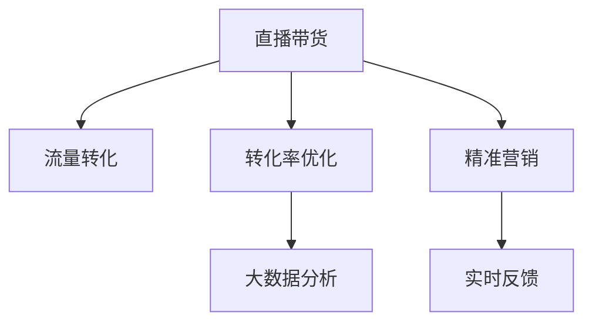

                 

# 如何利用直播带货实现知识变现

> 关键词：直播带货,知识变现,电商平台,流量转化,转化率优化,精准营销,大数据分析,实时反馈,用户画像,行为分析,销售预测

## 1. 背景介绍

### 1.1 问题由来

在数字化时代的浪潮中，传统的知识变现方式正经历着深刻的变革。随着电子商务的蓬勃发展，直播带货成为了一种崭新的知识变现渠道。与传统的图书、课程等商品不同，直播带货可以通过实时互动、产品展示等方式，直接将知识、技能和经验转化为商业价值。直播带货不仅能够即时反馈消费者的需求，还能通过直播间的互动，深化与消费者的连接，提升品牌影响力，实现知识变现的最大化。

### 1.2 问题核心关键点

直播带货的核心在于通过直播这一新形态，将知识与消费者直接连接，实现高效的知识传递和商业转化。其主要包括以下几个关键点：

- **互动性**：直播间的即时互动，能够有效激发消费者的购买欲望。
- **可视性**：通过产品展示和演示，使复杂知识更加直观易懂。
- **个性化**：基于用户画像和行为数据，提供定制化的直播内容。
- **实时反馈**：直播带货可以实时获取消费者反馈，迅速调整策略。

直播带货的独特优势在于其即时性和互动性，能够快速响应市场需求，满足消费者的多样化需求。但要实现有效的知识变现，还需要通过精确的流量转化、转化率优化、精准营销等多种手段，提升直播带货的效果。

## 2. 核心概念与联系

### 2.1 核心概念概述

为更好地理解直播带货实现知识变现的方法，本节将介绍几个关键概念及其相互关系：

- **直播带货**：通过实时视频直播的形式，向消费者展示和销售商品或服务的一种新兴商业模式。
- **知识变现**：将专业知识、技能、经验等无形资产转化为有形价值的过程。
- **电商平台**：在线交易的平台，直播带货通常在该平台上进行。
- **流量转化**：将平台上的流量转化为实际的购买行为。
- **转化率优化**：通过优化策略，提高直播带货的转化率。
- **精准营销**：基于用户数据进行个性化推荐和推广，提升直播带货效果。
- **大数据分析**：通过数据分析挖掘用户行为模式，指导直播带货策略。
- **实时反馈**：直播带货过程中，可以实时获取用户反馈，及时调整策略。

这些核心概念之间的逻辑关系可以通过以下Mermaid流程图来展示：



这个流程图展示了直播带货的各个环节及其相互关系：

1. **直播带货**：作为知识变现的起点，通过直播形式进行产品展示和销售。
2. **流量转化**：将观众转化为实际的买家，实现知识变现。
3. **转化率优化**：通过策略优化，提升转化效果。
4. **精准营销**：利用用户数据进行个性化推广，提高直播效果。
5. **大数据分析**：通过数据分析，指导直播策略的调整。
6. **实时反馈**：通过实时数据，调整直播策略，优化直播效果。

## 3. 核心算法原理 & 具体操作步骤

### 3.1 算法原理概述

直播带货的知识变现过程，本质上是一个多阶段、多目标的优化问题。其核心在于通过直播带货的方式，最大化知识传播的效果和商业转化的收益。具体而言，包括以下几个步骤：

1. **内容设计**：基于用户的兴趣和需求，设计吸引消费者的直播内容。
2. **流量吸引**：通过多种渠道（如社交媒体、SEO优化等）吸引更多的观众进入直播间。
3. **互动促进**：通过直播间的即时互动，增强观众的参与感和购买欲望。
4. **转化实现**：利用优惠活动、限时抢购等手段，促进观众的购买行为。
5. **效果评估**：通过数据分析，评估直播带货的效果，持续优化策略。

### 3.2 算法步骤详解

#### 3.2.1 内容设计

内容设计是直播带货的基础，直接影响到观众的停留时间和购买率。内容设计主要包括以下几个步骤：

1. **主题选择**：根据目标用户的兴趣和需求，选择合适的直播主题。
2. **互动环节**：设计吸引观众参与的互动环节，如问答、抽奖等。
3. **产品展示**：通过详细的产品展示和演示，介绍产品的特点和优势。
4. **销售引导**：在直播过程中适时引导观众进行购买，通过限时抢购、折扣优惠等方式促进销售。

#### 3.2.2 流量吸引

流量吸引是直播带货的关键环节，直接影响到直播间的观众数量。流量吸引主要包括以下几个步骤：

1. **渠道选择**：选择适合目标用户群体的流量渠道，如社交媒体、搜索引擎等。
2. **内容推广**：通过优化SEO和社交媒体内容，吸引更多的观众进入直播间。
3. **广告投放**：利用付费广告（如Google Ads、Facebook Ads等）进行推广。

#### 3.2.3 互动促进

互动促进是直播带货的重要环节，能够增强观众的参与感和购买欲望。互动促进主要包括以下几个步骤：

1. **即时互动**：通过直播间的即时互动功能，如聊天、点赞等，增强观众的参与感。
2. **用户反馈**：实时获取观众的反馈，根据观众需求调整直播内容。
3. **专家互动**：邀请行业专家进行互动，提升直播内容的权威性和吸引力。

#### 3.2.4 转化实现

转化实现是直播带货的最终目标，直接影响到知识变现的效果。转化实现主要包括以下几个步骤：

1. **优惠活动**：通过限时折扣、优惠券等优惠活动，促进观众的购买行为。
2. **直播特效**：利用直播特效（如AR、VR）提升观众的购买体验。
3. **购买引导**：通过清晰的购买引导，帮助观众完成购买过程。

#### 3.2.5 效果评估

效果评估是直播带货的重要环节，通过数据分析，指导后续直播策略的调整。效果评估主要包括以下几个步骤：

1. **数据分析**：通过直播数据（如观看时长、互动率等）评估直播效果。
2. **用户画像**：基于用户数据，构建详细的用户画像，指导后续直播策略。
3. **销售预测**：利用销售数据，进行销售预测，指导直播内容的设计和推广。

### 3.3 算法优缺点

直播带货的知识变现方法具有以下优点：

1. **即时反馈**：直播带货能够实时获取观众反馈，及时调整策略，优化直播效果。
2. **互动性强**：通过直播间的即时互动，增强观众的参与感和购买欲望。
3. **内容丰富**：直播带货的内容形式多样，能够满足不同用户的需求。

同时，直播带货的方法也存在一定的局限性：

1. **高成本**：直播带货需要投入较多的人力、物力和时间成本。
2. **效果不稳定**：直播带货的效果受多种因素影响，如主播的互动能力、观众的参与度等。
3. **数据隐私问题**：直播带货过程中，可能会涉及用户数据的收集和分析，需要关注数据隐私问题。

尽管存在这些局限性，但直播带货的知识变现方法仍然在电商领域得到了广泛应用，并取得了显著的效果。未来相关研究的重点在于如何进一步降低直播带货的成本，提高直播效果，同时兼顾数据隐私和用户安全等因素。

### 3.4 算法应用领域

直播带货的知识变现方法已经在电商、教育、医疗等多个领域得到了广泛应用，例如：

- **电商领域**：通过直播带货销售商品，实现产品展示和销售。
- **教育领域**：通过直播带货进行在线课程的推广和销售。
- **医疗领域**：通过直播带货介绍医疗知识和产品，提供健康咨询和产品销售。
- **文娱领域**：通过直播带货推广影视剧、音乐等文娱产品，吸引观众关注和购买。

除了这些传统领域，直播带货的知识变现方法也在不断拓展，如科技产品展示、农业产品推广等，为不同领域带来了新的商业机遇。

## 4. 数学模型和公式 & 详细讲解 & 举例说明

### 4.1 数学模型构建

直播带货的知识变现过程可以通过以下数学模型进行建模：

设直播带货的观众数量为 $A$，购买率为 $P$，每次购买商品的平均价值为 $V$，则总收益 $R$ 可以表示为：

$$ R = A \times P \times V $$

其中，观众数量 $A$ 受到直播推广策略的影响，购买率 $P$ 受到直播内容的设计和互动程度的影响，平均购买价值 $V$ 受到直播商品的定价策略的影响。

### 4.2 公式推导过程

通过上述数学模型，我们可以推导出直播带货的收益优化公式：

$$ \max_{A, P, V} R = \max_{A, P, V} A \times P \times V $$

其中，$A$、$P$、$V$ 分别代表观众数量、购买率和平均购买价值。目标是通过优化这些变量，最大化直播带货的收益。

### 4.3 案例分析与讲解

假设有一个电商平台，计划通过直播带货销售某款新产品。根据历史数据，我们发现以下关系：

- 观众数量 $A$ 与推广预算成正比。
- 购买率 $P$ 与主播互动的频率成正比。
- 平均购买价值 $V$ 与商品定价成正比。

因此，我们可以通过以下公式进行收益优化：

$$ \max_{预算, 互动频率, 商品定价} R $$

通过调整推广预算、主播互动频率和商品定价，可以实现直播带货的收益最大化。

## 5. 项目实践：代码实例和详细解释说明

### 5.1 开发环境搭建

在进行直播带货的代码实现前，我们需要准备好开发环境。以下是使用Python进行Flask开发的环境配置流程：

1. 安装Anaconda：从官网下载并安装Anaconda，用于创建独立的Python环境。

2. 创建并激活虚拟环境：
```bash
conda create -n flask-env python=3.8 
conda activate flask-env
```

3. 安装Flask：
```bash
pip install flask
```

4. 安装Flask直播扩展：
```bash
pip install flask-socketio
```

5. 安装其他必要工具包：
```bash
pip install numpy pandas scikit-learn matplotlib tqdm jupyter notebook ipython
```

完成上述步骤后，即可在`flask-env`环境中开始直播带货的开发实践。

### 5.2 源代码详细实现

下面是一个简单的Flask直播带货应用示例，展示了如何通过实时直播销售商品：

```python
from flask import Flask, render_template
from flask_socketio import SocketIO

app = Flask(__name__)
app.config['SECRET_KEY'] = 'secret!'
socketio = SocketIO(app)

@app.route('/')
def index():
    return render_template('index.html')

@socketio.on('chat message')
def handle_chat(message):
    print(message)
    socketio.emit('reply', message)

if __name__ == '__main__':
    socketio.run(app)
```

在这个示例中，我们使用Flask搭建了一个简单的Web应用，通过SocketIO实现实时通信。当用户发送消息时，应用会打印消息内容并发送回复。

### 5.3 代码解读与分析

让我们再详细解读一下关键代码的实现细节：

**index函数**：
- 定义了一个简单的路由，将请求重定向到模板页面。
- `render_template`函数将渲染模板文件，生成HTML页面，供用户查看。

**chat message事件处理函数**：
- 当用户发送消息时，应用会打印消息内容，并通过SocketIO发送回复。
- `socketio.emit`函数用于发送消息，消息类型为'reply'，表示回复消息。

**Flask-SocketIO库**：
- Flask-SocketIO库是一个用于Flask的Socket.IO扩展，支持WebSocket通信，实现实时交互功能。
- 应用通过`socketio.on`装饰器定义了聊天消息的处理函数，当收到消息时会自动触发。

**代码示例的局限性**：
- 这个示例仅展示了基本的WebSocket通信，并未涉及直播带货的具体业务逻辑。
- 在实际应用中，还需要实现商品展示、购买引导、实时互动等功能，以及用户数据的收集和分析。
- 直播带货的应用通常需要多方面的技术支持，如视频流传输、用户管理、支付系统等，代码实现会更加复杂。

## 6. 实际应用场景

### 6.1 电商平台

直播带货在电商平台中的应用非常广泛，成为许多电商企业的重要营销手段。通过直播带货，电商平台可以实时展示商品，提升用户购买意愿，并通过互动环节增强用户的参与感。例如，京东、淘宝等电商平台，通过直播带货销售各类商品，实现了显著的销售增长。

### 6.2 在线教育

在线教育领域，直播带货也展现出了巨大的潜力。通过直播带货，教育机构可以实时展示课程内容，提供互动问答环节，增强学生的学习体验。例如，Coursera、Udemy等在线教育平台，通过直播带货销售各类课程，吸引了大量用户注册和购买。

### 6.3 医疗健康

医疗健康领域，直播带货同样具有重要价值。通过直播带货，医疗机构可以介绍医疗知识和健康产品，提供咨询和购买服务。例如，腾讯健康、阿里健康等平台，通过直播带货销售各类健康产品，提高了用户的健康意识和购买行为。

### 6.4 未来应用展望

随着直播带货的不断发展，其应用场景也在不断拓展，未来可能涉及更多领域，例如：

- **科技产品**：通过直播带货销售各类科技产品，如智能家居、智能穿戴设备等。
- **农业产品**：通过直播带货销售各类农产品，如有机食品、特色农产品等。
- **文化娱乐**：通过直播带货销售各类文化娱乐产品，如电影票、演唱会门票等。

直播带货的应用前景广阔，未来将会在更多领域发挥重要作用。随着技术的不断进步和市场的不断成熟，直播带货将为各行各业带来新的机遇和挑战。

## 7. 工具和资源推荐

### 7.1 学习资源推荐

为了帮助开发者系统掌握直播带货的知识变现技术，这里推荐一些优质的学习资源：

1. **《Flask官方文档》**：Flask官方提供的详细文档，涵盖Flask的基础知识、开发实践和应用案例。
2. **《Socket.IO官方文档》**：Socket.IO官方提供的详细文档，介绍WebSocket通信的原理和实现方法。
3. **《电商直播实战》系列书籍**：介绍了电商直播带货的实际案例和开发实践，适合电商开发者参考。
4. **《Python网络编程》书籍**：介绍Python的网络编程技术，适合学习WebSocket通信和实时交互。
5. **《直播带货策略》在线课程**：通过实际案例讲解直播带货的策略和优化方法，适合电商和教育行业开发者参考。

通过对这些资源的学习实践，相信你一定能够快速掌握直播带货的知识变现技术，并用于解决实际的电商和教育问题。

### 7.2 开发工具推荐

高效的开发离不开优秀的工具支持。以下是几款用于直播带货开发的常用工具：

1. **Flask**：基于Python的开源Web框架，支持实时通信和WebSocket通信，适合构建实时互动的直播平台。
2. **Socket.IO**：支持WebSocket通信的库，用于实现实时的服务器和客户端通信。
3. **AWS Lambda**：云函数服务，支持实时计算和数据处理，适合处理直播互动和数据分析。
4. **Google Analytics**：网站分析工具，用于实时跟踪直播带货的流量和转化数据。
5. **Adobe Analytics**：高级网站分析工具，提供详细的用户行为分析和数据挖掘功能。

合理利用这些工具，可以显著提升直播带货的开发效率，加快创新迭代的步伐。

### 7.3 相关论文推荐

直播带货的知识变现技术的发展源于学界的持续研究。以下是几篇奠基性的相关论文，推荐阅读：

1. **《实时交互技术的发展》**：介绍WebSocket通信和实时交互技术的原理和应用，适合了解直播带货的技术基础。
2. **《电商直播的策略优化》**：介绍电商直播带货的策略和优化方法，适合电商开发者参考。
3. **《教育直播的创新应用》**：介绍在线教育直播带货的创新应用和案例，适合教育行业开发者参考。
4. **《医疗直播的实施效果》**：介绍医疗直播带货的实施效果和用户体验，适合医疗开发者参考。
5. **《直播带货的市场研究》**：介绍直播带货的市场趋势和用户行为分析，适合了解直播带货的市场前景。

这些论文代表了大语言模型微调技术的发展脉络。通过学习这些前沿成果，可以帮助研究者把握学科前进方向，激发更多的创新灵感。

## 8. 总结：未来发展趋势与挑战

### 8.1 总结

本文对利用直播带货实现知识变现的方法进行了全面系统的介绍。首先阐述了直播带货的背景和核心关键点，明确了直播带货在知识变现中的独特价值。其次，从原理到实践，详细讲解了直播带货的数学模型和操作步骤，给出了直播带货任务开发的完整代码实例。同时，本文还广泛探讨了直播带货在电商、教育、医疗等多个领域的应用前景，展示了直播带货范式的巨大潜力。最后，本文精选了直播带货技术的各类学习资源，力求为读者提供全方位的技术指引。

通过本文的系统梳理，可以看到，利用直播带货实现知识变现的方法正在成为电商和教育行业的重要手段，极大地拓展了知识变现的边界，为知识传播和商业转化带来了新的机遇。直播带货的即时性和互动性，使其成为一种极具潜力的知识变现方式。未来相关研究的重点在于如何进一步降低直播带货的成本，提高直播效果，同时兼顾数据隐私和用户安全等因素。

### 8.2 未来发展趋势

展望未来，直播带货的知识变现技术将呈现以下几个发展趋势：

1. **多渠道融合**：直播带货将与其他营销手段（如SEO、SEM、社交媒体等）进行融合，形成多元化的营销渠道。
2. **个性化推荐**：基于用户数据进行个性化推荐和推广，提升直播带货效果。
3. **实时数据分析**：通过实时数据分析，指导直播策略的调整，优化直播效果。
4. **用户参与度提升**：通过增强用户互动和参与感，提升直播带货的转化率。
5. **技术创新应用**：结合新技术（如AR、VR、AI等）提升直播带货的效果和体验。

这些趋势凸显了直播带货技术的广阔前景。这些方向的探索发展，必将进一步提升直播带货的效果和应用范围，为电商和教育行业带来更多的创新机会。

### 8.3 面临的挑战

尽管直播带货的知识变现方法已经取得了显著效果，但在迈向更加智能化、普适化应用的过程中，它仍面临诸多挑战：

1. **成本高**：直播带货需要投入较多的人力、物力和时间成本，对于中小型企业来说，成本较高。
2. **效果不稳定**：直播带货的效果受多种因素影响，如主播的互动能力、观众的参与度等，难以保证每次直播的效果一致。
3. **数据隐私问题**：直播带货过程中，可能会涉及用户数据的收集和分析，需要关注数据隐私问题。
4. **技术门槛高**：直播带货需要掌握多种技术（如Web开发、实时通信、数据分析等），技术门槛较高。

尽管存在这些挑战，但直播带货的知识变现方法仍然在电商和教育行业得到了广泛应用，并取得了显著的效果。未来相关研究的重点在于如何进一步降低直播带货的成本，提高直播效果，同时兼顾数据隐私和用户安全等因素。

### 8.4 研究展望

面对直播带货面临的种种挑战，未来的研究需要在以下几个方面寻求新的突破：

1. **降低成本**：通过技术创新（如自动化直播、AI主播等）降低直播带货的成本。
2. **提升效果**：通过算法优化和数据挖掘，提升直播带货的效果。
3. **保障隐私**：通过数据加密和隐私保护技术，保障用户数据的隐私和安全。
4. **优化技术**：通过技术创新（如边缘计算、云函数等）优化直播带货的技术架构。
5. **提高互动**：通过增强用户互动和参与感，提升直播带货的转化率。

这些研究方向的探索，必将引领直播带货技术迈向更高的台阶，为电商和教育行业带来更多的创新机会。面向未来，直播带货技术还需要与其他人工智能技术进行更深入的融合，如知识表示、因果推理、强化学习等，多路径协同发力，共同推动直播带货的进步。只有勇于创新、敢于突破，才能不断拓展直播带货的边界，让知识变现技术更好地造福人类社会。

## 9. 附录：常见问题与解答

**Q1：直播带货是否适用于所有电商和教育行业？**

A: 直播带货在电商和教育行业中具有广泛的应用前景，但并非所有行业都适合使用直播带货。直播带货适合于产品展示和互动性强的行业，如时尚、美容、家居、教育等。对于一些产品单一、互动性较低的行业，如食品、日用品等，直播带货的效果可能不如其他营销手段。

**Q2：直播带货的流量来源主要有哪些？**

A: 直播带货的流量来源主要包括：
1. 社交媒体平台（如微博、微信、抖音等）
2. 电商平台（如淘宝、京东、拼多多等）
3. 搜索引擎（如Google、百度等）
4. 广告平台（如Google Ads、Facebook Ads等）
5. 自建网站和APP

这些流量渠道的选择需要根据目标用户的特征和直播带货的具体需求进行优化。

**Q3：如何优化直播带货的转化率？**

A: 优化直播带货的转化率主要包括以下几个步骤：
1. 优化直播内容：设计吸引观众的内容和互动环节，提升观众的参与感。
2. 优化商品展示：通过详细的产品展示和演示，介绍产品的特点和优势。
3. 优化购买引导：通过清晰的购买引导，帮助观众完成购买过程。
4. 优化促销活动：通过限时折扣、优惠券等促销活动，促进观众的购买行为。
5. 优化直播特效：利用直播特效（如AR、VR）提升观众的购买体验。

这些优化策略需要根据具体直播带货的需求进行灵活组合，通过不断的实验和优化，找到最佳的策略组合。

**Q4：直播带货的运营成本主要包括哪些？**

A: 直播带货的运营成本主要包括：
1. 主播费用：主播的签约和培训费用。
2. 设备费用：直播设备的购买和维护费用。
3. 流量费用：社交媒体广告和搜索引擎广告的费用。
4. 技术费用：直播平台的技术支持费用。
5. 数据费用：数据分析和用户画像构建的费用。

这些成本需要根据具体的直播带货规模和需求进行预算，合理分配资源。

**Q5：直播带货如何处理用户数据隐私问题？**

A: 处理直播带货用户数据隐私问题，需要采取以下措施：
1. 数据加密：对用户数据进行加密处理，防止数据泄露。
2. 数据匿名化：对用户数据进行匿名化处理，保护用户隐私。
3. 用户同意：在收集用户数据前，获取用户的明确同意。
4. 数据存储：采取严格的数据存储措施，防止数据泄露。
5. 数据访问：限制数据访问权限，防止未经授权的数据访问。

这些措施可以有效地保护用户数据隐私，确保直播带货的合法合规性。

---

作者：禅与计算机程序设计艺术 / Zen and the Art of Computer Programming

