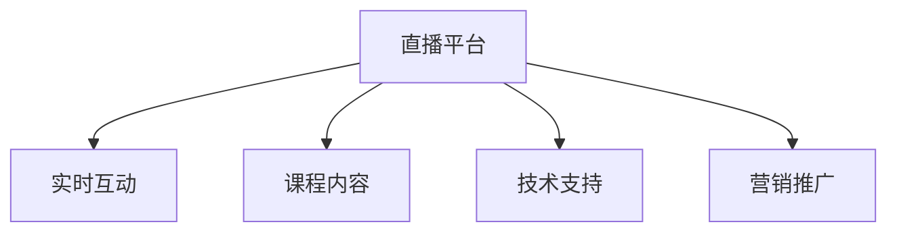

                 

## 1. 背景介绍

在数字化转型的大背景下，直播教育正迅速崛起，成为推动在线课程销量增长的关键因素。据统计，2021年全球在线教育市场规模已达3668亿美元，其中直播课程的增长尤为显著。直播平台以其高互动性、实时反馈和沉浸式体验，赢得了越来越多学习者的青睐。如何利用直播平台增加课程销量？本文将从多个维度深入探讨这一问题，结合实际案例，提供全面的解决方案。

## 2. 核心概念与联系

直播教育的成功离不开核心概念的深刻理解和灵活应用。以下是几个关键概念及其联系：

### 2.1 核心概念概述

- **直播平台（Live Platform）**：提供直播功能的在线教育平台，如Zoom、Tencent Live、Wooclap等。
- **实时互动（Interactivity）**：通过问答、讨论、投票等方式，增强学习者的参与感和积极性。
- **课程内容（Course Content）**：直播课程的核心，包括讲授的知识、演示的案例、互动环节等。
- **技术支持（Technology Support）**：保障直播顺畅进行的软硬件设施，如稳定网络、高效编码等。
- **营销推广（Marketing Promotion）**：通过各种渠道吸引潜在客户，提升课程曝光率和转化率。

### 2.2 Mermaid 流程图

以下Mermaid流程图展示了直播平台的核心组件及其相互关系：



该图简明扼要地表达了直播平台的基本架构和组件间的关系。直播平台的核心在于实时互动、课程内容和技术支持三大要素的协同作用，而营销推广则是吸引更多用户参与的关键手段。

## 3. 核心算法原理 & 具体操作步骤

### 3.1 算法原理概述

利用直播平台增加课程销量的核心算法原理，可以概括为以下几点：

1. **需求分析**：通过用户调研和市场分析，确定潜在用户的需求和偏好。
2. **数据驱动**：利用大数据和人工智能技术，分析用户行为和反馈，优化课程内容和互动设计。
3. **实时优化**：通过直播平台的技术优势，动态调整课程内容和互动形式，提升用户体验。
4. **精准营销**：结合营销推广策略，精准触达目标用户，提升课程曝光率和转化率。

### 3.2 算法步骤详解

#### 3.2.1 需求分析

1. **用户调研**：通过问卷调查、社交媒体分析等方式，收集潜在用户对课程的需求和兴趣点。
2. **市场分析**：分析竞争对手的课程和直播平台，找出自身的优势和不足。
3. **数据整合**：将用户调研和市场分析数据进行整合，形成需求分析报告。

#### 3.2.2 数据驱动

1. **数据收集**：通过直播平台的技术手段，收集用户行为数据，如观看时长、互动次数、评价等。
2. **数据处理**：利用数据挖掘和机器学习技术，对用户行为数据进行分析和挖掘。
3. **数据应用**：根据分析结果，优化课程内容和互动设计，提升用户体验。

#### 3.2.3 实时优化

1. **动态调整**：在直播过程中，根据用户反馈和行为数据，实时调整课程内容和互动形式。
2. **实时反馈**：利用AI技术，分析用户实时反馈，优化课程结构和互动环节。
3. **智能推送**：根据用户兴趣，智能推送相关课程内容和互动环节。

#### 3.2.4 精准营销

1. **目标受众分析**：通过用户画像分析，确定目标受众的特点和需求。
2. **渠道选择**：选择合适的营销渠道，如社交媒体、搜索引擎、电子邮件等。
3. **内容策划**：根据目标受众的特点和需求，策划精准的营销内容。
4. **效果监测**：通过数据分析，监测营销效果，优化营销策略。

### 3.3 算法优缺点

#### 3.3.1 优点

1. **高互动性**：直播平台的高互动性增强了学习者的参与感和积极性，提高了学习效果。
2. **实时反馈**：通过实时互动和反馈，优化课程内容和互动设计，提升用户体验。
3. **精准营销**：利用大数据和AI技术，精准触达目标用户，提升课程曝光率和转化率。

#### 3.3.2 缺点

1. **技术门槛高**：直播平台的技术要求较高，需要专业的技术团队支持。
2. **成本高**：直播平台和营销推广需要较高的投入，对中小型机构构成一定压力。
3. **内容质量要求高**：直播课程的内容质量直接影响用户满意度和留存率。

### 3.4 算法应用领域

直播平台的应用领域非常广泛，涉及多个行业和领域，如教育、医疗、企业培训等。在教育领域，直播平台的应用尤为突出，成为推动在线教育发展的重要力量。在医疗领域，通过直播平台，医患双方可以实时互动，提升医疗服务质量。在企业培训领域，直播平台为远程培训提供了便利，提升了培训效果和员工满意度。

## 4. 数学模型和公式 & 详细讲解

### 4.1 数学模型构建

假设直播平台上有 $N$ 个课程，每个课程的曝光量 $E_i$，转化率 $C_i$，用户观看时长 $T_i$，互动次数 $I_i$，评价得分 $R_i$。则课程的总销量 $S_i$ 可以表示为：

$$
S_i = E_i \times C_i \times T_i \times I_i \times R_i
$$

其中，曝光量 $E_i$ 表示课程被用户看到的次数，转化率 $C_i$ 表示用户从观看到购买的比例，用户观看时长 $T_i$ 和互动次数 $I_i$ 反映了课程的互动程度，评价得分 $R_i$ 则反映了课程的质量和用户满意度。

### 4.2 公式推导过程

假设用户从直播平台中选择课程的概率为 $P_i$，则有：

$$
P_i = \frac{E_i \times T_i \times I_i \times R_i}{\sum_{j=1}^N E_j \times T_j \times I_j \times R_j}
$$

根据二项分布，用户选择课程的概率 $P_i$ 与课程的总销量 $S_i$ 之间存在以下关系：

$$
S_i \propto P_i^n
$$

其中 $n$ 表示用户选择的课程数量。根据最大化期望收益的原则，可以通过优化 $P_i$ 来提升课程销量。

### 4.3 案例分析与讲解

以某教育平台为例，该平台上有 $M$ 个课程，每个课程的曝光量、转化率、用户观看时长、互动次数和评价得分如下表所示：

| 课程编号 | 曝光量（次） | 转化率（%） | 用户观看时长（分钟） | 互动次数（次） | 评价得分 |
|-----------|-------------|-------------|----------------------|---------------|----------|
| 1         | 5000        | 10          | 60                  | 100           | 4.5      |
| 2         | 3000        | 5           | 40                  | 50            | 3.5      |
| ...       | ...         | ...         | ...                 | ...           | ...      |

假设用户每次从直播平台中选择一个课程，则总销量 $S$ 为：

$$
S = \frac{E_i \times T_i \times I_i \times R_i}{\sum_{j=1}^N E_j \times T_j \times I_j \times R_j}
$$

为了最大化总销量 $S$，可以优化课程的曝光量、转化率、用户观看时长、互动次数和评价得分。例如，可以通过提升课程的互动次数和评价得分，进一步提高课程的吸引力。

## 5. 项目实践：代码实例和详细解释说明

### 5.1 开发环境搭建

直播平台的开发环境搭建需要考虑以下几个方面：

1. **服务器硬件**：选择高性能服务器，保障直播平台的稳定性和流畅性。
2. **软硬件配置**：安装操作系统、数据库、Web服务器、视频编码软件等，保障直播平台的技术支撑。
3. **网络带宽**：选择高速稳定的网络带宽，保障直播平台的流畅性。

### 5.2 源代码详细实现

以某在线教育平台的直播课程为例，开发流程如下：

1. **服务器搭建**：使用Linux服务器搭建平台，安装Nginx、MySQL等基础服务。
2. **课程管理**：使用Python开发课程管理系统，包括课程上传、编辑、管理等功能。
3. **直播功能**：使用WebRTC技术开发直播功能，包括视频编码、传输、解码等。
4. **互动功能**：使用JavaScript开发互动功能，包括问答、投票、讨论等。
5. **营销推广**：使用市场营销工具，如Facebook、Google Ads等，进行精准推广。

### 5.3 代码解读与分析

#### 5.3.1 服务器搭建

```python
# 安装MySQL
sudo apt-get update
sudo apt-get install mysql-server

# 安装Nginx
sudo apt-get update
sudo apt-get install nginx

# 配置MySQL
sudo mysql_secure_installation

# 配置Nginx
sudo nano /etc/nginx/nginx.conf

# 启动服务
sudo systemctl start mysql.service
sudo systemctl start nginx.service
```

#### 5.3.2 课程管理

```python
# 课程上传
def upload_course(course_name, video_url):
    # 将课程信息保存到数据库
    course_data = {
        'name': course_name,
        'video_url': video_url
    }
    db.insert(course_data)

# 课程编辑
def edit_course(course_id, new_name, new_url):
    # 更新数据库中的课程信息
    db.update({'id': course_id}, {'name': new_name, 'video_url': new_url})
```

#### 5.3.3 直播功能

```python
# 视频编码
video_encoder = VideoEncoder()
video_data = video_encoder.encode(video_url)

# 视频传输
video_stream = VideoStream(video_data)
video_stream.send(video_data)

# 视频解码
video_decoder = VideoDecoder()
video_data = video_decoder.decode(video_stream.recv())
```

#### 5.3.4 互动功能

```python
# 实时问答
def realtime_question(question):
    # 将问题保存到数据库
    db.insert({'question': question})

# 实时投票
def realtime_poll(option):
    # 将投票选项保存到数据库
    db.insert({'option': option})

# 实时讨论
def realtime_discussion(comment):
    # 将讨论内容保存到数据库
    db.insert({'comment': comment})
```

#### 5.3.5 营销推广

```python
# 社交媒体广告
social_media_ads = SocialMediaAds()
social_media_ads.advertise('Course X', '优惠购买', 10000)

# 搜索引擎优化
search_engine_optimization = SearchEngineOptimization()
search_engine_optimization.optimize('Course Y', '高级编程', 5000)

# 电子邮件营销
email_marketing = EmailMarketing()
email_marketing.send_email('Course Z', '免费试听', 1000)
```

### 5.4 运行结果展示

直播平台的运行结果可以通过以下几个指标来评估：

1. **曝光量**：直播课程的观看次数和播放量。
2. **转化率**：用户从观看到购买的转化比例。
3. **互动次数**：用户参与问答、投票、讨论等互动的次数。
4. **评价得分**：用户对课程的评分和评价。

通过分析这些指标，可以优化直播平台的课程内容和互动设计，提升用户体验和课程销量。

## 6. 实际应用场景

直播平台在实际应用场景中具有广泛的应用价值。以下是几个典型场景：

### 6.1 在线教育

在线教育是直播平台的主要应用场景之一。通过直播平台，教育机构可以实时向学生授课，提供互动式学习体验，增强学习效果。例如，某在线编程教育平台利用直播平台，将编程课程进行实时讲解，同时通过实时问答、编程练习等功能，提升学生的学习效果。

### 6.2 企业培训

企业培训是直播平台的另一个重要应用场景。通过直播平台，企业可以实时向员工提供培训课程，增强员工的技能水平和职业素养。例如，某大型企业利用直播平台，向全体员工提供技术培训课程，实时解答员工的问题，提升员工的技能水平。

### 6.3 医疗健康

医疗健康是直播平台的最新应用场景之一。通过直播平台，医生和患者可以实时互动，提升医疗服务质量。例如，某在线医疗平台利用直播平台，提供专家义诊服务，医生和患者可以通过直播进行实时互动，提升医疗服务质量。

## 7. 工具和资源推荐

### 7.1 学习资源推荐

1. **《直播教育：理论与实践》**：全面介绍直播教育的理论基础和实践方法。
2. **《在线课程设计与开发》**：详细介绍在线课程的设计和开发流程。
3. **《数据驱动教育》**：利用大数据和AI技术，优化在线教育的效果。

### 7.2 开发工具推荐

1. **Python**：常用的编程语言，适合开发在线教育平台和直播功能。
2. **MySQL**：常用的关系型数据库，适合存储课程和用户数据。
3. **Nginx**：常用的Web服务器，适合搭建直播平台。
4. **WebRTC**：实时音视频通信技术，适合开发直播功能。
5. **JavaScript**：常用的前端开发语言，适合开发互动功能。

### 7.3 相关论文推荐

1. **《在线教育中直播平台的应用与研究》**：详细探讨直播平台在在线教育中的应用和效果。
2. **《数据驱动的在线课程推荐系统》**：利用大数据和机器学习技术，优化在线课程的推荐效果。
3. **《医疗直播平台的设计与实现》**：详细介绍医疗直播平台的设计和实现流程。

## 8. 总结：未来发展趋势与挑战

### 8.1 研究成果总结

利用直播平台增加课程销量的核心算法原理，可以概括为以下几点：

1. **需求分析**：通过用户调研和市场分析，确定潜在用户的需求和偏好。
2. **数据驱动**：利用大数据和人工智能技术，分析用户行为和反馈，优化课程内容和互动设计。
3. **实时优化**：通过直播平台的技术优势，动态调整课程内容和互动形式，提升用户体验。
4. **精准营销**：结合营销推广策略，精准触达目标用户，提升课程曝光率和转化率。

### 8.2 未来发展趋势

直播教育将在未来几年内持续增长，成为推动在线教育发展的重要力量。直播平台的应用场景将进一步拓展，涵盖更多行业和领域，如医疗、企业培训、职业培训等。直播技术将不断进步，提升用户体验和互动效果。

### 8.3 面临的挑战

尽管直播平台在在线教育中取得了显著成果，但在发展过程中仍面临一些挑战：

1. **技术门槛高**：直播平台的技术要求较高，需要专业的技术团队支持。
2. **成本高**：直播平台和营销推广需要较高的投入，对中小型机构构成一定压力。
3. **内容质量要求高**：直播课程的内容质量直接影响用户满意度和留存率。

### 8.4 研究展望

未来，直播平台的研究方向将从以下几个方面展开：

1. **技术优化**：通过技术创新，提升直播平台的稳定性和流畅性。
2. **互动优化**：通过优化互动形式，提升用户参与度和满意度。
3. **营销创新**：结合大数据和AI技术，实现精准营销，提升课程曝光率和转化率。

## 9. 附录：常见问题与解答

**Q1：如何确保直播平台的稳定性？**

A: 确保直播平台的稳定性需要从以下几个方面入手：

1. **硬件设施**：选择高性能服务器和稳定的网络带宽。
2. **软件优化**：优化代码和算法，减少资源消耗。
3. **监控与维护**：实时监控系统运行状态，及时解决故障。

**Q2：直播平台如何提升用户互动率？**

A: 提升用户互动率可以通过以下措施：

1. **实时问答**：在直播过程中，及时解答用户的问题。
2. **互动功能**：提供投票、讨论、实时投票等功能。
3. **奖励机制**：设置互动奖励，激励用户积极参与。

**Q3：直播平台如何提升课程销量？**

A: 提升课程销量可以通过以下措施：

1. **内容优化**：优化课程内容和互动设计，提升用户体验。
2. **精准营销**：结合大数据和AI技术，实现精准推广。
3. **用户反馈**：及时收集用户反馈，优化课程内容和营销策略。

**Q4：直播平台如何提升用户满意度？**

A: 提升用户满意度可以通过以下措施：

1. **优质内容**：提供高质量的课程内容，满足用户的学习需求。
2. **互动设计**：优化互动设计，提升用户参与感和满意度。
3. **服务质量**：提升服务质量，及时解答用户问题，提供优质服务。

总之，利用直播平台增加课程销量需要在需求分析、数据驱动、实时优化和精准营销等方面进行全面优化，不断提升用户体验和满意度，从而实现课程销量的持续增长。

---

作者：禅与计算机程序设计艺术 / Zen and the Art of Computer Programming

