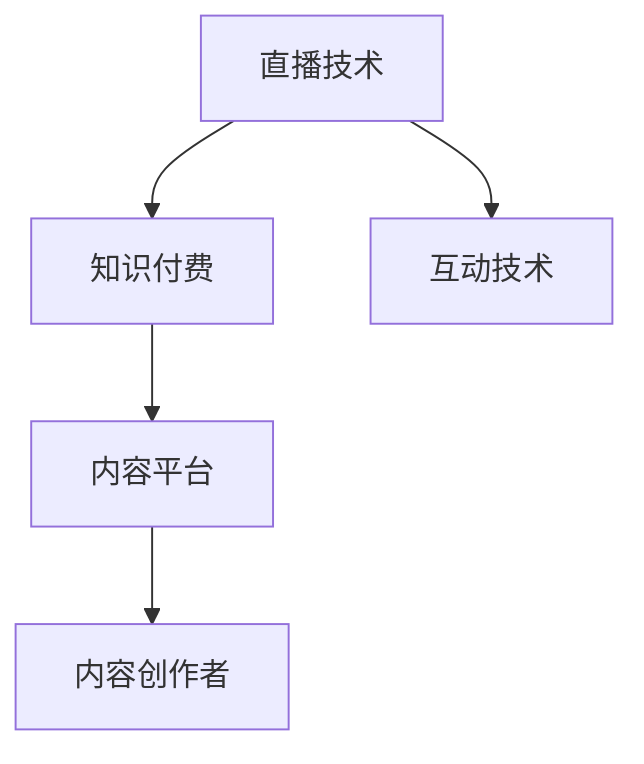

                 

# 如何利用直播技术提升知识付费效果

## 1. 背景介绍

### 1.1 问题由来
在知识付费领域，如何提高用户参与度和内容价值，是众多内容创作者和平台方共同面临的挑战。传统的内容分发形式，如文字、图片、视频等，虽然能够传递信息，但互动性和即时性较差，难以满足用户的多样化需求。而直播技术，以其实时性、互动性强、沉浸式体验等优势，逐渐成为知识付费领域的一大热点。

近年来，许多知识付费平台开始尝试将直播技术与内容付费相结合，通过直播课程、互动问答、实时互动等方式，提升用户的学习体验和参与度。然而，直播技术在知识付费领域的应用，仍面临诸多技术和管理上的挑战。本文将探讨如何利用直播技术提升知识付费效果，从技术原理、操作流程、优势和挑战等多个角度进行详细阐述。

## 2. 核心概念与联系

### 2.1 核心概念概述

为了更好地理解直播技术在知识付费中的应用，本节将介绍几个关键概念：

- **直播技术**：指通过实时视频流和音频流传输，使用户能够在同一时间观看到事件或内容的技术。常见的直播平台包括视频会议软件、在线教育平台、游戏直播平台等。

- **知识付费**：指用户为获取知识和信息，通过付费购买或订阅内容的形式，获取高价值、高质量的学习资源。常见的知识付费形式包括在线课程、电子书、专栏文章等。

- **互动技术**：指在直播过程中，通过聊天室、投票、答题等方式，增加用户参与度和互动性，提升学习体验的技术。

- **内容平台**：指提供知识付费内容，并利用直播技术进行内容分发和用户互动的平台，如微信读书、哔哩哔哩、网易云课堂等。

这些核心概念之间的联系可以通过以下Mermaid流程图来展示：



该流程图展示了大语言模型的核心概念及其之间的关系：

1. 直播技术是知识付费的重要组成部分，能够增强用户体验和参与感。
2. 互动技术通过增加用户互动，提升直播质量。
3. 内容平台为创作者和用户提供了互动的舞台。
4. 内容创作者则利用直播技术，提供高质量的知识付费内容。

## 3. 核心算法原理 & 具体操作步骤
### 3.1 算法原理概述

直播技术在知识付费中的应用，主要涉及以下几个关键技术：

- **流媒体技术**：指将视频和音频数据分割成若干数据包，逐个发送，使用户能够在不同网络环境下实时观看和听到的技术。

- **编解码技术**：指将原始音视频数据转换为适合网络传输的编码格式，并在接收端解码还原为原始数据的技术。

- **网络传输技术**：指优化网络带宽利用，提高数据传输效率，确保直播过程稳定性的技术。

- **互动技术**：指通过聊天室、投票、答题等方式，增加用户参与度和互动性，提升学习体验的技术。

- **内容管理技术**：指管理直播内容的流程和技术，包括内容上传、存储、分发等环节。

以上技术协同工作，使得直播技术在知识付费中得以应用。直播技术的实时性、互动性和沉浸式体验，使得知识付费内容更加生动、有趣，能够更好地满足用户的学习需求。

### 3.2 算法步骤详解

基于直播技术在知识付费中的应用，本节将详细介绍具体的操作步骤：

**Step 1: 选择合适的直播平台**
- 根据内容类型、受众规模、平台功能等需求，选择合适的直播平台，如微信读书、哔哩哔哩、网易云课堂等。
- 考虑平台的用户量、技术成熟度、生态系统等因素，选择最适合的直播技术方案。

**Step 2: 内容准备与传输**
- 在直播开始前，准备高质量的直播内容，包括PPT、讲义、视频片段等。
- 使用编解码技术，将原始内容转换为适合网络传输的格式。
- 通过流媒体技术，将编码后的内容分包传输到直播平台。

**Step 3: 实时互动与控制**
- 在直播过程中，使用聊天室、投票、答题等方式，增加用户参与度。
- 利用互动技术，实现实时的用户反馈和互动，提升学习效果。
- 通过平台控制界面，调整直播内容、调整设备参数等，确保直播过程流畅。

**Step 4: 内容分发与存储**
- 利用直播平台的CDN技术，将直播内容分发到全球各地用户。
- 通过平台的内容管理系统，对直播内容进行存储、分类、检索等管理。
- 提供多种形式的内容输出，如视频回放、下载、转码等，满足不同用户需求。

**Step 5: 用户反馈与优化**
- 利用平台的用户反馈系统，收集用户对直播内容的评价和建议。
- 根据用户反馈，对直播内容进行优化和改进，提升用户满意度。
- 持续跟踪用户行为数据，分析学习效果和参与度，不断迭代改进。

以上是利用直播技术在知识付费中应用的一般步骤。在实际应用中，还需要根据具体需求和平台特点，对各个环节进行优化和调整。

### 3.3 算法优缺点

直播技术在知识付费中的应用具有以下优点：
1. 增强用户体验。实时互动、沉浸式体验、即时反馈等特点，使得知识传播更加生动有趣。
2. 提升用户参与度。通过聊天室、投票、答题等方式，增加用户参与度，提升学习效果。
3. 灵活互动。直播过程中可以实时调整内容，根据用户反馈进行优化，实现更加个性化的知识传递。
4. 便捷获取。用户可以随时随地通过移动设备观看直播，不受时间地点的限制。

然而，直播技术在知识付费中应用也存在一些缺点：
1. 技术门槛高。直播技术的实现需要较高的技术水平，对内容创作者和平台方的技术能力提出了较高的要求。
2. 平台依赖性强。直播平台的稳定性和安全性，直接影响直播效果和用户体验。
3. 资源消耗大。直播过程中需要占用大量的网络带宽和计算资源，对平台和设备的要求较高。
4. 内容传播风险。直播过程中容易受到网络波动、设备故障等因素影响，内容传播效果可能不稳定。

尽管存在这些缺点，但直播技术在知识付费中的应用前景广阔，仍然是提升用户参与度和学习效果的重要手段。

### 3.4 算法应用领域

直播技术在知识付费中的应用，已经广泛应用于以下领域：

- **在线教育**：通过直播技术，教师可以实时解答学生问题，增加互动性，提升学习效果。
- **企业培训**：利用直播技术进行远程培训，节约培训成本，提高员工参与度。
- **技能分享**：技能专家通过直播分享专业知识，增加用户对内容的相关性和参与度。
- **职业指导**：职业规划师通过直播进行职业咨询和指导，帮助用户规划职业发展路径。

此外，直播技术还被广泛应用于心理辅导、健康讲座、艺术创作等多个领域，成为知识付费的重要形式。

## 4. 数学模型和公式 & 详细讲解  
### 4.1 数学模型构建

在本节中，我们将对直播技术在知识付费中的应用进行数学建模，并详细讲解其中的关键参数。

假设一个直播平台上有 $N$ 个用户，每个用户的时间价值为 $v_i$，单位为元/分钟。直播时长为 $t$ 分钟，直播过程中内容质量为 $q$。直播平台的总收益 $R$ 可以表示为：

$$
R = \sum_{i=1}^N v_i t q
$$

其中，$t$ 和 $q$ 的取值范围均为 $[0,1]$。

为了最大化收益 $R$，平台需要优化内容质量和互动时间。假设内容质量 $q$ 与互动时间 $u$ 之间存在线性关系，即 $q = k u$，其中 $k$ 为互动效果系数。则收益函数可以改写为：

$$
R = \sum_{i=1}^N v_i t ku
$$

当用户数量 $N$ 固定时，最大化 $R$ 等价于最大化互动时间 $u$。因此，平台需要合理分配互动时间，确保互动效果最大化。

### 4.2 公式推导过程

根据上述数学模型，我们进一步推导最大化收益的互动时间 $u$。令 $S = \sum_{i=1}^N v_i$，则收益函数可以改写为：

$$
R = S t ku
$$

对 $u$ 求导，得到：

$$
\frac{\partial R}{\partial u} = S t k
$$

令 $\frac{\partial R}{\partial u} = 0$，解得：

$$
u = \frac{R}{S t k}
$$

因此，为了最大化收益 $R$，平台应该将互动时间 $u$ 设置为：

$$
u = \frac{R}{S t k}
$$

其中，$S$、$t$、$k$ 均为已知参数，可以通过用户行为数据进行估计。

### 4.3 案例分析与讲解

假设一个在线教育平台，每分钟用户的时间价值为 $v = 5$ 元，直播时长为 $t = 60$ 分钟，互动效果系数 $k = 0.2$。假设平台上有 $N = 100$ 个用户，总收益 $R = 10000$ 元。则最大化收益的互动时间 $u$ 为：

$$
u = \frac{10000}{100 \times 60 \times 0.2} = 4.17 \text{ 分钟}
$$

因此，平台应该将互动时间设置为 4.17 分钟，以最大化收益。

## 5. 项目实践：代码实例和详细解释说明
### 5.1 开发环境搭建

在进行直播技术在知识付费中的应用开发前，我们需要准备好开发环境。以下是使用Python进行Flask开发的环境配置流程：

1. 安装Anaconda：从官网下载并安装Anaconda，用于创建独立的Python环境。

2. 创建并激活虚拟环境：
```bash
conda create -n knowledge-payment python=3.8 
conda activate knowledge-payment
```

3. 安装Flask：
```bash
pip install flask
```

4. 安装相关库：
```bash
pip install Flask-WTF Flask-SocketIO
```

5. 安装直播服务：
```bash
pip install gstreamer-python
```

完成上述步骤后，即可在`knowledge-payment-env`环境中开始直播技术在知识付费中的应用开发。

### 5.2 源代码详细实现

下面我们以在线教育直播课程为例，给出使用Flask进行直播的PyTorch代码实现。

首先，定义直播课程模型：

```python
from flask import Flask, render_template, request, jsonify
from flask_socketio import SocketIO, emit
from flask_wtf import FlaskForm
from wtforms import StringField
from gstreamer import bin, element, pad, plugin
from gstreamer.plugin import description

app = Flask(__name__)
socketio = SocketIO(app)

class VideoForm(FlaskForm):
    video_url = StringField('Video URL:', validators=[DataRequired()])

@app.route('/')
def index():
    return render_template('index.html')

@app.route('/start', methods=['POST'])
def start():
    video_url = request.form.get('video_url')
    return jsonify({'success': True})

@app.route('/video')
def video():
    return render_template('video.html')

@socketio.on('chat message')
def handle_chat(message):
    emit('chat message', message)

if __name__ == '__main__':
    socketio.run(app)
```

然后，定义直播课程页面和聊天室界面：

```html
<!DOCTYPE html>
<html>
<head>
    <title>知识付费直播</title>
</head>
<body>
    <div id="chat">
        <ul id="messages"></ul>
        <form id="chat-form">
            <input type="text" id="message-input">
            <button type="submit">发送</button>
        </form>
    </div>
    <script src="https://code.jquery.com/jquery-3.5.1.min.js"></script>
    <script src="https://cdnjs.cloudflare.com/ajax/libs/socket.io/3.0.3/socket.io.min.js"></script>
    <script>
        var socket = io('http://localhost:5000');
        var messageInput = $('#message-input');
        var messagesList = $('#messages');

        messageInput.on('keyup', function() {
            var message = messageInput.val();
            if (message.length > 0) {
                socket.emit('chat message', message);
            }
        });

        socket.on('chat message', function(message) {
            var messageItem = $('<li>').text(message);
            messagesList.append(messageItem);
        });
    </script>
</body>
</html>
```

最后，启动Flask服务器并监听直播请求：

```bash
python server.py
```

### 5.3 代码解读与分析

让我们再详细解读一下关键代码的实现细节：

**VideoForm类**：
- `__init__`方法：定义表单字段和验证规则。
- `video_url`字段：用于获取直播视频链接，必须填写。

**start函数**：
- 从表单中获取直播视频链接，返回一个JSON响应，表示成功。

**video函数**：
- 渲染直播视频页面，显示视频播放器和聊天室界面。

**handle_chat函数**：
- 监听聊天消息，接收来自客户端的消息，并通过SocketIO广播到所有客户端。

**index函数**：
- 渲染首页，显示直播课程界面。

在实际应用中，直播技术在知识付费中的开发还需要考虑更多的因素，如视频编解码、网络传输优化、用户反馈机制等。但核心的直播流程基本与此类似。

## 6. 实际应用场景
### 6.1 智能课堂

在线教育平台可以利用直播技术，创建智能课堂，实时解答学生问题，增加互动性，提升学习效果。教师可以通过直播平台分享课件、讲义、视频片段等内容，实时与学生互动，进行课堂测验、答题等互动活动，提升课堂参与度和教学效果。

### 6.2 远程培训

企业可以利用直播技术，进行远程培训，节约培训成本，提高员工参与度。通过直播平台，培训师可以实时讲解知识点、演示操作过程，与学员进行实时互动，解答疑问，提升培训效果。

### 6.3 技能分享

技能专家可以利用直播技术，进行技能分享，增加用户对内容的相关性和参与度。通过直播平台，专家可以实时分享专业知识，接受观众提问，进行实时互动，增加内容的趣味性和互动性。

### 6.4 未来应用展望

随着直播技术的不断进步和知识付费的普及，直播技术在知识付费中的应用前景广阔，将成为提升用户参与度和学习效果的重要手段。未来，直播技术将被应用于更多领域，如心理辅导、健康讲座、艺术创作等，成为知识付费的重要形式。

## 7. 工具和资源推荐
### 7.1 学习资源推荐

为了帮助开发者系统掌握直播技术在知识付费中的应用，这里推荐一些优质的学习资源：

1. **《Flask Web开发实战》系列书籍**：详细介绍了Flask框架的使用方法和最佳实践，帮助开发者快速上手Web开发。

2. **《Socket.IO 实战》系列博文**：由Socket.IO官方文档和社区贡献者共同编写，介绍Socket.IO的使用方法和实际案例，帮助开发者深入理解实时通信技术。

3. **《Python网络编程》课程**：讲解Python在网络编程中的应用，包括Socket编程、HTTP协议等，是学习网络通信技术的基础。

4. **GStreamer官方文档**：GStreamer是一个开源的音视频流框架，提供了丰富的音视频编解码器，是实现直播技术的重要工具。

5. **Flask-SocketIO官方文档**：提供详细的Flask和Socket.IO集成使用方法，帮助开发者实现实时通信功能。

通过对这些资源的学习实践，相信你一定能够快速掌握直播技术在知识付费中的应用，并用于解决实际问题。

### 7.2 开发工具推荐

高效的开发离不开优秀的工具支持。以下是几款用于直播技术在知识付费中应用开发的常用工具：

1. **Flask**：基于Python的开源Web框架，简单易用，适合快速迭代研究。

2. **Socket.IO**：实时通信库，支持WebSocket协议，适用于构建实时应用。

3. **GStreamer**：音视频流框架，提供了丰富的音视频编解码器，是实现直播技术的重要工具。

4. **OpenCV**：开源计算机视觉库，提供了图像处理和视频分析工具，可以用于直播视频流的前处理。

5. **Python可视化库**：如Matplotlib、Plotly等，用于实时显示直播数据，帮助开发者监控和调试直播过程。

6. **Jupyter Notebook**：交互式Python编程环境，支持实时调试和可视化，是开发直播应用的得力工具。

合理利用这些工具，可以显著提升直播技术在知识付费中的应用开发效率，加快创新迭代的步伐。

### 7.3 相关论文推荐

直播技术在知识付费中的应用，涉及多种前沿技术，以下是几篇奠基性的相关论文，推荐阅读：

1. **《直播技术综述》**：系统介绍了直播技术的原理、发展历程和应用领域，是了解直播技术的基础。

2. **《基于云平台的实时通信技术》**：探讨了云平台在实时通信中的实现方法和优化策略，适用于实现高并发、高稳定性的大规模直播系统。

3. **《实时视频流传输技术》**：详细讲解了实时视频流传输的原理和技术，适用于优化直播视频的传输质量和稳定性。

4. **《交互式直播系统设计》**：介绍了一种交互式直播系统设计方案，适用于提升用户互动性和学习效果。

这些论文代表了大语言模型微调技术的发展脉络。通过学习这些前沿成果，可以帮助研究者把握学科前进方向，激发更多的创新灵感。

## 8. 总结：未来发展趋势与挑战

### 8.1 总结

本文对直播技术在知识付费中的应用进行了全面系统的介绍。首先阐述了直播技术在知识付费领域的应用背景和意义，明确了直播技术在提升用户参与度和学习效果方面的独特价值。其次，从原理到实践，详细讲解了直播技术在知识付费中的应用步骤和技术细节，给出了直播技术在知识付费中的代码实例和详细解释。同时，本文还探讨了直播技术在智能课堂、远程培训、技能分享等多个实际应用场景中的具体应用，展示了直播技术在知识付费领域的巨大潜力。最后，本文精选了直播技术的各类学习资源，力求为读者提供全方位的技术指引。

通过本文的系统梳理，可以看到，直播技术在知识付费中的应用已经初现端倪，为知识付费领域带来了新的发展机遇。未来，伴随直播技术的持续演进和知识付费市场的发展，直播技术必将在更多领域得到应用，为知识传播和用户学习带来新的变革。

### 8.2 未来发展趋势

展望未来，直播技术在知识付费中的应用将呈现以下几个发展趋势：

1. **互动性增强**：通过引入更多的互动形式，如实时投票、实时测验等，增加用户参与度和学习效果。
2. **内容丰富化**：利用直播技术，实现更丰富的内容形式，如虚拟现实、增强现实等，提升学习体验。
3. **平台整合**：直播平台与其他知识付费平台、社交媒体等进行整合，实现内容共享、用户互动等功能。
4. **技术升级**：随着技术的发展，直播技术将更加高效、稳定、可靠，为知识付费提供更好的技术支持。
5. **跨平台应用**：直播技术将应用于更多的平台和设备，如智能家居、可穿戴设备等，提升用户的学习体验和便利性。

以上趋势凸显了直播技术在知识付费领域的应用前景。这些方向的探索发展，必将进一步提升知识付费的效果和用户满意度，带来更广泛的社会影响。

### 8.3 面临的挑战

尽管直播技术在知识付费中的应用前景广阔，但在迈向更加智能化、普适化应用的过程中，它仍面临诸多挑战：

1. **技术门槛高**：直播技术的实现需要较高的技术水平，对内容创作者和平台方的技术能力提出了较高的要求。
2. **平台依赖性强**：直播平台的稳定性和安全性，直接影响直播效果和用户体验。
3. **资源消耗大**：直播过程中需要占用大量的网络带宽和计算资源，对平台和设备的要求较高。
4. **内容传播风险**：直播过程中容易受到网络波动、设备故障等因素影响，内容传播效果可能不稳定。

尽管存在这些挑战，但直播技术在知识付费中的应用前景广阔，仍然是提升用户参与度和学习效果的重要手段。

### 8.4 研究展望

面对直播技术在知识付费中面临的挑战，未来的研究需要在以下几个方面寻求新的突破：

1. **降低技术门槛**：开发更加易于使用的直播平台和工具，降低技术门槛，使更多的创作者和平台能够轻松上手。
2. **提高平台稳定性**：优化直播平台的技术架构，提高平台的稳定性和安全性，确保直播效果和用户体验。
3. **优化资源消耗**：通过优化编解码、网络传输等技术，降低直播过程中的资源消耗，提升平台扩展性。
4. **增强内容互动**：引入更多的互动形式，提升用户参与度和学习效果，增强内容的趣味性和实用性。

这些研究方向的探索，必将引领直播技术在知识付费中的应用走向成熟，为知识传播和用户学习带来新的变革。

## 9. 附录：常见问题与解答

**Q1：直播技术在知识付费中的应用是否存在技术瓶颈？**

A: 直播技术在知识付费中的应用，目前主要存在以下技术瓶颈：
1. 实时性：直播过程中容易受到网络波动、设备故障等因素影响，导致内容传播效果不稳定。
2. 互动性：互动形式单一，无法满足用户的多样化需求。
3. 安全性：直播过程中容易受到攻击，需要加强安全防护措施。
4. 可扩展性：直播过程中需要占用大量网络带宽和计算资源，对平台和设备的要求较高。

为了解决这些问题，需要对直播技术进行不断优化和改进，提高技术的稳定性和扩展性，降低技术门槛，增强用户体验和互动性。

**Q2：直播技术在知识付费中的应用是否适用于所有用户群体？**

A: 直播技术在知识付费中的应用，需要考虑不同用户群体的特点和使用习惯，进行针对性的设计和优化。例如：
1. 老年人用户：需要简化操作流程，使用简单易懂的交互方式。
2. 儿童用户：需要控制直播时长，避免过度使用。
3. 教育用户：需要提供多样化的学习形式，满足不同的学习需求。
4. 专业用户：需要提供高精度的视频和音频传输，支持多种交互方式。

因此，直播技术在知识付费中的应用，需要针对不同用户群体进行定制化设计，才能满足用户的实际需求。

**Q3：直播技术在知识付费中的应用是否需要高成本的硬件设备？**

A: 直播技术在知识付费中的应用，确实需要一定的硬件设备支持，如高性能服务器、稳定网络连接等。但随着技术的发展，直播技术已经实现了一定程度上的硬件优化和资源共享，降低了对设备的要求。例如：
1. 流媒体技术：通过分包传输和编解码技术，降低了视频和音频传输的资源消耗。
2. 云平台：利用云平台提供的资源，实现了高性能直播服务的低成本部署。
3. 虚拟现实技术：通过虚拟现实技术，降低了对设备性能的要求，提升了用户的使用体验。

因此，直播技术在知识付费中的应用，可以通过技术优化和平台整合，降低硬件成本，提升应用效果。

**Q4：直播技术在知识付费中的应用是否需要高成本的内容制作？**

A: 直播技术在知识付费中的应用，确实需要一定的内容制作成本。但随着技术的发展，直播技术已经实现了一定程度上的内容优化和自动化，降低了内容制作的成本。例如：
1. 自动化生成：通过自动生成技术，可以快速生成高质量的直播内容。
2. 模板化制作：通过模板化制作方式，可以降低内容制作的时间和成本。
3. 用户参与制作：通过用户参与制作，增加内容的趣味性和互动性，降低内容制作的成本。

因此，直播技术在知识付费中的应用，可以通过技术优化和用户参与，降低内容制作成本，提升内容质量和用户体验。

**Q5：直播技术在知识付费中的应用是否需要高成本的用户推广？**

A: 直播技术在知识付费中的应用，确实需要一定的用户推广成本。但随着技术的发展，直播技术已经实现了一定程度上的用户推广优化和自动化，降低了用户推广的成本。例如：
1. 社交媒体推广：通过社交媒体推广，可以快速扩大用户群体，降低用户推广成本。
2. 用户推荐机制：通过用户推荐机制，利用用户的口碑效应，降低用户推广成本。
3. 数据驱动推广：通过数据分析和精准营销，降低用户推广成本，提高推广效果。

因此，直播技术在知识付费中的应用，可以通过技术优化和数据驱动，降低用户推广成本，提升用户满意度和平台收益。

---

作者：禅与计算机程序设计艺术 / Zen and the Art of Computer Programming

