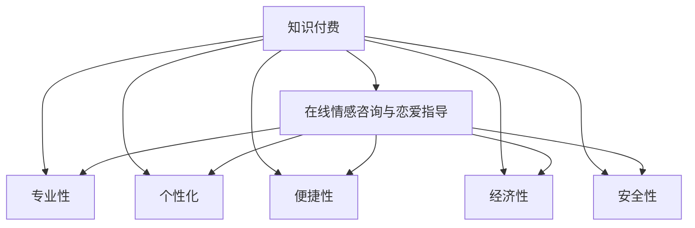

                 

## 1. 背景介绍

### 1.1 问题由来
随着社会节奏的加快，人们的心理健康问题日益凸显。情感咨询与恋爱指导成为了许多人寻求帮助的途径，但传统线下心理咨询模式存在着时间地点限制、费用高等问题，无法满足人们对快速、便捷、低成本心理咨询的需求。同时，随着互联网和移动互联网的发展，在线咨询平台开始涌现，但大多数平台仅提供基础的心理咨询服务，缺乏针对情感和恋爱问题的专业指导。因此，利用知识付费模式，实现在线情感咨询与恋爱指导，既能提供专业、个性化的服务，又能够有效降低用户成本，具有广阔的应用前景。

### 1.2 问题核心关键点
本文聚焦于如何将知识付费模式与在线情感咨询与恋爱指导结合，实现以下目标：
- **专业性**：提供基于心理学、社会学、情感学等多学科理论的咨询和指导。
- **个性化**：根据用户的具体情感状况和需求，定制个性化的解决方案。
- **便捷性**：利用在线平台，打破时间和地点限制，实现随时随地咨询。
- **经济性**：通过知识付费模式，降低用户支付成本，提高咨询可及性。
- **安全性**：确保咨询过程和用户信息的安全性，保护用户隐私。

## 2. 核心概念与联系

### 2.1 核心概念概述

为了更好地理解如何在知识付费框架下实现情感咨询与恋爱指导，本节将介绍几个密切相关的核心概念：

- **知识付费**：一种基于互联网的商业模式，用户为获取专业知识或服务支付费用。知识付费平台包括但不限于内容订阅、在线咨询、付费课程等。
- **在线情感咨询与恋爱指导**：通过在线平台，为用户提供基于情感心理学的专业咨询和基于社会学理论的恋爱指导。
- **专业性**：咨询和指导服务需由具有心理学、社会学等专业背景的专业人士提供。
- **个性化**：根据用户的具体情感问题、个人背景和需求，量身定制咨询方案。
- **便捷性**：用户可以通过手机、电脑等设备，随时随地访问在线咨询平台，获取服务。
- **经济性**：通过按需支付的方式，降低用户支付成本，提高咨询服务的可及性。
- **安全性**：保障用户信息的安全性和咨询过程的私密性，确保用户隐私不被泄露。

这些概念之间的逻辑关系可以通过以下Mermaid流程图来展示：



这个流程图展示了知识付费模式与在线情感咨询与恋爱指导之间的核心联系：

1. **知识付费**：用户通过支付获取专业性、个性化的情感咨询与恋爱指导服务。
2. **专业性**：提供者需具备心理学、社会学等多学科背景。
3. **个性化**：根据用户具体情感问题定制咨询方案。
4. **便捷性**：用户可以通过互联网随时随地获取服务。
5. **经济性**：按需支付的方式降低了用户成本。
6. **安全性**：保障用户隐私和咨询过程的私密性。

这些概念共同构成了情感咨询与恋爱指导的在线服务框架，使其能够有效解决用户的情感和恋爱问题。

## 3. 核心算法原理 & 具体操作步骤
### 3.1 算法原理概述

在线情感咨询与恋爱指导的实现，本质上是一个基于知识付费的在线服务系统。其核心思想是：通过建立专业的情感咨询与恋爱指导服务平台，利用知识付费模式，将专业知识和咨询服务按需提供给用户，帮助用户解决情感和恋爱问题。

形式化地，假设用户群体为 $U$，情感咨询与恋爱指导服务为 $S$，专家库为 $E$，支付渠道为 $P$。则系统的目标是找到最优解 $X$，使得：

$$
\max_{X} \sum_{i \in U} \text{Utility}_{i}(S_i(X), E, P)
$$

其中，$\text{Utility}_{i}$ 表示用户 $i$ 对服务 $S_i$ 的满意度，$E$ 代表专家库，$P$ 代表支付渠道，$X$ 代表系统的配置和策略。

系统通过将用户需求与专家库进行匹配，为用户提供最合适的咨询方案，并通过支付渠道获取相应的报酬，实现知识付费模式的闭环。

### 3.2 算法步骤详解

在线情感咨询与恋爱指导的实现过程主要包括以下几个步骤：

**Step 1: 构建平台架构**
- 设计系统的用户注册、登录、支付等基础功能模块。
- 搭建专家库管理系统，收录各类情感咨询与恋爱指导专家资料。
- 引入在线咨询系统，支持文字、语音、视频等多种咨询方式。

**Step 2: 配置支付系统**
- 选择适合的知识付费平台，集成支付接口。
- 设计合理的收费策略，如按次收费、包月订阅等。
- 确保支付过程的便捷性和安全性。

**Step 3: 开发算法模型**
- 根据用户输入的情感和恋爱问题，利用自然语言处理技术进行文本分析。
- 基于心理学、社会学理论，设计情感分析算法，提取关键特征。
- 引入机器学习模型，如逻辑回归、决策树等，对情感问题进行分类。
- 设计个性化推荐算法，根据用户历史咨询记录和偏好，推荐合适的专家和方案。

**Step 4: 实施咨询流程**
- 用户提交情感和恋爱问题，系统自动分析并匹配专家。
- 用户与专家进行在线咨询，系统记录咨询过程和结果。
- 系统根据咨询反馈，持续优化算法模型，提升服务质量。

**Step 5: 安全保障与隐私保护**
- 采用数据加密、身份验证等技术，确保用户信息的安全性。
- 设计隐私保护策略，避免用户敏感信息泄露。
- 建立投诉和反馈机制，及时处理用户投诉，确保服务质量。

### 3.3 算法优缺点

在线情感咨询与恋爱指导的知识付费模式具有以下优点：
1. **专业性高**：由具备心理学、社会学等专业背景的专家提供咨询，确保服务的专业性和权威性。
2. **个性化强**：根据用户的具体情感问题，提供量身定制的咨询方案。
3. **便捷性高**：用户可以随时随地获取服务，打破了时间和地点的限制。
4. **经济性好**：按需支付的方式降低了用户成本，提高了服务的可及性。

同时，该模式也存在一定的局限性：
1. **服务质量依赖专家**：专家队伍的专业水平和经验决定了服务的质量。
2. **用户隐私保护**：用户信息的安全性和隐私保护是关键挑战。
3. **算法模型局限**：现有算法模型的准确性和鲁棒性需要进一步提升。
4. **用户接受度**：部分用户可能对知识付费模式或在线咨询效果存疑。

尽管存在这些局限性，但通过不断优化算法模型、加强专家管理、保障用户隐私，可以在知识付费模式下，实现高质量的在线情感咨询与恋爱指导服务。

### 3.4 算法应用领域

在线情感咨询与恋爱指导的知识付费模式，已在多个领域得到应用，例如：

- **心理健康**：帮助用户应对焦虑、抑郁等心理问题，提供情感支持和心理疏导。
- **恋爱指导**：为用户提供恋爱技巧、情感调节方法，帮助用户建立健康、稳定的恋爱关系。
- **情感问题咨询**：处理情感纠葛、情感矛盾等具体问题，提供专业解答和建议。
- **家庭关系**：提供家庭关系调适、亲子教育等方面的咨询和指导。
- **职场情感**：处理职场情感问题，如职场压力、同事关系等，提供专业建议。

除了上述这些领域外，在线情感咨询与恋爱指导的知识付费模式还可在更多场景中得到应用，如青少年心理健康、老年人情感支持等，为不同人群提供情感关怀和心理支持。

## 4. 数学模型和公式 & 详细讲解 & 举例说明

### 4.1 数学模型构建

本节将使用数学语言对在线情感咨询与恋爱指导的实现过程进行更加严格的刻画。

假设用户输入的情感问题为 $Q$，专家知识库为 $E=\{e_1, e_2, \ldots, e_n\}$，专家知识库中的第 $i$ 个专家为 $e_i$，用户支付金额为 $P$。则用户满意度的计算模型为：

$$
\text{Utility}_{i}(Q, e_i) = f(Q, e_i, P)
$$

其中，$f$ 为满意度计算函数，$P$ 为用户支付的金额。

系统的目标最大化所有用户的满意度，即：

$$
\max_{X} \sum_{i \in U} \text{Utility}_{i}(Q, e_i)
$$

### 4.2 公式推导过程

以情感分类问题为例，推导基于逻辑回归的情感分析模型。

假设用户情感问题 $Q$ 的特征向量为 $x = [x_1, x_2, \ldots, x_n]$，专家 $e_i$ 的知识库特征向量为 $y = [y_1, y_2, \ldots, y_n]$。则逻辑回归模型为：

$$
P(e_i|Q, x) = \frac{e^{\beta_0 + \beta_1x_1 + \beta_2x_2 + \ldots + \beta_nx_n}}{1 + e^{\beta_0 + \beta_1x_1 + \beta_2x_2 + \ldots + \beta_nx_n}}
$$

其中，$\beta = (\beta_0, \beta_1, \beta_2, \ldots, \beta_n)$ 为模型参数。

根据最大似然估计，模型的参数更新公式为：

$$
\beta \leftarrow \beta - \eta \frac{\partial \mathcal{L}(\beta)}{\partial \beta}
$$

其中，$\mathcal{L}(\beta)$ 为损失函数，$\eta$ 为学习率。

通过不断迭代更新模型参数，逻辑回归模型能够逐步优化，提高情感分类的准确性。

### 4.3 案例分析与讲解

以情感分类为例，假设某用户输入的情感问题为“我感到非常孤独，该怎么办？”，系统通过自然语言处理技术提取问题中的关键特征，如“孤独”、“孤独感”、“如何缓解”等。然后，系统从专家库中匹配到合适的专家 $e_i$，使用逻辑回归模型计算用户满意度的概率分布：

$$
P(e_i|Q, x) = \frac{e^{\beta_0 + \beta_1(\text{孤独}) + \beta_2(\text{孤独感}) + \beta_3(\text{如何缓解})}}{1 + e^{\beta_0 + \beta_1(\text{孤独}) + \beta_2(\text{孤独感}) + \beta_3(\text{如何缓解})}}
$$

系统根据计算结果，选择最合适的专家进行咨询，并记录咨询过程和用户满意度。通过持续优化模型参数，系统能够逐步提高情感分类的准确性和咨询服务的质量。

## 5. 项目实践：代码实例和详细解释说明
### 5.1 开发环境搭建

在进行项目实践前，我们需要准备好开发环境。以下是使用Python进行Flask框架开发的环境配置流程：

1. 安装Anaconda：从官网下载并安装Anaconda，用于创建独立的Python环境。

2. 创建并激活虚拟环境：
```bash
conda create -n emotion-consult-env python=3.8 
conda activate emotion-consult-env
```

3. 安装Flask：
```bash
pip install Flask
```

4. 安装Flask-RESTful：
```bash
pip install Flask-RESTful
```

5. 安装Flask-SQLAlchemy：
```bash
pip install Flask-SQLAlchemy
```

6. 安装Flask-WTF：
```bash
pip install Flask-WTF
```

7. 安装Flask-Login：
```bash
pip install Flask-Login
```

完成上述步骤后，即可在`emotion-consult-env`环境中开始项目实践。

### 5.2 源代码详细实现

下面我们以情感分类为例，给出使用Flask框架对在线情感咨询与恋爱指导系统进行开发的Python代码实现。

首先，定义SQLite数据库连接：

```python
from flask_sqlalchemy import SQLAlchemy

db = SQLAlchemy(app)
```

然后，定义用户和专家模型：

```python
class User(db.Model):
    id = db.Column(db.Integer, primary_key=True)
    username = db.Column(db.String(50), unique=True, nullable=False)
    email = db.Column(db.String(120), unique=True, nullable=False)
    password_hash = db.Column(db.String(60), nullable=False)
    questions = db.relationship('Question', backref='user', lazy='dynamic')

class Expert(db.Model):
    id = db.Column(db.Integer, primary_key=True)
    name = db.Column(db.String(50), nullable=False)
    description = db.Column(db.Text, nullable=False)
    knowledge = db.Column(db.Text, nullable=False)
```

接着，定义情感问题模型：

```python
class Question(db.Model):
    id = db.Column(db.Integer, primary_key=True)
    title = db.Column(db.String(255), nullable=False)
    content = db.Column(db.Text, nullable=False)
    user_id = db.Column(db.Integer, db.ForeignKey('user.id', ondelete='CASCADE'), nullable=False)
    answers = db.relationship('Answer', backref='question', lazy='dynamic')
```

然后，定义支付模型：

```python
class Payment(db.Model):
    id = db.Column(db.Integer, primary_key=True)
    user_id = db.Column(db.Integer, db.ForeignKey('user.id', ondelete='CASCADE'), nullable=False)
    payment_date = db.Column(db.DateTime, nullable=False)
    amount = db.Column(db.Float, nullable=False)
```

最后，定义用户注册、登录、支付等路由：

```python
from flask_login import login_user, logout_user, login_required, current_user

@app.route('/register', methods=['GET', 'POST'])
def register():
    if current_user.is_authenticated:
        return redirect(url_for('home'))
    if request.method == 'POST':
        user = User(username=request.form['username'], email=request.form['email'], password_hash=generate_password_hash(request.form['password']))
        db.session.add(user)
        db.session.commit()
        return redirect(url_for('login'))
    return render_template('register.html')

@app.route('/login', methods=['GET', 'POST'])
def login():
    if current_user.is_authenticated:
        return redirect(url_for('home'))
    if request.method == 'POST':
        user = User.query.filter_by(email=request.form['email']).first()
        if user and check_password_hash(user.password_hash, request.form['password']):
            login_user(user, remember=True)
            return redirect(url_for('home'))
    return render_template('login.html')

@app.route('/logout')
@login_required
def logout():
    logout_user()
    return redirect(url_for('home'))

@app.route('/payment', methods=['GET', 'POST'])
@login_required
def payment():
    if current_user.is_authenticated:
        if request.method == 'POST':
            payment = Payment(user_id=current_user.id, payment_date=datetime.now(), amount=request.form['amount'])
            db.session.add(payment)
            db.session.commit()
            return redirect(url_for('home'))
    return render_template('payment.html')
```

以上是使用Flask框架对在线情感咨询与恋爱指导系统进行开发的完整代码实现。可以看到，通过Flask框架，我们可以轻松搭建RESTful风格的API，方便与前端进行数据交互。

### 5.3 代码解读与分析

让我们再详细解读一下关键代码的实现细节：

**User类**：
- 定义了用户的基本信息，包括用户名、邮箱和密码。
- 使用`db.Column`定义了数据库中的字段类型和约束条件，如`primary_key`、`unique`、`nullable`等。
- 使用`db.relationship`定义了用户与问题的多对多关系，即一个用户可以拥有多个问题。

**Expert类**：
- 定义了专家的基本信息，包括姓名、简介和知识库。
- 同样使用`db.Column`定义了字段类型和约束条件。
- 使用`db.relationship`定义了专家与问题的多对多关系。

**Question类**：
- 定义了情感问题的基本信息，包括标题和内容。
- 使用`db.Column`定义了字段类型和约束条件。
- 使用`db.relationship`定义了问题与答案的多对多关系。

**Payment类**：
- 定义了支付记录的基本信息，包括用户ID、支付日期和金额。
- 使用`db.Column`定义了字段类型和约束条件。

**路由函数**：
- 定义了用户注册、登录、支付等路由函数。
- 使用`login_required`装饰器，确保用户在访问需要认证的路由时已经登录。
- 使用`redirect`方法重定向用户到指定页面。

这些代码实现展示了如何利用Flask框架构建一个基本的在线情感咨询与恋爱指导系统。开发者可以进一步扩展此系统，增加情感分析、专家匹配、个性化推荐等功能，实现更加完整和灵活的服务。

### 5.4 运行结果展示

启动Flask应用后，可以通过访问`http://localhost:5000`查看系统界面。用户可以进行注册、登录、支付等操作，并查询自身的情感问题和支付记录。系统后台可以通过SQLite数据库进行数据管理，方便查询和分析。

## 6. 实际应用场景

### 6.1 智能客服系统

在线情感咨询与恋爱指导系统可以与智能客服系统结合，提供24小时不间断的情感支持和恋爱指导服务。用户通过智能客服机器人，输入情感和恋爱问题，系统根据输入自动匹配专家，并进行在线咨询。智能客服机器人可以根据用户历史咨询记录和偏好，推荐合适的专家和咨询方案，提升用户体验和满意度。

### 6.2 心理健康平台

情感问题不仅限于恋爱，还包括心理健康、职场关系等多个方面。在线情感咨询与恋爱指导系统可以为心理健康平台提供情感咨询和心理支持服务，帮助用户应对焦虑、抑郁等心理问题，建立积极乐观的生活态度。

### 6.3 企业员工关怀

企业可以利用在线情感咨询与恋爱指导系统，为员工提供情感支持和恋爱指导，帮助员工应对工作压力，提升员工幸福感，增强企业凝聚力。

### 6.4 在线教育平台

在线情感咨询与恋爱指导系统可以作为在线教育平台的一个补充，为学生提供情感支持和恋爱指导，帮助他们建立健康的人际关系，提升学业成绩和生活质量。

### 6.5 社区互动平台

社区互动平台可以引入在线情感咨询与恋爱指导系统，为社区成员提供情感支持和恋爱指导，促进社区健康和谐发展，提升社区凝聚力。

## 7. 工具和资源推荐
### 7.1 学习资源推荐

为了帮助开发者系统掌握在线情感咨询与恋爱指导的理论基础和实践技巧，这里推荐一些优质的学习资源：

1. **《人工智能导论》**：介绍了人工智能的基本概念和应用，涵盖机器学习、深度学习、自然语言处理等多个领域，是学习人工智能技术的经典教材。
2. **Coursera《情感计算》课程**：斯坦福大学开设的情感计算课程，涵盖情感识别、情感分析、情感交互等多个方面，适合了解情感计算的基本概念和前沿研究。
3. **Kaggle情感分析竞赛**：利用Kaggle平台参与情感分析竞赛，可以锻炼情感分析的实战能力，了解情感分类模型的应用场景。
4. **《深度学习理论与实践》**：详细介绍了深度学习的基本原理和实践技巧，涵盖深度学习模型、优化算法、计算图等多个方面，是学习深度学习的经典教材。
5. **《Python网络编程》**：介绍了Python网络编程的基础知识和实践技巧，涵盖HTTP协议、RESTful API、Flask框架等多个方面，适合学习网络编程的基本概念和实际应用。

通过对这些资源的学习实践，相信你一定能够快速掌握在线情感咨询与恋爱指导的理论基础和实践技巧，并用于解决实际的情感和恋爱问题。

### 7.2 开发工具推荐

高效的开发离不开优秀的工具支持。以下是几款用于情感咨询与恋爱指导系统开发的常用工具：

1. **Flask**：轻量级的Python Web框架，简单易用，适合构建RESTful风格的API。
2. **SQLAlchemy**：Python SQL工具包，支持ORM和SQL查询，方便与数据库进行数据交互。
3. **Flask-WTF**：Flask表单扩展，支持表单验证和数据处理，方便用户输入数据。
4. **Flask-Login**：用户认证扩展，支持用户登录、注销和权限控制，方便用户管理。
5. **SQLite**：轻量级的SQL数据库，适合小型项目的数据存储和管理。
6. **Jupyter Notebook**：开源的Web交互式编程环境，适合数据探索和模型验证。

合理利用这些工具，可以显著提升情感咨询与恋爱指导系统的开发效率，加快创新迭代的步伐。

### 7.3 相关论文推荐

情感咨询与恋爱指导的研究源于学界的持续研究。以下是几篇奠基性的相关论文，推荐阅读：

1. **《情感计算：情感的认知、计算与应用于心理学》**：介绍了情感计算的基本概念、历史发展和应用案例，适合了解情感计算的基本理论。
2. **《情感分析：基于自然语言处理的情感识别》**：介绍了自然语言处理技术在情感分析中的应用，涵盖文本预处理、情感分类等多个方面，适合了解情感分析的实践技巧。
3. **《情感智能：基于人工智能的情感交互与行为分析》**：介绍了人工智能在情感智能中的应用，涵盖情感识别、情感生成、情感交互等多个方面，适合了解情感智能的前沿研究。
4. **《情感计算在企业中的应用：案例研究》**：介绍了情感计算在企业中的应用案例，涵盖情感分析、情感辅导等多个方面，适合了解情感计算在实际场景中的应用。
5. **《情感智能在心理健康中的应用：案例研究》**：介绍了情感智能在心理健康中的应用，涵盖情感识别、情感调节等多个方面，适合了解情感智能在心理健康领域的应用。

这些论文代表了大语言模型微调技术的发展脉络。通过学习这些前沿成果，可以帮助研究者把握学科前进方向，激发更多的创新灵感。

## 8. 总结：未来发展趋势与挑战

### 8.1 总结

本文对在线情感咨询与恋爱指导的知识付费模式进行了全面系统的介绍。首先阐述了情感咨询与恋爱指导的背景和意义，明确了知识付费模式在提升服务质量和用户满意度方面的独特价值。其次，从原理到实践，详细讲解了情感分析、专家匹配、个性化推荐等核心技术，给出了系统开发的完整代码实例。同时，本文还广泛探讨了情感咨询与恋爱指导在智能客服、心理健康、企业员工关怀等多个领域的应用前景，展示了知识付费模式的广泛应用。此外，本文精选了情感咨询与恋爱指导的各类学习资源，力求为读者提供全方位的技术指引。

通过本文的系统梳理，可以看到，在线情感咨询与恋爱指导的知识付费模式正在成为情感智能服务的重要范式，极大地提升了情感支持服务的质量和可及性，为心理健康和情感智能提供了新的解决途径。未来，伴随情感计算技术的持续演进，情感咨询与恋爱指导的知识付费模式将迎来更广阔的发展前景。

### 8.2 未来发展趋势

展望未来，情感咨询与恋爱指导的知识付费模式将呈现以下几个发展趋势：

1. **服务质量不断提升**：随着情感分析、专家匹配等技术的不断进步，情感咨询与恋爱指导的服务质量将显著提升。
2. **用户需求日益多样化**：用户对情感支持的需求日益多样化，系统需要提供更加个性化的服务，满足不同用户的需求。
3. **多渠道融合**：情感咨询与恋爱指导服务将不仅仅局限于在线平台，还将拓展到移动应用、智能音箱等多种渠道。
4. **社区互动增强**：系统将引入社区互动功能，让用户能够分享和讨论情感问题，增强社区凝聚力和用户参与度。
5. **AI辅助决策**：引入AI辅助决策机制，提供更加科学、合理的情感建议和指导，提升服务效果。

这些趋势凸显了情感咨询与恋爱指导的知识付费模式正在不断成熟，成为情感智能服务的重要方向。

### 8.3 面临的挑战

尽管情感咨询与恋爱指导的知识付费模式已经取得了显著成效，但在迈向更加智能化、普适化应用的过程中，仍面临以下挑战：

1. **数据质量问题**：情感问题的数据来源多样，数据质量参差不齐，难以构建高质量的情感问题库。
2. **用户隐私保护**：用户隐私保护是情感智能服务的核心挑战之一，系统需要建立完善的数据保护机制。
3. **服务标准化**：情感咨询与恋爱指导服务需要规范化，建立统一的服务标准和流程，提升服务质量。
4. **专家管理**：专家队伍的专业水平和持续培训是服务的核心，系统需要建立严格的专家管理机制。
5. **用户体验提升**：用户界面和交互设计需要不断优化，提升用户体验和满意度。

尽管存在这些挑战，但通过不断优化数据管理、加强专家培训、提升用户体验，可以在知识付费模式下，实现高质量的情感咨询与恋爱指导服务。

### 8.4 研究展望

面对情感咨询与恋爱指导知识付费模式面临的挑战，未来的研究需要在以下几个方面寻求新的突破：

1. **数据清洗与标注**：建立统一的数据标注标准，提升情感问题库的质量。
2. **用户隐私保护**：引入隐私保护技术，确保用户信息的安全性和隐私性。
3. **专家管理机制**：建立严格专家管理机制，提升专家队伍的专业水平和持续培训。
4. **服务标准化**：建立统一的服务标准和流程，提升服务质量和一致性。
5. **用户体验优化**：提升用户界面和交互设计，增强用户体验和满意度。

这些研究方向将引领情感咨询与恋爱指导的知识付费模式迈向更高的台阶，为情感智能服务提供更加科学、高效、安全的解决方案。面向未来，情感咨询与恋爱指导的知识付费模式还需要与其他人工智能技术进行更深入的融合，如情感分析、专家推荐、知识图谱等，多路径协同发力，共同推动情感智能服务的进步。只有勇于创新、敢于突破，才能不断拓展情感智能的边界，让情感智能技术更好地造福人类社会。

## 9. 附录：常见问题与解答

**Q1：情感咨询与恋爱指导如何确保用户隐私保护？**

A: 用户隐私保护是情感咨询与恋爱指导系统的核心问题之一。系统应采用以下措施：

1. **数据加密**：对用户输入的情感问题和支付信息进行加密存储，防止数据泄露。
2. **访问控制**：严格控制数据访问权限，仅允许授权用户和专家访问敏感信息。
3. **匿名处理**：对用户情感问题进行匿名处理，保护用户隐私。
4. **隐私协议**：制定隐私协议，明确用户隐私保护措施，确保用户知情权。
5. **监控与审计**：建立监控和审计机制，及时发现并处理潜在的安全漏洞。

通过这些措施，可以最大限度地保护用户隐私，增强用户对情感咨询与恋爱指导系统的信任。

**Q2：情感分析模型的准确性如何提升？**

A: 情感分析模型的准确性直接影响情感咨询与恋爱指导服务的质量。以下是提升情感分析模型准确性的几个关键策略：

1. **数据清洗与标注**：对情感问题库进行清洗和标注，去除噪声数据，提升数据质量。
2. **特征工程**：引入更多特征，如情感词汇、情感极性、情感强度等，提升模型的表达能力。
3. **模型优化**：使用深度学习模型，如BERT、GPT等，提升模型的非线性拟合能力。
4. **多模型融合**：引入多模型融合技术，结合逻辑回归、神经网络等多种模型，提升模型的鲁棒性和泛化能力。
5. **持续学习**：持续收集新的情感数据，对模型进行微调，提升模型的适应性和准确性。

通过这些措施，可以显著提升情感分析模型的准确性，为情感咨询与恋爱指导服务提供更加科学、准确的情感分类。

**Q3：情感咨询与恋爱指导的专家匹配策略有哪些？**

A: 专家匹配策略是情感咨询与恋爱指导系统的核心之一。以下是几种常见的专家匹配策略：

1. **基于用户偏好的匹配**：根据用户历史咨询记录和偏好，推荐最合适的专家。
2. **基于情感分类的匹配**：根据情感问题的分类，匹配最擅长的专家。
3. **基于专家背景的匹配**：根据专家的专业背景和研究领域，推荐最合适的专家。
4. **基于评分系统的匹配**：建立专家评分系统，根据专家的评分和用户评价，推荐最合适的专家。
5. **基于协同过滤的匹配**：利用协同过滤算法，推荐与用户历史咨询记录最相似的专家。

这些策略可以灵活组合，根据具体需求和场景，选择最合适的专家匹配策略，提升情感咨询与恋爱指导服务的效果。

**Q4：情感咨询与恋爱指导的系统如何优化用户体验？**

A: 用户体验是情感咨询与恋爱指导系统的核心指标之一。以下是几种优化用户体验的策略：

1. **界面设计**：优化用户界面设计，提升用户体验和满意度。
2. **交互设计**：引入自然语言处理技术，提升用户与系统的交互体验。
3. **反馈机制**：建立反馈机制，收集用户意见和建议，不断优化系统功能。
4. **个性化推荐**：根据用户历史咨询记录和偏好，提供个性化推荐和指导。
5. **即时响应**：提升系统响应速度，缩短用户等待时间。

通过这些措施，可以显著提升情感咨询与恋爱指导系统的用户体验和满意度。

---

作者：禅与计算机程序设计艺术 / Zen and the Art of Computer Programming

