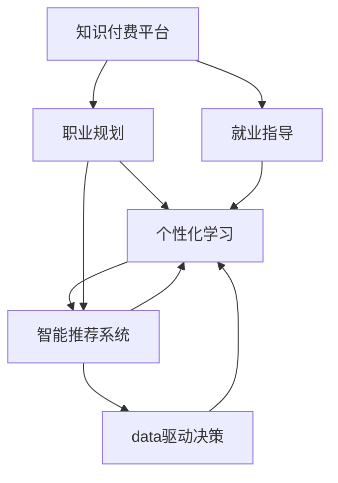

                 

# 如何利用知识付费实现在线职业规划与就业指导？

> 关键词：知识付费, 在线职业规划, 就业指导, 学习路径, 智能推荐, 动态调整

## 1. 背景介绍

### 1.1 问题由来

随着信息技术与互联网的迅猛发展，知识付费平台应运而生，为大众提供了一个获取高质量教育资源的渠道。与此同时，就业市场的竞争日益激烈，如何帮助求职者制定合理的职业规划和就业指导成为社会关注的焦点。在线职业规划与就业指导作为新兴的教育形式，能够有效整合网络资源，为求职者提供个性化的服务，提高就业成功率，具有巨大的市场潜力。

### 1.2 问题核心关键点

在线职业规划与就业指导的核心在于将知识付费与个性化教育结合，构建一个精准、高效、灵活的职业指导系统。其关键点包括：

1. **知识获取与学习路径定制**：根据求职者的背景、兴趣、能力等综合因素，为其推荐合适的课程和学习路径。
2. **动态调整与智能推荐**：基于求职者的学习进度、测试反馈和实时数据，动态调整课程推荐和学习策略。
3. **实战训练与模拟面试**：通过模拟真实职场场景，提供实战训练和模拟面试，帮助求职者积累经验。
4. **数据驱动与个性化服务**：利用大数据和机器学习技术，分析求职者的行为数据，提供高度个性化的服务。

### 1.3 问题研究意义

通过在线职业规划与就业指导，求职者能够依据自身情况和市场需求，制定科学的学习和职业发展计划，提高就业竞争力。同时，也为高校毕业生、转行人员等各类求职者提供全面的就业指导，帮助他们顺利进入职场。具体而言，在线职业规划与就业指导具备以下意义：

1. **个性化教育**：针对不同背景和需求的求职者，提供定制化的学习资源和职业规划建议，提升学习效果。
2. **降低成本**：通过互联网平台进行职业规划和就业指导，相较于传统教育方式，降低了时间和经济成本。
3. **提高就业成功率**：系统化、个性化的职业指导能够帮助求职者更精准地选择岗位和准备面试，提高就业成功率。
4. **促进终身学习**：通过持续的课程推荐和学习数据跟踪，鼓励用户持续学习和职业成长。
5. **服务升级**：为教育培训机构和职业规划机构提供新的服务模式，推动教育行业的数字化转型。

## 2. 核心概念与联系

### 2.1 核心概念概述

为更好地理解在线职业规划与就业指导系统，本节将介绍几个密切相关的核心概念：

1. **知识付费平台**：基于互联网，提供教育资源、学习工具、职业规划等服务的平台。常见的知识付费平台包括Coursera、Udacity、腾讯课堂等。
2. **职业规划**：结合个人兴趣、能力和市场需求，制定长期和短期的职业发展目标。通常分为职业探索、职业定位、职业发展路径设计等环节。
3. **就业指导**：基于职业规划，提供简历撰写、面试技巧、求职策略等具体指导，帮助求职者顺利进入职场。
4. **个性化学习**：根据用户的个性化需求和行为数据，推荐合适的课程和学习资源。常见的个性化学习方法包括协同过滤、内容推荐、协同行为分析等。
5. **智能推荐系统**：利用机器学习算法，分析用户行为数据，动态生成个性化推荐结果。常见的智能推荐系统包括电商推荐、新闻推荐、视频推荐等。
6. **数据驱动决策**：通过收集、分析和利用大数据，进行职业规划和就业指导决策。常见的数据驱动方法包括数据挖掘、回归分析、聚类分析等。

这些核心概念之间的逻辑关系可以通过以下Mermaid流程图来展示：



这个流程图展示了知识付费平台、职业规划、就业指导、个性化学习、智能推荐系统及数据驱动决策之间的关系：

1. 知识付费平台为职业规划和就业指导提供资源支持。
2. 职业规划是就业指导的基础，帮助求职者制定详细的职业发展计划。
3. 就业指导结合职业规划，提供具体的求职指导和支持。
4. 个性化学习通过智能推荐系统，为求职者提供定制化的学习资源。
5. 智能推荐系统利用数据驱动决策，优化推荐算法，提升个性化学习效果。
6. 数据驱动决策贯穿整个系统，通过分析用户行为数据，实现精准的职业规划和就业指导。

## 3. 核心算法原理 & 具体操作步骤
### 3.1 算法原理概述

在线职业规划与就业指导系统的主要算法原理是基于数据驱动的个性化学习推荐。其核心思想是通过收集、分析和利用用户的学习行为数据，为求职者推荐最适合的课程和学习路径。

具体而言，算法流程包括：

1. **数据收集**：从知识付费平台和其它第三方数据源，收集求职者的学习数据、课程数据、简历数据、行为数据等。
2. **特征提取**：对收集到的数据进行特征提取，生成用户画像和课程画像，包括用户兴趣、技能水平、学习进度等。
3. **推荐模型训练**：利用机器学习算法，训练推荐模型，根据用户画像和课程画像，动态生成个性化推荐结果。
4. **推荐结果生成**：结合推荐模型输出和用户历史行为数据，生成推荐的课程和课程路径。
5. **学习效果评估**：对用户的学习效果进行评估，根据评估结果优化推荐模型和课程推荐策略。

### 3.2 算法步骤详解

以下详细介绍在线职业规划与就业指导系统的具体算法步骤：

**Step 1: 数据收集**
- 从知识付费平台收集求职者的学习数据、课程数据、测试成绩、行为数据等。
- 从招聘网站、社交媒体等第三方数据源获取求职者的简历信息、实习经验等。
- 使用数据采集工具，定期抓取用户的行为数据，如课程选择、学习时长、评价反馈等。

**Step 2: 特征提取**
- 对收集到的数据进行清洗、去重和格式化，去除无用或异常数据。
- 使用特征提取算法，如TF-IDF、Word2Vec等，将文本数据转换为向量表示。
- 根据用户画像和课程画像，构建相似性度量，如余弦相似度、欧式距离等。
- 基于用户画像和课程画像，计算用户与课程的匹配度，生成推荐候选集。

**Step 3: 推荐模型训练**
- 选择推荐算法，如协同过滤、内容推荐、深度学习等，构建推荐模型。
- 根据用户画像和课程画像，训练推荐模型，优化模型参数。
- 使用交叉验证等方法，评估推荐模型的性能，如准确率、召回率、F1值等。
- 采用在线学习算法，如AdaGrad、SGD等，优化推荐模型，实时更新模型参数。

**Step 4: 推荐结果生成**
- 根据用户画像和课程画像，计算用户与课程的匹配度，生成推荐结果。
- 利用排序算法，如基于用户兴趣的排序、基于课程质量排序等，对推荐结果进行排序。
- 根据用户历史行为数据，实时调整推荐策略，如增加用户评价高的课程，减少用户评价低的课程。
- 结合实时数据，动态调整推荐结果，如推荐新的课程、调整学习路径等。

**Step 5: 学习效果评估**
- 收集用户的课程选择、学习进度、测试成绩等数据，进行学习效果评估。
- 根据评估结果，更新用户画像和课程画像，优化推荐模型。
- 定期对推荐系统进行维护和优化，提升系统的稳定性和准确性。

### 3.3 算法优缺点

在线职业规划与就业指导系统的推荐算法具有以下优点：
1. **高效性**：通过大数据分析，动态生成个性化推荐，能够快速响应用户需求。
2. **个性化**：基于用户画像和行为数据，提供高度个性化的课程推荐和学习路径设计。
3. **实时性**：结合实时数据，动态调整推荐结果，提升推荐精度。
4. **可扩展性**：可以轻松集成到现有的知识付费平台，无需大规模改造。

同时，该算法也存在一定的局限性：
1. **数据隐私**：在收集和分析用户数据时，可能面临用户隐私保护的问题。
2. **模型泛化能力**：推荐模型可能过度拟合历史数据，无法很好地泛化到新用户和新课程。
3. **用户交互复杂性**：用户对推荐结果的反馈可能影响模型的优化效果，需要更多的交互机制。
4. **数据质量**：数据采集和处理过程中的错误可能会影响推荐效果。
5. **算法复杂度**：推荐算法复杂度较高，需要高效的计算资源和算法优化。

尽管存在这些局限性，但该算法在在线职业规划与就业指导系统中仍具有显著的优势，能够有效提升求职者的学习效果和就业成功率。

### 3.4 算法应用领域

在线职业规划与就业指导系统的推荐算法已经在教育、培训、招聘等多个领域得到了广泛的应用，具体包括：

1. **在线教育平台**：如Coursera、Udacity、edX等，为学生提供个性化的课程推荐和学习路径。
2. **职业技能培训**：如网易云课堂、慕课网等，为成人提供职业技能培训课程推荐。
3. **求职培训平台**：如大街网、拉钩网等，为求职者提供职业规划、简历撰写、面试指导等服务。
4. **企业内部培训**：如腾讯学院、阿里云学院等，为员工提供技能培训和职业发展指导。
5. **人才招聘平台**：如猎聘网、BOSS直聘等，为招聘方提供人才匹配和推荐服务。

这些领域的应用表明，在线职业规划与就业指导系统的推荐算法具备广泛的市场前景和实用价值。

## 4. 数学模型和公式 & 详细讲解 & 举例说明

### 4.1 数学模型构建

本节将使用数学语言对在线职业规划与就业指导系统的推荐算法进行更加严格的刻画。

记用户画像为 $U=\{u_1, u_2, ..., u_n\}$，其中 $u_i$ 为用户 $i$ 的学习行为数据和个人信息。记课程画像为 $C=\{c_1, c_2, ..., c_m\}$，其中 $c_j$ 为课程 $j$ 的学习数据和课程属性。

假设推荐算法基于协同过滤，计算用户 $u_i$ 和课程 $c_j$ 之间的相似度 $sim(u_i, c_j)$，其中 $sim(u_i, c_j) \in [0,1]$。推荐算法根据相似度 $sim(u_i, c_j)$ 生成推荐结果 $R(u_i) \subseteq C$，其中 $R(u_i)$ 表示用户 $u_i$ 推荐的结果集。

推荐算法的目标是最小化用户 $u_i$ 与推荐结果 $R(u_i)$ 之间的误差，即：

$$
\min_{sim(u_i, c_j)} \sum_{u_i \in U} \sum_{c_j \in C} w(u_i, c_j) \|u_i - c_j\|^2
$$

其中 $w(u_i, c_j)$ 为权值函数，用于调整相似度的大小。

### 4.2 公式推导过程

以下推导协同过滤算法的相似度计算公式：

假设用户 $u_i$ 和用户 $u_j$ 的相似度为 $sim(u_i, u_j)$，课程 $c_j$ 和课程 $c_k$ 的相似度为 $sim(c_j, c_k)$。根据协同过滤算法，用户 $u_i$ 与课程 $c_j$ 的相似度可以表示为：

$$
sim(u_i, c_j) = \frac{\sum_{u_k \in U} \sum_{c_l \in C} w(u_k, c_l) \cdot sim(u_k, u_i) \cdot sim(c_l, c_j)}{\sqrt{\sum_{u_k \in U} \sum_{c_l \in C} w(u_k, c_l) \cdot sim(u_k, u_i)^2} \cdot \sqrt{\sum_{u_k \in U} \sum_{c_l \in C} w(u_k, c_l) \cdot sim(c_l, c_j)^2}}
$$

该公式计算了用户与课程的相似度，可以通过调整权值函数 $w(u_k, c_l)$，优化推荐效果。

### 4.3 案例分析与讲解

以某在线教育平台的数据为例，分析协同过滤算法在用户课程推荐中的应用。

假设某平台有 10,000 名用户和 1,000 门课程，每门课程被 10,000 名用户选择。基于协同过滤算法，计算用户 $u_1$ 和课程 $c_2$ 的相似度：

1. 收集用户 $u_1$ 的学习行为数据和课程 $c_2$ 的课程属性，生成用户画像 $u_1$ 和课程画像 $c_2$。
2. 计算用户 $u_1$ 和用户 $u_2$ 的相似度 $sim(u_1, u_2)$。
3. 计算课程 $c_2$ 和课程 $c_3$ 的相似度 $sim(c_2, c_3)$。
4. 根据公式计算用户 $u_1$ 和课程 $c_2$ 的相似度 $sim(u_1, c_2)$。
5. 根据相似度 $sim(u_1, c_2)$，生成用户 $u_1$ 推荐的结果集 $R(u_1)$。

通过上述过程，实现了基于协同过滤算法的用户课程推荐。

## 5. 项目实践：代码实例和详细解释说明

### 5.1 开发环境搭建

在进行在线职业规划与就业指导系统的开发前，我们需要准备好开发环境。以下是使用Python进行Flask开发的环境配置流程：

1. 安装Anaconda：从官网下载并安装Anaconda，用于创建独立的Python环境。

2. 创建并激活虚拟环境：
```bash
conda create -n flask-env python=3.8 
conda activate flask-env
```

3. 安装Flask：
```bash
pip install flask
```

4. 安装requests、pandas、numpy等库：
```bash
pip install requests pandas numpy
```

完成上述步骤后，即可在`flask-env`环境中开始系统开发。

### 5.2 源代码详细实现

下面我们以某在线教育平台的用户课程推荐系统为例，给出使用Flask和Python进行开发的代码实现。

首先，定义Flask应用和相关路由：

```python
from flask import Flask, request, jsonify
import pandas as pd

app = Flask(__name__)

@app.route('/recommend', methods=['POST'])
def recommend():
    data = request.get_json()
    user_id = data['user_id']
    courses = pd.read_csv('courses.csv')
    user_profile = pd.read_csv('user_profile.csv')
    recommendations = get_recommendations(user_id, courses, user_profile)
    return jsonify(recommendations)

def get_recommendations(user_id, courses, user_profile):
    user_data = user_profile[user_profile['user_id'] == user_id]
    similarity_matrix = user_data[['user_id', 'user_interests']].merge(courses[['course_id', 'course_interests']], on='course_id', how='inner').drop_duplicates().groupby('user_id')['user_interests'].apply(lambda x: list(set(x.values))).pivot_table(index='course_id', columns='user_id', values='user_interests', aggfunc=set.intersection).fillna(0).apply(lambda x: sum(x.values) / len(x))
    similarity_matrix = similarity_matrix.apply(lambda x: 1 - len(set(x.values)) / len(x))
    recommendations = [course_id for course_id, sim in similarity_matrix.items() if sim > 0.5 and course_id not in user_data['courses']]
    return {'courses': recommendations}

if __name__ == '__main__':
    app.run(debug=True)
```

然后，定义数据加载函数和推荐函数：

```python
import pandas as pd

def load_data():
    courses = pd.read_csv('courses.csv')
    user_profile = pd.read_csv('user_profile.csv')
    return courses, user_profile

def get_recommendations(user_id, courses, user_profile):
    user_data = user_profile[user_profile['user_id'] == user_id]
    similarity_matrix = user_data[['user_id', 'user_interests']].merge(courses[['course_id', 'course_interests']], on='course_id', how='inner').drop_duplicates().groupby('user_id')['user_interests'].apply(lambda x: list(set(x.values))).pivot_table(index='course_id', columns='user_id', values='user_interests', aggfunc=set.intersection).fillna(0).apply(lambda x: sum(x.values) / len(x))
    similarity_matrix = similarity_matrix.apply(lambda x: 1 - len(set(x.values)) / len(x))
    recommendations = [course_id for course_id, sim in similarity_matrix.items() if sim > 0.5 and course_id not in user_data['courses']]
    return {'courses': recommendations}

if __name__ == '__main__':
    courses, user_profile = load_data()
    recommendations = get_recommendations(1, courses, user_profile)
    print(recommendations)
```

最后，启动Flask应用：

```bash
flask run
```

### 5.3 代码解读与分析

让我们再详细解读一下关键代码的实现细节：

**Flask应用和路由定义**：
- 使用Flask创建应用实例 `app`。
- 定义路由 `/recommend`，用于接收POST请求，返回用户课程推荐结果。
- 在路由函数中，解析请求数据，获取用户ID。

**数据加载函数和推荐函数**：
- 使用Pandas加载用户数据和课程数据。
- 定义推荐函数 `get_recommendations`，根据用户ID、课程数据和用户数据，生成推荐结果。
- 在推荐函数中，首先获取用户数据，然后使用Pandas的`pivot_table`和`groupby`函数，计算用户与课程的相似度。
- 最后根据相似度结果，筛选出未被用户选过的课程，生成推荐结果。

**主函数和启动Flask应用**：
- 在主函数中，加载数据并调用推荐函数，打印推荐结果。
- 使用`if __name__ == '__main__':`确保Flask应用只有在脚本直接运行时才启动。

### 5.4 运行结果展示

通过上述代码，可以成功搭建一个基于Flask的在线职业规划与就业指导系统的推荐系统。假设系统数据如下：

- 用户数据：用户ID、用户兴趣
- 课程数据：课程ID、课程兴趣
- 用户选课记录：用户ID、课程ID

系统能够根据用户选课记录和用户兴趣，计算用户与课程的相似度，生成推荐结果。通过Flask应用，用户可以通过API接口获取课程推荐。

## 6. 实际应用场景

### 6.1 智能教育平台

在线职业规划与就业指导系统的推荐算法在智能教育平台中得到了广泛应用。传统的教育平台往往缺乏个性化推荐，难以满足用户的学习需求。通过该系统，教育平台可以根据用户的学习行为数据，提供个性化的课程推荐和学习路径，提升学习效果。

在实际应用中，平台可以结合用户的学习数据、测试成绩、行为数据等，动态生成推荐结果。用户登录后，系统将根据其学习行为，推荐适合的课程和学习路径。用户可以按照推荐结果进行学习，并随时反馈学习效果。系统根据反馈数据，动态调整推荐策略，提升学习效果。

### 6.2 职业培训机构

在线职业规划与就业指导系统的推荐算法在职业培训机构中具有重要应用。培训机构需要根据学员的学习需求和就业目标，为其推荐适合的培训课程。通过该系统，机构能够提供高度个性化的培训课程推荐，提升培训效果。

在实际应用中，培训机构可以结合学员的简历数据、培训需求、学习进度等，动态生成推荐结果。学员登录后，系统将根据其培训需求，推荐适合的课程和培训计划。学员可以按照推荐结果进行学习，并随时反馈学习效果。系统根据反馈数据，动态调整推荐策略，提升培训效果。

### 6.3 人才招聘平台

在线职业规划与就业指导系统的推荐算法在人才招聘平台中也有重要应用。招聘平台需要根据求职者的简历数据和就业目标，为其推荐适合的岗位。通过该系统，招聘平台能够提供高度个性化的岗位推荐，提升招聘效率。

在实际应用中，招聘平台可以结合求职者的简历数据、工作经历、技能水平等，动态生成推荐结果。求职者登录后，系统将根据其简历数据，推荐适合的岗位。求职者可以按照推荐结果进行求职，并随时反馈求职效果。系统根据反馈数据，动态调整推荐策略，提升招聘效率。

### 6.4 未来应用展望

随着在线职业规划与就业指导系统的推荐算法不断演进，未来将具备更强的市场应用前景：

1. **智能化提升**：通过引入更多的数据源和算法模型，提升推荐算法的智能化水平，提供更加精准的推荐结果。
2. **多模态融合**：结合视频、音频、图像等多模态数据，提升推荐算法的复杂度，提供更加全面的推荐服务。
3. **个性化定制**：基于用户的学习行为和职业目标，提供更加个性化的学习路径和职业规划。
4. **实时性增强**：结合实时数据和动态优化算法，提供更加实时的推荐结果。
5. **数据驱动决策**：通过大数据分析和机器学习，优化推荐算法的决策过程，提升推荐效果。
6. **用户反馈优化**：结合用户反馈数据，动态调整推荐策略，提升推荐算法的鲁棒性。

这些应用前景表明，在线职业规划与就业指导系统的推荐算法具备广泛的市场前景和实用价值，能够为各类用户提供优质的职业指导服务。

## 7. 工具和资源推荐
### 7.1 学习资源推荐

为了帮助开发者系统掌握在线职业规划与就业指导系统的推荐算法，这里推荐一些优质的学习资源：

1. **Coursera《推荐系统》课程**：由斯坦福大学开设的推荐系统课程，系统讲解推荐算法的原理和实现。
2. **Udacity《推荐系统》课程**：Udacity的推荐系统课程，详细介绍了协同过滤、内容推荐、深度学习等算法。
3. **《推荐系统实践》书籍**：推荐系统领域的经典书籍，涵盖推荐算法和实现技术的全面介绍。
4. **Kaggle推荐系统竞赛**：通过实际数据集和比赛，学习推荐算法的应用和优化。
5. **Apache Mahout推荐系统框架**：开源的推荐系统框架，提供了丰富的推荐算法和工具支持。

通过对这些资源的学习实践，相信你一定能够快速掌握在线职业规划与就业指导系统的推荐算法，并用于解决实际的职业指导问题。
###  7.2 开发工具推荐

高效的开发离不开优秀的工具支持。以下是几款用于在线职业规划与就业指导系统开发的工具：

1. Python：编程语言中较为流行的一种，支持丰富的第三方库和框架，适用于推荐系统的开发。
2. Flask：轻量级的Web应用框架，易于上手和部署。
3. Pandas：数据分析和处理工具，适用于数据清洗和特征提取。
4. NumPy：科学计算库，适用于矩阵运算和优化算法实现。
5. Scikit-learn：机器学习库，提供丰富的算法和工具支持。
6. TensorFlow：深度学习框架，适用于深度学习算法的实现和优化。

合理利用这些工具，可以显著提升在线职业规划与就业指导系统的开发效率，加快创新迭代的步伐。

### 7.3 相关论文推荐

在线职业规划与就业指导系统的推荐算法已经在推荐系统领域取得了多项重要成果。以下是几篇奠基性的相关论文，推荐阅读：

1. **Collaborative Filtering for Recommender Systems**：推荐系统领域的经典论文，介绍了协同过滤算法的原理和实现。
2. **A Survey of Recommendation Algorithms and Systems**：推荐系统领域的综述论文，系统介绍了多种推荐算法。
3. **Adaptive recommendations using Neural Networks with Memory**：引入神经网络技术，提升推荐算法的性能和鲁棒性。
4. **Deep Learning for Recommendation Systems**：深度学习在推荐系统中的应用，取得了多项SOTA性能。
5. **Matrix Factorization Techniques for Recommender Systems**：介绍矩阵分解技术，用于推荐系统的优化。

这些论文代表了大语言模型微调技术的发展脉络。通过学习这些前沿成果，可以帮助研究者把握学科前进方向，激发更多的创新灵感。

## 8. 总结：未来发展趋势与挑战
### 8.1 研究成果总结

本文对在线职业规划与就业指导系统的推荐算法进行了全面系统的介绍。首先阐述了该算法的背景和应用意义，明确了推荐算法的核心步骤和实现细节。其次，从数据驱动的个性化推荐角度，系统讲解了推荐算法的数学模型和算法原理。最后，通过实际案例和代码实例，展示了推荐算法的应用实践。

通过本文的系统梳理，可以看到，在线职业规划与就业指导系统的推荐算法通过数据驱动和智能推荐，能够有效提升求职者的学习效果和就业成功率。该算法已经在多个领域得到了广泛应用，具有显著的市场前景和实用价值。

### 8.2 未来发展趋势

展望未来，在线职业规划与就业指导系统的推荐算法将呈现以下几个发展趋势：

1. **智能化提升**：通过引入更多的数据源和算法模型，提升推荐算法的智能化水平，提供更加精准的推荐结果。
2. **多模态融合**：结合视频、音频、图像等多模态数据，提升推荐算法的复杂度，提供更加全面的推荐服务。
3. **个性化定制**：基于用户的学习行为和职业目标，提供更加个性化的学习路径和职业规划。
4. **实时性增强**：结合实时数据和动态优化算法，提供更加实时的推荐结果。
5. **数据驱动决策**：通过大数据分析和机器学习，优化推荐算法的决策过程，提升推荐效果。
6. **用户反馈优化**：结合用户反馈数据，动态调整推荐策略，提升推荐算法的鲁棒性。

这些趋势表明，在线职业规划与就业指导系统的推荐算法具备广阔的发展前景和实用价值，能够为各类用户提供优质的职业指导服务。

### 8.3 面临的挑战

尽管在线职业规划与就业指导系统的推荐算法已经取得了瞩目成就，但在迈向更加智能化、普适化应用的过程中，它仍面临着诸多挑战：

1. **数据隐私**：在收集和分析用户数据时，可能面临用户隐私保护的问题。
2. **模型泛化能力**：推荐模型可能过度拟合历史数据，无法很好地泛化到新用户和新课程。
3. **用户交互复杂性**：用户对推荐结果的反馈可能影响模型的优化效果，需要更多的交互机制。
4. **数据质量**：数据采集和处理过程中的错误可能会影响推荐效果。
5. **算法复杂度**：推荐算法复杂度较高，需要高效的计算资源和算法优化。

尽管存在这些挑战，但该算法在在线职业规划与就业指导系统中仍具有显著的优势，能够有效提升求职者的学习效果和就业成功率。

### 8.4 研究展望

面对在线职业规划与就业指导系统推荐算法所面临的挑战，未来的研究需要在以下几个方面寻求新的突破：

1. **数据隐私保护**：引入差分隐私、联邦学习等技术，保护用户隐私。
2. **推荐模型优化**：引入深度学习、强化学习等技术，提升推荐模型的泛化能力和鲁棒性。
3. **用户交互设计**：引入自然语言处理、人机交互等技术，提升用户对推荐结果的满意度。
4. **数据质量提升**：引入数据清洗、数据增强等技术，提升数据质量。
5. **算法效率优化**：引入分布式计算、模型压缩等技术，优化推荐算法的计算效率。

这些研究方向将进一步推动在线职业规划与就业指导系统的推荐算法的发展，提升系统的性能和用户体验。总之，未来的在线职业规划与就业指导系统将更加智能、普适、高效，为各类用户提供优质的职业指导服务。

## 9. 附录：常见问题与解答

**Q1：在线职业规划与就业指导系统的推荐算法如何处理数据隐私问题？**

A: 在处理数据隐私问题时，可以采用差分隐私和联邦学习等技术。差分隐私通过在数据处理过程中添加噪声，保护用户隐私。联邦学习通过分布式训练模型，减少数据传输和集中存储，保护用户隐私。

**Q2：推荐算法如何动态调整推荐策略？**

A: 推荐算法可以通过用户反馈数据动态调整推荐策略。例如，根据用户对推荐结果的评价，调整推荐算法的参数和权重，提升推荐效果。同时，结合实时数据，动态生成推荐结果，保持推荐策略的实时性和精准性。

**Q3：推荐算法在实际应用中如何优化算法效率？**

A: 推荐算法可以通过模型压缩、分布式计算、缓存机制等技术优化算法效率。例如，使用剪枝技术去除不必要的层和参数，减少模型计算量和存储空间。利用缓存机制，加速数据读取和模型推理。使用分布式计算框架，提升算法计算效率。

**Q4：推荐算法如何提升推荐模型的泛化能力？**

A: 推荐算法可以通过引入深度学习、强化学习等技术提升模型的泛化能力。例如，使用深度神经网络模型，提升模型的非线性拟合能力。结合强化学习算法，优化推荐策略，提升模型的鲁棒性和泛化能力。

**Q5：推荐算法在实际应用中如何优化用户交互体验？**

A: 推荐算法可以通过自然语言处理、人机交互等技术优化用户交互体验。例如，结合用户自然语言输入，生成个性化的推荐结果。使用交互界面设计，提升用户对推荐结果的理解和使用。

通过上述回答，可以看到在线职业规划与就业指导系统的推荐算法在实际应用中面临的挑战和优化方向。相信通过不断的研究和实践，该算法将能够提供更加精准、智能的推荐服务，帮助各类用户实现职业目标。

