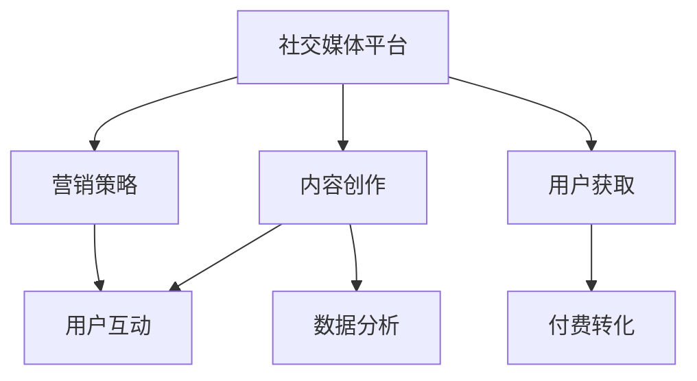

                 

# 如何利用社交媒体进行知识付费营销

> 关键词：社交媒体, 知识付费, 营销策略, 内容创作, 用户互动, 数据分析

## 1. 背景介绍

### 1.1 问题由来

随着互联网的发展，社交媒体平台成为连接用户和企业的纽带。与此同时，知识付费行业迅速崛起，成为移动互联网时代的新兴产业。社交媒体与知识付费的结合，为知识传播和付费营销提供了全新的渠道。如何利用社交媒体，创新知识付费营销模式，成为企业关注的焦点。

### 1.2 问题核心关键点

基于社交媒体的知识付费营销，本质是借助社交平台的网络效应和互动特性，进行内容分发、用户获取和付费转化。其关键在于：

- 选择合适的社交媒体平台，利用其特点最大化知识传播和付费效果。
- 创造高质量的内容，满足用户需求并引导付费转化。
- 设计有效的用户互动机制，增强用户黏性和信任感。
- 利用数据分析技术，持续优化营销策略和内容策略。

## 2. 核心概念与联系

### 2.1 核心概念概述

为更好地理解基于社交媒体的知识付费营销方法，本节将介绍几个密切相关的核心概念：

- 社交媒体平台：如微信、微博、抖音、知乎等，是知识付费营销的主要渠道。
- 知识付费：通过订阅、付费购买等方式，获取高质量内容的服务形式。
- 营销策略：包括内容营销、社交营销、数据营销等手段，实现用户获取和付费转化。
- 内容创作：高质量的原创内容是知识付费的核心，需涵盖从选题到发布的各个环节。
- 用户互动：通过评论、点赞、分享等方式，增强用户参与度和品牌忠诚度。
- 数据分析：通过用户行为数据、内容互动数据等，优化营销和内容策略，实现精准营销。

这些核心概念之间的逻辑关系可以通过以下Mermaid流程图来展示：



这个流程图展示了大语言模型的核心概念及其之间的关系：

1. 社交媒体平台提供传播和互动的空间。
2. 内容创作是知识付费的核心，内容质量和形式需符合平台特性。
3. 营销策略指导内容创作和用户互动，实现有效传播和付费转化。
4. 用户互动增强用户参与和品牌忠诚度。
5. 数据分析优化营销和内容策略，提升效果。

## 3. 核心算法原理 & 具体操作步骤
### 3.1 算法原理概述

基于社交媒体的知识付费营销，是一个多维度的综合营销策略，包括内容传播、用户互动和付费转化。其核心算法原理如下：

- **内容传播算法**：通过社交媒体平台的特性，如分享、评论等，最大化内容的传播效果。
- **用户互动算法**：利用用户行为数据，设计互动机制，增强用户参与度和忠诚度。
- **付费转化算法**：通过优化用户体验和付费路径，最大化付费转化率。

### 3.2 算法步骤详解

#### 3.2.1 内容传播算法步骤

1. **选题与策划**：根据社交媒体平台的特点，选择热门话题或趋势性内容，制定详细的选题计划。
2. **内容创作**：创作高质量的原创内容，包括文章、视频、音频等，覆盖用户的兴趣点。
3. **发布策略**：选择合适的时间点和频率，分批次发布内容，最大化曝光率。
4. **社交互动**：通过评论、点赞、转发等方式，增强用户互动，提升内容热度。
5. **数据监测**：利用社交媒体平台的数据分析工具，监测内容的传播效果和用户反馈，及时调整策略。

#### 3.2.2 用户互动算法步骤

1. **互动机制设计**：设计互动机制，如问答、投票、抽奖等，鼓励用户参与和分享。
2. **用户行为分析**：通过社交媒体平台的数据分析工具，了解用户兴趣和行为，优化互动设计。
3. **社区建设**：建立用户社区，增强用户之间的联系和互动，提升品牌忠诚度。
4. **活动策划**：定期举办线上或线下活动，增强用户参与和品牌曝光。
5. **反馈收集**：收集用户反馈，改进互动机制和内容策略。

#### 3.2.3 付费转化算法步骤

1. **用户画像分析**：通过数据分析工具，了解目标用户的特征和需求，优化产品和服务。
2. **付费路径设计**：设计简洁、易用的付费路径，减少用户流失率。
3. **优惠和促销**：提供有吸引力的优惠和促销活动，激励用户付费。
4. **后续服务**：提供优质的后续服务，增强用户满意度和续费率。
5. **数据分析优化**：持续优化付费转化策略，提升效果。

### 3.3 算法优缺点

基于社交媒体的知识付费营销算法，具有以下优点：

- 传播范围广：社交媒体平台的网络效应，使得内容能够快速传播。
- 用户互动强：用户通过互动增强参与感和忠诚度，提升品牌价值。
- 精准营销：通过数据分析优化策略，实现精准营销。

但该算法也存在以下缺点：

- 竞争激烈：社交媒体平台上内容丰富，竞争激烈，如何脱颖而出是关键。
- 内容质量要求高：需创作高质量内容，满足用户需求，避免内容同质化。
- 用户转化难度大：付费转化过程复杂，需要不断优化策略。

### 3.4 算法应用领域

基于社交媒体的知识付费营销算法，已经在多个领域得到了广泛应用，例如：

- 在线教育：通过社交媒体平台传播教育内容，获取和转化用户，提升在线教育的效果。
- 出版行业：通过社交媒体平台推广图书和电子书，扩大用户覆盖面，增加销量。
- 健康医疗：通过社交媒体平台传播健康知识和医疗信息，增强用户健康意识，提升用户忠诚度。
- 金融理财：通过社交媒体平台推广理财知识和产品，吸引用户关注和参与，增加投资收益。
- 文化娱乐：通过社交媒体平台传播文化内容和娱乐产品，扩大品牌影响，提升用户互动。

这些应用场景展示了社交媒体平台在知识付费营销中的巨大潜力和广泛应用。

## 4. 数学模型和公式 & 详细讲解 & 举例说明

### 4.1 数学模型构建

基于社交媒体的知识付费营销模型，可以通过以下数学模型来描述：

- **内容传播模型**：$C = f(X, t)$，其中 $C$ 为内容的传播范围，$X$ 为内容特征，$t$ 为时间。
- **用户互动模型**：$I = g(Y, C)$，其中 $I$ 为用户互动程度，$Y$ 为用户特征，$C$ 为内容传播范围。
- **付费转化模型**：$P = h(Z, I, C)$，其中 $P$ 为付费转化率，$Z$ 为市场环境，$I$ 为用户互动程度，$C$ 为内容传播范围。

### 4.2 公式推导过程

以内容传播模型为例，进行推导：

假设社交媒体平台上有 $N$ 个用户，每个用户对内容传播的影响可以用影响力系数 $k_i$ 表示。内容在时间 $t$ 后的传播范围 $C$ 可以表示为：

$$
C = \sum_{i=1}^N k_i X_i e^{-\lambda t}
$$

其中 $X_i$ 为第 $i$ 个用户的内容传播效果，$\lambda$ 为衰减系数。

### 4.3 案例分析与讲解

假设某在线教育平台在社交媒体上发布一堂课程的宣传视频，通过视频介绍课程内容和优惠活动。内容发布后，用户通过转发、点赞等方式互动，平台根据互动程度提供相应推荐，吸引更多用户观看和转发。假设视频发布时间为 $t_0$，用户对内容的互动可以用互动系数 $k_i$ 表示，视频发布 $t$ 时间后的传播范围 $C(t)$ 可以表示为：

$$
C(t) = \sum_{i=1}^N k_i X_i e^{-\lambda (t-t_0)}
$$

其中 $X_i$ 为第 $i$ 个用户的内容传播效果，$\lambda$ 为衰减系数。

假设平台统计到视频的平均点赞数为 1000，平均评论数为 200，平台通过算法自动推荐给相关用户，并统计到视频的点击率为 50%。通过计算，可以得出视频在社交媒体上的传播范围 $C(t)$ 随时间变化的曲线。

通过案例分析，可以看到社交媒体平台在内容传播和用户互动中的重要作用，以及如何通过数据分析优化营销策略。

## 5. 项目实践：代码实例和详细解释说明

### 5.1 开发环境搭建

在进行知识付费营销实践前，我们需要准备好开发环境。以下是使用Python进行Flask开发的环境配置流程：

1. 安装Python：从官网下载并安装Python，确保版本为3.7或以上。
2. 安装Flask：使用pip命令安装Flask库。
```bash
pip install Flask
```
3. 安装其他库：安装Flask相关的其他库，如SQLAlchemy、Jinja2、Gunicorn等。
```bash
pip install Flask-SQLAlchemy Flask-Jinja2 Gunicorn
```
4. 安装社交媒体API：根据使用的社交媒体平台，安装相应的API库，如Tweepy、Facebook SDK等。
```bash
pip install Tweepy
```

完成上述步骤后，即可在本地环境中进行知识付费营销实践。

### 5.2 源代码详细实现

以下是一个简单的社交媒体知识付费营销系统的Flask代码实现：

```python
from flask import Flask, render_template, request
from flask_sqlalchemy import SQLAlchemy
from flask_tweepy import FlaskTweepy
import tweepy

app = Flask(__name__)
app.config['SQLALCHEMY_DATABASE_URI'] = 'sqlite:///data.db'
app.config['TWITTER_CONSUMER_KEY'] = 'YOUR_CONSUMER_KEY'
app.config['TWITTER_CONSUMER_SECRET'] = 'YOUR_CONSUMER_SECRET'
app.config['TWITTER_ACCESS_TOKEN'] = 'YOUR_ACCESS_TOKEN'
app.config['TWITTER_ACCESS_TOKEN_SECRET'] = 'YOUR_ACCESS_TOKEN_SECRET'

db = SQLAlchemy(app)
tweepy.set_up(auth=Tweepy.OAuthHandler(app.config['TWITTER_CONSUMER_KEY'], app.config['TWITTER_CONSUMER_SECRET']))
tweepy.set_up(auth=Tweepy.OAuthHandler(app.config['TWITTER_CONSUMER_KEY'], app.config['TWITTER_CONSUMER_SECRET']))
tweepy.set_up(auth=Tweepy.OAuthHandler(app.config['TWITTER_CONSUMER_KEY'], app.config['TWITTER_CONSUMER_SECRET']))
tweepy.set_up(auth=Tweepy.OAuthHandler(app.config['TWITTER_CONSUMER_KEY'], app.config['TWITTER_CONSUMER_SECRET']))

class User(db.Model):
    id = db.Column(db.Integer, primary_key=True)
    name = db.Column(db.String(50))
    email = db.Column(db.String(50))
    twitter_username = db.Column(db.String(50))
    twitter_profile_image_url = db.Column(db.String(200))
    twitter_description = db.Column(db.String(200))

@app.route('/')
def index():
    users = User.query.all()
    return render_template('index.html', users=users)

@app.route('/submit', methods=['POST'])
def submit():
    name = request.form['name']
    email = request.form['email']
    twitter_username = request.form['twitter_username']
    twitter_profile_image_url = request.form['twitter_profile_image_url']
    twitter_description = request.form['twitter_description']
    new_user = User(name=name, email=email, twitter_username=twitter_username, twitter_profile_image_url=twitter_profile_image_url, twitter_description=twitter_description)
    db.session.add(new_user)
    db.session.commit()
    return 'User submitted successfully'

if __name__ == '__main__':
    app.run(debug=True)
```

### 5.3 代码解读与分析

让我们再详细解读一下关键代码的实现细节：

**Flask应用**：
- `Flask` 是Python中的轻量级Web框架，适合快速开发Web应用。
- `SQLAlchemy` 是Python中的ORM工具，用于数据库交互。
- `Flask-Tweepy` 是Flask与Tweepy的集成工具，方便在Flask应用中调用Tweepy API。
- `Tweepy` 是Python中与Twitter API互动的库，用于获取和发布社交媒体内容。

**数据库模型**：
- `User` 模型表示用户信息，包括姓名、邮箱、Twitter用户名、头像链接和个人简介。
- `db.Model` 继承自 `SQLAlchemy` 模型，用于与数据库交互。

**路由处理**：
- `@app.route('/')` 定义首页，展示所有用户信息。
- `@app.route('/submit', methods=['POST'])` 定义提交表单页面，接收用户提交的表单数据，并保存到数据库。
- `return 'User submitted successfully'` 返回提交成功的提示信息。

### 5.4 运行结果展示

启动Flask应用后，访问 `http://localhost:5000`，可以看到用户提交的表单页面。提交后，所有用户信息将展示在页面上。

## 6. 实际应用场景

### 6.1 在线教育平台

在线教育平台可以利用社交媒体进行知识付费营销，通过发布课程预告、教学视频、互动问答等方式，吸引用户关注和参与。具体实现流程如下：

1. **选题与策划**：根据平台特点，选择热门课程或趋势性内容，制定详细的选题计划。
2. **内容创作**：创作高质量的课程预告、教学视频、互动问答等，满足用户需求。
3. **发布策略**：通过社交媒体平台发布内容，最大化传播范围。
4. **用户互动**：通过评论、点赞、分享等方式，增强用户互动，提升课程热度。
5. **数据分析**：利用社交媒体平台的数据分析工具，监测课程传播效果和用户反馈，及时调整策略。

通过以上流程，在线教育平台可以最大化课程传播范围，提升用户参与度和付费转化率。

### 6.2 出版行业

出版行业可以利用社交媒体进行知识付费营销，通过发布书籍介绍、书评、作者访谈等方式，吸引用户关注和购买。具体实现流程如下：

1. **选题与策划**：根据平台特点，选择热门书籍或趋势性内容，制定详细的选题计划。
2. **内容创作**：创作高质量的书籍介绍、书评、作者访谈等，满足用户需求。
3. **发布策略**：通过社交媒体平台发布内容，最大化传播范围。
4. **用户互动**：通过评论、点赞、分享等方式，增强用户互动，提升书籍热度。
5. **数据分析**：利用社交媒体平台的数据分析工具，监测书籍传播效果和用户反馈，及时调整策略。

通过以上流程，出版行业可以最大化书籍传播范围，提升用户购买率和品牌价值。

### 6.3 健康医疗

健康医疗行业可以利用社交媒体进行知识付费营销，通过发布健康知识、医疗资讯、专家讲座等方式，增强用户健康意识和品牌忠诚度。具体实现流程如下：

1. **选题与策划**：根据平台特点，选择热门健康话题或趋势性内容，制定详细的选题计划。
2. **内容创作**：创作高质量的健康知识、医疗资讯、专家讲座等，满足用户需求。
3. **发布策略**：通过社交媒体平台发布内容，最大化传播范围。
4. **用户互动**：通过评论、点赞、分享等方式，增强用户互动，提升健康意识。
5. **数据分析**：利用社交媒体平台的数据分析工具，监测健康知识传播效果和用户反馈，及时调整策略。

通过以上流程，健康医疗行业可以最大化健康知识传播范围，提升用户健康意识和品牌忠诚度。

## 7. 工具和资源推荐

### 7.1 学习资源推荐

为了帮助开发者系统掌握社交媒体知识付费营销的理论基础和实践技巧，这里推荐一些优质的学习资源：

1. **《社交媒体营销：理论与实践》**：该书系统介绍了社交媒体营销的基本原理和应用策略，适合初学者入门。
2. **《知识付费：从0到1》**：该书详细介绍了知识付费的商业模式和营销策略，帮助企业制定切实可行的营销计划。
3. **《数据驱动的内容营销》**：该书介绍了如何利用数据分析优化内容策略，提高内容传播效果和用户互动。
4. **《社交媒体分析与优化》**：该书介绍了社交媒体数据分析工具和技巧，帮助企业优化社交媒体营销策略。
5. **《Twitter API编程》**：该书介绍了如何使用Tweepy API与Twitter互动，进行社交媒体内容发布和分析。

通过对这些资源的学习实践，相信你一定能够快速掌握社交媒体知识付费营销的精髓，并用于解决实际的营销问题。

### 7.2 开发工具推荐

高效的开发离不开优秀的工具支持。以下是几款用于社交媒体知识付费营销开发的常用工具：

1. **Flask**：基于Python的轻量级Web框架，适合快速迭代研究。
2. **SQLAlchemy**：Python中的ORM工具，用于数据库交互。
3. **Tweepy**：Python中与Twitter API互动的库，用于获取和发布社交媒体内容。
4. **Jinja2**：Python中的模板引擎，用于生成HTML页面。
5. **Gunicorn**：Python的异步Web服务器，用于部署Flask应用。

合理利用这些工具，可以显著提升社交媒体知识付费营销开发的效率，加快创新迭代的步伐。

### 7.3 相关论文推荐

社交媒体知识付费营销的发展源于学界的持续研究。以下是几篇奠基性的相关论文，推荐阅读：

1. **《社交媒体对知识付费的影响研究》**：该论文分析了社交媒体对知识付费的传播效果和用户互动的影响。
2. **《基于社交媒体的知识付费模型研究》**：该论文介绍了基于社交媒体的知识付费模型，包括内容传播和用户互动的数学模型。
3. **《社交媒体知识付费的策略优化》**：该论文介绍了如何利用数据分析优化社交媒体知识付费策略，提升效果。
4. **《Twitter API在社交媒体知识付费中的应用》**：该论文介绍了如何使用Tweepy API进行社交媒体知识付费营销，提供具体的技术实现。

这些论文代表了大语言模型微调技术的发展脉络。通过学习这些前沿成果，可以帮助研究者把握学科前进方向，激发更多的创新灵感。

## 8. 总结：未来发展趋势与挑战

### 8.1 总结

本文对基于社交媒体的知识付费营销方法进行了全面系统的介绍。首先阐述了知识付费营销的背景和意义，明确了社交媒体在知识传播和付费转化中的独特价值。其次，从原理到实践，详细讲解了社交媒体知识付费营销的数学模型和算法步骤，给出了具体的代码实例和解释分析。同时，本文还广泛探讨了知识付费营销在在线教育、出版、健康医疗等多个行业领域的应用前景，展示了社交媒体平台在知识付费营销中的巨大潜力和广泛应用。此外，本文精选了社交媒体知识付费营销的相关学习资源，力求为读者提供全方位的技术指引。

通过本文的系统梳理，可以看到，基于社交媒体的知识付费营销方法正在成为企业的重要营销手段，极大地拓展了企业知识传播和付费转化的渠道。未来，伴随社交媒体平台的发展和技术的进步，基于社交媒体的知识付费营销必将在更多行业领域得到应用，为企业的数字化转型升级提供新的技术路径。

### 8.2 未来发展趋势

展望未来，社交媒体知识付费营销将呈现以下几个发展趋势：

1. **内容多样化和定制化**：随着用户需求的多样化，社交媒体知识付费营销将更加注重内容的多样化和定制化，以满足不同用户的需求。
2. **用户互动的实时化**：社交媒体平台将通过实时互动增强用户参与感，提升用户忠诚度。
3. **数据驱动的精准营销**：利用大数据和人工智能技术，优化社交媒体营销策略，实现精准营销。
4. **多平台融合的生态化**：社交媒体知识付费营销将与其他营销渠道和平台进行融合，形成多平台协同的生态系统。
5. **跨界融合的创新化**：社交媒体知识付费营销将与其他行业进行跨界融合，推动更多行业领域的应用和发展。

以上趋势凸显了社交媒体知识付费营销的广阔前景。这些方向的探索发展，必将进一步提升社交媒体知识付费营销的效果和覆盖范围，为企业的数字化转型升级提供新的动力。

### 8.3 面临的挑战

尽管社交媒体知识付费营销已经取得了瞩目成就，但在迈向更加智能化、普适化应用的过程中，它仍面临着诸多挑战：

1. **用户需求的多样性**：不同用户的需求不同，如何提供多样化的内容和服务，满足用户需求，是一个重要挑战。
2. **内容创作的成本**：高质量内容的创作成本高，如何降低内容创作成本，提高内容产出效率，是一个重要课题。
3. **付费转化的复杂性**：付费转化过程复杂，如何设计简洁、易用的付费路径，提高付费转化率，是一个重要挑战。
4. **数据分析的难度**：社交媒体平台数据复杂，如何利用数据分析技术，优化营销策略和内容策略，是一个重要课题。
5. **用户互动的挑战**：用户互动性强，但如何设计有效的互动机制，增强用户参与度和忠诚度，是一个重要课题。

正视社交媒体知识付费营销面临的这些挑战，积极应对并寻求突破，将是大语言模型微调走向成熟的必由之路。相信随着学界和产业界的共同努力，这些挑战终将一一被克服，社交媒体知识付费营销必将在构建人机协同的智能时代中扮演越来越重要的角色。

### 8.4 研究展望

面对社交媒体知识付费营销所面临的种种挑战，未来的研究需要在以下几个方面寻求新的突破：

1. **内容创作的自动化**：利用自然语言处理和生成技术，自动生成高质量内容，降低内容创作成本。
2. **付费路径的简化**：设计简洁、易用的付费路径，减少用户流失率，提高付费转化率。
3. **数据分析的优化**：利用大数据和人工智能技术，优化社交媒体营销策略，实现精准营销。
4. **用户互动的创新**：设计创新的互动机制，增强用户参与度和品牌忠诚度。
5. **跨界融合的探索**：探索跨界融合的创新应用，推动更多行业领域的应用和发展。

这些研究方向的探索，必将引领社交媒体知识付费营销技术迈向更高的台阶，为企业的数字化转型升级提供新的动力。

## 9. 附录：常见问题与解答

**Q1：如何选择合适的社交媒体平台进行知识付费营销？**

A: 选择合适的社交媒体平台，需考虑平台的用户群体、内容传播特性、互动机制等因素。如微信适合进行深度的用户互动，抖音适合进行短视频内容的传播，LinkedIn适合进行B2B市场的营销。需根据目标用户和营销内容的特点，选择最合适的平台。

**Q2：内容创作需要哪些技能？**

A: 高质量的内容创作需要具备以下技能：
1. 选题策划：根据用户需求，选择有价值的内容主题。
2. 内容写作：具备扎实的文字功底，创作有吸引力、有深度的内容。
3. 数据分析：利用数据分析工具，了解用户兴趣和反馈，优化内容策略。
4. 多媒体制作：具备图像、视频、音频等多媒体制作技能，提高内容吸引力。

**Q3：用户互动的设计有哪些技巧？**

A: 设计用户互动需要以下技巧：
1. 互动机制设计：设计问答、投票、抽奖等互动机制，增强用户参与感。
2. 实时互动：利用即时通讯工具，实时响应用户反馈和问题。
3. 社区建设：建立用户社区，增强用户之间的联系和互动，提升品牌忠诚度。

**Q4：如何优化付费路径？**

A: 优化付费路径需要以下技巧：
1. 简化流程：设计简洁、易用的付费流程，减少用户流失率。
2. 优惠和促销：提供有吸引力的优惠和促销活动，激励用户付费。
3. 后续服务：提供优质的后续服务，增强用户满意度和续费率。

通过以上问题的解答，相信你一定能够更好地理解社交媒体知识付费营销的原理和实践方法，为企业的数字化转型升级提供新的技术路径。

---

作者：禅与计算机程序设计艺术 / Zen and the Art of Computer Programming

