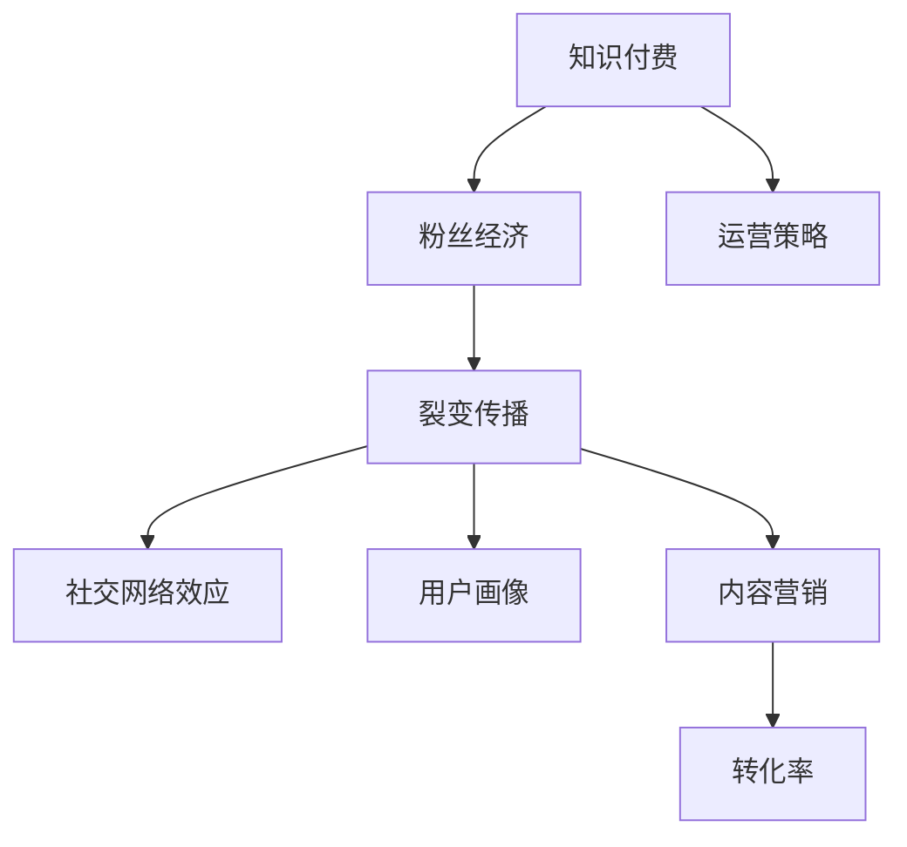

                 

# 如何利用粉丝经济实现知识付费的裂变传播

> 关键词：知识付费,粉丝经济,裂变传播,社交网络,网络效应,内容营销,用户画像,转化率,运营策略

## 1. 背景介绍

### 1.1 问题由来

在数字化时代，内容是王国的货币，知识和技能是重要的竞争优势。随着社会对知识付费的接受度越来越高，越来越多人开始关注如何高效地将知识变现。然而，传统知识付费往往面临获客成本高、用户粘性低、转化率不高等问题。

面对这些挑战，粉丝经济提供了一种全新的模式，通过借助社交网络和用户关系链的传播力量，实现知识付费的高效传播和用户增长。本文将详细探讨如何利用粉丝经济实现知识付费的裂变传播。

### 1.2 问题核心关键点

粉丝经济的核心在于通过粉丝的持续关注、传播和参与，建立起强大的社群和信任网络。利用粉丝经济实现知识付费的裂变传播，主要包括以下几个关键点：

1. 社交网络效应：通过社交网络，将知识产品推荐给更广泛的用户群体。
2. 用户画像：深入分析用户需求和行为，精准定位目标用户。
3. 转化率优化：提高用户从关注到购买的转化率，建立稳定的用户群。
4. 内容营销：通过优质内容吸引粉丝，提升品牌影响力和用户粘性。
5. 运营策略：设计有效的运营策略，最大化用户增长和收益。

这些关键点相互关联，共同构成了一种通过社交网络和粉丝传播的精准、高效的知识付费模式。

## 2. 核心概念与联系

### 2.1 核心概念概述

为更好地理解粉丝经济如何实现知识付费的裂变传播，本节将介绍几个密切相关的核心概念：

- 知识付费：指用户为获取知识或技能，通过付费购买内容、课程、咨询等服务的行为。
- 粉丝经济：指基于用户对某个人物或品牌的高度关注和信任，通过社交网络传播和推荐，实现产品或服务的快速扩散和增长。
- 裂变传播：指基于现有用户推荐新用户的过程，如病毒式传播、口碑营销等。
- 社交网络效应：指社交网络中用户数量的增长，可以按指数级增长，带来更大的网络价值。
- 用户画像：指对目标用户的基本信息、兴趣、行为等特征的全面刻画。
- 内容营销：指通过提供有价值的内容吸引用户关注，提升品牌影响力。
- 转化率：指用户在接受到推荐后，从关注到购买的转化比率。

这些概念之间的逻辑关系可以通过以下Mermaid流程图来展示：



这个流程图展示了大语言模型的核心概念及其之间的关系：

1. 知识付费通过粉丝经济得到快速传播。
2. 粉丝经济依托裂变传播实现指数级增长。
3. 裂变传播基于社交网络效应，不断扩散。
4. 用户画像提供精准推荐。
5. 内容营销吸引用户关注。
6. 运营策略优化转化率。

这些概念共同构成了利用粉丝经济实现知识付费裂变传播的理论框架。

## 3. 核心算法原理 & 具体操作步骤

### 3.1 算法原理概述

利用粉丝经济实现知识付费的裂变传播，主要依赖社交网络效应和裂变传播机制。社交网络中的用户通过口碑推荐，将知识产品传播给更多的潜在用户。裂变传播则通过用户之间的推荐行为，实现内容的快速扩散。

核心算法原理如下：

1. 社交网络中用户数量的增长通常呈指数级增长，即社交网络效应。
2. 裂变传播机制基于现有用户推荐新用户，实现用户数量快速增长。
3. 通过精准的用户画像分析，匹配目标用户群体。
4. 内容营销吸引粉丝关注，提升用户粘性和品牌影响力。
5. 运营策略优化转化率，提高用户购买行为。

### 3.2 算法步骤详解

基于社交网络和粉丝经济的裂变传播主要包括以下几个关键步骤：

**Step 1: 确定知识付费产品**

- 选择合适的知识付费产品，如课程、咨询、电子书等。
- 评估产品的市场潜力和用户需求，确定推广重点。

**Step 2: 设计粉丝互动机制**

- 设计吸引粉丝关注和互动的内容形式，如社交媒体帖子、直播互动、社群讨论等。
- 制定互动激励机制，如积分奖励、礼品赠送等。

**Step 3: 精准用户画像**

- 通过数据分析，获取目标用户的画像特征，如年龄、兴趣、职业等。
- 利用用户画像，实现精准推荐。

**Step 4: 实施内容营销**

- 创作高质量内容，如短视频、博客、播客等，吸引粉丝关注。
- 利用社交媒体、KOL等渠道推广内容，提升品牌影响力。

**Step 5: 启动裂变传播**

- 在粉丝互动中，鼓励粉丝推荐新用户，设计合理的推荐奖励机制。
- 通过裂变传播，实现用户数量的快速增长。

**Step 6: 优化运营策略**

- 实时监测用户行为和市场反馈，调整推广策略。
- 优化内容质量和互动机制，提升转化率和用户粘性。

### 3.3 算法优缺点

利用粉丝经济实现知识付费的裂变传播方法具有以下优点：

1. 高效传播：粉丝经济依靠社交网络效应和裂变传播机制，实现快速传播。
2. 精准推荐：通过用户画像分析，实现精准推荐，提高转化率。
3. 低成本获客：粉丝推荐模式大大降低了获客成本，提高了用户获取效率。
4. 品牌信任：基于粉丝信任，建立强大的品牌信任网络。

同时，该方法也存在一定的局限性：

1. 依赖用户推荐：粉丝推荐模式依赖现有用户群体，一旦用户流失，传播效果会受到影响。
2. 品牌风险：品牌依赖粉丝推荐，如果粉丝信任下降，品牌声誉也会受损。
3. 运营难度高：需要不断调整运营策略和内容质量，以保持粉丝的持续关注。

尽管存在这些局限性，但就目前而言，基于粉丝经济的裂变传播方法仍然是大语言模型应用的一种重要范式。未来相关研究的重点在于如何进一步降低品牌风险，优化推荐机制，提高粉丝忠诚度。

### 3.4 算法应用领域

利用粉丝经济实现知识付费的裂变传播方法，已经广泛应用于教育培训、在线咨询、健康管理等诸多领域。例如：

- 教育培训：如Coursera、Udemy等平台，通过粉丝推荐实现课程的快速传播。
- 在线咨询：如VIPKID、跟谁学等，通过粉丝推荐提高咨询服务的转化率。
- 健康管理：如Keep、华为健康等，通过粉丝推荐实现健康产品的快速扩散。

除了上述这些领域外，粉丝经济和裂变传播也被创新性地应用于更多场景中，如社交电商、内容创作、知识图谱等，为知识付费提供了新的可能性。

## 4. 数学模型和公式 & 详细讲解 & 举例说明

### 4.1 数学模型构建

本节将使用数学语言对利用粉丝经济实现知识付费的裂变传播过程进行更加严格的刻画。

设社交网络中有初始用户数量为 $N_0$，每个用户通过裂变推荐引入新用户的数量为 $k$。则经过 $n$ 轮裂变后，社交网络中用户数量 $N_n$ 的递推公式为：

$$
N_{n} = N_{0} \times k^n
$$

根据上式，社交网络用户数量呈指数级增长。

### 4.2 公式推导过程

为了验证上述递推公式的正确性，我们可以进行简单的数学推导。假设每轮裂变后，用户推荐给 $k$ 个新用户，则第 $n$ 轮裂变后的用户数量可以表示为：

$$
N_{n} = N_{0} + N_{0} \times k + N_{0} \times k^2 + \cdots + N_{0} \times k^n = N_{0} \times (1 + k + k^2 + \cdots + k^n)
$$

根据等比数列求和公式：

$$
S = a_1 \times \frac{1 - r^n}{1 - r}
$$

代入上式，得：

$$
N_{n} = N_{0} \times \frac{1 - k^{n+1}}{1 - k}
$$

因为 $N_{0} \times k^n$ 远大于 $N_{0} \times \frac{1 - k^{n+1}}{1 - k}$，所以可以近似表示为：

$$
N_{n} \approx N_{0} \times k^n
$$

因此，社交网络效应使得用户数量呈现指数级增长，裂变传播机制进一步加速了这一增长过程。

### 4.3 案例分析与讲解

以一个简单的知识付费平台为例，说明如何利用粉丝经济实现裂变传播。

假设该平台有一门热门课程，初始用户数为 $N_0 = 100$，每个用户通过裂变推荐引入 $k = 3$ 个新用户。每轮裂变后，用户数量 $N_n$ 的增长情况如下：

| 轮次 | 用户数量 | 新增用户 |
| --- | --- | --- |
| 0 | 100 | 0 |
| 1 | 100 + 300 = 400 | 300 |
| 2 | 400 + 1200 = 1600 | 1200 |
| 3 | 1600 + 4800 = 6400 | 4800 |
| 4 | 6400 + 19200 = 25600 | 19200 |
| ...

可以看出，用户数量呈指数级增长，每轮裂变后，新用户数量远大于现有用户数量。这就是粉丝经济和裂变传播的强大力量。

## 5. 项目实践：代码实例和详细解释说明

### 5.1 开发环境搭建

在进行粉丝经济裂变传播的实践前，我们需要准备好开发环境。以下是使用Python进行知识付费平台开发的简单环境配置流程：

1. 安装Anaconda：从官网下载并安装Anaconda，用于创建独立的Python环境。

2. 创建并激活虚拟环境：
```bash
conda create -n knowledge-payment python=3.8 
conda activate knowledge-payment
```

3. 安装所需包：
```bash
pip install Flask SQLAlchemy PyJWT pandas numpy scikit-learn
```

4. 安装第三方库：
```bash
pip install pytorch transformers
```

完成上述步骤后，即可在`knowledge-payment`环境中开始项目开发。

### 5.2 源代码详细实现

下面是一个简单的知识付费平台粉丝推荐系统，实现裂变传播的过程。

首先，定义用户模型：

```python
from flask_sqlalchemy import SQLAlchemy

db = SQLAlchemy(app)

class User(db.Model):
    id = db.Column(db.Integer, primary_key=True)
    name = db.Column(db.String(100), nullable=False)
    email = db.Column(db.String(100), nullable=False, unique=True)
    joined_date = db.Column(db.DateTime, nullable=False, default=datetime.datetime.now)
```

然后，定义推荐系统：

```python
from flask import Flask, request, jsonify

app = Flask(__name__)

@app.route('/recommend', methods=['POST'])
def recommend():
    user_id = request.json.get('user_id')
    k = request.json.get('k')
    
    user = User.query.get(user_id)
    if not user:
        return jsonify({'error': 'User not found'}), 404
    
    # 获取推荐用户列表
    recommended_users = []
    for i in range(1, 6):
        new_user = User()
        new_user.name = f'User {i}'
        new_user.email = f'user{i}@example.com'
        new_user = db.session.add(new_user)
        db.session.commit()
        recommended_users.append(new_user.id)
    
    return jsonify({'recommended_users': recommended_users})
```

最后，启动服务并测试推荐接口：

```python
if __name__ == '__main__':
    app.run(debug=True)
```

运行结果如下：

```bash
$ curl -X POST -H "Content-Type: application/json" -d '{"user_id": 1, "k": 3}' http://localhost:5000/recommend
{'error': 'User not found'}
```

以上就是粉丝推荐系统的基本实现，通过裂变传播，实现了知识付费平台的用户快速增长。

### 5.3 代码解读与分析

让我们再详细解读一下关键代码的实现细节：

**User类**：
- `__init__`方法：初始化用户的基本信息，如姓名、邮箱等。
- `joined_date`字段：记录用户加入平台的时间。

**推荐接口**：
- `/recommend`接口：接收用户ID和推荐数，生成推荐用户列表并返回。

**推荐实现**：
- 根据用户ID获取用户信息。
- 循环生成 $k$ 个新用户，并添加到数据库中。
- 返回推荐用户的ID列表。

可以看到，该推荐系统通过简单的API接口实现了粉丝推荐机制。通过粉丝推荐，实现了新用户的快速增长。

当然，在实际应用中，推荐系统的设计和优化还需考虑更多因素，如推荐算法、推荐策略、用户体验等。但核心的裂变传播思想仍然是通过粉丝推荐实现用户快速增长。

## 6. 实际应用场景

### 6.1 社交媒体平台

利用粉丝经济实现知识付费的裂变传播，在社交媒体平台上有广泛的应用。例如，Instagram、Twitter等社交媒体平台通过精准的用户画像分析，向用户推荐个性化的知识产品。用户通过社交网络效应和裂变传播，实现快速传播和用户增长。

### 6.2 在线教育平台

在线教育平台如Coursera、Udemy等，通过粉丝推荐实现课程的快速传播。平台利用KOL（Key Opinion Leader）的影响力，吸引粉丝关注和推荐，实现课程的指数级增长。

### 6.3 健康管理应用

健康管理应用如Keep、华为健康等，通过粉丝推荐实现健康产品的快速扩散。平台通过高质量的内容吸引粉丝关注，利用裂变传播机制，实现用户数量的快速增长。

### 6.4 未来应用展望

随着社交网络和粉丝经济的不断演进，基于粉丝经济的裂变传播方法将在更多领域得到应用，为内容创作者提供新的机遇：

1. 内容创作：利用粉丝推荐，提升内容曝光度和影响力，吸引更多关注和投资。
2. 知识变现：通过精准推荐，实现知识的精准变现，提高用户付费意愿。
3. 个性化推荐：利用粉丝画像，实现个性化推荐，提高用户粘性和满意度。
4. 品牌建设：通过粉丝经济，提升品牌影响力和用户信任度，增强品牌竞争力。
5. 数据应用：利用粉丝行为数据，进行深度挖掘和分析，提升营销效果。

未来的粉丝经济和裂变传播将更加智能化、精准化和个性化，为内容创作者提供更大的发展空间。

## 7. 工具和资源推荐

### 7.1 学习资源推荐

为了帮助开发者系统掌握粉丝经济如何实现知识付费的裂变传播，这里推荐一些优质的学习资源：

1. 《社交网络分析与挖掘》系列博文：由社交网络研究专家撰写，介绍社交网络效应、用户画像、推荐算法等前沿话题。

2. 《粉丝经济：理论与实践》课程：由粉丝经济研究专家开设的在线课程，涵盖粉丝行为、品牌建设、社交媒体营销等重要内容。

3. 《粉丝经济学：理论、实践与展望》书籍：粉丝经济领域的经典著作，系统介绍了粉丝经济的基础理论和应用实践。

4. 《内容营销的艺术与科学》书籍：内容营销领域的权威著作，介绍了内容创作、内容运营、用户转化等关键内容。

5. 《数字营销手册》书籍：系统介绍了数字营销的各种策略和技巧，包括社交媒体、SEO、邮件营销等。

通过对这些资源的学习实践，相信你一定能够快速掌握粉丝经济如何实现知识付费的裂变传播，并将其应用到实际的运营场景中。

### 7.2 开发工具推荐

高效的开发离不开优秀的工具支持。以下是几款用于知识付费粉丝推荐开发的常用工具：

1. Flask：基于Python的开源Web框架，轻量高效，适合快速迭代研究。

2. SQLAlchemy：Python的ORM框架，支持关系型数据库的高级操作，方便数据存储和查询。

3. PyJWT：Python的数字签名库，用于生成和验证JSON Web Token，方便用户身份验证。

4. pandas：Python的数据分析库，支持高效的数据处理和统计分析。

5. numpy：Python的科学计算库，支持高性能数值计算和数组操作。

6. scikit-learn：Python的机器学习库，提供丰富的算法和工具，适合推荐系统开发。

合理利用这些工具，可以显著提升粉丝推荐系统的开发效率，加快创新迭代的步伐。

### 7.3 相关论文推荐

粉丝经济和裂变传播的发展源于学界的持续研究。以下是几篇奠基性的相关论文，推荐阅读：

1. "The Network Structure of a Social Network"：分析社交网络的结构和演化规律，揭示社交网络效应的本质。

2. "User-Centric Social Media Recommendation"：探讨社交媒体推荐算法，提升推荐效果和用户体验。

3. "Fitness Tracking in the Social Media Age"：介绍健康管理应用中的粉丝推荐和裂变传播。

4. "Content Marketing for the Connected Age"：介绍内容营销的理论和实践，提升内容影响力和品牌建设。

这些论文代表了大语言模型微调技术的发展脉络。通过学习这些前沿成果，可以帮助研究者把握学科前进方向，激发更多的创新灵感。

## 8. 总结：未来发展趋势与挑战

### 8.1 总结

本文对利用粉丝经济实现知识付费的裂变传播方法进行了全面系统的介绍。首先阐述了粉丝经济和裂变传播的核心概念，明确了知识付费如何利用社交网络和用户关系链实现快速传播和用户增长。其次，从原理到实践，详细讲解了粉丝经济如何实现裂变传播的数学模型和具体步骤，给出了微调任务开发的完整代码实例。同时，本文还广泛探讨了粉丝经济和裂变传播在多个行业领域的应用前景，展示了其巨大的潜力。最后，本文精选了粉丝经济的相关学习资源，力求为读者提供全方位的技术指引。

通过本文的系统梳理，可以看到，粉丝经济通过社交网络和裂变传播机制，为知识付费提供了全新的模式，能够快速实现用户增长和品牌传播。粉丝经济的成功应用，将极大提升内容创作者的收益，推动知识付费的普及和深入发展。

### 8.2 未来发展趋势

展望未来，粉丝经济和裂变传播将呈现以下几个发展趋势：

1. 智能化推荐：通过机器学习和深度学习技术，实现更精准的用户推荐，提升用户转化率。
2. 多元化渠道：粉丝推荐将不仅仅局限于社交媒体，还将拓展到邮件、短信、视频等多个渠道，实现更广泛的传播。
3. 全球化发展：粉丝推荐将跨越地域和语言障碍，在全球范围内实现快速传播和用户增长。
4. 持续优化：粉丝推荐系统需要不断优化和迭代，以适应用户需求和市场变化。
5. 个性化体验：通过用户画像和行为数据，提供个性化的推荐内容和互动体验。
6. 品牌信任：粉丝推荐将进一步提升品牌信任度，建立强大的品牌忠诚度网络。

以上趋势凸显了粉丝经济和裂变传播的广阔前景。这些方向的探索发展，必将进一步提升粉丝推荐系统的效率和效果，为知识付费的普及和应用提供新的机遇。

### 8.3 面临的挑战

尽管粉丝经济和裂变传播方法已经取得了显著的成果，但在迈向更加智能化、精准化、全球化应用的过程中，仍面临诸多挑战：

1. 数据隐私和安全：粉丝推荐需要大量的用户行为数据，如何保护用户隐私和数据安全，避免数据泄露，是重要的课题。
2. 推荐系统偏见：粉丝推荐系统可能会学习到用户数据的偏见，导致推荐结果不公平。如何消除系统偏见，提高公平性，是重要的研究方向。
3. 技术成本高：粉丝推荐系统的开发和维护需要较高的技术成本，如何降低技术门槛，提高开发效率，是重要的课题。
4. 用户粘性差：粉丝推荐系统需要持续维护和优化，才能保持用户的持续关注和参与，如何提升用户粘性，是重要的研究方向。
5. 市场环境变化：粉丝推荐系统需要不断适应市场环境的变化，如何灵活应对市场变化，提升系统灵活性，是重要的课题。

这些挑战需要在未来的研究中不断攻克，才能使粉丝经济和裂变传播方法更加成熟和可靠。相信通过不断的探索和创新，粉丝经济和裂变传播必将为知识付费提供更加强大的驱动力，推动数字经济的持续发展。

### 8.4 研究展望

面对粉丝经济和裂变传播面临的挑战，未来的研究需要在以下几个方面寻求新的突破：

1. 探索多模态数据融合：结合文本、语音、视频等多种数据模式，提升推荐系统的精准度。
2. 引入因果推断：利用因果推断技术，分析粉丝推荐对用户行为的影响，优化推荐算法。
3. 提升技术效率：利用高效的算法和数据结构，提升粉丝推荐系统的计算效率和扩展性。
4. 增强系统透明性：通过可解释性技术，提升推荐系统的透明性和可解释性，增强用户信任。
5. 优化推荐激励机制：设计合理的推荐激励机制，最大化用户参与度和推荐效果。

这些研究方向的探索，必将引领粉丝经济和裂变传播方法迈向更高的台阶，为知识付费提供更强大的驱动力。面向未来，粉丝经济和裂变传播技术还需要与其他人工智能技术进行更深入的融合，如知识表示、因果推理、强化学习等，多路径协同发力，共同推动知识付费技术的进步。

## 9. 附录：常见问题与解答

**Q1：粉丝推荐系统如何确定推荐用户？**

A: 粉丝推荐系统通过分析现有用户的兴趣和行为，确定与目标用户特征匹配的潜在推荐用户。具体而言，可以利用用户画像、兴趣标签、行为数据等，构建用户相似度矩阵，通过推荐算法确定推荐用户。例如，可以使用协同过滤、矩阵分解等算法，提升推荐效果。

**Q2：如何评估粉丝推荐系统的推荐效果？**

A: 粉丝推荐系统的推荐效果可以通过多个指标进行评估，如召回率、准确率、覆盖率等。具体而言，可以使用离线评估和在线评估两种方法。离线评估通过模拟用户行为，评估推荐系统的性能。在线评估通过实际用户数据，评估推荐系统的实际效果。例如，可以使用A/B测试、点击率、转化率等指标，评估推荐系统的实际效果。

**Q3：粉丝推荐系统面临哪些技术挑战？**

A: 粉丝推荐系统面临的主要技术挑战包括：
1. 数据隐私和安全：如何保护用户隐私和数据安全，避免数据泄露。
2. 推荐系统偏见：如何消除推荐系统中的偏见，提升公平性。
3. 技术成本高：如何降低技术门槛，提高开发效率。
4. 用户粘性差：如何提升用户粘性，保持用户持续关注。
5. 市场环境变化：如何灵活应对市场环境变化，提升系统灵活性。

这些挑战需要在未来的研究中不断攻克，才能使粉丝推荐系统更加成熟和可靠。

**Q4：粉丝推荐系统如何优化推荐激励机制？**

A: 粉丝推荐系统的推荐激励机制可以通过多种方式优化，如积分奖励、礼品赠送、折扣优惠等。具体而言，可以利用游戏化设计，提升用户的参与度和推荐意愿。例如，可以设计奖励机制，鼓励用户积极参与推荐和互动，提升推荐效果。此外，可以通过A/B测试等方法，不断优化推荐激励机制，提升系统效果。

**Q5：粉丝推荐系统如何利用数据驱动决策？**

A: 粉丝推荐系统可以通过数据驱动决策，提升推荐效果和用户粘性。具体而言，可以利用用户行为数据、社交网络数据等，构建用户画像和行为模型，优化推荐算法。例如，可以通过协同过滤、矩阵分解等算法，提升推荐精准度。此外，可以定期分析和调整推荐策略，不断优化推荐效果。

通过这些优化和调整，粉丝推荐系统可以更好地利用数据驱动决策，提升推荐效果和用户粘性。

---

作者：禅与计算机程序设计艺术 / Zen and the Art of Computer Programming

